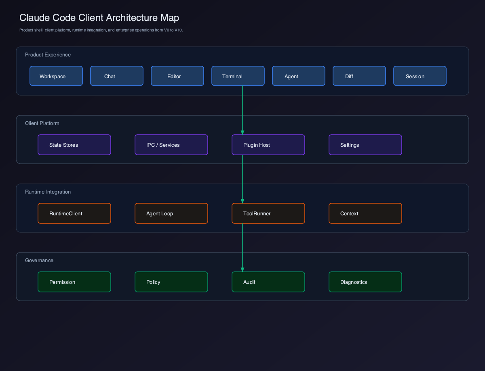

# Claude Code Client 全景架构图



源码图：[`./assets/claude-code-client-architecture-map.svg`](./assets/claude-code-client-architecture-map.svg)

## 分层

| 层级 | 内容 |
| --- | --- |
| 用户体验层 | Workspace、Chat、Editor、Terminal、Agent Workspace、Diff、Session |
| Client Platform | State Stores、IPC / Services、Plugin Host、Settings |
| Runtime Integration | RuntimeClient、Agent Loop、ToolRunner、Context |
| Governance | Permission、Policy、Audit、Diagnostics |

## 演化路线

```text
V0 Runtime Integration
  -> V1 Chat Client
  -> V2 Workspace
  -> V3 File Tree
  -> V4 Editor
  -> V5 Terminal
  -> V6 Agent Workspace
  -> V7 Diff & Patch
  -> V8 Multi Session
  -> V9 Plugin System
  -> V10 Enterprise Client
```

