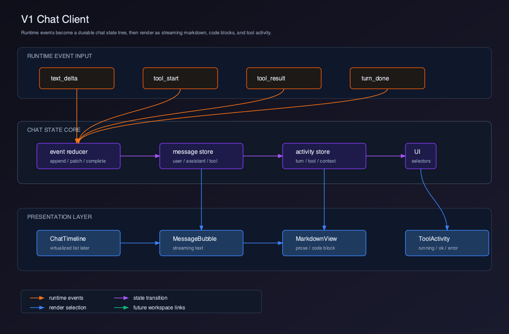
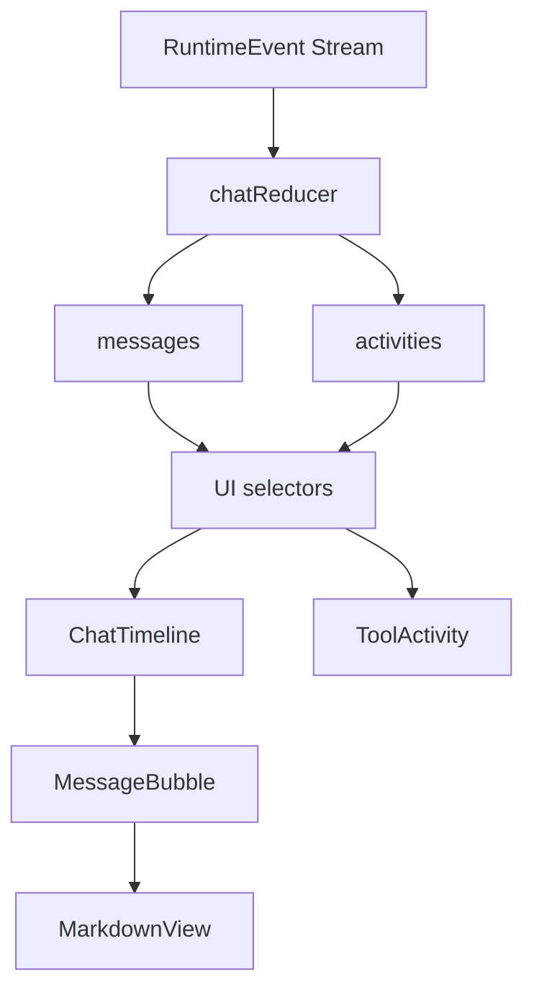

# V1 - Chat Client

V0 已经把 Runtime 接入 Client。V1 的目标是把 `RuntimeEvent` 变成一个可用的基础 Chat Client。

这个版本比 V0 大，所以拆成 4 个章节：

| 章节 | 主题 | 解决的问题 |
| --- | --- | --- |
| 01 | [事件状态模型](./01-event-state-model/README.md) | Runtime 事件如何变成稳定 UI 状态 |
| 02 | [流式消息渲染](./02-streaming-message-ui/README.md) | 如何实时显示 assistant 输出 |
| 03 | [Markdown 与代码块](./03-markdown-code-block/README.md) | 如何渲染可读的技术回答 |
| 04 | [Tool Activity](./04-tool-activity/README.md) | 如何展示 Agent 正在做什么 |

## 当前版本目标

V1 完成一个最小但真实可用的 Chat Client：

- 用户可以输入任务。
- Assistant 文本可以流式追加。
- Markdown、列表、代码块可以正确展示。
- 工具调用可以显示运行中、成功、失败。
- 当前轮次、上下文变化、会话信息可以在界面中展示。

V1 仍然不是完整 AI IDE。它暂时不做 Workspace、File Tree、Editor、Terminal、Diff，也不做多会话管理。

## 用户价值

V0 的用户只能看到事件流。V1 的用户可以获得连续对话体验：

```text
输入任务
  -> 看到 assistant 正在输出
  -> 看到工具正在执行
  -> 看到工具结果影响回答
  -> 得到一次完整任务回复
```

这一步非常关键。Cursor、Claude Code Client、Windsurf 这类产品并不是先有复杂 IDE，再有 Chat。它们都需要先把 Agent 的执行过程变成用户能理解的界面。

## 当前能力矩阵

| 用户能力 | Client 能力 | Runtime 能力 | V1 状态 |
| --- | --- | --- | --- |
| 输入任务 | Prompt Composer | `RuntimeClient.send()` | 已实现 |
| 查看流式回答 | Streaming Message | `text_delta` | 已实现 |
| 查看代码回答 | Markdown / Code Block | assistant text | 已实现 |
| 查看工具执行 | Tool Activity | `tool_start` / `tool_result` | 已实现 |
| 查看轮次状态 | Turn Indicator | `turn_start` / `turn_complete` | 已实现 |
| 查看上下文变化 | Context Badge | `context_update` | 已实现 |
| 中断生成 | Stop Button | Runtime abort | 后续实现 |
| 附加文件上下文 | Attachment | file context | V2/V3 后续实现 |
| 将代码应用到文件 | Apply Patch | diff / patch | V7 后续实现 |

## 可运行交付物

V1 必须在 V0 shell 上交付一个真实可用的 Chat 页面。

本版本完成时，读者应该已经改完这些文件：

```text
src/renderer/chat/types.ts
src/renderer/chat/chatReducer.ts
src/renderer/chat/runtimeEventToChatAction.ts
src/renderer/chat/chatStore.ts
src/renderer/chat/selectors.ts
src/renderer/components/ChatScreen.tsx
src/renderer/components/ChatTimeline.tsx
src/renderer/components/MessageBubble.tsx
src/renderer/components/MarkdownView.tsx
src/renderer/components/CodeBlock.tsx
src/renderer/components/ToolActivityList.tsx
src/renderer/components/PromptComposer.tsx
```

在 Client 工程根目录运行：

```bash
pnpm dev
pnpm typecheck
pnpm test
```

可运行验收：

- 页面加载后能看到 `Claude Code Client` header、消息时间线和贴底输入框。
- 输入 `解释 package.json 的作用，并列出三条要点` 后，用户消息立即进入 `ChatState.messages` 并显示在 timeline。
- Runtime 返回 `text_delta` 时，同一个 assistant message 持续追加内容，气泡上能看到 streaming 状态，`done` 后变为 complete。
- 输入包含 Markdown 的回答时，列表、inline code、fenced code block 正常显示，代码块有语言标签和 Copy 按钮。
- Runtime 返回 `tool_start` / `tool_input` / `tool_result` 时，`ToolActivityList` 展示 running、success、error 三种状态和工具输入摘要。
- 同一轮执行期间输入框禁用，执行完成或失败后恢复；刷新页面不要求恢复 session，但一次运行内 message 和 activity 不能串位。

## 整体架构



源码图：[`../assets/v1-chat-client.svg`](../assets/v1-chat-client.svg)



## V1 项目结构

```text
claude-code-client/
  src/
    renderer/
      chat/
        types.ts
        chatReducer.ts
        runtimeEventToChatAction.ts
        chatStore.ts
        selectors.ts
      components/
        ChatScreen.tsx
        ChatTimeline.tsx
        MessageBubble.tsx
        MarkdownView.tsx
        CodeBlock.tsx
        ToolActivityList.tsx
        PromptComposer.tsx
```

## 版本设计原则

### 状态优先于组件

V1 不应该先画 UI，而应该先定义状态：

```text
RuntimeEvent
  -> ChatAction
  -> ChatState
  -> UI
```

如果直接在组件里处理事件，后续会出现三个问题：

- 流式文本和工具状态难以回放。
- 多会话切换时状态难以保存。
- Tool Activity、Diff、Session Timeline 无法共享同一批事件。

### Chat UI 不是普通聊天 UI

AI Coding Agent 的 Chat UI 和普通 Chat App 不同。它必须展示执行过程：

- 当前是第几轮。
- 模型调用了哪些工具。
- 工具是读文件、写文件，还是执行命令。
- 工具失败后模型有没有换方案。
- 上下文是否被压缩。

所以 V1 不能只做气泡。它必须同时建立 message timeline 和 activity timeline。

## 当前版本缺陷

V1 的缺陷包括：

- 没有项目级 Workspace，`cwd` 仍来自 V0。
- 没有文件树，工具结果不能定位到文件。
- 没有编辑器，代码块不能直接应用到文件。
- 没有 Diff Panel，`diff` 只能作为工具结果展示。
- 没有完整 Permission Dialog。
- 没有虚拟列表，长会话性能不是最终形态。

## 为什么需要 V2

V1 让用户能对话，但用户还不能“管理项目”。

AI Coding Agent Client 的核心场景不是孤立聊天，而是在一个真实项目里持续工作。V2 会引入 Workspace：

```text
Chat Client
  -> Project Workspace
  -> cwd / recent projects / project metadata
  -> per-project runtime context
```

从 V2 开始，Client 才从一个 Agent Chat 面板，进入 AI IDE 的项目工作区。
