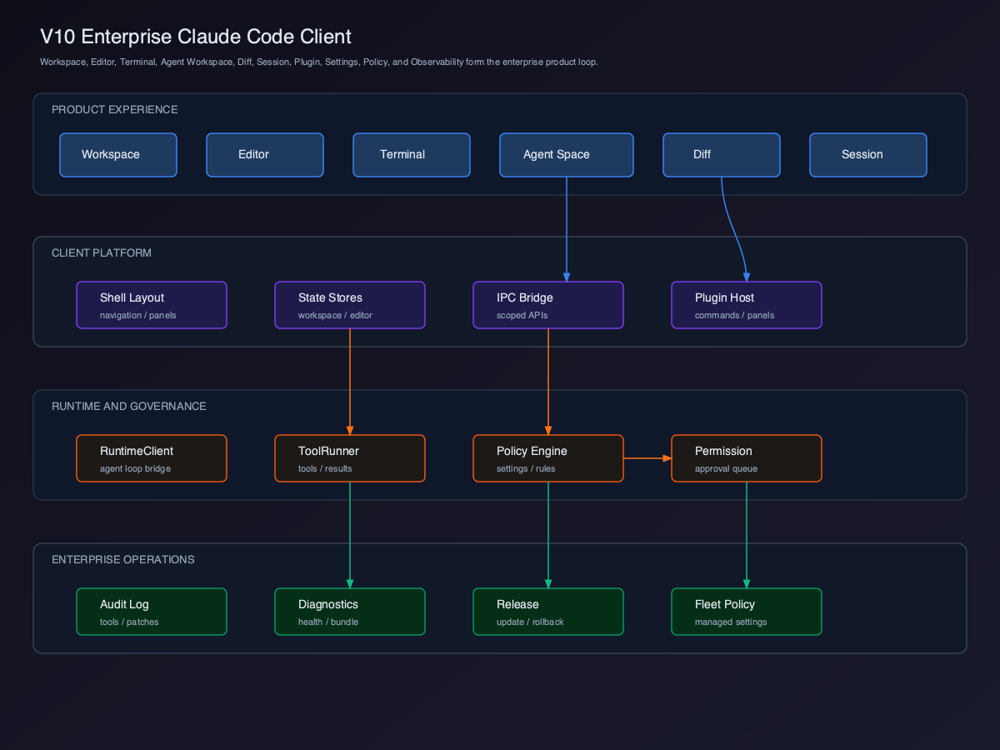

# V10 - Enterprise Claude Code Client

V10 是整个教程的收束版本。它不再新增单个局部能力，而是把 V0-V9 的模块整合成一个企业级 AI Coding Agent Client。

本版本的写法按 feature PR 组织：每一章都要有明确改动路径、可复用 fixture / fake event、service / store / UI 关键代码骨架，以及完成后马上能在 `pnpm dev` 里看到的 UI 效果。

## 章节拆分

| 章节 | 主题 | 本章可见 UI |
| --- | --- | --- |
| 01 | [产品壳与导航](./01-product-shell-navigation/README.md) | ProductShell 首屏、Settings / Permission / Audit / Performance / Release 入口 |
| 02 | [Settings 与 Policy](./02-settings-policy/README.md) | policy source badge、locked state、policy denied plugin |
| 03 | [权限治理](./03-permission-governance/README.md) | deny reason、ask / allow / deny 决策队列 |
| 04 | [Observability 与 Audit](./04-observability-audit/README.md) | audit rows、diagnostics download mock |
| 05 | [性能与韧性](./05-performance-resilience/README.md) | performance budget status、降级提示 |
| 06 | [发布、升级与回滚](./06-release-update/README.md) | release matrix、rollback target |
| 07 | [企业级架构闭环](./07-enterprise-architecture-closure/README.md) | closure checklist UI、端到端治理状态 |

## 当前版本目标

V10 完成企业级闭环：

- 统一 ProductShell navigation。
- 统一 Settings / Policy merge fixture。
- 统一 Permission Governance fake decisions。
- 统一 Audit / Diagnostics fixture。
- 统一 Performance dashboard fixture。
- 统一 Release compatibility matrix fixture。
- 统一 closure checklist UI。

每章都必须能在没有真实企业后端时，用本地 fixture 或 fake event 跑出可见 UI。真实后端只是在这些 service 边界之后替换数据来源，不能改变 UI、store 和 smoke check 的验收方式。

## 推荐示例目录

V10 章节里的代码骨架都落在示例 Client 的 `src/enterprise/*` 和 `src/product-shell/*` 下：

```text
src/product-shell/
  ProductShell.tsx
  productShellStore.ts
  navigation.fixture.ts

src/enterprise/
  settings/
  permissions/
  observability/
  performance/
  release/
  closure/
```

这些路径是教学示例的目标路径。每一章 README 都会写清楚本章要创建或修改的 service、store、UI 和 fixture 文件。

## 用户价值

V10 的价值不是“再加一个功能”，而是把前面所有模块变成企业可采用的产品：

- 管理员可以用 Policy 控制模型、工具、插件、权限和发布策略。
- 开发者可以在一个 Shell 内完成项目、编辑、终端、Agent、Diff、Session 的闭环工作。
- 支持团队可以通过诊断包和审计事件定位问题，同时避免泄露 secrets。
- 企业可以通过发布、升级、回滚和兼容性策略降低桌面 Client 的运维风险。

## 整体架构



源码图：[`../assets/v10-enterprise-client.svg`](../assets/v10-enterprise-client.svg)

## 能力闭环

| 层级 | 已完成能力 |
| --- | --- |
| Runtime Integration | V0 |
| Chat Client | V1 |
| Workspace | V2 |
| File Tree | V3 |
| Editor | V4 |
| Terminal | V5 |
| Agent Workspace | V6 |
| Diff & Patch | V7 |
| Multi Session | V8 |
| Plugin System | V9 |
| Enterprise Operations | V10 |

## 当前能力矩阵

| 用户能力 | Client 能力 | 企业治理能力 | V10 状态 |
| --- | --- | --- | --- |
| 统一工作入口 | Product Shell | navigation policy | 章节 01 骨架 |
| 配置工作方式 | Settings Center | user / project / enterprise policy | 章节 02 骨架 |
| 控制危险操作 | Permission Governance | allow / ask / deny | 章节 03 骨架 |
| 追踪 Agent 行为 | Observability | diagnostics package | 章节 04 骨架 |
| 审计关键事件 | Audit Trail | redacted event stream | 章节 04 骨架 |
| 承受大项目 | Performance / Resilience | degradation strategy | 章节 05 骨架 |
| 发布桌面 Client | Release / Update | rollback / compatibility | 章节 06 骨架 |
| 判断是否闭环 | Closure Checklist | policy / audit / recovery coverage | 章节 07 骨架 |

## 可运行交付物

V10 必须交付企业级治理闭环，而不是只列出 Settings 页面。

本版本完成后，读者应该能运行：

```bash
pnpm dev
pnpm typecheck
pnpm test
```

最小验收：

- ProductShell 默认进入 workspace，不是介绍页。
- Settings 能区分 default、user、project、enterprise policy，并显示 policy source badge。
- enterprise policy 能锁定 dangerous mode、plugin source、tool permission。
- Permission decision 会显示 deny reason，并生成 redacted audit event。
- Audit Trail 至少显示 tool、permission、plugin policy denied 三类 audit rows。
- Diagnostics bundle download mock 可点击，且预览不包含 `.env`、private key、未脱敏 terminal output。
- Performance dashboard 显示 budget status：pass / degraded / failed。
- Release compatibility matrix 能解释 Client / Runtime / Plugin / Session / Audit 兼容关系。
- Closure checklist UI 能逐项显示 Policy / Audit / Recovery 是否覆盖。

## 当前版本缺陷

V10 仍然是教学版企业架构，不等于完整商业产品。

未覆盖：

- 多租户控制台。
- 云端 fleet management。
- 远程后台 session。
- 法务级合规报表。
- 完整 marketplace supply chain。

## 教程结束输出

- [Claude Code Client 全景架构图](../claude-code-client-architecture-map.md)
- [Claude Code Client 源码阅读路线图](../claude-code-client-source-reading-roadmap.md)

## 后续深化预告

主线 V0-V10 已收束。后续更适合按专题深化：

- 可运行示例项目。
- Marketplace / supply chain。
- Remote session。
- Multi-agent workspace。
- Enterprise admin console。
