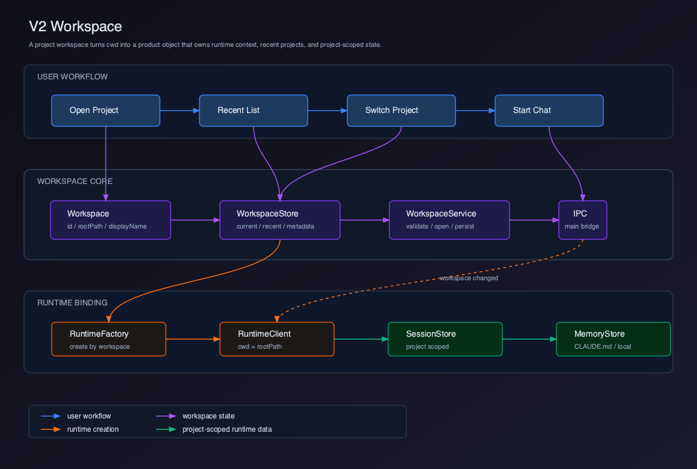
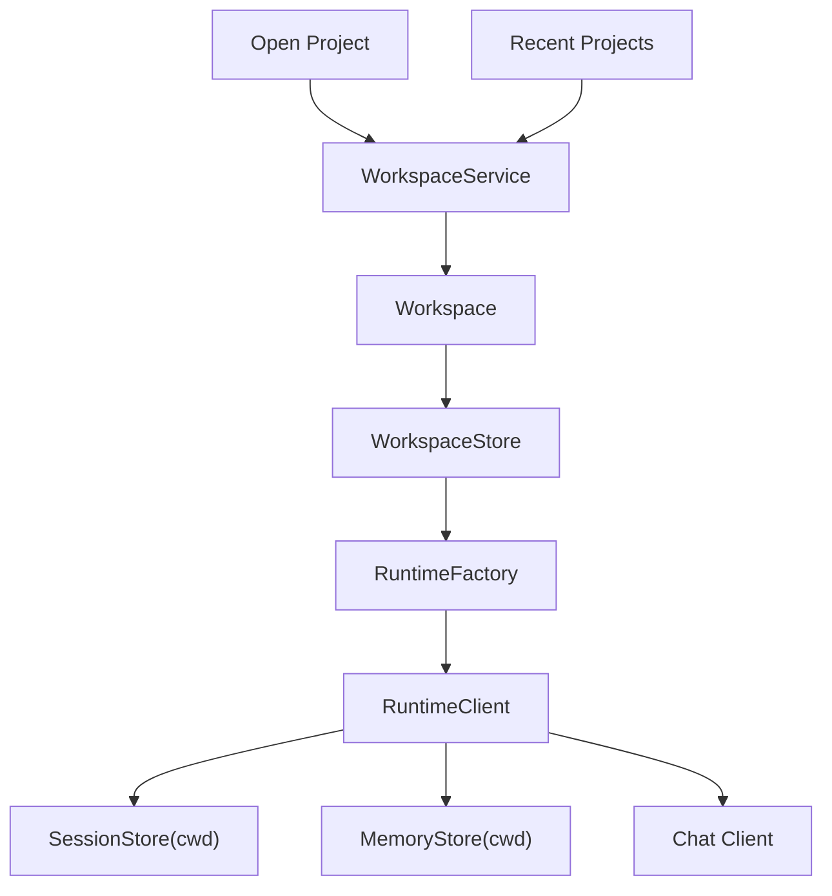

# V2 - Workspace

V1 已经实现基础 Chat Client。V2 要把这个 Chat Client 放进真实项目里，让 `cwd` 从一个启动参数升级为产品级 Workspace。

这个版本拆成 4 个章节：

| 章节 | 主题 | 解决的问题 |
| --- | --- | --- |
| 01 | [Workspace 概念模型](./01-workspace-domain-model/README.md) | Workspace 到底是什么，不是什么 |
| 02 | [打开项目与最近项目](./02-open-project-recent-list/README.md) | 用户如何进入一个项目 |
| 03 | [Workspace Store](./03-workspace-store/README.md) | 如何管理当前项目和最近项目状态 |
| 04 | [Runtime Context 绑定](./04-runtime-context-binding/README.md) | Workspace 如何驱动 Runtime 的 cwd、session、memory |

## 当前版本目标

V2 完成以下能力：

- 用户可以打开一个本地项目目录。
- Client 可以保存最近打开项目。
- UI 可以展示当前 Workspace。
- Runtime 创建时使用 Workspace root 作为 `cwd`。
- Session、Memory、权限边界都能按项目隔离。

V2 不实现文件树。文件树属于 V3，因为文件树不仅要知道 Workspace root，还要解决目录扫描、忽略规则、搜索和文件选择。

## 用户价值

V1 的 Chat 仍然像一个“带 Agent 的对话框”。V2 开始，它变成“在项目里工作的 Agent”。

用户获得的变化是：

- 不需要每次启动都手动传 `--cwd`。
- 可以从最近项目快速回到工作区。
- Agent 明确知道当前项目根目录。
- 会话和记忆可以跟项目绑定。
- 后续文件树、编辑器、终端都有了共同的项目上下文。

## 当前能力矩阵

| 用户能力 | Client 能力 | Runtime 能力 | V2 状态 |
| --- | --- | --- | --- |
| 打开项目 | Open Project | `cwd` | 已实现 |
| 查看当前项目 | Workspace Header | runtime context | 已实现 |
| 最近项目 | Recent Projects | project metadata | 已实现 |
| 切换项目 | Switch Workspace | recreate RuntimeClient | 已实现 |
| 项目级会话 | Project Session Scope | `SessionStore(cwd)` | 建立边界 |
| 项目级记忆 | Project Memory Scope | `MemoryStore(cwd)` | 建立边界 |
| 浏览文件 | File Tree | `read_file` | V3 实现 |
| 项目搜索 | Code Search | grep / file index | V3 实现 |

## 可运行交付物

V2 必须让 Client 从“聊天页面”变成“项目内工作的 Client”。

本版本完成时，读者应该已经改完这些文件：

```text
src/main/workspace/WorkspaceService.ts
src/main/workspace/workspaceStorage.ts
src/main/workspace/workspaceValidation.ts
src/main/runtime/createRuntimeClientForWorkspace.ts
src/main/ipc/workspaceIpc.ts
src/preload/workspaceApi.ts
src/renderer/workspace/types.ts
src/renderer/workspace/workspaceStore.ts
src/renderer/workspace/workspaceActions.ts
src/renderer/workspace/selectors.ts
src/renderer/components/WorkspaceShell.tsx
src/renderer/components/WorkspaceHeader.tsx
src/renderer/components/OpenProjectButton.tsx
src/renderer/components/RecentProjectList.tsx
src/renderer/runtime/RuntimeProvider.tsx
```

在 Client 工程根目录运行：

```bash
pnpm dev
pnpm typecheck
pnpm test
```

可运行验收：

- 初次启动没有 current workspace 时，`WorkspaceShell` 显示打开项目入口和最近项目列表。
- 点击 `Open Project` 后，由 main 侧目录选择器选择项目，renderer 只调用 `window.workspace.openProject()`，不直接读文件系统。
- 打开成功后，`WorkspaceHeader` 显示 `displayName`、`rootPath`、package manager / git 状态等轻量 metadata。
- 最近项目写入 `workspaceStorage`，重启后 `RecentProjectList` 仍能看到，重复打开同一路径不会出现重复记录。
- 选择最近项目或切换项目后，`RuntimeProvider` 重建 Runtime，Chat header 中的 `cwd` 变为新 workspace root。
- 输入 `输出当前工作目录` 后，Runtime 上下文里的 cwd 与 Header 展示的 root path 一致。
- 非目录、不可读路径或 workspace 外路径不会进入 current workspace，UI 展示明确错误。

## 整体架构



源码图：[`../assets/v2-workspace.svg`](../assets/v2-workspace.svg)



## V2 项目结构

```text
claude-code-client/
  src/
    main/
      workspace/
        WorkspaceService.ts
        workspaceStorage.ts
        workspaceValidation.ts
      runtime/
        createRuntimeClientForWorkspace.ts
      ipc/
        workspaceIpc.ts
    renderer/
      workspace/
        types.ts
        workspaceStore.ts
        workspaceActions.ts
        selectors.ts
      components/
        WorkspaceShell.tsx
        WorkspaceHeader.tsx
        OpenProjectButton.tsx
        RecentProjectList.tsx
```

## 设计原则

### Workspace 不是 cwd 字符串

`cwd` 是 Runtime 执行参数。Workspace 是产品对象。

Workspace 至少包含：

```text
id
rootPath
displayName
openedAt
lastActiveAt
metadata
```

后续它还会承载：

- 文件树状态。
- 打开的编辑器 tab。
- 当前会话。
- 终端实例。
- 项目配置。
- 企业策略。

### Runtime 由 Workspace 驱动

V0 的 `createRuntimeClient(cwd)` 是临时设计。V2 要升级为：

```ts
createRuntimeClientForWorkspace(workspace)
```

这样 Runtime 的 cwd、SessionStore、MemoryStore、PluginContext 都来自同一个 Workspace 对象。

## 当前版本缺陷

V2 的缺陷是：

- 只能打开项目，还不能浏览文件。
- 没有项目搜索。
- 没有编辑器 tab。
- 切换项目时采用重建 Runtime 的简单策略。
- 最近项目只保存轻量 metadata，不做复杂健康检查。
- 没有多窗口 Workspace 隔离。

这些缺陷会在后续版本逐步解决。

## V3 预告

V3 会实现 File Tree。

V2 已经建立 Workspace root。V3 会基于这个 root 增加：

```text
Workspace
  -> File Tree
  -> ignore rules
  -> file search
  -> open file request
```

到 V3，用户才真正能从项目结构里选择文件，让 Agent Chat 和项目文件产生第一层可视化联动。
