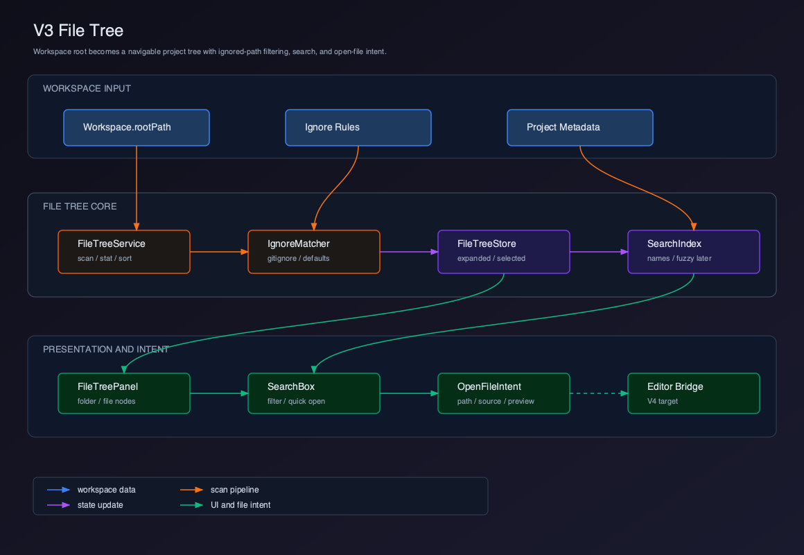
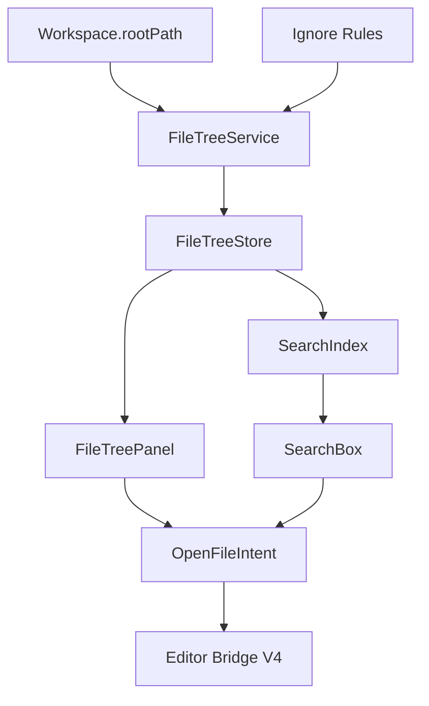

# V3 - File Tree

V2 已经建立 Workspace。V3 要基于 `Workspace.rootPath` 实现 File Tree，让用户看到项目结构，并能从项目结构中选择文件。

这个版本拆成 5 个章节：

| 章节 | 主题 | 解决的问题 |
| --- | --- | --- |
| 01 | [文件树领域模型](./01-file-tree-domain-model/README.md) | 文件树节点、路径、选中状态如何建模 |
| 02 | [目录扫描与忽略规则](./02-directory-scan-ignore-rules/README.md) | 如何安全、快速地扫描项目目录 |
| 03 | [FileTree Store](./03-file-tree-store/README.md) | 如何管理展开、选中、加载和错误状态 |
| 04 | [文件搜索](./04-file-search/README.md) | 如何在项目文件名中快速定位 |
| 05 | [打开文件意图](./05-open-file-intent/README.md) | 如何把点击文件转成 V4 Editor 可消费的请求 |

## 当前版本目标

V3 完成以下能力：

- 在当前 Workspace 中显示项目文件树。
- 支持展开和折叠目录。
- 遵守基础忽略规则，避免展示 `node_modules`、`.git`、构建产物。
- 支持按文件名搜索。
- 点击文件后产生 `OpenFileIntent`。

V3 不实现 Monaco Editor。点击文件后只产生打开意图，真正编辑器在 V4 实现。

## 用户价值

V2 让用户进入项目。V3 让用户理解项目。

用户获得的变化：

- 能看到项目目录结构。
- 能通过文件树选择文件。
- 能用搜索快速定位文件。
- Agent 的工具结果和用户选择路径之间有了共同语言。
- V4 Editor 有了明确的文件打开入口。

## 当前能力矩阵

| 用户能力 | Client 能力 | Runtime 能力 | V3 状态 |
| --- | --- | --- | --- |
| 浏览目录 | File Tree | `cwd` / file system | 已实现 |
| 展开目录 | Tree Expansion | directory scan | 已实现 |
| 选择文件 | File Selection | path inside cwd | 已实现 |
| 搜索文件 | File Search | project file names | 已实现 |
| 打开文件 | OpenFileIntent | `read_file` 对应路径 | 建立桥接 |
| 编辑文件 | Editor Tab | `edit_file` | V4 实现 |
| 展示 Diff | Diff Viewer | `ToolResult.diff` | V7 实现 |

## 可运行交付物

V3 必须交付可操作的项目文件导航。

本版本完成时，读者应该已经改完这些文件：

```text
src/main/file-tree/FileTreeService.ts
src/main/file-tree/ignoreMatcher.ts
src/main/file-tree/scanDirectory.ts
src/main/ipc/fileTreeIpc.ts
src/preload/fileTreeApi.ts
src/renderer/file-tree/types.ts
src/renderer/file-tree/fileTreeStore.ts
src/renderer/file-tree/fileTreeActions.ts
src/renderer/file-tree/selectors.ts
src/renderer/file-tree/searchFiles.ts
src/renderer/file-tree/openFileIntent.ts
src/renderer/components/FileTreePanel.tsx
src/renderer/components/FileTreeNode.tsx
src/renderer/components/FileSearchBox.tsx
```

在 Client 工程根目录运行：

```bash
pnpm dev
pnpm typecheck
pnpm test
```

可运行验收：

- 打开 workspace 后，`FileTreeService.loadTree()` 通过 `scanDirectory()` 返回 root node，左侧 `FileTreePanel` 显示项目文件树。
- `.git`、`node_modules`、`dist`、`coverage` 等目录被 `ignoreMatcher` 跳过，不会出现在 UI 和搜索结果里。
- 根目录默认展开；点击目录只切换 `expandedNodeIds`，点击文件更新 `selectedNodeId`。
- 搜索框输入 `package`、`main`、`App` 时，`searchFiles()` 基于已加载节点返回文件名和相对路径结果。
- 点击文件树文件会记录 `OpenFileIntent { source: "file-tree", preview: true }`；点击搜索结果会记录 `source: "file-search", preview: false`。
- intent 日志只包含 `workspaceId` 和 `relativePath`，不会把 workspace 绝对路径传给 V4 Editor 入口。
- 尝试构造 `../outside.ts` 这类路径时，main 侧路径校验拒绝，不能打开 workspace 外文件。

## 整体架构



源码图：[`../assets/v3-file-tree.svg`](../assets/v3-file-tree.svg)



## V3 项目结构

```text
claude-code-client/
  src/
    main/
      file-tree/
        FileTreeService.ts
        ignoreMatcher.ts
        scanDirectory.ts
      ipc/
        fileTreeIpc.ts
    renderer/
      file-tree/
        types.ts
        fileTreeStore.ts
        fileTreeActions.ts
        selectors.ts
        searchFiles.ts
      components/
        FileTreePanel.tsx
        FileTreeNode.tsx
        FileSearchBox.tsx
```

## 设计原则

### File Tree 是 Client 能力，不是 Runtime 工具

Runtime 的 `read_file` 负责让 Agent 读取文件。File Tree 负责让用户浏览项目。

二者都处理路径，但职责不同：

| 模块 | 关注点 |
| --- | --- |
| File Tree | 用户可视化浏览、选择、搜索 |
| `read_file` | Agent 工具读取、权限和大小限制 |
| `edit_file` | Agent 修改文件、读后写保护、diff |

不要让 File Tree 绕过 Runtime 的安全边界。即使文件树能看到某个文件，Agent 工具执行时仍然要经过 Runtime 的路径、权限和 sandbox 校验。

### 不一次扫描整个世界

教学版可以扫描项目树，但要有边界：

- 限制最大节点数。
- 默认忽略大目录。
- 目录按需展开。
- 搜索只基于已加载节点，或使用轻量索引。

生产实现还要考虑文件监听、增量更新、虚拟列表和符号链接。

## 当前版本缺陷

V3 的缺陷：

- 没有真实编辑器，只产生 `OpenFileIntent`。
- 搜索主要面向文件名，不做全文搜索。
- 不做文件监听。
- 不做大型 monorepo 的完整性能优化。
- 不做路径和工具结果的自动高亮联动。

## V4 预告

V4 会实现 Editor。

V3 的 `OpenFileIntent` 会成为 V4 的入口：

```text
FileTree / Search
  -> OpenFileIntent
  -> Editor Tab
  -> Monaco Editor
  -> dirty state / save
```

到 V4，用户才能真正打开文件、查看代码、编辑内容，并和 Agent 的文件操作形成更完整的产品闭环。
