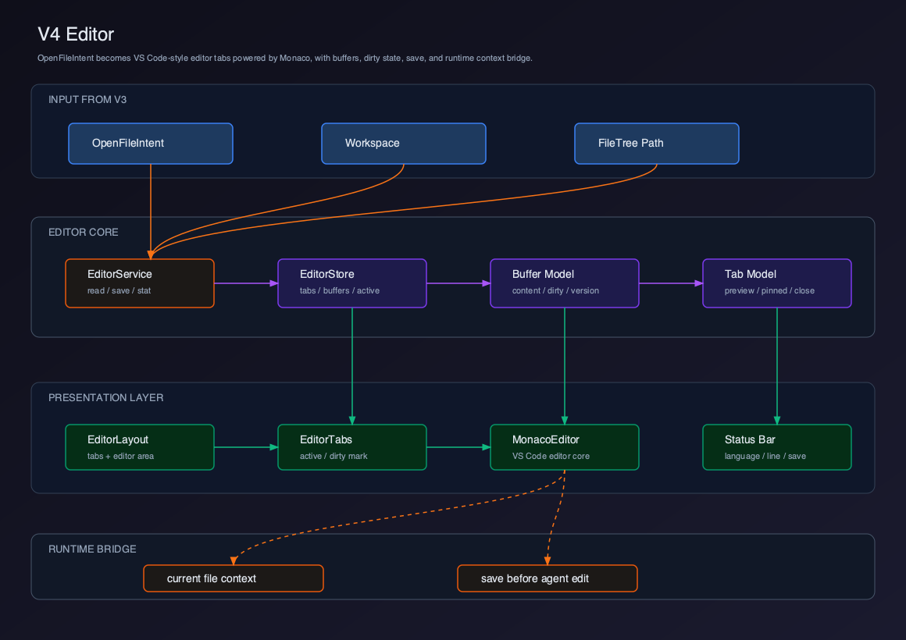
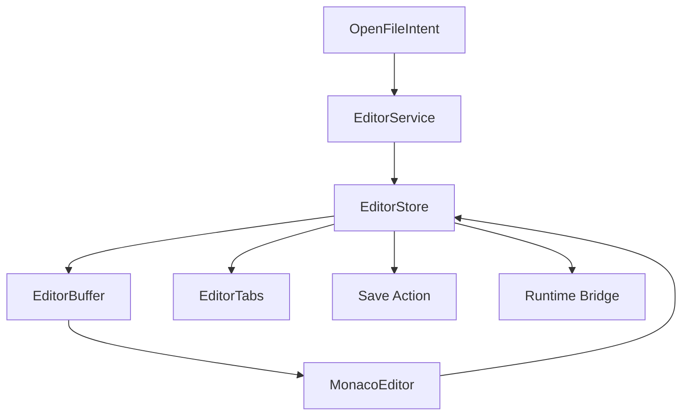

# V4 - Editor

V3 已经实现 File Tree，并通过 `OpenFileIntent` 表达“用户想打开某个文件”。V4 要实现真正的代码编辑器。

## 选型结论

V4 的教学实现选择：

```text
Monaco Editor
```

原因是主流 AI Coding Client 的编辑体验基本沿着 VS Code / Monaco 这一条线演进：

- Cursor 官方文档说明 Cursor 是 VS Code fork，保留熟悉的编辑体验。
- Claude Code 官方平台文档强调 CLI、Desktop、VS Code、JetBrains 等平台和 IDE 集成；也就是说 Claude Code 的主流编辑器体验来自现有 IDE，而不是自造一个文本编辑器。
- VS Code 编辑器核心就是 Monaco；如果我们从 0 到 1 教学实现企业级 Client，Monaco 是最合适的第一步。

生产级演进可以有两条路线：

| 路线 | 适用场景 |
| --- | --- |
| Monaco Editor | 教学版、自研 Client、快速构建核心编辑体验 |
| Code OSS / VS Code Workbench / Theia | 需要 VS Code 级 workbench、扩展系统、复杂语言服务 |

本教程 V4 使用 Monaco，但会按 VS Code 风格设计 buffer、tab、dirty state 和 save 流程，避免走向普通 textarea 编辑器。

参考资料：

- [Cursor - Migrate from VS Code](https://cursordocs.com/en/docs/get-started/migrate-from-vscode)
- [Claude Code - Platforms and integrations](https://code.claude.com/docs/en/platforms)
- [Microsoft Monaco Editor](https://github.com/microsoft/monaco-editor)

## 章节拆分

| 章节 | 主题 | 解决的问题 |
| --- | --- | --- |
| 01 | [主流选型与架构边界](./01-editor-selection-mainstream/README.md) | 为什么选 Monaco，生产版如何演进 |
| 02 | [Editor 领域模型](./02-editor-domain-model/README.md) | Buffer、Tab、Selection 如何建模 |
| 03 | [文件加载与 Buffer](./03-file-loading-buffer/README.md) | 如何从 OpenFileIntent 读取文件 |
| 04 | [Monaco 集成](./04-monaco-integration/README.md) | 如何接入 Monaco Editor |
| 05 | [Tabs、Dirty State 与 Save](./05-tabs-dirty-save/README.md) | 如何管理多标签和保存 |
| 06 | [Editor 与 Runtime Bridge](./06-editor-runtime-bridge/README.md) | 编辑器如何和 Agent Runtime 建立边界 |

## Feature PR 边界

V4 应该作为一个独立 feature PR 合入：`feat(client): add monaco editor workspace`。

这个 PR 不只安装 Monaco，而是交付一条可运行链路：

```text
FileTree OpenFileIntent
  -> main EditorService.readFile / saveFile
  -> editor IPC
  -> preload window.clientEditor
  -> renderer editorStore
  -> Monaco model
  -> dirty tab
  -> save back to workspace file
  -> EditorRuntimeBridge exposes active file context
```

评审时按功能切片看，而不是按“文档章节”看：读者照着 V4 做完后，应能在 Electron Client 里从文件树打开真实文件、编辑、保存，并在 Agent context 面板或调试日志看到当前打开文件。

## 当前版本目标

V4 完成以下能力：

- 接收 V3 的 `OpenFileIntent`。
- 读取文件内容并创建 editor buffer。
- 使用 Monaco Editor 展示代码。
- 支持多标签页、预览 tab、固定 tab。
- 支持 dirty state 和保存。
- 为 Agent 提供“当前打开文件”上下文桥，但不自动把编辑器内容交给模型。

## 用户价值

- 用户可以从文件树进入真实代码编辑，而不是只看 Chat 文本。
- 多标签、dirty state 和保存流程让 Client 接近主流 IDE 使用习惯。
- 当前文件上下文桥为后续 Agent 读写代码提供稳定入口。
- Monaco 选型让教学版和主流 AI Coding Client 的编辑体验保持一致。

## 当前能力矩阵

| 用户能力 | Client 能力 | Runtime 能力 | V4 状态 |
| --- | --- | --- | --- |
| 打开文件 | Editor Tab | file read service | 已实现 |
| 阅读代码 | Monaco Editor | syntax mode | 已实现 |
| 编辑代码 | Buffer Model | local file content | 已实现 |
| 保存文件 | Save Action | file write service | 已实现 |
| 多文件切换 | Editor Tabs | buffer map | 已实现 |
| 当前文件上下文 | Editor Runtime Bridge | prompt context later | 建立边界 |
| 命令执行 | Terminal | `run_command` | V5 实现 |
| Agent 修改审查 | Diff Viewer | `ToolResult.diff` | V7 实现 |

## 整体架构



源码图：[`../assets/v4-editor.svg`](../assets/v4-editor.svg)



## V4 项目结构

```text
claude-code-client/
  src/
    main/
      editor/
        EditorService.ts
        editorPath.ts
      ipc/
        editorIpc.ts
      index.ts
    preload/
      editorApi.ts
    renderer/
      editor/
        types.ts
        editorStore.ts
        editorActions.ts
        selectors.ts
        language.ts
        editorRuntimeBridge.ts
      components/
        EditorLayout.tsx
        EditorTabs.tsx
        MonacoCodeEditor.tsx
        EditorStatusBar.tsx
        EditorContextDebug.tsx
```

## 安装依赖

教学版推荐：

```bash
pnpm add monaco-editor @monaco-editor/react
```

如果项目已经使用 Vite，需要处理 Monaco worker。V4 会在 Monaco 集成章节说明。

## 可运行交付物

V4 必须交付一个能真实打开、编辑、保存文件的 Monaco Editor 切片。

本版本完成后，读者应该能运行：

```bash
pnpm add monaco-editor @monaco-editor/react
pnpm dev
pnpm typecheck
pnpm test
```

Electron Client smoke 操作：

1. 启动 Client，打开一个 workspace。
2. 在 V3 File Tree 单击 `package.json`，看到 Monaco tab 打开，状态栏显示 `json`、行列信息和 `Saved`。
3. 再打开一个 `.ts` 或 `.tsx` 文件，两个 tab 可切换，Monaco model 不串内容。
4. 修改当前文件，tab 出现 dirty marker，状态栏变成 `Unsaved`。
5. 按 `Cmd/Ctrl+S` 保存，文件写回磁盘，dirty marker 消失。
6. 打开 Agent context/debug 区，看到 `activeFile.relativePath`、`openFiles` 和 dirty 状态，不出现完整文件内容。

最小验收：

- 从 V3 `OpenFileIntent` 打开文件。
- Monaco 使用 `path`、`languageId`、`content` 创建 editor model。
- 修改内容后 tab 显示 dirty marker。
- 保存后写回 workspace 内文件，dirty marker 消失。
- 打开两个文件后切换 tab 不丢内容。
- workspace 外路径必须被拒绝。

## 当前版本缺陷

V4 不是完整 VS Code Workbench：

- 没有 VS Code 扩展市场。
- 没有完整 LSP 管理。
- 没有 debug adapter。
- 没有内置 terminal。
- 没有复杂 split editor layout。
- 没有 Agent diff review。

这些能力会在后续版本逐步演进。

## V5 预告

V5 会实现 Terminal。

Editor 让用户能看和改代码，但 coding workflow 还缺运行命令：

```text
Editor
  -> save file
  -> Terminal
  -> run tests / build / dev server
  -> Agent observes command result
```

V5 会接入 PTY、Shell、实时输出和 Terminal Panel。
