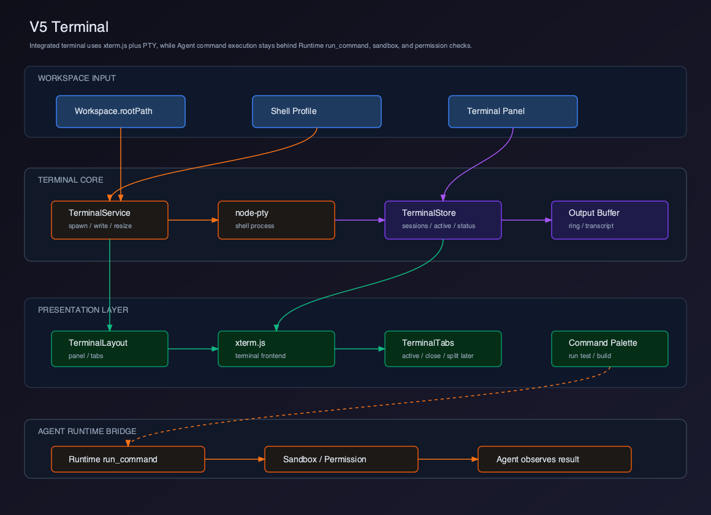
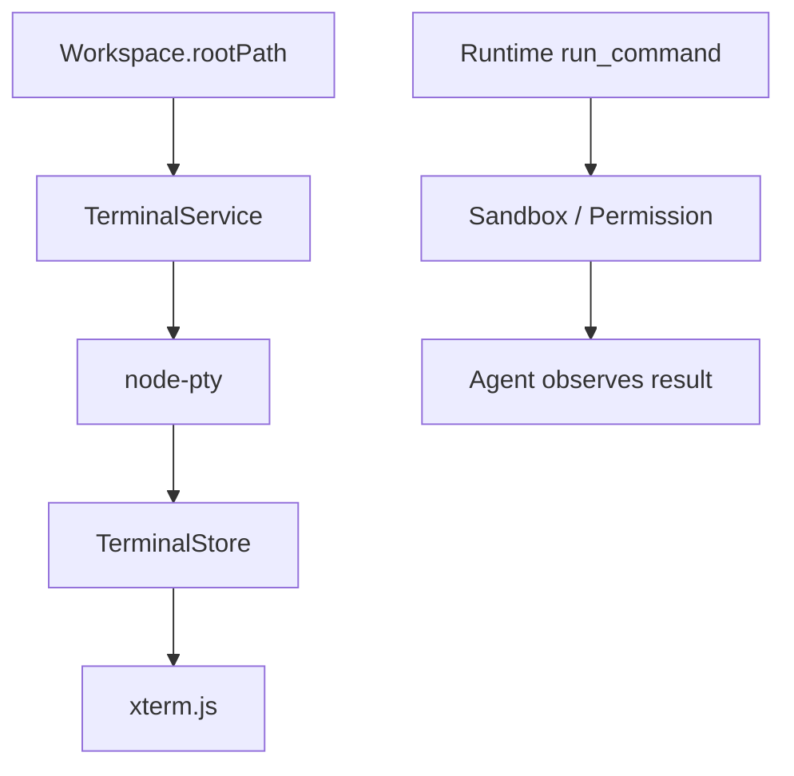

# V5 - Terminal

V4 已经实现 Editor。V5 要实现 Terminal，让用户能在 Client 中运行测试、构建、开发服务，并让 Agent 的命令执行结果有可视化落点。

## 选型结论

V5 的教学实现选择：

```text
xterm.js + node-pty
```

原因：

- VS Code 集成终端路线使用 xterm.js 作为终端前端。
- xterm.js 官方说明它是 Web 终端前端组件，并被 VS Code 及其 forks、Hyper、Tabby 等项目使用。
- `node-pty` 提供伪终端能力，可以连接真实 shell，让 `bash`、`zsh`、`fish`、`vim`、`tmux` 等终端程序表现接近真实终端。

参考资料：

- [xterm.js](https://github.com/xtermjs/xterm.js/)

## 关键边界

V5 必须区分两个概念：

| 路径 | 用途 | 是否给 Agent 直接使用 |
| --- | --- | --- |
| 用户 Terminal | 用户交互式 shell，走 PTY | 否 |
| Runtime `run_command` | Agent 工具执行命令，走 sandbox 和 permission | 是 |

不要让 Agent 直接往用户 Terminal 里输入命令。Agent 执行命令必须经过 Runtime 的 `run_command`、Sandbox、权限审批和输出截断。

## 章节拆分

| 章节 | 主题 | 解决的问题 |
| --- | --- | --- |
| 01 | [Terminal 选型与边界](./01-terminal-selection-boundary/README.md) | 为什么选择 xterm.js + node-pty |
| 02 | [PTY Service](./02-pty-service/README.md) | 如何在主进程创建和管理 shell |
| 03 | [Terminal Store](./03-terminal-store/README.md) | 如何管理 terminal session 状态 |
| 04 | [xterm.js 集成](./04-xterm-integration/README.md) | 如何渲染终端和处理输入输出 |
| 05 | [命令执行与实时输出](./05-command-execution-streaming/README.md) | 如何运行命令、记录输出、处理退出 |
| 06 | [Terminal 与 Runtime Bridge](./06-terminal-runtime-bridge/README.md) | 如何和 Agent `run_command` 建立边界 |

## Feature PR 边界

V5 应该作为一个独立 feature PR 合入：`feat(client): add integrated terminal`。

这个 PR 交付的是一条真实 PTY 链路：

```text
Terminal panel
  -> xterm.js input
  -> preload window.clientTerminal.writeTerminal
  -> main terminal IPC
  -> TerminalService
  -> node-pty shell in Workspace.rootPath
  -> PTY data event
  -> renderer terminalStore transcript
  -> xterm.js output
```

同时必须保留 Agent 命令边界：

```text
Agent tool_use run_command
  -> Runtime permission / sandbox
  -> structured stdout/stderr/exitCode
```

V5 不允许把 Agent 命令直接写入用户 terminal。

## 当前版本目标

V5 完成以下能力：

- 打开项目后创建 Terminal session。
- Terminal cwd 来自 `Workspace.rootPath`。
- 使用 xterm.js 渲染终端。
- 使用 node-pty 连接真实 shell。
- 支持输入、输出、resize、关闭。
- 支持从 UI 触发常用命令。
- 建立 Terminal 和 Runtime `run_command` 的清晰边界。

## 用户价值

- 用户可以在 Client 内完成测试、构建、启动服务等日常命令。
- 终端 cwd 与 Workspace 绑定，避免命令跑到错误项目。
- Agent 命令和用户交互式终端分离，降低误执行风险。
- 命令输出为后续 Agent Workspace 和 Audit 提供可视化落点。

## 当前能力矩阵

| 用户能力 | Client 能力 | Runtime 能力 | V5 状态 |
| --- | --- | --- | --- |
| 打开终端 | Terminal Panel | workspace cwd | 已实现 |
| 输入命令 | xterm.js input | PTY write | 已实现 |
| 查看实时输出 | Output Stream | PTY data | 已实现 |
| 调整大小 | Resize | PTY resize | 已实现 |
| 运行测试 | Command Shortcut | shell command | 已实现 |
| Agent 执行命令 | Runtime Bridge | `run_command` | 边界建立 |
| Agent 状态可视化 | Agent Workspace | tool events | V6 实现 |

## 整体架构



源码图：[`../assets/v5-terminal.svg`](../assets/v5-terminal.svg)



## V5 项目结构

```text
claude-code-client/
  src/
    main/
      terminal/
        TerminalService.ts
        terminalProfiles.ts
        terminalTranscript.ts
      ipc/
        terminalIpc.ts
    preload/
      terminalApi.ts
    renderer/
      terminal/
        types.ts
        terminalStore.ts
        terminalActions.ts
        selectors.ts
        terminalRuntimeBridge.ts
      components/
        TerminalLayout.tsx
        TerminalTabs.tsx
        XtermTerminal.tsx
        CommandShortcutBar.tsx
        TerminalStatusBar.tsx
```

## 安装依赖

```bash
pnpm add xterm @xterm/addon-fit
pnpm add node-pty
```

如果运行在 Electron，需要确认 `node-pty` 原生模块构建链路。Tauri 则通常需要 Rust sidecar 或自定义 backend 来提供 PTY。

Electron 常见原生模块问题：

- `Cannot find module '../build/Release/pty.node'`：`node-pty` 没有为当前 Electron ABI 构建。
- `Module did not self-register`：Node ABI 和 Electron ABI 不匹配，需要 rebuild。
- macOS `xcode-select` / `node-gyp` 报错：缺 Xcode Command Line Tools。
- Windows `MSB8020` / `node-gyp` 报错：缺 Visual Studio Build Tools。
- 打包后 PTY 不工作：确认 `pty.node` 被 electron-builder / forge 打进 asar unpack。

## 可运行交付物

V5 必须交付一个真实 PTY Terminal，而不是静态命令输出区域。

本版本完成后，读者应该能运行：

```bash
pnpm add xterm @xterm/addon-fit
pnpm add node-pty
pnpm dev
pnpm typecheck
```

Electron Client smoke 操作：

1. 启动 Client，打开 workspace，点击 `New Terminal`。
2. 终端 prompt 出现后输入 `pwd` 或 `echo %cd%`，输出应为 workspace root。
3. 拖动或调整 Terminal panel 尺寸，xterm 行列数变化会同步到 PTY。
4. 点击 `Typecheck` 快捷按钮，命令文本进入用户 terminal 并实时输出。
5. 关闭 terminal tab，主进程 `TerminalService` 删除 session，shell 进程退出。
6. 在 Chat 中让 Agent “运行测试”，应走 Runtime `run_command`，不是写入当前 terminal。

最小验收：

- 打开 workspace 后能创建 terminal session。
- `pwd` 输出 workspace root。
- 用户输入通过 xterm 写入 PTY。
- PTY 实时输出能回到 Terminal panel。
- resize 会同步到 PTY。
- 关闭 terminal 后进程被释放。
- Agent `run_command` 不会直接写入用户 terminal。

## 当前版本缺陷

V5 不是完整 VS Code Terminal：

- 没有 split terminal。
- 没有 profile 自动发现的完整实现。
- 没有 terminal links。
- 没有 shell integration。
- 没有 command decorations。
- 没有任务系统。

## V6 预告

V6 会实现 Agent Workspace。

V5 让用户能运行命令，但 Agent 自己的工具执行、计划、上下文变化还只是 Chat 附属信息。V6 会把它们升级为独立的 Agent Workspace：

```text
Tool Activity
  -> Plan View
  -> Runtime Timeline
  -> Agent State
```

到 V6，用户能更系统地观察 Agent 正在做什么。
