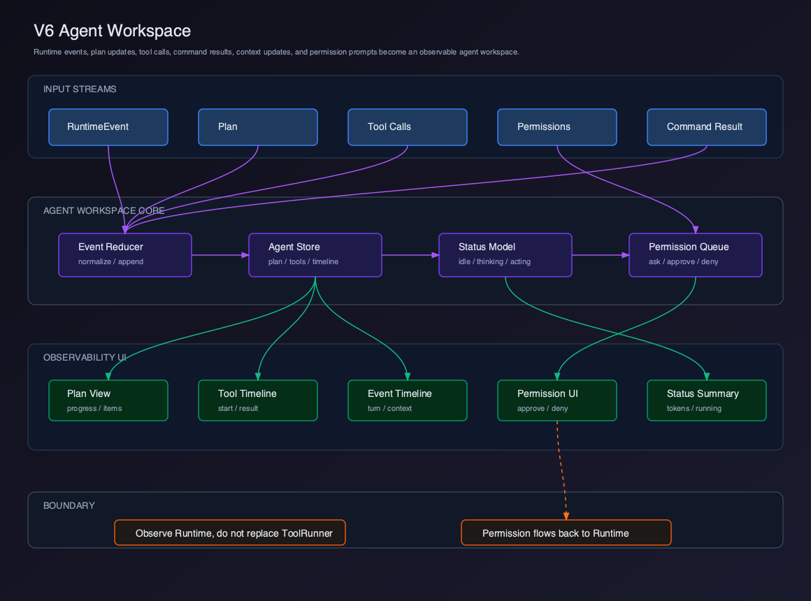
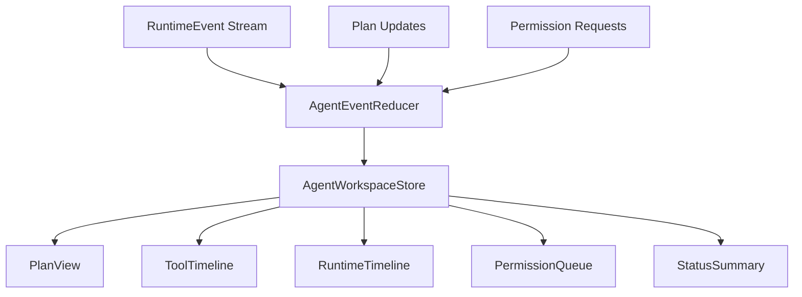

# V6 - Agent Workspace

V5 已经实现 Terminal。V6 要实现 Agent Workspace，把 Agent 的计划、工具调用、上下文变化、命令结果和权限请求从 Chat 附属信息升级为独立观察面板。

## 章节拆分

| 章节 | 主题 | 解决的问题 |
| --- | --- | --- |
| 01 | [Agent Workspace 边界](./01-agent-workspace-boundary/README.md) | Agent Workspace 是观察层，不是新 Runtime |
| 02 | [Plan View](./02-plan-view/README.md) | 如何展示 `update_plan` 的任务进度 |
| 03 | [Tool Timeline](./03-tool-timeline/README.md) | 如何展示工具调用生命周期 |
| 04 | [Runtime Event Timeline](./04-runtime-event-timeline/README.md) | 如何展示 turn、context、message 事件 |
| 05 | [Permission Queue](./05-permission-queue/README.md) | 如何展示和处理权限审批 |
| 06 | [Agent Status Summary](./06-agent-status-summary/README.md) | 如何汇总 Agent 当前状态 |

## Feature PR 边界

V6 应该作为一个独立 feature PR 合入：`feat(client): add agent workspace panel`。

这个 PR 交付的是 Runtime 可观察性链路：

```text
RuntimeEvent / PlanChangedEvent / PermissionRequestedEvent
  -> runtimeEventToAgentWorkspaceAction
  -> agentWorkspaceReducer
  -> AgentWorkspaceStore
  -> StatusSummary
  -> PlanView
  -> ToolTimeline
  -> RuntimeTimeline
  -> PermissionQueue
```

Agent Workspace 不创建新的 Runtime，不直接执行工具，也不替代 Chat。它只消费 Runtime 事件、展示状态，并把 permission approve/deny 回传原 Runtime permission bridge。

## 当前版本目标

V6 完成以下能力：

- 展示当前计划和每个 plan item 状态。
- 展示工具调用开始、输入、结果、错误。
- 展示 Runtime timeline：turn start、context update、tool result、done。
- 展示权限请求队列，并把 approve/deny 结果回传 Runtime。
- 汇总当前 Agent 状态：idle、thinking、acting、waiting_permission、done、error。

V6 不实现 Diff Accept/Reject。Tool result 里的 diff 只作为时间线摘要展示，真正 diff 交互在 V7。

## 用户价值

- 用户可以看到 Agent 当前在思考、执行、等待权限还是已经失败。
- Plan、Tool、Runtime timeline 分离展示，降低长任务理解成本。
- 权限请求进入独立队列，避免被 Chat 文本淹没。
- 后续 Diff、Session、Audit 都可以复用这条事件观察链路。

## 当前能力矩阵

| 用户能力 | Client 能力 | Runtime 能力 | V6 状态 |
| --- | --- | --- | --- |
| 查看计划 | Plan View | `update_plan` / `PlannerStore` | 已实现 |
| 查看工具执行 | Tool Timeline | tool events | 已实现 |
| 查看上下文变化 | Runtime Timeline | `context_update` | 已实现 |
| 权限审批 | Permission Queue | ToolRunner permission | 建立 UI |
| 查看 Agent 状态 | Status Summary | RuntimeEvent aggregation | 已实现 |
| 审查代码修改 | Diff Viewer | `ToolResult.diff` | V7 实现 |

## 整体架构



源码图：[`../assets/v6-agent-workspace.svg`](../assets/v6-agent-workspace.svg)



## V6 项目结构

```text
claude-code-client/
  src/
    renderer/
      agent-workspace/
        types.ts
        agentWorkspaceStore.ts
        runtimeEventToAgentAction.ts
        fakeRuntimeEvents.ts
        selectors.ts
      components/
        AgentWorkspacePanel.tsx
        PlanView.tsx
        ToolTimeline.tsx
        RuntimeEventTimeline.tsx
        PermissionQueue.tsx
        AgentStatusSummary.tsx
```

## 设计原则

### Observe, Do Not Replace Runtime

Agent Workspace 只观察 Runtime，不替代 Runtime。

正确边界：

```text
RuntimeEvent
  -> AgentWorkspaceStore
  -> UI
```

错误边界：

```text
AgentWorkspace UI
  -> 直接执行工具
```

工具执行仍然走 `ToolRunner`、Sandbox、Permission。

### Chat 和 Agent Workspace 分工

| 区域 | 职责 |
| --- | --- |
| Chat | 用户和 Agent 的语义对话 |
| Agent Workspace | Agent 执行过程、计划、工具、权限、状态 |

不要继续把所有工具日志塞进 Chat timeline。V6 之后，Chat 可以更干净，Agent Workspace 负责可观察性。

## 可运行交付物

V6 必须交付一个能随 Runtime 事件实时变化的 Agent Workspace。

本版本完成后，读者应该能运行：

```bash
pnpm dev
pnpm typecheck
pnpm test
```

Electron Client smoke 操作：

1. 启动 Client，打开 Agent Workspace panel。
2. 点击开发模式里的 `Replay fake events`，或在 Runtime 调试入口发送假事件。
3. 看到顶部 Status Summary 从 `thinking` 到 `acting`，最后变为 `done`。
4. 看到 Plan View 有 3 个任务，其中一个 `in_progress`，随后变为 `completed`。
5. 看到 Tool Timeline 出现 `read_file`、`run_command`，tool result 后状态变为 success/error。
6. 看到 Runtime Timeline 记录 turn start、context update、tool result、done。
7. 发送 permission 假事件，Permission Queue 出现 Approve/Deny；点击后队列消失，并调用 permission bridge resolver。

最小验收：

- `update_plan` 后 Plan View 状态正确。
- tool start / result 会进入 Tool Timeline。
- Runtime turn、context、done 会进入 Runtime Timeline。
- permission pending 时状态显示 `waiting_permission`。
- approve / deny 会回传 Runtime permission bridge。
- Chat timeline 不再承载完整工具日志。

## 当前版本缺陷

V6 仍然只是观察和轻量控制：

- 不支持 diff accept/reject。
- 不支持 tool replay。
- 不支持 timeline 持久化回放。
- 不支持多 Agent 并行对比。
- 不支持高级审计过滤。

## V7 预告

V7 会实现 Diff & Patch。

V6 能看到 Agent 修改了文件，但用户还不能系统审查、接受或拒绝修改。V7 会把 `ToolResult.diff` 升级为完整 Diff Viewer：

```text
ToolResult.diff
  -> Diff Viewer
  -> file hunks
  -> Accept / Reject
  -> Editor refresh
```
