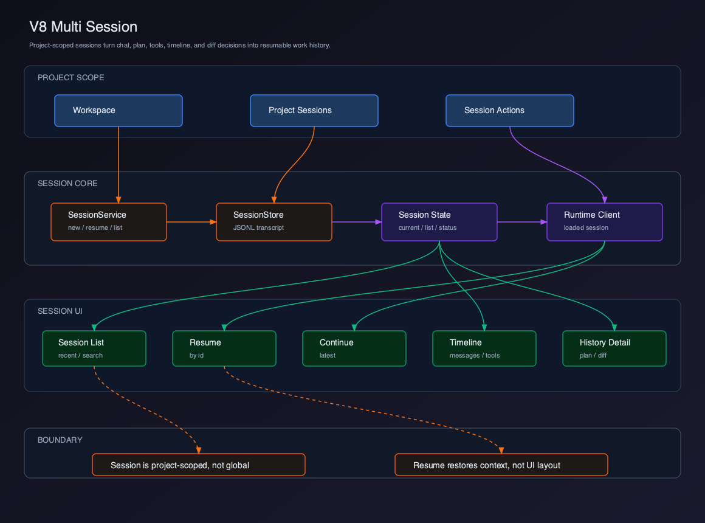
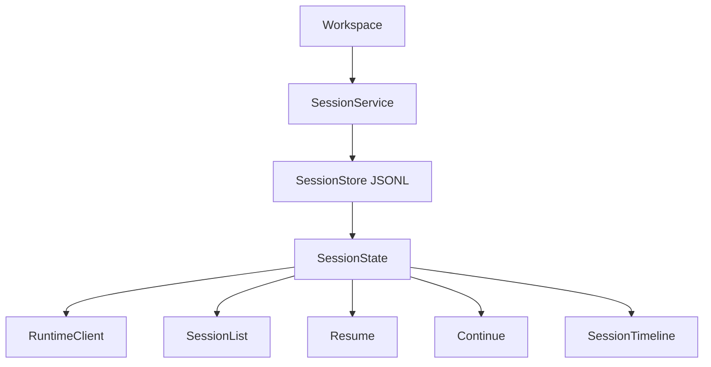

# V8 - Multi Session

V7 已经实现 Diff & Patch。V8 要实现 Multi Session，把 Chat、Plan、Tool Timeline、Diff Decisions 纳入项目级会话管理。

## Runtime 对照

`claude-code-mini` 已经具备 CLI 级会话能力：

- `SessionStore.createSession()`
- `SessionStore.listSessions()`
- `SessionStore.loadSession()`
- `SessionStore.getLatestSession()`
- `--resume <id>`
- `--continue`

V8 的目标是把这些能力产品化为 Client 的 Session Manager。

## 章节拆分

| 章节 | 主题 | 解决的问题 |
| --- | --- | --- |
| 01 | [Session 边界](./01-session-boundary/README.md) | Session Header 展示 new/resumed/continued 边界 |
| 02 | [Session 数据模型](./02-session-domain-model/README.md) | 用 fake transcript/metadata fixture 建出 SessionDetail |
| 03 | [Session List](./03-session-list/README.md) | 用 SessionService fixture 展示项目会话列表 |
| 04 | [Resume / Continue](./04-resume-continue/README.md) | 用 fake runtime handoff 恢复 Chat / Plan / Header |
| 05 | [Session Timeline](./05-session-timeline/README.md) | 用 fake event log 展示 message/tool/plan/diff |
| 06 | [Project Session Scope](./06-project-session-scope/README.md) | 展示 workspace scoped empty/error states |

## Feature PR 交付节奏

V8 每章都按一个小 feature PR 编写：写完本章后，读者应该能打开 UI 看到清晰变化，而不是只新增模型或服务。

每章必须包含：

- 一个最小可复制的 code skeleton。
- 一个 fake transcript、metadata fixture 或 fake runtime event。
- 一个可见 UI 验收点，说明屏幕上应该出现什么。
- 一个 smoke check，明确 `pnpm dev` 下的手动验证步骤。

## 当前版本目标

V8 完成以下能力：

- 按项目列出历史 sessions。
- 创建新 session。
- resume 指定 session。
- continue 最近 session。
- 展示 session timeline。
- 恢复 messages 和 plan。
- 把 diff decisions 纳入 session history。

## 用户价值

- 用户可以按项目找到历史任务，而不是只依赖当前 Chat 窗口。
- Resume / Continue 让长任务可以中断后恢复。
- Session timeline 把消息、计划、工具和 diff 决策放在同一条历史里。
- 项目级隔离避免跨仓库误恢复上下文。

## 当前能力矩阵

| 用户能力 | Client 能力 | Runtime 能力 | V8 状态 |
| --- | --- | --- | --- |
| 查看历史会话 | Session List | `listSessions()` | 已实现 |
| 新建会话 | New Session | `createSession()` | 已实现 |
| 恢复会话 | Resume | `loadSession(id)` | 已实现 |
| 继续最近会话 | Continue | `getLatestSession()` | 已实现 |
| 查看会话详情 | Session Timeline | transcript JSONL | 已实现 |
| 项目隔离 | Project Session Scope | `SessionStore(cwd)` | 已实现 |
| 插件能力 | Plugin System | plugin registry | V9 实现 |

## 整体架构



源码图：[`../assets/v8-multi-session.svg`](../assets/v8-multi-session.svg)



## V8 项目结构

```text
claude-code-client/
  src/
    main/
      session/
        SessionService.ts
        sessionTranscript.ts
        sessionHistory.ts
      ipc/
        sessionIpc.ts
    renderer/
      session/
        types.ts
        sessionStore.ts
        sessionActions.ts
        selectors.ts
      components/
        SessionManager.tsx
        SessionList.tsx
        SessionTimeline.tsx
        SessionHeader.tsx
```

## 可运行交付物

V8 必须交付可恢复的项目级 Session Manager。

本版本完成后，读者应该能运行：

```bash
pnpm dev
pnpm typecheck
pnpm test
```

最小验收：

- 不同 workspace 的 session list 相互隔离。
- 可以创建新 session。
- 可以 resume 指定 session。
- 可以 continue 当前 workspace 最近 session。
- Session Timeline 能展示 messages、plan、tools、diff decisions。
- 不自动恢复 terminal process 和未保存 editor buffer。

## Smoke Check 总表

`pnpm dev` 后按章节验证可见 UI：

- 01：Session Header 显示 `new / resumed / continued` 入口动作。
- 02：Session debug panel 显示 fake metadata、first prompt 和 timeline count。
- 03：Session List 显示 fake sessions、empty state 和 error state。
- 04：Resume / Continue 后 Chat、Plan View 和 Header 同步更新。
- 05：Session Timeline 同时出现 message、tool、plan、diff 四类 item。
- 06：切换 workspace 后只显示当前 workspace 的 session，跨项目 resume 显示拒绝原因。

## 当前版本缺陷

V8 不做：

- 会话分支。
- rewind。
- 跨项目 teleport resume。
- 多客户端一致性。
- 远程后台 session。
- exact-once event delivery。

这些属于更高阶远程控制和企业协作能力。

## V9 预告

V9 会实现 Plugin System。

V8 已经有项目、编辑器、终端、Agent Workspace 和会话管理。V9 会让 Client 具备扩展能力：

```text
Plugin
  -> commands
  -> tools
  -> UI panels
  -> lifecycle
  -> permission boundary
```
