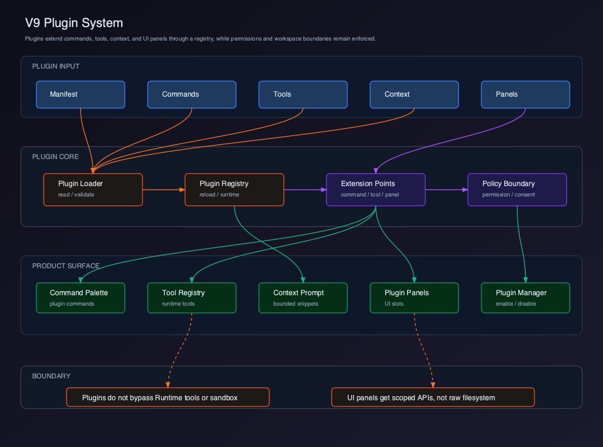
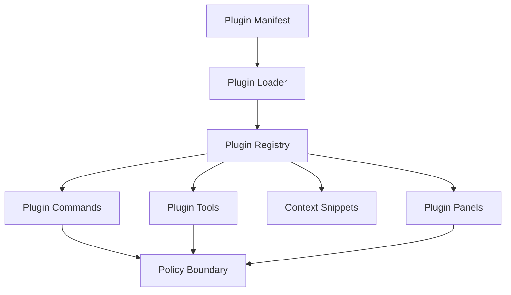

# V9 - Plugin System

V8 已经实现 Multi Session。V9 要实现 Plugin System，让 Client 具备可扩展能力。

## Runtime 对照

`claude-code-mini` 已经具备插件雏形：

- `PluginManifest`
- `PluginCommand`
- `PluginTool`
- `PluginContextSnippet`
- `PluginRegistry.reload()`
- `PluginRegistry.getTools()`
- `PluginRegistry.getContextPrompt()`

V9 的目标是把这些 Runtime 插件能力产品化，并扩展到 Client UI。

## 章节拆分

| 章节 | 主题 | 解决的问题 |
| --- | --- | --- |
| 01 | [Plugin 边界](./01-plugin-boundary/README.md) | 用边界表展示插件能扩展什么、不能越过什么 |
| 02 | [Manifest 模型](./02-plugin-manifest-model/README.md) | 用 plugin manifest fixture 展示能力和权限 |
| 03 | [Plugin Registry](./03-plugin-registry/README.md) | 用 registry fixture loader 展示 enable/disable/reload |
| 04 | [Plugin Commands](./04-plugin-commands/README.md) | 用 command palette entry 执行插件命令 |
| 05 | [Plugin Tools](./05-plugin-tools/README.md) | 用 plugin tool fake runtime event 展示权限链路 |
| 06 | [Plugin Panels & Lifecycle](./06-plugin-panels-lifecycle/README.md) | 用 sandbox panel UI 展示 scoped API |
| 07 | [Marketplace & Supply Chain](./07-marketplace-supply-chain/README.md) | 用 local marketplace fixture 展示 signed badge 和 deny reason |

## Feature PR 交付节奏

V9 每章都按一个可见 feature PR 编写：写完本章后，Plugin Manager、Command Palette、Agent Workspace 或 Marketplace 至少有一个清晰 UI 变化。

每章必须包含：

- 一个最小可复制的 code skeleton。
- 一个 manifest fixture、registry fixture、fake runtime event 或 marketplace fixture。
- 一个可见 UI 验收点，说明屏幕上应该出现什么。
- 一个 smoke check，明确启用、禁用、错误和策略拒绝时的 UI。

## 当前版本目标

V9 完成以下能力：

- 加载插件 manifest。
- 启用/禁用插件。
- 注册插件命令。
- 注册插件工具。
- 注入受限 context snippets。
- 提供插件 UI panel slot。
- 建立插件权限边界。
- 建立 marketplace、签名、lockfile、供应链审计的企业化演进路线。

## 用户价值

V9 让 Client 从固定功能集合变成可扩展平台：

- 团队可以把高频工作流沉淀成插件命令。
- 平台可以把插件工具纳入 Runtime 权限和审计链路。
- 企业可以逐步建立插件准入、版本锁定和供应链治理。
- Client 可以在不重写 Runtime 的前提下扩展 UI 面板和上下文能力。

## 当前能力矩阵

| 用户能力 | Client 能力 | Runtime 能力 | V9 状态 |
| --- | --- | --- | --- |
| 查看插件 | Plugin Manager | installed plugins | 已实现 |
| 启用插件 | Enable / Disable | PluginRegistry reload | 已实现 |
| 执行插件命令 | Command Palette | PluginCommand | 已实现 |
| 使用插件工具 | Tool Injection | PluginTool -> ToolRegistry | 已实现 |
| 注入插件上下文 | Context Snippets | `getContextPrompt()` | 已实现 |
| 插件面板 | UI Panel Slot | Client extension point | 教学版实现 |
| 插件市场 | Marketplace Catalog | install source metadata | 企业化设计 |
| 供应链治理 | Signature / Lockfile / Audit | plugin provenance | 企业化设计 |
| 企业闭环 | Enterprise Client | governance | V10 实现 |

## 整体架构



源码图：[`../assets/v9-plugin-system.svg`](../assets/v9-plugin-system.svg)



## V9 项目结构

```text
claude-code-client/
  src/
    main/
      plugins/
        PluginService.ts
        pluginManifest.ts
        pluginRegistry.ts
        pluginPolicy.ts
      ipc/
        pluginIpc.ts
    renderer/
      plugins/
        types.ts
        pluginStore.ts
        pluginActions.ts
        selectors.ts
      components/
        PluginManager.tsx
        PluginCommandPalette.tsx
        PluginPanelHost.tsx
```

## 设计原则

### 插件不能绕过 Runtime

插件工具必须走 ToolRegistry、ToolRunner、Sandbox、Permission。

### 插件 UI 只能拿 scoped API

插件 panel 不应该直接拿原始文件系统、shell、session store。

它只能通过受控 API：

```text
workspace.readFile
commands.execute
runtime.send
ui.openPanel
```

### 插件 Context 要有预算

插件 context snippets 不能无限注入 system prompt。必须有 token budget 和用户可见来源。

### 插件生态要可追溯

生产版插件系统不能只依赖本地目录扫描。每个插件都要能回答：

- 从哪里安装。
- 当前版本是什么。
- 是否被签名。
- 是否被企业策略允许。
- 是否与当前 Client / Runtime 兼容。
- 是否引入新的工具、命令、context 或 UI 权限。

这些信息要进入 lockfile 和 audit trail，而不是只停留在 UI 展示层。

## 可运行交付物

V9 必须交付一个可启停的插件系统切片。

本版本完成后，读者应该能运行：

```bash
pnpm dev
pnpm typecheck
pnpm test
```

最小验收：

- 能加载本地插件 manifest。
- manifest 非法时插件进入 error 状态。
- enable / disable 会同步 command、tool、panel 状态。
- 插件 tool 仍然经过 Runtime ToolRunner、Sandbox、Permission。
- 插件 context 有 token budget 和来源展示。
- 插件 panel 只能拿 scoped API，拿不到裸 `fs`、`shell`、`SessionStore`。

## 当前版本缺陷

V9 教学版不做：

- 插件依赖解析。
- 完整远程 Marketplace 服务。
- 插件沙箱隔离运行时。
- 企业策略中心的集中下发。

## V10 预告

V10 会实现 Enterprise Claude Code Client。

V10 会把前面所有能力收束成企业级闭环：

```text
Workspace
Editor
Terminal
Agent Workspace
Diff
Session
Plugin
Settings
Policy
Observability
```
