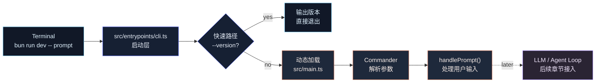

# 第 1 章：搭建 CLI 启动骨架

## 本章目标

本章从空目录开始，搭建一个最小可运行的 Claude Code Mini CLI。

完成后，项目会具备这些能力：

- 使用 Bun 运行 TypeScript CLI。
- 支持 `--help` 查看帮助。
- 支持 `--version` 输出版本。
- 支持输入一段 prompt。
- 支持 `-p, --print` 这种后续会用于非交互模式的参数。
- 形成 `entrypoints/cli.ts` + `main.ts` 的入口分层，为后续接入 LLM、Streaming、Tool Calling 留出结构。

本章不接入模型，也不实现 Agent Loop。这里先把 CLI 外壳搭好。

---

## 本章完成效果

最终可以运行：

```bash
bun run dev -- --help
```

看到 CLI 帮助信息。

也可以运行：

```bash
bun run dev -- "hello"
```

看到：

```text
Claude Code Mini received your prompt:
hello
```

运行版本命令：

```bash
bun run dev -- --version
```

看到：

```text
0.1.0 (Claude Code Mini)
```

---

## 本章项目结构变化

从空项目开始：

```bash
mkdir claude-code-mini
cd claude-code-mini
bun init
```

本章结束后，项目结构是：

```bash
claude-code-mini/
  package.json
  tsconfig.json
  src/
    constants.ts
    entrypoints/
      cli.ts
    main.ts
```

---

## 为什么需要这个模块

Claude Code 首先是一个 CLI。

后面的所有能力，包括：

- 读取用户输入
- 非交互输出
- 会话恢复
- 工具权限
- MCP 子命令
- 插件管理
- 远程控制
- Agent Loop

都要从 CLI 参数开始分流。

真实源码里也是这样拆的：

- `src/entrypoints/cli.tsx` 负责启动层。
- `src/main.tsx` 负责完整 Commander CLI。

启动层不会一上来就加载整个系统，而是先处理一些快速路径，例如 `--version`。如果没有命中特殊参数，再动态加载完整 CLI。

我们在 Mini 版本里保留这个架构，但只实现最小集合：

- `--version`
- `--help`
- `[prompt...]`
- `-p, --print`
- `--cwd`

这样第一章就能运行，后面每一章都能在这个 CLI 上继续加能力。

---

## 整体架构

下面是本章 CLI 的启动结构。图用 Mermaid 表达，后续章节继续保持这种深色工程架构风格：模块边界清晰，数据流从左到右。



---

## 核心流程

本章 CLI 的调用链很短：

```text
bun run dev
  -> src/entrypoints/cli.ts
    -> 检查 process.argv
    -> 命中 --version：直接输出版本
    -> 未命中：动态 import ../main.ts
      -> main()
        -> 创建 CommanderCommand
        -> 注册 name / description / argument / options / version
        -> parseAsync(process.argv)
        -> action(promptParts, options)
          -> handlePrompt()
```

这里最重要的不是代码量，而是入口边界：

- `cli.ts` 是启动层，适合处理低成本快速路径。
- `main.ts` 是主 CLI，适合注册命令、参数和后续业务逻辑。
- 真正的 Agent 逻辑不要塞进 CLI 配置里，后面会放到 `agent/`、`llm/`、`tools/` 等模块。

---

## 完整核心代码

### package.json

`package.json` 使用 Bun 作为运行入口。这里不使用 pnpm。

```json
{
  "name": "claude-code-mini",
  "version": "0.1.0",
  "private": true,
  "type": "module",
  "bin": {
    "ccmini": "./src/entrypoints/cli.ts"
  },
  "scripts": {
    "dev": "bun run src/entrypoints/cli.ts",
    "typecheck": "tsc --noEmit"
  },
  "dependencies": {
    "@commander-js/extra-typings": "^14.0.0"
  },
  "devDependencies": {
    "@types/bun": "^1.3.0",
    "typescript": "^6.0.0"
  }
}
```

### tsconfig.json

```json
{
  "compilerOptions": {
    "target": "ES2022",
    "module": "ESNext",
    "moduleResolution": "Bundler",
    "strict": true,
    "skipLibCheck": true,
    "types": ["bun-types"],
    "baseUrl": ".",
    "paths": {
      "src/*": ["src/*"]
    }
  },
  "include": ["src/**/*.ts"]
}
```

### src/constants.ts

```ts
export const VERSION = "0.1.0";
export const PRODUCT_NAME = "Claude Code Mini";
export const CLI_NAME = "ccmini";
```

### src/entrypoints/cli.ts

```ts
#!/usr/bin/env bun

import { PRODUCT_NAME, VERSION } from "../constants";

async function bootstrap(): Promise<void> {
  const args = process.argv.slice(2);

  if (
    args.length === 1 &&
    (args[0] === "--version" || args[0] === "-v" || args[0] === "-V")
  ) {
    console.log(`${VERSION} (${PRODUCT_NAME})`);
    return;
  }

  const { main } = await import("../main");
  await main();
}

await bootstrap();
```

### src/main.ts

```ts
import { Command as CommanderCommand } from "@commander-js/extra-typings";
import { CLI_NAME, PRODUCT_NAME, VERSION } from "./constants";

type RootOptions = {
  print?: boolean;
  cwd: string;
};

export async function main(argv = process.argv): Promise<CommanderCommand> {
  const program = new CommanderCommand();

  program
    .name(CLI_NAME)
    .description(
      `${PRODUCT_NAME} - starts a coding-agent session by default, use -p/--print for non-interactive output`,
    )
    .argument("[prompt...]", "Your prompt")
    .helpOption("-h, --help", "Display help for command")
    .option(
      "-p, --print",
      "Print response and exit. This will become the headless mode in later chapters.",
      false,
    )
    .option("--cwd <path>", "Working directory for the session", process.cwd())
    .version(`${VERSION} (${PRODUCT_NAME})`, "-v, --version", "Output the version number")
    .action(async (promptParts: string[] | undefined, options: RootOptions) => {
      await handlePrompt(promptParts ?? [], options);
    });

  await program.parseAsync(argv);
  return program;
}

async function handlePrompt(promptParts: string[], options: RootOptions): Promise<void> {
  const prompt = promptParts.join(" ").trim();

  if (!prompt) {
    console.log("No prompt provided. Run with --help to see usage.");
    return;
  }

  if (options.print) {
    console.log(`Claude Code Mini received your prompt:\n${prompt}`);
    return;
  }

  console.log(`Claude Code Mini received your prompt:\n${prompt}`);
  console.log("");
  console.log(`cwd: ${options.cwd}`);
  console.log("LLM connection will be implemented in Chapter 2.");
}
```

---

## 逐步实现

### 1. 创建项目

```bash
mkdir claude-code-mini
cd claude-code-mini
bun init
```

Bun 会生成初始 `package.json`、`index.ts` 等文件。这个教程不使用默认的 `index.ts`，我们会换成自己的 CLI 入口。

### 2. 安装依赖

```bash
bun add @commander-js/extra-typings
bun add -d typescript @types/bun
```

这里使用 `@commander-js/extra-typings`，原因是当前参考源码也使用它来构建 CLI。它比普通 `commander` 有更好的 TypeScript 类型推导。

### 3. 修改 package.json

把 `package.json` 改成上面的完整版本。

关键点是：

```json
{
  "type": "module",
  "scripts": {
    "dev": "bun run src/entrypoints/cli.ts",
    "typecheck": "tsc --noEmit"
  }
}
```

Bun 可以直接运行 TypeScript 文件，所以本章不需要额外编译步骤。

### 4. 新增 tsconfig.json

创建 `tsconfig.json`。

本教程会一直保持 strict 模式：

```json
{
  "strict": true
}
```

不要等项目复杂后再补类型。Agent 系统里消息、工具参数、工具结果都会依赖类型边界，早期放松类型，后面会很难收。

### 5. 新增 constants.ts

```bash
mkdir -p src/entrypoints
touch src/constants.ts
```

写入：

```ts
export const VERSION = "0.1.0";
export const PRODUCT_NAME = "Claude Code Mini";
export const CLI_NAME = "ccmini";
```

版本号和 CLI 名称先集中放一处，避免后面多个模块硬编码。

### 6. 新增启动入口 cli.ts

创建：

```bash
touch src/entrypoints/cli.ts
```

写入前面的完整代码。

这里的设计重点是：

- 文件第一行是 `#!/usr/bin/env bun`。
- `--version` 在启动层直接处理。
- 其他情况才动态加载 `../main`。

真实 Claude Code 源码也是这种思路。它在 `src/entrypoints/cli.tsx` 里先处理 `--version`、MCP、daemon、remote-control 等快速路径，最后才 `await import('../main.jsx')`。

### 7. 新增 main.ts

创建：

```bash
touch src/main.ts
```

写入前面的完整代码。

本章的 `main.ts` 只做三件事：

- 创建 Commander 程序。
- 注册参数和选项。
- 把 prompt 交给 `handlePrompt()`。

注意：`handlePrompt()` 现在只是回显，不调用模型。下一章才会新增 `src/llm/` 并接入 LLM API。

---

## 关键源码分析

本章参考了当前项目源码中的两个真实入口。

### 1. 启动层：src/entrypoints/cli.tsx

参考源码的启动层有几个关键设计：

- 文件顶部使用 `#!/usr/bin/env bun`，说明 CLI 原生由 Bun 启动。
- `main()` 里先读取 `process.argv.slice(2)`。
- `--version` / `-v` / `-V` 是快速路径，不加载完整 CLI。
- 其他特殊模式，例如 MCP、daemon、remote-control，也在启动层提前分流。
- 没有命中特殊路径时，才动态加载 `../main.jsx`。

我们在 Mini 里保留了同样的边界：

```ts
const args = process.argv.slice(2);

if (args.length === 1 && args[0] === "--version") {
  console.log(`${VERSION} (${PRODUCT_NAME})`);
  return;
}

const { main } = await import("../main");
await main();
```

这个结构解决的是启动成本和职责边界问题。

如果所有逻辑都写在 `main.ts` 的顶层 import 里，哪怕用户只是执行 `--version`，也会加载一堆后续模块。真实项目里 `main.tsx` 很重，包含配置、认证、MCP、插件、权限、REPL 等大量依赖，所以启动层必须先做轻量分流。

Mini 项目现在还不重，但从第一章就保留这个结构，后面扩展时不用改入口架构。

### 2. 主 CLI：src/main.tsx

参考源码的主 CLI 使用：

```ts
const program = new CommanderCommand()
  .configureHelp(createSortedHelpConfig())
  .enablePositionalOptions();
```

然后注册：

- `.name('claude')`
- `.description(...)`
- `.argument('[prompt]', ...)`
- `.option('-p, --print', ...)`
- `.version(...)`
- `program.parseAsync(process.argv)`

真实源码还在 `preAction` hook 里做初始化：

- 加载配置
- 初始化 warning handler
- 初始化日志 sink
- 运行 migration
- 加载远程管理配置
- 加载 policy limits

本章不实现这些，因为第一章只需要 CLI 骨架。我们只保留 Commander 的主干：

```ts
const program = new CommanderCommand();

program
  .name(CLI_NAME)
  .description(...)
  .argument("[prompt...]", "Your prompt")
  .option("-p, --print", ...)
  .version(...)
  .action(...);

await program.parseAsync(argv);
```

后续章节会逐步把初始化能力补回来：

- 第 2 章接入 LLM 配置。
- 第 5 章接入 Tool Registry。
- 第 11 章接入 Context 管理。
- 第 12 章接入 Session 管理。
- 第 14 章接入 Sandbox。

---

## 调试与验证

### 1. 安装依赖

```bash
bun install
```

### 2. 查看帮助

```bash
bun run dev -- --help
```

应该能看到类似输出：

```text
Usage: ccmini [options] [prompt...]

Claude Code Mini - starts a coding-agent session by default, use -p/--print for non-interactive output

Arguments:
  prompt                              Your prompt

Options:
  -h, --help                          Display help for command
  -p, --print                         Print response and exit. This will become the headless mode in later chapters.
  --cwd <path>                        Working directory for the session
  -v, --version                       Output the version number
```

### 3. 查看版本

```bash
bun run dev -- --version
```

应该输出：

```text
0.1.0 (Claude Code Mini)
```

### 4. 输入 prompt

```bash
bun run dev -- "explain this repo"
```

应该输出：

```text
Claude Code Mini received your prompt:
explain this repo

cwd: /your/path/claude-code-mini
LLM connection will be implemented in Chapter 2.
```

### 5. 非交互 print 模式

```bash
bun run dev -- -p "hello"
```

应该输出：

```text
Claude Code Mini received your prompt:
hello
```

### 6. 类型检查

```bash
bun run typecheck
```

必须通过。后续每章都保持这个标准。

---

## 常见问题

### 1. `bun: command not found`

原因：本机没有安装 Bun，或者 shell 找不到 Bun。

解决：

```bash
curl -fsSL https://bun.sh/install | bash
```

安装后重启终端，再运行：

```bash
bun --version
```

### 2. `Cannot find module '@commander-js/extra-typings'`

原因：没有安装依赖。

解决：

```bash
bun install
```

如果还是失败，重新安装：

```bash
bun add @commander-js/extra-typings
```

### 3. `Cannot find type definition file for 'bun-types'`

原因：缺少 Bun 类型声明。

解决：

```bash
bun add -d @types/bun
```

然后确认 `tsconfig.json` 里有：

```json
{
  "compilerOptions": {
    "types": ["bun-types"]
  }
}
```

### 4. `No prompt provided. Run with --help to see usage.`

原因：没有传入 prompt。

解决：

```bash
bun run dev -- "hello"
```

### 5. 参数没有传到 CLI

如果运行：

```bash
bun run dev --help
```

Bun 可能会把参数当成脚本命令参数的一部分处理。

推荐统一写法：

```bash
bun run dev -- --help
```

`--` 后面的内容才会传给我们的 CLI。

---

## 本章小结

这一章完成了 Claude Code Mini 的 CLI 启动骨架：

- `src/entrypoints/cli.ts` 负责轻量启动和快速路径。
- `src/main.ts` 负责 Commander 参数解析。
- `--version`、`--help`、prompt 输入、`-p` 模式都已经可运行。

当前系统还不会调用模型，只是能接收用户输入。

下一章会新增 `src/llm/`，接入 LLM API，并把：

```text
用户 prompt -> CLI 回显
```

推进成：

```text
用户 prompt -> LLM 请求 -> 模型响应
```
