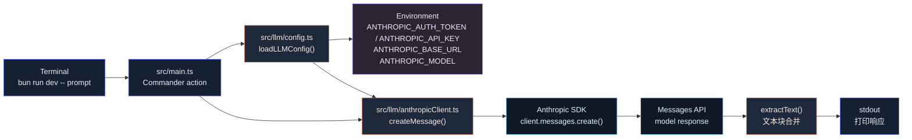

# 第 2 章：接入 LLM API

## 本章目标

本章在第 1 章 CLI 骨架上，接入 Anthropic Messages API。

这里说的 Anthropic Messages API，指的是 Anthropic SDK 的消息协议。

如果你没有 Anthropic 官方 Key，也可以使用兼容 Anthropic 协议的服务。

例如 DeepSeek 的 Anthropic 兼容端点可以继续使用 `@anthropic-ai/sdk`，只需要配置：

```bash
export ANTHROPIC_AUTH_TOKEN="<your-deepseek-api-key>"
export ANTHROPIC_BASE_URL="https://api.deepseek.com/anthropic"
export ANTHROPIC_MODEL="deepseek-v4-flash"
```

完成后，系统会具备这些能力：

- 从环境变量读取 `ANTHROPIC_AUTH_TOKEN` 或 `ANTHROPIC_API_KEY`。
- 从环境变量读取 `ANTHROPIC_BASE_URL`。
- 从环境变量或 CLI 参数读取模型名。
- 把用户 prompt 转成 Messages API 请求。
- 调用模型并拿到一次完整文本响应。
- 在 CLI 中输出模型返回内容。
- 对缺少鉴权配置、请求失败、无文本响应做明确错误处理。

本章只实现非流式调用：

```text
用户输入 -> 一次 API 请求 -> 一次完整响应
```

Streaming 会在第 4 章实现，Tool Calling 会在第 7 章实现，Agent Loop 会在第 8 章实现。

---

## 本章完成效果

如果使用 DeepSeek Anthropic 兼容端点，设置：

```bash
export ANTHROPIC_AUTH_TOKEN="<your-deepseek-api-key>"
export ANTHROPIC_BASE_URL="https://api.deepseek.com/anthropic"
export ANTHROPIC_MODEL="deepseek-v4-flash"
```

如果使用 Anthropic 官方 API，设置：

```bash
export ANTHROPIC_API_KEY="<your-anthropic-api-key>"
export ANTHROPIC_MODEL="claude-sonnet-4-6"
```

运行：

```bash
bun run dev -- "用一句话解释 TypeScript 的类型推导"
```

能看到模型返回：

```text
TypeScript 的类型推导是编译器根据变量初始值、函数返回值和上下文自动推断类型，减少手写类型标注。
```

也可以指定模型：

```bash
bun run dev -- --model deepseek-v4-flash "hello"
```

非交互输出：

```bash
bun run dev -- -p "hello"
```

`-p` 当前只是更干净地打印响应。后续它会发展成 headless 模式。

---

## 本章项目结构变化

在第 1 章基础上新增 `src/llm/`：

```bash
claude-code-mini/
  package.json
  tsconfig.json
  src/
    constants.ts
    entrypoints/
      cli.ts
    llm/
      anthropicClient.ts
      config.ts
      types.ts
    main.ts
```

新增依赖：

```bash
bun add @anthropic-ai/sdk
```

---

## 为什么需要这个模块

第 1 章的 CLI 只能接收 prompt，然后原样回显。

这还不是 AI Coding Agent。Agent 的第一条主线是：

```text
用户输入 -> 构造模型请求 -> 调用 LLM -> 解析模型响应 -> 输出给用户
```

真实 Claude Code 源码里，模型调用不是直接写在 CLI 里的，而是拆在 API 层：

- `src/services/api/client.ts` 创建 Anthropic client，并处理鉴权、header、provider 客户端。
- `src/services/api/claude.ts` 构造 request params，执行 `messages.create()`，处理 streaming、重试、usage、错误、tool schema。
- `src/utils/model/providers.ts` 根据配置和环境变量选择 provider。
- `src/utils/model/model.ts` 负责默认模型、环境变量模型、模型别名和 provider 差异。
- `src/query.ts` 在 Agent Loop 中调用 API 层，不直接关心 SDK 细节。

Mini 版本不能一上来复制这套复杂度。

本章只抽出最小工程边界：

- `llm/config.ts`：读取模型、baseURL 和鉴权配置。
- `llm/anthropicClient.ts`：封装 SDK 调用。
- `llm/types.ts`：定义 Mini 内部消息和响应类型。
- `main.ts`：只负责 CLI 参数和输出，不直接碰 SDK。

这样后续接入 Streaming、Tool Calling、多模型路由时，不需要重写 CLI。

---

## 整体架构



---

## 核心流程

本章调用链：

```text
bun run dev -- "hello"
  -> src/entrypoints/cli.ts
    -> 未命中 --version
    -> import("../main")
      -> main()
        -> Commander 解析 prompt / --model / -p
        -> handlePrompt()
          -> loadLLMConfig()
            -> 读取 ANTHROPIC_AUTH_TOKEN 或 ANTHROPIC_API_KEY
            -> 读取 ANTHROPIC_BASE_URL
            -> 读取 ANTHROPIC_MODEL 或默认模型
          -> createMessage()
            -> new Anthropic({ authToken, apiKey, baseURL })
            -> client.messages.create({
                 model,
                 max_tokens,
                 messages: [{ role: "user", content: prompt }]
               })
            -> extractText(response.content)
          -> console.log(response.text)
```

注意本章还没有历史消息。

每次运行 CLI 都只发送一条 user message：

```ts
[{ role: "user", content: prompt }]
```

多轮上下文会在第 3 章开始处理，Session 持久化会在第 12 章处理。

---

## 完整核心代码

### package.json

在第 1 章基础上增加 `@anthropic-ai/sdk`：

```json
{
  "name": "claude-code-mini",
  "version": "0.1.0",
  "private": true,
  "type": "module",
  "bin": {
    "ccmini": "./src/entrypoints/cli.ts"
  },
  "scripts": {
    "dev": "bun run src/entrypoints/cli.ts",
    "typecheck": "tsc --noEmit"
  },
  "dependencies": {
    "@anthropic-ai/sdk": "^0.81.0",
    "@commander-js/extra-typings": "^14.0.0"
  },
  "devDependencies": {
    "@types/bun": "^1.3.0",
    "typescript": "^6.0.0"
  }
}
```

### src/llm/types.ts

```ts
export type ChatRole = "user" | "assistant";

export type ChatMessage = {
  role: ChatRole;
  content: string;
};

export type LLMConfig = {
  apiKey?: string;
  authToken?: string;
  model: string;
  maxTokens: number;
  baseURL?: string;
};

export type LLMResponse = {
  text: string;
  model: string;
  stopReason: string | null;
  inputTokens: number;
  outputTokens: number;
};
```

### src/llm/config.ts

```ts
import type { LLMConfig } from "./types";

const DEFAULT_MODEL = "claude-sonnet-4-6";
const DEFAULT_MAX_TOKENS = 4096;

type Env = Record<string, string | undefined>;

export function loadLLMConfig(env: Env = process.env): LLMConfig {
  const authToken = env.ANTHROPIC_AUTH_TOKEN;
  const apiKey = authToken ? undefined : env.ANTHROPIC_API_KEY;

  if (!authToken && !apiKey) {
    throw new Error(
      "Missing auth config. Set ANTHROPIC_AUTH_TOKEN for Anthropic-compatible providers like DeepSeek, or ANTHROPIC_API_KEY for Anthropic official API.",
    );
  }

  const maxTokens = parsePositiveInt(env.CCMINI_MAX_TOKENS, DEFAULT_MAX_TOKENS);

  return {
    ...(authToken && { authToken }),
    ...(apiKey && { apiKey }),
    model: env.ANTHROPIC_MODEL || DEFAULT_MODEL,
    maxTokens,
    ...(env.ANTHROPIC_BASE_URL && { baseURL: env.ANTHROPIC_BASE_URL }),
  };
}

function parsePositiveInt(value: string | undefined, fallback: number): number {
  if (!value) return fallback;

  const parsed = Number.parseInt(value, 10);
  if (!Number.isFinite(parsed) || parsed <= 0) {
    throw new Error(`CCMINI_MAX_TOKENS must be a positive integer, got: ${value}`);
  }

  return parsed;
}
```

这里有一个重要细节：

```ts
const authToken = env.ANTHROPIC_AUTH_TOKEN;
const apiKey = authToken ? undefined : env.ANTHROPIC_API_KEY;
```

`@anthropic-ai/sdk` 支持两种鉴权方式：

- `apiKey`：发送 `X-Api-Key`，适合 Anthropic 官方 API。
- `authToken`：发送 `Authorization: Bearer ...`，适合 DeepSeek 这类 Anthropic 兼容端点。

所以 DeepSeek 不需要换 SDK。

只要配置：

```bash
export ANTHROPIC_AUTH_TOKEN="<your-deepseek-api-key>"
export ANTHROPIC_BASE_URL="https://api.deepseek.com/anthropic"
export ANTHROPIC_MODEL="deepseek-v4-flash"
```

如果同时设置了 `ANTHROPIC_AUTH_TOKEN` 和 `ANTHROPIC_API_KEY`，Mini 优先使用 `ANTHROPIC_AUTH_TOKEN`。

### src/llm/anthropicClient.ts

```ts
import Anthropic from "@anthropic-ai/sdk";
import type {
  ContentBlock,
  MessageParam,
  TextBlock,
} from "@anthropic-ai/sdk/resources/index.mjs";
import { loadLLMConfig } from "./config";
import type { ChatMessage, LLMConfig, LLMResponse } from "./types";

export async function createMessage(
  messages: ChatMessage[],
  config: LLMConfig = loadLLMConfig(),
): Promise<LLMResponse> {
  const client = new Anthropic({
    maxRetries: 1,
    ...(config.apiKey && { apiKey: config.apiKey }),
    ...(config.authToken && { authToken: config.authToken }),
    ...(config.baseURL && { baseURL: config.baseURL }),
  });

  const response = await client.messages.create({
    model: config.model,
    max_tokens: config.maxTokens,
    messages: toMessageParams(messages),
  });

  const text = extractText(response.content);

  if (!text) {
    throw new Error("The model response did not contain any text content.");
  }

  return {
    text,
    model: response.model,
    stopReason: response.stop_reason,
    inputTokens: response.usage.input_tokens,
    outputTokens: response.usage.output_tokens,
  };
}

function toMessageParams(messages: ChatMessage[]): MessageParam[] {
  return messages.map(message => ({
    role: message.role,
    content: message.content,
  }));
}

function extractText(content: ContentBlock[]): string {
  return content
    .filter(isTextBlock)
    .map(block => block.text)
    .join("");
}

function isTextBlock(block: ContentBlock): block is TextBlock {
  return block.type === "text";
}
```

### src/main.ts

用下面版本替换第 1 章的 `src/main.ts`：

```ts
import { Command as CommanderCommand } from "@commander-js/extra-typings";
import { CLI_NAME, PRODUCT_NAME, VERSION } from "./constants";
import { createMessage } from "./llm/anthropicClient";
import { loadLLMConfig } from "./llm/config";

type RootOptions = {
  print?: boolean;
  cwd: string;
  model?: string;
};

export async function main(argv = process.argv): Promise<CommanderCommand> {
  const program = new CommanderCommand();

  program
    .name(CLI_NAME)
    .description(
      `${PRODUCT_NAME} - starts a coding-agent session by default, use -p/--print for non-interactive output`,
    )
    .argument("[prompt...]", "Your prompt")
    .helpOption("-h, --help", "Display help for command")
    .option(
      "-p, --print",
      "Print response and exit. This will become the headless mode in later chapters.",
      false,
    )
    .option("--cwd <path>", "Working directory for the session", process.cwd())
    .option("--model <model>", "Override the model for this request")
    .version(`${VERSION} (${PRODUCT_NAME})`, "-v, --version", "Output the version number")
    .action(async (promptParts: string[] | undefined, options: RootOptions) => {
      await handlePrompt(promptParts ?? [], options);
    });

  await program.parseAsync(argv);
  return program;
}

async function handlePrompt(promptParts: string[], options: RootOptions): Promise<void> {
  const prompt = promptParts.join(" ").trim();

  if (!prompt) {
    console.log("No prompt provided. Run with --help to see usage.");
    return;
  }

  try {
    const config = loadLLMConfig();
    if (options.model) {
      config.model = options.model;
    }

    const response = await createMessage(
      [
        {
          role: "user",
          content: prompt,
        },
      ],
      config,
    );

    console.log(response.text);

    if (!options.print) {
      console.log("");
      console.log(`model: ${response.model}`);
      console.log(`tokens: ${response.inputTokens} input / ${response.outputTokens} output`);
      console.log(`cwd: ${options.cwd}`);
    }
  } catch (error) {
    const message = error instanceof Error ? error.message : String(error);
    console.error(`Error: ${message}`);
    process.exitCode = 1;
  }
}
```

`src/constants.ts` 和 `src/entrypoints/cli.ts` 不需要修改。

---

## 逐步实现

### 1. 安装 SDK

```bash
bun add @anthropic-ai/sdk
```

如果是从第 1 章继续，其他依赖已经安装过，不需要重复安装。

### 2. 创建 LLM 目录

```bash
mkdir -p src/llm
touch src/llm/types.ts
touch src/llm/config.ts
touch src/llm/anthropicClient.ts
```

### 3. 定义内部类型

先写 `src/llm/types.ts`。

不要直接把 SDK 的类型暴露到整个项目里。Mini 内部只需要自己的 `ChatMessage` 和 `LLMResponse`：

```ts
export type ChatMessage = {
  role: "user" | "assistant";
  content: string;
};
```

这样做有两个好处：

- 后续接入 OpenAI、Gemini、Grok 时，内部消息结构不用跟着 provider 变化。
- Tool Calling 章节可以扩展成更复杂的 content block，而不是现在就污染 CLI 层。

### 4. 读取环境变量

写 `src/llm/config.ts`。

本章使用 Anthropic SDK 和 Messages API 协议。

如果使用 DeepSeek Anthropic 兼容端点，读取这三个变量：

```bash
export ANTHROPIC_AUTH_TOKEN="<your-deepseek-api-key>"
export ANTHROPIC_BASE_URL="https://api.deepseek.com/anthropic"
export ANTHROPIC_MODEL="deepseek-v4-flash"
```

如果使用 Anthropic 官方 API，读取：

```bash
export ANTHROPIC_API_KEY="<your-anthropic-api-key>"
export ANTHROPIC_MODEL="claude-sonnet-4-6"
```

不要把真实 key 写进代码，不要提交 `.env`。

模型优先级是：

```text
--model 参数 > ANTHROPIC_MODEL 环境变量 > 默认模型
```

鉴权优先级是：

```text
ANTHROPIC_AUTH_TOKEN > ANTHROPIC_API_KEY
```

真实源码的模型选择更完整，优先级大致是：

```text
会话内 /model 覆盖
  -> 启动参数 --model
  -> ANTHROPIC_MODEL
  -> settings.json
  -> 内置默认模型
```

Mini 现在没有 settings 和会话内切换，所以先保留最小版本。

### 5. 封装 SDK 调用

写 `src/llm/anthropicClient.ts`。

核心调用只有一个：

```ts
const response = await client.messages.create({
  model: config.model,
  max_tokens: config.maxTokens,
  messages: toMessageParams(messages),
});
```

这里有三个关键字段：

- `model`：使用哪个模型。
- `max_tokens`：最多生成多少输出 token。
- `messages`：对话消息数组。

本章先不传：

- `system`
- `tools`
- `tool_choice`
- `stream`
- `thinking`
- `metadata`
- `betas`

这些字段都是真实 Claude Code 会用到的，但现在引入会让主线变乱。后续章节会逐步加回来。

### 6. 提取文本响应

Messages API 的 `response.content` 是 block 数组，不是单纯字符串。

即使本章不使用工具，响应也仍然是：

```ts
[
  {
    type: "text",
    text: "..."
  }
]
```

所以要写：

```ts
function extractText(content: ContentBlock[]): string {
  return content
    .filter(isTextBlock)
    .map(block => block.text)
    .join("");
}
```

后面 Tool Calling 出现后，`content` 里会出现 `tool_use` block。提前按 block 解析，后面扩展更自然。

### 7. 改造 CLI action

把第 1 章的回显逻辑：

```ts
console.log(`Claude Code Mini received your prompt:\n${prompt}`);
```

替换成：

```ts
const response = await createMessage([{ role: "user", content: prompt }], config);
console.log(response.text);
```

CLI 层不直接 new SDK client。

CLI 只负责：

- 参数解析
- 调用 `loadLLMConfig()`
- 传入 prompt
- 输出结果
- 设置 `process.exitCode`

---

## 关键源码分析

### 1. client 创建：src/services/api/client.ts

真实源码不是每次直接写：

```ts
new Anthropic({ apiKey })
new Anthropic({ authToken, baseURL })
```

而是封装了 `getAnthropicClient()`。

它处理了更多工程问题：

- OAuth token 刷新。
- API Key header。
- `User-Agent`。
- session id header。
- proxy fetch options。
- timeout。
- provider client，例如 Bedrock、Vertex、Foundry。
- 自定义 header。
- debug logger。

Mini 本章只实现最小配置：

```ts
const client = new Anthropic({
  maxRetries: 1,
  ...(config.apiKey && { apiKey: config.apiKey }),
  ...(config.authToken && { authToken: config.authToken }),
  ...(config.baseURL && { baseURL: config.baseURL }),
});
```

这是有意收窄。

第 2 章的目标是打通模型调用，不是恢复完整鉴权系统。

但这里已经保留了一个很实用的扩展点：

- 官方 Anthropic：`apiKey`。
- DeepSeek Anthropic 兼容端点：`authToken + baseURL + model`。

等后面做模型路由时，再拆出 provider client factory。

### 2. 模型调用：src/services/api/claude.ts

真实源码里最终也是走 Messages API。

在 streaming 主路径里，它会构造 params，然后调用：

```ts
anthropic.beta.messages.create({ ...params, stream: true }, ...)
```

在 non-streaming fallback 里，它会调用：

```ts
anthropic.beta.messages.create({ ...adjustedParams, model: normalizeModelStringForAPI(...) }, ...)
```

源码使用 `beta.messages`，是因为完整 Claude Code 需要：

- thinking
- prompt caching
- context management
- tool schema
- structured output
- task budget
- advisor
- 多种 beta header

Mini 第 2 章不需要这些能力，所以使用稳定的：

```ts
client.messages.create(...)
```

这是教学版本和生产版本的差异。

### 3. provider 选择：src/utils/model/providers.ts

真实源码支持多个 provider：

- `firstParty`
- `bedrock`
- `vertex`
- `foundry`
- `openai`
- `gemini`
- `grok`

选择顺序来自配置和环境变量，例如：

```text
settings.modelType
  -> CLAUDE_CODE_USE_BEDROCK
  -> CLAUDE_CODE_USE_VERTEX
  -> CLAUDE_CODE_USE_FOUNDRY
  -> CLAUDE_CODE_USE_OPENAI
  -> CLAUDE_CODE_USE_GEMINI
  -> CLAUDE_CODE_USE_GROK
  -> firstParty
```

Mini 第 2 章不实现完整 provider 路由。

但它支持“Anthropic 协议兼容端点”：

```text
ANTHROPIC_BASE_URL + ANTHROPIC_AUTH_TOKEN + ANTHROPIC_MODEL
```

这类服务仍然走 `@anthropic-ai/sdk` 的 `messages.create()`，不是 OpenAI 兼容层，也不需要换 SDK。

原因很简单：多 provider 不是 LLM 调用的第一性问题。先把 Messages API 跑通，再在后续“模型路由”章节把 provider 抽象补上。

### 4. 模型选择：src/utils/model/model.ts 和 configs.ts

真实源码把模型 ID 集中放在 `src/utils/model/configs.ts`，再由 `src/utils/model/model.ts` 按 provider 取默认模型。

当前源码里的 first-party 默认 Sonnet 是：

```text
claude-sonnet-4-6
```

所以 Mini 本章默认也使用：

```ts
const DEFAULT_MODEL = "claude-sonnet-4-6";
```

但教程代码仍然允许用环境变量覆盖：

```bash
export ANTHROPIC_MODEL="deepseek-v4-flash"
```

或者用 CLI 覆盖：

```bash
bun run dev -- --model deepseek-v4-flash "hello"
```

不要把模型名散落在业务代码里。后面模型路由章节会把它进一步升级成 `modelRegistry`。

### 5. 为什么不在 main.ts 里直接调用 SDK

可以直接写：

```ts
const client = new Anthropic({
  authToken: process.env.ANTHROPIC_AUTH_TOKEN,
  baseURL: process.env.ANTHROPIC_BASE_URL,
});
```

但这会让 CLI 层变成混合层：

- 它既解析参数。
- 又读环境变量。
- 又知道 SDK。
- 又处理响应 block。
- 后面还会被迫处理 streaming、tools、provider。

这会很快失控。

真实源码把 CLI、Query、API、Model 拆开，是因为这些模块变化频率不同：

- CLI 参数变动是一类问题。
- 模型请求参数是一类问题。
- provider 鉴权是一类问题。
- Agent Loop 状态机是一类问题。

Mini 从第 2 章就保持这个边界，后面复杂度上来时才不会重写。

---

## 调试与验证

### 1. 安装依赖

```bash
bun install
```

如果还没有安装 SDK：

```bash
bun add @anthropic-ai/sdk
```

### 2. 设置模型服务配置

DeepSeek Anthropic 兼容端点：

```bash
export ANTHROPIC_AUTH_TOKEN="<your-deepseek-api-key>"
export ANTHROPIC_BASE_URL="https://api.deepseek.com/anthropic"
export ANTHROPIC_MODEL="deepseek-v4-flash"
```

Anthropic 官方 API：

```bash
export ANTHROPIC_API_KEY="<your-anthropic-api-key>"
export ANTHROPIC_MODEL="claude-sonnet-4-6"
```

不要把真实 key 写进源码、教程仓库、终端日志截图或提交记录。

### 3. 运行一次模型调用

```bash
bun run dev -- "用一句话解释什么是 CLI"
```

预期能看到模型自然语言响应。

### 4. 使用 print 模式

```bash
bun run dev -- -p "只输出 OK"
```

`-p` 模式下只输出模型文本，不输出 model、tokens、cwd。

### 5. 覆盖模型

```bash
bun run dev -- --model deepseek-v4-flash "hello"
```

也可以用环境变量：

```bash
export ANTHROPIC_MODEL="deepseek-v4-flash"
bun run dev -- "hello"
```

### 6. 设置输出 token 上限

```bash
export CCMINI_MAX_TOKENS=256
bun run dev -- "写一个很短的回答：什么是 TypeScript"
```

### 7. 类型检查

```bash
bun run typecheck
```

必须通过。

---

## 常见问题

### 1. `Missing auth config`

原因：没有设置模型服务鉴权。

解决：

```bash
export ANTHROPIC_AUTH_TOKEN="<your-deepseek-api-key>"
export ANTHROPIC_BASE_URL="https://api.deepseek.com/anthropic"
export ANTHROPIC_MODEL="deepseek-v4-flash"
```

然后重新运行：

```bash
bun run dev -- "hello"
```

### 2. `401` 或 `authentication_error`

原因：

- API Key 或 Auth Token 错误。
- API Key 或 Auth Token 过期。
- `ANTHROPIC_BASE_URL` 配错。
- 当前 shell 没有拿到环境变量。

检查：

```bash
echo $ANTHROPIC_BASE_URL
echo $ANTHROPIC_MODEL
```

不要把 key/token 输出粘贴到聊天、Issue 或代码里。

### 3. `model: not found` 或 `invalid_request_error`

原因：

- `--model` 传入了不存在的模型名。
- 当前账号没有权限访问该模型。
- 使用了 Anthropic 官方模型名，但当前 `ANTHROPIC_BASE_URL` 指向 DeepSeek。
- 使用了 DeepSeek 模型名，但当前没有设置 DeepSeek baseURL。

解决：

```bash
bun run dev -- --model deepseek-v4-flash "hello"
```

或者检查当前环境变量：

```bash
echo $ANTHROPIC_BASE_URL
echo $ANTHROPIC_MODEL
```

### 4. `CCMINI_MAX_TOKENS must be a positive integer`

原因：`CCMINI_MAX_TOKENS` 不是正整数。

错误示例：

```bash
export CCMINI_MAX_TOKENS=abc
```

修复：

```bash
export CCMINI_MAX_TOKENS=4096
```

### 5. 请求很慢

原因可能是网络、代理、模型负载或输出 token 太大。

先降低输出上限：

```bash
export CCMINI_MAX_TOKENS=256
```

再测试：

```bash
bun run dev -- "hello"
```

后续章节会加入 streaming，慢请求会变成边生成边输出，体感会好很多。

### 6. `The model response did not contain any text content`

原因：响应里没有 `text` block。

第 2 章只支持文本响应。后面 Tool Calling 章节会处理 `tool_use` block。

---

## 本章小结

这一章把 Claude Code Mini 从“只能回显 prompt”的 CLI，推进成了“可以调用 LLM 并输出结果”的最小系统。

当前已经具备：

- API Key / Auth Token / Base URL 配置。
- 模型配置。
- Anthropic SDK 调用。
- Messages API 请求。
- 文本响应解析。
- CLI 输出。
- 基础错误处理。

当前还缺少：

- 多轮消息历史。
- Streaming 输出。
- Tool Calling。
- Agent Loop。
- Context 管理。
- Session 保存。

下一章会实现 Chat Loop，把单次请求推进成多轮对话：

```text
用户输入 1 -> 模型响应 1
用户输入 2 -> 携带历史消息 -> 模型响应 2
用户输入 3 -> 携带历史消息 -> 模型响应 3
```

这一步完成后，Mini 才开始具备真正的对话状态。
