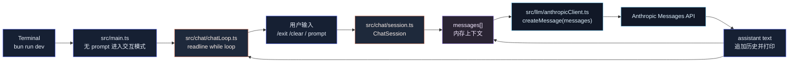

# 第 3 章：实现 Chat Loop

## 本章目标

本章在第 2 章“一次 prompt 调一次模型”的基础上，实现一个真正的多轮 Chat Loop。

完成后，系统会具备这些能力：

- 无 prompt 启动时进入交互式对话。
- 每一轮用户输入都会追加到内存消息历史。
- 每一轮模型响应也会追加到消息历史。
- 下一轮请求会携带之前的 user / assistant messages。
- 支持 `/exit`、`/quit` 退出。
- 支持 `/clear` 清空当前内存上下文。
- 仍然保留 `-p` 和直接传 prompt 的单次调用模式。

本章仍然不做文件持久化。也就是说，关闭进程后对话历史会丢失。Session 持久化会在第 12 章实现。

---

## 本章完成效果

设置 API Key：

```bash
export ANTHROPIC_API_KEY="<your-api-key>"
```

启动交互模式：

```bash
bun run dev
```

终端会显示：

```text
Claude Code Mini
model: claude-sonnet-4-6
cwd: /your/path/claude-code-mini

Type /exit to quit, /clear to reset conversation.

> 
```

输入：

```text
> 我叫 Kimi，记住这个名字
```

模型回答后，再输入：

```text
> 我刚才说我叫什么？
```

模型应该能基于本轮进程内的历史回答：

```text
你刚才说你叫 Kimi。
```

清空上下文：

```text
> /clear
Conversation cleared.
```

退出：

```text
> /exit
```

---

## 本章项目结构变化

在第 2 章基础上新增 `src/chat/`：

```bash
claude-code-mini/
  package.json
  tsconfig.json
  src/
    chat/
      chatLoop.ts
      session.ts
    constants.ts
    entrypoints/
      cli.ts
    llm/
      anthropicClient.ts
      config.ts
      types.ts
    main.ts
```

本章不新增 npm 包。

Bun 可以直接使用 Node 兼容的内置模块：

```ts
import { createInterface } from "node:readline/promises";
```

---

## 为什么需要这个模块

第 2 章已经能调用模型，但它不是“对话系统”。

因为每次请求只发送一条消息：

```ts
[{ role: "user", content: prompt }]
```

模型不会知道上一轮说过什么。

Chat Loop 要解决的是这个工程问题：

```text
如何在一个进程内维护多轮消息历史，并在每一轮请求时把历史一起发给模型？
```

真实 Claude Code 也是围绕这件事展开的，只是它的状态更多：

- messages
- file history
- tool permission context
- usage
- abort controller
- MCP clients
- session transcript
- compaction boundary
- attachments
- progress messages

真实源码里核心边界是 `QueryEngine`：

```ts
// One QueryEngine per conversation.
// Each submitMessage() call starts a new turn within the same conversation.
```

它内部有一个 `mutableMessages`，每次 `submitMessage()`：

1. 把用户输入转成 user message。
2. 追加到 `mutableMessages`。
3. 拷贝当前 messages 作为本轮请求上下文。
4. 调用 `query({ messages })`。
5. 把 assistant / tool / system 等新消息继续追加回 `mutableMessages`。

Mini 本章只实现最小版本：

```text
ChatSession.messages
  -> push user
  -> createMessage(messages)
  -> push assistant
```

没有 Tool、没有 Session 文件、没有 Compact，但主线和真实系统一致。

---

## 整体架构



---

## 核心流程

交互模式调用链：

```text
bun run dev
  -> src/entrypoints/cli.ts
    -> import("../main")
      -> main()
        -> 没有 prompt
        -> loadLLMConfig()
        -> runChatLoop(config)
          -> new ChatSession(config)
          -> readline.question("> ")
          -> session.sendUserMessage(input)
            -> messages.push({ role: "user", content: input })
            -> createMessage(messages, config)
              -> client.messages.create({ messages })
            -> messages.push({ role: "assistant", content: response.text })
          -> console.log(response.text)
          -> 继续下一轮
```

消息历史变化：

```text
初始:
[]

用户输入: "我叫 Kimi"
[
  { role: "user", content: "我叫 Kimi" }
]

模型响应: "好的，我记住了。"
[
  { role: "user", content: "我叫 Kimi" },
  { role: "assistant", content: "好的，我记住了。" }
]

用户输入: "我叫什么？"
[
  { role: "user", content: "我叫 Kimi" },
  { role: "assistant", content: "好的，我记住了。" },
  { role: "user", content: "我叫什么？" }
]
```

第三条请求携带前两条历史，所以模型才能回答上下文问题。

---

## 完整核心代码

### src/chat/session.ts

```ts
import { createMessage } from "../llm/anthropicClient";
import type { ChatMessage, LLMConfig, LLMResponse } from "../llm/types";

export class ChatSession {
  private readonly messages: ChatMessage[] = [];

  constructor(private readonly config: LLMConfig) {}

  get history(): readonly ChatMessage[] {
    return this.messages;
  }

  clear(): void {
    this.messages.length = 0;
  }

  async sendUserMessage(content: string): Promise<LLMResponse> {
    const userMessage: ChatMessage = {
      role: "user",
      content,
    };

    this.messages.push(userMessage);

    try {
      const response = await createMessage(this.messages, this.config);

      this.messages.push({
        role: "assistant",
        content: response.text,
      });

      return response;
    } catch (error) {
      this.messages.pop();
      throw error;
    }
  }
}
```

这里有一个细节：

```ts
catch (error) {
  this.messages.pop();
  throw error;
}
```

如果 API 请求失败，本轮 user message 会回滚。

否则下一次用户继续输入时，历史里会保留一条“没有得到模型响应”的 user message。真实 Agent 系统可以保留失败消息并记录错误，但 Mini 现阶段没有错误消息类型，所以先回滚，保持历史结构干净。

### src/chat/chatLoop.ts

```ts
import { stdin as input, stdout as output } from "node:process";
import { createInterface } from "node:readline/promises";
import { ChatSession } from "./session";
import type { LLMConfig } from "../llm/types";

type ChatLoopOptions = {
  cwd: string;
};

export async function runChatLoop(
  config: LLMConfig,
  options: ChatLoopOptions,
): Promise<void> {
  const session = new ChatSession(config);
  const rl = createInterface({ input, output });

  console.log("Claude Code Mini");
  console.log(`model: ${config.model}`);
  console.log(`cwd: ${options.cwd}`);
  console.log("");
  console.log("Type /exit to quit, /clear to reset conversation.");
  console.log("");

  try {
    while (true) {
      const rawInput = await rl.question("> ");
      const prompt = rawInput.trim();

      if (!prompt) {
        continue;
      }

      if (prompt === "/exit" || prompt === "/quit") {
        break;
      }

      if (prompt === "/clear") {
        session.clear();
        console.log("Conversation cleared.");
        continue;
      }

      try {
        const response = await session.sendUserMessage(prompt);

        console.log("");
        console.log(response.text);
        console.log("");
        console.log(
          `[${session.history.length} messages, ${response.inputTokens} input / ${response.outputTokens} output tokens]`,
        );
        console.log("");
      } catch (error) {
        const message = error instanceof Error ? error.message : String(error);
        console.error(`Error: ${message}`);
      }
    }
  } finally {
    rl.close();
  }
}
```

### src/main.ts

用下面版本替换第 2 章的 `src/main.ts`：

```ts
import { Command as CommanderCommand } from "@commander-js/extra-typings";
import { runChatLoop } from "./chat/chatLoop";
import { CLI_NAME, PRODUCT_NAME, VERSION } from "./constants";
import { createMessage } from "./llm/anthropicClient";
import { loadLLMConfig } from "./llm/config";
import type { LLMConfig } from "./llm/types";

type RootOptions = {
  print?: boolean;
  cwd: string;
  model?: string;
};

export async function main(argv = process.argv): Promise<CommanderCommand> {
  const program = new CommanderCommand();

  program
    .name(CLI_NAME)
    .description(
      `${PRODUCT_NAME} - starts a coding-agent session by default, use -p/--print for non-interactive output`,
    )
    .argument("[prompt...]", "Your prompt")
    .helpOption("-h, --help", "Display help for command")
    .option(
      "-p, --print",
      "Print response and exit. This will become the headless mode in later chapters.",
      false,
    )
    .option("--cwd <path>", "Working directory for the session", process.cwd())
    .option("--model <model>", "Override the model for this request")
    .version(`${VERSION} (${PRODUCT_NAME})`, "-v, --version", "Output the version number")
    .action(async (promptParts: string[] | undefined, options: RootOptions) => {
      await handlePrompt(promptParts ?? [], options);
    });

  await program.parseAsync(argv);
  return program;
}

async function handlePrompt(promptParts: string[], options: RootOptions): Promise<void> {
  const prompt = promptParts.join(" ").trim();

  try {
    const config = loadLLMConfig();
    if (options.model) {
      config.model = options.model;
    }

    if (prompt) {
      await runSinglePrompt(prompt, config, options);
      return;
    }

    if (options.print) {
      console.error("Error: -p/--print requires a prompt.");
      process.exitCode = 1;
      return;
    }

    if (!process.stdin.isTTY) {
      console.error("Error: interactive mode requires a TTY. Pass a prompt or use -p.");
      process.exitCode = 1;
      return;
    }

    await runChatLoop(config, { cwd: options.cwd });
  } catch (error) {
    const message = error instanceof Error ? error.message : String(error);
    console.error(`Error: ${message}`);
    process.exitCode = 1;
  }
}

async function runSinglePrompt(
  prompt: string,
  config: LLMConfig,
  options: RootOptions,
): Promise<void> {
  const response = await createMessage(
    [
      {
        role: "user",
        content: prompt,
      },
    ],
    config,
  );

  console.log(response.text);

  if (!options.print) {
    console.log("");
    console.log(`model: ${response.model}`);
    console.log(`tokens: ${response.inputTokens} input / ${response.outputTokens} output`);
    console.log(`cwd: ${options.cwd}`);
  }
}
```

`src/llm/types.ts`、`src/llm/config.ts`、`src/llm/anthropicClient.ts` 不需要改。

---

## 逐步实现

### 1. 创建 chat 目录

```bash
mkdir -p src/chat
touch src/chat/session.ts
touch src/chat/chatLoop.ts
```

### 2. 实现 ChatSession

先写 `src/chat/session.ts`。

`ChatSession` 是本章最重要的模块。它不关心终端，也不关心 Commander，只负责维护一段对话：

```ts
private readonly messages: ChatMessage[] = [];
```

每一轮调用：

```ts
this.messages.push(userMessage);
const response = await createMessage(this.messages, this.config);
this.messages.push({ role: "assistant", content: response.text });
```

这就是最小 Chat Loop 的状态核心。

不要把 `messages` 放在 `main.ts` 的局部变量里。那样 CLI、终端循环、模型调用、状态管理会混在一起，后面接 Tool Calling 时会很难拆。

### 3. 实现终端循环

写 `src/chat/chatLoop.ts`。

使用 Bun 运行时兼容的 Node 内置模块：

```ts
import { createInterface } from "node:readline/promises";
```

循环结构是：

```ts
while (true) {
  const rawInput = await rl.question("> ");
  const prompt = rawInput.trim();

  if (!prompt) continue;
  if (prompt === "/exit") break;
  if (prompt === "/clear") {
    session.clear();
    continue;
  }

  const response = await session.sendUserMessage(prompt);
  console.log(response.text);
}
```

本章先用最普通的 readline。真实 Claude Code 使用 React + Ink，是因为它需要复杂终端 UI：

- 消息列表
- 输入框
- Spinner
- 权限确认框
- Tool 渲染
- Markdown 高亮
- 多 Agent 面板
- 历史滚动

Mini 当前只需要把对话状态跑通，不需要上 Ink。

### 4. 改造 main.ts

第 2 章的 `main.ts` 逻辑是：

```text
没有 prompt -> 提示 No prompt provided
有 prompt -> 调一次模型
```

本章改成：

```text
有 prompt -> 单次调用
没有 prompt + 非 -p + TTY -> 进入 Chat Loop
没有 prompt + -p -> 报错
没有 prompt + 非 TTY -> 报错
```

为什么要判断 TTY？

因为交互模式需要真实终端输入。如果用户在管道里运行：

```bash
echo "hello" | bun run dev
```

`readline.question("> ")` 没有正常交互体验。管道模式会在后续章节单独处理，这里先明确报错。

### 5. 保留单次调用模式

本章不是把第 2 章推翻，而是增加一条交互路径。

这两个命令仍然要可用：

```bash
bun run dev -- "hello"
bun run dev -- -p "hello"
```

后续测试、脚本、CI、自动化都会依赖单次调用模式。不要为了交互体验把它删掉。

---

## 关键源码分析

### 1. QueryEngine 是真实项目里的会话状态边界

真实源码 `src/QueryEngine.ts` 里有明确注释：

```ts
// One QueryEngine per conversation.
// Each submitMessage() call starts a new turn within the same conversation.
// State (messages, file cache, usage, etc.) persists across turns.
```

它的构造函数会初始化：

```ts
this.mutableMessages = config.initialMessages ?? [];
```

这就是生产版的会话内消息数组。

Mini 本章对应的是：

```ts
private readonly messages: ChatMessage[] = [];
```

名字不同，职责相同：保存当前进程内的对话上下文。

### 2. 用户输入先变成 message，再进入 query

真实 `QueryEngine.submitMessage()` 里，用户输入不是直接传给 API。

它先经过 `processUserInput()`：

```ts
const {
  messages: messagesFromUserInput,
  shouldQuery,
  allowedTools,
  model: modelFromUserInput,
  resultText,
} = await processUserInput(...);
```

然后追加：

```ts
this.mutableMessages.push(...messagesFromUserInput);
const messages = [...this.mutableMessages];
```

Mini 当前没有 slash command、附件、图片、IDE selection，所以不用 `processUserInput()`。

但流程保持一致：

```ts
this.messages.push({ role: "user", content });
const response = await createMessage(this.messages, this.config);
```

以后实现 `/clear` 之外的 slash command 时，就会把“用户输入处理”单独抽成模块。

### 3. query() 接收完整 messages

真实 REPL 调用 `query()` 时传的是完整历史：

```ts
for await (const event of query({
  messages: messagesIncludingNewMessages,
  systemPrompt,
  userContext,
  systemContext,
  canUseTool,
  toolUseContext,
  querySource: getQuerySourceForREPL(),
})) {
  onQueryEvent(event);
}
```

关键点是 `messages: messagesIncludingNewMessages`。

模型不是只看最新输入，而是看当前上下文窗口里的消息列表。

Mini 本章的 `createMessage(this.messages, this.config)` 对应这个设计。

### 4. assistant 响应也必须回写历史

真实 `QueryEngine` 在收到 assistant message 后会：

```ts
this.mutableMessages.push(msg);
```

如果不把 assistant 响应写回历史，下一轮模型只能看到用户连续说了什么，看不到自己上一轮回答了什么。

这会破坏多轮对话。

Mini 本章必须做：

```ts
this.messages.push({
  role: "assistant",
  content: response.text,
});
```

### 5. REPL 用 messagesRef 避免异步状态过期

真实 `src/screens/REPL.tsx` 使用：

```ts
const [messages, rawSetMessages] = useState<MessageType[]>(initialMessages ?? []);
const messagesRef = useRef(messages);
```

并包装 `setMessages`，让 `messagesRef.current` 立即更新。

原因是 React state 更新不是同步可读的，而 Query 启动、流式消息、工具结果、权限 UI 都可能在同一轮里交错发生。

Mini 本章没有 React，不需要 `messagesRef`。

但这里能学到一个原则：

```text
Chat Loop 必须有一个明确的 conversation state source of truth。
```

Mini 里这个 source of truth 就是 `ChatSession.messages`。

### 6. 为什么本章不做 Session 持久化

真实 `QueryEngine` 会在用户消息进入 query 前调用：

```ts
recordTranscript(messages);
```

这样进程被杀掉后仍然可以 resume。

Mini 暂时不做，因为持久化会带来一组新问题：

- session id 怎么生成
- transcript 存在哪里
- 如何序列化消息
- 如何恢复历史
- 如何处理中断时只有 user 没有 assistant 的半轮对话
- 如何列出历史会话

这些属于第 12 章 Session 管理。第 3 章只解决内存里的 Chat Loop。

---

## 调试与验证

### 1. 安装依赖

```bash
bun install
```

### 2. 设置 API Key

```bash
export ANTHROPIC_API_KEY="<your-api-key>"
```

### 3. 类型检查

```bash
bun run typecheck
```

必须通过。

### 4. 验证单次 prompt 仍然可用

```bash
bun run dev -- "hello"
```

应该输出模型响应，并显示 model、tokens、cwd。

### 5. 验证 print 模式仍然可用

```bash
bun run dev -- -p "hello"
```

应该只输出模型响应文本。

### 6. 验证交互模式

```bash
bun run dev
```

输入：

```text
> 我叫 Kimi，后面请用这个名字称呼我
```

等模型响应后，再输入：

```text
> 我叫什么？
```

如果模型能回答 `Kimi`，说明历史消息已经被带到下一轮请求。

### 7. 验证 /clear

输入：

```text
> /clear
```

然后问：

```text
> 我叫什么？
```

模型不应该再确定你叫 Kimi。因为内存消息历史已经清空。

### 8. 验证退出

```text
> /exit
```

或者：

```text
> /quit
```

进程应该正常退出。

---

## 常见问题

### 1. `Error: interactive mode requires a TTY`

原因：当前输入不是交互终端，可能是管道或脚本环境。

错误示例：

```bash
echo "hello" | bun run dev
```

本章还没有实现 stdin pipe 模式。先改成：

```bash
bun run dev -- "hello"
```

或者：

```bash
bun run dev -- -p "hello"
```

### 2. `Error: -p/--print requires a prompt.`

原因：使用了 print 模式，但没有传 prompt。

错误示例：

```bash
bun run dev -- -p
```

修复：

```bash
bun run dev -- -p "hello"
```

### 3. 第二轮模型不记得第一轮内容

优先检查 `ChatSession.sendUserMessage()` 是否把 assistant 响应写回历史：

```ts
this.messages.push({
  role: "assistant",
  content: response.text,
});
```

如果只 push user message，不 push assistant message，多轮上下文是不完整的。

### 4. `/clear` 后模型还记得之前内容

确认 `clear()` 是清空原数组：

```ts
this.messages.length = 0;
```

不要写成：

```ts
this.messages = [];
```

因为本章代码里 `messages` 是 `readonly` 字段，不能重新赋值。

### 5. API 请求失败后下一轮上下文怪异

确认 catch 里有回滚：

```ts
catch (error) {
  this.messages.pop();
  throw error;
}
```

没有回滚时，失败的 user message 会留在历史里，但没有对应 assistant 响应。

### 6. `Cannot find module 'node:readline/promises'`

原因通常是 TypeScript 配置或运行时版本太旧。

先确认使用 Bun：

```bash
bun --version
```

并确认 `tsconfig.json` 包含：

```json
{
  "compilerOptions": {
    "types": ["bun-types"]
  }
}
```

---

## 本章小结

这一章把 Claude Code Mini 从“一次性模型调用”推进成了“进程内多轮对话”。

当前系统已经具备：

- 交互式终端输入。
- 内存消息历史。
- 多轮上下文。
- `/clear` 清空上下文。
- `/exit` 退出对话。
- 单次 prompt 和 `-p` 模式兼容。

当前还缺少：

- 边生成边输出。
- stdin pipe 模式。
- slash command 系统。
- Tool Registry。
- Tool Calling。
- Agent Loop。
- Session 持久化。

下一章会实现 Streaming 输出。

现在每轮必须等完整响应返回后才能看到结果。真实 Claude Code 会边接收 token 边渲染，用户能立刻看到模型开始工作。

下一章要把：

```text
等待完整响应 -> 一次性打印
```

改成：

```text
收到文本 delta -> 立即输出到终端
```
