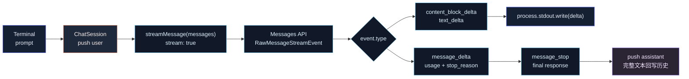

# 第 4 章：实现 Streaming 输出

## 本章目标

本章在第 3 章 Chat Loop 的基础上，把“一次性等待完整响应”改成“边生成边输出”。

完成后，系统会具备这些能力：

- 使用 Anthropic Messages API 的 `stream: true`。
- 解析 `message_start`、`content_block_delta`、`message_delta`、`message_stop`。
- 遇到 `text_delta` 时立即写入 stdout。
- Streaming 结束后，把完整 assistant 文本写回会话历史。
- 单次 prompt 模式和交互式 Chat Loop 都支持流式输出。
- 保留 token 统计和 stop reason。

本章仍然只处理文本流。

Tool input 的 `input_json_delta` 会在 Tool Calling 章节处理，thinking / tool progress / UI 渲染优化也暂时不做。

---

## 本章完成效果

设置 API Key：

```bash
export ANTHROPIC_API_KEY="<your-api-key>"
```

运行单次 prompt：

```bash
bun run dev -- "写一个 5 行的 TypeScript 函数"
```

模型响应会逐步出现在终端，而不是等完整响应结束后一次性打印。

启动交互模式：

```bash
bun run dev
```

输入：

```text
> 用三句话解释 streaming 为什么重要
```

你会看到文本边生成边显示。响应结束后，会显示本轮 token 信息：

```text
[2 messages, 18 input / 92 output tokens]
```

多轮上下文仍然可用：

```text
> 我叫 Kimi
> 我叫什么？
```

---

## 本章项目结构变化

本章不新增目录，只修改第 3 章已有文件：

```bash
claude-code-mini/
  src/
    chat/
      chatLoop.ts        # 改：边读 stream 边输出
      session.ts         # 改：新增 sendUserMessageStream()
    llm/
      anthropicClient.ts # 改：新增 streamMessage()
      types.ts           # 改：新增 LLMStreamEvent
    main.ts              # 改：单次 prompt 也走 streaming
```

不新增依赖。

---

## 为什么需要这个模块

第 3 章的调用方式是非流式：

```text
用户输入
  -> 等 API 返回完整 message
  -> 一次性 console.log(response.text)
```

这能跑，但交互体验差。

真实 Claude Code 必须处理长任务，例如：

- 解释大型代码文件
- 生成计划
- 输出 diff
- 调用工具前说明思路
- 多步骤修复

如果所有内容都等到最后再显示，用户会长时间只看到等待状态。

Streaming 要解决的是：

```text
模型只要生成一小段文本，CLI 就立即显示。
```

真实源码里的主线是：

- `src/services/api/claude.ts` 使用 `messages.create({ stream: true })`。
- API 返回 `RawMessageStreamEvent`。
- `content_block_delta` 里的 `text_delta` 被累积成最终文本。
- `src/utils/messages.ts` 的 `handleMessageFromStream()` 把 `text_delta` 转成 UI 的 streaming text。
- `src/screens/REPL.tsx` 用 `streamingText` 临时渲染正在生成的文本。

Mini 本章不做复杂 UI，只做终端流式输出：

```ts
process.stdout.write(delta.text);
```

---

## 整体架构



---

## 核心流程

单次 prompt 的调用链：

```text
bun run dev -- "hello"
  -> main()
    -> runSinglePrompt()
      -> new ChatSession(config)
      -> session.sendUserMessageStream(prompt)
        -> messages.push(user)
        -> streamMessage(messages, config)
          -> client.messages.create({ stream: true })
          -> for await (event of stream)
             -> text_delta: yield { type: "text_delta", text }
             -> message_delta: 记录 usage / stop_reason
             -> message_stop: yield final response
        -> messages.push(assistant)
      -> process.stdout.write(delta.text)
```

交互模式的调用链：

```text
runChatLoop()
  -> readline.question("> ")
  -> session.sendUserMessageStream(input)
  -> 每个 text_delta 立即 stdout.write()
  -> stream 结束后打印 token 统计
  -> 下一轮继续复用 session.messages
```

Streaming 里要注意两个阶段：

```text
阶段 1：流式显示
text_delta -> 立即输出

阶段 2：状态落库
message_stop -> 得到完整 response -> push assistant 到 history
```

不能只输出 delta，不保存最终 assistant 文本。否则第 5 轮能显示，但第 6 轮模型看不到第 5 轮自己的回答。

---

## 完整核心代码

### src/llm/types.ts

用下面版本替换第 3 章的 `src/llm/types.ts`：

```ts
export type ChatRole = "user" | "assistant";

export type ChatMessage = {
  role: ChatRole;
  content: string;
};

export type LLMConfig = {
  apiKey: string;
  model: string;
  maxTokens: number;
  baseURL?: string;
};

export type LLMResponse = {
  text: string;
  model: string;
  stopReason: string | null;
  inputTokens: number;
  outputTokens: number;
};

export type LLMStreamEvent =
  | {
      type: "text_delta";
      text: string;
    }
  | {
      type: "message_stop";
      response: LLMResponse;
    };
```

### src/llm/anthropicClient.ts

用下面版本替换第 3 章的 `src/llm/anthropicClient.ts`：

```ts
import Anthropic from "@anthropic-ai/sdk";
import type {
  ContentBlock,
  MessageParam,
  TextBlock,
} from "@anthropic-ai/sdk/resources/index.mjs";
import { loadLLMConfig } from "./config";
import type {
  ChatMessage,
  LLMConfig,
  LLMResponse,
  LLMStreamEvent,
} from "./types";

export async function createMessage(
  messages: ChatMessage[],
  config: LLMConfig = loadLLMConfig(),
): Promise<LLMResponse> {
  const client = createAnthropicClient(config);

  const response = await client.messages.create({
    model: config.model,
    max_tokens: config.maxTokens,
    messages: toMessageParams(messages),
  });

  const text = extractText(response.content);

  if (!text) {
    throw new Error("The model response did not contain any text content.");
  }

  return {
    text,
    model: response.model,
    stopReason: response.stop_reason,
    inputTokens: response.usage.input_tokens,
    outputTokens: response.usage.output_tokens,
  };
}

export async function* streamMessage(
  messages: ChatMessage[],
  config: LLMConfig = loadLLMConfig(),
): AsyncGenerator<LLMStreamEvent, void> {
  const client = createAnthropicClient(config);

  const stream = await client.messages.create({
    model: config.model,
    max_tokens: config.maxTokens,
    messages: toMessageParams(messages),
    stream: true,
  });

  let text = "";
  let model = config.model;
  let stopReason: string | null = null;
  let inputTokens = 0;
  let outputTokens = 0;

  for await (const event of stream) {
    switch (event.type) {
      case "message_start":
        model = event.message.model;
        inputTokens = event.message.usage.input_tokens;
        outputTokens = event.message.usage.output_tokens;
        break;

      case "content_block_delta":
        if (event.delta.type === "text_delta") {
          text += event.delta.text;
          yield {
            type: "text_delta",
            text: event.delta.text,
          };
        }
        break;

      case "message_delta":
        stopReason = event.delta.stop_reason;
        outputTokens = event.usage.output_tokens;
        break;

      case "message_stop":
        if (!text) {
          throw new Error("The model response did not contain any text content.");
        }

        yield {
          type: "message_stop",
          response: {
            text,
            model,
            stopReason,
            inputTokens,
            outputTokens,
          },
        };
        break;
    }
  }
}

function createAnthropicClient(config: LLMConfig): Anthropic {
  return new Anthropic({
    apiKey: config.apiKey,
    maxRetries: 1,
    ...(config.baseURL && { baseURL: config.baseURL }),
  });
}

function toMessageParams(messages: ChatMessage[]): MessageParam[] {
  return messages.map(message => ({
    role: message.role,
    content: message.content,
  }));
}

function extractText(content: ContentBlock[]): string {
  return content
    .filter(isTextBlock)
    .map(block => block.text)
    .join("");
}

function isTextBlock(block: ContentBlock): block is TextBlock {
  return block.type === "text";
}
```

`createMessage()` 先保留。后续某些场景仍然可能需要非流式请求，例如摘要、标题生成、测试辅助。

### src/chat/session.ts

用下面版本替换第 3 章的 `src/chat/session.ts`：

```ts
import { streamMessage } from "../llm/anthropicClient";
import type {
  ChatMessage,
  LLMConfig,
  LLMResponse,
  LLMStreamEvent,
} from "../llm/types";

export class ChatSession {
  private readonly messages: ChatMessage[] = [];

  constructor(private readonly config: LLMConfig) {}

  get history(): readonly ChatMessage[] {
    return this.messages;
  }

  clear(): void {
    this.messages.length = 0;
  }

  async *sendUserMessageStream(
    content: string,
  ): AsyncGenerator<LLMStreamEvent, void> {
    const userMessage: ChatMessage = {
      role: "user",
      content,
    };

    this.messages.push(userMessage);

    let finalResponse: LLMResponse | undefined;

    try {
      for await (const event of streamMessage(this.messages, this.config)) {
        if (event.type === "message_stop") {
          finalResponse = event.response;
        }

        yield event;
      }

      if (!finalResponse) {
        throw new Error("The stream ended before a final response was received.");
      }

      this.messages.push({
        role: "assistant",
        content: finalResponse.text,
      });
    } catch (error) {
      this.messages.pop();
      throw error;
    }
  }
}
```

这里的关键是：`text_delta` 先 yield 给 CLI 输出，但只有收到 `message_stop` 后才把 assistant 完整文本写入历史。

### src/chat/chatLoop.ts

用下面版本替换第 3 章的 `src/chat/chatLoop.ts`：

```ts
import { stdin as input, stdout as output } from "node:process";
import { createInterface } from "node:readline/promises";
import { ChatSession } from "./session";
import type { LLMConfig, LLMResponse } from "../llm/types";

type ChatLoopOptions = {
  cwd: string;
};

export async function runChatLoop(
  config: LLMConfig,
  options: ChatLoopOptions,
): Promise<void> {
  const session = new ChatSession(config);
  const rl = createInterface({ input, output });

  console.log("Claude Code Mini");
  console.log(`model: ${config.model}`);
  console.log(`cwd: ${options.cwd}`);
  console.log("");
  console.log("Type /exit to quit, /clear to reset conversation.");
  console.log("");

  try {
    while (true) {
      const rawInput = await rl.question("> ");
      const prompt = rawInput.trim();

      if (!prompt) {
        continue;
      }

      if (prompt === "/exit" || prompt === "/quit") {
        break;
      }

      if (prompt === "/clear") {
        session.clear();
        console.log("Conversation cleared.");
        continue;
      }

      try {
        let finalResponse: LLMResponse | undefined;

        console.log("");

        for await (const event of session.sendUserMessageStream(prompt)) {
          if (event.type === "text_delta") {
            output.write(event.text);
          }

          if (event.type === "message_stop") {
            finalResponse = event.response;
          }
        }

        console.log("");

        if (finalResponse) {
          console.log(
            `[${session.history.length} messages, ${finalResponse.inputTokens} input / ${finalResponse.outputTokens} output tokens]`,
          );
        }

        console.log("");
      } catch (error) {
        const message = error instanceof Error ? error.message : String(error);
        console.error(`Error: ${message}`);
      }
    }
  } finally {
    rl.close();
  }
}
```

### src/main.ts

用下面版本替换第 3 章的 `src/main.ts`：

```ts
import { Command as CommanderCommand } from "@commander-js/extra-typings";
import { stdout } from "node:process";
import { ChatSession } from "./chat/session";
import { runChatLoop } from "./chat/chatLoop";
import { CLI_NAME, PRODUCT_NAME, VERSION } from "./constants";
import { loadLLMConfig } from "./llm/config";
import type { LLMConfig, LLMResponse } from "./llm/types";

type RootOptions = {
  print?: boolean;
  cwd: string;
  model?: string;
};

export async function main(argv = process.argv): Promise<CommanderCommand> {
  const program = new CommanderCommand();

  program
    .name(CLI_NAME)
    .description(
      `${PRODUCT_NAME} - starts a coding-agent session by default, use -p/--print for non-interactive output`,
    )
    .argument("[prompt...]", "Your prompt")
    .helpOption("-h, --help", "Display help for command")
    .option(
      "-p, --print",
      "Print response and exit. This will become the headless mode in later chapters.",
      false,
    )
    .option("--cwd <path>", "Working directory for the session", process.cwd())
    .option("--model <model>", "Override the model for this request")
    .version(`${VERSION} (${PRODUCT_NAME})`, "-v, --version", "Output the version number")
    .action(async (promptParts: string[] | undefined, options: RootOptions) => {
      await handlePrompt(promptParts ?? [], options);
    });

  await program.parseAsync(argv);
  return program;
}

async function handlePrompt(promptParts: string[], options: RootOptions): Promise<void> {
  const prompt = promptParts.join(" ").trim();

  try {
    const config = loadLLMConfig();
    if (options.model) {
      config.model = options.model;
    }

    if (prompt) {
      await runSinglePrompt(prompt, config, options);
      return;
    }

    if (options.print) {
      console.error("Error: -p/--print requires a prompt.");
      process.exitCode = 1;
      return;
    }

    if (!process.stdin.isTTY) {
      console.error("Error: interactive mode requires a TTY. Pass a prompt or use -p.");
      process.exitCode = 1;
      return;
    }

    await runChatLoop(config, { cwd: options.cwd });
  } catch (error) {
    const message = error instanceof Error ? error.message : String(error);
    console.error(`Error: ${message}`);
    process.exitCode = 1;
  }
}

async function runSinglePrompt(
  prompt: string,
  config: LLMConfig,
  options: RootOptions,
): Promise<void> {
  const session = new ChatSession(config);
  let finalResponse: LLMResponse | undefined;

  for await (const event of session.sendUserMessageStream(prompt)) {
    if (event.type === "text_delta") {
      stdout.write(event.text);
    }

    if (event.type === "message_stop") {
      finalResponse = event.response;
    }
  }

  console.log("");

  if (!options.print && finalResponse) {
    console.log("");
    console.log(`model: ${finalResponse.model}`);
    console.log(`tokens: ${finalResponse.inputTokens} input / ${finalResponse.outputTokens} output`);
    console.log(`cwd: ${options.cwd}`);
  }
}
```

`src/llm/config.ts` 不需要修改。

---

## 逐步实现

### 1. 扩展流式事件类型

先修改 `src/llm/types.ts`，新增：

```ts
export type LLMStreamEvent =
  | { type: "text_delta"; text: string }
  | { type: "message_stop"; response: LLMResponse };
```

Mini 内部不要直接把 SDK 的所有事件暴露给 CLI。

SDK 事件很多：

- `message_start`
- `content_block_start`
- `content_block_delta`
- `content_block_stop`
- `message_delta`
- `message_stop`

但 CLI 当前只需要两种：

- 有新文本了：`text_delta`
- 响应结束了：`message_stop`

这就是适配层的意义。

### 2. 新增 streamMessage()

在 `src/llm/anthropicClient.ts` 里新增：

```ts
export async function* streamMessage(...)
```

核心请求是：

```ts
const stream = await client.messages.create({
  model: config.model,
  max_tokens: config.maxTokens,
  messages: toMessageParams(messages),
  stream: true,
});
```

然后遍历事件：

```ts
for await (const event of stream) {
  ...
}
```

当遇到文本 delta：

```ts
if (event.delta.type === "text_delta") {
  text += event.delta.text;
  yield { type: "text_delta", text: event.delta.text };
}
```

注意这里做了两件事：

- `yield` 给 CLI，让用户立即看到文本。
- `text += ...` 累积完整响应，用于最终写回历史。

### 3. 处理 message_delta

`message_delta` 通常会携带：

- `stop_reason`
- `usage`

所以要记录：

```ts
stopReason = event.delta.stop_reason;
outputTokens = event.usage.output_tokens;
```

不要在每个 `text_delta` 上猜 token。token 统计来自 API usage，不是字符串长度。

### 4. 处理 message_stop

流结束时，输出一个内部 final event：

```ts
yield {
  type: "message_stop",
  response: {
    text,
    model,
    stopReason,
    inputTokens,
    outputTokens,
  },
};
```

这一步把“事件流”重新收敛成第 2 章定义过的 `LLMResponse`。

后面的 ChatSession 就不需要知道 SDK 事件细节。

### 5. 改造 ChatSession

第 3 章是：

```ts
const response = await createMessage(this.messages, this.config);
this.messages.push({ role: "assistant", content: response.text });
```

第 4 章改成：

```ts
for await (const event of streamMessage(this.messages, this.config)) {
  if (event.type === "message_stop") {
    finalResponse = event.response;
  }

  yield event;
}

this.messages.push({
  role: "assistant",
  content: finalResponse.text,
});
```

这里不要在第一个 `text_delta` 来的时候就写入 assistant 历史。

原因：

- 一条 assistant message 应该是完整响应。
- 流式中途可能失败。
- 后续 Tool Calling 还会出现非文本 block。
- 中途写历史会导致下一轮上下文里出现半条 assistant 消息。

### 6. 改造 Chat Loop 输出

第 3 章是：

```ts
const response = await session.sendUserMessage(prompt);
console.log(response.text);
```

第 4 章改成：

```ts
for await (const event of session.sendUserMessageStream(prompt)) {
  if (event.type === "text_delta") {
    output.write(event.text);
  }
}
```

这里用 `write()` 而不是 `console.log()`。

`console.log()` 每次都会换行，流式输出会变成很多碎行。`stdout.write()` 才适合 token delta。

### 7. 改造单次 prompt

单次 prompt 也走 streaming：

```bash
bun run dev -- "hello"
```

这样用户不需要进入交互模式，也能看到边生成边输出。

`-p` 模式也保留，只是不打印额外 metadata。

---

## 关键源码分析

### 1. 真实源码使用 stream: true

在 `src/services/api/claude.ts` 中，真实请求最终会走：

```ts
anthropic.beta.messages.create(
  { ...params, stream: true },
  { signal, headers }
)
```

真实项目用的是 `beta.messages`，因为它需要更多 Claude Code 专用能力：

- thinking
- prompt caching
- context management
- tool schema
- structured output
- task budget
- advisor
- beta headers

Mini 本章使用稳定的：

```ts
client.messages.create({ stream: true })
```

主线相同：请求一个 async iterable 事件流。

### 2. 为什么真实源码不用高级 MessageStream

真实源码有一段注释说明它使用 raw stream，而不是 SDK 的 `BetaMessageStream`。

原因是工具调用时会出现 `input_json_delta`，高级解析会做部分 JSON parse，可能带来额外开销。Claude Code 自己要控制 tool input 的累积方式。

Mini 现在只处理文本，所以不用考虑这层优化。

但我们仍然按事件处理：

```ts
for await (const event of stream) {
  switch (event.type) {
    ...
  }
}
```

这和真实源码的事件模型一致，后面接 Tool Calling 时可以继续扩展。

### 3. text_delta 是真正的流式文本

真实源码在 `content_block_delta` 里处理：

```ts
case "text_delta":
  textDeltas.get(part.index)?.push(delta.text)
  break
```

它不会立刻把每个 delta 变成最终 assistant message，而是先按 content block index 累积。

Mini 简化成：

```ts
text += event.delta.text;
yield { type: "text_delta", text: event.delta.text };
```

因为本章只处理单纯文本响应，不处理多个 content block 的复杂顺序。

### 4. message_delta 才有最终 stop_reason

真实源码里有注释说明：assistant message 在 `content_block_stop` 时会先生成，但此时 `stop_reason` 可能还是 `null`。

真正的 stop reason 会在 `message_delta` 里到达。

所以 Mini 也在 `message_delta` 里记录：

```ts
stopReason = event.delta.stop_reason;
outputTokens = event.usage.output_tokens;
```

不要在 `message_start` 阶段就认为 stop reason 已经确定。

### 5. REPL 的 streamingText 是临时视图

真实 `src/screens/REPL.tsx` 中有：

```ts
const [streamingText, setStreamingText] = useState<string | null>(null);
```

`src/utils/messages.ts` 的 `handleMessageFromStream()` 遇到 `text_delta` 会：

```ts
onStreamingText?.(text => (text ?? "") + deltaText)
```

等最终 assistant message 到达时，又会清掉 streaming text：

```ts
onStreamingText?.(() => null)
onMessage(message)
```

这个设计很重要：

```text
streamingText 是临时显示层
messages 是最终历史层
```

Mini 没有 React UI，但仍然保留这个思想：

- `stdout.write(delta)` 是临时显示。
- `messages.push(assistant)` 是最终历史。

不要把二者混成一个东西。

### 6. 为什么中断处理先不做

真实 REPL 支持 Esc 中断。源码里如果用户取消，会把已经 streaming 出来的文本保存成一条 partial assistant message。

Mini 本章不做中断，因为它需要：

- AbortController
- readline 按键监听
- 请求取消
- partial assistant message 策略
- UI 状态回收

这些会干扰本章主线。后续做 Sandbox、权限和 Agent Loop 时，再统一处理 abort。

---

## 调试与验证

### 1. 安装依赖

```bash
bun install
```

### 2. 设置 API Key

```bash
export ANTHROPIC_API_KEY="<your-api-key>"
```

### 3. 类型检查

```bash
bun run typecheck
```

必须通过。

### 4. 验证单次 prompt streaming

```bash
bun run dev -- "写一个 5 行的 TypeScript debounce 函数"
```

预期效果：

- 文本逐步出现。
- 响应结束后显示 model、tokens、cwd。

### 5. 验证 print 模式

```bash
bun run dev -- -p "只输出一句话解释 HTTP"
```

预期效果：

- 文本逐步出现。
- 响应结束后换行。
- 不打印 model、tokens、cwd。

### 6. 验证交互模式 streaming

```bash
bun run dev
```

输入：

```text
> 写三条 Git commit message 规范
```

预期效果：

- 模型文本边生成边显示。
- 结束后显示 `[N messages, X input / Y output tokens]`。

### 7. 验证多轮上下文仍然存在

```text
> 我叫 Kimi
> 我叫什么？
```

如果第二轮能回答 `Kimi`，说明 streaming 没破坏历史回写。

### 8. 验证 /clear

```text
> /clear
Conversation cleared.
> 我叫什么？
```

模型不应该继续确定你叫 Kimi。

---

## 常见问题

### 1. 响应还是一次性出现

优先检查请求里是否真的传了：

```ts
stream: true
```

然后检查输出是否使用：

```ts
stdout.write(event.text);
```

如果你仍然使用：

```ts
console.log(response.text);
```

那就是非流式输出。

### 2. 每个 token 都换行

原因：用了 `console.log(delta)`。

修复：

```ts
stdout.write(delta);
```

`console.log()` 会自动追加换行，不适合 streaming。

### 3. 第二轮不记得第一轮

检查 `ChatSession` 是否在 stream 结束后写回 assistant：

```ts
this.messages.push({
  role: "assistant",
  content: finalResponse.text,
});
```

如果只输出文本，但没有写回历史，多轮上下文会断。

### 4. `The stream ended before a final response was received.`

原因：没有收到 `message_stop` 事件。

常见原因：

- 网络中断。
- 请求被代理截断。
- API 返回异常。
- 代码在循环里提前 `return`。

先重试一次。如果稳定复现，打印事件类型检查：

```ts
console.error(event.type);
```

### 5. token 统计为 0

检查是否处理了：

```ts
message_start
message_delta
```

本章的 token 信息来自这两个事件，不来自文本长度。

### 6. 输出后提示符位置不对

确保每轮 stream 结束后补一个换行：

```ts
console.log("");
```

否则下一轮 `> ` 可能接在模型最后一个字符后面。

---

## 本章小结

这一章把 Claude Code Mini 从“等待完整响应”推进成了“边生成边输出”。

当前系统已经具备：

- 交互式 Chat Loop。
- 多轮内存上下文。
- Streaming Messages API。
- `text_delta` 实时输出。
- stream 结束后 assistant 历史回写。
- 单次 prompt 和 `-p` 模式流式输出。

当前还缺少：

- stdin pipe 模式。
- Tool Registry。
- Tool Calling。
- Tool input JSON delta 解析。
- Agent Loop。
- Abort / cancel。
- Session 持久化。

下一章会实现 Tool Registry。

现在模型只能“说话”，还不能“做事”。Claude Code 的核心能力来自工具系统：模型决定调用哪个工具，CLI 执行工具，再把结果交回模型。

下一章先不接 API Tool Calling，而是先在本地建立工具注册表：

```text
tool name -> schema -> execute()
```

有了这个注册表，第 6 章才能加入 `read_file` / `write_file`，第 7 章才能把模型的 `tool_use` 事件接起来。
