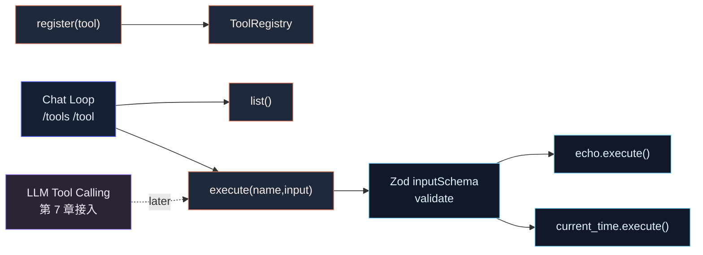

# 第 5 章：实现 Tool Registry

## 本章目标

本章在第 4 章 Streaming Chat Loop 的基础上，实现一个本地 Tool Registry。

完成后，系统会具备这些能力：

- 定义统一的 `Tool` 接口。
- 为每个工具声明 `name`、`description`、`inputSchema`、`inputJSONSchema`、`execute()`。
- 用 Zod 校验工具输入。
- 注册多个内置工具。
- 通过工具名查找工具。
- 通过 `/tools` 查看当前可用工具。
- 通过 `/tool <name> <json>` 手动执行工具。

本章还不让模型自动调用工具。

也就是说，当前工具只能由用户在 CLI 里手动执行：

```text
> /tool echo {"text":"hello"}
```

模型返回 `tool_use`、CLI 执行工具、再把 `tool_result` 交回模型，会在第 7 章实现。

---

## 本章完成效果

安装新依赖：

```bash
bun add zod
```

启动交互模式：

```bash
bun run dev
```

查看工具列表：

```text
> /tools
```

输出：

```text
Available tools:
- echo: Return the input text unchanged.
- current_time: Return the current local time as an ISO string.
```

执行工具：

```text
> /tool echo {"text":"hello tool"}
```

输出：

```text
hello tool
```

执行无参数工具：

```text
> /tool current_time
```

输出：

```text
2026-05-26T...
```

输入错误参数：

```text
> /tool echo {"message":"hello"}
```

会得到清晰的校验错误，而不是让工具带着坏数据继续执行。

---

## 本章项目结构变化

在第 4 章基础上新增 `src/tools/`：

```bash
claude-code-mini/
  package.json
  src/
    chat/
      chatLoop.ts
      session.ts
    llm/
      anthropicClient.ts
      config.ts
      types.ts
    tools/
      builtin/
        currentTime.ts
        echo.ts
      index.ts
      registry.ts
      types.ts
    main.ts
```

新增依赖：

```bash
bun add zod
```

---

## 为什么需要这个模块

到第 4 章为止，Claude Code Mini 已经能对话、能多轮、能 Streaming。

但它仍然只能“说话”，不能“做事”。

Claude Code 类 Coding Agent 的关键能力来自工具：

- 读文件
- 写文件
- 搜索代码
- 执行 shell
- 生成 diff
- 应用 patch
- 管理计划
- 读取上下文

这些能力不能散落在 Agent Loop 里。

如果在 Agent Loop 里写：

```ts
if (toolName === "read_file") {
  ...
}

if (toolName === "write_file") {
  ...
}
```

后面工具一多，系统会很快失控。

真实 Claude Code 的做法是把工具抽象成统一接口：

- `src/Tool.ts` 定义 Tool 类型。
- `src/tools.ts` 组装工具列表。
- `packages/builtin-tools/src/tools/` 存放每个内置工具实现。
- `findToolByName()` 负责按名称或 alias 查找。
- `buildTool()` 给工具补默认行为。

Mini 本章先实现最小版本：

```text
Tool
  -> Registry
    -> register()
    -> list()
    -> get()
    -> execute()
```

等这个边界稳定后，第 6 章添加 `read_file` / `write_file`，第 7 章把模型 Tool Calling 接进来。

---

## 整体架构



---

## 核心流程

本章工具执行链路：

```text
用户输入:
  /tool echo {"text":"hello"}

chatLoop.ts
  -> parseToolCommand()
  -> JSON.parse(rawInput)
  -> toolRegistry.execute("echo", input)

ToolRegistry.execute()
  -> get("echo")
  -> tool.inputSchema.safeParse(input)
  -> tool.execute(parsedInput, context)
  -> return ToolResult

chatLoop.ts
  -> console.log(result.content)
```

工具列表链路：

```text
用户输入:
  /tools

chatLoop.ts
  -> toolRegistry.list()
  -> 打印 name / description
```

这条链路现在由用户手动触发。

第 7 章会把触发方换成模型：

```text
模型输出 tool_use
  -> find tool by name
  -> validate input
  -> execute()
  -> 把 tool_result 追加回 messages
```

---

## 完整核心代码

### package.json

在第 4 章基础上增加 `zod`：

```json
{
  "name": "claude-code-mini",
  "version": "0.1.0",
  "private": true,
  "type": "module",
  "bin": {
    "ccmini": "./src/entrypoints/cli.ts"
  },
  "scripts": {
    "dev": "bun run src/entrypoints/cli.ts",
    "typecheck": "tsc --noEmit"
  },
  "dependencies": {
    "@anthropic-ai/sdk": "^0.81.0",
    "@commander-js/extra-typings": "^14.0.0",
    "zod": "^4.3.6"
  },
  "devDependencies": {
    "@types/bun": "^1.3.0",
    "typescript": "^6.0.0"
  }
}
```

### src/tools/types.ts

```ts
import type { z } from "zod";

export type ToolInputJSONSchema = {
  type: "object";
  properties?: Record<string, unknown>;
  required?: string[];
  additionalProperties?: boolean;
};

export type ToolContext = {
  cwd: string;
};

export type ToolResult = {
  content: string;
  metadata?: Record<string, unknown>;
};

export type Tool<Input = unknown> = {
  name: string;
  description: string;
  inputSchema: z.ZodType<Input>;
  inputJSONSchema: ToolInputJSONSchema;
  isReadOnly: boolean;
  execute(input: Input, context: ToolContext): Promise<ToolResult>;
};

export type ToolSummary = {
  name: string;
  description: string;
  inputJSONSchema: ToolInputJSONSchema;
  isReadOnly: boolean;
};
```

### src/tools/registry.ts

```ts
import type { z } from "zod";
import type { Tool, ToolContext, ToolResult, ToolSummary } from "./types";

export class ToolRegistry {
  private readonly tools = new Map<string, Tool>();

  constructor(private readonly context: ToolContext) {}

  register(tool: Tool): void {
    if (this.tools.has(tool.name)) {
      throw new Error(`Tool already registered: ${tool.name}`);
    }

    this.tools.set(tool.name, tool);
  }

  list(): ToolSummary[] {
    return [...this.tools.values()].map(tool => ({
      name: tool.name,
      description: tool.description,
      inputJSONSchema: tool.inputJSONSchema,
      isReadOnly: tool.isReadOnly,
    }));
  }

  get(name: string): Tool | undefined {
    return this.tools.get(name);
  }

  async execute(name: string, rawInput: unknown): Promise<ToolResult> {
    const tool = this.get(name);

    if (!tool) {
      throw new Error(`Unknown tool: ${name}`);
    }

    const parsed = tool.inputSchema.safeParse(rawInput);

    if (!parsed.success) {
      throw new Error(
        `Invalid input for tool "${name}": ${formatZodError(parsed.error)}`,
      );
    }

    return tool.execute(parsed.data, this.context);
  }
}

function formatZodError(error: z.ZodError): string {
  return error.issues
    .map(issue => {
      const path = issue.path.length > 0 ? issue.path.join(".") : "(root)";
      return `${path}: ${issue.message}`;
    })
    .join("; ");
}
```

### src/tools/builtin/echo.ts

```ts
import { z } from "zod";
import type { Tool } from "../types";

const inputSchema = z
  .object({
    text: z.string(),
  })
  .strict();

type EchoInput = z.infer<typeof inputSchema>;

export const echoTool: Tool<EchoInput> = {
  name: "echo",
  description: "Return the input text unchanged.",
  inputSchema,
  inputJSONSchema: {
    type: "object",
    properties: {
      text: {
        type: "string",
        description: "Text to return.",
      },
    },
    required: ["text"],
    additionalProperties: false,
  },
  isReadOnly: true,
  async execute(input) {
    return {
      content: input.text,
    };
  },
};
```

### src/tools/builtin/currentTime.ts

```ts
import { z } from "zod";
import type { Tool } from "../types";

const inputSchema = z.object({}).strict();

type CurrentTimeInput = z.infer<typeof inputSchema>;

export const currentTimeTool: Tool<CurrentTimeInput> = {
  name: "current_time",
  description: "Return the current local time as an ISO string.",
  inputSchema,
  inputJSONSchema: {
    type: "object",
    properties: {},
    required: [],
    additionalProperties: false,
  },
  isReadOnly: true,
  async execute(_input, context) {
    const now = new Date();
    const timezone = Intl.DateTimeFormat().resolvedOptions().timeZone;

    return {
      content: now.toISOString(),
      metadata: {
        cwd: context.cwd,
        timezone,
      },
    };
  },
};
```

### src/tools/index.ts

```ts
import { currentTimeTool } from "./builtin/currentTime";
import { echoTool } from "./builtin/echo";
import { ToolRegistry } from "./registry";
import type { ToolContext } from "./types";

export function createDefaultToolRegistry(context: ToolContext): ToolRegistry {
  const registry = new ToolRegistry(context);

  registry.register(echoTool);
  registry.register(currentTimeTool);

  return registry;
}

export { ToolRegistry };
export type { Tool, ToolContext, ToolResult, ToolSummary } from "./types";
```

### src/chat/chatLoop.ts

用下面版本替换第 4 章的 `src/chat/chatLoop.ts`：

```ts
import { stdin as input, stdout as output } from "node:process";
import { createInterface } from "node:readline/promises";
import { ChatSession } from "./session";
import type { LLMConfig, LLMResponse } from "../llm/types";
import type { ToolRegistry } from "../tools";

type ChatLoopOptions = {
  cwd: string;
  toolRegistry: ToolRegistry;
};

export async function runChatLoop(
  config: LLMConfig,
  options: ChatLoopOptions,
): Promise<void> {
  const session = new ChatSession(config);
  const rl = createInterface({ input, output });

  console.log("Claude Code Mini");
  console.log(`model: ${config.model}`);
  console.log(`cwd: ${options.cwd}`);
  console.log("");
  console.log("Type /exit to quit, /clear to reset conversation.");
  console.log("Type /tools to list tools, /tool <name> <json> to run one.");
  console.log("");

  try {
    while (true) {
      const rawInput = await rl.question("> ");
      const prompt = rawInput.trim();

      if (!prompt) {
        continue;
      }

      if (prompt === "/exit" || prompt === "/quit") {
        break;
      }

      if (prompt === "/clear") {
        session.clear();
        console.log("Conversation cleared.");
        continue;
      }

      if (prompt === "/tools") {
        printTools(options.toolRegistry);
        continue;
      }

      if (prompt.startsWith("/tool ")) {
        await runToolCommand(prompt, options.toolRegistry);
        continue;
      }

      try {
        let finalResponse: LLMResponse | undefined;

        console.log("");

        for await (const event of session.sendUserMessageStream(prompt)) {
          if (event.type === "text_delta") {
            output.write(event.text);
          }

          if (event.type === "message_stop") {
            finalResponse = event.response;
          }
        }

        console.log("");

        if (finalResponse) {
          console.log(
            `[${session.history.length} messages, ${finalResponse.inputTokens} input / ${finalResponse.outputTokens} output tokens]`,
          );
        }

        console.log("");
      } catch (error) {
        const message = error instanceof Error ? error.message : String(error);
        console.error(`Error: ${message}`);
      }
    }
  } finally {
    rl.close();
  }
}

function printTools(toolRegistry: ToolRegistry): void {
  const tools = toolRegistry.list();

  if (tools.length === 0) {
    console.log("No tools registered.");
    return;
  }

  console.log("Available tools:");
  for (const tool of tools) {
    console.log(`- ${tool.name}: ${tool.description}`);
  }
}

async function runToolCommand(
  command: string,
  toolRegistry: ToolRegistry,
): Promise<void> {
  const rest = command.slice("/tool ".length).trim();

  if (!rest) {
    console.log('Usage: /tool <name> <json>. Example: /tool echo {"text":"hello"}');
    return;
  }

  const firstWhitespace = rest.search(/\s/);
  const name = firstWhitespace === -1 ? rest : rest.slice(0, firstWhitespace);
  const rawJson = firstWhitespace === -1 ? "{}" : rest.slice(firstWhitespace).trim();

  let inputValue: unknown;

  try {
    inputValue = rawJson ? JSON.parse(rawJson) : {};
  } catch {
    console.error(`Error: invalid JSON input for tool "${name}".`);
    return;
  }

  try {
    const result = await toolRegistry.execute(name, inputValue);
    console.log(result.content);

    if (result.metadata) {
      console.log(JSON.stringify(result.metadata, null, 2));
    }
  } catch (error) {
    const message = error instanceof Error ? error.message : String(error);
    console.error(`Error: ${message}`);
  }
}
```

### src/main.ts

用下面版本替换第 4 章的 `src/main.ts`：

```ts
import { Command as CommanderCommand } from "@commander-js/extra-typings";
import { stdout } from "node:process";
import { ChatSession } from "./chat/session";
import { runChatLoop } from "./chat/chatLoop";
import { CLI_NAME, PRODUCT_NAME, VERSION } from "./constants";
import { loadLLMConfig } from "./llm/config";
import type { LLMConfig, LLMResponse } from "./llm/types";
import { createDefaultToolRegistry } from "./tools";

type RootOptions = {
  print?: boolean;
  cwd: string;
  model?: string;
};

export async function main(argv = process.argv): Promise<CommanderCommand> {
  const program = new CommanderCommand();

  program
    .name(CLI_NAME)
    .description(
      `${PRODUCT_NAME} - starts a coding-agent session by default, use -p/--print for non-interactive output`,
    )
    .argument("[prompt...]", "Your prompt")
    .helpOption("-h, --help", "Display help for command")
    .option(
      "-p, --print",
      "Print response and exit. This will become the headless mode in later chapters.",
      false,
    )
    .option("--cwd <path>", "Working directory for the session", process.cwd())
    .option("--model <model>", "Override the model for this request")
    .version(`${VERSION} (${PRODUCT_NAME})`, "-v, --version", "Output the version number")
    .action(async (promptParts: string[] | undefined, options: RootOptions) => {
      await handlePrompt(promptParts ?? [], options);
    });

  await program.parseAsync(argv);
  return program;
}

async function handlePrompt(promptParts: string[], options: RootOptions): Promise<void> {
  const prompt = promptParts.join(" ").trim();

  try {
    const config = loadLLMConfig();
    if (options.model) {
      config.model = options.model;
    }

    if (prompt) {
      await runSinglePrompt(prompt, config, options);
      return;
    }

    if (options.print) {
      console.error("Error: -p/--print requires a prompt.");
      process.exitCode = 1;
      return;
    }

    if (!process.stdin.isTTY) {
      console.error("Error: interactive mode requires a TTY. Pass a prompt or use -p.");
      process.exitCode = 1;
      return;
    }

    const toolRegistry = createDefaultToolRegistry({ cwd: options.cwd });
    await runChatLoop(config, { cwd: options.cwd, toolRegistry });
  } catch (error) {
    const message = error instanceof Error ? error.message : String(error);
    console.error(`Error: ${message}`);
    process.exitCode = 1;
  }
}

async function runSinglePrompt(
  prompt: string,
  config: LLMConfig,
  options: RootOptions,
): Promise<void> {
  const session = new ChatSession(config);
  let finalResponse: LLMResponse | undefined;

  for await (const event of session.sendUserMessageStream(prompt)) {
    if (event.type === "text_delta") {
      stdout.write(event.text);
    }

    if (event.type === "message_stop") {
      finalResponse = event.response;
    }
  }

  console.log("");

  if (!options.print && finalResponse) {
    console.log("");
    console.log(`model: ${finalResponse.model}`);
    console.log(`tokens: ${finalResponse.inputTokens} input / ${finalResponse.outputTokens} output`);
    console.log(`cwd: ${options.cwd}`);
  }
}
```

其他文件不需要修改。

---

## 逐步实现

### 1. 安装 Zod

```bash
bun add zod
```

真实 Claude Code 源码里的工具输入也使用 Zod 风格的 schema。Mini 用 Zod 是为了让工具输入校验从一开始就有类型边界。

### 2. 创建 tools 目录

```bash
mkdir -p src/tools/builtin
touch src/tools/types.ts
touch src/tools/registry.ts
touch src/tools/builtin/echo.ts
touch src/tools/builtin/currentTime.ts
touch src/tools/index.ts
```

### 3. 定义 Tool 接口

先写 `src/tools/types.ts`。

本章最小 Tool 接口只保留六个字段：

```ts
name
description
inputSchema
inputJSONSchema
isReadOnly
execute()
```

其中：

- `inputSchema` 给本地运行时校验用。
- `inputJSONSchema` 后面发给 LLM，让模型知道怎么填参数。
- `isReadOnly` 后面给权限系统和安全策略用。
- `execute()` 是工具真正执行逻辑。

真实源码的 Tool 接口更大，因为它还要处理：

- 权限检查
- UI 渲染
- 进度消息
- MCP metadata
- 结果持久化
- tool result 转 API block
- 自动模式安全分类
- 并发安全
- 文件路径权限

Mini 暂时不要一次性复制这些复杂度。

### 4. 实现 ToolRegistry

写 `src/tools/registry.ts`。

核心数据结构是：

```ts
private readonly tools = new Map<string, Tool>();
```

`register()` 负责注册：

```ts
this.tools.set(tool.name, tool);
```

`execute()` 负责查找、校验、执行：

```ts
const parsed = tool.inputSchema.safeParse(rawInput);
return tool.execute(parsed.data, this.context);
```

不要让每个工具自己重复写：

```ts
if (typeof input.text !== "string") ...
```

输入校验应该是 Registry 的统一入口。

### 5. 实现 echo 工具

`echo` 是最小工具，用来验证有参数工具的链路。

它的输入：

```ts
{
  text: string
}
```

它的输出：

```ts
input.text
```

这个工具没有业务价值，但非常适合做 Registry 验证。

### 6. 实现 current_time 工具

`current_time` 是无参数工具，用来验证空对象 schema。

它的输入是：

```ts
{}
```

执行：

```ts
new Date().toISOString()
```

后面 Tool Calling 章节里，这类工具能让模型回答“现在是什么时间”。

### 7. 组装默认工具注册表

写 `src/tools/index.ts`：

```ts
export function createDefaultToolRegistry(context: ToolContext): ToolRegistry {
  const registry = new ToolRegistry(context);
  registry.register(echoTool);
  registry.register(currentTimeTool);
  return registry;
}
```

后续新增工具，只需要在这里注册。

这对应真实源码中的 `getAllBaseTools()`。

### 8. 在 Chat Loop 中接入 /tools

在 `chatLoop.ts` 中添加：

```ts
if (prompt === "/tools") {
  printTools(options.toolRegistry);
  continue;
}
```

这个命令只打印 Registry 里的工具，不调用模型。

### 9. 在 Chat Loop 中接入 /tool

添加：

```ts
if (prompt.startsWith("/tool ")) {
  await runToolCommand(prompt, options.toolRegistry);
  continue;
}
```

`/tool` 的格式：

```text
/tool <name> <json>
```

例如：

```text
/tool echo {"text":"hello"}
```

无参数工具可以省略 JSON：

```text
/tool current_time
```

### 10. 在 main.ts 创建 Registry

交互模式启动时创建一次：

```ts
const toolRegistry = createDefaultToolRegistry({ cwd: options.cwd });
await runChatLoop(config, { cwd: options.cwd, toolRegistry });
```

为什么不是每次 `/tool` 都创建？

因为后续工具可能有状态，例如缓存、权限上下文、会话目录。Registry 应该跟随会话生命周期，而不是每次命令重建。

---

## 关键源码分析

### 1. Tool.ts 是真实工具系统的类型边界

真实 `src/Tool.ts` 里定义了非常完整的 `Tool` 类型。

它包含：

- `name`
- `aliases`
- `description()`
- `prompt()`
- `inputSchema`
- `inputJSONSchema`
- `call()`
- `validateInput()`
- `checkPermissions()`
- `isReadOnly()`
- `isDestructive()`
- `renderToolUseMessage()`
- `renderToolResultMessage()`
- `mapToolResultToToolResultBlockParam()`

Mini 本章不是复制它，而是抽出最核心的执行边界：

```text
name -> schema -> execute()
```

这是工具系统的最小闭环。

### 2. buildTool() 用默认值降低工具实现成本

真实源码中，工具通常通过 `buildTool()` 导出。

`buildTool()` 会给工具补默认方法：

- `isEnabled` 默认 true
- `isConcurrencySafe` 默认 false
- `isReadOnly` 默认 false
- `isDestructive` 默认 false
- `checkPermissions` 默认 allow
- `userFacingName` 默认工具名

这样每个工具不用重复写一堆样板代码。

Mini 本章还没有这么多字段，所以暂时不需要 `buildTool()`。

等后面加入权限、只读工具、破坏性工具、UI 展示时，可以再把默认值抽出来。

### 3. tools.ts 是真实工具注册中心

真实 `src/tools.ts` 里有：

```ts
export function getAllBaseTools(): Tools {
  return [
    AgentTool,
    TaskOutputTool,
    BashTool,
    GlobTool,
    GrepTool,
    FileReadTool,
    FileEditTool,
    FileWriteTool,
    ...
  ];
}
```

它还会根据环境和 feature flag 条件注册：

- Ant-only 工具
- REPL 工具
- LSP 工具
- Worktree 工具
- Cron 工具
- SearchExtraTools
- MCP resource 工具

Mini 对应的是：

```ts
registry.register(echoTool);
registry.register(currentTimeTool);
```

先小后大。

### 4. findToolByName() 是模型 tool_use 的前置能力

真实源码里有：

```ts
export function toolMatchesName(tool, name) {
  return tool.name === name || (tool.aliases?.includes(name) ?? false);
}

export function findToolByName(tools, name) {
  return tools.find(t => toolMatchesName(t, name));
}
```

第 7 章处理模型 `tool_use` 时，一定会需要这个能力。

Mini 本章的 `ToolRegistry.get(name)` 先只按主名称查找。

后面如果要支持工具重命名兼容，可以扩展成：

```ts
aliases?: string[]
```

### 5. 为什么 inputSchema 和 inputJSONSchema 都要存在

真实系统里，工具 schema 有两个用途：

```text
给本地运行时校验：Zod schema
给模型理解参数：JSON Schema
```

本地运行时需要强校验：

```ts
tool.inputSchema.safeParse(rawInput)
```

模型 API 需要 JSON Schema：

```json
{
  "name": "read_file",
  "input_schema": {
    "type": "object",
    "properties": {
      "path": { "type": "string" }
    },
    "required": ["path"]
  }
}
```

本章虽然还没有把 schema 发给模型，但提前放好 `inputJSONSchema`，第 7 章接 Tool Calling 时就不用再重构工具定义。

### 6. 为什么本章不做权限

真实工具系统里，权限是大头。

例如 `FileWriteTool` 会检查：

- 是否允许写这个路径
- 是否命中 deny rule
- 是否需要用户确认
- 是否是危险操作
- 是否会修改 team memory secret

Mini 本章不做权限，因为现在工具只有：

- `echo`
- `current_time`

它们都是只读且无副作用。

第 6 章加入文件读写后，才开始引入最小权限边界。

---

## 调试与验证

### 1. 安装依赖

```bash
bun install
```

如果还没安装 Zod：

```bash
bun add zod
```

### 2. 设置 API Key

```bash
export ANTHROPIC_API_KEY="<your-api-key>"
```

当前交互模式仍然会初始化 LLM 配置，所以需要 API Key。后面可以再把工具命令抽成独立子命令。

### 3. 类型检查

```bash
bun run typecheck
```

必须通过。

### 4. 查看工具列表

```bash
bun run dev
```

输入：

```text
> /tools
```

预期输出：

```text
Available tools:
- echo: Return the input text unchanged.
- current_time: Return the current local time as an ISO string.
```

### 5. 执行 echo

```text
> /tool echo {"text":"hello"}
```

预期输出：

```text
hello
```

### 6. 执行 current_time

```text
> /tool current_time
```

预期输出 ISO 时间，并打印 metadata：

```text
2026-05-26T...
{
  "cwd": "/your/path/claude-code-mini",
  "timezone": "Asia/Shanghai"
}
```

### 7. 验证未知工具

```text
> /tool missing_tool {}
```

预期输出：

```text
Error: Unknown tool: missing_tool
```

### 8. 验证输入校验

```text
> /tool echo {"message":"hello"}
```

预期输出类似：

```text
Error: Invalid input for tool "echo": text: Invalid input: expected string, received undefined; (root): Unrecognized key: "message"
```

具体文案可能随 Zod 版本略有不同，但必须能说明输入不符合 schema。

### 9. 验证 Chat Loop 不受影响

输入普通 prompt：

```text
> 用一句话解释工具注册表
```

模型仍然应该正常 Streaming 输出。

---

## 常见问题

### 1. `Cannot find module 'zod'`

原因：没有安装依赖。

解决：

```bash
bun add zod
```

或者：

```bash
bun install
```

### 2. `/tool echo {"text":"hello"}` 报 JSON 错误

确认 JSON 是双引号：

```text
/tool echo {"text":"hello"}
```

不是：

```text
/tool echo {'text':'hello'}
```

JSON 标准不支持单引号。

### 3. `/tool current_time {}` 和 `/tool current_time` 有什么区别

两者等价。

`/tool current_time` 没有传 JSON 时，代码默认使用：

```ts
{}
```

### 4. `/tools` 需要调用模型吗

不需要。

`/tools` 只读取本地 Registry。

但本章的交互模式启动时仍然会读取 LLM config，所以进入 REPL 前需要 `ANTHROPIC_API_KEY`。这不是工具系统的限制，而是当前 CLI 启动流程还比较简单。

### 5. 为什么不直接让模型调用工具

因为还缺三件事：

- 把工具 schema 传给 Messages API。
- 解析模型返回的 `tool_use` block。
- 执行工具后，把 `tool_result` 作为 user message 追加回模型上下文。

这三件事会在第 7 章实现。

本章先把本地 Registry 做稳。

### 6. 为什么工具结果是 `content: string`

第 5 章先用字符串结果，方便终端显示和调试。

后面文件读写工具会返回更结构化的数据，例如：

```ts
{
  content: string;
  metadata: { path: string; bytes: number }
}
```

再往后接 API Tool Calling 时，还会把结果转成 Anthropic 的 `tool_result` content block。

---

## 本章小结

这一章给 Claude Code Mini 加上了第一版 Tool Registry。

当前系统已经具备：

- 统一 Tool 接口。
- Zod 输入校验。
- JSON Schema 描述。
- 工具注册表。
- 工具列表查询。
- 本地手动工具执行。
- `echo` 和 `current_time` 两个内置工具。

当前还缺少：

- 文件读写工具。
- Shell 执行工具。
- 工具权限。
- 工具结果转 Anthropic `tool_result`。
- 模型自动 Tool Calling。
- Agent Loop 中的工具调用循环。

下一章会实现 `read_file` / `write_file`。

那一章开始，工具会真正接触本地文件系统，也就必须开始处理路径、安全边界和错误信息。
