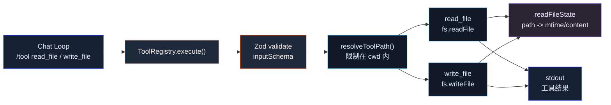

# 第 6 章：实现 read_file / write_file

## 本章目标

本章在第 5 章 Tool Registry 的基础上，实现两个真正有用的文件工具：

- `read_file`
- `write_file`

完成后，系统会具备这些能力：

- 通过工具读取当前工作目录内的文本文件。
- 支持 `offset` / `limit` 读取文件片段。
- 写入新文件。
- 更新已有文件。
- 自动创建父目录。
- 限制工具只能访问 `cwd` 内的文件。
- 记录文件读取时的 `mtimeMs`，写入已有文件前做 stale check。
- 继续通过 `/tool <name> <json>` 手动执行工具。

本章仍然不接模型 Tool Calling。

第 7 章才会把模型返回的 `tool_use` 接到这里。

---

## 本章完成效果

启动交互模式：

```bash
bun run dev
```

读取文件：

```text
> /tool read_file {"path":"package.json"}
```

输出：

```text
1 | {
2 |   "name": "claude-code-mini",
3 |   ...
```

读取指定范围：

```text
> /tool read_file {"path":"src/main.ts","offset":1,"limit":20}
```

写入新文件：

```text
> /tool write_file {"path":"notes/hello.txt","content":"hello\n"}
```

输出：

```text
File created: notes/hello.txt
```

更新已有文件前，先读：

```text
> /tool read_file {"path":"notes/hello.txt"}
> /tool write_file {"path":"notes/hello.txt","content":"hello again\n"}
```

输出：

```text
File updated: notes/hello.txt
```

---

## 本章项目结构变化

在第 5 章基础上新增三个文件，并修改三个文件：

```bash
claude-code-mini/
  src/
    tools/
      builtin/
        currentTime.ts
        echo.ts
        readFile.ts       # 新增
        writeFile.ts      # 新增
      index.ts            # 修改：注册 read_file / write_file
      path.ts             # 新增
      registry.ts
      types.ts            # 修改：ToolContext 增加 readFileState
    main.ts               # 修改：创建 readFileState
```

本章不新增依赖。继续使用第 5 章已经安装的 `zod`。

---

## 为什么需要这个模块

到第 5 章为止，Mini 已经有 Tool Registry，但工具还只是：

- `echo`
- `current_time`

它们只能验证工具系统是否能跑，不能让 Coding Agent 真正操作代码。

Claude Code 类系统最基础的代码能力是：

```text
读取文件 -> 理解代码 -> 写回文件
```

所以这一章先实现文件读写。

真实源码里对应的是：

- `packages/builtin-tools/src/tools/FileReadTool/FileReadTool.ts`
- `packages/builtin-tools/src/tools/FileWriteTool/FileWriteTool.ts`
- `src/utils/path.ts`
- `src/utils/file.ts`

真实实现比 Mini 复杂很多，因为它要支持：

- 图片
- PDF
- Notebook
- 大文件 token 限制
- 文件读取去重
- 权限规则
- LSP 通知
- VSCode diff 通知
- 文件历史备份
- Git diff
- secret scanner
- dynamic skill activation

Mini 本章只实现文本文件读写，但保留两个关键工程原则：

1. 路径必须被解析和限制。
2. 写已有文件前必须确认文件没有在读取后被外部修改。

这两个原则比“能读写”本身更重要。

---

## 整体架构



---

## 核心流程

`read_file` 调用链：

```text
/tool read_file {"path":"src/main.ts","offset":1,"limit":20}
  -> ToolRegistry.execute("read_file", rawInput)
  -> readFileTool.inputSchema.safeParse(rawInput)
  -> resolveToolPath(cwd, input.path)
  -> fs.stat(absPath)
  -> fs.readFile(absPath, "utf8")
  -> 按 offset / limit 切片
  -> readFileState.set(absPath, { content, mtimeMs })
  -> 返回带行号的内容
```

`write_file` 调用链：

```text
/tool write_file {"path":"src/a.ts","content":"..."}
  -> ToolRegistry.execute("write_file", rawInput)
  -> writeFileTool.inputSchema.safeParse(rawInput)
  -> resolveToolPath(cwd, input.path)
  -> 如果文件存在:
       -> 检查 readFileState 是否有这个文件
       -> stat 当前 mtimeMs
       -> 如果 mtimeMs 比读取时更新，拒绝写入
  -> mkdir(parent, { recursive: true })
  -> fs.writeFile(absPath, content, "utf8")
  -> 更新 readFileState
  -> 返回 create / update 结果
```

为什么写已有文件前要先读？

因为 Agent 写文件时，通常应该基于自己看过的版本修改。

如果用户、格式化器、测试脚本或另一个工具在中间改了文件，直接覆盖会丢数据。

---

## 完整核心代码

### src/tools/types.ts

用下面版本替换第 5 章的 `src/tools/types.ts`：

```ts
import type { z } from "zod";

export type ToolInputJSONSchema = {
  type: "object";
  properties?: Record<string, unknown>;
  required?: string[];
  additionalProperties?: boolean;
};

export type ReadFileStateEntry = {
  content: string;
  mtimeMs: number;
};

export type ToolContext = {
  cwd: string;
  readFileState: Map<string, ReadFileStateEntry>;
};

export type ToolResult = {
  content: string;
  metadata?: Record<string, unknown>;
};

export type Tool<Input = unknown> = {
  name: string;
  description: string;
  inputSchema: z.ZodType<Input>;
  inputJSONSchema: ToolInputJSONSchema;
  isReadOnly: boolean;
  execute(input: Input, context: ToolContext): Promise<ToolResult>;
};

export type ToolSummary = {
  name: string;
  description: string;
  inputJSONSchema: ToolInputJSONSchema;
  isReadOnly: boolean;
};
```

### src/tools/path.ts

```ts
import { isAbsolute, relative, resolve } from "node:path";

export function resolveToolPath(cwd: string, inputPath: string): string {
  if (inputPath.includes("\0")) {
    throw new Error("Path contains null byte.");
  }

  const absolutePath = isAbsolute(inputPath)
    ? resolve(inputPath)
    : resolve(cwd, inputPath);

  const relativePath = relative(cwd, absolutePath);

  if (
    relativePath === ".." ||
    relativePath.startsWith(`..${pathSeparator()}`) ||
    isAbsolute(relativePath)
  ) {
    throw new Error(`Path is outside the working directory: ${inputPath}`);
  }

  return absolutePath;
}

export function toDisplayPath(cwd: string, absolutePath: string): string {
  const relativePath = relative(cwd, absolutePath);

  if (!relativePath.startsWith("..") && !isAbsolute(relativePath)) {
    return relativePath || ".";
  }

  return absolutePath;
}

function pathSeparator(): string {
  return process.platform === "win32" ? "\\" : "/";
}
```

这里的策略比真实 Claude Code 更保守。

真实系统可以通过权限和 additional working directories 允许访问更多路径。Mini 当前没有权限系统，所以先限制在 `cwd` 内。

### src/tools/builtin/readFile.ts

```ts
import { readFile, stat } from "node:fs/promises";
import { z } from "zod";
import { resolveToolPath, toDisplayPath } from "../path";
import type { Tool } from "../types";

const MAX_FILE_BYTES = 256 * 1024;

const inputSchema = z
  .object({
    path: z.string().min(1),
    offset: z.number().int().positive().optional(),
    limit: z.number().int().positive().optional(),
  })
  .strict();

type ReadFileInput = z.infer<typeof inputSchema>;

export const readFileTool: Tool<ReadFileInput> = {
  name: "read_file",
  description: "Read a UTF-8 text file from the current working directory.",
  inputSchema,
  inputJSONSchema: {
    type: "object",
    properties: {
      path: {
        type: "string",
        description: "Path to the file, relative to cwd or absolute inside cwd.",
      },
      offset: {
        type: "number",
        description: "1-based line number to start reading from.",
      },
      limit: {
        type: "number",
        description: "Maximum number of lines to return.",
      },
    },
    required: ["path"],
    additionalProperties: false,
  },
  isReadOnly: true,
  async execute(input, context) {
    const absolutePath = resolveToolPath(context.cwd, input.path);
    const fileStat = await stat(absolutePath);

    if (!fileStat.isFile()) {
      throw new Error(`Path is not a file: ${input.path}`);
    }

    if (fileStat.size > MAX_FILE_BYTES && input.limit === undefined) {
      throw new Error(
        `File is too large (${fileStat.size} bytes). Use offset and limit to read a smaller range.`,
      );
    }

    const content = await readFile(absolutePath, "utf8");
    const lines = content.split(/\r?\n/);
    const startLine = input.offset ?? 1;
    const startIndex = startLine - 1;
    const selectedLines =
      input.limit === undefined
        ? lines.slice(startIndex)
        : lines.slice(startIndex, startIndex + input.limit);

    const numberedContent = selectedLines
      .map((line, index) => `${startLine + index} | ${line}`)
      .join("\n");

    context.readFileState.set(absolutePath, {
      content,
      mtimeMs: Math.floor(fileStat.mtimeMs),
    });

    return {
      content:
        numberedContent ||
        `<empty range: file has ${lines.length} line(s), requested offset ${startLine}>`,
      metadata: {
        path: toDisplayPath(context.cwd, absolutePath),
        bytes: fileStat.size,
        totalLines: lines.length,
        startLine,
        returnedLines: selectedLines.length,
      },
    };
  },
};
```

### src/tools/builtin/writeFile.ts

```ts
import { mkdir, readFile, stat, writeFile } from "node:fs/promises";
import { dirname } from "node:path";
import { z } from "zod";
import { resolveToolPath, toDisplayPath } from "../path";
import type { Tool } from "../types";

const inputSchema = z
  .object({
    path: z.string().min(1),
    content: z.string(),
  })
  .strict();

type WriteFileInput = z.infer<typeof inputSchema>;

export const writeFileTool: Tool<WriteFileInput> = {
  name: "write_file",
  description: "Create or overwrite a UTF-8 text file in the current working directory.",
  inputSchema,
  inputJSONSchema: {
    type: "object",
    properties: {
      path: {
        type: "string",
        description: "Path to write, relative to cwd or absolute inside cwd.",
      },
      content: {
        type: "string",
        description: "Full file content to write.",
      },
    },
    required: ["path", "content"],
    additionalProperties: false,
  },
  isReadOnly: false,
  async execute(input, context) {
    const absolutePath = resolveToolPath(context.cwd, input.path);
    const displayPath = toDisplayPath(context.cwd, absolutePath);

    const existing = await readExistingFile(absolutePath);

    if (existing) {
      const lastRead = context.readFileState.get(absolutePath);

      if (!lastRead) {
        throw new Error(
          `Refusing to overwrite ${displayPath}. Read the file first with read_file.`,
        );
      }

      if (existing.mtimeMs > lastRead.mtimeMs && existing.content !== lastRead.content) {
        throw new Error(
          `Refusing to overwrite ${displayPath}. The file changed after it was read. Read it again before writing.`,
        );
      }
    }

    await mkdir(dirname(absolutePath), { recursive: true });
    await writeFile(absolutePath, input.content, "utf8");

    const newStat = await stat(absolutePath);
    context.readFileState.set(absolutePath, {
      content: input.content,
      mtimeMs: Math.floor(newStat.mtimeMs),
    });

    return {
      content: existing ? `File updated: ${displayPath}` : `File created: ${displayPath}`,
      metadata: {
        path: displayPath,
        bytes: Buffer.byteLength(input.content, "utf8"),
        operation: existing ? "update" : "create",
      },
    };
  },
};

async function readExistingFile(
  absolutePath: string,
): Promise<{ content: string; mtimeMs: number } | null> {
  try {
    const fileStat = await stat(absolutePath);

    if (!fileStat.isFile()) {
      throw new Error("Path exists but is not a file.");
    }

    const content = await readFile(absolutePath, "utf8");

    return {
      content,
      mtimeMs: Math.floor(fileStat.mtimeMs),
    };
  } catch (error) {
    if (isNotFoundError(error)) {
      return null;
    }

    throw error;
  }
}

function isNotFoundError(error: unknown): boolean {
  return (
    typeof error === "object" &&
    error !== null &&
    "code" in error &&
    error.code === "ENOENT"
  );
}
```

### src/tools/index.ts

用下面版本替换第 5 章的 `src/tools/index.ts`：

```ts
import { currentTimeTool } from "./builtin/currentTime";
import { echoTool } from "./builtin/echo";
import { readFileTool } from "./builtin/readFile";
import { writeFileTool } from "./builtin/writeFile";
import { ToolRegistry } from "./registry";
import type { ToolContext } from "./types";

export function createDefaultToolRegistry(context: ToolContext): ToolRegistry {
  const registry = new ToolRegistry(context);

  registry.register(echoTool);
  registry.register(currentTimeTool);
  registry.register(readFileTool);
  registry.register(writeFileTool);

  return registry;
}

export { ToolRegistry };
export type { Tool, ToolContext, ToolResult, ToolSummary } from "./types";
```

### src/main.ts

只需要修改 `handlePrompt()` 里的 Registry 创建位置。

把第 5 章里的：

```ts
const toolRegistry = createDefaultToolRegistry({ cwd: options.cwd });
await runChatLoop(config, { cwd: options.cwd, toolRegistry });
```

改成：

```ts
const readFileState = new Map();
const toolRegistry = createDefaultToolRegistry({
  cwd: options.cwd,
  readFileState,
});
await runChatLoop(config, { cwd: options.cwd, toolRegistry });
```

完整 `src/main.ts`：

```ts
import { Command as CommanderCommand } from "@commander-js/extra-typings";
import { stdout } from "node:process";
import { ChatSession } from "./chat/session";
import { runChatLoop } from "./chat/chatLoop";
import { CLI_NAME, PRODUCT_NAME, VERSION } from "./constants";
import { loadLLMConfig } from "./llm/config";
import type { LLMConfig, LLMResponse } from "./llm/types";
import { createDefaultToolRegistry } from "./tools";

type RootOptions = {
  print?: boolean;
  cwd: string;
  model?: string;
};

export async function main(argv = process.argv): Promise<CommanderCommand> {
  const program = new CommanderCommand();

  program
    .name(CLI_NAME)
    .description(
      `${PRODUCT_NAME} - starts a coding-agent session by default, use -p/--print for non-interactive output`,
    )
    .argument("[prompt...]", "Your prompt")
    .helpOption("-h, --help", "Display help for command")
    .option(
      "-p, --print",
      "Print response and exit. This will become the headless mode in later chapters.",
      false,
    )
    .option("--cwd <path>", "Working directory for the session", process.cwd())
    .option("--model <model>", "Override the model for this request")
    .version(`${VERSION} (${PRODUCT_NAME})`, "-v, --version", "Output the version number")
    .action(async (promptParts: string[] | undefined, options: RootOptions) => {
      await handlePrompt(promptParts ?? [], options);
    });

  await program.parseAsync(argv);
  return program;
}

async function handlePrompt(promptParts: string[], options: RootOptions): Promise<void> {
  const prompt = promptParts.join(" ").trim();

  try {
    const config = loadLLMConfig();
    if (options.model) {
      config.model = options.model;
    }

    if (prompt) {
      await runSinglePrompt(prompt, config, options);
      return;
    }

    if (options.print) {
      console.error("Error: -p/--print requires a prompt.");
      process.exitCode = 1;
      return;
    }

    if (!process.stdin.isTTY) {
      console.error("Error: interactive mode requires a TTY. Pass a prompt or use -p.");
      process.exitCode = 1;
      return;
    }

    const readFileState = new Map();
    const toolRegistry = createDefaultToolRegistry({
      cwd: options.cwd,
      readFileState,
    });

    await runChatLoop(config, { cwd: options.cwd, toolRegistry });
  } catch (error) {
    const message = error instanceof Error ? error.message : String(error);
    console.error(`Error: ${message}`);
    process.exitCode = 1;
  }
}

async function runSinglePrompt(
  prompt: string,
  config: LLMConfig,
  options: RootOptions,
): Promise<void> {
  const session = new ChatSession(config);
  let finalResponse: LLMResponse | undefined;

  for await (const event of session.sendUserMessageStream(prompt)) {
    if (event.type === "text_delta") {
      stdout.write(event.text);
    }

    if (event.type === "message_stop") {
      finalResponse = event.response;
    }
  }

  console.log("");

  if (!options.print && finalResponse) {
    console.log("");
    console.log(`model: ${finalResponse.model}`);
    console.log(`tokens: ${finalResponse.inputTokens} input / ${finalResponse.outputTokens} output`);
    console.log(`cwd: ${options.cwd}`);
  }
}
```

`chatLoop.ts` 不需要修改，因为第 5 章已经实现了通用 `/tool` 命令。新增工具只要注册进 Registry，就能被 `/tool` 调用。

---

## 逐步实现

### 1. 新增 path 工具函数

创建：

```bash
touch src/tools/path.ts
```

写入 `resolveToolPath()` 和 `toDisplayPath()`。

这里的核心是：

```ts
const relativePath = relative(cwd, absolutePath);

if (relativePath.startsWith("..") || isAbsolute(relativePath)) {
  throw new Error(...);
}
```

这能防止：

```text
/tool read_file {"path":"../../.ssh/id_rsa"}
```

Mini 当前没有完整权限系统，所以必须先把文件访问限制在 `cwd` 内。

### 2. 扩展 ToolContext

修改 `src/tools/types.ts`：

```ts
export type ReadFileStateEntry = {
  content: string;
  mtimeMs: number;
};

export type ToolContext = {
  cwd: string;
  readFileState: Map<string, ReadFileStateEntry>;
};
```

`readFileState` 是本章的关键状态。

它记录：

- 读过哪个文件
- 读到的内容是什么
- 当时文件的修改时间是什么

写文件时用它判断“我准备覆盖的文件，是不是还是我刚才看到的那个版本”。

### 3. 实现 read_file

创建：

```bash
touch src/tools/builtin/readFile.ts
```

`read_file` 做五件事：

1. 校验输入。
2. 解析路径，并限制在 `cwd` 内。
3. 检查目标是文件。
4. 读取文本内容。
5. 更新 `readFileState`。

返回内容时加行号：

```ts
1 | import ...
2 | const ...
```

行号对后续编辑很重要。后面做 `edit_file` / diff / patch 时，模型需要知道要改哪一段。

### 4. 实现 offset / limit

`offset` 是 1-based 行号。

```ts
const startLine = input.offset ?? 1;
const startIndex = startLine - 1;
```

`limit` 是最多返回多少行：

```ts
lines.slice(startIndex, startIndex + input.limit)
```

真实 `FileReadTool` 也有 `offset` / `limit`，用来处理大文件。

### 5. 实现 write_file

创建：

```bash
touch src/tools/builtin/writeFile.ts
```

`write_file` 做六件事：

1. 校验输入。
2. 解析路径，并限制在 `cwd` 内。
3. 判断文件是否已存在。
4. 如果存在，检查 `readFileState`。
5. 创建父目录。
6. 写入完整内容。

注意：这个工具是“完整覆盖写入”，不是局部编辑。

这和真实 `FileWriteTool` 一致：它接收完整 `content`，写入整个文件。

### 6. 实现写前 stale check

已有文件必须先读：

```ts
if (!lastRead) {
  throw new Error(`Refusing to overwrite ${displayPath}. Read the file first with read_file.`);
}
```

如果文件读完后被别人改过，也拒绝写：

```ts
if (existing.mtimeMs > lastRead.mtimeMs && existing.content !== lastRead.content) {
  throw new Error(...);
}
```

这里同时比较 `mtimeMs` 和内容，是为了减少误判。

有些系统会触碰文件时间戳，但内容没变；只看时间戳会太保守。

### 7. 注册文件工具

修改 `src/tools/index.ts`：

```ts
registry.register(readFileTool);
registry.register(writeFileTool);
```

第 5 章的 `/tools` 命令会自动看到新工具。

### 8. 创建会话级 readFileState

修改 `src/main.ts`：

```ts
const readFileState = new Map();
const toolRegistry = createDefaultToolRegistry({
  cwd: options.cwd,
  readFileState,
});
```

这个 Map 必须在交互会话启动时创建一次，并在整个会话里复用。

不要在 `write_file` 内部创建新 Map，否则它永远不知道之前读过什么。

---

## 关键源码分析

### 1. FileReadTool 的输入设计

真实 `FileReadTool` 的输入包含：

```ts
file_path: string
offset?: number
limit?: number
pages?: string
```

Mini 本章对应：

```ts
path: string
offset?: number
limit?: number
```

差异：

- 真实源码用 `file_path`。
- Mini 用更短的 `path`。
- 真实源码支持 PDF pages。
- Mini 只读 UTF-8 文本。

本章保留 `offset` / `limit`，因为这是读大文件时最早会遇到的真实问题。

### 2. FileReadTool 不只是 readFile()

真实 `FileReadTool` 会处理：

- 二进制文件拒绝
- 图片压缩
- PDF 页面提取
- Notebook cell 映射
- token 限制
- file read dedup
- device file 阻断
- 找不到文件时建议相似路径

Mini 先不做这些，但要保留一个简单的大文件限制：

```ts
if (fileStat.size > MAX_FILE_BYTES && input.limit === undefined) {
  throw new Error("Use offset and limit...");
}
```

这能防止一不小心把巨大文件塞进终端和上下文。

### 3. expandPath 与 Mini 的 resolveToolPath

真实源码 `src/utils/path.ts` 的 `expandPath()` 负责：

- 处理 `~`
- 处理相对路径
- 处理绝对路径
- 处理 Windows POSIX 风格路径
- normalize Unicode
- 检查 null byte

Mini 的 `resolveToolPath()` 更简单：

- 相对路径基于 `cwd`
- 绝对路径必须仍然在 `cwd` 内
- 拒绝 null byte
- 拒绝跳出工作目录

这不是功能缺失，而是当前阶段的安全取舍。

没有权限系统时，限制在 `cwd` 内是更容易讲清楚、也更不容易出错的边界。

### 4. FileWriteTool 的 stale check

真实 `FileWriteTool` 写已有文件前，会读取当前文件状态，并和 `readFileState` 对比。

核心思想是：

```text
如果文件存在，但模型没读过，拒绝写。
如果文件读过后又被改过，拒绝写。
```

真实源码里的错误信息是：

```text
File has been modified since read...
```

Mini 也实现这个原则：

```ts
if (!lastRead) {
  throw new Error("Read the file first with read_file.");
}

if (existing.mtimeMs > lastRead.mtimeMs && existing.content !== lastRead.content) {
  throw new Error("The file changed after it was read.");
}
```

这能避免最危险的问题：覆盖用户刚改的文件。

### 5. 为什么 write_file 是完整覆盖

真实 `FileWriteTool` 是写完整文件。

局部编辑由另一个工具负责，也就是后续会实现的代码编辑 / patch 工具。

Mini 当前不要把两种行为混在一起：

- `write_file`：完整写入。
- `edit_file`：基于 old/new string 或 patch 做局部编辑。

职责分开后，错误信息和权限策略都会清楚很多。

### 6. 为什么本章还不用模型调用这些工具

现在 `/tool read_file ...` 是用户手动执行。

模型还不知道这些工具存在。

要让模型调用工具，需要三步：

1. 把工具 JSON Schema 发给 Messages API。
2. 解析模型返回的 `tool_use` block。
3. 执行工具，并把结果作为 `tool_result` 追加回 messages。

这就是第 7 章的内容。

本章只把本地文件工具做好。

---

## 调试与验证

### 1. 安装依赖

```bash
bun install
```

### 2. 设置 API Key

```bash
export ANTHROPIC_API_KEY="<your-api-key>"
```

当前工具命令在交互模式里运行，所以启动时仍需要 LLM 配置。

### 3. 类型检查

```bash
bun run typecheck
```

必须通过。

### 4. 查看工具列表

```bash
bun run dev
```

输入：

```text
> /tools
```

应该看到：

```text
- read_file: Read a UTF-8 text file from the current working directory.
- write_file: Create or overwrite a UTF-8 text file in the current working directory.
```

### 5. 读取文件

```text
> /tool read_file {"path":"package.json"}
```

应该看到带行号的内容。

### 6. 读取文件片段

```text
> /tool read_file {"path":"package.json","offset":1,"limit":5}
```

应该只返回前 5 行。

### 7. 写入新文件

```text
> /tool write_file {"path":"tmp/hello.txt","content":"hello\n"}
```

应该输出：

```text
File created: tmp/hello.txt
```

### 8. 更新已有文件

先读：

```text
> /tool read_file {"path":"tmp/hello.txt"}
```

再写：

```text
> /tool write_file {"path":"tmp/hello.txt","content":"hello again\n"}
```

应该输出：

```text
File updated: tmp/hello.txt
```

### 9. 验证写前必须先读

重启 CLI 后直接写已有文件：

```text
> /tool write_file {"path":"tmp/hello.txt","content":"overwrite\n"}
```

应该报错：

```text
Error: Refusing to overwrite tmp/hello.txt. Read the file first with read_file.
```

### 10. 验证路径逃逸被拒绝

```text
> /tool read_file {"path":"../package.json"}
```

应该报错：

```text
Error: Path is outside the working directory: ../package.json
```

---

## 常见问题

### 1. `Path is outside the working directory`

原因：工具访问的路径不在 `cwd` 内。

本章 Mini 版不允许访问工作目录外的文件。

解决：把文件放到当前项目目录内，或者用 `--cwd` 指定项目根目录：

```bash
bun run dev -- --cwd /path/to/project
```

### 2. `Read the file first with read_file`

原因：你正在覆盖一个已存在文件，但本轮会话还没有读过它。

先执行：

```text
> /tool read_file {"path":"target.txt"}
```

再执行：

```text
> /tool write_file {"path":"target.txt","content":"..."}
```

### 3. `The file changed after it was read`

原因：你读完文件后，外部程序又改了它。

常见来源：

- 编辑器保存
- 格式化器
- 测试脚本
- 另一个终端

解决：重新读一次文件，再写。

### 4. 大文件读取失败

错误类似：

```text
File is too large. Use offset and limit...
```

解决：

```text
> /tool read_file {"path":"large.log","offset":1,"limit":100}
```

本章只做简单限制。后续 Context 管理章节会进一步做 token 控制。

### 5. 中文或特殊字符乱码

本章按 UTF-8 读取：

```ts
readFile(path, "utf8")
```

如果文件不是 UTF-8，可能乱码。

真实 Claude Code 会做更多 encoding 检测。Mini 先保持简单。

### 6. `Path exists but is not a file`

原因：目标路径是目录，不是文件。

`read_file` 和 `write_file` 都只处理普通文本文件。

---

## 本章小结

这一章让 Claude Code Mini 第一次具备了真实的本地文件能力。

当前系统已经具备：

- `read_file`
- `write_file`
- 文件路径解析
- `cwd` 内访问限制
- 大文件基础保护
- `offset` / `limit`
- 写入父目录自动创建
- 读后写 stale check
- 会话级 `readFileState`

当前还缺少：

- 模型自动调用文件工具。
- `tool_use` / `tool_result` 消息格式。
- Shell 执行。
- 局部代码编辑。
- Diff / Patch。
- 权限确认 UI。

下一章会实现 Tool Calling。

也就是把当前手动执行的：

```text
> /tool read_file {"path":"src/main.ts"}
```

推进成模型自动返回：

```json
{
  "type": "tool_use",
  "name": "read_file",
  "input": {
    "path": "src/main.ts"
  }
}
```

然后由 Agent Loop 执行工具并把结果交回模型。
