# 第 7 章：实现 Tool Calling

## 本章目标

这一章要把前两章做好的工具系统接到模型上。

第 5 章已经有了 Tool Registry。

第 6 章已经有了真实文件工具：

- `read_file`
- `write_file`

但到目前为止，工具只能手动调用：

```text
> /tool read_file {"path":"src/main.ts"}
```

这还不是 Claude Code 类 Agent。

Claude Code 真正的工作方式是：

1. 把工具 schema 发给模型。
2. 模型在回复里返回 `tool_use`。
3. CLI 执行本地工具。
4. CLI 把工具结果包装成 `tool_result`。
5. 再把 `tool_result` 发回模型。
6. 模型基于工具结果继续回答。

本章结束后，Claude Code Mini 可以做到：

```text
> 读取 package.json，然后告诉我项目名

[tool_use] read_file
[tool_result] read_file ok

项目名是 claude-code-mini。
```

本章只实现“一次工具调用回合”。

也就是说：

- 用户发一句话。
- 模型最多先调用一批工具。
- Mini 执行工具。
- Mini 再调用一次模型生成最终回答。

真正的多轮 Agent Loop，比如模型连续多次调用工具、边读边改边继续推理，会放到第 8 章。

---

## 本章完成效果

完成后，在交互模式里输入：

```text
> 请使用 read_file 工具读取 package.json，然后告诉我 name 字段
```

终端会看到类似输出：

```text
[tool_use] read_file
input: {"path":"package.json"}

[tool_result] read_file ok

这个项目的 name 是 claude-code-mini。
```

也可以让模型写新文件：

```text
> 请写一个 tmp/tool-calling.txt，内容是 hello tool calling
```

如果模型选择调用 `write_file`，会看到：

```text
[tool_use] write_file
input: {"path":"tmp/tool-calling.txt","content":"hello tool calling\n"}

[tool_result] write_file ok

已写入 tmp/tool-calling.txt。
```

然后验证文件：

```bash
cat tmp/tool-calling.txt
```

应该输出：

```text
hello tool calling
```

---

## 本章项目结构变化

在第 6 章基础上，本章主要修改 5 个文件：

```bash
src/
  llm/
    types.ts             # 修改：支持 text / tool_use / tool_result 内容块
    anthropicClient.ts   # 修改：发送 tools，解析 tool_use streaming block
  chat/
    session.ts           # 修改：执行 tool_use，并追加 tool_result
    toolInputFormatter.ts # 新增：压缩 tool input 展示，并输出参数生成进度
    chatLoop.ts          # 修改：渲染 tool_use / tool_result 事件
  main.ts                # 修改：让单次 prompt 和交互模式都带 Tool Registry
```

工具本身不需要改。

第 5、6 章已经把工具抽象成：

```ts
toolRegistry.list()
toolRegistry.execute(name, input)
```

所以本章只需要把模型协议接到这两个方法上。

---

## 为什么需要这个模块

如果没有 Tool Calling，模型只能“说”它想做什么。

例如用户问：

```text
读取 package.json，告诉我项目名
```

没有工具调用时，模型只能猜：

```text
我无法直接读取你的本地文件。
```

或者更糟，模型会凭空编一个答案。

Coding Agent 不能依赖猜测。

它必须能把“想读文件”变成一个结构化指令：

```json
{
  "type": "tool_use",
  "id": "toolu_01ABC",
  "name": "read_file",
  "input": {
    "path": "package.json"
  }
}
```

然后 CLI 执行本地工具，再把结果发回去：

```json
{
  "type": "tool_result",
  "tool_use_id": "toolu_01ABC",
  "content": "1 | {\"name\":\"claude-code-mini\"}"
}
```

这里的关键不是“调用一个函数”。

关键是维护一条合法的消息链：

```text
user text
assistant tool_use
user tool_result
assistant final text
```

真实 Claude Code 在 `src/query.ts` 里也是这个结构。

它不会把工具结果随便塞进字符串里，而是按 Anthropic Messages API 的 content block 协议组织消息。

本章就是把这条协议在 Mini 里跑通。

---

## 整体架构

```mermaid
flowchart LR
  A["User Prompt"] --> B["ChatSession"]
  B --> C["LLM Client<br/>messages.create(stream: true, tools)"]
  C --> D["Claude Model"]
  D --> E["assistant content blocks"]

  E --> F{"has tool_use?"}
  F -- "no" --> G["render final text"]
  F -- "yes" --> H["Tool Registry"]
  H --> I["read_file / write_file / ..."]
  I --> J["tool_result blocks"]
  J --> K["append user tool_result message"]
  K --> L["LLM Client<br/>second request without tools"]
  L --> M["final assistant text"]

  classDef input fill:#172033,stroke:#6ea8fe,color:#f5f7fb;
  classDef process fill:#1f2937,stroke:#8bd5ca,color:#f5f7fb;
  classDef decision fill:#2d2438,stroke:#f0abfc,color:#f5f7fb;
  classDef tool fill:#2b2a1f,stroke:#facc15,color:#f5f7fb;
  classDef output fill:#123524,stroke:#86efac,color:#f5f7fb;

  class A input;
  class B,C,D,E,K,L process;
  class F decision;
  class H,I,J tool;
  class G,M output;
```



这个图里有两个模型请求。

第一轮请求带 tools：

```ts
client.messages.create({
  messages,
  tools,
  stream: true,
});
```

模型可能返回：

```text
assistant -> tool_use
```

Mini 执行工具后，第二轮请求把消息历史变成：

```text
user -> 原始问题
assistant -> tool_use
user -> tool_result
```

然后模型继续生成最终回答。

本章第二轮请求暂时不再传 tools，避免模型继续调用新工具。

第 8 章会把它升级成真正的循环：

```text
while assistant has tool_use:
  execute tools
  call model again
```

---

## 核心流程

本章调用链如下：

```text
runChatLoop()
  -> session.sendUserMessageStream(prompt)
    -> streamMessage(messages, toolRegistry.list())
      -> Anthropic Messages API
      -> parse text_delta
      -> parse tool_use input_json_delta
      -> yield message_stop
    -> messages.push(assistant tool_use message)
    -> toolRegistry.execute(tool_use.name, tool_use.input)
    -> messages.push(user tool_result message)
    -> streamMessage(messages, [])
      -> Anthropic Messages API
      -> yield final text
    -> messages.push(assistant final text message)
```

有三个边界必须分清：

### 1. Tool Schema

Tool Registry 里每个工具都有：

```ts
inputJSONSchema
```

本章会把它转换成 Anthropic API 的：

```ts
{
  name: string;
  description: string;
  input_schema: {
    type: "object";
    properties: ...
  };
}
```

### 2. Tool Use

模型返回的是 assistant content block：

```ts
{
  type: "tool_use";
  id: string;
  name: string;
  input: unknown;
}
```

`id` 很重要。

后面的 `tool_result.tool_use_id` 必须等于这个 `id`。

### 3. Tool Result

工具执行结果必须作为 user content block 发回模型：

```ts
{
  type: "tool_result";
  tool_use_id: toolUse.id;
  content: string;
}
```

不要把它写成普通用户文本：

```text
工具执行结果是：...
```

那样模型能看懂，但 API 协议上就丢失了工具调用配对关系。

### 4. Thinking Blocks

如果当前模型或兼容端点开启了 thinking mode，assistant content 里可能还会出现：

```ts
{
  type: "thinking";
  thinking: string;
  signature: string;
}
```

或：

```ts
{
  type: "redacted_thinking";
  data: string;
}
```

这些 block 不属于最终回答文本，也不需要打印给用户。

但它们属于 assistant 消息历史。

当同一轮 assistant 返回了 `thinking` + `tool_use` 时，下一次把 `tool_result` 发回 API，必须把前面那条 assistant 消息里的 thinking block 原样带回。

否则 API 会认为你篡改了 thinking-mode 消息历史，常见报错是：

```text
The `content[].thinking` in the thinking mode must be passed back to the API.
```

所以本章的 Mini 不会展示 thinking，但会保存和回传 thinking / redacted_thinking。

---

## 完整核心代码

### src/llm/types.ts

用下面版本替换第 4 章的 `src/llm/types.ts`：

```ts
export type ChatRole = "user" | "assistant";

export type TextContentBlock = {
  type: "text";
  text: string;
};

export type ThinkingContentBlock = {
  type: "thinking";
  thinking: string;
  signature: string;
};

export type RedactedThinkingContentBlock = {
  type: "redacted_thinking";
  data: string;
};

export type ToolUseContentBlock = {
  type: "tool_use";
  id: string;
  name: string;
  input: Record<string, unknown>;
};

export type ToolResultContentBlock = {
  type: "tool_result";
  tool_use_id: string;
  content: string;
  is_error?: boolean;
};

export type AssistantContentBlock =
  | TextContentBlock
  | ThinkingContentBlock
  | RedactedThinkingContentBlock
  | ToolUseContentBlock;

export type ChatContentBlock =
  | TextContentBlock
  | ThinkingContentBlock
  | RedactedThinkingContentBlock
  | ToolUseContentBlock
  | ToolResultContentBlock;

export type ChatMessage = {
  role: ChatRole;
  content: string | ChatContentBlock[];
};

export type LLMConfig = {
  apiKey: string;
  model: string;
  maxTokens: number;
  baseURL?: string;
};

export type LLMResponse = {
  content: AssistantContentBlock[];
  text: string;
  toolUses: ToolUseContentBlock[];
  model: string;
  stopReason: string | null;
  inputTokens: number;
  outputTokens: number;
};

export type LLMStreamEvent =
  | {
      type: "text_delta";
      text: string;
    }
  | {
      type: "tool_use_start";
      id: string;
      name: string;
    }
  | {
      type: "tool_input_delta";
      id: string;
      name: string;
      inputJSONLength: number;
    }
  | {
      type: "tool_use";
      toolUse: ToolUseContentBlock;
    }
  | {
      type: "message_stop";
      response: LLMResponse;
    };
```

和前几章相比，`ChatMessage.content` 不再只是字符串。

它现在支持五种 content block：

- `text`
- `thinking`
- `redacted_thinking`
- `tool_use`
- `tool_result`

这一步非常关键。

因为 Tool Calling 不是普通文本拼接，而是结构化消息协议。

其中 `thinking` 和 `redacted_thinking` 是 thinking mode 的协议块。

Mini 暂时不渲染它们，但必须保存在历史里，否则下一次发送 `tool_result` 时 API 会拒绝请求。

### src/llm/anthropicClient.ts

用下面版本替换第 4 章的 `src/llm/anthropicClient.ts`：

```ts
import Anthropic from "@anthropic-ai/sdk";
import type {
  ContentBlock,
  ContentBlockParam,
  MessageParam,
  Tool as AnthropicTool,
} from "@anthropic-ai/sdk/resources/index.mjs";
import { loadLLMConfig } from "./config";
import type { ToolSummary } from "../tools";
import type {
  AssistantContentBlock,
  ChatContentBlock,
  ChatMessage,
  LLMConfig,
  LLMResponse,
  LLMStreamEvent,
  TextContentBlock,
  ToolResultContentBlock,
  ToolUseContentBlock,
} from "./types";

type PendingContentBlock =
  | {
      type: "text";
      text: string;
    }
  | {
      type: "thinking";
      thinking: string;
      signature: string;
    }
  | {
      type: "redacted_thinking";
      data: string;
    }
  | {
      type: "tool_use";
      id: string;
      name: string;
      inputJSON: string;
    };

export async function createMessage(
  messages: ChatMessage[],
  tools: ToolSummary[] = [],
  config: LLMConfig = loadLLMConfig(),
): Promise<LLMResponse> {
  const client = createAnthropicClient(config);
  const toolSchemas = toAnthropicTools(tools);

  const response = await client.messages.create({
    model: config.model,
    max_tokens: config.maxTokens,
    messages: toMessageParams(messages),
    ...(toolSchemas.length > 0 && { tools: toolSchemas }),
  });

  const content = normalizeContentBlocks(response.content);

  return {
    content,
    text: extractText(content),
    toolUses: content.filter(isToolUseContentBlock),
    model: response.model,
    stopReason: response.stop_reason,
    inputTokens: response.usage.input_tokens,
    outputTokens: response.usage.output_tokens,
  };
}

export async function* streamMessage(
  messages: ChatMessage[],
  tools: ToolSummary[] = [],
  config: LLMConfig = loadLLMConfig(),
): AsyncGenerator<LLMStreamEvent, void> {
  const client = createAnthropicClient(config);
  const toolSchemas = toAnthropicTools(tools);

  const stream = await client.messages.create({
    model: config.model,
    max_tokens: config.maxTokens,
    messages: toMessageParams(messages),
    stream: true,
    ...(toolSchemas.length > 0 && { tools: toolSchemas }),
  });

  const pendingBlocks = new Map<number, PendingContentBlock>();
  const content: AssistantContentBlock[] = [];

  let model = config.model;
  let stopReason: string | null = null;
  let inputTokens = 0;
  let outputTokens = 0;

  for await (const event of stream) {
    switch (event.type) {
      case "message_start":
        model = event.message.model;
        inputTokens = event.message.usage.input_tokens;
        outputTokens = event.message.usage.output_tokens;
        break;

      case "content_block_start":
        if (event.content_block.type === "text") {
          pendingBlocks.set(event.index, {
            type: "text",
            text: "",
          });
        }

        if (event.content_block.type === "thinking") {
          pendingBlocks.set(event.index, {
            type: "thinking",
            thinking: event.content_block.thinking,
            signature: event.content_block.signature,
          });
        }

        if (event.content_block.type === "redacted_thinking") {
          pendingBlocks.set(event.index, {
            type: "redacted_thinking",
            data: event.content_block.data,
          });
        }

        if (event.content_block.type === "tool_use") {
          pendingBlocks.set(event.index, {
            type: "tool_use",
            id: event.content_block.id,
            name: event.content_block.name,
            inputJSON: "",
          });
          yield {
            type: "tool_use_start",
            id: event.content_block.id,
            name: event.content_block.name,
          };
        }

        break;

      case "content_block_delta": {
        const pendingBlock = pendingBlocks.get(event.index);

        if (!pendingBlock) {
          break;
        }

        if (event.delta.type === "text_delta" && pendingBlock.type === "text") {
          pendingBlock.text += event.delta.text;
          yield {
            type: "text_delta",
            text: event.delta.text,
          };
        }

        if (
          event.delta.type === "thinking_delta" &&
          pendingBlock.type === "thinking"
        ) {
          pendingBlock.thinking += event.delta.thinking;
        }

        if (
          event.delta.type === "signature_delta" &&
          pendingBlock.type === "thinking"
        ) {
          pendingBlock.signature = event.delta.signature;
        }

        if (
          event.delta.type === "input_json_delta" &&
          pendingBlock.type === "tool_use"
        ) {
          pendingBlock.inputJSON += event.delta.partial_json;
          yield {
            type: "tool_input_delta",
            id: pendingBlock.id,
            name: pendingBlock.name,
            inputJSONLength: pendingBlock.inputJSON.length,
          };
        }

        break;
      }

      case "content_block_stop": {
        const pendingBlock = pendingBlocks.get(event.index);

        if (!pendingBlock) {
          break;
        }

        pendingBlocks.delete(event.index);

        if (pendingBlock.type === "text") {
          if (pendingBlock.text.length > 0) {
            content.push({
              type: "text",
              text: pendingBlock.text,
            });
          }
        }

        if (pendingBlock.type === "thinking") {
          content.push({
            type: "thinking",
            thinking: pendingBlock.thinking,
            signature: pendingBlock.signature,
          });
        }

        if (pendingBlock.type === "redacted_thinking") {
          content.push({
            type: "redacted_thinking",
            data: pendingBlock.data,
          });
        }

        if (pendingBlock.type === "tool_use") {
          const toolUse: ToolUseContentBlock = {
            type: "tool_use",
            id: pendingBlock.id,
            name: pendingBlock.name,
            input: parseToolInput(pendingBlock.inputJSON, pendingBlock.name),
          };

          content.push(toolUse);
          yield {
            type: "tool_use",
            toolUse,
          };
        }

        break;
      }

      case "message_delta":
        stopReason = event.delta.stop_reason;
        outputTokens = event.usage.output_tokens;
        break;

      case "message_stop":
        yield {
          type: "message_stop",
          response: {
            content,
            text: extractText(content),
            toolUses: content.filter(isToolUseContentBlock),
            model,
            stopReason,
            inputTokens,
            outputTokens,
          },
        };
        break;
    }
  }
}

function createAnthropicClient(config: LLMConfig): Anthropic {
  return new Anthropic({
    apiKey: config.apiKey,
    maxRetries: 1,
    ...(config.baseURL && { baseURL: config.baseURL }),
  });
}

function toMessageParams(messages: ChatMessage[]): MessageParam[] {
  return messages.map(message => ({
    role: message.role,
    content:
      typeof message.content === "string"
        ? message.content
        : toContentBlockParams(message.content),
  }));
}

function toContentBlockParams(blocks: ChatContentBlock[]): ContentBlockParam[] {
  return blocks.map(block => {
    switch (block.type) {
      case "text":
        return {
          type: "text",
          text: block.text,
        };

      case "thinking":
        return {
          type: "thinking",
          thinking: block.thinking,
          signature: block.signature,
        };

      case "redacted_thinking":
        return {
          type: "redacted_thinking",
          data: block.data,
        };

      case "tool_use":
        return {
          type: "tool_use",
          id: block.id,
          name: block.name,
          input: block.input,
        };

      case "tool_result":
        return {
          type: "tool_result",
          tool_use_id: block.tool_use_id,
          content: block.content,
          ...(block.is_error !== undefined && { is_error: block.is_error }),
        };
    }
  });
}

function toAnthropicTools(tools: ToolSummary[]): AnthropicTool[] {
  return tools.map(tool => ({
    name: tool.name,
    description: tool.description,
    input_schema: tool.inputJSONSchema,
  }));
}

function normalizeContentBlocks(content: ContentBlock[]): AssistantContentBlock[] {
  const blocks: AssistantContentBlock[] = [];

  for (const block of content) {
    if (block.type === "text") {
      blocks.push({
        type: "text",
        text: block.text,
      });
    }

    if (block.type === "thinking") {
      blocks.push({
        type: "thinking",
        thinking: block.thinking,
        signature: block.signature,
      });
    }

    if (block.type === "redacted_thinking") {
      blocks.push({
        type: "redacted_thinking",
        data: block.data,
      });
    }

    if (block.type === "tool_use") {
      blocks.push({
        type: "tool_use",
        id: block.id,
        name: block.name,
        input: normalizeToolInput(block.input),
      });
    }
  }

  return blocks;
}

function parseToolInput(
  inputJSON: string,
  toolName: string,
): Record<string, unknown> {
  const trimmed = inputJSON.trim();

  if (!trimmed) {
    return {};
  }

  let value: unknown;
  try {
    value = JSON.parse(trimmed);
  } catch (error) {
    const message = error instanceof Error ? error.message : String(error);
    throw new Error(
      `Failed to parse tool input for "${toolName}": ${message}. ` +
        `Received ${trimmed.length} characters of tool input. ` +
        "This usually means the model output was cut off while generating a tool call. " +
        "Try increasing CCMINI_MAX_TOKENS, for example: " +
        "CCMINI_MAX_TOKENS=8192 bun run dev.",
    );
  }

  return normalizeToolInput(value);
}

function normalizeToolInput(input: unknown): Record<string, unknown> {
  if (isRecord(input)) {
    return input;
  }

  throw new Error("Tool input must be a JSON object.");
}

function extractText(content: AssistantContentBlock[]): string {
  return content
    .filter(isTextContentBlock)
    .map(block => block.text)
    .join("");
}

function isTextContentBlock(block: AssistantContentBlock): block is TextContentBlock {
  return block.type === "text";
}

function isToolUseContentBlock(
  block: AssistantContentBlock,
): block is ToolUseContentBlock {
  return block.type === "tool_use";
}

function isRecord(value: unknown): value is Record<string, unknown> {
  return typeof value === "object" && value !== null && !Array.isArray(value);
}
```

这里最重要的是 `input_json_delta`。

Streaming 时，模型不会一次性给出完整工具参数，而是分片返回：

```text
{"path"
:"package
.json"}
```

所以 Mini 必须在 `content_block_delta` 阶段把 `partial_json` 累积起来，到 `content_block_stop` 时再 `JSON.parse()`。

真实 Claude Code 在 `src/services/api/claude.ts` 里也做了类似处理：

- `content_block_start` 时创建 tool_use block。
- `input_json_delta` 时累积 JSON 字符串。
- `content_block_stop` 时产出完整 content block。

Mini 还额外把 `tool_use_start` 和 `tool_input_delta` 往上抛给终端。

原因是 `write_file` 这类工具的参数可能很长。

如果只等到 `content_block_stop` 才打印，用户会看到终端卡住很久，然后一大段 JSON 突然刷出来。

### src/chat/toolInputFormatter.ts

新建 `src/chat/toolInputFormatter.ts`。

```ts
const MAX_STRING_PREVIEW_CHARS = 240;
const MAX_FORMATTED_JSON_CHARS = 1_200;

export type ToolInputProgress = {
  activeToolUseId: string | null;
  nextNoticeLength: number;
};

const TOOL_INPUT_NOTICE_STEP = 1_024;

export function createToolInputProgress(): ToolInputProgress {
  return {
    activeToolUseId: null,
    nextNoticeLength: TOOL_INPUT_NOTICE_STEP,
  };
}

export function startToolInputProgress(
  progress: ToolInputProgress,
  toolUseId: string,
): void {
  progress.activeToolUseId = toolUseId;
  progress.nextNoticeLength = TOOL_INPUT_NOTICE_STEP;
}

export function shouldPrintToolInputProgress(
  progress: ToolInputProgress,
  toolUseId: string,
  inputJSONLength: number,
): boolean {
  if (progress.activeToolUseId !== toolUseId) {
    return false;
  }

  if (inputJSONLength < progress.nextNoticeLength) {
    return false;
  }

  while (progress.nextNoticeLength <= inputJSONLength) {
    progress.nextNoticeLength += TOOL_INPUT_NOTICE_STEP;
  }

  return true;
}

export function finishToolInputProgress(progress: ToolInputProgress): void {
  progress.activeToolUseId = null;
  progress.nextNoticeLength = TOOL_INPUT_NOTICE_STEP;
}

export function formatToolInput(input: Record<string, unknown>): string {
  const summarized = summarizeValue(input);
  const json = JSON.stringify(summarized);

  if (json.length <= MAX_FORMATTED_JSON_CHARS) {
    return json;
  }

  return `${json.slice(0, MAX_FORMATTED_JSON_CHARS)}... [truncated]`;
}

function summarizeValue(value: unknown): unknown {
  if (typeof value === "string") {
    return summarizeString(value);
  }

  if (Array.isArray(value)) {
    return value.map(item => summarizeValue(item));
  }

  if (isRecord(value)) {
    return Object.fromEntries(
      Object.entries(value).map(([key, item]) => [key, summarizeValue(item)]),
    );
  }

  return value;
}

function summarizeString(value: string): string {
  if (value.length <= MAX_STRING_PREVIEW_CHARS) {
    return value;
  }

  const preview = value.slice(0, MAX_STRING_PREVIEW_CHARS).trimEnd();
  return `${preview}... [truncated, ${value.length} chars total]`;
}

function isRecord(value: unknown): value is Record<string, unknown> {
  return typeof value === "object" && value !== null && !Array.isArray(value);
}
```

### src/chat/session.ts

用下面版本替换第 4 章的 `src/chat/session.ts`：

```ts
import { streamMessage } from "../llm/anthropicClient";
import type {
  ChatMessage,
  LLMConfig,
  LLMResponse,
  LLMStreamEvent,
  ToolResultContentBlock,
  ToolUseContentBlock,
} from "../llm/types";
import type { ToolRegistry, ToolResult } from "../tools";

export type ChatSessionEvent =
  | LLMStreamEvent
  | {
      type: "tool_start";
      toolUse: ToolUseContentBlock;
    }
  | {
      type: "tool_result";
      toolUse: ToolUseContentBlock;
      result: ToolResultContentBlock;
    };

export class ChatSession {
  private readonly messages: ChatMessage[] = [];

  constructor(
    private readonly config: LLMConfig,
    private readonly toolRegistry: ToolRegistry,
  ) {}

  get history(): readonly ChatMessage[] {
    return this.messages;
  }

  clear(): void {
    this.messages.length = 0;
  }

  async *sendUserMessageStream(
    content: string,
  ): AsyncGenerator<ChatSessionEvent, void> {
    const historyLengthBeforeTurn = this.messages.length;

    this.messages.push({
      role: "user",
      content,
    });

    try {
      const firstResponse = yield* this.runAssistantTurn(
        this.toolRegistry.list(),
      );

      this.messages.push({
        role: "assistant",
        content: firstResponse.content,
      });

      if (firstResponse.toolUses.length === 0) {
        return;
      }

      const toolResults: ToolResultContentBlock[] = [];

      for (const toolUse of firstResponse.toolUses) {
        yield {
          type: "tool_start",
          toolUse,
        };

        const result = await this.executeToolUse(toolUse);
        toolResults.push(result);

        yield {
          type: "tool_result",
          toolUse,
          result,
        };
      }

      this.messages.push({
        role: "user",
        content: toolResults,
      });

      const finalResponse = yield* this.runAssistantTurn([]);

      this.messages.push({
        role: "assistant",
        content: finalResponse.content,
      });
    } catch (error) {
      this.messages.length = historyLengthBeforeTurn;
      throw error;
    }
  }

  private async *runAssistantTurn(
    tools: ReturnType<ToolRegistry["list"]>,
  ): AsyncGenerator<LLMStreamEvent, LLMResponse> {
    let finalResponse: LLMResponse | undefined;

    for await (const event of streamMessage(this.messages, tools, this.config)) {
      if (event.type === "message_stop") {
        finalResponse = event.response;
      }

      yield event;
    }

    if (!finalResponse) {
      throw new Error("The stream ended before a final response was received.");
    }

    return finalResponse;
  }

  private async executeToolUse(
    toolUse: ToolUseContentBlock,
  ): Promise<ToolResultContentBlock> {
    try {
      const result = await this.toolRegistry.execute(toolUse.name, toolUse.input);

      return {
        type: "tool_result",
        tool_use_id: toolUse.id,
        content: formatToolResult(result),
      };
    } catch (error) {
      const message = error instanceof Error ? error.message : String(error);

      return {
        type: "tool_result",
        tool_use_id: toolUse.id,
        content: `Error: ${message}`,
        is_error: true,
      };
    }
  }
}

function formatToolResult(result: ToolResult): string {
  if (!result.metadata) {
    return result.content;
  }

  return `${result.content}\n\nmetadata:\n${JSON.stringify(result.metadata, null, 2)}`;
}
```

注意 `sendUserMessageStream()` 的消息追加顺序。

工具调用成功时，历史会变成：

```ts
[
  {
    role: "user",
    content: "读取 package.json",
  },
  {
    role: "assistant",
    content: [
      {
        type: "tool_use",
        id: "toolu_xxx",
        name: "read_file",
        input: { path: "package.json" },
      },
    ],
  },
  {
    role: "user",
    content: [
      {
        type: "tool_result",
        tool_use_id: "toolu_xxx",
        content: "...",
      },
    ],
  },
  {
    role: "assistant",
    content: [
      {
        type: "text",
        text: "项目名是 claude-code-mini。",
      },
    ],
  },
]
```

这正是 Messages API 要求的结构。

如果工具执行失败，也不要直接抛出中断整个会话。

本章把失败包装成：

```ts
{
  type: "tool_result",
  is_error: true,
  content: "Error: ..."
}
```

这样模型还有机会解释错误，或者告诉用户下一步应该怎么做。

### src/chat/chatLoop.ts

用下面版本替换第 5 章的 `src/chat/chatLoop.ts`：

```ts
import { stdin as input, stdout as output } from "node:process";
import { createInterface } from "node:readline/promises";
import { ChatSession } from "./session";
import type { LLMConfig, LLMResponse } from "../llm/types";
import type { ToolRegistry } from "../tools";
import {
  createToolInputProgress,
  finishToolInputProgress,
  formatToolInput,
  shouldPrintToolInputProgress,
  startToolInputProgress,
} from "./toolInputFormatter";

type ChatLoopOptions = {
  cwd: string;
  toolRegistry: ToolRegistry;
};

export async function runChatLoop(
  config: LLMConfig,
  options: ChatLoopOptions,
): Promise<void> {
  const session = new ChatSession(config, options.toolRegistry);
  const rl = createInterface({ input, output });

  console.log("Claude Code Mini");
  console.log(`model: ${config.model}`);
  console.log(`cwd: ${options.cwd}`);
  console.log("");
  console.log("Type /exit to quit, /clear to reset conversation.");
  console.log("Type /tools to list tools, /tool <name> <json> to run one.");
  console.log("");

  try {
    while (true) {
      const rawInput = await rl.question("> ");
      const prompt = rawInput.trim();

      if (!prompt) {
        continue;
      }

      if (prompt === "/exit" || prompt === "/quit") {
        break;
      }

      if (prompt === "/clear") {
        session.clear();
        console.log("Conversation cleared.");
        continue;
      }

      if (prompt === "/tools") {
        printTools(options.toolRegistry);
        continue;
      }

      if (prompt.startsWith("/tool ")) {
        await runManualTool(prompt, options.toolRegistry);
        continue;
      }

      try {
        let finalResponse: LLMResponse | undefined;
        const toolInputProgress = createToolInputProgress();

        for await (const event of session.sendUserMessageStream(prompt)) {
          switch (event.type) {
            case "text_delta":
              output.write(event.text);
              break;

            case "tool_use_start":
              console.log("");
              console.log("");
              console.log(`[tool_use] ${event.name}`);
              console.log("input: receiving...");
              startToolInputProgress(toolInputProgress, event.id);
              break;

            case "tool_input_delta":
              if (
                shouldPrintToolInputProgress(
                  toolInputProgress,
                  event.id,
                  event.inputJSONLength,
                )
              ) {
                console.log(`input: receiving ${event.inputJSONLength} chars...`);
              }
              break;

            case "tool_use":
              console.log(`input: ${formatToolInput(event.toolUse.input)}`);
              finishToolInputProgress(toolInputProgress);
              break;

            case "tool_start":
              console.log(`[tool_start] ${event.toolUse.name}`);
              break;

            case "tool_result":
              console.log(
                `[tool_result] ${event.toolUse.name} ${
                  event.result.is_error ? "error" : "ok"
                }`,
              );
              console.log("");
              break;

            case "message_stop":
              finalResponse = event.response;
              break;
          }
        }

        console.log("");

        if (finalResponse) {
          console.log("");
          console.log(
            `tokens: ${finalResponse.inputTokens} input / ${finalResponse.outputTokens} output`,
          );
        }
      } catch (error) {
        const message = error instanceof Error ? error.message : String(error);
        console.error(`Error: ${message}`);
      }
    }
  } finally {
    rl.close();
  }
}

function printTools(toolRegistry: ToolRegistry): void {
  for (const tool of toolRegistry.list()) {
    console.log(`- ${tool.name}: ${tool.description}`);
  }
}

async function runManualTool(
  prompt: string,
  toolRegistry: ToolRegistry,
): Promise<void> {
  const { name, input } = parseToolCommand(prompt);
  const result = await toolRegistry.execute(name, input);

  console.log(result.content);

  if (result.metadata) {
    console.log(JSON.stringify(result.metadata, null, 2));
  }
}

function parseToolCommand(prompt: string): { name: string; input: unknown } {
  const rest = prompt.slice("/tool ".length).trim();
  const firstSpaceIndex = rest.indexOf(" ");

  if (firstSpaceIndex === -1) {
    return {
      name: rest,
      input: {},
    };
  }

  const name = rest.slice(0, firstSpaceIndex).trim();
  const json = rest.slice(firstSpaceIndex + 1).trim();

  return {
    name,
    input: json ? JSON.parse(json) : {},
  };
}
```

这里保留了 `/tool` 手动调试能力。

原因很简单：Tool Calling 出问题时，需要先判断是：

- 工具本身不能执行。
- 模型没有按 schema 生成参数。
- Tool Result 消息格式有问题。

手动工具命令能把第一类问题排除掉。

### src/main.ts

用下面版本替换第 6 章的 `src/main.ts`：

```ts
import { stdout } from "node:process";
import { Command as CommanderCommand } from "commander";
import { ChatSession } from "./chat/session";
import { runChatLoop } from "./chat/chatLoop";
import { loadLLMConfig } from "./llm/config";
import type { LLMConfig, LLMResponse } from "./llm/types";
import { CLI_NAME, PRODUCT_NAME, VERSION } from "./constants";
import {
  createDefaultToolRegistry,
  type ToolContext,
  type ToolRegistry,
} from "./tools";
import {
  createToolInputProgress,
  finishToolInputProgress,
  formatToolInput,
  shouldPrintToolInputProgress,
  startToolInputProgress,
} from "./chat/toolInputFormatter";

type RootOptions = {
  print?: boolean;
  cwd: string;
  model?: string;
};

export async function main(argv = process.argv): Promise<CommanderCommand> {
  const program = new CommanderCommand();

  program
    .name(CLI_NAME)
    .description(
      `${PRODUCT_NAME} - starts a coding-agent session by default, use -p/--print for non-interactive output`,
    )
    .argument("[prompt...]", "Your prompt")
    .helpOption("-h, --help", "Display help for command")
    .option(
      "-p, --print",
      "Print response and exit. This will become the headless mode in later chapters.",
      false,
    )
    .option("--cwd <path>", "Working directory for the session", process.cwd())
    .option("--model <model>", "Override the model for this request")
    .version(`${VERSION} (${PRODUCT_NAME})`, "-v, --version", "Output the version number")
    .action(async (promptParts: string[] | undefined, options: RootOptions) => {
      await handlePrompt(promptParts ?? [], options);
    });

  await program.parseAsync(argv);
  return program;
}

async function handlePrompt(
  promptParts: string[],
  options: RootOptions,
): Promise<void> {
  const prompt = promptParts.join(" ").trim();

  try {
    const config = loadLLMConfig();
    if (options.model) {
      config.model = options.model;
    }

    if (prompt) {
      const toolRegistry = createSessionToolRegistry(options.cwd);
      await runSinglePrompt(prompt, config, options, toolRegistry);
      return;
    }

    if (options.print) {
      console.error("Error: -p/--print requires a prompt.");
      process.exitCode = 1;
      return;
    }

    if (!process.stdin.isTTY) {
      console.error("Error: interactive mode requires a TTY. Pass a prompt or use -p.");
      process.exitCode = 1;
      return;
    }

    const toolRegistry = createSessionToolRegistry(options.cwd);
    await runChatLoop(config, { cwd: options.cwd, toolRegistry });
  } catch (error) {
    const message = error instanceof Error ? error.message : String(error);
    console.error(`Error: ${message}`);
    process.exitCode = 1;
  }
}

async function runSinglePrompt(
  prompt: string,
  config: LLMConfig,
  options: RootOptions,
  toolRegistry: ToolRegistry,
): Promise<void> {
  const session = new ChatSession(config, toolRegistry);
  let finalResponse: LLMResponse | undefined;
  const toolInputProgress = createToolInputProgress();

  for await (const event of session.sendUserMessageStream(prompt)) {
    switch (event.type) {
      case "text_delta":
        stdout.write(event.text);
        break;

      case "tool_use_start":
        console.log("");
        console.log(`[tool_use] ${event.name}`);
        console.log("input: receiving...");
        startToolInputProgress(toolInputProgress, event.id);
        break;

      case "tool_input_delta":
        if (
          shouldPrintToolInputProgress(
            toolInputProgress,
            event.id,
            event.inputJSONLength,
          )
        ) {
          console.log(`input: receiving ${event.inputJSONLength} chars...`);
        }
        break;

      case "tool_use":
        console.log(`input: ${formatToolInput(event.toolUse.input)}`);
        finishToolInputProgress(toolInputProgress);
        break;

      case "tool_start":
        console.log(`[tool_start] ${event.toolUse.name}`);
        break;

      case "tool_result":
        console.log(
          `[tool_result] ${event.toolUse.name} ${
            event.result.is_error ? "error" : "ok"
          }`,
        );
        break;

      case "message_stop":
        finalResponse = event.response;
        break;
    }
  }

  console.log("");

  if (!options.print && finalResponse) {
    console.log("");
    console.log(`model: ${finalResponse.model}`);
    console.log(
      `tokens: ${finalResponse.inputTokens} input / ${finalResponse.outputTokens} output`,
    );
    console.log(`cwd: ${options.cwd}`);
  }
}

function createSessionToolRegistry(cwd: string): ToolRegistry {
  const readFileState: ToolContext["readFileState"] = new Map();

  return createDefaultToolRegistry({
    cwd,
    readFileState,
  });
}
```

本章把单次 prompt 也接上 Tool Registry。

这样下面两种方式都能触发 Tool Calling：

```bash
bun run dev
```

以及：

```bash
bun run dev -- "请使用 read_file 工具读取 package.json，然后告诉我 name 字段"
```

---

## 逐步实现

### 1. 扩展消息类型

先替换 `src/llm/types.ts`。

第 4 章的消息结构是：

```ts
export type ChatMessage = {
  role: ChatRole;
  content: string;
};
```

这不够用了。

Tool Calling 需要在同一条 assistant 消息中表达：

```ts
[
  { type: "text", text: "我先读取文件。" },
  { type: "tool_use", id: "...", name: "read_file", input: {...} }
]
```

也需要在 user 消息中表达：

```ts
[
  { type: "tool_result", tool_use_id: "...", content: "..." }
]
```

如果模型开启了 thinking mode，同一条 assistant 消息还可能是：

```ts
[
  { type: "thinking", thinking: "...", signature: "..." },
  { type: "tool_use", id: "...", name: "read_file", input: {...} }
]
```

这里的 thinking 不是普通文本。

它不参与 `extractText()`，也不需要打印给用户。

但它必须跟着这条 assistant 消息一起进入历史。

所以要把 `content` 改成：

```ts
string | ChatContentBlock[]
```

保留 `string` 是为了让普通用户输入仍然简单。

### 2. 把 Tool Registry 转成 API tools

`toolRegistry.list()` 返回：

```ts
{
  name: "read_file",
  description: "...",
  inputJSONSchema: {
    type: "object",
    properties: ...
  }
}
```

Anthropic API 需要：

```ts
{
  name: "read_file",
  description: "...",
  input_schema: {
    type: "object",
    properties: ...
  }
}
```

所以 `anthropicClient.ts` 里加：

```ts
function toAnthropicTools(tools: ToolSummary[]): AnthropicTool[] {
  return tools.map(tool => ({
    name: tool.name,
    description: tool.description,
    input_schema: tool.inputJSONSchema,
  }));
}
```

真实 Claude Code 也有这层转换。

对应源码是 `src/utils/api.ts` 里的 `toolToAPISchema()`。

真实实现要处理更多事情：

- 通过 `tool.prompt()` 动态生成 description。
- Zod schema 转 JSON schema。
- 严格工具 schema。
- tool schema cache。
- deferred tool loading。
- cache control。

Mini 当前只保留最小路径：把本地 JSON Schema 直接传给 API。

### 3. 在请求里传 tools

把：

```ts
const stream = await client.messages.create({
  model: config.model,
  max_tokens: config.maxTokens,
  messages: toMessageParams(messages),
  stream: true,
});
```

改成：

```ts
const toolSchemas = toAnthropicTools(tools);

const stream = await client.messages.create({
  model: config.model,
  max_tokens: config.maxTokens,
  messages: toMessageParams(messages),
  stream: true,
  ...(toolSchemas.length > 0 && { tools: toolSchemas }),
});
```

这里用条件展开。

没有工具时不传 `tools` 字段。

第二轮生成最终回答时，本章会调用：

```ts
streamMessage(this.messages, [])
```

避免模型继续请求新工具。

### 4. 解析 `content_block_start`

Streaming 中的每个结构化 block 都从这里开始。

tool_use 的初始化是：

```ts
case "content_block_start":
  if (event.content_block.type === "tool_use") {
    pendingBlocks.set(event.index, {
      type: "tool_use",
      id: event.content_block.id,
      name: event.content_block.name,
      inputJSON: "",
    });
  }
```

thinking / redacted_thinking 也要在这里初始化：

```ts
if (event.content_block.type === "thinking") {
  pendingBlocks.set(event.index, {
    type: "thinking",
    thinking: event.content_block.thinking,
    signature: event.content_block.signature,
  });
}

if (event.content_block.type === "redacted_thinking") {
  pendingBlocks.set(event.index, {
    type: "redacted_thinking",
    data: event.content_block.data,
  });
}
```

`event.index` 是 content block 在当前 assistant message 里的位置。

一个 assistant 消息可能同时有多个 block：

```text
index 0 -> thinking
index 1 -> text
index 2 -> tool_use
```

所以要用 `Map<number, PendingContentBlock>`。

不要只用一个全局变量。

### 5. 累积 `input_json_delta` 和 `thinking_delta`

工具参数通过 `input_json_delta` 分片返回：

```ts
case "content_block_delta":
  if (
    event.delta.type === "input_json_delta" &&
    pendingBlock.type === "tool_use"
  ) {
    pendingBlock.inputJSON += event.delta.partial_json;
  }
```

不要在每个 delta 上 `JSON.parse()`。

原因：

```text
{"path"
```

这不是合法 JSON。

只有等到 `content_block_stop`，完整字符串才稳定。

thinking 文本也通过 delta 分片返回：

```ts
if (
  event.delta.type === "thinking_delta" &&
  pendingBlock.type === "thinking"
) {
  pendingBlock.thinking += event.delta.thinking;
}
```

thinking 的签名通过 `signature_delta` 返回：

```ts
if (
  event.delta.type === "signature_delta" &&
  pendingBlock.type === "thinking"
) {
  pendingBlock.signature = event.delta.signature;
}
```

`signature` 是 API 用来验证 thinking block 没被修改的字段。

不要自己生成，也不要丢弃。

### 6. 在 `content_block_stop` 产出完整 tool_use

```ts
const toolUse: ToolUseContentBlock = {
  type: "tool_use",
  id: pendingBlock.id,
  name: pendingBlock.name,
  input: parseToolInput(pendingBlock.inputJSON),
};

content.push(toolUse);
yield {
  type: "tool_use",
  toolUse,
};
```

这里做两件事：

1. 把 `tool_use` 写入 assistant response content。
2. yield 给 CLI，让用户看到模型准备调用工具。

第一件事是协议正确性。

第二件事是交互体验。

### 7. 保留 thinking / redacted_thinking

如果当前 pending block 是 thinking，也要写入 assistant response content：

```ts
if (pendingBlock.type === "thinking") {
  content.push({
    type: "thinking",
    thinking: pendingBlock.thinking,
    signature: pendingBlock.signature,
  });
}
```

redacted thinking 同理：

```ts
if (pendingBlock.type === "redacted_thinking") {
  content.push({
    type: "redacted_thinking",
    data: pendingBlock.data,
  });
}
```

这一步不是为了展示给用户，而是为了下一次 API 请求。

Tool Calling 的第二次请求会把历史发回模型：

```text
user prompt
assistant thinking + tool_use
user tool_result
```

如果中间那条 assistant 消息丢了 thinking，只剩 tool_use，API 会拒绝。

因为 thinking mode 要求 assistant trajectory 中的 thinking block 原样回传。

常见报错：

```text
The `content[].thinking` in the thinking mode must be passed back to the API.
```

所以 Mini 要保存 thinking，但不要把它混进 `response.text`。

`extractText()` 仍然只提取 `text` block。

### 8. 执行工具

在 `ChatSession` 里：

```ts
const result = await this.toolRegistry.execute(toolUse.name, toolUse.input);
```

这一步会复用第 5 章的输入校验：

```ts
tool.inputSchema.safeParse(rawInput)
```

也会复用第 6 章的路径安全和读后写检查。

所以本章不需要重新实现文件安全逻辑。

### 9. 构造 tool_result

工具成功：

```ts
{
  type: "tool_result",
  tool_use_id: toolUse.id,
  content: formatToolResult(result),
}
```

工具失败：

```ts
{
  type: "tool_result",
  tool_use_id: toolUse.id,
  content: `Error: ${message}`,
  is_error: true,
}
```

注意字段名是 `tool_use_id`，不是 `toolUseId`。

Anthropic API 需要 snake_case。

### 10. 追加消息并发起第二次请求

```ts
this.messages.push({
  role: "user",
  content: toolResults,
});

const finalResponse = yield* this.runAssistantTurn([]);
```

这就是 Tool Calling 的闭环。

模型第一轮要求工具。

Mini 执行工具。

模型第二轮读取结果并回答。

### 11. 保留手动 `/tool`

这一章不要删 `/tool`。

调试 Tool Calling 时，它非常有用。

如果模型调用失败，先手动验证：

```text
> /tool read_file {"path":"package.json","limit":20}
```

如果手动调用也失败，问题在工具实现。

如果手动调用成功但模型调用失败，问题多半在：

- schema 描述不清楚。
- `input_json_delta` 解析错误。
- `tool_result` 消息格式错误。
- thinking block 没有原样回传。

---

## 关键源码分析

本章对应真实 Claude Code 的四条主线。

### 1. Tool schema 转换：`src/utils/api.ts`

真实项目里，工具不是直接把对象丢给 API。

它通过 `toolToAPISchema()` 转换。

核心职责是：

- 取工具名。
- 生成工具描述。
- 生成 `input_schema`。
- 根据模型能力加 `strict`。
- 根据实验开关加 `eager_input_streaming`。
- 缓存 schema，避免同一会话中 tools 数组频繁变化。

Mini 的对应代码是：

```ts
function toAnthropicTools(tools: ToolSummary[]): AnthropicTool[] {
  return tools.map(tool => ({
    name: tool.name,
    description: tool.description,
    input_schema: tool.inputJSONSchema,
  }));
}
```

这不是偷懒，而是阶段性取舍。

现在先跑通协议。

复杂的 schema cache、deferred tools、MCP tools 会在后续插件和上下文章节再处理。

### 2. Streaming 解析：`src/services/api/claude.ts`

真实项目在 streaming 中处理：

- `message_start`
- `content_block_start`
- `content_block_delta`
- `content_block_stop`
- `message_delta`
- `message_stop`

本章 Mini 也按这条结构实现。

关键差异是：

真实项目要兼容：

- thinking block
- server tool use
- connector text
- advisor tool
- usage / cost
- fallback model
- VCR 录制
- API 错误恢复

Mini 只处理：

- text
- thinking / redacted_thinking 的保存与回传
- tool_use
- tool_result history

这能让读者把主线看清楚。

### 3. Tool execution：`src/services/tools/toolExecution.ts`

真实项目执行工具时不是直接 `tool.call()`。

中间有一长串流程：

```text
findToolByName
inputSchema.safeParse
tool.validateInput
pre tool hooks
permission decision
tool.call
mapToolResultToToolResultBlockParam
logging / telemetry
post tool handling
```

Mini 当前只做：

```text
toolRegistry.execute
  -> zod safeParse
  -> tool.execute
  -> tool_result
```

这保留了最核心的两层：

- 输入校验
- 工具执行

权限、hooks、遥测、进度事件会在后续章节逐步加入。

### 4. Query loop：`src/query.ts`

真实 `src/query.ts` 里有一个关键变量：

```ts
needsFollowUp
```

当 streaming 过程中发现 `tool_use` 时，它会：

1. 收集 `toolUseBlocks`。
2. 执行工具。
3. 收集 `toolResults`。
4. 把 `assistantMessages + toolResults` 拼回 messages。
5. 继续下一轮模型请求。

本章 Mini 也做这件事，只是限制为一次 follow-up。

第 8 章会把这个逻辑改成真正的循环，并加入：

- `maxTurns`
- 连续工具调用
- 中断处理
- 工具失败后的继续策略

---

## 调试与验证

### 1. 确认依赖已安装

如果你是从前几章一路做下来，依赖已经安装过。

如果是新 clone 的 Mini 项目，执行：

```bash
bun install
```

### 2. 确认环境变量

```bash
export ANTHROPIC_API_KEY="你的 key"
```

可选：

```bash
export ANTHROPIC_MODEL="claude-sonnet-4-6"
```

### 3. 启动交互模式

```bash
bun run dev
```

### 4. 先验证手动工具还正常

```text
> /tool read_file {"path":"package.json","limit":20}
```

应该能看到带行号的文件内容。

### 5. 验证模型自动读文件

输入：

```text
> 请使用 read_file 工具读取 package.json，然后告诉我 name 字段
```

如果模型正确调用工具，会看到：

```text
[tool_use] read_file
input: {"path":"package.json"}
[tool_start] read_file
[tool_result] read_file ok
```

然后模型继续输出最终回答。

### 6. 验证模型自动写文件

输入：

```text
> 请使用 write_file 工具创建 tmp/tool-calling.txt，内容是 hello tool calling
```

然后检查：

```bash
cat tmp/tool-calling.txt
```

应该输出：

```text
hello tool calling
```

### 7. 验证路径保护仍然有效

输入：

```text
> 请使用 read_file 工具读取 ../package.json
```

工具会返回错误 `tool_result`。

模型最终应该解释：

```text
无法读取该路径，因为它在当前工作目录之外。
```

这说明第 6 章的路径边界仍然有效。

### 8. 验证单次 prompt

```bash
bun run dev -- "请使用 read_file 工具读取 package.json，然后告诉我 name 字段"
```

应该也能看到 tool_use 和最终回答。

### 9. 运行类型检查

```bash
bun run typecheck
```

如果这里报错，优先检查：

- `@anthropic-ai/sdk/resources/index.mjs` 的类型导入路径是否正确。
- `ChatSession` 构造函数调用是否都传了 `toolRegistry`。
- `ChatMessage.content` 是否仍有旧代码按 `string` 使用。
- `ToolResultContentBlock.tool_use_id` 是否误写成 `toolUseId`。

---

## 常见问题

### 1. 模型没有调用工具，只是直接回答

原因通常是 prompt 不够明确。

先用强约束测试：

```text
请使用 read_file 工具读取 package.json，然后告诉我 name 字段
```

如果这样能触发，说明代码没问题。

如果想让模型更主动使用工具，后续 Prompt Pipeline 章节会加入系统提示词。

### 2. `Tool input must be a JSON object`

原因：模型生成的工具参数不是对象。

例如：

```json
"package.json"
```

但工具要求：

```json
{"path":"package.json"}
```

解决方式：

- 检查 `inputJSONSchema` 是否写清楚。
- 检查工具 description 是否说明参数含义。
- 临时在 prompt 里明确“参数必须是对象”。

### 3. `Unexpected end of JSON input`

原因：`input_json_delta` 没有累积完整就 parse。

正确做法是：

- delta 阶段只拼字符串。
- `content_block_stop` 时再 `JSON.parse()`。

本章代码已经按这个方式实现。

### 4. API 报 `tool_use ids were found without tool_result`

原因：消息历史中有 assistant `tool_use`，但后面没有紧跟对应 user `tool_result`。

检查 `ChatSession` 里是否按这个顺序追加：

```text
assistant tool_use
user tool_result
assistant final text
```

不要在 `assistant tool_use` 和 `user tool_result` 中间插入普通 user 文本。

### 5. API 报 `unexpected tool_use_id found in tool_result`

原因：`tool_result.tool_use_id` 没有匹配前面的 `tool_use.id`。

确认代码使用：

```ts
tool_use_id: toolUse.id
```

不要自己生成新的 id。

### 6. API 报 `content[].thinking` 必须回传

完整报错通常类似：

```text
The `content[].thinking` in the thinking mode must be passed back to the API.
```

原因：模型第一轮返回了 thinking block 和 tool_use，但 Mini 只保存了 tool_use。

第二轮发送 tool_result 时，历史变成：

```text
user prompt
assistant tool_use
user tool_result
```

API 期待的是：

```text
user prompt
assistant thinking + tool_use
user tool_result
```

也就是说，thinking mode 下的 assistant 消息不能只保存“看得见的文本和工具调用”。

要保存并回传：

- `thinking.thinking`
- `thinking.signature`
- `redacted_thinking.data`

修复点在 `anthropicClient.ts`：

- `content_block_start` 识别 `thinking` / `redacted_thinking`。
- `content_block_delta` 累积 `thinking_delta` 和 `signature_delta`。
- `content_block_stop` 把 thinking block push 进 `response.content`。
- `toContentBlockParams()` 把历史里的 thinking block 原样转回 API 入参。

不要把 thinking 拼进普通 text，也不要丢弃 signature。

### 7. 写文件前提示必须先读

这是第 6 章的保护逻辑。

如果模型直接覆盖已有文件，`write_file` 会拒绝。

你可以让模型先读后写：

```text
请先用 read_file 读取 tmp/a.txt，再用 write_file 把它改成 ...
```

第 8 章实现 Agent Loop 后，模型可以在一次任务里自动完成“读 -> 写 -> 再回答”的多轮循环。

### 8. 第二次模型请求为什么不传 tools

这是本章的刻意限制。

如果第二次还传 tools，模型可能继续返回新的 `tool_use`。

那就需要 `while` 循环、最大轮数、中断和更多错误处理。

这些是 Agent Loop 的内容。

本章先实现单次 Tool Calling 闭环。

### 9. `-p` 模式输出了 tool 日志

本章的 `-p` 还不是真正的 headless JSON 输出。

它只是复用单次 prompt 路径，方便验证 Tool Calling。

后续 Headless / Session 章节会把 `-p` 的输出格式整理干净。

---

## 本章小结

这一章把 Claude Code Mini 从“本地有工具”推进到了“模型能调用工具”。

当前系统已经具备：

- 把 Tool Registry 转成 Anthropic tools schema。
- 支持 `tool_use` content block。
- 支持 streaming 中累积 `input_json_delta`。
- 执行模型请求的本地工具。
- 把结果包装成 `tool_result`。
- 将 `tool_result` 追加回消息历史。
- 发起第二次模型请求生成最终回答。
- 在 CLI 中显示 tool_use / tool_result 状态。

当前还缺少：

- 多轮工具调用循环。
- 最大 turn 限制。
- 工具执行中断。
- 权限确认。
- Shell 工具。
- 更强的系统提示词。
- 工具调用失败后的自动重试策略。

下一章会实现 Agent Loop。

也就是把本章的一次性逻辑：

```text
call model
if tool_use:
  execute tools
  call model once more
```

升级成：

```text
while true:
  call model
  if no tool_use:
    stop
  execute tools
  append tool_result
```

到那一章，Claude Code Mini 才会真正具备连续读文件、分析、写文件、再验证的 Agent 行为。
