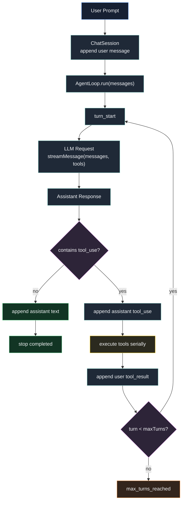

# 第 8 章：实现 Agent Loop

## 本章目标

这一章要把第 7 章的一次性 Tool Calling 升级成真正的 Agent Loop。

第 7 章已经能做到：

```text
call model
if tool_use:
  execute tools
  call model once more
```

但它只能跟进一次。

如果模型第二次请求后还想继续调用工具，第 7 章会直接停住，因为第二次请求没有继续传 tools。

真实 Claude Code 的核心不是“一次工具调用”，而是一个可控循环：

```text
while true:
  call model with tools
  if no tool_use:
    stop
  execute tools
  append tool_result
  continue
```

本章结束后，Claude Code Mini 可以完成多步任务：

```text
> 请读取 package.json，创建 tmp/project-summary.txt，总结项目 name 和 scripts，再读取你写出的文件确认内容

[turn 1]
[tool_use] read_file
[tool_result] read_file ok

[turn 2]
[tool_use] write_file
[tool_result] write_file ok

[turn 3]
[tool_use] read_file
[tool_result] read_file ok

[turn 4]
已确认 tmp/project-summary.txt 内容正确。
```

这就是最小可用的 Coding Agent 行为：

- 模型提出下一步动作。
- CLI 执行动作。
- 动作结果回到上下文。
- 模型基于新上下文继续决定。

---

## 本章完成效果

完成后，交互模式支持多轮工具循环。

启动：

```bash
bun run dev
```

输入：

```text
> 请读取 package.json，然后创建 tmp/package-name.txt，写入项目 name，最后读取这个文件确认结果
```

你会看到类似输出：

```text
[turn 1]

[tool_use] read_file
input: {"path":"package.json"}
[tool_start] read_file
[tool_result] read_file ok

[turn 2]

[tool_use] write_file
input: {"path":"tmp/package-name.txt","content":"claude-code-mini\n"}
[tool_start] write_file
[tool_result] write_file ok

[turn 3]

[tool_use] read_file
input: {"path":"tmp/package-name.txt"}
[tool_start] read_file
[tool_result] read_file ok

[turn 4]
已经创建并确认 tmp/package-name.txt，内容为 claude-code-mini。
```

也可以用单次 prompt：

```bash
bun run dev -- --max-turns 8 "请读取 package.json，然后创建 tmp/package-name.txt，写入项目 name，最后读取这个文件确认结果"
```

本章还会新增 `--max-turns`：

```bash
bun run dev -- --max-turns 3
```

它用来限制一次用户请求最多触发多少轮模型请求，避免模型和工具陷入无限循环。

---

## 本章项目结构变化

本章在第 7 章基础上新增 `agent/` 模块：

```bash
src/
  agent/
    loop.ts          # 新增：Agent Loop 状态机
    index.ts         # 新增：导出 AgentLoop 类型
  chat/
    toolInputFormatter.ts # 第 7 章已有：压缩 tool input 展示，并输出参数生成进度
    session.ts       # 修改：把工具循环委托给 AgentLoop
    chatLoop.ts      # 修改：渲染 turn / maxTurns 事件
  main.ts            # 修改：新增 --max-turns，并传入 ChatSession
```

`src/llm/anthropicClient.ts` 不需要修改。

第 7 章已经完成了：

- 发送 tools schema。
- 解析 `tool_use`。
- 解析 `input_json_delta`。
- 支持 `tool_result` 消息历史。

本章只负责把这些能力组织成循环。

---

## 为什么需要这个模块

一次 Tool Calling 只能完成简单任务。

例如：

```text
读取 package.json，告诉我 name
```

模型只需要：

```text
read_file -> answer
```

但 Coding Agent 的真实任务通常是多步的：

```text
读文件 -> 分析 -> 写文件 -> 再读文件 -> 解释结果
```

如果没有 Agent Loop，用户必须一轮一轮手动提示：

```text
> 先读 package.json
> 根据结果写 tmp/package-name.txt
> 再读取 tmp/package-name.txt
> 总结结果
```

这不是 Agent。

Agent Loop 的价值是让模型自己决定下一步：

```text
模型：我需要先读 package.json
系统：执行 read_file，返回结果
模型：我现在可以写文件
系统：执行 write_file，返回结果
模型：我需要确认写入结果
系统：执行 read_file，返回结果
模型：完成，向用户汇报
```

真实 Claude Code 的 `src/query.ts` 就是围绕这件事组织的。

它在每次模型输出后判断：

```ts
if (!needsFollowUp) {
  return { reason: "completed" }
}
```

如果发现 `tool_use`，就执行工具，把 `tool_result` 拼回 messages，再进入下一轮请求。

本章 Mini 要实现同一条主线，但先保留最小能力：

- 串行执行工具。
- 固定 `maxTurns`。
- 不做中断。
- 不做权限。
- 不做并发工具调度。
- 不做上下文压缩。

这样读者能先看懂 Agent Loop 的骨架。

---

## 整体架构



注意这里的循环边界。

循环不是放在 CLI 里。

CLI 只负责：

- 读用户输入。
- 渲染事件。
- 显示错误。

真正的 Agent Loop 放在 `src/agent/loop.ts`。

这样后面做：

- Headless 模式
- Session 恢复
- Planner
- Sandbox
- UI 渲染

都可以复用同一个 Agent Loop。

---

## 核心流程

本章核心流程是：

```text
runChatLoop()
  -> session.sendUserMessageStream(prompt)
    -> messages.push(user)
    -> agentLoop.run(messages, { maxTurns })
      -> for turn in 1..maxTurns
        -> streamMessage(messages, tools)
        -> messages.push(assistant response)
        -> if response.toolUses.length === 0
          -> stop
        -> for each toolUse
          -> toolRegistry.execute(toolUse.name, toolUse.input)
          -> build tool_result
        -> messages.push(user tool_result[])
      -> max_turns_reached
```

每一轮都必须保持消息顺序合法：

```text
user prompt
assistant tool_use
user tool_result
assistant tool_use
user tool_result
assistant final text
```

不能变成：

```text
user prompt
assistant tool_use
assistant tool_use
user tool_result
```

也不能变成：

```text
user prompt
assistant tool_use
user normal text
user tool_result
```

Anthropic Messages API 对工具配对很严格。

每个 `tool_use.id` 都必须有一个紧随其后的 `tool_result.tool_use_id`。

Agent Loop 的核心职责就是维护这条消息链。

---

## 完整核心代码

### src/agent/loop.ts

新增文件：

```ts
import { streamMessage } from "../llm/anthropicClient";
import type {
  ChatMessage,
  LLMConfig,
  LLMResponse,
  LLMStreamEvent,
  ToolResultContentBlock,
  ToolUseContentBlock,
} from "../llm/types";
import type { ToolRegistry, ToolResult, ToolSummary } from "../tools";

export type AgentLoopOptions = {
  maxTurns: number;
};

export type AgentLoopEvent =
  | LLMStreamEvent
  | {
      type: "turn_start";
      turn: number;
    }
  | {
      type: "turn_complete";
      turn: number;
      stopReason: string | null;
      toolUseCount: number;
    }
  | {
      type: "tool_start";
      turn: number;
      toolUse: ToolUseContentBlock;
    }
  | {
      type: "tool_result";
      turn: number;
      toolUse: ToolUseContentBlock;
      result: ToolResultContentBlock;
    }
  | {
      type: "max_turns_reached";
      maxTurns: number;
    };

export class AgentLoop {
  constructor(
    private readonly config: LLMConfig,
    private readonly toolRegistry: ToolRegistry,
  ) {}

  async *run(
    messages: ChatMessage[],
    options: AgentLoopOptions,
  ): AsyncGenerator<AgentLoopEvent, void> {
    if (options.maxTurns < 1) {
      throw new Error("maxTurns must be greater than or equal to 1.");
    }

    for (let turn = 1; turn <= options.maxTurns; turn++) {
      yield {
        type: "turn_start",
        turn,
      };

      const response = yield* this.runAssistantTurn(
        messages,
        this.toolRegistry.list(),
      );

      messages.push({
        role: "assistant",
        content: response.content,
      });

      yield {
        type: "turn_complete",
        turn,
        stopReason: response.stopReason,
        toolUseCount: response.toolUses.length,
      };

      if (response.toolUses.length === 0) {
        return;
      }

      const toolResults: ToolResultContentBlock[] = [];

      for (const toolUse of response.toolUses) {
        yield {
          type: "tool_start",
          turn,
          toolUse,
        };

        const result = await this.executeToolUse(toolUse);
        toolResults.push(result);

        yield {
          type: "tool_result",
          turn,
          toolUse,
          result,
        };
      }

      messages.push({
        role: "user",
        content: toolResults,
      });
    }

    yield {
      type: "max_turns_reached",
      maxTurns: options.maxTurns,
    };
  }

  private async *runAssistantTurn(
    messages: ChatMessage[],
    tools: ToolSummary[],
  ): AsyncGenerator<LLMStreamEvent, LLMResponse> {
    let finalResponse: LLMResponse | undefined;

    for await (const event of streamMessage(messages, tools, this.config)) {
      if (event.type === "message_stop") {
        finalResponse = event.response;
      }

      yield event;
    }

    if (!finalResponse) {
      throw new Error("The stream ended before a final response was received.");
    }

    return finalResponse;
  }

  private async executeToolUse(
    toolUse: ToolUseContentBlock,
  ): Promise<ToolResultContentBlock> {
    try {
      const result = await this.toolRegistry.execute(toolUse.name, toolUse.input);

      return {
        type: "tool_result",
        tool_use_id: toolUse.id,
        content: formatToolResult(result),
      };
    } catch (error) {
      const message = error instanceof Error ? error.message : String(error);

      return {
        type: "tool_result",
        tool_use_id: toolUse.id,
        content: `Error: ${message}`,
        is_error: true,
      };
    }
  }
}

function formatToolResult(result: ToolResult): string {
  if (!result.metadata) {
    return result.content;
  }

  return `${result.content}\n\nmetadata:\n${JSON.stringify(result.metadata, null, 2)}`;
}
```

这里的 `AgentLoop.run()` 会直接修改传入的 `messages` 数组。

原因是 `ChatSession` 本来就持有会话历史，Agent Loop 的职责是不断追加：

- assistant response
- user tool_result

这样 `ChatSession` 不需要理解每一轮的细节。

### src/agent/index.ts

新增文件：

```ts
export { AgentLoop } from "./loop";
export type { AgentLoopEvent, AgentLoopOptions } from "./loop";
```

### src/chat/session.ts

用下面版本替换第 7 章的 `src/chat/session.ts`：

```ts
import { AgentLoop, type AgentLoopEvent } from "../agent";
import type { ChatMessage, LLMConfig } from "../llm/types";
import type { ToolRegistry } from "../tools";

type ChatSessionOptions = {
  maxTurns: number;
};

export type ChatSessionEvent = AgentLoopEvent;

export class ChatSession {
  private readonly messages: ChatMessage[] = [];
  private readonly agentLoop: AgentLoop;

  constructor(
    config: LLMConfig,
    toolRegistry: ToolRegistry,
    private readonly options: ChatSessionOptions,
  ) {
    this.agentLoop = new AgentLoop(config, toolRegistry);
  }

  get history(): readonly ChatMessage[] {
    return this.messages;
  }

  clear(): void {
    this.messages.length = 0;
  }

  async *sendUserMessageStream(
    content: string,
  ): AsyncGenerator<ChatSessionEvent, void> {
    const historyLengthBeforeTurn = this.messages.length;

    this.messages.push({
      role: "user",
      content,
    });

    try {
      yield* this.agentLoop.run(this.messages, {
        maxTurns: this.options.maxTurns,
      });
    } catch (error) {
      this.messages.length = historyLengthBeforeTurn;
      throw error;
    }
  }
}
```

第 7 章的 `ChatSession` 同时做了三件事：

- 管消息历史。
- 调模型。
- 执行工具跟进。

本章把后两件事移到 `AgentLoop`。

这样职责更清楚：

- `ChatSession` 管会话。
- `AgentLoop` 管一次用户请求内的模型/工具循环。
- `chatLoop.ts` 管终端交互。

### src/chat/chatLoop.ts

用下面版本替换第 7 章的 `src/chat/chatLoop.ts`：

```ts
import { stdin as input, stdout as output } from "node:process";
import { createInterface } from "node:readline/promises";
import { ChatSession } from "./session";
import type { LLMConfig, LLMResponse } from "../llm/types";
import type { ToolRegistry } from "../tools";
import {
  createToolInputProgress,
  finishToolInputProgress,
  formatToolInput,
  shouldPrintToolInputProgress,
  startToolInputProgress,
} from "./toolInputFormatter";

type ChatLoopOptions = {
  cwd: string;
  toolRegistry: ToolRegistry;
  maxTurns: number;
};

export async function runChatLoop(
  config: LLMConfig,
  options: ChatLoopOptions,
): Promise<void> {
  const session = new ChatSession(config, options.toolRegistry, {
    maxTurns: options.maxTurns,
  });
  const rl = createInterface({ input, output });

  console.log("Claude Code Mini");
  console.log(`model: ${config.model}`);
  console.log(`cwd: ${options.cwd}`);
  console.log(`max turns: ${options.maxTurns}`);
  console.log("");
  console.log("Type /exit to quit, /clear to reset conversation.");
  console.log("Type /tools to list tools, /tool <name> <json> to run one.");
  console.log("");

  try {
    while (true) {
      const rawInput = await rl.question("> ");
      const prompt = rawInput.trim();

      if (!prompt) {
        continue;
      }

      if (prompt === "/exit" || prompt === "/quit") {
        break;
      }

      if (prompt === "/clear") {
        session.clear();
        console.log("Conversation cleared.");
        continue;
      }

      if (prompt === "/tools") {
        printTools(options.toolRegistry);
        continue;
      }

      if (prompt.startsWith("/tool ")) {
        await runManualTool(prompt, options.toolRegistry);
        continue;
      }

      try {
        let finalResponse: LLMResponse | undefined;
        const toolInputProgress = createToolInputProgress();

        for await (const event of session.sendUserMessageStream(prompt)) {
          switch (event.type) {
            case "turn_start":
              console.log("");
              console.log(`[turn ${event.turn}]`);
              break;

            case "text_delta":
              output.write(event.text);
              break;

            case "tool_use_start":
              console.log("");
              console.log("");
              console.log(`[tool_use] ${event.name}`);
              console.log("input: receiving...");
              startToolInputProgress(toolInputProgress, event.id);
              break;

            case "tool_input_delta":
              if (
                shouldPrintToolInputProgress(
                  toolInputProgress,
                  event.id,
                  event.inputJSONLength,
                )
              ) {
                console.log(`input: receiving ${event.inputJSONLength} chars...`);
              }
              break;

            case "tool_use":
              console.log(`input: ${formatToolInput(event.toolUse.input)}`);
              finishToolInputProgress(toolInputProgress);
              break;

            case "turn_complete":
              if (event.toolUseCount > 0) {
                console.log(`[turn ${event.turn}] tool calls: ${event.toolUseCount}`);
              }
              break;

            case "tool_start":
              console.log(`[tool_start] ${event.toolUse.name}`);
              break;

            case "tool_result":
              console.log(
                `[tool_result] ${event.toolUse.name} ${
                  event.result.is_error ? "error" : "ok"
                }`,
              );
              console.log("");
              break;

            case "max_turns_reached":
              console.log(`[max_turns] stopped after ${event.maxTurns} turns`);
              break;

            case "message_stop":
              finalResponse = event.response;
              break;
          }
        }

        console.log("");

        if (finalResponse) {
          console.log("");
          console.log(
            `tokens: ${finalResponse.inputTokens} input / ${finalResponse.outputTokens} output`,
          );
        }
      } catch (error) {
        const message = error instanceof Error ? error.message : String(error);
        console.error(`Error: ${message}`);
      }
    }
  } finally {
    rl.close();
  }
}

function printTools(toolRegistry: ToolRegistry): void {
  for (const tool of toolRegistry.list()) {
    console.log(`- ${tool.name}: ${tool.description}`);
  }
}

async function runManualTool(
  prompt: string,
  toolRegistry: ToolRegistry,
): Promise<void> {
  const { name, input } = parseToolCommand(prompt);
  const result = await toolRegistry.execute(name, input);

  console.log(result.content);

  if (result.metadata) {
    console.log(JSON.stringify(result.metadata, null, 2));
  }
}

function parseToolCommand(prompt: string): { name: string; input: unknown } {
  const rest = prompt.slice("/tool ".length).trim();
  const firstSpaceIndex = rest.indexOf(" ");

  if (firstSpaceIndex === -1) {
    return {
      name: rest,
      input: {},
    };
  }

  const name = rest.slice(0, firstSpaceIndex).trim();
  const json = rest.slice(firstSpaceIndex + 1).trim();

  return {
    name,
    input: json ? JSON.parse(json) : {},
  };
}
```

这里多了三类事件渲染：

- `turn_start`
- `turn_complete`
- `max_turns_reached`

它们不是 Anthropic API 原生事件，而是 Mini 自己的 Agent Loop 事件。

这类事件很重要。

用户需要知道系统不是卡住了，而是在进入下一轮模型/工具循环。

### src/main.ts

用下面版本替换第 7 章的 `src/main.ts`：

```ts
import { stdout } from "node:process";
import {
  Command as CommanderCommand,
  InvalidArgumentError,
} from "commander";
import { ChatSession } from "./chat/session";
import { runChatLoop } from "./chat/chatLoop";
import { loadLLMConfig } from "./llm/config";
import type { LLMConfig, LLMResponse } from "./llm/types";
import { CLI_NAME, PRODUCT_NAME, VERSION } from "./constants";
import {
  createDefaultToolRegistry,
  type ToolContext,
  type ToolRegistry,
} from "./tools";
import {
  createToolInputProgress,
  finishToolInputProgress,
  formatToolInput,
  shouldPrintToolInputProgress,
  startToolInputProgress,
} from "./chat/toolInputFormatter";

type RootOptions = {
  print?: boolean;
  cwd: string;
  model?: string;
  maxTurns: number;
};

export async function main(argv = process.argv): Promise<CommanderCommand> {
  const program = new CommanderCommand();

  program
    .name(CLI_NAME)
    .description(
      `${PRODUCT_NAME} - starts a coding-agent session by default, use -p/--print for non-interactive output`,
    )
    .argument("[prompt...]", "Your prompt")
    .helpOption("-h, --help", "Display help for command")
    .option(
      "-p, --print",
      "Print response and exit. This will become the headless mode in later chapters.",
      false,
    )
    .option("--cwd <path>", "Working directory for the session", process.cwd())
    .option("--model <model>", "Override the model for this request")
    .option(
      "--max-turns <number>",
      "Maximum model/tool iterations per user prompt",
      parsePositiveInteger,
      8,
    )
    .version(`${VERSION} (${PRODUCT_NAME})`, "-v, --version", "Output the version number")
    .action(async (promptParts: string[] | undefined, options: RootOptions) => {
      await handlePrompt(promptParts ?? [], options);
    });

  await program.parseAsync(argv);
  return program;
}

async function handlePrompt(
  promptParts: string[],
  options: RootOptions,
): Promise<void> {
  const prompt = promptParts.join(" ").trim();

  try {
    const config = loadLLMConfig();
    if (options.model) {
      config.model = options.model;
    }

    if (prompt) {
      const toolRegistry = createSessionToolRegistry(options.cwd);
      await runSinglePrompt(prompt, config, options, toolRegistry);
      return;
    }

    if (options.print) {
      console.error("Error: -p/--print requires a prompt.");
      process.exitCode = 1;
      return;
    }

    if (!process.stdin.isTTY) {
      console.error("Error: interactive mode requires a TTY. Pass a prompt or use -p.");
      process.exitCode = 1;
      return;
    }

    const toolRegistry = createSessionToolRegistry(options.cwd);
    await runChatLoop(config, {
      cwd: options.cwd,
      toolRegistry,
      maxTurns: options.maxTurns,
    });
  } catch (error) {
    const message = error instanceof Error ? error.message : String(error);
    console.error(`Error: ${message}`);
    process.exitCode = 1;
  }
}

async function runSinglePrompt(
  prompt: string,
  config: LLMConfig,
  options: RootOptions,
  toolRegistry: ToolRegistry,
): Promise<void> {
  const session = new ChatSession(config, toolRegistry, {
    maxTurns: options.maxTurns,
  });
  let finalResponse: LLMResponse | undefined;
  const toolInputProgress = createToolInputProgress();

  for await (const event of session.sendUserMessageStream(prompt)) {
    switch (event.type) {
      case "turn_start":
        console.log("");
        console.log(`[turn ${event.turn}]`);
        break;

      case "text_delta":
        stdout.write(event.text);
        break;

      case "tool_use_start":
        console.log("");
        console.log(`[tool_use] ${event.name}`);
        console.log("input: receiving...");
        startToolInputProgress(toolInputProgress, event.id);
        break;

      case "tool_input_delta":
        if (
          shouldPrintToolInputProgress(
            toolInputProgress,
            event.id,
            event.inputJSONLength,
          )
        ) {
          console.log(`input: receiving ${event.inputJSONLength} chars...`);
        }
        break;

      case "tool_use":
        console.log(`input: ${formatToolInput(event.toolUse.input)}`);
        finishToolInputProgress(toolInputProgress);
        break;

      case "turn_complete":
        if (event.toolUseCount > 0) {
          console.log(`[turn ${event.turn}] tool calls: ${event.toolUseCount}`);
        }
        break;

      case "tool_start":
        console.log(`[tool_start] ${event.toolUse.name}`);
        break;

      case "tool_result":
        console.log(
          `[tool_result] ${event.toolUse.name} ${
            event.result.is_error ? "error" : "ok"
          }`,
        );
        break;

      case "max_turns_reached":
        console.log(`[max_turns] stopped after ${event.maxTurns} turns`);
        break;

      case "message_stop":
        finalResponse = event.response;
        break;
    }
  }

  console.log("");

  if (!options.print && finalResponse) {
    console.log("");
    console.log(`model: ${finalResponse.model}`);
    console.log(
      `tokens: ${finalResponse.inputTokens} input / ${finalResponse.outputTokens} output`,
    );
    console.log(`cwd: ${options.cwd}`);
    console.log(`max turns: ${options.maxTurns}`);
  }
}

function createSessionToolRegistry(cwd: string): ToolRegistry {
  const readFileState: ToolContext["readFileState"] = new Map();

  return createDefaultToolRegistry({
    cwd,
    readFileState,
  });
}

function parsePositiveInteger(value: string): number {
  const parsed = Number.parseInt(value, 10);

  if (!Number.isInteger(parsed) || parsed < 1) {
    throw new InvalidArgumentError("Expected a positive integer.");
  }

  return parsed;
}
```

`--max-turns` 不是性能优化，而是安全边界。

没有这个参数时，模型可能因为错误理解工具结果而不断调用同一个工具。

例如：

```text
read_file -> 文件不存在
read_file -> 文件不存在
read_file -> 文件不存在
...
```

真实 Claude Code 里也有 `maxTurns` 限制。

对应源码可以看 `src/query.ts` 中的：

```ts
if (maxTurns && nextTurnCount > maxTurns) {
  return { reason: "max_turns", turnCount: nextTurnCount }
}
```

---

## 逐步实现

### 1. 新增 `src/agent/`

先创建目录：

```bash
mkdir -p src/agent
```

然后新增：

```bash
src/agent/loop.ts
src/agent/index.ts
```

Agent Loop 独立成模块后，`ChatSession` 不需要知道每一轮如何调模型、如何执行工具。

这也是后续扩展的基础。

### 2. 定义 Agent 事件

在 `src/agent/loop.ts` 中定义：

```ts
export type AgentLoopEvent =
  | LLMStreamEvent
  | { type: "turn_start"; turn: number }
  | { type: "turn_complete"; turn: number; ... }
  | { type: "tool_start"; turn: number; ... }
  | { type: "tool_result"; turn: number; ... }
  | { type: "max_turns_reached"; maxTurns: number };
```

不要让 Agent Loop 直接 `console.log()`。

它应该 yield 事件。

这样同一个 Agent Loop 后面可以服务：

- 交互 CLI。
- `-p` headless 模式。
- Web UI。
- 测试用例。
- Session 录制。

### 3. 把第 7 章的 follow-up 改成循环

第 7 章逻辑是：

```ts
const firstResponse = yield* this.runAssistantTurn(tools);
if (firstResponse.toolUses.length === 0) return;
execute tools;
const finalResponse = yield* this.runAssistantTurn([]);
```

本章改成：

```ts
for (let turn = 1; turn <= options.maxTurns; turn++) {
  const response = yield* this.runAssistantTurn(messages, tools);

  messages.push({
    role: "assistant",
    content: response.content,
  });

  if (response.toolUses.length === 0) {
    return;
  }

  const toolResults = await executeTools(response.toolUses);

  messages.push({
    role: "user",
    content: toolResults,
  });
}
```

这里每一轮都传 tools：

```ts
this.toolRegistry.list()
```

这就是第 7 章和第 8 章的关键差异。

### 4. 串行执行工具

本章先串行执行：

```ts
for (const toolUse of response.toolUses) {
  const result = await this.executeToolUse(toolUse);
  toolResults.push(result);
}
```

不要急着并发。

因为现在的工具里有 `write_file`。

多个写工具并发执行可能出现顺序问题：

```text
write_file a.txt
read_file a.txt
```

如果并发，读可能发生在写之前。

真实 Claude Code 在 `src/services/tools/toolOrchestration.ts` 里会区分：

- 只读且安全的工具可以并发。
- 非只读工具串行执行。

Mini 当前先全部串行，行为更可预测。

### 5. 保留工具错误为 `tool_result`

工具执行失败不要直接 throw 到外层。

继续用第 7 章策略：

```ts
return {
  type: "tool_result",
  tool_use_id: toolUse.id,
  content: `Error: ${message}`,
  is_error: true,
};
```

这样模型可以根据错误继续决策。

例如写文件被拒绝：

```text
Error: Refusing to overwrite tmp/a.txt. Read the file first with read_file.
```

下一轮模型就可能改成：

```text
read_file tmp/a.txt
```

然后再写。

这就是 Agent Loop 比一次 Tool Calling 更强的地方。

### 6. 增加 `maxTurns`

Agent Loop 必须有停止条件。

本章有两个停止条件：

```ts
if (response.toolUses.length === 0) {
  return;
}
```

以及：

```ts
for (let turn = 1; turn <= options.maxTurns; turn++)
```

如果达到上限：

```ts
yield {
  type: "max_turns_reached",
  maxTurns: options.maxTurns,
};
```

注意：达到 `maxTurns` 不是异常。

它是受控停止。

### 7. 改造 ChatSession

`ChatSession` 现在只做：

```ts
this.messages.push({
  role: "user",
  content,
});

yield* this.agentLoop.run(this.messages, {
  maxTurns: this.options.maxTurns,
});
```

如果出错，回滚本轮消息：

```ts
this.messages.length = historyLengthBeforeTurn;
```

这个回滚逻辑和第 3 章一致。

一次用户请求要么完整进入历史，要么不进入历史。

### 8. 改造 CLI 渲染

Agent Loop 会产生多轮事件。

CLI 至少要显示：

```text
[turn 1]
[tool_use] read_file
[tool_result] read_file ok
[turn 2]
...
```

否则用户看到长时间没有文字输出，会误以为程序卡住。

### 9. 增加 CLI 参数

在 `main.ts` 中新增：

```ts
.option(
  "--max-turns <number>",
  "Maximum model/tool iterations per user prompt",
  parsePositiveInteger,
  8,
)
```

默认值不要太大。

8 对 Mini 来说足够完成：

```text
读 -> 写 -> 读 -> 总结
```

也能避免失控循环消耗太多 token。

### 10. 手动工具命令继续保留

`/tool` 仍然有用。

Agent Loop 出问题时，先验证工具本身：

```text
> /tool read_file {"path":"package.json","limit":20}
```

如果手动工具正常，再检查 Agent Loop。

---

## 关键源码分析

本章主要对应真实源码里的三个部分。

### 1. `src/query.ts`：主循环

真实 Claude Code 的 `query()` 不是一次请求函数。

它是一个循环状态机。

核心变量包括：

- `messagesForQuery`
- `assistantMessages`
- `toolResults`
- `toolUseBlocks`
- `needsFollowUp`
- `turnCount`
- `maxTurns`

模型 streaming 阶段发现 `tool_use` 后，会设置：

```ts
needsFollowUp = true
```

如果没有工具调用：

```ts
if (!needsFollowUp) {
  return { reason: "completed" }
}
```

如果有工具调用，就执行工具，然后构造下一轮状态：

```ts
const next: State = {
  messages: messagesForQuery.concat(assistantMessages, toolResults),
  turnCount: nextTurnCount,
  transition: { reason: "next_turn" },
}
```

Mini 的 `AgentLoop.run()` 是这段逻辑的简化版。

### 2. `src/services/tools/toolOrchestration.ts`：工具批处理

真实 Claude Code 不一定一个一个执行工具。

它会把工具分批：

```text
read-only batch -> 可以并发
write/edit/bash -> 串行
```

原因是只读工具通常没有副作用，例如：

- 读多个文件。
- 搜索多个路径。

这些可以并发节省时间。

但写文件、执行 shell、编辑代码必须谨慎处理顺序。

Mini 当前只有少量工具，全部串行执行。

后续实现 Shell、Diff、Patch 后，再考虑并发。

### 3. `yieldMissingToolResultBlocks()`：协议修复

真实源码里有一个保护函数：

```ts
yieldMissingToolResultBlocks(...)
```

它的作用是：如果模型已经输出了 `tool_use`，但后续因为异常中断，没有来得及生成 `tool_result`，系统会补一个错误类型的 `tool_result`。

这是为了避免消息历史损坏。

Mini 当前还没有中断和 fallback，所以本章不实现这个保护。

但要记住这个原则：

只要 assistant message 里出现 `tool_use`，后面就必须有对应 `tool_result`。

后续做中断、超时、Sandbox 时会补上这类协议修复。

### 4. 为什么不把循环写在 `chatLoop.ts`

可以写，但不应该。

`chatLoop.ts` 是终端 UI。

如果把 Agent Loop 写在这里，后面实现：

- `-p` 模式
- Session 恢复
- Web UI
- 测试

都会重复一套循环逻辑。

真实 Claude Code 也是把核心循环放在 `src/query.ts`，UI 层通过事件和状态消费它。

Mini 选择 `src/agent/loop.ts`，是为了保持这个边界。

---

## 调试与验证

### 1. 安装依赖

如果依赖还没安装：

```bash
bun install
```

### 2. 配置 API Key

```bash
export ANTHROPIC_API_KEY="你的 key"
```

可选：

```bash
export ANTHROPIC_MODEL="claude-sonnet-4-6"
```

### 3. 运行类型检查

```bash
bun run typecheck
```

### 4. 启动交互模式

```bash
bun run dev
```

启动后应该看到：

```text
Claude Code Mini
model: claude-sonnet-4-6
cwd: /path/to/claude-code-mini
max turns: 8
```

### 5. 验证简单对话仍然正常

```text
> 用一句话解释 Agent Loop
```

应该只出现：

```text
[turn 1]
```

然后模型直接回答，不调用工具。

### 6. 验证单工具任务

```text
> 请使用 read_file 工具读取 package.json，然后告诉我 name 字段
```

应该看到：

```text
[turn 1]
[tool_use] read_file
[tool_result] read_file ok
[turn 2]
```

第二轮给出最终回答。

### 7. 验证多工具任务

```text
> 请读取 package.json，然后创建 tmp/package-name.txt，写入项目 name，最后读取这个文件确认结果
```

应该至少看到：

```text
[tool_use] read_file
[tool_use] write_file
[tool_use] read_file
```

不保证每个模型都会按完全一样的轮次执行。

但只要它能连续调用多个工具，并最终回答，就说明 Agent Loop 生效。

### 8. 验证 `--max-turns`

启动：

```bash
bun run dev -- --max-turns 1
```

再输入一个明显需要多步的任务：

```text
> 请读取 package.json，然后创建 tmp/package-name.txt，最后读取文件确认结果
```

如果第一轮模型调用了工具，工具执行后会停止：

```text
[max_turns] stopped after 1 turns
```

这说明循环边界生效。

### 9. 验证单次 prompt

```bash
bun run dev -- --max-turns 8 "请读取 package.json，然后创建 tmp/package-name.txt，写入项目 name，最后读取这个文件确认结果"
```

然后检查文件：

```bash
cat tmp/package-name.txt
```

### 10. 验证手动工具不受影响

```text
> /tool read_file {"path":"package.json","limit":10}
```

应该仍然能直接执行工具。

---

## 常见问题

### 1. 模型还是只调用一次工具

原因可能不是 Agent Loop，而是模型认为任务已经完成。

用更明确的任务验证：

```text
请分三步完成：第一步读取 package.json，第二步创建 tmp/package-name.txt，第三步读取 tmp/package-name.txt 确认内容
```

如果出现多轮 `[turn n]`，说明 Agent Loop 正常。

### 2. 达到 `max_turns` 后没有最终总结

这是预期行为。

`maxTurns` 是硬停止边界。

它的职责是阻止继续消耗 token，不是帮模型强行总结。

如果你希望它在达到上限前总结，可以把 prompt 写成：

```text
最多使用 3 次工具。如果还没完成，请总结当前进展。
```

后续 Planner 章节会把这类约束放进系统提示词。

### 3. 工具失败后模型继续调用同一个工具

这是早期 Agent 常见问题。

例如路径不存在：

```text
Error: ENOENT
```

模型可能继续尝试同一路径。

本章先靠 `maxTurns` 截断。

后续会通过：

- 更好的工具错误格式。
- Prompt Pipeline。
- Planner。
- Context 管理。

降低这种重复。

### 4. `tool_use` 后 API 报缺少 `tool_result`

检查 `AgentLoop.run()` 里是否在每次 tool_use 后都追加：

```ts
messages.push({
  role: "user",
  content: toolResults,
});
```

并确认每个结果都有：

```ts
tool_use_id: toolUse.id
```

### 5. 多个工具调用顺序不符合预期

本章工具是串行执行的。

如果顺序仍然不符合预期，通常是模型一次返回了多个工具调用，而这些工具调用本身的顺序就不是你想要的。

后续 Planner 章节会让模型先写计划，再执行。

当前阶段可以在 prompt 中明确：

```text
不要并行调用工具。请等待每一步结果后再决定下一步。
```

### 6. `--max-turns 0` 报错

这是预期行为。

`maxTurns` 必须大于等于 1。

如果不想让模型使用工具，后续可以加 `--no-tools`。

本章不实现这个参数。

### 7. 为什么不在本章实现中断

中断不是简单的 `Ctrl+C`。

如果中断发生在模型已经输出 `tool_use` 之后，系统还要补一个错误 `tool_result`，否则消息历史会损坏。

真实 Claude Code 对这类情况有专门处理。

Mini 会在 Sandbox / 权限 / 中断章节统一处理。

---

## 本章小结

这一章把 Claude Code Mini 从“一次 Tool Calling”推进成了“可循环 Agent”。

当前系统已经具备：

- 独立 `AgentLoop` 模块。
- 多轮模型请求。
- 每轮都支持工具调用。
- 工具结果自动回填消息历史。
- `turn_start` / `turn_complete` 事件。
- `maxTurns` 安全边界。
- 交互模式和单次 prompt 都支持 Agent Loop。

当前还缺少：

- Shell 执行工具。
- 更强的代码编辑工具。
- Diff / Patch。
- 权限确认。
- 中断与超时。
- 上下文压缩。
- Planner。

下一章会实现代码编辑能力。

目前 Mini 只能整文件写入：

```text
write_file
```

这对小文件可用，但对真实代码修改不够安全。

第 9 章会实现更适合 Coding Agent 的编辑工具，让模型可以基于旧内容做局部替换，而不是每次重写整个文件。
