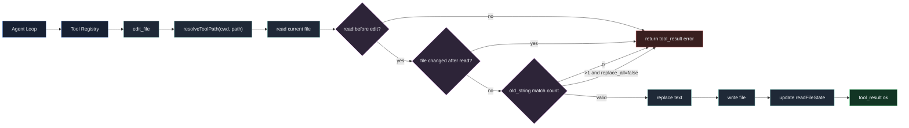

# 第 9 章：实现代码编辑

## 本章目标

这一章要给 Claude Code Mini 加上真正适合改代码的工具：`edit_file`。

第 6 章已经实现了：

- `read_file`
- `write_file`

第 8 章已经实现了 Agent Loop。

现在 Mini 可以连续读文件、写文件、再读文件。

但它还缺一个关键能力：局部编辑。

目前如果模型想改一行代码，只能用 `write_file` 重写整个文件：

```text
read_file -> 拼出完整文件内容 -> write_file
```

这有几个问题：

- 大文件上下文很长，模型容易漏掉内容。
- 重写整文件容易破坏格式。
- 修改范围不清楚。
- 后续做 Diff / Patch 时难以定位真正的变更意图。

真实 Claude Code 更常用的是 `FileEditTool`。

它的核心参数是：

```json
{
  "file_path": "src/main.ts",
  "old_string": "要替换的旧代码",
  "new_string": "替换后的新代码",
  "replace_all": false
}
```

本章 Mini 会实现一个简化版：

```json
{
  "path": "src/main.ts",
  "old_string": "要替换的旧代码",
  "new_string": "替换后的新代码",
  "replace_all": false
}
```

完成后，模型可以在 Agent Loop 中自动执行：

```text
read_file -> edit_file -> read_file -> 总结
```

---

## 本章完成效果

完成后，启动：

```bash
bun run dev
```

输入：

```text
> 请读取 tmp/demo.ts，把 const name = "mini"; 改成 const name = "claude-code-mini";，然后读取文件确认结果
```

如果文件内容是：

```ts
const name = "mini";
console.log(name);
```

你会看到类似输出：

```text
[turn 1]

[tool_use] read_file
input: {"path":"tmp/demo.ts"}
[tool_result] read_file ok

[turn 2]

[tool_use] edit_file
input: {"path":"tmp/demo.ts","old_string":"const name = \"mini\";","new_string":"const name = \"claude-code-mini\";"}
[tool_result] edit_file ok

[turn 3]

[tool_use] read_file
input: {"path":"tmp/demo.ts"}
[tool_result] read_file ok

[turn 4]
已确认 tmp/demo.ts 中的 name 已更新为 claude-code-mini。
```

最终文件变成：

```ts
const name = "claude-code-mini";
console.log(name);
```

你也可以手动验证：

```text
> /tool edit_file {"path":"tmp/demo.ts","old_string":"mini","new_string":"claude-code-mini","replace_all":true}
```

---

## 本章项目结构变化

本章只改工具层：

```bash
src/
  tools/
    builtin/
      editFile.ts        # 新增：局部编辑工具
    index.ts             # 修改：注册 edit_file
```

其他模块不需要改。

原因是第 8 章已经完成了 Agent Loop：

```text
模型返回 tool_use
-> Tool Registry 执行工具
-> tool_result 回到模型
-> 继续下一轮
```

所以新增一个工具后，模型自然可以在循环中调用它。

---

## 为什么需要这个模块

`write_file` 是整文件写入工具。

它适合：

- 创建新文件。
- 重写很小的文件。
- 生成配置文件。

但代码修改更常见的是局部替换：

```diff
- const model = "claude-3-haiku";
+ const model = "claude-sonnet-4-6";
```

如果让模型重写整个文件，它必须在输出里完整保留所有未修改内容。

这很脆弱。

局部编辑工具把任务压缩成：

```text
在这个文件里，找到 old_string，替换为 new_string
```

这对 Coding Agent 更合适。

它有几个工程优势：

- 修改意图更明确。
- 不需要输出完整文件。
- 可以要求 `old_string` 唯一，避免误改。
- 可以复用第 6 章的读后写 stale check。
- 后续可以自然生成 Diff / Patch。

真实 Claude Code 的 `FileEditTool` 也是这个思路。

它不会让模型随便写一段 patch 文本，而是要求模型给出结构化编辑：

```text
old_string -> new_string
```

工具负责：

- 检查文件是否读过。
- 检查文件是否被外部修改。
- 检查 `old_string` 是否存在。
- 检查 `old_string` 是否唯一。
- 写入新内容。
- 更新 `readFileState`。
- 返回工具结果。

本章实现这条最小闭环。

---

## 整体架构



这个工具有两个核心保护。

第一个是读后写：

```text
必须先 read_file，再 edit_file
```

第二个是唯一匹配：

```text
replace_all=false 时，old_string 必须只出现一次
```

这两个保护能挡住大多数危险编辑。

---

## 核心流程

`edit_file` 的调用链是：

```text
AgentLoop
  -> toolRegistry.execute("edit_file", input)
    -> inputSchema.safeParse(input)
    -> editFileTool.execute(input, context)
      -> resolveToolPath(context.cwd, input.path)
      -> stat + readFile
      -> check readFileState
      -> check stale mtime/content
      -> count old_string matches
      -> replace old_string with new_string
      -> writeFile
      -> update readFileState
      -> return ToolResult
```

这里要特别注意消息层和文件层的关系。

Agent Loop 不知道文件怎么编辑。

它只知道：

```text
tool_use -> tool_result
```

Tool Registry 不知道模型为什么要编辑。

它只知道：

```text
name + input -> execute
```

`edit_file` 才知道：

```text
old_string / new_string / replace_all
```

这个边界要保持清楚。

---

## 完整核心代码

### src/tools/builtin/editFile.ts

新增文件：

```ts
import { readFile, stat, writeFile } from "node:fs/promises";
import { z } from "zod";
import { resolveToolPath, toDisplayPath } from "../path";
import type { Tool } from "../types";

const inputSchema = z
  .object({
    path: z.string().min(1),
    old_string: z.string().min(1),
    new_string: z.string(),
    replace_all: z.boolean().optional().default(false),
  })
  .strict();

type EditFileInput = z.infer<typeof inputSchema>;

export const editFileTool: Tool<EditFileInput> = {
  name: "edit_file",
  description:
    "Edit an existing UTF-8 text file by replacing old_string with new_string. Read the file first with read_file. Do not include read_file line number prefixes in old_string.",
  inputSchema,
  inputJSONSchema: {
    type: "object",
    properties: {
      path: {
        type: "string",
        description: "Path to edit, relative to cwd or absolute inside cwd.",
      },
      old_string: {
        type: "string",
        description:
          "Exact text to replace. It must match the file content and must not include read_file line number prefixes.",
      },
      new_string: {
        type: "string",
        description: "Replacement text.",
      },
      replace_all: {
        type: "boolean",
        description:
          "Replace every occurrence of old_string. Defaults to false; when false, old_string must be unique.",
      },
    },
    required: ["path", "old_string", "new_string"],
    additionalProperties: false,
  },
  isReadOnly: false,
  async execute(input, context) {
    if (input.old_string === input.new_string) {
      throw new Error("No changes to make: old_string and new_string are identical.");
    }

    const absolutePath = resolveToolPath(context.cwd, input.path);
    const displayPath = toDisplayPath(context.cwd, absolutePath);

    const fileStat = await stat(absolutePath);

    if (!fileStat.isFile()) {
      throw new Error(`Path is not a file: ${input.path}`);
    }

    const lastRead = context.readFileState.get(absolutePath);

    if (!lastRead) {
      throw new Error(
        `Refusing to edit ${displayPath}. Read the file first with read_file.`,
      );
    }

    const currentContent = await readFile(absolutePath, "utf8");

    if (
      Math.floor(fileStat.mtimeMs) > lastRead.mtimeMs &&
      currentContent !== lastRead.content
    ) {
      throw new Error(
        `Refusing to edit ${displayPath}. The file changed after it was read. Read it again before editing.`,
      );
    }

    const matchCount = countOccurrences(currentContent, input.old_string);

    if (matchCount === 0) {
      throw new Error(
        `String to replace was not found in ${displayPath}.\nold_string:\n${input.old_string}`,
      );
    }

    if (matchCount > 1 && !input.replace_all) {
      throw new Error(
        `Found ${matchCount} matches in ${displayPath}, but replace_all is false. Provide a more specific old_string or set replace_all to true.`,
      );
    }

    const updatedContent = input.replace_all
      ? currentContent.split(input.old_string).join(input.new_string)
      : currentContent.replace(input.old_string, input.new_string);

    await writeFile(absolutePath, updatedContent, "utf8");

    const newStat = await stat(absolutePath);
    context.readFileState.set(absolutePath, {
      content: updatedContent,
      mtimeMs: Math.floor(newStat.mtimeMs),
    });

    return {
      content: input.replace_all
        ? `File edited: ${displayPath}. Replaced ${matchCount} occurrence(s).`
        : `File edited: ${displayPath}.`,
      metadata: {
        path: displayPath,
        operation: "edit",
        replacements: input.replace_all ? matchCount : 1,
        bytes: Buffer.byteLength(updatedContent, "utf8"),
      },
    };
  },
};

function countOccurrences(content: string, search: string): number {
  let count = 0;
  let index = 0;

  while (true) {
    const foundIndex = content.indexOf(search, index);

    if (foundIndex === -1) {
      return count;
    }

    count++;
    index = foundIndex + search.length;
  }
}
```

这个版本刻意不支持创建文件。

真实 `FileEditTool` 支持：

```json
{
  "old_string": "",
  "new_string": "..."
}
```

用来创建新文件或替换空文件。

Mini 已经有 `write_file`，所以本章把职责拆清楚：

- `write_file`：创建或整文件写入。
- `edit_file`：编辑已有文件。

### src/tools/index.ts

用下面版本替换第 6 章的 `src/tools/index.ts`：

```ts
import { currentTimeTool } from "./builtin/currentTime";
import { echoTool } from "./builtin/echo";
import { editFileTool } from "./builtin/editFile";
import { readFileTool } from "./builtin/readFile";
import { writeFileTool } from "./builtin/writeFile";
import { ToolRegistry } from "./registry";
import type { ToolContext } from "./types";

export function createDefaultToolRegistry(context: ToolContext): ToolRegistry {
  const registry = new ToolRegistry(context);

  registry.register(echoTool);
  registry.register(currentTimeTool);
  registry.register(readFileTool);
  registry.register(writeFileTool);
  registry.register(editFileTool);

  return registry;
}

export { ToolRegistry };
export type { Tool, ToolContext, ToolResult, ToolSummary } from "./types";
```

这就是本章唯一需要接入系统的地方。

第 8 章已经让 Agent Loop 每轮都传：

```ts
this.toolRegistry.list()
```

所以 `edit_file` 注册之后，模型下一轮就能看到这个工具。

---

## 逐步实现

### 1. 新增文件

创建：

```bash
mkdir -p src/tools/builtin
```

新增：

```bash
src/tools/builtin/editFile.ts
```

如果你是从前几章跟做，`src/tools/builtin` 已经存在，只需要新增文件。

### 2. 定义输入 schema

`edit_file` 的输入是：

```ts
const inputSchema = z
  .object({
    path: z.string().min(1),
    old_string: z.string().min(1),
    new_string: z.string(),
    replace_all: z.boolean().optional().default(false),
  })
  .strict();
```

这里用 snake_case：

- `old_string`
- `new_string`
- `replace_all`

原因是 Anthropic 的 tool input 生态里大量使用这个命名。

真实 `FileEditTool` 也是：

```ts
old_string
new_string
replace_all
```

但路径字段 Mini 使用 `path`，不是 `file_path`。

这是为了和前面 `read_file` / `write_file` 保持一致。

### 3. 写清楚工具描述

工具 description 里必须提醒模型两件事：

```ts
Read the file first with read_file.
Do not include read_file line number prefixes in old_string.
```

第 6 章的 `read_file` 输出是：

```text
1 | const name = "mini";
```

真实文件内容不包含：

```text
1 |
```

如果模型把行号也复制进 `old_string`，编辑必然失败。

真实 Claude Code 的 `FileEditTool` prompt 也特别强调：

```text
Never include any part of the line number prefix in the old_string or new_string.
```

这不是提示词洁癖，而是工程必要条件。

### 4. 检查是否读过文件

```ts
const lastRead = context.readFileState.get(absolutePath);

if (!lastRead) {
  throw new Error(
    `Refusing to edit ${displayPath}. Read the file first with read_file.`,
  );
}
```

这和 `write_file` 的保护一致。

Agent 修改文件前必须先看过文件。

否则它就是盲改。

### 5. 检查 stale write

```ts
if (
  Math.floor(fileStat.mtimeMs) > lastRead.mtimeMs &&
  currentContent !== lastRead.content
) {
  throw new Error(
    `Refusing to edit ${displayPath}. The file changed after it was read. Read it again before editing.`,
  );
}
```

这个检查防止：

```text
模型读文件
用户在编辑器里改文件
模型继续基于旧内容写入
```

没有这个检查，Agent 很容易覆盖用户的新改动。

### 6. 统计 `old_string` 出现次数

```ts
const matchCount = countOccurrences(currentContent, input.old_string);
```

如果是 0：

```ts
throw new Error("String to replace was not found...");
```

如果大于 1 且 `replace_all=false`：

```ts
throw new Error("Provide a more specific old_string or set replace_all to true.");
```

这条规则非常重要。

例如文件里有：

```ts
const enabled = true;
const enabled = true;
```

如果模型只说：

```json
{
  "old_string": "const enabled = true;",
  "new_string": "const enabled = false;"
}
```

工具不知道该改哪一个。

正确做法是提供更多上下文：

```json
{
  "old_string": "if (mode === \"dev\") {\n  const enabled = true;\n}",
  "new_string": "if (mode === \"dev\") {\n  const enabled = false;\n}"
}
```

或者明确全部替换：

```json
{
  "old_string": "const enabled = true;",
  "new_string": "const enabled = false;",
  "replace_all": true
}
```

### 7. 执行替换

单次替换：

```ts
currentContent.replace(input.old_string, input.new_string)
```

全部替换：

```ts
currentContent.split(input.old_string).join(input.new_string)
```

这里不用正则。

`old_string` 是普通文本，不是 pattern。

如果用正则，模型给出的代码里可能包含：

```ts
.*
[]
()
```

这些字符会被误解释成正则语义。

代码编辑工具应该做精确字符串替换。

### 8. 写入并更新 `readFileState`

```ts
await writeFile(absolutePath, updatedContent, "utf8");

const newStat = await stat(absolutePath);
context.readFileState.set(absolutePath, {
  content: updatedContent,
  mtimeMs: Math.floor(newStat.mtimeMs),
});
```

更新缓存很重要。

否则同一轮 Agent Loop 里：

```text
edit_file -> edit_file
```

第二次编辑会误以为文件被外部修改了。

### 9. 注册工具

修改 `src/tools/index.ts`：

```ts
registry.register(editFileTool);
```

然后启动 CLI。

模型下一轮就能看到 `edit_file`。

### 10. 不改 Agent Loop

本章不需要改 `AgentLoop`。

这说明第 5 章的 Tool Registry 边界是有效的。

新工具只要符合：

```ts
Tool<Input>
```

就能被：

- `/tools`
- `/tool`
- Tool Calling
- Agent Loop

全部复用。

---

## 关键源码分析

本章主要对应真实源码里的 `FileEditTool`。

### 1. 输入结构：`packages/builtin-tools/src/tools/FileEditTool/types.ts`

真实输入 schema 是：

```ts
z.strictObject({
  file_path: z.string(),
  old_string: z.string(),
  new_string: z.string(),
  replace_all: semanticBoolean(z.boolean().default(false).optional()),
})
```

有两个点值得注意。

第一，真实工具使用 `file_path`。

Mini 使用 `path` 是为了和前几章保持一致。

第二，真实工具用了 `semanticBoolean`。

这是因为模型有时会输出：

```json
{"replace_all":"false"}
```

而不是：

```json
{"replace_all":false}
```

真实系统会更宽容地解析这类值。

Mini 暂时只接受标准 boolean。

### 2. 工具说明：`packages/builtin-tools/src/tools/FileEditTool/prompt.ts`

真实提示词强调：

- 编辑前必须读文件。
- `old_string` 不能包含 Read 输出里的行号前缀。
- 优先编辑已有文件，不要随便写新文件。
- `old_string` 不唯一时要扩大上下文。
- 需要全局替换时用 `replace_all`。

本章的 `description` 只保留最关键的两条：

```text
Read the file first.
Do not include line number prefixes.
```

后续 Prompt Pipeline 章节会把更完整的工具使用规范放进系统提示词。

### 3. 输入校验：`FileEditTool.validateInput()`

真实工具在执行前会做大量校验：

- `old_string === new_string` 拒绝。
- 文件不存在时给路径建议。
- `.ipynb` 要使用 Notebook 工具。
- 文件太大时拒绝编辑。
- 文件自上次读取后被修改则拒绝。
- 找不到 `old_string` 时拒绝。
- 多处匹配但没有 `replace_all` 时拒绝。
- 设置文件有额外校验。
- 团队内存文件会做 secret guard。

Mini 当前保留核心校验：

- 不能无变化编辑。
- 必须读过文件。
- stale check。
- `old_string` 必须存在。
- 多处匹配需要 `replace_all`。

这已经足够支撑第 9 章的目标。

### 4. 字符串匹配：`FileEditTool/utils.ts`

真实工具不是只做 `file.includes(old_string)`。

它有 `findActualString()`，会尝试：

- 精确匹配。
- 引号归一化。
- tab / space 归一化。
- 混合归一化。

原因是模型看到的 Read 输出可能和磁盘真实字符略有差异。

例如文件里是 tab，但终端显示成空格。

Mini 本章先使用精确字符串匹配。

这会让实现更透明，也能训练读者理解 `old_string` 必须精确。

后续可以在增强章节加入 fuzzy matching。

### 5. 写入与换行：`src/utils/file.ts`

真实 `writeTextContent()` 会保留文件原有换行：

```ts
LF / CRLF
```

Mini 本章直接：

```ts
writeFile(absolutePath, updatedContent, "utf8")
```

这对大多数现代项目够用。

如果你在 Windows 项目里想保留 CRLF，可以后续扩展一个：

```ts
detectLineEnding(content)
```

然后写入时统一转换。

第 10 章做 Diff / Patch 时会再讨论换行对 diff 的影响。

---

## 调试与验证

### 1. 确认依赖

```bash
bun install
```

### 2. 运行类型检查

```bash
bun run typecheck
```

### 3. 准备测试文件

```bash
mkdir -p tmp
printf 'const name = "mini";\nconsole.log(name);\n' > tmp/demo.ts
```

### 4. 启动 CLI

```bash
bun run dev
```

### 5. 查看工具列表

```text
> /tools
```

应该能看到：

```text
edit_file
```

### 6. 手动验证必须先读

直接编辑：

```text
> /tool edit_file {"path":"tmp/demo.ts","old_string":"mini","new_string":"claude-code-mini"}
```

应该报错：

```text
Error: Refusing to edit tmp/demo.ts. Read the file first with read_file.
```

### 7. 手动验证编辑成功

先读：

```text
> /tool read_file {"path":"tmp/demo.ts"}
```

再编辑：

```text
> /tool edit_file {"path":"tmp/demo.ts","old_string":"const name = \"mini\";","new_string":"const name = \"claude-code-mini\";"}
```

应该输出：

```text
File edited: tmp/demo.ts.
```

检查文件：

```bash
cat tmp/demo.ts
```

### 8. 验证重复匹配保护

准备文件：

```bash
printf 'const flag = true;\nconst flag = true;\n' > tmp/repeat.ts
```

进入 CLI 后：

```text
> /tool read_file {"path":"tmp/repeat.ts"}
> /tool edit_file {"path":"tmp/repeat.ts","old_string":"const flag = true;","new_string":"const flag = false;"}
```

应该报错：

```text
Found 2 matches...
```

再用：

```text
> /tool edit_file {"path":"tmp/repeat.ts","old_string":"const flag = true;","new_string":"const flag = false;","replace_all":true}
```

应该成功替换两处。

### 9. 验证 Agent 自动编辑

准备文件：

```bash
printf 'const name = "mini";\nconsole.log(name);\n' > tmp/demo.ts
```

输入：

```text
> 请读取 tmp/demo.ts，把 const name = "mini"; 改成 const name = "claude-code-mini";，然后读取文件确认结果
```

应该看到：

```text
[tool_use] read_file
[tool_use] edit_file
[tool_use] read_file
```

### 10. 验证 stale check

在 CLI 里读文件：

```text
> /tool read_file {"path":"tmp/demo.ts"}
```

另开一个终端修改文件：

```bash
printf 'const name = "changed outside";\n' > tmp/demo.ts
```

回到 CLI 执行：

```text
> /tool edit_file {"path":"tmp/demo.ts","old_string":"const name = \"mini\";","new_string":"const name = \"claude-code-mini\";"}
```

应该报错：

```text
The file changed after it was read.
```

---

## 常见问题

### 1. `String to replace was not found`

原因：`old_string` 和文件真实内容不完全一致。

常见情况：

- 多了 read_file 的行号前缀。
- 少了空格。
- 引号不一致。
- 换行不一致。
- 文件已经被改过。

解决：重新 `read_file`，复制真实内容中需要替换的片段，不要包含：

```text
1 |
```

### 2. `Found N matches`

原因：`old_string` 在文件里出现多次。

解决方式有两个。

第一，扩大上下文，让它唯一：

```json
{
  "old_string": "function dev() {\n  const flag = true;\n}",
  "new_string": "function dev() {\n  const flag = false;\n}"
}
```

第二，如果你就是想全部替换：

```json
{
  "replace_all": true
}
```

### 3. `Read the file first with read_file`

原因：编辑已有文件前没有读取过它。

先执行：

```text
> /tool read_file {"path":"tmp/demo.ts"}
```

再执行 `edit_file`。

Agent Loop 中也一样。模型必须先调用 `read_file`，再调用 `edit_file`。

### 4. `old_string and new_string are identical`

原因：模型生成了无变化编辑。

这类编辑没有意义，工具会拒绝。

如果是模型自动调用，下一轮它会看到错误结果，通常会重新决定。

### 5. 为什么不用正则

代码编辑工具不应该默认使用正则。

模型给出的 `old_string` 是代码文本，不是 pattern。

如果用正则，下面这些字符会改变语义：

```text
.
*
[
]
(
)
```

本章选择精确字符串替换，行为更可控。

### 6. 为什么不在本章展示 diff

本章只负责“编辑成功”。

Diff / Patch 是下一章。

真实 Claude Code 的 `FileEditTool` 执行时会生成 `structuredPatch`，UI 会渲染差异。

Mini 先把编辑工具跑通，再在第 10 章把 before/after 内容转成可读 diff。

### 7. 为什么不支持 MultiEdit

真实 Claude Code 有更复杂的多编辑场景。

本章先实现单次替换。

有了 Agent Loop 后，模型可以连续调用多次 `edit_file`。

这比一开始实现 `multi_edit` 更容易调试。

---

## 本章小结

这一章给 Claude Code Mini 加上了局部代码编辑能力。

当前系统已经具备：

- `edit_file` 工具。
- `old_string` / `new_string` 精确替换。
- `replace_all` 全量替换。
- 编辑前必须 `read_file`。
- stale check。
- 重复匹配保护。
- Agent Loop 自动读、改、再读。

当前还缺少：

- Diff / Patch 展示。
- 编辑前用户确认。
- 多文件编辑摘要。
- 更宽容的 tab / quote 匹配。
- Shell 执行工具。
- 权限系统。

下一章会实现 Diff / Patch。

到那一章，`edit_file` 不再只是返回：

```text
File edited: tmp/demo.ts.
```

而是能展示类似：

```diff
- const name = "mini";
+ const name = "claude-code-mini";
```

这会让用户真正看清 Agent 改了什么。
