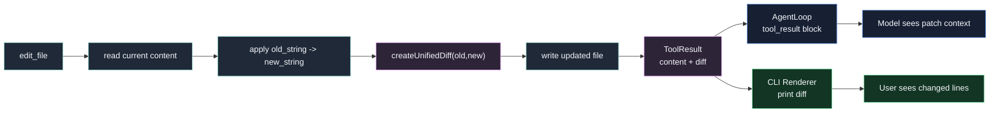

# 第 10 章：实现 Diff / Patch

## 本章目标

这一章要让 Claude Code Mini 在编辑代码后展示清晰的 Diff / Patch。

第 9 章已经实现了 `edit_file`：

```text
old_string -> new_string
```

但工具结果只告诉用户：

```text
File edited: tmp/demo.ts.
```

这还不够。

Coding Agent 改代码时，用户最关心的是：

```text
到底改了什么？
```

真实 Claude Code 在文件编辑后会展示结构化 diff。

它不会只说“文件已修改”，而是展示类似：

```diff
--- a/tmp/demo.ts
+++ b/tmp/demo.ts
@@ -1,2 +1,2 @@
-const name = "mini";
+const name = "claude-code-mini";
 console.log(name);
```

本章要实现三件事：

1. 增加 `diff` 依赖。
2. 新增 `src/diff/patch.ts`，从 before/after 内容生成 unified diff。
3. 修改 `edit_file` 和 CLI，让工具执行后显示 patch。

完成后，Mini 的编辑结果会从：

```text
[tool_result] edit_file ok
```

升级成：

```text
[tool_result] edit_file ok
--- a/tmp/demo.ts
+++ b/tmp/demo.ts
@@ -1,2 +1,2 @@
-const name = "mini";
+const name = "claude-code-mini";
 console.log(name);
```

---

## 本章完成效果

准备文件：

```bash
mkdir -p tmp
printf 'const name = "mini";\nconsole.log(name);\n' > tmp/demo.ts
```

启动：

```bash
bun run dev
```

输入：

```text
> 请读取 tmp/demo.ts，把 const name = "mini"; 改成 const name = "claude-code-mini";，然后读取文件确认结果
```

你会看到类似输出：

```text
[turn 1]

[tool_use] read_file
input: {"path":"tmp/demo.ts"}
[tool_result] read_file ok

[turn 2]

[tool_use] edit_file
input: {"path":"tmp/demo.ts","old_string":"const name = \"mini\";","new_string":"const name = \"claude-code-mini\";"}
[tool_result] edit_file ok
--- a/tmp/demo.ts
+++ b/tmp/demo.ts
@@ -1,2 +1,2 @@
-const name = "mini";
+const name = "claude-code-mini";
 console.log(name);

[turn 3]

[tool_use] read_file
input: {"path":"tmp/demo.ts"}
[tool_result] read_file ok
```

也可以手动调用：

```text
> /tool read_file {"path":"tmp/demo.ts"}
> /tool edit_file {"path":"tmp/demo.ts","old_string":"mini","new_string":"claude-code-mini"}
```

手动工具也会输出 diff。

---

## 本章项目结构变化

本章新增一个 diff 模块，并改造工具结果类型：

```bash
src/
  diff/
    patch.ts          # 新增：生成 unified diff patch
    index.ts          # 新增：导出 diff 工具函数
  tools/
    types.ts          # 修改：ToolResult 增加 diff 字段
    builtin/
      editFile.ts     # 修改：编辑后返回 diff
  agent/
    loop.ts           # 修改：tool_result 事件携带 rawResult
  chat/
    chatLoop.ts       # 修改：渲染工具 diff
  main.ts             # 修改：单次 prompt 也渲染工具 diff
```

另外安装一个依赖：

```bash
bun add diff
```

`diff` 是一个小型文本 diff 库。

当前真实仓库也用它生成 `structuredPatch`。

---

## 为什么需要这个模块

代码编辑工具有两个结果。

第一个是机器结果：

```text
tool_result
```

它告诉模型：

```text
工具执行成功，文件已更新。
```

第二个是人类结果：

```diff
-const name = "mini";
+const name = "claude-code-mini";
```

它告诉用户：

```text
Agent 到底改了哪几行。
```

如果没有 diff，用户只能自己再打开文件检查。

这会削弱 Coding Agent 的可控性。

真实 Claude Code 对文件编辑非常重视 diff 展示。

对应链路是：

```text
FileEditTool.call()
  -> getPatchForEdit()
  -> structuredPatch
  -> FileEditToolUpdatedMessage
  -> StructuredDiffList
```

Mini 本章不会实现 Ink UI 的彩色 diff。

但会先实现一个文本版 unified diff。

这已经足够支撑终端使用，也为后续权限确认 UI 打基础。

---

## 整体架构



这个架构里有一个重要取舍。

Diff 既要给用户看，也要给模型看。

所以 `ToolResult` 会多一个字段：

```ts
diff?: string;
```

CLI 直接打印它。

Agent Loop 会把它合并进 `tool_result.content`，让模型也知道文件变更细节。

---

## 核心流程

本章核心流程是：

```text
edit_file
  -> currentContent
  -> updatedContent
  -> createUnifiedDiff({
       filePath,
       oldContent: currentContent,
       newContent: updatedContent
     })
  -> writeFile(updatedContent)
  -> return {
       content: "File edited...",
       diff: unifiedDiff
     }
```

然后 Agent Loop：

```text
ToolResult
  -> formatToolResult(result)
  -> tool_result.content includes diff
  -> yield tool_result event with rawResult
```

最后 CLI：

```text
event.rawResult?.diff
  -> print diff
```

这条链路把同一个 diff 同时送到两端：

- 模型：用于后续推理。
- 用户：用于审查变更。

---

## 完整核心代码

### package.json

先安装依赖：

```bash
bun add diff
```

安装后，`package.json` 会新增：

```json
{
  "dependencies": {
    "diff": "^8.0.4"
  }
}
```

版本号以你本机实际安装结果为准。

### src/diff/patch.ts

新增文件：

```ts
import { structuredPatch, type StructuredPatchHunk } from "diff";

const CONTEXT_LINES = 3;
const DIFF_TIMEOUT_MS = 5_000;

const AMPERSAND_TOKEN = "<<:AMPERSAND_TOKEN:>>";
const DOLLAR_TOKEN = "<<:DOLLAR_TOKEN:>>";

export type UnifiedDiffInput = {
  filePath: string;
  oldContent: string;
  newContent: string;
};

export type UnifiedDiffResult = {
  patch: string;
  additions: number;
  removals: number;
};

export function createUnifiedDiff(input: UnifiedDiffInput): UnifiedDiffResult {
  const hunks = getPatchFromContents(input);

  return {
    patch: formatUnifiedDiff(input.filePath, hunks),
    additions: countLines(hunks, "+"),
    removals: countLines(hunks, "-"),
  };
}

function getPatchFromContents({
  filePath,
  oldContent,
  newContent,
}: UnifiedDiffInput): StructuredPatchHunk[] {
  const result = structuredPatch(
    filePath,
    filePath,
    escapeForDiff(oldContent),
    escapeForDiff(newContent),
    undefined,
    undefined,
    {
      context: CONTEXT_LINES,
      timeout: DIFF_TIMEOUT_MS,
    },
  );

  if (!result) {
    return [];
  }

  return result.hunks.map(hunk => ({
    ...hunk,
    lines: hunk.lines.map(unescapeFromDiff),
  }));
}

function formatUnifiedDiff(
  filePath: string,
  hunks: StructuredPatchHunk[],
): string {
  if (hunks.length === 0) {
    return "";
  }

  const lines = [`--- a/${filePath}`, `+++ b/${filePath}`];

  for (const hunk of hunks) {
    lines.push(formatHunkHeader(hunk));
    lines.push(...hunk.lines);
  }

  return lines.join("\n");
}

function formatHunkHeader(hunk: StructuredPatchHunk): string {
  return `@@ -${formatRange(hunk.oldStart, hunk.oldLines)} +${formatRange(
    hunk.newStart,
    hunk.newLines,
  )} @@`;
}

function formatRange(start: number, lines: number): string {
  return lines === 1 ? String(start) : `${start},${lines}`;
}

function countLines(hunks: StructuredPatchHunk[], prefix: "+" | "-"): number {
  return hunks.reduce(
    (total, hunk) =>
      total +
      hunk.lines.filter(line => line.startsWith(prefix) && !line.startsWith(`${prefix}${prefix}`))
        .length,
    0,
  );
}

function escapeForDiff(value: string): string {
  return value.replaceAll("&", AMPERSAND_TOKEN).replaceAll("$", DOLLAR_TOKEN);
}

function unescapeFromDiff(value: string): string {
  return value.replaceAll(AMPERSAND_TOKEN, "&").replaceAll(DOLLAR_TOKEN, "$");
}
```

这里复刻了真实仓库 `src/utils/diff.ts` 的几个关键点：

- 使用 `structuredPatch()`。
- 设置 context 行数。
- 设置 timeout。
- 对 `&` 和 `$` 做 token 转义。
- 输出 hunk lines。

真实仓库返回的是 `StructuredPatchHunk[]`，因为 Ink UI 会自己渲染。

Mini 当前返回的是 unified diff 字符串，更适合普通终端。

### src/diff/index.ts

新增文件：

```ts
export { createUnifiedDiff } from "./patch";
export type { UnifiedDiffInput, UnifiedDiffResult } from "./patch";
```

### src/tools/types.ts

用下面版本替换第 6 章的 `src/tools/types.ts`：

```ts
import type { z } from "zod";

export type ToolInputJSONSchema = {
  type: "object";
  properties?: Record<string, unknown>;
  required?: string[];
  additionalProperties?: boolean;
};

export type ReadFileStateEntry = {
  content: string;
  mtimeMs: number;
};

export type ToolContext = {
  cwd: string;
  readFileState: Map<string, ReadFileStateEntry>;
};

export type ToolResult = {
  content: string;
  metadata?: Record<string, unknown>;
  diff?: string;
};

export type Tool<Input = unknown> = {
  name: string;
  description: string;
  inputSchema: z.ZodType<Input>;
  inputJSONSchema: ToolInputJSONSchema;
  isReadOnly: boolean;
  execute(input: Input, context: ToolContext): Promise<ToolResult>;
};

export type ToolSummary = {
  name: string;
  description: string;
  inputJSONSchema: ToolInputJSONSchema;
  isReadOnly: boolean;
};
```

只新增了：

```ts
diff?: string;
```

不要把 diff 放进 `metadata`。

`metadata` 适合机器字段：

```json
{
  "path": "tmp/demo.ts",
  "additions": 1,
  "removals": 1
}
```

`diff` 是一段面向人类阅读的 patch 文本，单独放更清楚。

### src/tools/builtin/editFile.ts

用下面版本替换第 9 章的 `src/tools/builtin/editFile.ts`：

```ts
import { readFile, stat, writeFile } from "node:fs/promises";
import { z } from "zod";
import { createUnifiedDiff } from "../../diff";
import { resolveToolPath, toDisplayPath } from "../path";
import type { Tool } from "../types";

const inputSchema = z
  .object({
    path: z.string().min(1),
    old_string: z.string().min(1),
    new_string: z.string(),
    replace_all: z.boolean().optional().default(false),
  })
  .strict();

type EditFileInput = z.infer<typeof inputSchema>;

export const editFileTool: Tool<EditFileInput> = {
  name: "edit_file",
  description:
    "Edit an existing UTF-8 text file by replacing old_string with new_string. Read the file first with read_file. Do not include read_file line number prefixes in old_string.",
  inputSchema,
  inputJSONSchema: {
    type: "object",
    properties: {
      path: {
        type: "string",
        description: "Path to edit, relative to cwd or absolute inside cwd.",
      },
      old_string: {
        type: "string",
        description:
          "Exact text to replace. It must match the file content and must not include read_file line number prefixes.",
      },
      new_string: {
        type: "string",
        description: "Replacement text.",
      },
      replace_all: {
        type: "boolean",
        description:
          "Replace every occurrence of old_string. Defaults to false; when false, old_string must be unique.",
      },
    },
    required: ["path", "old_string", "new_string"],
    additionalProperties: false,
  },
  isReadOnly: false,
  async execute(input, context) {
    if (input.old_string === input.new_string) {
      throw new Error("No changes to make: old_string and new_string are identical.");
    }

    const absolutePath = resolveToolPath(context.cwd, input.path);
    const displayPath = toDisplayPath(context.cwd, absolutePath);

    const fileStat = await stat(absolutePath);

    if (!fileStat.isFile()) {
      throw new Error(`Path is not a file: ${input.path}`);
    }

    const lastRead = context.readFileState.get(absolutePath);

    if (!lastRead) {
      throw new Error(
        `Refusing to edit ${displayPath}. Read the file first with read_file.`,
      );
    }

    const currentContent = await readFile(absolutePath, "utf8");

    if (
      Math.floor(fileStat.mtimeMs) > lastRead.mtimeMs &&
      currentContent !== lastRead.content
    ) {
      throw new Error(
        `Refusing to edit ${displayPath}. The file changed after it was read. Read it again before editing.`,
      );
    }

    const matchCount = countOccurrences(currentContent, input.old_string);

    if (matchCount === 0) {
      throw new Error(
        `String to replace was not found in ${displayPath}.\nold_string:\n${input.old_string}`,
      );
    }

    if (matchCount > 1 && !input.replace_all) {
      throw new Error(
        `Found ${matchCount} matches in ${displayPath}, but replace_all is false. Provide a more specific old_string or set replace_all to true.`,
      );
    }

    const updatedContent = input.replace_all
      ? currentContent.split(input.old_string).join(input.new_string)
      : currentContent.replace(input.old_string, input.new_string);

    const diff = createUnifiedDiff({
      filePath: displayPath,
      oldContent: currentContent,
      newContent: updatedContent,
    });

    await writeFile(absolutePath, updatedContent, "utf8");

    const newStat = await stat(absolutePath);
    context.readFileState.set(absolutePath, {
      content: updatedContent,
      mtimeMs: Math.floor(newStat.mtimeMs),
    });

    return {
      content: input.replace_all
        ? `File edited: ${displayPath}. Replaced ${matchCount} occurrence(s).`
        : `File edited: ${displayPath}.`,
      diff: diff.patch,
      metadata: {
        path: displayPath,
        operation: "edit",
        replacements: input.replace_all ? matchCount : 1,
        additions: diff.additions,
        removals: diff.removals,
        bytes: Buffer.byteLength(updatedContent, "utf8"),
      },
    };
  },
};

function countOccurrences(content: string, search: string): number {
  let count = 0;
  let index = 0;

  while (true) {
    const foundIndex = content.indexOf(search, index);

    if (foundIndex === -1) {
      return count;
    }

    count++;
    index = foundIndex + search.length;
  }
}
```

注意 diff 的生成时机。

必须在写文件前生成：

```ts
const diff = createUnifiedDiff({
  oldContent: currentContent,
  newContent: updatedContent,
});
```

写完再读也可以，但没必要。

此时 before/after 内容都已经在内存里。

### src/agent/loop.ts

用下面版本替换第 8 章的 `src/agent/loop.ts`：

```ts
import { streamMessage } from "../llm/anthropicClient";
import type {
  ChatMessage,
  LLMConfig,
  LLMResponse,
  LLMStreamEvent,
  ToolResultContentBlock,
  ToolUseContentBlock,
} from "../llm/types";
import type { ToolRegistry, ToolResult, ToolSummary } from "../tools";

export type AgentLoopOptions = {
  maxTurns: number;
};

type ExecutedToolResult = {
  block: ToolResultContentBlock;
  rawResult?: ToolResult;
};

export type AgentLoopEvent =
  | LLMStreamEvent
  | {
      type: "turn_start";
      turn: number;
    }
  | {
      type: "turn_complete";
      turn: number;
      stopReason: string | null;
      toolUseCount: number;
    }
  | {
      type: "tool_start";
      turn: number;
      toolUse: ToolUseContentBlock;
    }
  | {
      type: "tool_result";
      turn: number;
      toolUse: ToolUseContentBlock;
      result: ToolResultContentBlock;
      rawResult?: ToolResult;
    }
  | {
      type: "max_turns_reached";
      maxTurns: number;
    };

export class AgentLoop {
  constructor(
    private readonly config: LLMConfig,
    private readonly toolRegistry: ToolRegistry,
  ) {}

  async *run(
    messages: ChatMessage[],
    options: AgentLoopOptions,
  ): AsyncGenerator<AgentLoopEvent, void> {
    if (options.maxTurns < 1) {
      throw new Error("maxTurns must be greater than or equal to 1.");
    }

    for (let turn = 1; turn <= options.maxTurns; turn++) {
      yield {
        type: "turn_start",
        turn,
      };

      const response = yield* this.runAssistantTurn(
        messages,
        this.toolRegistry.list(),
      );

      messages.push({
        role: "assistant",
        content: response.content,
      });

      yield {
        type: "turn_complete",
        turn,
        stopReason: response.stopReason,
        toolUseCount: response.toolUses.length,
      };

      if (response.toolUses.length === 0) {
        return;
      }

      const toolResults: ToolResultContentBlock[] = [];

      for (const toolUse of response.toolUses) {
        yield {
          type: "tool_start",
          turn,
          toolUse,
        };

        const executed = await this.executeToolUse(toolUse);
        toolResults.push(executed.block);

        yield {
          type: "tool_result",
          turn,
          toolUse,
          result: executed.block,
          ...(executed.rawResult && { rawResult: executed.rawResult }),
        };
      }

      messages.push({
        role: "user",
        content: toolResults,
      });
    }

    yield {
      type: "max_turns_reached",
      maxTurns: options.maxTurns,
    };
  }

  private async *runAssistantTurn(
    messages: ChatMessage[],
    tools: ToolSummary[],
  ): AsyncGenerator<LLMStreamEvent, LLMResponse> {
    let finalResponse: LLMResponse | undefined;

    for await (const event of streamMessage(messages, tools, this.config)) {
      if (event.type === "message_stop") {
        finalResponse = event.response;
      }

      yield event;
    }

    if (!finalResponse) {
      throw new Error("The stream ended before a final response was received.");
    }

    return finalResponse;
  }

  private async executeToolUse(
    toolUse: ToolUseContentBlock,
  ): Promise<ExecutedToolResult> {
    try {
      const rawResult = await this.toolRegistry.execute(toolUse.name, toolUse.input);

      return {
        block: {
          type: "tool_result",
          tool_use_id: toolUse.id,
          content: formatToolResult(rawResult),
        },
        rawResult,
      };
    } catch (error) {
      const message = error instanceof Error ? error.message : String(error);

      return {
        block: {
          type: "tool_result",
          tool_use_id: toolUse.id,
          content: `Error: ${message}`,
          is_error: true,
        },
      };
    }
  }
}

function formatToolResult(result: ToolResult): string {
  const parts = [result.content];

  if (result.diff) {
    parts.push(`diff:\n\`\`\`diff\n${result.diff.trimEnd()}\n\`\`\``);
  }

  if (result.metadata) {
    parts.push(`metadata:\n${JSON.stringify(result.metadata, null, 2)}`);
  }

  return parts.join("\n\n");
}
```

相比第 8 章，主要变化是：

```ts
rawResult?: ToolResult;
```

`tool_result.content` 仍然是符合 Anthropic API 的字符串。

`rawResult.diff` 只给本地 CLI 渲染使用。

### src/chat/chatLoop.ts

只需要修改两个位置。

第一，在手动工具调用里打印 diff：

```ts
async function runManualTool(
  prompt: string,
  toolRegistry: ToolRegistry,
): Promise<void> {
  const { name, input } = parseToolCommand(prompt);
  const result = await toolRegistry.execute(name, input);

  console.log(result.content);
  printDiff(result.diff);

  if (result.metadata) {
    console.log(JSON.stringify(result.metadata, null, 2));
  }
}
```

第二，在 Agent Loop 的 `tool_result` 事件里打印 diff：

```ts
case "tool_result":
  console.log(
    `[tool_result] ${event.toolUse.name} ${
      event.result.is_error ? "error" : "ok"
    }`,
  );
  printDiff(event.rawResult?.diff);
  console.log("");
  break;
```

然后在文件底部增加：

```ts
function printDiff(diff: string | undefined): void {
  if (!diff) {
    return;
  }

  console.log(diff);
}
```

完整文件和第 8 章基本一致，这里只展示需要替换的局部，避免重复贴一整份长文件。

### src/main.ts

单次 prompt 也要渲染 diff。

把 `runSinglePrompt()` 里的 `tool_result` 分支改成：

```ts
case "tool_result":
  console.log(
    `[tool_result] ${event.toolUse.name} ${
      event.result.is_error ? "error" : "ok"
    }`,
  );
  printDiff(event.rawResult?.diff);
  break;
```

并在文件底部增加同样的辅助函数：

```ts
function printDiff(diff: string | undefined): void {
  if (!diff) {
    return;
  }

  console.log(diff);
}
```

这会让交互模式和单次 prompt 的展示保持一致。

---

## 逐步实现

### 1. 安装 diff

```bash
bun add diff
```

安装后可以检查：

```bash
bun pm ls diff
```

如果能看到 `diff`，说明依赖已安装。

### 2. 新增 `src/diff/`

创建目录：

```bash
mkdir -p src/diff
```

新增：

```bash
src/diff/patch.ts
src/diff/index.ts
```

不要把 diff 逻辑直接塞进 `editFile.ts`。

Diff 以后会被更多工具复用：

- `write_file` 更新已有文件。
- `edit_file` 局部替换。
- 后续 `apply_patch`。
- 用户确认 UI。

### 3. 使用 `structuredPatch`

`diff` 包提供很多函数：

- `diffLines`
- `createPatch`
- `createTwoFilesPatch`
- `structuredPatch`

本章选择 `structuredPatch`。

原因是它返回结构化 hunk：

```ts
{
  oldStart: number;
  oldLines: number;
  newStart: number;
  newLines: number;
  lines: string[];
}
```

结构化数据更适合后续渲染 UI。

本章先把它格式化成 unified diff 字符串。

第十章之后，如果想做彩色终端 UI，可以继续使用同一份 hunk 数据。

### 4. 转义 `&` 和 `$`

真实仓库的 `src/utils/diff.ts` 有一段看起来很奇怪的逻辑：

```ts
const AMPERSAND_TOKEN = "<<:AMPERSAND_TOKEN:>>";
const DOLLAR_TOKEN = "<<:DOLLAR_TOKEN:>>";
```

它会在 diff 前先转义：

```ts
replaceAll("&", AMPERSAND_TOKEN).replaceAll("$", DOLLAR_TOKEN)
```

再在结果里还原。

这是为了规避 diff 库在某些字符上的处理问题。

Mini 直接照着做。

这类细节不是核心架构，但属于工程经验。

### 5. 给 ToolResult 增加 diff

修改：

```ts
export type ToolResult = {
  content: string;
  metadata?: Record<string, unknown>;
  diff?: string;
};
```

这个字段是可选的。

只有会修改文件的工具需要返回。

`read_file`、`current_time`、`echo` 不需要。

### 6. 在 `edit_file` 中生成 diff

替换完成后，不要立刻写文件。

先生成 diff：

```ts
const diff = createUnifiedDiff({
  filePath: displayPath,
  oldContent: currentContent,
  newContent: updatedContent,
});
```

再写入：

```ts
await writeFile(absolutePath, updatedContent, "utf8");
```

这样 diff 的 before/after 来源清楚，不需要再读一次文件。

### 7. 把 diff 送给模型

`AgentLoop` 的 `formatToolResult()` 要把 diff 合并进 `tool_result.content`：

```ts
if (result.diff) {
  parts.push(`diff:\n\`\`\`diff\n${result.diff.trimEnd()}\n\`\`\``);
}
```

这很重要。

模型下一轮能看到：

```diff
- old
+ new
```

它就能基于真实变更继续判断。

例如：

```text
现在读取文件确认结果。
```

或者：

```text
刚才替换错了，需要再改一次。
```

### 8. 把 diff 展示给用户

CLI 不能只展示：

```text
[tool_result] edit_file ok
```

它还应该展示：

```diff
--- a/tmp/demo.ts
+++ b/tmp/demo.ts
@@ -1,2 +1,2 @@
-const name = "mini";
+const name = "claude-code-mini";
 console.log(name);
```

所以 `tool_result` 事件需要携带：

```ts
rawResult?: ToolResult;
```

`rawResult` 不发给 API。

它只是给本地 UI 使用。

### 9. 保持手动工具体验一致

`/tool edit_file ...` 也应该打印 diff。

否则调试时会出现两套行为：

- 模型调用能看 diff。
- 手动调用看不到 diff。

这不利于排查问题。

### 10. 不在本章实现 apply patch

本章的 Patch 指 unified diff patch 文本。

它是展示格式，不是新的应用补丁工具。

也就是说，本章不实现：

```text
apply_patch
```

原因是 Mini 现在已经有 `edit_file`。

先把编辑结果展示清楚，再在后续章节考虑补丁应用和用户确认。

---

## 关键源码分析

### 1. `src/utils/diff.ts`

真实仓库的 diff 核心在：

```ts
src/utils/diff.ts
```

最重要的函数是：

```ts
getPatchFromContents()
getPatchForDisplay()
countLinesChanged()
```

`getPatchFromContents()` 接收 before/after：

```ts
oldContent
newContent
```

然后返回：

```ts
StructuredPatchHunk[]
```

Mini 的 `createUnifiedDiff()` 对应这个函数，但最终输出字符串。

### 2. `FileEditTool.call()`

真实 `FileEditTool` 编辑文件时会：

```text
read current file
validate stale state
find actual old string
preserve quote style
getPatchForEdit()
writeTextContent()
update readFileState
return structuredPatch
```

它返回的 `FileEditOutput` 包含：

```ts
{
  filePath,
  oldString,
  newString,
  originalFile,
  structuredPatch,
  replaceAll
}
```

Mini 本章没有返回这么多字段。

它只返回：

```ts
{
  content,
  diff,
  metadata
}
```

这是为了保持教程主线简单。

### 3. `FileEditToolUpdatedMessage`

真实 UI 组件：

```ts
src/components/FileEditToolUpdatedMessage.tsx
```

会统计：

```ts
numAdditions
numRemovals
```

然后渲染：

```text
Added 1 line, removed 1 line
```

并用：

```ts
StructuredDiffList
```

展示 hunk。

Mini 当前只打印纯文本 diff。

这是终端最小实现，但数据结构已经能支撑后续升级。

### 4. `FileEditToolDiff`

真实 `FileEditToolDiff` 还做了一件很工程化的事：它在用户确认编辑前就能预览 diff。

它会读取当前文件，模拟应用：

```text
old_string -> new_string
```

然后展示差异。

Mini 本章是在编辑后展示 diff。

后续做权限确认时，会把 diff 生成提前到“执行前预览”。

### 5. 为什么真实系统使用 structured patch

如果只是展示文本，用 unified diff 字符串就够了。

但真实系统需要更多能力：

- 折叠长 diff。
- 按文件聚合多次编辑。
- 在 IDE 中打开 diff。
- 统计新增/删除行数。
- 远端 UI 渲染。
- Session 回放。

这些都更适合结构化 hunk。

Mini 先输出字符串，但仍然用 `structuredPatch()` 作为内部来源，就是为了给后续扩展留接口。

---

## 调试与验证

### 1. 安装依赖

```bash
bun add diff
```

### 2. 运行类型检查

```bash
bun run typecheck
```

### 3. 准备文件

```bash
mkdir -p tmp
printf 'const name = "mini";\nconsole.log(name);\n' > tmp/demo.ts
```

### 4. 启动 CLI

```bash
bun run dev
```

### 5. 手动验证 diff

```text
> /tool read_file {"path":"tmp/demo.ts"}
> /tool edit_file {"path":"tmp/demo.ts","old_string":"const name = \"mini\";","new_string":"const name = \"claude-code-mini\";"}
```

应该输出：

```diff
--- a/tmp/demo.ts
+++ b/tmp/demo.ts
@@ -1,2 +1,2 @@
-const name = "mini";
+const name = "claude-code-mini";
 console.log(name);
```

### 6. 验证 metadata

手动工具输出里应该包含：

```json
{
  "path": "tmp/demo.ts",
  "operation": "edit",
  "replacements": 1,
  "additions": 1,
  "removals": 1
}
```

### 7. 验证 Agent 自动编辑时展示 diff

准备文件：

```bash
printf 'const name = "mini";\nconsole.log(name);\n' > tmp/demo.ts
```

输入：

```text
> 请读取 tmp/demo.ts，把 const name = "mini"; 改成 const name = "claude-code-mini";，然后读取文件确认结果
```

应该看到：

```text
[tool_result] edit_file ok
--- a/tmp/demo.ts
+++ b/tmp/demo.ts
```

### 8. 验证 replace_all 的 diff

准备：

```bash
printf 'mini\nmini\nmini\n' > tmp/repeat.txt
```

在 CLI 中：

```text
> /tool read_file {"path":"tmp/repeat.txt"}
> /tool edit_file {"path":"tmp/repeat.txt","old_string":"mini","new_string":"claude-code-mini","replace_all":true}
```

应该看到多行变更。

### 9. 验证特殊字符

准备：

```bash
printf 'price: $5\nname: a & b\n' > tmp/special.txt
```

在 CLI 中：

```text
> /tool read_file {"path":"tmp/special.txt"}
> /tool edit_file {"path":"tmp/special.txt","old_string":"price: $5","new_string":"price: $10"}
```

diff 中应该保留 `$`。

再测试：

```text
> /tool read_file {"path":"tmp/special.txt"}
> /tool edit_file {"path":"tmp/special.txt","old_string":"name: a & b","new_string":"name: a & c"}
```

diff 中应该保留 `&`。

### 10. 验证单次 prompt

```bash
bun run dev -- --max-turns 8 "请读取 tmp/demo.ts，把 const name = \"mini\"; 改成 const name = \"claude-code-mini\";"
```

单次 prompt 路径也应该展示 diff。

---

## 常见问题

### 1. `Cannot find module 'diff'`

原因：依赖没安装。

执行：

```bash
bun add diff
```

或者：

```bash
bun install
```

### 2. diff 是空字符串

原因通常是 before/after 完全一致。

本章 `edit_file` 已经拒绝：

```text
old_string and new_string are identical
```

如果仍然出现空 diff，检查：

- `updatedContent` 是否真的变化。
- `createUnifiedDiff()` 是否传入了正确的 old/new 内容。
- `structuredPatch()` 是否返回空 hunks。

### 3. diff 里的行号看起来不对

Unified diff 的 hunk header 是：

```diff
@@ -oldStart,oldLines +newStart,newLines @@
```

它不是 read_file 输出里的行号。

它描述的是 patch 作用于原文件和新文件的范围。

这是标准 unified diff 格式。

### 4. 为什么输出里有 `--- a/...` 和 `+++ b/...`

这是 unified diff 的文件头。

惯例上：

- `a/` 表示修改前。
- `b/` 表示修改后。

很多 Git 工具也使用这个格式。

### 5. 为什么不给 diff 上色

本章先输出纯文本。

真实 Claude Code 使用 Ink 组件渲染结构化 diff，可以给新增/删除行上色。

Mini 后续如果做终端 UI，可以基于 `StructuredPatchHunk[]` 或解析后的 diff 行来上色。

### 6. 为什么不直接让模型输出 patch

模型可以输出 patch，但不应该作为第一版编辑工具的核心路径。

原因：

- patch 格式更容易写错。
- 应用 patch 需要处理上下文匹配。
- 出错时很难给模型清晰反馈。

`old_string -> new_string` 更容易验证，也更适合教学。

本章生成 patch 是为了展示结果，不是让模型手写 patch。

### 7. metadata 里已经有 additions/removals，为什么还要 diff

`additions/removals` 只告诉你变更规模。

`diff` 告诉你具体内容。

两者用途不同。

用户审查代码时需要 diff。

统计和日志更适合 metadata。

---

## 本章小结

这一章让 Claude Code Mini 具备了最基础的 Diff / Patch 展示能力。

当前系统已经具备：

- `diff` 依赖。
- `createUnifiedDiff()`。
- unified diff patch 文本。
- `ToolResult.diff`。
- `edit_file` 编辑后返回 diff。
- Agent Loop 把 diff 回填给模型。
- CLI 把 diff 展示给用户。
- 手动 `/tool edit_file` 也能看到 diff。

当前还缺少：

- 编辑前 diff 预览。
- 用户确认后再写入。
- 彩色 diff UI。
- 多文件 diff 聚合。
- apply patch 工具。
- Shell 执行工具。
- 权限系统。

下一章会进入 Context 管理。

现在 Mini 已经能：

```text
读文件 -> 局部编辑 -> 展示 diff -> 继续 Agent Loop
```

但随着文件、工具结果和 diff 越来越多，消息历史会快速变长。

第 11 章会解决这个问题：如何管理上下文，避免 Agent 把整个会话无限塞进模型窗口。
