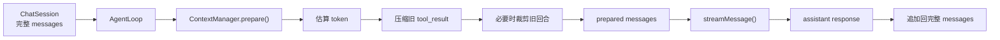
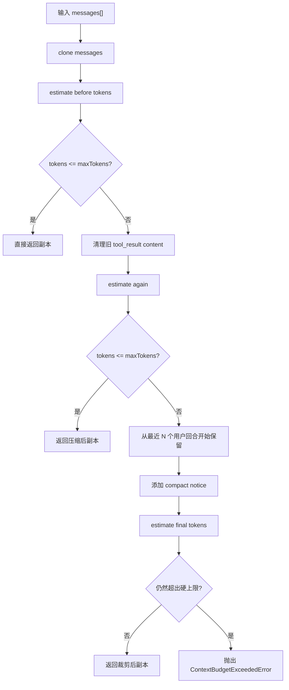

# 第 11 章：实现 Context 管理

## 本章目标

这一章要让 Claude Code Mini 学会控制上下文长度。

前面章节已经实现了：

```text
用户输入 -> 模型流式响应 -> 工具调用 -> 工具结果回填 -> Agent Loop
```

第 10 章之后，Mini 已经可以：

```text
读文件 -> 局部编辑 -> 展示 diff -> 继续让模型判断下一步
```

但这里会出现一个新问题：

```text
messages 会越来越长。
```

特别是 Coding Agent 场景里，下面这些内容都很容易撑爆上下文：

- `read_file` 返回的大文件内容。
- `grep` / `glob` 返回的大量搜索结果。
- `edit_file` 返回的 diff。
- 多轮工具调用产生的 `tool_result`。
- 用户连续追问产生的历史对话。

如果完全不管上下文，系统最终会遇到两类问题：

```text
input tokens exceed context window
```

或者：

```text
模型虽然没报错，但注意力被旧内容稀释，回答开始漂移。
```

本章要实现一个最小可用的 Context Manager。

它会在每次请求模型前做三件事：

1. 粗略估算当前消息列表的 token 数。
2. 清理旧的 `tool_result` 大内容，只保留占位提示。
3. 如果仍然太长，按完整用户回合裁剪旧历史。

完成后，Mini 不再把整段无限增长的历史直接塞给模型。

---

## 本章完成效果

启动时指定一个较小的上下文窗口，方便观察效果：

```bash
bun run dev -- --context-window 1200
```

准备一个较大的测试文件：

```bash
mkdir -p tmp
bun -e 'await Bun.write("tmp/context-demo.txt", Array.from({ length: 180 }, (_, index) => `line ${index + 1}: context management demo content`).join("\n"))'
```

进入 Mini 后输入：

```text
> 读取 tmp/context-demo.txt，然后总结它的内容
```

继续输入几轮类似请求：

```text
> 再读取一次 tmp/context-demo.txt，并告诉我前 5 行是什么
> 把 tmp/context-demo.txt 里第一行的 demo 改成 mini，然后读取文件确认
> 继续总结刚才修改了什么
```

当上下文超过阈值时，你会看到类似输出：

```text
[context] 1836 -> 742 tokens, compacted 2 tool result(s), trimmed 4 message(s)
```

含义是：

```text
请求模型前，Mini 发现上下文太大。
它清理了旧工具结果，并裁掉了更早的完整对话回合。
```

注意这里有一个关键设计：

```text
ChatSession 里的完整历史仍然保留。
只有本次发给模型的 messages 副本被压缩。
```

这和真实 Claude Code 的思路一致：

- 本地状态尽量完整。
- API 请求前做上下文预算。
- 旧工具结果优先清理。
- 超过硬阈值时阻止继续请求。

---

## 本章项目结构变化

本章新增一个 `context` 模块，并把它接入 Agent Loop：

```bash
src/
  context/
    tokenEstimate.ts    # 新增：粗略估算消息 token
    manager.ts          # 新增：上下文压缩与裁剪策略
    index.ts            # 新增：导出 context 模块
  agent/
    loop.ts             # 修改：请求模型前 prepare context
  chat/
    session.ts          # 修改：创建 ContextManager
    chatLoop.ts         # 修改：展示 context_update 事件
  main.ts               # 修改：增加 --context-window 参数
```

本章不需要安装新依赖。

使用 Bun 项目已有能力即可：

```bash
bun run typecheck
```

---

## 为什么需要这个模块

模型调用并不是：

```text
把最新一句用户输入发给模型。
```

而是：

```text
把一整个 messages[] 发给模型。
```

在第 3 章里，Mini 已经实现了多轮上下文：

```ts
messages.push({ role: "user", content });
messages.push({ role: "assistant", content: response.content });
```

第 7 章之后，又加入了 tool calling：

```ts
messages.push({
  role: "user",
  content: toolResults,
});
```

第 10 章之后，工具结果里还可能包含 diff：

````text
diff:
```diff
--- a/tmp/demo.ts
+++ b/tmp/demo.ts
@@ -1 +1 @@
-const name = "mini";
+const name = "claude-code-mini";
```
````

这意味着上下文会快速增长。

一个真实 Coding Agent 不能只靠模型的最大上下文窗口硬扛。

原因有三个。

第一，窗口再大也有限。

```text
200K tokens 不是无限 tokens。
```

第二，上下文越大，请求越贵、越慢。

大量旧工具结果会重复发送给模型。

第三，旧内容可能干扰当前任务。

例如用户已经修改了文件，但很早之前的 `read_file` 结果还在上下文里。

模型可能混淆新旧状态。

所以 Context 管理不是性能优化，而是 Agent 架构的核心模块。

---

## 整体架构

本章新增的 Context Manager 位于模型请求前：



注意方向：

```text
完整 messages -> 复制一份 -> 压缩副本 -> 发给模型
```

不要直接压缩 `ChatSession.messages`。

如果直接改原始历史，会带来几个问题：

- `/clear` 之外的历史丢失不可恢复。
- 后续 Session 持久化无法保存完整记录。
- 调试时看不到真实发生过的工具结果。
- 未来做 transcript / replay 会缺少信息。

本章 Mini 的策略是：

```text
本地保留完整历史，API 请求只发送预算内副本。
```

---

## 核心流程

一次模型请求前，Context Manager 的流程如下：



为什么按“用户回合”裁剪，而不是简单 `messages.slice(-10)`？

因为 tool calling 有成对约束。

模型消息里如果有：

```ts
{
  role: "assistant",
  content: [{ type: "tool_use", id: "toolu_1", name: "read_file", input: {} }],
}
```

后面通常必须跟着：

```ts
{
  role: "user",
  content: [{ type: "tool_result", tool_use_id: "toolu_1", content: "..." }],
}
```

如果从中间随便切，可能留下孤立的 `tool_result` 或孤立的 `tool_use`。

所以本章的裁剪策略是：

```text
只从真实用户输入开始保留后缀。
```

也就是从最近第 N 条普通 user prompt 开始切。

这样切出来的是完整的后续 Agent 过程：

```text
user prompt
assistant tool_use
user tool_result
assistant final answer
```

---

## 完整核心代码

### src/context/tokenEstimate.ts

新增文件：

```ts
import type { ChatContentBlock, ChatMessage } from "../llm/types";

const CHARS_PER_TOKEN = 4;
const MESSAGE_OVERHEAD_TOKENS = 4;

export function estimateMessagesTokens(messages: readonly ChatMessage[]): number {
  return messages.reduce(
    (total, message) => total + estimateMessageTokens(message),
    0,
  );
}

export function estimateMessageTokens(message: ChatMessage): number {
  return MESSAGE_OVERHEAD_TOKENS + estimateContentTokens(message.content);
}

export function estimateTextTokens(text: string): number {
  if (text.length === 0) {
    return 0;
  }

  return Math.ceil(text.length / CHARS_PER_TOKEN);
}

function estimateContentTokens(content: string | ChatContentBlock[]): number {
  if (typeof content === "string") {
    return estimateTextTokens(content);
  }

  return content.reduce(
    (total, block) => total + estimateBlockTokens(block),
    0,
  );
}

function estimateBlockTokens(block: ChatContentBlock): number {
  switch (block.type) {
    case "text":
      return estimateTextTokens(block.text);
    case "thinking":
      return estimateTextTokens(block.thinking);
    case "redacted_thinking":
      return estimateTextTokens(block.data);
    case "tool_use":
      return (
        estimateTextTokens(block.name) +
        estimateTextTokens(safeStringify(block.input))
      );
    case "tool_result":
      return estimateTextTokens(block.content);
  }
}

function safeStringify(value: unknown): string {
  try {
    return JSON.stringify(value);
  } catch {
    return "[unserializable]";
  }
}
```

这是一个粗略估算器。

它不追求精确 tokenizer。

它只解决一个工程问题：

```text
请求前判断 messages 大概是不是太长。
```

真实项目里通常会同时使用两种来源：

- API 返回的真实 usage。
- 新增消息的粗略估算。

Mini 第一版先用 `字符数 / 4`。

这个估算不完美，但足够做预算保护。

### src/context/manager.ts

新增文件：

```ts
import type {
  ChatContentBlock,
  ChatMessage,
  ToolResultContentBlock,
} from "../llm/types";
import { estimateMessagesTokens } from "./tokenEstimate";

export const CLEARED_TOOL_RESULT = "[Old tool result content cleared]";

export type ContextManagerOptions = {
  maxTokens: number;
  targetTokens?: number;
  keepRecentUserPrompts?: number;
  keepRecentToolResults?: number;
};

export type ResolvedContextManagerOptions = {
  maxTokens: number;
  targetTokens: number;
  keepRecentUserPrompts: number;
  keepRecentToolResults: number;
};

export type ContextPreparationResult = {
  messages: ChatMessage[];
  beforeTokens: number;
  afterTokens: number;
  compactedToolResults: number;
  trimmedMessages: number;
  changed: boolean;
};

export class ContextBudgetExceededError extends Error {
  constructor(
    readonly maxTokens: number,
    readonly actualTokens: number,
  ) {
    super(
      `Context is still too large after compaction: ${actualTokens} estimated tokens, max is ${maxTokens}.`,
    );
    this.name = "ContextBudgetExceededError";
  }
}

export class ContextManager {
  private readonly options: ResolvedContextManagerOptions;

  constructor(options: ContextManagerOptions) {
    this.options = resolveOptions(options);
  }

  prepare(messages: readonly ChatMessage[]): ContextPreparationResult {
    const beforeTokens = estimateMessagesTokens(messages);
    let prepared = cloneMessages(messages);
    let compactedToolResults = 0;
    let trimmedMessages = 0;

    if (beforeTokens > this.options.maxTokens) {
      compactedToolResults = compactOldToolResults(
        prepared,
        this.options.keepRecentToolResults,
      );
    }

    let afterTokens = estimateMessagesTokens(prepared);

    if (afterTokens > this.options.maxTokens) {
      const trimmed = trimToRecentUserPrompts(prepared, this.options);
      prepared = trimmed.messages;
      trimmedMessages = trimmed.trimmedMessages;
      afterTokens = estimateMessagesTokens(prepared);
    }

    if (afterTokens > this.options.maxTokens) {
      throw new ContextBudgetExceededError(this.options.maxTokens, afterTokens);
    }

    return {
      messages: prepared,
      beforeTokens,
      afterTokens,
      compactedToolResults,
      trimmedMessages,
      changed:
        compactedToolResults > 0 ||
        trimmedMessages > 0 ||
        beforeTokens !== afterTokens,
    };
  }
}

export function createDefaultContextOptions(
  contextWindow: number,
): ResolvedContextManagerOptions {
  if (!Number.isFinite(contextWindow) || contextWindow < 1000) {
    throw new Error("contextWindow must be a number greater than or equal to 1000.");
  }

  return {
    maxTokens: Math.floor(contextWindow),
    targetTokens: Math.floor(contextWindow * 0.75),
    keepRecentUserPrompts: 3,
    keepRecentToolResults: 6,
  };
}

function resolveOptions(
  options: ContextManagerOptions,
): ResolvedContextManagerOptions {
  const defaults = createDefaultContextOptions(options.maxTokens);

  return {
    ...defaults,
    ...options,
    targetTokens: options.targetTokens ?? defaults.targetTokens,
    keepRecentUserPrompts:
      options.keepRecentUserPrompts ?? defaults.keepRecentUserPrompts,
    keepRecentToolResults:
      options.keepRecentToolResults ?? defaults.keepRecentToolResults,
  };
}

function compactOldToolResults(
  messages: ChatMessage[],
  keepRecentToolResults: number,
): number {
  const toolResults: ToolResultContentBlock[] = [];

  for (const message of messages) {
    if (!Array.isArray(message.content)) {
      continue;
    }

    for (const block of message.content) {
      if (isToolResultBlock(block)) {
        toolResults.push(block);
      }
    }
  }

  const preserved = new Set(
    keepRecentToolResults > 0 ? toolResults.slice(-keepRecentToolResults) : [],
  );
  let compacted = 0;

  for (const block of toolResults) {
    if (preserved.has(block)) {
      continue;
    }

    if (block.content === CLEARED_TOOL_RESULT) {
      continue;
    }

    block.content = CLEARED_TOOL_RESULT;
    compacted++;
  }

  return compacted;
}

function trimToRecentUserPrompts(
  messages: ChatMessage[],
  options: ResolvedContextManagerOptions,
): { messages: ChatMessage[]; trimmedMessages: number } {
  let bestMessages = messages;
  let bestTrimmedMessages = 0;

  for (let keep = options.keepRecentUserPrompts; keep >= 1; keep--) {
    const boundaryIndex = findNthLatestRealUserPromptIndex(messages, keep);
    const suffix = messages.slice(boundaryIndex);
    const trimmedMessages = messages.length - suffix.length;
    const candidate = addCompactionNotice(suffix, trimmedMessages);
    const candidateTokens = estimateMessagesTokens(candidate);

    bestMessages = candidate;
    bestTrimmedMessages = trimmedMessages;

    if (candidateTokens <= options.targetTokens) {
      return {
        messages: candidate,
        trimmedMessages,
      };
    }
  }

  return {
    messages: bestMessages,
    trimmedMessages: bestTrimmedMessages,
  };
}

function findNthLatestRealUserPromptIndex(
  messages: readonly ChatMessage[],
  count: number,
): number {
  let seen = 0;

  for (let index = messages.length - 1; index >= 0; index--) {
    const message = messages[index];

    if (message && isRealUserPrompt(message)) {
      seen++;

      if (seen === count) {
        return index;
      }
    }
  }

  return 0;
}

function addCompactionNotice(
  messages: ChatMessage[],
  trimmedMessages: number,
): ChatMessage[] {
  if (trimmedMessages === 0 || messages.length === 0) {
    return messages;
  }

  const firstMessage = messages[0];
  if (!firstMessage) {
    return messages;
  }

  const rest = messages.slice(1);
  const notice = `[Context compacted: ${trimmedMessages} older message(s) omitted.]`;

  if (firstMessage.role === "user" && typeof firstMessage.content === "string") {
    return [
      {
        ...firstMessage,
        content: `${notice}\n\n${firstMessage.content}`,
      },
      ...rest,
    ];
  }

  return [
    {
      role: "user",
      content: notice,
    },
    ...messages,
  ];
}

function isRealUserPrompt(message: ChatMessage): boolean {
  return message.role === "user" && typeof message.content === "string";
}

function isToolResultBlock(
  block: ChatContentBlock,
): block is ToolResultContentBlock {
  return block.type === "tool_result";
}

function cloneMessages(messages: readonly ChatMessage[]): ChatMessage[] {
  return messages.map(message => ({
    role: message.role,
    content:
      typeof message.content === "string"
        ? message.content
        : message.content.map(cloneBlock),
  }));
}

function cloneBlock(block: ChatContentBlock): ChatContentBlock {
  return { ...block };
}
```

这里有几个设计点。

第一，只在超出预算时才清理旧工具结果：

```ts
if (beforeTokens > this.options.maxTokens) {
  compactedToolResults = compactOldToolResults(...);
}
```

上下文不大的时候，不要提前损失信息。

第二，优先清理旧 `tool_result`，而不是直接裁剪消息。

因为旧工具结果通常占 token 最多。

比如一次 `read_file` 可能有几千行内容。

清掉旧内容后仍然保留：

```ts
{
  type: "tool_result",
  tool_use_id: "...",
  content: "[Old tool result content cleared]"
}
```

这样不会破坏 tool_use / tool_result 的结构关系。

第三，最终仍然超限时抛错。

不要硬着头皮继续请求模型。

明确失败比让 API 返回模糊错误更容易排查。

### src/context/index.ts

新增文件：

```ts
export {
  CLEARED_TOOL_RESULT,
  ContextBudgetExceededError,
  ContextManager,
  createDefaultContextOptions,
} from "./manager";
export type {
  ContextManagerOptions,
  ContextPreparationResult,
  ResolvedContextManagerOptions,
} from "./manager";
export {
  estimateMessageTokens,
  estimateMessagesTokens,
  estimateTextTokens,
} from "./tokenEstimate";
```

### src/agent/loop.ts

修改第 10 章的 `src/agent/loop.ts`。

先新增 import：

```ts
import { ContextManager, type ContextPreparationResult } from "../context";
```

然后给事件类型增加 `context_update`：

```ts
export type AgentLoopEvent =
  | LLMStreamEvent
  | {
      type: "context_update";
      beforeTokens: number;
      afterTokens: number;
      compactedToolResults: number;
      trimmedMessages: number;
    }
  | {
      type: "turn_start";
      turn: number;
    }
  | {
      type: "turn_complete";
      turn: number;
      stopReason: string | null;
      toolUseCount: number;
    }
  | {
      type: "tool_start";
      turn: number;
      toolUse: ToolUseContentBlock;
    }
  | {
      type: "tool_result";
      turn: number;
      toolUse: ToolUseContentBlock;
      result: ToolResultContentBlock;
      rawResult?: ToolResult;
    }
  | {
      type: "max_turns_reached";
      maxTurns: number;
    };
```

修改构造函数：

```ts
export class AgentLoop {
  constructor(
    private readonly config: LLMConfig,
    private readonly toolRegistry: ToolRegistry,
    private readonly contextManager: ContextManager,
  ) {}

  // ...
}
```

最后改 `runAssistantTurn()`。

原来是：

```ts
for await (const event of streamMessage(messages, tools, this.config)) {
  // ...
}
```

现在变成：

```ts
private async *runAssistantTurn(
  messages: ChatMessage[],
  tools: ToolSummary[],
): AsyncGenerator<AgentLoopEvent, LLMResponse> {
  const preparedContext = this.contextManager.prepare(messages);

  if (preparedContext.changed) {
    yield createContextUpdateEvent(preparedContext);
  }

  let finalResponse: LLMResponse | undefined;

  for await (const event of streamMessage(
    preparedContext.messages,
    tools,
    this.config,
  )) {
    if (event.type === "message_stop") {
      finalResponse = event.response;
    }

    yield event;
  }

  if (!finalResponse) {
    throw new Error("The stream ended before a final response was received.");
  }

  return finalResponse;
}

function createContextUpdateEvent(preparedContext: ContextPreparationResult): {
  type: "context_update";
  beforeTokens: number;
  afterTokens: number;
  compactedToolResults: number;
  trimmedMessages: number;
} {
  return {
    type: "context_update",
    beforeTokens: preparedContext.beforeTokens,
    afterTokens: preparedContext.afterTokens,
    compactedToolResults: preparedContext.compactedToolResults,
    trimmedMessages: preparedContext.trimmedMessages,
  };
}
```

这里最重要的一行是：

```ts
preparedContext.messages
```

发给模型的是准备后的上下文副本。

但是 `AgentLoop.run()` 后面追加响应时，仍然写入原始 `messages`：

```ts
messages.push({
  role: "assistant",
  content: response.content,
});
```

这能保证：

```text
API 请求受预算控制，本地会话历史保持完整。
```

### src/chat/session.ts

修改 `ChatSessionOptions`：

```ts
type ChatSessionOptions = {
  maxTurns: number;
  contextWindow: number;
};
```

新增 import：

```ts
import { ContextManager, createDefaultContextOptions } from "../context";
```

构造函数里创建 Context Manager：

```ts
export class ChatSession {
  private readonly messages: ChatMessage[] = [];
  private readonly agentLoop: AgentLoop;

  constructor(
    config: LLMConfig,
    toolRegistry: ToolRegistry,
    private readonly options: ChatSessionOptions,
  ) {
    const contextManager = new ContextManager(
      createDefaultContextOptions(options.contextWindow),
    );

    this.agentLoop = new AgentLoop(config, toolRegistry, contextManager);
  }

  // ...
}
```

`sendUserMessageStream()` 不需要改。

它仍然负责：

```ts
this.messages.push({
  role: "user",
  content,
});
```

如果 Context Manager 抛错，原来的回滚逻辑继续生效：

```ts
try {
  yield* this.agentLoop.run(...);
} catch (error) {
  this.messages.length = historyLengthBeforeTurn;
  throw error;
}
```

这意味着：

```text
本轮请求如果因为上下文太大失败，不会把失败的 user message 留在历史里。
```

### src/chat/chatLoop.ts

修改 `ChatLoopOptions`：

```ts
type ChatLoopOptions = {
  cwd: string;
  toolRegistry: ToolRegistry;
  maxTurns: number;
  contextWindow: number;
};
```

创建 `ChatSession` 时传入：

```ts
const session = new ChatSession(config, options.toolRegistry, {
  maxTurns: options.maxTurns,
  contextWindow: options.contextWindow,
});
```

然后在事件分支里展示 context update：

```ts
case "context_update":
  console.log(
    `[context] ${event.beforeTokens} -> ${event.afterTokens} tokens, compacted ${event.compactedToolResults} tool result(s), trimmed ${event.trimmedMessages} message(s)`,
  );
  break;
```

这个输出是给开发调试用的。

后续如果做更完整的终端 UI，可以把它放到状态栏或日志区。

### src/main.ts

新增默认值：

```ts
const DEFAULT_CONTEXT_WINDOW = 32_000;
```

如果第 8 章已经有 `parsePositiveInteger()`，直接复用。

给 CLI 增加选项：

```ts
program.option(
  "--context-window <tokens>",
  "Estimated input context window for Claude Code Mini.",
  parsePositiveInteger,
  DEFAULT_CONTEXT_WINDOW,
);
```

交互模式传入：

```ts
await runChatLoop(config, {
  cwd: process.cwd(),
  toolRegistry,
  maxTurns: options.maxTurns,
  contextWindow: options.contextWindow,
});
```

单次 prompt 模式也要传入：

```ts
const session = new ChatSession(config, toolRegistry, {
  maxTurns: options.maxTurns,
  contextWindow: options.contextWindow,
});
```

并在单次 prompt 的事件分支里也支持：

```ts
case "context_update":
  console.log(
    `[context] ${event.beforeTokens} -> ${event.afterTokens} tokens, compacted ${event.compactedToolResults} tool result(s), trimmed ${event.trimmedMessages} message(s)`,
  );
  break;
```

---

## 逐步实现

### 1. 新增 `src/context/`

创建目录：

```bash
mkdir -p src/context
```

新增三个文件：

```bash
src/context/tokenEstimate.ts
src/context/manager.ts
src/context/index.ts
```

不要把上下文压缩逻辑写进 `AgentLoop`。

`AgentLoop` 的职责是：

```text
模型响应 -> 工具执行 -> 回填工具结果
```

Context Manager 的职责是：

```text
请求模型前，准备一个预算内的 messages 副本。
```

这两个职责应该分开。

### 2. 先实现 token 粗略估算

真实 tokenizer 很复杂。

Mini 第一版不要引入额外依赖。

用这个规则即可：

```ts
Math.ceil(text.length / 4)
```

这不是精确 token 数。

但它有两个优点：

- 快。
- 足够稳定。

Context 预算的目标不是精确计费，而是避免明显超限。

### 3. 估算不同 content block

Mini 的消息内容有两种形态：

```ts
string
```

以及：

```ts
ChatContentBlock[]
```

数组里可能有：

```ts
{ type: "text" }
{ type: "thinking" }
{ type: "redacted_thinking" }
{ type: "tool_use" }
{ type: "tool_result" }
```

所以估算函数不能只处理字符串。

`thinking` / `redacted_thinking` 来自第 7 章的 thinking mode 支持。

它们不会展示给用户，但属于 API 历史，估算上下文时也要计入。

`tool_use.input` 是对象，要先序列化：

```ts
JSON.stringify(block.input)
```

`tool_result.content` 往往是最大头。

它是本章压缩的主要对象。

### 4. 克隆 messages

Context Manager 不能直接改原数组。

所以 `prepare()` 第一步是：

```ts
let prepared = cloneMessages(messages);
```

后续无论是：

- 替换旧工具结果。
- 裁剪旧消息。
- 给第一条用户消息加 compact notice。

都只作用于 `prepared`。

原始 `ChatSession.messages` 不受影响。

### 5. 清理旧工具结果

清理策略：

```text
保留最近 keepRecentToolResults 个 tool_result。
更旧的 tool_result.content 替换成固定占位符。
```

占位符是：

```ts
export const CLEARED_TOOL_RESULT = "[Old tool result content cleared]";
```

为什么不直接删除整个 `tool_result`？

因为它和前面的 `tool_use` 有关系。

保留 block 结构，可以让消息序列仍然合法。

### 6. 按用户 prompt 裁剪

如果清理旧工具结果后仍然超限，就裁剪旧回合。

本章不按消息数量裁剪：

```ts
messages.slice(-10)
```

而是从最近第 N 条真实用户输入开始：

```ts
findNthLatestRealUserPromptIndex(messages, keep)
```

真实用户输入的判断是：

```ts
message.role === "user" && typeof message.content === "string"
```

工具结果也是 user message，但它的 content 是数组。

所以不会被误认为用户 prompt。

### 7. 给模型一个 compact notice

裁剪后，模型可能不知道前面发生过历史压缩。

所以本章会把提示合并进裁剪后第一条用户消息：

```text
[Context compacted: 4 older message(s) omitted.]
```

为什么不是新插入一条额外 user message？

因为切片后的第一条本来就是 user prompt。

把 notice 合并进去，可以避免连续两个 user message 影响可读性。

### 8. 接入 Agent Loop

接入点只有一个：

```ts
streamMessage(...)
```

不要在工具执行后立即压缩。

不要在 `ChatSession.messages.push()` 时压缩。

正确位置是：

```text
每次请求模型前。
```

因为只有请求模型时，才需要考虑输入窗口。

本地历史可以继续完整保存。

### 9. 展示 context_update 事件

开发阶段必须能看到 Context Manager 是否生效。

所以本章新增事件：

```ts
{
  type: "context_update";
  beforeTokens: number;
  afterTokens: number;
  compactedToolResults: number;
  trimmedMessages: number;
}
```

CLI 输出：

```text
[context] 1836 -> 742 tokens, compacted 2 tool result(s), trimmed 4 message(s)
```

这比静默压缩更容易调试。

### 10. 增加 `--context-window`

默认可以设大一点：

```ts
const DEFAULT_CONTEXT_WINDOW = 32_000;
```

调试时设小一点：

```bash
bun run dev -- --context-window 1200
```

这样不用真的塞几十万字符，也能验证压缩逻辑。

---

## 关键源码分析

当前真实仓库的 Context 管理比 Mini 复杂很多。

但核心思想相同：

```text
请求模型前，先把 messages 控制在预算内。
```

### 1. `src/services/tokenEstimation.ts`

真实仓库里有粗略估算函数：

```ts
roughTokenCountEstimation(content, bytesPerToken = 4)
```

它的基础思路也是：

```text
字符长度 / 4
```

真实项目还会在必要时调用模型 API 做更精确的 token count。

Mini 本章只保留粗略估算。

这符合教学项目的复杂度。

### 2. `src/utils/tokens.ts`

真实仓库不是每次都从头粗略估算所有消息。

它会结合：

- API 返回的真实 usage。
- 之后新增消息的估算值。
- 并行工具调用拆分 assistant message 的情况。

这样可以避免重复计算和累计误差。

Mini 现在没有复杂 usage 缓存，所以直接估算完整 messages。

### 3. `src/services/compact/microCompact.ts`

真实仓库会清理旧工具结果内容。

占位文案类似：

```text
[Old tool result content cleared]
```

本章 Mini 采用同样思路。

原因是 tool result 往往最占上下文。

清理它的收益最大，而且不破坏消息结构。

### 4. `src/services/compact/autoCompact.ts`

真实仓库会计算不同状态：

- warning
- error
- autoCompact
- blocking

它还会给输出 summary 预留 token buffer。

Mini 本章只实现两个阈值：

```ts
maxTokens
targetTokens
```

含义是：

- `maxTokens`：硬上限，超过就必须处理。
- `targetTokens`：裁剪目标，尽量回落到这个值以下。

这已经能支撑最小可用版本。

### 5. `src/query.ts`

真实请求链路里，模型请求前会经过一整条上下文处理流水线。

大致包括：

- 清理原始 toolUseResult payload。
- 控制 tool result budget。
- snip compact。
- micro compact。
- context collapse。
- auto compact。
- blocking check。

Mini 本章把这条复杂流水线压缩成一个方法：

```ts
contextManager.prepare(messages)
```

教学项目先把接口形状做对。

后续要增强时，可以继续往 `prepare()` 里加策略。

### 6. `src/utils/toolResultStorage.ts`

真实仓库会把大工具结果保存起来，并用预览或占位内容替换上下文里的大块文本。

Mini 暂时不做磁盘存储。

但本章已经保留了同一个方向：

```text
大内容不一定要永久放在 messages 里。
```

第 12 章做 Session 管理时，可以进一步把大工具结果落盘。

---

## 调试与验证

### 1. 类型检查

修改后先跑：

```bash
bun run typecheck
```

这里最容易出错的是：

- `ChatContentBlock` 联合类型没有处理完整。
- `ToolResultContentBlock` 的类型收窄不正确。
- `AgentLoopEvent` 加了新事件后，事件分支没有更新。

### 2. 小窗口验证

用很小的上下文窗口启动：

```bash
bun run dev -- --context-window 1200
```

准备测试文件：

```bash
mkdir -p tmp
bun -e 'await Bun.write("tmp/context-demo.txt", Array.from({ length: 180 }, (_, index) => `line ${index + 1}: context management demo content`).join("\n"))'
```

输入：

```text
> 读取 tmp/context-demo.txt，然后总结内容
> 再读取一次 tmp/context-demo.txt，然后告诉我最后 3 行
```

如果看到：

```text
[context] ...
```

说明 Context Manager 已经接入请求链路。

### 3. 验证完整历史仍然存在

压缩只发生在请求模型前的副本上。

所以 `session.history.length` 不应该因为 `context_update` 变小。

可以在 `chatLoop.ts` 里临时打印：

```ts
console.log(`[history] ${session.history.length} messages`);
```

如果发生 context update 后，history 仍然增长，说明设计正确。

不要把这个调试输出长期保留。

### 4. 验证 tool_result 结构没有被破坏

让模型读取文件并继续执行工具：

```text
> 读取 tmp/context-demo.txt，找出第一行，然后把第一行的 demo 改成 mini
```

如果压缩后仍能继续工具调用，说明 `tool_use` / `tool_result` 配对没有被破坏。

如果 API 报类似 tool_use_id 找不到，多半是裁剪从工具结果中间切开了。

回到 `findNthLatestRealUserPromptIndex()` 检查边界。

### 5. 验证硬上限错误

把窗口设得非常小：

```bash
bun run dev -- --context-window 1000
```

然后输入一个特别长的单条用户消息。

如果单条消息自己就超过窗口，压缩旧历史也没用。

这时应该报：

```text
Context is still too large after compaction
```

这是正确行为。

因为系统不能凭空压缩用户刚刚输入的核心任务。

---

## 常见问题

### 1. 为什么不用真实 tokenizer

可以用，但第一版没必要。

Context 管理有两层：

- 粗略预算。
- 精确计数。

粗略预算能先解决 80% 的工程问题。

真实 Claude Code 级别的实现会结合 API usage 和模型窗口信息做更精细判断。

Mini 本章先把架构位置做正确。

### 2. `字符数 / 4` 会不会不准

会。

中文、代码、JSON、空白字符都会影响真实 token 数。

但预算系统通常不需要精确到个位数。

我们还留了安全空间：

```ts
targetTokens = contextWindow * 0.75
```

裁剪时尽量回落到 75% 以下。

这能抵消一部分估算误差。

### 3. 为什么不直接删掉最早的消息

因为工具调用消息有结构约束。

随便删除可能留下：

```text
孤立 tool_result
```

或者：

```text
孤立 tool_use
```

本章从真实用户 prompt 开始保留后缀，是为了尽量保持一个完整 Agent 回合。

### 4. 为什么只压缩旧工具结果

工具结果最容易变大。

例如：

- 文件内容。
- 搜索结果。
- diff。
- shell 输出。

普通用户 prompt 和 assistant 文本通常小得多。

先处理最大头，收益最高。

### 5. 为什么不让模型总结旧上下文

LLM 摘要压缩是下一阶段能力。

它需要额外考虑：

- 摘要提示词。
- 摘要结果如何插回上下文。
- 摘要是否遗漏关键事实。
- 摘要失败如何回退。
- 摘要本身的 token 成本。

本章先实现不依赖模型的确定性压缩。

确定性策略更容易测试和调试。

### 6. 为什么不修改原始 `messages`

因为原始 `messages` 是会话事实记录。

它后续会用于：

- Session 持久化。
- 调试 replay。
- 用户查看 transcript。
- 大工具结果落盘索引。

请求模型需要的是预算内上下文。

这两者不是同一份数据。

### 7. `context_update` 要不要显示给普通用户

教学阶段建议显示。

它能帮你确认系统正在工作。

产品化之后可以降低存在感：

- 放到 debug 日志。
- 只在压缩失败时提示。
- 在状态栏展示一个简短标记。

### 8. 为什么 `contextWindow` 默认 32_000

这是 Mini 的保守默认值。

真实模型可能支持更大窗口。

但教程项目不应该假设所有模型都有同样窗口。

用 CLI 参数暴露出来，后续可以根据模型路由动态设置。

### 9. 单条用户消息超过窗口怎么办

这不是历史压缩能解决的问题。

应该明确报错，让用户缩小输入范围。

例如：

```text
请只贴相关函数。
请先让工具读取文件片段。
请缩小搜索范围。
```

不要偷偷截断用户刚输入的任务。

那会导致模型误解需求。

### 10. 压缩后模型忘记了早期结论怎么办

这是 sliding window 策略的局限。

后续可以增加：

- Session summary。
- Memory。
- 文件级状态缓存。
- Planner 任务状态。
- 关键事实提取。

本章只做 Context 管理的底座。

---

## 本章小结

这一章让 Claude Code Mini 具备了最基础的 Context 管理能力。

当前系统新增了：

- `estimateMessagesTokens()`。
- `ContextManager.prepare()`。
- 旧 `tool_result` 内容清理。
- 按真实用户 prompt 裁剪历史。
- `ContextBudgetExceededError`。
- `context_update` 事件。
- `--context-window` CLI 参数。

现在 Mini 的模型请求链路变成：

```text
完整历史 messages
  -> ContextManager 准备预算内副本
  -> streamMessage(preparedMessages)
  -> assistant response
  -> 追加回完整历史
```

这一步非常重要。

因为从现在开始，Mini 已经不只是一个能调用工具的聊天程序。

它开始具备 Coding Agent 必须有的上下文工程能力。

当前还缺少：

- 会话落盘。
- 恢复历史会话。
- 大工具结果磁盘存储。
- LLM 摘要压缩。
- Memory。
- Planner。
- Sandbox。

下一章会进入 Session 管理。

第 11 章解决的是：

```text
一次运行过程中，发给模型的上下文不能无限增长。
```

第 12 章要解决的是：

```text
程序退出之后，用户还能恢复之前的会话。
```
