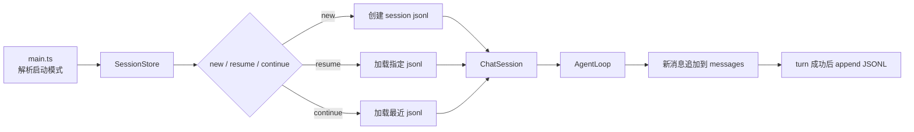
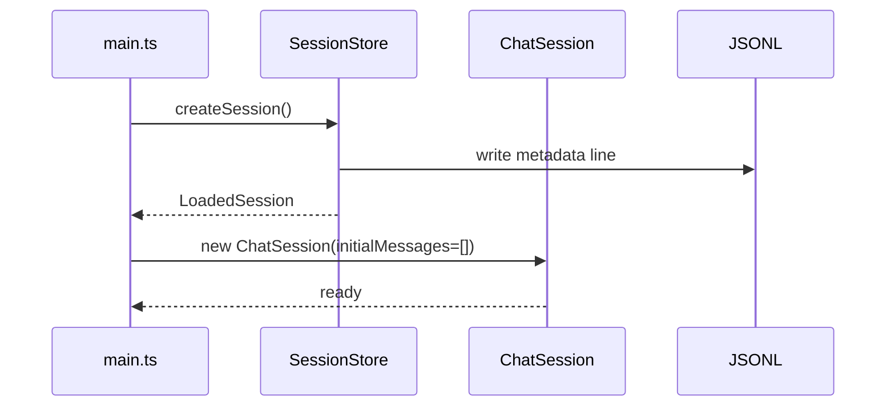
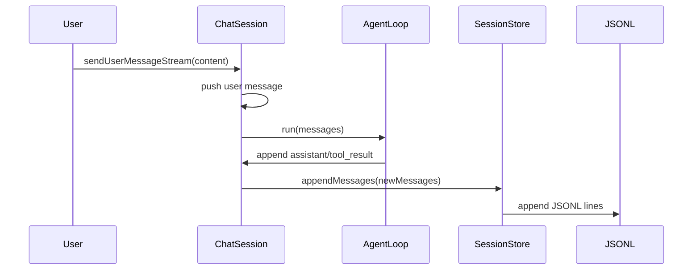
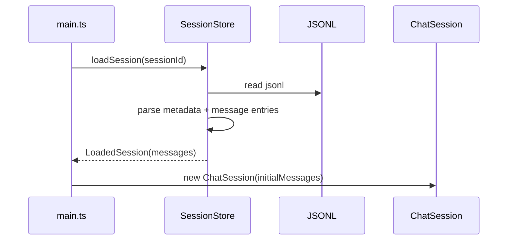

# 第 12 章：实现 Session 管理

## 本章目标

这一章要让 Claude Code Mini 具备会话持久化和恢复能力。

第 11 章解决的是：

```text
一次运行过程中，发给模型的上下文不能无限增长。
```

但还有一个更基础的问题：

```text
程序退出之后，之前的对话去哪了？
```

如果没有 Session 管理，Mini 每次启动都是全新上下文。

这会导致几个明显缺陷：

- 用户不能恢复上一次任务。
- 工具调用历史无法追踪。
- Agent 修改过什么文件只能靠终端滚动回看。
- Context Manager 只能管理内存，无法服务跨进程恢复。
- 后续 Planner、Memory、Sandbox 都没有会话归属。

真实 Claude Code 会把每次会话写成 transcript。

本章要实现一个 Mini 版本：

1. 为每次运行生成 `sessionId`。
2. 把对话消息追加写入 JSONL 文件。
3. 支持列出当前项目历史会话。
4. 支持通过 sessionId 恢复会话。
5. 支持继续当前项目最近一次会话。

完成后，Mini 可以做到：

```text
退出程序 -> 再启动 -> 恢复上一段对话 -> 继续让模型使用历史上下文
```

---

## 本章完成效果

第一次启动：

```bash
bun run dev
```

输入：

```text
> 记住：这个项目的代号是 orange-12
```

退出后，列出会话：

```bash
bun run dev -- --list-sessions
```

你会看到类似输出：

```text
Session ID                            Updated At                 Messages  First Prompt
7db56d92-437b-4cf5-8b16-08bcb2a88a4d  2026-05-26T12:30:10.000Z  2         记住：这个项目的代号是 orange-12
```

恢复指定会话：

```bash
bun run dev -- --resume 7db56d92-437b-4cf5-8b16-08bcb2a88a4d
```

继续提问：

```text
> 项目代号是什么？
```

模型应该能根据恢复出来的历史回答：

```text
项目代号是 orange-12。
```

也可以直接继续最近会话：

```bash
bun run dev -- --continue
```

启动时会显示：

```text
[session] resumed 7db56d92-437b-4cf5-8b16-08bcb2a88a4d
```

新会话会显示：

```text
[session] started 9d4c4d20-5f58-4c8b-b754-b103b911b5fd
```

---

## 本章项目结构变化

本章新增 `session` 模块，并改造 ChatSession 启动参数：

```bash
src/
  session/
    types.ts        # 新增：Session 元数据、JSONL entry 类型
    store.ts        # 新增：创建、追加、加载、列出会话
    index.ts        # 新增：导出 session 模块
  chat/
    toolInputFormatter.ts # 第 7 章已有：压缩 tool input 展示，并输出参数生成进度
    session.ts      # 修改：接收 initialMessages，成功 turn 后落盘
    chatLoop.ts     # 修改：启动时展示 session 信息
  main.ts           # 修改：增加 --list-sessions / --resume / --continue / --session
```

本章不需要新增依赖。

继续使用 Bun：

```bash
bun run typecheck
```

会话文件默认写到：

```text
~/.claude-code-mini/projects/<sanitized-cwd>/<sessionId>.jsonl
```

也可以通过环境变量改位置：

```bash
CCMINI_HOME=/tmp/ccmini bun run dev
```

---

## 为什么需要这个模块

一个 Coding Agent 的“会话”不只是聊天记录。

它至少承担四个职责。

第一，恢复上下文。

用户昨天让 Agent 读过文件、修改过代码、解释过方案。

今天继续时，Agent 需要知道这些历史。

第二，审计行为。

会话文件记录了：

- 用户说了什么。
- 模型回答了什么。
- 模型调用了什么工具。
- 工具返回了什么结果。

这对调试 Coding Agent 非常重要。

第三，支撑后续能力。

Planner、Memory、任务恢复、Sandbox 记录都需要挂到某个 session 上。

如果没有稳定 sessionId，后续模块只能散落在临时状态里。

第四，避免内存状态成为唯一事实来源。

第 11 章保留了完整内存历史：

```text
ChatSession.messages
```

但内存只在当前进程里存在。

Session 管理要把关键历史写到磁盘：

```text
transcript jsonl
```

这样程序退出后仍然可以恢复。

---

## 整体架构

本章新增一层 SessionStore：



磁盘上的 session 文件是 append-only JSONL：

```jsonl
{"type":"metadata","metadata":{"sessionId":"...","cwd":"/repo","createdAt":"...","version":"mini"}}
{"type":"message","sessionId":"...","timestamp":"...","message":{"role":"user","content":"hello"}}
{"type":"message","sessionId":"...","timestamp":"...","message":{"role":"assistant","content":[{"type":"text","text":"Hi"}]}}
```

为什么用 JSONL，而不是一个大 JSON 文件？

因为会话是持续增长的日志。

JSONL 有几个优势：

- 追加写简单。
- 程序崩溃时更容易保留已写内容。
- 大文件不需要每次整体读写。
- 后续可以按行扫描、截断、索引。

真实 Claude Code 也使用 JSONL transcript。

Mini 本章先做线性 transcript。

真实实现里还有 parentUuid 链、sidechain、metadata、compact boundary、大文件优化。

这些会在本章后面的源码分析里拆开说明。

---

## 核心流程

### 新会话



### 成功对话后落盘



本章 Mini 选择：

```text
一整轮成功后再写入本轮新增消息。
```

真实 Claude Code 会更激进：

```text
用户消息被接受后先写 transcript。
```

这样即使进程在模型响应中间崩溃，也能恢复到“用户刚发了这句话”的状态。

Mini 第一版先不处理 mid-turn crash recovery。

这样实现更简单，也不会出现内存回滚但磁盘已有半轮记录的教学复杂度。

### 恢复会话



恢复后，`ChatSession.messages` 不是空数组。

它从磁盘加载：

```ts
private readonly messages: ChatMessage[] = [...initialMessages];
```

后续新消息继续追加到同一个 session 文件。

---

## 完整核心代码

### src/session/types.ts

新增文件：

```ts
import type { ChatMessage } from "../llm/types";

export type SessionMetadata = {
  sessionId: string;
  cwd: string;
  createdAt: string;
  version: string;
};

export type SessionTranscriptEntry =
  | {
      type: "metadata";
      metadata: SessionMetadata;
    }
  | {
      type: "message";
      sessionId: string;
      timestamp: string;
      message: ChatMessage;
    };

export type LoadedSession = {
  metadata: SessionMetadata;
  messages: ChatMessage[];
  path: string;
};

export type SessionListItem = {
  sessionId: string;
  path: string;
  cwd: string;
  createdAt: string;
  updatedAt: string;
  messageCount: number;
  firstPrompt: string;
};
```

`SessionMetadata` 只放最基础信息。

本章不保存模型名、权限模式、Agent 模式等复杂 metadata。

后续需要时可以继续扩展 JSONL entry：

```ts
{ type: "mode", mode: "planner" }
{ type: "summary", summary: "..." }
{ type: "sandbox", policy: "readonly" }
```

append-only 日志天然适合这种演进。

### src/session/store.ts

新增文件：

```ts
import { randomUUID } from "node:crypto";
import {
  appendFile,
  mkdir,
  readdir,
  readFile,
  stat,
  writeFile,
} from "node:fs/promises";
import { homedir } from "node:os";
import { dirname, join } from "node:path";
import type { ChatMessage } from "../llm/types";
import type {
  LoadedSession,
  SessionListItem,
  SessionMetadata,
  SessionTranscriptEntry,
} from "./types";

const SESSION_FILE_EXTENSION = ".jsonl";
const MINI_VERSION = "mini";
const SESSION_ID_PATTERN = /^[a-zA-Z0-9._-]+$/;

export class SessionStore {
  constructor(
    private readonly cwd: string,
    private readonly homeDir = getMiniHomeDir(),
  ) {}

  async createSession(requestedSessionId?: string): Promise<LoadedSession> {
    const sessionId = requestedSessionId ?? randomUUID();
    assertValidSessionId(sessionId);

    const createdAt = new Date().toISOString();
    const path = this.getSessionPath(sessionId);

    const metadata: SessionMetadata = {
      sessionId,
      cwd: this.cwd,
      createdAt,
      version: MINI_VERSION,
    };

    const entry: SessionTranscriptEntry = {
      type: "metadata",
      metadata,
    };

    await mkdir(dirname(path), { recursive: true });
    await writeFile(path, `${JSON.stringify(entry)}\n`, {
      encoding: "utf8",
      flag: "wx",
      mode: 0o600,
    });

    return {
      metadata,
      messages: [],
      path,
    };
  }

  async appendMessages(
    sessionId: string,
    messages: readonly ChatMessage[],
  ): Promise<void> {
    assertValidSessionId(sessionId);

    if (messages.length === 0) {
      return;
    }

    const path = this.getSessionPath(sessionId);
    const now = new Date().toISOString();
    const lines = messages
      .map(
        message =>
          JSON.stringify({
            type: "message",
            sessionId,
            timestamp: now,
            message,
          } satisfies SessionTranscriptEntry) + "\n",
      )
      .join("");

    await appendFile(path, lines, {
      encoding: "utf8",
      mode: 0o600,
    });
  }

  async loadSession(sessionId: string): Promise<LoadedSession | null> {
    assertValidSessionId(sessionId);

    const path = this.getSessionPath(sessionId);

    try {
      const raw = await readFile(path, "utf8");
      return parseSessionTranscript(raw, path, sessionId, this.cwd);
    } catch (error) {
      if (isNotFound(error)) {
        return null;
      }

      throw error;
    }
  }

  async listSessions(): Promise<SessionListItem[]> {
    const dir = this.getProjectSessionsDir();

    let entries: string[];
    try {
      entries = await readdir(dir);
    } catch (error) {
      if (isNotFound(error)) {
        return [];
      }

      throw error;
    }

    const sessions: SessionListItem[] = [];

    for (const entry of entries) {
      if (!entry.endsWith(SESSION_FILE_EXTENSION)) {
        continue;
      }

      const sessionId = entry.slice(0, -SESSION_FILE_EXTENSION.length);
      const loaded = await this.loadSession(sessionId);

      if (!loaded) {
        continue;
      }

      const fileStat = await stat(loaded.path);
      sessions.push({
        sessionId,
        path: loaded.path,
        cwd: loaded.metadata.cwd,
        createdAt: loaded.metadata.createdAt,
        updatedAt: fileStat.mtime.toISOString(),
        messageCount: loaded.messages.length,
        firstPrompt: getFirstPrompt(loaded.messages),
      });
    }

    return sessions.sort(
      (a, b) =>
        new Date(b.updatedAt).getTime() - new Date(a.updatedAt).getTime(),
    );
  }

  async getLatestSession(): Promise<LoadedSession | null> {
    const [latest] = await this.listSessions();

    if (!latest) {
      return null;
    }

    return this.loadSession(latest.sessionId);
  }

  getSessionPath(sessionId: string): string {
    assertValidSessionId(sessionId);

    return join(
      this.getProjectSessionsDir(),
      `${sessionId}${SESSION_FILE_EXTENSION}`,
    );
  }

  private getProjectSessionsDir(): string {
    return join(this.homeDir, "projects", sanitizeProjectPath(this.cwd));
  }
}

function parseSessionTranscript(
  raw: string,
  path: string,
  fallbackSessionId: string,
  fallbackCwd: string,
): LoadedSession {
  let metadata: SessionMetadata | undefined;
  const messages: ChatMessage[] = [];
  const lines = raw.split(/\r?\n/);

  for (let index = 0; index < lines.length; index++) {
    const line = lines[index]?.trim();

    if (!line) {
      continue;
    }

    let entry: SessionTranscriptEntry;

    try {
      entry = JSON.parse(line) as SessionTranscriptEntry;
    } catch {
      throw new Error(`Invalid JSONL at ${path}:${index + 1}`);
    }

    if (entry.type === "metadata") {
      metadata = entry.metadata;
      continue;
    }

    if (entry.type === "message") {
      messages.push(entry.message);
    }
  }

  return {
    metadata:
      metadata ??
      {
        sessionId: fallbackSessionId,
        cwd: fallbackCwd,
        createdAt: new Date(0).toISOString(),
        version: MINI_VERSION,
      },
    messages,
    path,
  };
}

function getFirstPrompt(messages: readonly ChatMessage[]): string {
  const firstUserMessage = messages.find(
    message => message.role === "user" && typeof message.content === "string",
  );

  if (!firstUserMessage || typeof firstUserMessage.content !== "string") {
    return "";
  }

  const prompt = firstUserMessage.content.replace(/\s+/g, " ").trim();
  return prompt.length > 80 ? `${prompt.slice(0, 80).trim()}...` : prompt;
}

function sanitizeProjectPath(cwd: string): string {
  const sanitized = cwd
    .normalize("NFC")
    .replace(/[\\/]+/g, "-")
    .replace(/[^a-zA-Z0-9._-]/g, "-");

  return sanitized || "default";
}

function assertValidSessionId(sessionId: string): void {
  if (!SESSION_ID_PATTERN.test(sessionId)) {
    throw new Error(
      "Invalid session id. Use letters, numbers, dots, underscores, or dashes.",
    );
  }
}

function getMiniHomeDir(): string {
  return process.env.CCMINI_HOME ?? join(homedir(), ".claude-code-mini");
}

function isNotFound(error: unknown): boolean {
  return (
    typeof error === "object" &&
    error !== null &&
    "code" in error &&
    (error as { code?: string }).code === "ENOENT"
  );
}
```

这里有几个关键选择。

第一，`createSession()` 用 `flag: "wx"`。

这表示：

```text
只在文件不存在时创建。
```

如果用户手动指定了已经存在的 sessionId，新会话会失败，避免覆盖历史。

第二，`appendMessages()` 只追加，不重写。

```ts
appendFile(path, lines)
```

这是 transcript 的核心属性。

第三，`listSessions()` 第一版直接读取完整文件。

真实项目会对大 transcript 做轻量读取和索引。

Mini 暂时不需要。

等会话文件变得很大，再优化为只读头尾即可。

### src/session/index.ts

新增文件：

```ts
export { SessionStore } from "./store";
export type {
  LoadedSession,
  SessionListItem,
  SessionMetadata,
  SessionTranscriptEntry,
} from "./types";
```

### src/chat/session.ts

用下面版本替换第 11 章的 `src/chat/session.ts` 整个文件。

```ts
import { AgentLoop, type AgentLoopEvent } from "../agent";
import type { ChatMessage, LLMConfig } from "../llm/types";
import type { ToolRegistry } from "../tools";
import { ContextManager, createDefaultContextOptions } from "../context";
import type { LoadedSession, SessionStore } from "../session";

type ChatSessionOptions = {
  maxTurns: number;
  contextWindow: number;
  loadedSession: LoadedSession;
  sessionStore: SessionStore;
};

export type ChatSessionEvent = AgentLoopEvent;

export class ChatSession {
  private readonly messages: ChatMessage[];
  private readonly agentLoop: AgentLoop;

  constructor(
    config: LLMConfig,
    toolRegistry: ToolRegistry,
    private readonly options: ChatSessionOptions,
  ) {
    const contextManager = new ContextManager(
      createDefaultContextOptions(options.contextWindow),
    );

    this.messages = [...options.loadedSession.messages];
    this.agentLoop = new AgentLoop(config, toolRegistry, contextManager);
  }

  get sessionId(): string {
    return this.options.loadedSession.metadata.sessionId;
  }

  get transcriptPath(): string {
    return this.options.loadedSession.path;
  }

  get history(): readonly ChatMessage[] {
    return this.messages;
  }

  clear(): void {
    this.messages.length = 0;
  }

  async *sendUserMessageStream(
    content: string,
  ): AsyncGenerator<ChatSessionEvent, void> {
    const historyLengthBeforeTurn = this.messages.length;

    this.messages.push({
      role: "user",
      content,
    });

    try {
      yield* this.agentLoop.run(this.messages, {
        maxTurns: this.options.maxTurns,
      });

      await this.options.sessionStore.appendMessages(
        this.sessionId,
        this.messages.slice(historyLengthBeforeTurn),
      );
    } catch (error) {
      this.messages.length = historyLengthBeforeTurn;
      throw error;
    }
  }
}
```

注意落盘位置在 `sendUserMessageStream()` 里：

```ts
await this.options.sessionStore.appendMessages(
  this.sessionId,
  this.messages.slice(historyLengthBeforeTurn),
);
```

这一行只写入本轮新增消息。

如果本轮失败，则不会落盘。

`clear()` 这里仍然只清内存。

真实 Claude Code 的 `/clear` 会生成新 sessionId，并处理旧 transcript。

Mini 暂时先保持第 3 章的行为。

后续如果要让 `/clear` 也切换 session，可以新增：

```ts
await session.switchToNewSession()
```

### src/chat/chatLoop.ts

用下面版本替换第 11 章的 `src/chat/chatLoop.ts` 整个文件。

```ts
import { stdin as input, stdout as output } from "node:process";
import { createInterface } from "node:readline/promises";
import { ChatSession } from "./session";
import type { LLMConfig, LLMResponse } from "../llm/types";
import type { ToolRegistry } from "../tools";
import type { LoadedSession, SessionStore } from "../session";
import {
  createToolInputProgress,
  finishToolInputProgress,
  formatToolInput,
  shouldPrintToolInputProgress,
  startToolInputProgress,
} from "./toolInputFormatter";

type ChatLoopOptions = {
  cwd: string;
  toolRegistry: ToolRegistry;
  maxTurns: number;
  contextWindow: number;
  loadedSession: LoadedSession;
  sessionStore: SessionStore;
  sessionStartMode: "new" | "resume" | "continue";
};

export async function runChatLoop(
  config: LLMConfig,
  options: ChatLoopOptions,
): Promise<void> {
  const session = new ChatSession(config, options.toolRegistry, {
    maxTurns: options.maxTurns,
    contextWindow: options.contextWindow,
    loadedSession: options.loadedSession,
    sessionStore: options.sessionStore,
  });
  const rl = createInterface({ input, output });

  console.log("Claude Code Mini");
  console.log(`model: ${config.model}`);
  console.log(`cwd: ${options.cwd}`);
  console.log(`max turns: ${options.maxTurns}`);
  console.log("");
  console.log("Type /exit to quit, /clear to reset conversation.");
  console.log("Type /tools to list tools, /tool <name> <json> to run one.");
  console.log("");

  printSessionBanner(options.sessionStartMode, session);

  try {
    while (true) {
      const rawInput = await rl.question("> ");
      const prompt = rawInput.trim();

      if (!prompt) {
        continue;
      }

      if (prompt === "/exit" || prompt === "/quit") {
        break;
      }

      if (prompt === "/clear") {
        session.clear();
        console.log("Conversation cleared.");
        continue;
      }

      if (prompt === "/tools") {
        printTools(options.toolRegistry);
        continue;
      }

      if (prompt.startsWith("/tool ")) {
        await runManualTool(prompt, options.toolRegistry);
        continue;
      }

      try {
        let finalResponse: LLMResponse | undefined;
        const toolInputProgress = createToolInputProgress();

        for await (const event of session.sendUserMessageStream(prompt)) {
          switch (event.type) {
            case "turn_start":
              console.log("");
              console.log(`[turn ${event.turn}]`);
              break;

            case "context_update":
              console.log(
                `[context] ${event.beforeTokens} -> ${event.afterTokens} tokens, compacted ${event.compactedToolResults} tool result(s), trimmed ${event.trimmedMessages} message(s)`,
              );
              break;

            case "text_delta":
              output.write(event.text);
              break;

            case "tool_use_start":
              console.log("");
              console.log("");
              console.log(`[tool_use] ${event.name}`);
              console.log("input: receiving...");
              startToolInputProgress(toolInputProgress, event.id);
              break;

            case "tool_input_delta":
              if (
                shouldPrintToolInputProgress(
                  toolInputProgress,
                  event.id,
                  event.inputJSONLength,
                )
              ) {
                console.log(`input: receiving ${event.inputJSONLength} chars...`);
              }
              break;

            case "tool_use":
              console.log(`input: ${formatToolInput(event.toolUse.input)}`);
              finishToolInputProgress(toolInputProgress);
              break;

            case "turn_complete":
              if (event.toolUseCount > 0) {
                console.log(`[turn ${event.turn}] tool calls: ${event.toolUseCount}`);
              }
              break;

            case "tool_start":
              console.log(`[tool_start] ${event.toolUse.name}`);
              break;

            case "tool_result":
              console.log(
                `[tool_result] ${event.toolUse.name} ${
                  event.result.is_error ? "error" : "ok"
                }`,
              );
              printDiff(event.rawResult?.diff);
              console.log("");
              break;

            case "max_turns_reached":
              console.log(`[max_turns] stopped after ${event.maxTurns} turns`);
              break;

            case "message_stop":
              finalResponse = event.response;
              break;
          }
        }

        console.log("");

        if (finalResponse) {
          console.log("");
          console.log(
            `tokens: ${finalResponse.inputTokens} input / ${finalResponse.outputTokens} output`,
          );
        }
      } catch (error) {
        const message = error instanceof Error ? error.message : String(error);
        console.error(`Error: ${message}`);
      }
    }
  } finally {
    rl.close();
  }
}

function printSessionBanner(
  mode: "new" | "resume" | "continue",
  session: ChatSession,
): void {
  const action =
    mode === "new" ? "started" : mode === "resume" ? "resumed" : "continued";

  console.log(`[session] ${action} ${session.sessionId}`);
  console.log(`[transcript] ${session.transcriptPath}`);

  if (session.history.length > 0) {
    console.log(`[history] restored ${session.history.length} message(s)`);
  }
}

function printTools(toolRegistry: ToolRegistry): void {
  for (const tool of toolRegistry.list()) {
    console.log(`- ${tool.name}: ${tool.description}`);
  }
}

async function runManualTool(
  prompt: string,
  toolRegistry: ToolRegistry,
): Promise<void> {
  const { name, input } = parseToolCommand(prompt);
  const result = await toolRegistry.execute(name, input);

  console.log(result.content);
  printDiff(result.diff);

  if (result.metadata) {
    console.log(JSON.stringify(result.metadata, null, 2));
  }
}

function parseToolCommand(prompt: string): { name: string; input: unknown } {
  const rest = prompt.slice("/tool ".length).trim();
  const firstSpaceIndex = rest.indexOf(" ");

  if (firstSpaceIndex === -1) {
    return {
      name: rest,
      input: {},
    };
  }

  const name = rest.slice(0, firstSpaceIndex).trim();
  const json = rest.slice(firstSpaceIndex + 1).trim();

  return {
    name,
    input: json ? JSON.parse(json) : {},
  };
}

function printDiff(diff: string | undefined): void {
  if (!diff) {
    return;
  }

  console.log(diff);
}
```

恢复会话时，用户应该明确看到：

```text
当前不是空会话。
```

否则很容易误以为 Mini 忘记上下文。

### src/main.ts

用下面版本替换第 11 章的 `src/main.ts` 整个文件。

注意函数名是 `runChatLoop`，不是 `startChatLoop`。

```ts
import { stdout } from "node:process";
import {
  Command as CommanderCommand,
  InvalidArgumentError,
} from "commander";
import { ChatSession } from "./chat/session";
import { runChatLoop } from "./chat/chatLoop";
import { loadLLMConfig } from "./llm/config";
import type { LLMConfig, LLMResponse } from "./llm/types";
import { CLI_NAME, PRODUCT_NAME, VERSION } from "./constants";
import {
  createDefaultToolRegistry,
  type ToolContext,
  type ToolRegistry,
} from "./tools";
import { SessionStore, type LoadedSession, type SessionListItem } from "./session";
import {
  createToolInputProgress,
  finishToolInputProgress,
  formatToolInput,
  shouldPrintToolInputProgress,
  startToolInputProgress,
} from "./chat/toolInputFormatter";

type RootOptions = {
  contextWindow: number;
  print?: boolean;
  cwd: string;
  model?: string;
  maxTurns: number;
  session?: string;
  resume?: string;
  continue?: boolean;
  listSessions?: boolean;
};

type SessionStartMode = "new" | "resume" | "continue";

type ResolvedStartupSession = {
  mode: SessionStartMode;
  loadedSession: LoadedSession;
};

const DEFAULT_CONTEXT_WINDOW = 32_000;

export async function main(argv = process.argv): Promise<CommanderCommand> {
  const program = new CommanderCommand();

  program
    .name(CLI_NAME)
    .description(
      `${PRODUCT_NAME} - starts a coding-agent session by default, use -p/--print for non-interactive output`,
    )
    .argument("[prompt...]", "Your prompt")
    .helpOption("-h, --help", "Display help for command")
    .option(
      "-p, --print",
      "Print response and exit. This will become the headless mode in later chapters.",
      false,
    )
    .option("--cwd <path>", "Working directory for the session", process.cwd())
    .option("--model <model>", "Override the model for this request")
    .option(
      "--max-turns <number>",
      "Maximum model/tool iterations per user prompt",
      parsePositiveInteger,
      8,
    )
    .option(
      "--context-window <tokens>",
      "Estimated input context window for Claude Code Mini.",
      parsePositiveInteger,
      DEFAULT_CONTEXT_WINDOW,
    )
    .option("--session <id>", "Use a specific session id for a new session.")
    .option("--resume <id>", "Resume a session by id.")
    .option("--continue", "Continue the most recent session in the current project.")
    .option("--list-sessions", "List sessions for the current project.")
    .version(`${VERSION} (${PRODUCT_NAME})`, "-v, --version", "Output the version number")
    .action(async (promptParts: string[] | undefined, options: RootOptions) => {
      await handlePrompt(promptParts ?? [], options);
    });

  await program.parseAsync(argv);
  return program;
}

async function handlePrompt(
  promptParts: string[],
  options: RootOptions,
): Promise<void> {
  const prompt = promptParts.join(" ").trim();

  try {
    const config = loadLLMConfig();
    if (options.model) {
      config.model = options.model;
    }

    const sessionStore = new SessionStore(options.cwd);

    if (options.listSessions) {
      printSessionList(await sessionStore.listSessions());
      return;
    }

    const startupSession = await resolveStartupSession(sessionStore, {
      session: options.session,
      resume: options.resume,
      continue: options.continue,
    });

    const toolRegistry = createSessionToolRegistry(options.cwd);

    if (prompt) {
      const session = new ChatSession(config, toolRegistry, {
        maxTurns: options.maxTurns,
        contextWindow: options.contextWindow,
        loadedSession: startupSession.loadedSession,
        sessionStore,
      });

      await runSinglePrompt(session, prompt, options);
      return;
    }

    if (options.print) {
      console.error("Error: -p/--print requires a prompt.");
      process.exitCode = 1;
      return;
    }

    if (!process.stdin.isTTY) {
      console.error("Error: interactive mode requires a TTY. Pass a prompt or use -p.");
      process.exitCode = 1;
      return;
    }

    await runChatLoop(config, {
      cwd: options.cwd,
      toolRegistry,
      maxTurns: options.maxTurns,
      contextWindow: options.contextWindow,
      loadedSession: startupSession.loadedSession,
      sessionStore,
      sessionStartMode: startupSession.mode,
    });
  } catch (error) {
    const message = error instanceof Error ? error.message : String(error);
    console.error(`Error: ${message}`);
    process.exitCode = 1;
  }
}

async function runSinglePrompt(
  session: ChatSession,
  prompt: string,
  options: RootOptions,
): Promise<void> {
  let finalResponse: LLMResponse | undefined;
  const toolInputProgress = createToolInputProgress();

  for await (const event of session.sendUserMessageStream(prompt)) {
    switch (event.type) {
      case "turn_start":
        console.log("");
        console.log(`[turn ${event.turn}]`);
        break;

      case "context_update":
        console.log(
          `[context] ${event.beforeTokens} -> ${event.afterTokens} tokens, compacted ${event.compactedToolResults} tool result(s), trimmed ${event.trimmedMessages} message(s)`,
        );
        break;

      case "text_delta":
        stdout.write(event.text);
        break;

      case "tool_use_start":
        console.log("");
        console.log(`[tool_use] ${event.name}`);
        console.log("input: receiving...");
        startToolInputProgress(toolInputProgress, event.id);
        break;

      case "tool_input_delta":
        if (
          shouldPrintToolInputProgress(
            toolInputProgress,
            event.id,
            event.inputJSONLength,
          )
        ) {
          console.log(`input: receiving ${event.inputJSONLength} chars...`);
        }
        break;

      case "tool_use":
        console.log(`input: ${formatToolInput(event.toolUse.input)}`);
        finishToolInputProgress(toolInputProgress);
        break;

      case "turn_complete":
        if (event.toolUseCount > 0) {
          console.log(`[turn ${event.turn}] tool calls: ${event.toolUseCount}`);
        }
        break;

      case "tool_start":
        console.log(`[tool_start] ${event.toolUse.name}`);
        break;

      case "tool_result":
        console.log(
          `[tool_result] ${event.toolUse.name} ${
            event.result.is_error ? "error" : "ok"
          }`,
        );
        printDiff(event.rawResult?.diff);
        break;

      case "max_turns_reached":
        console.log(`[max_turns] stopped after ${event.maxTurns} turns`);
        break;

      case "message_stop":
        finalResponse = event.response;
        break;
    }
  }

  console.log("");

  if (!options.print && finalResponse) {
    console.log("");
    console.log(`model: ${finalResponse.model}`);
    console.log(
      `tokens: ${finalResponse.inputTokens} input / ${finalResponse.outputTokens} output`,
    );
    console.log(`cwd: ${options.cwd}`);
    console.log(`max turns: ${options.maxTurns}`);
  }
}

function createSessionToolRegistry(cwd: string): ToolRegistry {
  const readFileState: ToolContext["readFileState"] = new Map();

  return createDefaultToolRegistry({
    cwd,
    readFileState,
  });
}

function parsePositiveInteger(value: string): number {
  const parsed = Number.parseInt(value, 10);

  if (!Number.isInteger(parsed) || parsed < 1) {
    throw new InvalidArgumentError("Expected a positive integer.");
  }

  return parsed;
}

function printDiff(diff: string | undefined): void {
  if (!diff) {
    return;
  }

  console.log(diff);
}

async function resolveStartupSession(
  sessionStore: SessionStore,
  options: {
    session?: string;
    resume?: string;
    continue?: boolean;
  },
): Promise<ResolvedStartupSession> {
  if (options.resume && options.continue) {
    throw new Error("Use either --resume or --continue, not both.");
  }

  if (options.session && (options.resume || options.continue)) {
    throw new Error("--session can only be used when starting a new session.");
  }

  if (options.resume) {
    const loadedSession = await sessionStore.loadSession(options.resume);

    if (!loadedSession) {
      throw new Error(`Session not found: ${options.resume}`);
    }

    return {
      mode: "resume",
      loadedSession,
    };
  }

  if (options.continue) {
    const loadedSession = await sessionStore.getLatestSession();

    if (!loadedSession) {
      throw new Error("No session found to continue.");
    }

    return {
      mode: "continue",
      loadedSession,
    };
  }

  return {
    mode: "new",
    loadedSession: await sessionStore.createSession(options.session),
  };
}

function printSessionList(sessions: readonly SessionListItem[]): void {
  if (sessions.length === 0) {
    console.log("No sessions found.");
    return;
  }

  console.log("Session ID                            Updated At                 Messages  First Prompt");

  for (const session of sessions) {
    console.log(
      `${session.sessionId.padEnd(36)}  ${session.updatedAt.padEnd(24)}  ${String(
        session.messageCount,
      ).padStart(8)}  ${session.firstPrompt}`,
    );
  }
}
```

原因是：

```text
交互模式和单次 prompt 都应该走同一套落盘逻辑。
```

否则会出现：

- 交互模式可恢复。
- 单次 prompt 不可恢复。

这种行为不符合用户预期。

---

## 逐步实现

### 1. 新增 `src/session/`

创建目录：

```bash
mkdir -p src/session
```

新增：

```bash
src/session/types.ts
src/session/store.ts
src/session/index.ts
```

这一层不要依赖 `chat/`。

`SessionStore` 只负责磁盘读写。

它不知道模型、工具、Agent Loop。

### 2. 设计 JSONL entry

第一版只需要两种 entry：

```ts
metadata
message
```

示例：

```jsonl
{"type":"metadata","metadata":{"sessionId":"...","cwd":"/repo","createdAt":"...","version":"mini"}}
{"type":"message","sessionId":"...","timestamp":"...","message":{"role":"user","content":"hello"}}
```

不要一开始就做复杂 schema。

先满足：

- 能写。
- 能读。
- 能恢复 messages。
- 能列出会话。

### 3. 按项目隔离会话

会话路径使用：

```text
~/.claude-code-mini/projects/<sanitized-cwd>/
```

而不是直接写到项目目录。

原因：

- 不污染用户仓库。
- 不把 transcript 误提交到 Git。
- 不暴露工具结果、文件内容、用户输入。

同时按 cwd 隔离可以让：

```bash
bun run dev -- --continue
```

只继续当前项目最近会话。

这和真实 Claude Code 的 `projects/<sanitized-project-path>/` 思路一致。

### 4. 创建新会话

新会话只写一行 metadata：

```ts
await writeFile(path, `${JSON.stringify(entry)}\n`, {
  flag: "wx",
});
```

如果没有用户消息，不应该出现很多空消息。

metadata 行足够说明这个 session 存在。

如果你想更接近真实实现，也可以延迟到第一条 user / assistant 消息出现时再创建文件。

真实仓库里有类似 `materializeSessionFile()` 的设计：

```text
启动 metadata 先缓存，第一条真实消息到来时再落盘。
```

Mini 为了教学直观，启动时就创建文件。

### 5. 成功 turn 后追加消息

`ChatSession.sendUserMessageStream()` 里已经知道本轮开始前的长度：

```ts
const historyLengthBeforeTurn = this.messages.length;
```

本轮结束后新增消息就是：

```ts
this.messages.slice(historyLengthBeforeTurn)
```

写它即可。

不要每次把完整 history 重写到文件。

那会导致：

- 大会话越来越慢。
- 崩溃时文件更容易损坏。
- 后续做并发写很难。

### 6. 加载会话

加载逻辑很直接：

```ts
const raw = await readFile(path, "utf8");
const lines = raw.split(/\r?\n/);
```

逐行解析：

```ts
if (entry.type === "metadata") metadata = entry.metadata;
if (entry.type === "message") messages.push(entry.message);
```

恢复到 `ChatSession` 时：

```ts
this.messages = [...options.loadedSession.messages];
```

这里必须复制一份数组。

不要直接引用 `LoadedSession.messages`。

ChatSession 后续会原地 push 新消息。

### 7. 列出会话

`--list-sessions` 只列当前项目。

第一版输出：

```text
Session ID
Updated At
Messages
First Prompt
```

`updatedAt` 用文件 mtime。

`firstPrompt` 从第一条普通 user message 中提取。

工具结果也是 user message，但 content 是数组。

所以提取条件应该是：

```ts
message.role === "user" && typeof message.content === "string"
```

### 8. 支持 `--resume`

`--resume <id>` 只做一件事：

```text
加载指定 sessionId 的 JSONL。
```

如果不存在，明确报错：

```text
Session not found: <id>
```

不要静默创建新会话。

恢复失败时偷偷新建，会让用户以为历史丢了。

### 9. 支持 `--continue`

`--continue` 是：

```text
加载当前项目最近修改的 session。
```

它不需要用户记住 sessionId。

实现上就是：

```ts
const [latest] = await listSessions()
```

如果没有历史，报错：

```text
No session found to continue.
```

### 10. 支持 `--session`

`--session <id>` 用于新会话指定 ID。

它不能和 `--resume` / `--continue` 同时用。

常见用途是测试：

```bash
bun run dev -- --session test-session-001
```

但生产里建议默认用 `randomUUID()`。

---

## 关键源码分析

真实仓库的 Session 管理主要分布在几个位置。

### 1. `src/bootstrap/state.ts`

真实项目在进程级状态里维护当前 sessionId：

```ts
getSessionId()
switchSession(sessionId, projectDir)
regenerateSessionId()
```

这说明 sessionId 是全局运行状态的一部分。

很多模块都会读取它：

- transcript 写入。
- hooks。
- analytics。
- tool result storage。
- image store。
- session title。

Mini 本章没有做全局 bootstrap state。

但 `ChatSession.sessionId` 已经承担了同样角色。

后续模块如果越来越多，可以再抽到 `bootstrap/sessionState.ts`。

### 2. `src/utils/sessionStorage.ts`

这是真实 transcript 写入和读取的核心。

几个关键点：

```ts
getProjectsDir()
getProjectDir(cwd)
getTranscriptPath()
recordTranscript(messages)
loadTranscriptFile(path)
buildConversationChain(messages, leaf)
loadMessageLogs()
getLastSessionLog(sessionId)
```

真实路径形态类似：

```text
~/.claude/projects/<sanitized-project-path>/<sessionId>.jsonl
```

Mini 本章使用：

```text
~/.claude-code-mini/projects/<sanitized-cwd>/<sessionId>.jsonl
```

思路一致。

### 3. append-only JSONL

真实仓库不是把整个会话存成一个大 JSON。

它不断 append entry：

```text
user message
assistant message
metadata
summary
file-history-snapshot
content-replacement
```

这样做的好处是：

- 写入成本低。
- 易于追加新 entry 类型。
- 崩溃时更容易恢复。
- 可以在读侧做优化。

Mini 本章采用同样方向，但只保留：

```text
metadata
message
```

### 4. parentUuid 链

真实 transcript 里的消息不是简单数组。

每条消息会带：

```ts
uuid
parentUuid
```

恢复时通过：

```ts
buildConversationChain()
```

从最新 leaf 反向追溯出一条主链。

为什么需要这个？

因为真实系统有：

- compaction。
- sidechain。
- subagent。
- 并行 tool use。
- resume fork。
- tombstone。

Mini 当前没有这些复杂分支，所以线性 JSONL 足够。

但你要理解：

```text
线性数组是教学版，parentUuid 链是生产版。
```

### 5. `src/utils/conversationRecovery.ts`

真实恢复入口集中在：

```ts
loadConversationForResume()
```

它支持多种来源：

- `undefined`：继续最近会话。
- `sessionId`：恢复指定会话。
- `LogOption`：从选择器恢复。
- `.jsonl` 文件路径：从 transcript 文件恢复。

它还会做清理：

- 过滤未完成 tool_use。
- 过滤孤立 thinking / redacted_thinking。
- 处理最后一条 user message。
- 恢复 skill 状态。
- 执行 resume hooks。

Mini 本章只做最基础的 load。

但 CLI 形状已经对齐：

```bash
bun run dev -- --resume <id>
bun run dev -- --continue
```

### 6. `src/utils/sessionRestore.ts`

真实恢复不是只恢复 messages。

还要恢复很多伴随状态：

- file history。
- attribution。
- todos。
- agent setting。
- worktree。
- content replacement。
- cost。

这也是为什么 Session 管理必须尽早做。

因为后续模块都需要挂靠 session。

Mini 后续做 Planner 时，可以把计划状态写成新的 JSONL entry：

```ts
{ type: "plan", sessionId, plan }
```

做 Sandbox 时也可以记录：

```ts
{ type: "sandbox-run", sessionId, command, exitCode }
```

### 7. `src/main.tsx`

真实 CLI 已经有这些参数：

```text
--continue
--resume [value]
--fork-session
--session-id <uuid>
--no-session-persistence
```

Mini 本章实现其中最核心的三个：

```text
--continue
--resume <id>
--session <id>
```

暂时不做：

- fork session。
- resume picker。
- no-session-persistence。
- resume by transcript path。
- cross-project resume。

先把主路径跑通。

---

## 调试与验证

### 1. 类型检查

先跑：

```bash
bun run typecheck
```

常见类型问题：

- `SessionTranscriptEntry` 联合类型没有收窄。
- `options.continue` 属性名被误写。
- `LoadedSession.messages` 没有复制，后续被意外共享。
- `ChatSessionOptions` 调用方没有传完整。

### 2. 新建会话

启动：

```bash
bun run dev
```

输入：

```text
> 记住：这个项目的代号是 orange-12
```

确认终端显示：

```text
[session] started <uuid>
[transcript] /Users/you/.claude-code-mini/projects/.../<uuid>.jsonl
```

### 3. 查看 JSONL 文件

复制终端里的 transcript 路径，然后查看：

```bash
bun -e 'const path = process.argv[2]; console.log(await Bun.file(path).text())' -- /path/to/session.jsonl
```

你应该能看到：

```jsonl
{"type":"metadata",...}
{"type":"message",...}
{"type":"message",...}
```

不要用编辑器手动改这个文件。

调试时只读即可。

### 4. 列出会话

```bash
bun run dev -- --list-sessions
```

应该看到刚才的 sessionId。

如果没有，检查：

- `CCMINI_HOME` 是否变了。
- 当前 cwd 是否变了。
- `appendMessages()` 是否在 turn 成功后执行。

### 5. 恢复指定会话

```bash
bun run dev -- --resume <session-id>
```

然后输入：

```text
> 项目代号是什么？
```

如果模型回答不出来，检查：

- `loadSession()` 是否读到了 message entries。
- `ChatSession` 是否用 `initialMessages` 初始化。
- 第 11 章的 `ContextManager.prepare()` 是否把历史裁掉了。

调试时可以临时把 `--context-window` 调大：

```bash
bun run dev -- --resume <session-id> --context-window 32000
```

### 6. 继续最近会话

```bash
bun run dev -- --continue
```

这应该加载当前项目最新的 session。

如果你切换到了另一个目录，它不会看到原项目的 session。

这是预期行为。

### 7. 指定 sessionId

```bash
bun run dev -- --session test-session-001
```

如果再次执行同样命令，应该失败。

因为 `writeFile(..., { flag: "wx" })` 不允许覆盖已有文件。

这能防止误删 transcript。

---

## 常见问题

### 1. 为什么不把会话存在项目目录里

因为 transcript 可能包含：

- 用户输入。
- 文件内容。
- shell 输出。
- diff。
- 错误日志。

这些内容不应该默认进入 Git 工作区。

放到用户 home 下的应用目录更安全。

### 2. 为什么用 JSONL

JSONL 适合日志。

会话是持续追加的事件流，不是一次性配置文件。

相比单个 JSON 数组，JSONL 更适合：

- append。
- streaming write。
- 局部读取。
- 损坏恢复。
- 后续建立索引。

### 3. 为什么不每次重写完整 history

因为 history 会越来越大。

重写完整文件会让每轮对话越来越慢。

而且如果写到一半崩溃，整个文件更容易损坏。

append-only 是更稳的默认选择。

### 4. 为什么本章不写 parentUuid

Mini 当前还没有分支会话。

线性 transcript 足够恢复：

```text
user -> assistant -> tool_result -> assistant
```

parentUuid 主要服务生产级场景：

- 并行工具调用。
- compaction 后的链路截断。
- subagent sidechain。
- resume fork。
- tombstone。

等 Mini 做到 Multi Agent 或复杂 compaction 时，再引入也不晚。

### 5. 为什么 turn 成功后才写入

这是教学版的简化。

好处是：

- 内存 history 和磁盘 transcript 始终一致。
- 出错回滚简单。
- 容易理解和测试。

真实 Claude Code 会更早写用户消息，以便崩溃后恢复未完成请求。

那需要额外处理：

- 最后一条 user message 没有 assistant 响应。
- 未完成 tool_use。
- 中断后自动继续。

本章暂时不引入这些复杂度。

### 6. 为什么恢复后还会触发 Context Manager

恢复只是把历史读回内存。

请求模型前仍然要走第 11 章的预算处理。

否则一个很长的历史会话恢复后，下一次请求可能直接超出模型窗口。

所以链路应该是：

```text
load transcript -> messages -> ContextManager.prepare() -> model
```

### 7. 如果 JSONL 有一行损坏怎么办

本章选择直接报错：

```text
Invalid JSONL at path:line
```

教学阶段这样更容易定位问题。

生产系统可以更宽容：

- 跳过损坏行。
- 截断到最后一条合法记录。
- 做备份恢复。

### 8. `--continue` 为什么只看当前项目

不同项目的上下文不能混用。

如果在项目 A 里继续项目 B 的会话，模型会引用错误文件路径。

真实 Claude Code 也按项目目录组织 transcript。

### 9. 能不能从任意 `.jsonl` 路径恢复

可以做，但本章不做。

生产级工具通常支持：

```bash
claude --resume /path/to/transcript.jsonl
```

Mini 先只支持 sessionId。

这样路径规则和错误处理更简单。

### 10. `/clear` 应该怎么处理

当前 `/clear` 仍然只清内存。

更完整的做法是：

```text
清空当前上下文，并切换到新 sessionId。
```

也可以保留旧 session 文件，并在新文件里写一条 metadata。

本章暂时不改 `/clear`，避免把多个概念混在一起。

---

## 本章小结

这一章让 Claude Code Mini 具备了基础 Session 管理能力。

当前系统新增了：

- `SessionStore`。
- JSONL transcript。
- sessionId。
- 当前项目会话目录。
- `--list-sessions`。
- `--resume <id>`。
- `--continue`。
- `--session <id>`。
- 恢复历史 messages 后继续 Agent Loop。

现在 Mini 的运行模型变成：

```text
启动
  -> 解析 session 模式
  -> 创建或加载 transcript
  -> ChatSession 从 initialMessages 初始化
  -> 每轮成功后 append 新消息
  -> 下次可恢复
```

到这里，Mini 已经有了 Coding Agent 的三块核心底座：

- Agent Loop：能让模型和工具自动循环。
- Context Manager：能控制发给模型的上下文。
- Session Store：能把会话保存并恢复。

下一章会进入 Planner。

第 12 章解决的是：

```text
历史对话如何跨进程保存和恢复。
```

第 13 章要解决的是：

```text
复杂任务如何拆解、跟踪、更新和执行。
```
