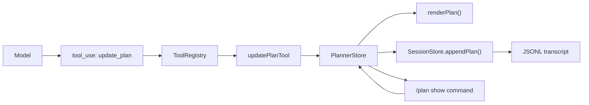
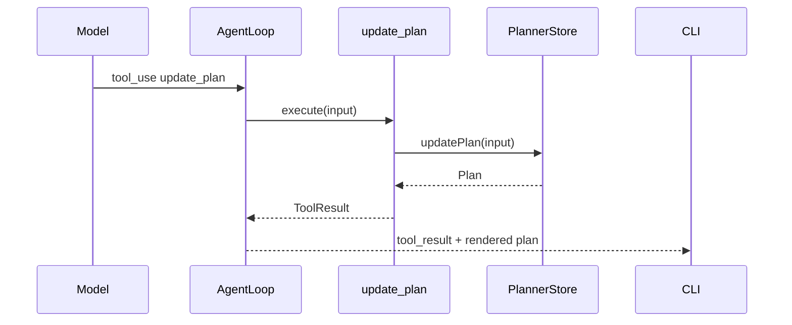
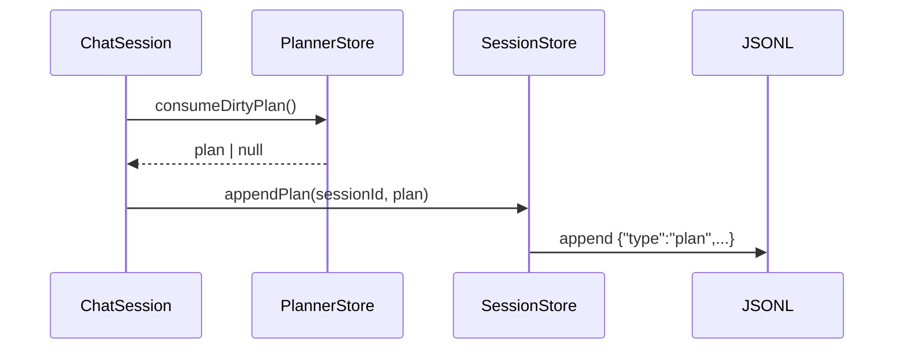
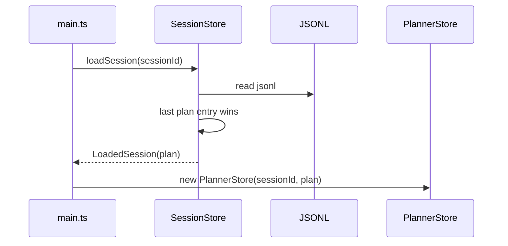

# 第 13 章：实现 Planner

## 本章目标

这一章要让 Claude Code Mini 具备结构化计划和进度追踪能力。

第 12 章之后，Mini 已经可以把会话保存到 JSONL，并通过 sessionId 恢复：

```text
启动 -> 加载 transcript -> 恢复 messages -> 继续 Agent Loop
```

但面对复杂任务时，Mini 仍然缺少一个关键能力：

```text
它不知道自己正在执行哪一步，也不会稳定地维护任务清单。
```

真实 Coding Agent 在复杂任务中不能只靠自然语言记忆。

它需要一个结构化 Planner：

- 把复杂需求拆成可执行步骤。
- 标记当前正在做哪一步。
- 完成一步后立刻更新状态。
- 把计划状态展示给用户。
- 把计划状态写入 session，恢复会话后继续可见。

本章要实现 Mini 版 Planner，并让 `/plan` 更接近真实 Claude Code 的语义。

真实 Claude Code 里，`/plan` 不是“查看计划”的普通命令。

它的核心语义是：

```text
进入 plan mode
```

只有已经处于 plan mode 时，`/plan` 才会展示当前计划。

本章实现一个简化版 plan mode：

```text
update_plan tool + /plan 进入计划模式 + /plan show 查看计划 + session 持久化
```

完成后，模型可以在 Agent Loop 中主动调用 `update_plan`：

```text
pending -> in_progress -> completed
```

用户可以输入：

```text
> /plan
```

进入计划模式。

如果只是查看当前计划，使用：

```text
> /plan show
```

---

## 本章完成效果

启动：

```bash
bun run dev
```

输入 `/plan` 进入计划模式：

```text
> /plan
Enabled plan mode. Describe the task to plan.
```

再输入一个多步骤任务：

```text
> 读取 src/main.ts，说明它做了什么，然后把说明写入 tmp/main-summary.md，最后读取文件确认
```

模型应该先调用 `update_plan`，你会看到类似输出：

```text
[tool_use] update_plan
input: {
  "title": "Summarize src/main.ts",
  "items": [
    {
      "content": "Read src/main.ts",
      "activeForm": "Reading src/main.ts",
      "status": "in_progress"
    },
    {
      "content": "Write summary to tmp/main-summary.md",
      "activeForm": "Writing summary to tmp/main-summary.md",
      "status": "pending"
    },
    {
      "content": "Read tmp/main-summary.md to confirm",
      "activeForm": "Reading tmp/main-summary.md to confirm",
      "status": "pending"
    }
  ]
}

[plan]
● Reading src/main.ts
○ Write summary to tmp/main-summary.md
○ Read tmp/main-summary.md to confirm
```

当它完成第一步，会再次调用：

```text
[tool_use] update_plan
...
[plan]
✓ Read src/main.ts
● Writing summary to tmp/main-summary.md
○ Read tmp/main-summary.md to confirm
```

查看计划：

```text
> /plan show
```

输出：

```text
Plan: Summarize src/main.ts

✓ Read src/main.ts
● Writing summary to tmp/main-summary.md
○ Read tmp/main-summary.md to confirm
```

恢复会话后仍然可见：

```bash
bun run dev -- --continue
```

再输入：

```text
> /plan show
```

Mini 会从 session transcript 恢复最近一次计划状态。

---

## 本章项目结构变化

本章新增 `planner` 模块，并新增一个内置工具：

```bash
src/
  agent/
    loop.ts           # 修改：plan mode 下只暴露 read-only 工具和 update_plan
  planner/
    types.ts          # 新增：Plan / PlanItem 类型
    store.ts          # 新增：内存计划状态与 dirty 标记
    render.ts         # 新增：终端文本渲染
    index.ts          # 新增：导出 planner 模块
  tools/
    types.ts          # 修改：ToolContext 增加 planner
    builtin/
      updatePlan.ts   # 新增：update_plan 工具
    index.ts          # 修改：注册 update_plan
  session/
    types.ts          # 修改：JSONL 增加 plan entry
    store.ts          # 修改：appendPlan / load plan
  chat/
    toolInputFormatter.ts # 第 7 章已有：压缩 tool input 展示，并输出参数生成进度
    session.ts        # 修改：接收 PlannerStore，支持 plan mode prompt，成功 turn 后持久化 plan
    chatLoop.ts       # 修改：/plan 进入 plan mode，/plan show 渲染计划
  main.ts             # 修改：创建 PlannerStore，并传给 ToolRegistry / ChatSession
```

本章不安装新依赖。

继续使用项目里已有的 `zod` 和 Bun：

```bash
bun run typecheck
```

---

## 为什么需要这个模块

复杂任务失败，常见原因不是模型完全不会写代码。

更常见的是：

```text
模型忘了自己做到哪一步。
```

例如用户说：

```text
实现登录页，接接口，加校验，补测试，跑 build。
```

如果没有 Planner，模型可能会：

- 写完 UI 就忘了接口。
- 接完接口忘了测试。
- 跑了测试但没跑 build。
- 最后总结时说“已完成”，但其实缺一步。

Planner 的价值是把“隐含在自然语言里的任务状态”变成结构化数据。

```ts
[
  { content: "Build login form", status: "completed" },
  { content: "Connect login API", status: "in_progress" },
  { content: "Add validation", status: "pending" },
  { content: "Run tests", status: "pending" }
]
```

这会带来三个直接收益。

第一，模型自己更不容易漏步骤。

它每完成一步都要更新 plan。

第二，用户能看到进度。

用户不需要从一堆工具调用里猜 Agent 做到哪里。

第三，恢复会话后状态仍然存在。

第 12 章已经有 session transcript，本章把 plan 也写进去。

---

## 整体架构

本章 Planner 位于 Tool System 和 Session Store 之间：



一次任务中的状态流是：

```text
用户提出复杂任务
  -> 用户用 /plan 进入 plan mode
  -> 模型调用 update_plan 创建计划
  -> 模型只探索和规划，不写文件
  -> 每完成一步调用 update_plan 更新状态
  -> ChatSession turn 成功后把 plan 写入 session
  -> 用户可用 /plan show 查看
  -> 下次 --continue 恢复 plan
```

注意本章不实现完整审批流。

真实 Claude Code 的 plan mode 是：

```text
进入 plan mode
  -> 限制只能读文件和写 plan 文件
  -> 模型写计划
  -> ExitPlanMode 请求用户审批
  -> 用户批准后切回执行模式
```

Mini 本章先做：

```text
结构化计划 + 进度追踪 + 持久化
```

审批流会放到后续更完整的闭环章节里继续增强。

---

## 核心流程

### 1. 模型更新计划



### 2. 成功 turn 后持久化



### 3. 恢复会话时恢复计划



---

## 完整核心代码

### src/planner/types.ts

新增文件：

```ts
export type PlanItemStatus = "pending" | "in_progress" | "completed";

export type PlanItem = {
  content: string;
  activeForm: string;
  status: PlanItemStatus;
};

export type Plan = {
  sessionId: string;
  title: string;
  items: PlanItem[];
  createdAt: string;
  updatedAt: string;
};

export type UpdatePlanInput = {
  title?: string;
  items: PlanItem[];
};
```

这里刻意保持简单。

每个 item 只有三件事：

- `content`：任务内容，命令式。
- `activeForm`：执行中显示的文本。
- `status`：当前状态。

为什么需要 `activeForm`？

因为用户看到当前步骤时，展示：

```text
● Reading src/main.ts
```

比展示：

```text
● Read src/main.ts
```

更自然。

真实 `TodoWrite` 工具也要求同时提供 `content` 和 `activeForm`。

### src/planner/render.ts

新增文件：

```ts
import type { Plan, PlanItem } from "./types";

export function renderPlan(plan: Plan | null): string {
  if (!plan || plan.items.length === 0) {
    return "No active plan.";
  }

  const lines = [`Plan: ${plan.title}`, ""];

  for (const item of plan.items) {
    lines.push(renderPlanItem(item));
  }

  return lines.join("\n");
}

function renderPlanItem(item: PlanItem): string {
  switch (item.status) {
    case "pending":
      return `○ ${item.content}`;
    case "in_progress":
      return `● ${item.activeForm}`;
    case "completed":
      return `✓ ${item.content}`;
  }
}
```

这里用了三个符号：

```text
○ pending
● in_progress
✓ completed
```

终端里足够清晰。

如果你想保持纯 ASCII，也可以换成：

```text
[ ] pending
[*] in_progress
[x] completed
```

### src/planner/store.ts

新增文件：

```ts
import type { Plan, PlanItem, UpdatePlanInput } from "./types";

export class PlannerStore {
  private plan: Plan | null;
  private dirty = false;

  constructor(
    private readonly sessionId: string,
    initialPlan: Plan | null = null,
  ) {
    this.plan = initialPlan;
  }

  getPlan(): Plan | null {
    return this.plan;
  }

  updatePlan(input: UpdatePlanInput): Plan {
    validatePlanItems(input.items);

    const now = new Date().toISOString();
    const title =
      input.title?.trim() ||
      this.plan?.title ||
      inferTitleFromItems(input.items);

    this.plan = {
      sessionId: this.sessionId,
      title,
      items: input.items.map(item => ({ ...item })),
      createdAt: this.plan?.createdAt ?? now,
      updatedAt: now,
    };
    this.dirty = true;

    return this.plan;
  }

  clearPlan(): void {
    this.plan = null;
    this.dirty = true;
  }

  consumeDirtyPlan(): { plan: Plan | null } | null {
    if (!this.dirty) {
      return null;
    }

    this.dirty = false;
    return { plan: this.plan };
  }
}

function validatePlanItems(items: readonly PlanItem[]): void {
  const inProgressCount = items.filter(
    item => item.status === "in_progress",
  ).length;

  if (inProgressCount > 1) {
    throw new Error("Only one plan item can be in_progress at a time.");
  }

  for (const item of items) {
    if (!item.content.trim()) {
      throw new Error("Plan item content cannot be empty.");
    }

    if (!item.activeForm.trim()) {
      throw new Error("Plan item activeForm cannot be empty.");
    }
  }
}

function inferTitleFromItems(items: readonly PlanItem[]): string {
  const first = items[0]?.content.trim();
  return first || "Current task";
}
```

`PlannerStore` 有一个重要细节：

```ts
consumeDirtyPlan()
```

它用于告诉 `ChatSession`：

```text
本轮 plan 是否发生过变化。
```

只有变化过，才需要写 session。

否则每轮都重复写同一个 plan，会让 JSONL 文件膨胀。

### src/planner/index.ts

新增文件：

```ts
export { renderPlan } from "./render";
export { PlannerStore } from "./store";
export type {
  Plan,
  PlanItem,
  PlanItemStatus,
  UpdatePlanInput,
} from "./types";
```

### src/tools/types.ts

用下面版本替换前一章的 `src/tools/types.ts` 整个文件。

```ts
import type { z } from "zod";
import type { PlannerStore } from "../planner";

export type ToolInputJSONSchema = {
  type: "object";
  properties?: Record<string, unknown>;
  required?: string[];
  additionalProperties?: boolean;
};

export type ReadFileStateEntry = {
  content: string;
  mtimeMs: number;
};

export type ToolContext = {
  cwd: string;
  readFileState: Map<string, ReadFileStateEntry>;
  planner: PlannerStore;
};

export type ToolResult = {
  content: string;
  metadata?: Record<string, unknown>;
  diff?: string;
};

export type Tool<Input = unknown> = {
  name: string;
  description: string;
  inputSchema: z.ZodType<Input>;
  inputJSONSchema: ToolInputJSONSchema;
  isReadOnly: boolean;
  execute(input: Input, context: ToolContext): Promise<ToolResult>;
};

export type ToolSummary = {
  name: string;
  description: string;
  inputJSONSchema: ToolInputJSONSchema;
  isReadOnly: boolean;
};
```

这样所有工具都能访问当前会话的 Planner。

本章只有 `update_plan` 会用它。

### src/tools/builtin/updatePlan.ts

新增文件：

```ts
import { z } from "zod";
import { renderPlan } from "../../planner";
import type { Tool } from "../types";

const planItemSchema = z
  .object({
    content: z.string().min(1),
    activeForm: z.string().min(1),
    status: z.enum(["pending", "in_progress", "completed"]),
  })
  .strict();

const inputSchema = z
  .object({
    title: z.string().min(1).optional(),
    items: z.array(planItemSchema),
  })
  .strict();

type UpdatePlanInput = z.infer<typeof inputSchema>;

export const updatePlanTool: Tool<UpdatePlanInput> = {
  name: "update_plan",
  description:
    "Create or update the current task plan. Use it for complex multi-step coding tasks. Keep exactly one item in_progress while working.",
  inputSchema,
  inputJSONSchema: {
    type: "object",
    properties: {
      title: {
        type: "string",
        description: "Short title for the current plan.",
      },
      items: {
        type: "array",
        description: "Full replacement list of plan items.",
        items: {
          type: "object",
          properties: {
            content: {
              type: "string",
              description: "Imperative task text, e.g. Read src/main.ts.",
            },
            activeForm: {
              type: "string",
              description:
                "Present continuous text, e.g. Reading src/main.ts.",
            },
            status: {
              type: "string",
              enum: ["pending", "in_progress", "completed"],
            },
          },
          required: ["content", "activeForm", "status"],
          additionalProperties: false,
        },
      },
    },
    required: ["items"],
    additionalProperties: false,
  },
  isReadOnly: false,
  async execute(input, context) {
    const plan = context.planner.updatePlan(input);

    return {
      content: renderPlan(plan),
      metadata: {
        title: plan.title,
        itemCount: plan.items.length,
        inProgressCount: plan.items.filter(
          item => item.status === "in_progress",
        ).length,
      },
    };
  },
};
```

注意：

```ts
items
```

是“完整替换列表”，不是局部 patch。

原因是第一版更简单：

```text
模型每次提交完整计划状态。
```

这样不会出现“旧 item 没删掉”“局部更新顺序不明”的问题。

### src/tools/index.ts

用下面版本替换前一章的 `src/tools/index.ts` 整个文件。

```ts
import { currentTimeTool } from "./builtin/currentTime";
import { echoTool } from "./builtin/echo";
import { editFileTool } from "./builtin/editFile";
import { readFileTool } from "./builtin/readFile";
import { writeFileTool } from "./builtin/writeFile";
import { ToolRegistry } from "./registry";
import type { ToolContext } from "./types";
import { updatePlanTool } from "./builtin/updatePlan";

export function createDefaultToolRegistry(context: ToolContext): ToolRegistry {
  const registry = new ToolRegistry(context);

  registry.register(currentTimeTool);
  registry.register(readFileTool);
  registry.register(writeFileTool);
  registry.register(editFileTool);
  registry.register(updatePlanTool);

  return registry;
}

export { ToolRegistry };
export type { Tool, ToolContext, ToolResult, ToolSummary } from "./types";
```

### src/session/types.ts

用下面版本替换第 12 章的 `src/session/types.ts` 整个文件。

```ts
import type { ChatMessage } from "../llm/types";
import type { Plan } from "../planner";

export type SessionMetadata = {
  sessionId: string;
  cwd: string;
  createdAt: string;
  version: string;
};

export type SessionTranscriptEntry =
  | {
      type: "metadata";
      metadata: SessionMetadata;
    }
  | {
      type: "message";
      sessionId: string;
      timestamp: string;
      message: ChatMessage;
    }
  | {
      type: "plan";
      sessionId: string;
      timestamp: string;
      plan: Plan | null;
    };

export type LoadedSession = {
  metadata: SessionMetadata;
  messages: ChatMessage[];
  plan: Plan | null;
  path: string;
};

export type SessionListItem = {
  sessionId: string;
  path: string;
  cwd: string;
  createdAt: string;
  updatedAt: string;
  messageCount: number;
  firstPrompt: string;
};
```

`plan: null` 用来表示计划被清空。JSONL 里后写入的 plan entry 覆盖前面的状态。

### src/session/store.ts

用下面版本替换第 12 章的 `src/session/store.ts` 整个文件。

```ts
import { randomUUID } from "node:crypto";
import {
  appendFile,
  mkdir,
  readdir,
  readFile,
  stat,
  writeFile,
} from "node:fs/promises";
import { homedir } from "node:os";
import { dirname, join } from "node:path";
import type { ChatMessage } from "../llm/types";
import type {
  LoadedSession,
  SessionListItem,
  SessionMetadata,
  SessionTranscriptEntry,
} from "./types";
import type { Plan } from "../planner";

const SESSION_FILE_EXTENSION = ".jsonl";
const MINI_VERSION = "mini";
const SESSION_ID_PATTERN = /^[a-zA-Z0-9._-]+$/;

export class SessionStore {
  constructor(
    private readonly cwd: string,
    private readonly homeDir = getMiniHomeDir(),
  ) {}

  async createSession(requestedSessionId?: string): Promise<LoadedSession> {
    const sessionId = requestedSessionId ?? randomUUID();
    assertValidSessionId(sessionId);

    const createdAt = new Date().toISOString();
    const path = this.getSessionPath(sessionId);

    const metadata: SessionMetadata = {
      sessionId,
      cwd: this.cwd,
      createdAt,
      version: MINI_VERSION,
    };

    const entry: SessionTranscriptEntry = {
      type: "metadata",
      metadata,
    };

    await mkdir(dirname(path), { recursive: true });
    await writeFile(path, `${JSON.stringify(entry)}\n`, {
      encoding: "utf8",
      flag: "wx",
      mode: 0o600,
    });

    return {
      metadata,
      messages: [],
      plan: null,
      path,
    };
  }

  async appendMessages(
    sessionId: string,
    messages: readonly ChatMessage[],
  ): Promise<void> {
    assertValidSessionId(sessionId);

    if (messages.length === 0) {
      return;
    }

    const path = this.getSessionPath(sessionId);
    const now = new Date().toISOString();
    const lines = messages
      .map(
        message =>
          JSON.stringify({
            type: "message",
            sessionId,
            timestamp: now,
            message,
          } satisfies SessionTranscriptEntry) + "\n",
      )
      .join("");

    await appendFile(path, lines, {
      encoding: "utf8",
      mode: 0o600,
    });
  }

  async loadSession(sessionId: string): Promise<LoadedSession | null> {
    assertValidSessionId(sessionId);

    const path = this.getSessionPath(sessionId);

    try {
      const raw = await readFile(path, "utf8");
      return parseSessionTranscript(raw, path, sessionId, this.cwd);
    } catch (error) {
      if (isNotFound(error)) {
        return null;
      }

      throw error;
    }
  }

  async listSessions(): Promise<SessionListItem[]> {
    const dir = this.getProjectSessionsDir();

    let entries: string[];
    try {
      entries = await readdir(dir);
    } catch (error) {
      if (isNotFound(error)) {
        return [];
      }

      throw error;
    }

    const sessions: SessionListItem[] = [];

    for (const entry of entries) {
      if (!entry.endsWith(SESSION_FILE_EXTENSION)) {
        continue;
      }

      const sessionId = entry.slice(0, -SESSION_FILE_EXTENSION.length);
      const loaded = await this.loadSession(sessionId);

      if (!loaded) {
        continue;
      }

      const fileStat = await stat(loaded.path);
      sessions.push({
        sessionId,
        path: loaded.path,
        cwd: loaded.metadata.cwd,
        createdAt: loaded.metadata.createdAt,
        updatedAt: fileStat.mtime.toISOString(),
        messageCount: loaded.messages.length,
        firstPrompt: getFirstPrompt(loaded.messages),
      });
    }

    return sessions.sort(
      (a, b) =>
        new Date(b.updatedAt).getTime() - new Date(a.updatedAt).getTime(),
    );
  }

  async getLatestSession(): Promise<LoadedSession | null> {
    const [latest] = await this.listSessions();

    if (!latest) {
      return null;
    }

    return this.loadSession(latest.sessionId);
  }

  getSessionPath(sessionId: string): string {
    assertValidSessionId(sessionId);

    return join(
      this.getProjectSessionsDir(),
      `${sessionId}${SESSION_FILE_EXTENSION}`,
    );
  }

  private getProjectSessionsDir(): string {
    return join(this.homeDir, "projects", sanitizeProjectPath(this.cwd));
  }

  async appendPlan(sessionId: string, plan: Plan | null): Promise<void> {
    assertValidSessionId(sessionId);

    const path = this.getSessionPath(sessionId);
    const entry: SessionTranscriptEntry = {
      type: "plan",
      sessionId,
      timestamp: new Date().toISOString(),
      plan,
    };

    await appendFile(path, `${JSON.stringify(entry)}\n`, {
      encoding: "utf8",
      mode: 0o600,
    });
  }
}

function parseSessionTranscript(
  raw: string,
  path: string,
  fallbackSessionId: string,
  fallbackCwd: string,
): LoadedSession {
  let metadata: SessionMetadata | undefined;
  const messages: ChatMessage[] = [];
  let plan: Plan | null = null;

  const lines = raw.split(/\r?\n/);

  for (let index = 0; index < lines.length; index++) {
    const line = lines[index]?.trim();

    if (!line) {
      continue;
    }

    let entry: SessionTranscriptEntry;

    try {
      entry = JSON.parse(line) as SessionTranscriptEntry;
    } catch {
      throw new Error(`Invalid JSONL at ${path}:${index + 1}`);
    }

    if (entry.type === "metadata") {
      metadata = entry.metadata;
      continue;
    }

    if (entry.type === "message") {
      messages.push(entry.message);
      continue;
    }

    if (entry.type === "plan") {
      plan = entry.plan;
    }
  }

  return {
    metadata:
      metadata ??
      {
        sessionId: fallbackSessionId,
        cwd: fallbackCwd,
        createdAt: new Date(0).toISOString(),
        version: MINI_VERSION,
      },
    messages,
    plan,
    path,
  };
}

function getFirstPrompt(messages: readonly ChatMessage[]): string {
  const firstUserMessage = messages.find(
    message => message.role === "user" && typeof message.content === "string",
  );

  if (!firstUserMessage || typeof firstUserMessage.content !== "string") {
    return "";
  }

  const prompt = firstUserMessage.content.replace(/\s+/g, " ").trim();
  return prompt.length > 80 ? `${prompt.slice(0, 80).trim()}...` : prompt;
}

function sanitizeProjectPath(cwd: string): string {
  const sanitized = cwd
    .normalize("NFC")
    .replace(/[\\/]+/g, "-")
    .replace(/[^a-zA-Z0-9._-]/g, "-");

  return sanitized || "default";
}

function assertValidSessionId(sessionId: string): void {
  if (!SESSION_ID_PATTERN.test(sessionId)) {
    throw new Error(
      "Invalid session id. Use letters, numbers, dots, underscores, or dashes.",
    );
  }
}

function getMiniHomeDir(): string {
  return process.env.CCMINI_HOME ?? join(homedir(), ".claude-code-mini");
}

function isNotFound(error: unknown): boolean {
  return (
    typeof error === "object" &&
    error !== null &&
    "code" in error &&
    (error as { code?: string }).code === "ENOENT"
  );
}
```

### src/agent/loop.ts

用下面版本替换前一章的 `src/agent/loop.ts` 整个文件。

本章要让 plan mode 不执行写操作。

所以 `AgentLoopOptions` 新增 `mode`，当 `mode === "plan"` 时，只把 read-only 工具和 `update_plan` 暴露给模型。

即使模型猜到了 `write_file` 或 `edit_file`，执行前也会被拒绝。

```ts
import { streamMessage } from "../llm/anthropicClient";
import type {
  ChatMessage,
  LLMConfig,
  LLMResponse,
  LLMStreamEvent,
  ToolResultContentBlock,
  ToolUseContentBlock,
} from "../llm/types";
import type { ToolRegistry, ToolResult, ToolSummary } from "../tools";
import { ContextManager, type ContextPreparationResult } from "../context";

export type AgentLoopOptions = {
  maxTurns: number;
  mode?: "default" | "plan";
};

type ExecutedToolResult = {
  block: ToolResultContentBlock;
  rawResult?: ToolResult;
};

export type AgentLoopEvent =
  | LLMStreamEvent
  | {
      type: "context_update";
      beforeTokens: number;
      afterTokens: number;
      compactedToolResults: number;
      trimmedMessages: number;
    }
  | {
      type: "turn_start";
      turn: number;
    }
  | {
      type: "turn_complete";
      turn: number;
      stopReason: string | null;
      toolUseCount: number;
    }
  | {
      type: "tool_start";
      turn: number;
      toolUse: ToolUseContentBlock;
    }
  | {
      type: "tool_result";
      turn: number;
      toolUse: ToolUseContentBlock;
      result: ToolResultContentBlock;
      rawResult?: ToolResult;
    }
  | {
      type: "max_turns_reached";
      maxTurns: number;
    };

export class AgentLoop {
  constructor(
    private readonly config: LLMConfig,
    private readonly toolRegistry: ToolRegistry,
    private readonly contextManager: ContextManager,
  ) {}

  async *run(
    messages: ChatMessage[],
    options: AgentLoopOptions,
  ): AsyncGenerator<AgentLoopEvent, void> {
    if (options.maxTurns < 1) {
      throw new Error("maxTurns must be greater than or equal to 1.");
    }

    for (let turn = 1; turn <= options.maxTurns; turn++) {
      yield {
        type: "turn_start",
        turn,
      };

      const response = yield* this.runAssistantTurn(
        messages,
        this.listTools(options.mode),
      );

      messages.push({
        role: "assistant",
        content: response.content,
      });

      yield {
        type: "turn_complete",
        turn,
        stopReason: response.stopReason,
        toolUseCount: response.toolUses.length,
      };

      if (response.toolUses.length === 0) {
        return;
      }

      const toolResults: ToolResultContentBlock[] = [];

      for (const toolUse of response.toolUses) {
        yield {
          type: "tool_start",
          turn,
          toolUse,
        };

        const executed = await this.executeToolUse(toolUse, options.mode);
        toolResults.push(executed.block);

        yield {
          type: "tool_result",
          turn,
          toolUse,
          result: executed.block,
          ...(executed.rawResult && { rawResult: executed.rawResult }),
        };
      }

      messages.push({
        role: "user",
        content: toolResults,
      });
    }

    yield {
      type: "max_turns_reached",
      maxTurns: options.maxTurns,
    };
  }

  private async *runAssistantTurn(
    messages: ChatMessage[],
    tools: ToolSummary[],
  ): AsyncGenerator<AgentLoopEvent, LLMResponse> {
    const preparedContext = this.contextManager.prepare(messages);

    if (preparedContext.changed) {
      yield createContextUpdateEvent(preparedContext);
    }

    let finalResponse: LLMResponse | undefined;

    for await (const event of streamMessage(
      preparedContext.messages,
      tools,
      this.config,
    )) {
      if (event.type === "message_stop") {
        finalResponse = event.response;
      }

      yield event;
    }

    if (!finalResponse) {
      throw new Error("The stream ended before a final response was received.");
    }

    return finalResponse;
  }

  private async executeToolUse(
    toolUse: ToolUseContentBlock,
    mode: AgentLoopOptions["mode"],
  ): Promise<ExecutedToolResult> {
    try {
      if (!this.isToolAllowed(toolUse.name, mode)) {
        throw new Error(`Tool "${toolUse.name}" is not allowed in plan mode.`);
      }

      const rawResult = await this.toolRegistry.execute(toolUse.name, toolUse.input);

      return {
        block: {
          type: "tool_result",
          tool_use_id: toolUse.id,
          content: formatToolResult(rawResult),
        },
        rawResult,
      };
    } catch (error) {
      const message = error instanceof Error ? error.message : String(error);

      return {
        block: {
          type: "tool_result",
          tool_use_id: toolUse.id,
          content: `Error: ${message}`,
          is_error: true,
        },
      };
    }
  }

  private listTools(mode: AgentLoopOptions["mode"]): ToolSummary[] {
    const tools = this.toolRegistry.list();

    if (mode !== "plan") {
      return tools;
    }

    return tools.filter(tool => isPlanModeToolAllowed(tool));
  }

  private isToolAllowed(
    toolName: string,
    mode: AgentLoopOptions["mode"],
  ): boolean {
    if (mode !== "plan") {
      return true;
    }

    const tool = this.toolRegistry.get(toolName);
    return tool ? isPlanModeToolAllowed(tool) : false;
  }
}

function isPlanModeToolAllowed(tool: ToolSummary): boolean {
  return tool.isReadOnly || tool.name === "update_plan";
}

function formatToolResult(result: ToolResult): string {
  const parts = [result.content];

  if (result.diff) {
    parts.push(`diff:\n\`\`\`diff\n${result.diff.trimEnd()}\n\`\`\``);
  }

  if (result.metadata) {
    parts.push(`metadata:\n${JSON.stringify(result.metadata, null, 2)}`);
  }

  return parts.join("\n\n");
}

function createContextUpdateEvent(preparedContext: ContextPreparationResult): {
  type: "context_update";
  beforeTokens: number;
  afterTokens: number;
  compactedToolResults: number;
  trimmedMessages: number;
} {
  return {
    type: "context_update",
    beforeTokens: preparedContext.beforeTokens,
    afterTokens: preparedContext.afterTokens,
    compactedToolResults: preparedContext.compactedToolResults,
    trimmedMessages: preparedContext.trimmedMessages,
  };
}
```

### src/chat/session.ts

用下面版本替换第 12 章的 `src/chat/session.ts` 整个文件。

```ts
import { AgentLoop, type AgentLoopEvent } from "../agent";
import type { ChatMessage, LLMConfig } from "../llm/types";
import type { ToolRegistry } from "../tools";
import { ContextManager, createDefaultContextOptions } from "../context";
import type { LoadedSession, SessionStore } from "../session";
import { PlannerStore } from "../planner";
import type { Plan } from "../planner";

type ChatSessionOptions = {
  maxTurns: number;
  contextWindow: number;
  loadedSession: LoadedSession;
  sessionStore: SessionStore;
  planner: PlannerStore;
};

export type ChatSessionEvent = AgentLoopEvent;

type SendUserMessageOptions = {
  mode?: "default" | "plan";
};

export class ChatSession {
  private readonly messages: ChatMessage[];
  private readonly agentLoop: AgentLoop;
  private readonly planner: PlannerStore;

  constructor(
    config: LLMConfig,
    toolRegistry: ToolRegistry,
    private readonly options: ChatSessionOptions,
  ) {
    const contextManager = new ContextManager(
      createDefaultContextOptions(options.contextWindow),
    );

    this.messages = [...options.loadedSession.messages];
    this.planner = options.planner;
    this.agentLoop = new AgentLoop(config, toolRegistry, contextManager);
  }

  get currentPlan(): Plan | null {
    return this.planner.getPlan();
  }

  get plannerStore(): PlannerStore {
    return this.planner;
  }

  clearPlan(): { plan: Plan | null } {
    this.planner.clearPlan();
    return this.planner.consumeDirtyPlan()!;
  }

  get sessionId(): string {
    return this.options.loadedSession.metadata.sessionId;
  }

  get transcriptPath(): string {
    return this.options.loadedSession.path;
  }

  get history(): readonly ChatMessage[] {
    return this.messages;
  }

  clear(): void {
    this.messages.length = 0;
  }

  async *sendUserMessageStream(
    content: string,
    options: SendUserMessageOptions = {},
  ): AsyncGenerator<ChatSessionEvent, void> {
    const historyLengthBeforeTurn = this.messages.length;
    const mode = options.mode ?? "default";

    this.messages.push({
      role: "user",
      content: mode === "plan" ? buildPlanModePrompt(content) : content,
    });

    try {
      yield* this.agentLoop.run(this.messages, {
        maxTurns: this.options.maxTurns,
        mode,
      });

      await this.options.sessionStore.appendMessages(
        this.sessionId,
        this.messages.slice(historyLengthBeforeTurn),
      );

      const dirtyPlan = this.planner.consumeDirtyPlan();
      if (dirtyPlan) {
        await this.options.sessionStore.appendPlan(
          this.sessionId,
          dirtyPlan.plan,
        );
      }
    } catch (error) {
      this.messages.length = historyLengthBeforeTurn;
      throw error;
    }
  }
}

function buildPlanModePrompt(content: string): string {
  return `You are in plan mode.

Rules:
- Explore and plan only.
- Do not write, edit, or create files.
- Use read-only tools when you need to inspect the project.
- Use update_plan to create or update the plan.
- Keep exactly one plan item in_progress while planning.
- When the plan is ready, explain the plan and wait for the user instead of implementing it.

User request to plan:
${content}`;
}
```

`consumeDirtyPlan()` 返回包装对象，是为了区分两种情况：

- `null`：计划没有变化，不需要写 session。
- `{ plan: null }`：计划被清空，需要写一条 `plan: null` 到 session。

### src/chat/chatLoop.ts

用下面版本替换第 12 章的 `src/chat/chatLoop.ts` 整个文件。

```ts
import { stdin as input, stdout as output } from "node:process";
import { createInterface } from "node:readline/promises";
import { ChatSession } from "./session";
import type { LLMConfig, LLMResponse } from "../llm/types";
import type { ToolRegistry } from "../tools";
import type { LoadedSession, SessionStore } from "../session";
import { renderPlan, type PlannerStore } from "../planner";
import {
  createToolInputProgress,
  finishToolInputProgress,
  formatToolInput,
  shouldPrintToolInputProgress,
  startToolInputProgress,
} from "./toolInputFormatter";

type ChatLoopOptions = {
  cwd: string;
  toolRegistry: ToolRegistry;
  maxTurns: number;
  contextWindow: number;
  loadedSession: LoadedSession;
  sessionStore: SessionStore;
  sessionStartMode: "new" | "resume" | "continue";
  planner: PlannerStore;
};

export async function runChatLoop(
  config: LLMConfig,
  options: ChatLoopOptions,
): Promise<void> {
  const session = new ChatSession(config, options.toolRegistry, {
    maxTurns: options.maxTurns,
    contextWindow: options.contextWindow,
    loadedSession: options.loadedSession,
    sessionStore: options.sessionStore,
    planner: options.planner,
  });
  const rl = createInterface({ input, output });

  console.log("Claude Code Mini");
  console.log(`model: ${config.model}`);
  console.log(`cwd: ${options.cwd}`);
  console.log(`max turns: ${options.maxTurns}`);
  console.log("");
  console.log("Type /exit to quit, /clear to reset conversation.");
  console.log("Type /tools to list tools, /tool <name> <json> to run one.");
  console.log("Type /plan to enter plan mode, /plan show to view it.");
  console.log("");

  printSessionBanner(options.sessionStartMode, session);
  let mode: "default" | "plan" = "default";

  try {
    while (true) {
      const rawInput = await rl.question("> ");
      const prompt = rawInput.trim();

      if (!prompt) {
        continue;
      }

      if (prompt === "/exit" || prompt === "/quit") {
        break;
      }

      if (prompt === "/clear") {
        session.clear();
        console.log("Conversation cleared.");
        continue;
      }

      if (prompt === "/tools") {
        printTools(options.toolRegistry);
        continue;
      }

      if (prompt === "/plan") {
        if (mode !== "plan") {
          mode = "plan";
          console.log("Enabled plan mode. Describe the task to plan.");
          continue;
        }

        const plan = session.currentPlan;
        console.log(plan ? renderPlan(plan) : "Already in plan mode. No plan written yet.");
        continue;
      }

      if (prompt.startsWith("/plan ")) {
        const planCommand = prompt.slice("/plan ".length).trim();

        if (planCommand === "show") {
          console.log(renderPlan(session.currentPlan));
          continue;
        }

        if (planCommand === "clear") {
          const cleared = session.clearPlan();
          await options.sessionStore.appendPlan(session.sessionId, cleared.plan);
          console.log("Plan cleared.");
          continue;
        }

        if (planCommand === "exit") {
          mode = "default";
          console.log("Exited plan mode.");
          continue;
        }

        mode = "plan";
        await runPrompt(session, planCommand, mode);
        continue;
      }

      if (mode === "plan") {
        await runPrompt(session, prompt, mode);
        continue;
      }

      if (prompt.startsWith("/tool ")) {
        await runManualTool(prompt, options.toolRegistry);
        continue;
      }

      await runPrompt(session, prompt, mode);
    }
  } finally {
    rl.close();
  }
}

async function runPrompt(
  session: ChatSession,
  prompt: string,
  mode: "default" | "plan",
): Promise<void> {
  try {
    let finalResponse: LLMResponse | undefined;
    const toolInputProgress = createToolInputProgress();

    if (mode === "plan") {
      console.log("[plan mode]");
    }

    for await (const event of session.sendUserMessageStream(prompt, { mode })) {
      switch (event.type) {
        case "turn_start":
          console.log("");
          console.log(`[turn ${event.turn}]`);
          break;

        case "context_update":
          console.log(
            `[context] ${event.beforeTokens} -> ${event.afterTokens} tokens, compacted ${event.compactedToolResults} tool result(s), trimmed ${event.trimmedMessages} message(s)`,
          );
          break;

        case "text_delta":
          output.write(event.text);
          break;

        case "tool_use_start":
          console.log("");
          console.log("");
          console.log(`[tool_use] ${event.name}`);
          console.log("input: receiving...");
          startToolInputProgress(toolInputProgress, event.id);
          break;

        case "tool_input_delta":
          if (
            shouldPrintToolInputProgress(
              toolInputProgress,
              event.id,
              event.inputJSONLength,
            )
          ) {
            console.log(`input: receiving ${event.inputJSONLength} chars...`);
          }
          break;

        case "tool_use":
          console.log(`input: ${formatToolInput(event.toolUse.input)}`);
          finishToolInputProgress(toolInputProgress);
          break;

        case "turn_complete":
          if (event.toolUseCount > 0) {
            console.log(`[turn ${event.turn}] tool calls: ${event.toolUseCount}`);
          }
          break;

        case "tool_start":
          console.log(`[tool_start] ${event.toolUse.name}`);
          break;

        case "tool_result":
          console.log(
            `[tool_result] ${event.toolUse.name} ${
              event.result.is_error ? "error" : "ok"
            }`,
          );
          printDiff(event.rawResult?.diff);
          console.log("");
          break;

        case "max_turns_reached":
          console.log(`[max_turns] stopped after ${event.maxTurns} turns`);
          break;

        case "message_stop":
          finalResponse = event.response;
          break;
      }
    }

    console.log("");

    if (finalResponse) {
      console.log("");
      console.log(
        `tokens: ${finalResponse.inputTokens} input / ${finalResponse.outputTokens} output`,
      );
    }
  } catch (error) {
    const message = error instanceof Error ? error.message : String(error);
    console.error(`Error: ${message}`);
  }
}

function printSessionBanner(
  mode: "new" | "resume" | "continue",
  session: ChatSession,
): void {
  const action =
    mode === "new" ? "started" : mode === "resume" ? "resumed" : "continued";

  console.log(`[session] ${action} ${session.sessionId}`);
  console.log(`[transcript] ${session.transcriptPath}`);

  if (session.history.length > 0) {
    console.log(`[history] restored ${session.history.length} message(s)`);
  }
}

function printTools(toolRegistry: ToolRegistry): void {
  for (const tool of toolRegistry.list()) {
    console.log(`- ${tool.name}: ${tool.description}`);
  }
}

async function runManualTool(
  prompt: string,
  toolRegistry: ToolRegistry,
): Promise<void> {
  const { name, input } = parseToolCommand(prompt);
  const result = await toolRegistry.execute(name, input);

  console.log(result.content);
  printDiff(result.diff);

  if (result.metadata) {
    console.log(JSON.stringify(result.metadata, null, 2));
  }
}

function parseToolCommand(prompt: string): { name: string; input: unknown } {
  const rest = prompt.slice("/tool ".length).trim();
  const firstSpaceIndex = rest.indexOf(" ");

  if (firstSpaceIndex === -1) {
    return {
      name: rest,
      input: {},
    };
  }

  const name = rest.slice(0, firstSpaceIndex).trim();
  const json = rest.slice(firstSpaceIndex + 1).trim();

  return {
    name,
    input: json ? JSON.parse(json) : {},
  };
}

function printDiff(diff: string | undefined): void {
  if (!diff) {
    return;
  }

  console.log(diff);
}
```

`/plan`、`/plan show`、`/plan clear`、`/plan exit` 是本地命令。

区别是：

- `/plan`：如果当前不是 plan mode，进入 plan mode。
- `/plan`：如果已经在 plan mode，展示当前计划；没有计划时提示还没写。
- `/plan show`：无论是否在 plan mode，都只查看当前计划。
- `/plan clear`：清空当前计划，并写入 session。
- `/plan exit`：退出 Mini 的简化 plan mode。

当处于 plan mode 时，普通用户输入会被包装成 plan mode prompt 发给模型。

### src/main.ts

用下面版本替换第 12 章的 `src/main.ts` 整个文件。

这里的顺序是本章最重要的接线点：

```text
加载或创建 LoadedSession
  -> 创建 PlannerStore
  -> 创建 ToolRegistry，ToolContext 里传入同一个 planner
  -> 创建 ChatSession 或 runChatLoop，也传入同一个 planner
```

```ts
import { stdout } from "node:process";
import {
  Command as CommanderCommand,
  InvalidArgumentError,
} from "commander";
import { ChatSession } from "./chat/session";
import { runChatLoop } from "./chat/chatLoop";
import { loadLLMConfig } from "./llm/config";
import type { LLMConfig, LLMResponse } from "./llm/types";
import { CLI_NAME, PRODUCT_NAME, VERSION } from "./constants";
import {
  createDefaultToolRegistry,
  type ToolContext,
  type ToolRegistry,
} from "./tools";
import { SessionStore, type LoadedSession, type SessionListItem } from "./session";
import { PlannerStore } from "./planner";
import {
  createToolInputProgress,
  finishToolInputProgress,
  formatToolInput,
  shouldPrintToolInputProgress,
  startToolInputProgress,
} from "./chat/toolInputFormatter";

type RootOptions = {
  contextWindow: number;
  print?: boolean;
  cwd: string;
  model?: string;
  maxTurns: number;
  session?: string;
  resume?: string;
  continue?: boolean;
  listSessions?: boolean;
};

type SessionStartMode = "new" | "resume" | "continue";

type ResolvedStartupSession = {
  mode: SessionStartMode;
  loadedSession: LoadedSession;
};

const DEFAULT_CONTEXT_WINDOW = 32_000;

export async function main(argv = process.argv): Promise<CommanderCommand> {
  const program = new CommanderCommand();

  program
    .name(CLI_NAME)
    .description(
      `${PRODUCT_NAME} - starts a coding-agent session by default, use -p/--print for non-interactive output`,
    )
    .argument("[prompt...]", "Your prompt")
    .helpOption("-h, --help", "Display help for command")
    .option(
      "-p, --print",
      "Print response and exit. This will become the headless mode in later chapters.",
      false,
    )
    .option("--cwd <path>", "Working directory for the session", process.cwd())
    .option("--model <model>", "Override the model for this request")
    .option(
      "--max-turns <number>",
      "Maximum model/tool iterations per user prompt",
      parsePositiveInteger,
      8,
    )
    .option(
      "--context-window <tokens>",
      "Estimated input context window for Claude Code Mini.",
      parsePositiveInteger,
      DEFAULT_CONTEXT_WINDOW,
    )
    .option("--session <id>", "Use a specific session id for a new session.")
    .option("--resume <id>", "Resume a session by id.")
    .option("--continue", "Continue the most recent session in the current project.")
    .option("--list-sessions", "List sessions for the current project.")
    .version(`${VERSION} (${PRODUCT_NAME})`, "-v, --version", "Output the version number")
    .action(async (promptParts: string[] | undefined, options: RootOptions) => {
      await handlePrompt(promptParts ?? [], options);
    });

  await program.parseAsync(argv);
  return program;
}

async function handlePrompt(
  promptParts: string[],
  options: RootOptions,
): Promise<void> {
  const prompt = promptParts.join(" ").trim();

  try {
    const config = loadLLMConfig();
    if (options.model) {
      config.model = options.model;
    }

    const sessionStore = new SessionStore(options.cwd);

    if (options.listSessions) {
      printSessionList(await sessionStore.listSessions());
      return;
    }

    const startupSession = await resolveStartupSession(sessionStore, {
      session: options.session,
      resume: options.resume,
      continue: options.continue,
    });

    const planner = new PlannerStore(
      startupSession.loadedSession.metadata.sessionId,
      startupSession.loadedSession.plan,
    );
    const toolRegistry = createSessionToolRegistry(options.cwd, planner);

    if (prompt) {
      const session = new ChatSession(config, toolRegistry, {
        maxTurns: options.maxTurns,
        contextWindow: options.contextWindow,
        loadedSession: startupSession.loadedSession,
        sessionStore,
        planner,
      });

      await runSinglePrompt(session, prompt, options);
      return;
    }

    if (options.print) {
      console.error("Error: -p/--print requires a prompt.");
      process.exitCode = 1;
      return;
    }

    if (!process.stdin.isTTY) {
      console.error("Error: interactive mode requires a TTY. Pass a prompt or use -p.");
      process.exitCode = 1;
      return;
    }

    await runChatLoop(config, {
      cwd: options.cwd,
      toolRegistry,
      maxTurns: options.maxTurns,
      contextWindow: options.contextWindow,
      loadedSession: startupSession.loadedSession,
      sessionStore,
      sessionStartMode: startupSession.mode,
      planner,
    });
  } catch (error) {
    const message = error instanceof Error ? error.message : String(error);
    console.error(`Error: ${message}`);
    process.exitCode = 1;
  }
}

async function runSinglePrompt(
  session: ChatSession,
  prompt: string,
  options: RootOptions,
): Promise<void> {
  let finalResponse: LLMResponse | undefined;
  const toolInputProgress = createToolInputProgress();

  for await (const event of session.sendUserMessageStream(prompt)) {
    switch (event.type) {
      case "turn_start":
        console.log("");
        console.log(`[turn ${event.turn}]`);
        break;

      case "context_update":
        console.log(
          `[context] ${event.beforeTokens} -> ${event.afterTokens} tokens, compacted ${event.compactedToolResults} tool result(s), trimmed ${event.trimmedMessages} message(s)`,
        );
        break;

      case "text_delta":
        stdout.write(event.text);
        break;

      case "tool_use_start":
        console.log("");
        console.log(`[tool_use] ${event.name}`);
        console.log("input: receiving...");
        startToolInputProgress(toolInputProgress, event.id);
        break;

      case "tool_input_delta":
        if (
          shouldPrintToolInputProgress(
            toolInputProgress,
            event.id,
            event.inputJSONLength,
          )
        ) {
          console.log(`input: receiving ${event.inputJSONLength} chars...`);
        }
        break;

      case "tool_use":
        console.log(`input: ${formatToolInput(event.toolUse.input)}`);
        finishToolInputProgress(toolInputProgress);
        break;

      case "turn_complete":
        if (event.toolUseCount > 0) {
          console.log(`[turn ${event.turn}] tool calls: ${event.toolUseCount}`);
        }
        break;

      case "tool_start":
        console.log(`[tool_start] ${event.toolUse.name}`);
        break;

      case "tool_result":
        console.log(
          `[tool_result] ${event.toolUse.name} ${
            event.result.is_error ? "error" : "ok"
          }`,
        );
        printDiff(event.rawResult?.diff);
        break;

      case "max_turns_reached":
        console.log(`[max_turns] stopped after ${event.maxTurns} turns`);
        break;

      case "message_stop":
        finalResponse = event.response;
        break;
    }
  }

  console.log("");

  if (!options.print && finalResponse) {
    console.log("");
    console.log(`model: ${finalResponse.model}`);
    console.log(
      `tokens: ${finalResponse.inputTokens} input / ${finalResponse.outputTokens} output`,
    );
    console.log(`cwd: ${options.cwd}`);
    console.log(`max turns: ${options.maxTurns}`);
  }
}

function createSessionToolRegistry(
  cwd: string,
  planner: PlannerStore,
): ToolRegistry {
  const readFileState: ToolContext["readFileState"] = new Map();

  return createDefaultToolRegistry({
    cwd,
    readFileState,
    planner,
  });
}

function parsePositiveInteger(value: string): number {
  const parsed = Number.parseInt(value, 10);

  if (!Number.isInteger(parsed) || parsed < 1) {
    throw new InvalidArgumentError("Expected a positive integer.");
  }

  return parsed;
}

function printDiff(diff: string | undefined): void {
  if (!diff) {
    return;
  }

  console.log(diff);
}

async function resolveStartupSession(
  sessionStore: SessionStore,
  options: {
    session?: string;
    resume?: string;
    continue?: boolean;
  },
): Promise<ResolvedStartupSession> {
  if (options.resume && options.continue) {
    throw new Error("Use either --resume or --continue, not both.");
  }

  if (options.session && (options.resume || options.continue)) {
    throw new Error("--session can only be used when starting a new session.");
  }

  if (options.resume) {
    const loadedSession = await sessionStore.loadSession(options.resume);

    if (!loadedSession) {
      throw new Error(`Session not found: ${options.resume}`);
    }

    return {
      mode: "resume",
      loadedSession,
    };
  }

  if (options.continue) {
    const loadedSession = await sessionStore.getLatestSession();

    if (!loadedSession) {
      throw new Error("No session found to continue.");
    }

    return {
      mode: "continue",
      loadedSession,
    };
  }

  return {
    mode: "new",
    loadedSession: await sessionStore.createSession(options.session),
  };
}

function printSessionList(sessions: readonly SessionListItem[]): void {
  if (sessions.length === 0) {
    console.log("No sessions found.");
    return;
  }

  console.log("Session ID                            Updated At                 Messages  First Prompt");

  for (const session of sessions) {
    console.log(
      `${session.sessionId.padEnd(36)}  ${session.updatedAt.padEnd(24)}  ${String(
        session.messageCount,
      ).padStart(8)}  ${session.firstPrompt}`,
    );
  }
}
```

---

## 逐步实现

### 1. 新增 `src/planner/`

创建目录：

```bash
mkdir -p src/planner
```

新增：

```bash
src/planner/types.ts
src/planner/store.ts
src/planner/render.ts
src/planner/index.ts
```

先不要碰工具系统。

可以先写一个小测试脚本临时验证：

```ts
const planner = new PlannerStore("test");
planner.updatePlan({
  title: "Demo",
  items: [
    {
      content: "Read file",
      activeForm: "Reading file",
      status: "in_progress",
    },
  ],
});
console.log(renderPlan(planner.getPlan()));
```

### 2. 限制只有一个 `in_progress`

Planner 最重要的约束是：

```text
同一时间最多只能有一个进行中的任务。
```

否则用户看到两个 `●`，就不知道 Agent 到底正在做哪一步。

所以 `validatePlanItems()` 要检查：

```ts
const inProgressCount = items.filter(
  item => item.status === "in_progress",
).length;

if (inProgressCount > 1) {
  throw new Error("Only one plan item can be in_progress at a time.");
}
```

可以允许 0 个 `in_progress`。

例如任务刚创建时全是 pending，或者全部完成时全是 completed。

### 3. 实现 `update_plan` 工具

`update_plan` 是模型修改 plan 的唯一入口。

为什么不用普通文本？

因为普通文本没有结构约束。

模型可能写出：

```text
我会先 A，然后 B，最后 C。
```

但系统无法稳定判断：

- 当前步骤是哪一个。
- 哪些完成了。
- 恢复会话后怎么展示。

工具 schema 可以强制模型给出结构化数据。

### 4. 把 planner 放进 `ToolContext`

工具执行时需要共享会话状态。

第 6 章已经把 `readFileState` 放进了 `ToolContext`。

本章同理：

```ts
planner: PlannerStore
```

这样 `update_plan` 不需要自己管理全局变量。

### 5. 注册工具

注册后，模型才能看到工具 schema。

如果模型不调用 `update_plan`，检查：

- `createDefaultToolRegistry()` 是否注册了工具。
- `list()` 是否返回了 `update_plan`。
- `toToolParam()` 是否包含 `inputJSONSchema`。
- Tool description 是否足够明确。

### 6. Plan mode 工具限制

真实 Claude Code 进入 plan mode 后，写操作不会直接执行。

Mini 本章也做一层简化限制：

```ts
return tool.isReadOnly || tool.name === "update_plan";
```

也就是 plan mode 下只允许：

- `read_file`
- `current_time`
- `echo`
- `update_plan`

`write_file` 和 `edit_file` 不会暴露给模型。

即使模型猜到工具名并发起调用，`AgentLoop` 执行前也会拒绝。

这不是完整权限系统，但已经避免 `/plan` 后立刻改文件。

### 7. Session 持久化 plan

第 12 章的 transcript 已经是 JSONL。

新增一类 entry 很自然：

```jsonl
{"type":"plan","sessionId":"...","timestamp":"...","plan":{...}}
```

读取时：

```ts
if (entry.type === "plan") {
  plan = entry.plan;
}
```

最后一次 plan entry 生效。

这叫：

```text
last write wins
```

### 8. 实现 `/plan`

`/plan` 是本地命令，但它不应该只是“查看当前计划”。

真实 Claude Code 里：

```text
不在 plan mode -> /plan 进入 plan mode
已经在 plan mode -> /plan 展示当前 plan
```

Mini 本章按这个语义实现简化版：

```text
/plan              进入 plan mode；如果已经在 plan mode，则展示当前 plan
/plan show         查看当前 plan
/plan clear        清空当前 plan
/plan exit         退出 Mini plan mode
/plan <task>       进入 plan mode，并立即让模型规划这个 task
```

所以 `chatLoop.ts` 要在 `session.sendUserMessageStream()` 前拦截。

进入 plan mode 后，普通用户输入仍然会发给模型。

但 `ChatSession` 会把输入包装成 plan mode prompt：

```text
You are in plan mode.
Explore and plan only.
Do not write, edit, or create files.
...
```

### 9. 实现 `/plan clear`

清空计划时要同时：

```ts
const cleared = session.clearPlan();
await sessionStore.appendPlan(session.sessionId, cleared.plan);
```

否则内存清了，但恢复会话后又从 transcript 读回旧计划。

### 10. 在输出里展示 plan

`update_plan` 工具结果本身就是：

```text
Plan: ...

✓ ...
● ...
○ ...
```

所以 `tool_result` 事件不用特殊渲染。

如果想让它更醒目，可以在 `chatLoop.ts` 里判断：

```ts
if (event.toolUse.name === "update_plan") {
  console.log(event.result.content);
}
```

但第一版保持通用工具输出即可。

### 11. 不做完整 plan mode

本章不实现：

- 用户审批对话框。
- 计划文件外部编辑。
- ExitPlanMode。

这些是完整 Claude Code 的高级能力。

Mini 当前已经有简化版 plan mode：

- `/plan` 进入计划模式。
- plan mode 下屏蔽写工具。
- `update_plan` 负责结构化计划状态。

但它还没有完整的审批 UI，也没有独立 plan markdown 文件。

---

## 关键源码分析

真实 Claude Code 里，Planner 分布在多个模块里。

### 1. `/plan` 命令

源码位置：

```text
src/commands/plan/index.ts
src/commands/plan/plan.tsx
```

真实 `/plan` 做两件事。

如果当前不是 plan mode：

```text
切换到 plan mode。
```

如果已经在 plan mode：

```text
展示当前 plan 文件，或者用 /plan open 打开编辑器。
```

Mini 本章也按这个方向改：

```text
/plan       进入 Mini plan mode
/plan show  查看结构化 plan
```

和真实 Claude Code 的差异是：

- Mini 不写独立 plan markdown 文件。
- Mini 不支持 `/plan open`。
- Mini 没有审批弹窗。

### 2. `EnterPlanModeTool`

源码位置：

```text
packages/builtin-tools/src/tools/EnterPlanModeTool/EnterPlanModeTool.ts
```

真实工具会：

- 请求进入 plan mode。
- 切换 permission mode。
- 告诉模型只能探索和规划，不能写代码。
- 在 tool result 中给出 plan mode 指令。

核心思想是：

```text
计划阶段和执行阶段要分开。
```

Mini 本章没有完整 permission mode。

但它会在 `AgentLoop` 里做简化限制：

```text
plan mode 只允许 read-only tools + update_plan
```

这样 `/plan` 后模型不能直接执行 `write_file` 或 `edit_file`。

第 14 章做 Sandbox 时，会继续把“哪些动作能执行”做成更系统的安全边界。

### 3. `ExitPlanModeV2Tool`

源码位置：

```text
packages/builtin-tools/src/tools/ExitPlanModeTool/ExitPlanModeV2Tool.ts
```

真实工具会：

- 从 plan 文件读取计划。
- 请求用户审批。
- 审批后切回原 permission mode。
- 把批准的 plan 放回 tool_result。
- 必要时提示使用团队并行执行。

其中最重要的点是：

```text
计划必须经过用户批准后才能执行。
```

Mini 本章不做审批 UI。

但 `update_plan` 的存在已经让用户能看到计划和进度。

退出 Mini plan mode 暂时用本地命令：

```text
/plan exit
```

### 4. `src/utils/plans.ts`

真实计划不是只存在内存里。

它会保存到计划文件：

```text
~/.claude/plans/<word-slug>.md
```

并用 sessionId 关联 plan slug。

恢复会话时，会尝试恢复这个 plan 文件。

Mini 本章不单独写 plan markdown 文件，而是把 plan 状态写进 session JSONL。

这是更适合教学项目的简化：

```text
一个 session 文件恢复 messages 和 plan。
```

### 5. `TodoWriteTool`

源码位置：

```text
packages/builtin-tools/src/tools/TodoWriteTool/TodoWriteTool.ts
packages/builtin-tools/src/tools/TodoWriteTool/prompt.ts
src/utils/todo/types.ts
```

真实 TodoWrite 的结构和本章非常接近：

```ts
{
  content: string;
  activeForm: string;
  status: "pending" | "in_progress" | "completed";
}
```

它的 prompt 强调：

- 复杂任务要主动使用 todo list。
- 只有一个任务可以 `in_progress`。
- 完成后要立即更新状态。
- 不要把失败或未完成任务标记为 completed。

本章的 `update_plan` 本质上就是 Mini 版 TodoWrite。

### 6. AppState.todos

真实系统把 todos 放在 AppState：

```text
todos: { [agentId: string]: TodoList }
```

这样主线程、子 Agent、远程 Agent 都可以有自己的 todo list。

Mini 现在只有主会话。

所以一个 `PlannerStore` 就够了。

后续做 Multi Agent 时，可以改成：

```ts
Map<agentId, PlannerStore>
```

### 7. plan mode 和权限系统

真实 plan mode 和权限系统强绑定。

进入 plan mode 后，模型不能直接执行写操作。

这不是 UI 装饰，而是安全边界：

```text
用户还没批准计划时，不应该修改代码。
```

Mini 本章有一个轻量安全边界。

它不是完整权限系统，但会做到：

```text
plan mode 下只允许 read-only tools + update_plan
```

所以 `/plan` 后不会直接执行 `write_file` 或 `edit_file`。

教程里仍然要明确：

```text
本章是简化版 plan mode，不是完整 Claude Code plan mode。
```

第 14 章 Sandbox 会继续补更完整的执行安全。

---

## 调试与验证

### 1. 类型检查

```bash
bun run typecheck
```

常见错误：

- `ToolContext` 新增 `planner` 后，创建 context 的地方没有传。
- `LoadedSession` 新增 `plan` 后，`createSession()` 返回值漏字段。
- `SessionTranscriptEntry` 新增 `plan` 后，parse 分支没有处理完整。
- `PlannerStore.consumeDirtyPlan()` 的返回类型没有区分 null plan。

### 2. 查看工具是否注册

启动后输入：

```text
> /tool update_plan {"items":[{"content":"Read file","activeForm":"Reading file","status":"in_progress"}]}
```

如果第 5 章保留了手动 `/tool` 命令，应该看到：

```text
Plan: Read file

● Reading file
```

如果提示 tool not found，检查 `createDefaultToolRegistry()`。

### 3. 验证 `/plan` 进入计划模式

输入：

```text
> /plan
```

应该看到：

```text
Enabled plan mode. Describe the task to plan.
```

再输入：

```text
> 读取 src/main.ts，总结它，然后写入 tmp/main-summary.md
```

这次模型应该先调用 `update_plan`。

如果它没有调用 `update_plan`，先检查：

- 当前是否已经通过 `/plan` 进入 plan mode。
- `ChatSession` 是否把 `{ mode: "plan" }` 传给 `AgentLoop`。
- `AgentLoop` 是否只暴露 read-only tools 和 `update_plan`。
- `buildPlanModePrompt()` 是否还包含 `Use update_plan`。

也可以直接用一行命令：

```text
> /plan 读取 src/main.ts，总结它，然后写入 tmp/main-summary.md
```

这样会进入 plan mode，并立即把后面的任务交给模型规划。

### 4. 如果第二轮报 JSON Parse error

如果你执行：

```text
> 读取 src/main.ts，总结它，然后写入 tmp/main-summary.md
```

看到：

```text
[turn 2]
Error: JSON Parse error: Unterminated string
```

原因通常不是 Planner 写错了。

它发生在模型准备调用下一个工具时。

例如第二轮模型要调用 `write_file`，工具参数会以
`input_json_delta` 分片返回。

如果 `max_tokens` 太小，`write_file` 的 JSON 参数还没输出完整就被截断，
`JSON.parse()` 读到半截字符串，就会报：

```text
Unterminated string
```

如果你是从旧版本课程代码走到这里，直接做下面两个替换。

第一个替换：

把 `src/llm/config.ts` 里的这一行：

```ts
const DEFAULT_MAX_TOKENS = 1024;
```

替换为：

```ts
const DEFAULT_MAX_TOKENS = 4096;
```

第二个替换：

把 `src/llm/anthropicClient.ts` 里创建 `toolUse` 的这一行：

```ts
input: parseToolInput(pendingBlock.inputJSON),
```

替换为：

```ts
input: parseToolInput(pendingBlock.inputJSON, pendingBlock.name),
```

然后把同一个文件里的整个 `parseToolInput` 函数：

```ts
function parseToolInput(inputJSON: string): Record<string, unknown> {
  const trimmed = inputJSON.trim();

  if (!trimmed) {
    return {};
  }

  const value: unknown = JSON.parse(trimmed);
  return normalizeToolInput(value);
}
```

替换为：

```ts
function parseToolInput(
  inputJSON: string,
  toolName: string,
): Record<string, unknown> {
  const trimmed = inputJSON.trim();

  if (!trimmed) {
    return {};
  }

  let value: unknown;
  try {
    value = JSON.parse(trimmed);
  } catch (error) {
    const message = error instanceof Error ? error.message : String(error);
    throw new Error(
      `Failed to parse tool input for "${toolName}": ${message}. ` +
        `Received ${trimmed.length} characters of tool input. ` +
        "This usually means the model output was cut off while generating a tool call. " +
        "Try increasing CCMINI_MAX_TOKENS, for example: " +
        "CCMINI_MAX_TOKENS=8192 bun run dev.",
    );
  }

  return normalizeToolInput(value);
}
```

如果任务要写入更长文件，临时把输出上限继续调大：

```bash
CCMINI_MAX_TOKENS=8192 bun run dev
```

第 2 章已经把默认值改成 `4096`。

第 7 章已经把 tool input 的 JSON 解析错误改成带工具名和处理建议的错误。

### 5. 如果 write_file 前卡很久才刷屏

如果你看到第 2 轮长时间没有输出，然后突然打印一大段：

```text
[tool_use] write_file
input: {"path":"tmp/main-summary.md","content":"很长很长..."}
```

这是因为工具参数不是普通 `text_delta`。

模型生成 `write_file.content` 时，API 返回的是 `input_json_delta`，
旧代码会等完整 JSON 到达后才打印。

第 7 章已经补了这三个点：

- `tool_use_start`：工具调用一开始就显示工具名。
- `tool_input_delta`：大参数生成中按字符数显示进度。
- `formatToolInput()`：最终只打印压缩后的 input，不把 `content` 整段刷出来。

正常输出会变成：

```text
[tool_use] write_file
input: receiving...
input: receiving 1024 chars...
input: receiving 2048 chars...
input: {"path":"tmp/main-summary.md","content":"# src/main.ts 总结... [truncated, 3500 chars total]"}
```

如果你是从旧版本代码走到这里，回到第 7 章补 `src/chat/toolInputFormatter.ts`，
并把 `src/llm/types.ts`、`src/llm/anthropicClient.ts`、`src/chat/chatLoop.ts`、
`src/main.ts` 里对应的工具参数流式事件更新上。

### 6. 验证只有一个 in_progress

手动调用错误输入：

```text
> /tool update_plan {"items":[{"content":"A","activeForm":"Doing A","status":"in_progress"},{"content":"B","activeForm":"Doing B","status":"in_progress"}]}
```

应该报错：

```text
Only one plan item can be in_progress at a time.
```

### 7. 验证 `/plan`

第一次输入：

```text
> /plan
```

应该进入 plan mode：

```text
Enabled plan mode. Describe the task to plan.
```

已经在 plan mode 时，再输入：

```text
> /plan
```

如果还没有计划，应该输出：

```text
Already in plan mode. No plan written yet.
```

创建计划后查看：

```text
> /plan show
```

应该打印当前 plan。

`/plan show` 只读取本地状态，不触发模型请求，也不消耗 token。

退出 Mini plan mode：

```text
> /plan exit
```

### 8. 验证 session 恢复

创建计划后退出。

再运行：

```bash
bun run dev -- --continue
```

输入：

```text
> /plan show
```

应该看到恢复后的计划。

如果没有，检查：

- `appendPlan()` 是否写入 JSONL。
- `parseSessionTranscript()` 是否读取 plan entry。
- `PlannerStore` 是否用 `loadedSession.plan` 初始化。

### 9. 查看 JSONL

可以直接查看 transcript：

```bash
bun -e 'const path = process.argv[2]; console.log(await Bun.file(path).text())' -- /path/to/session.jsonl
```

你应该能看到：

```jsonl
{"type":"plan","sessionId":"...","timestamp":"...","plan":{"title":"...","items":[...]}}
```

不要把包含真实项目内容的 transcript 上传到公开仓库。

---

## 常见问题

### 1. Planner 和 Session 有什么区别

Session 保存历史。

Planner 保存当前任务状态。

Session 是时间线：

```text
用户说了什么，模型做了什么。
```

Planner 是状态快照：

```text
当前还有哪些步骤，哪一步正在执行。
```

二者互补。

### 2. Planner 和 Context Manager 有什么区别

Context Manager 决定：

```text
本次请求发给模型哪些消息。
```

Planner 决定：

```text
任务进度是什么。
```

即使旧 messages 被 Context Manager 裁剪，Planner 仍然可以保留当前任务状态。

这是结构化状态的价值。

### 3. 为什么不直接让模型自然语言输出计划

自然语言计划对人可读，但对程序不好管理。

程序无法稳定判断：

- 哪一步完成了。
- 哪一步正在做。
- 恢复会话后如何继续展示。
- 是否有多个 in_progress。

结构化 tool input 更适合 Agent 状态管理。

### 4. 为什么用完整替换，而不是 patch 更新

第一版完整替换更简单。

模型每次提交完整 `items` 数组。

这样没有局部 patch 合并问题。

等 plan 很大时，可以再做：

```ts
add_item
update_item
remove_item
```

但现在没必要。

### 5. 为什么不马上做审批模式

审批模式需要权限系统。

否则“用户批准前不能写代码”很容易只是一句提示。

真实 Claude Code 把 plan mode 接入 permission mode。

Mini 本章先做一层简化限制：

```text
plan mode 只允许 read-only tools + update_plan
```

但它还没有审批 UI、plan 文件、ExitPlanMode 工具。

第 14 章才会进入 Sandbox 和更完整的执行限制。

### 6. 模型不主动调用 `update_plan` 怎么办

先确认你是否进入了 plan mode。

推荐用：

```text
> /plan 读取 src/main.ts，总结它，然后写入 tmp/main-summary.md
```

或者先输入：

```text
> /plan
```

再输入任务。

如果已经在 plan mode 里仍然不调用，检查：

- `buildPlanModePrompt()` 是否包含 `Use update_plan`。
- `AgentLoop` 在 plan mode 下是否暴露了 `update_plan`。
- `update_plan` 的 tool description 是否足够明确。

默认模式下，模型可以不使用 `update_plan`。

这和真实 Claude Code 一样：`/plan` 才是进入计划模式的明确入口。

### 7. Plan 清空要不要写 session

要。

如果只清内存，恢复会话时旧 plan 会从 JSONL 读回来。

所以 `/plan clear` 必须写：

```ts
appendPlan(sessionId, null)
```

### 8. 全部 completed 后要不要自动清空

不建议。

完成后的 plan 仍然有价值：

- 用户可以看到完成了什么。
- final summary 可以引用。
- session 恢复后能知道任务已经结束。

如果用户想清空，可以手动 `/plan clear`。

### 9. Planner 要不要进入模型上下文

第一版不强制。

因为模型刚调用过 `update_plan`，tool_result 会进入 messages。

但如果 Context Manager 裁剪掉旧 tool_result，模型可能忘记 plan。

后续可以在 `ContextManager.prepare()` 前注入一条短的 meta message：

```text
Current plan:
...
```

本章先不做，避免改动 Context Manager。

### 10. `update_plan` 是不是 Tool Calling 的一部分

是。

它和 `read_file`、`edit_file` 一样是工具。

区别是：

- 文件工具操作外部世界。
- Planner 工具操作 Agent 自己的状态。

这类工具非常重要。

Agent 不只需要读写文件，也需要管理自己的工作记忆和任务状态。

---

## 本章小结

这一章让 Claude Code Mini 具备了基础 Planner 能力。

当前系统新增了：

- `PlanItem` / `Plan` 类型。
- `PlannerStore`。
- `renderPlan()`。
- `update_plan` 工具。
- `/plan` 进入计划模式。
- `/plan show` 查看命令。
- `/plan clear` 清空命令。
- `plan` JSONL entry。
- session 恢复 plan。

现在 Mini 处理复杂任务的链路变成：

```text
用户提出复杂任务
  -> 用户用 /plan 进入 plan mode
  -> 模型调用 update_plan 创建计划
  -> plan mode 下只允许 read-only tools + update_plan
  -> 模型持续调用 update_plan 更新进度
  -> ChatSession 持久化 messages 和 plan
  -> 用户可用 /plan show 查看
  -> 下次 --continue 继续看到计划
```

到这里，Mini 已经不只是能“做事”。

它开始能解释：

```text
我准备怎么做。
我正在做哪一步。
我已经完成了什么。
```

当前还缺少：

- 真正的 plan mode 权限切换。
- 用户审批后再执行。
- Sandbox。
- 命令权限控制。
- 完整闭环验证。

下一章会进入 Sandbox。

第 13 章解决的是：

```text
复杂任务如何拆解、跟踪、更新和恢复。
```

第 14 章要解决的是：

```text
Agent 执行 shell 和写文件时，如何控制风险。
```
