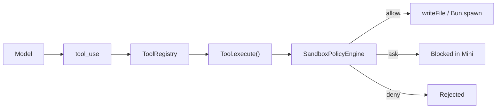
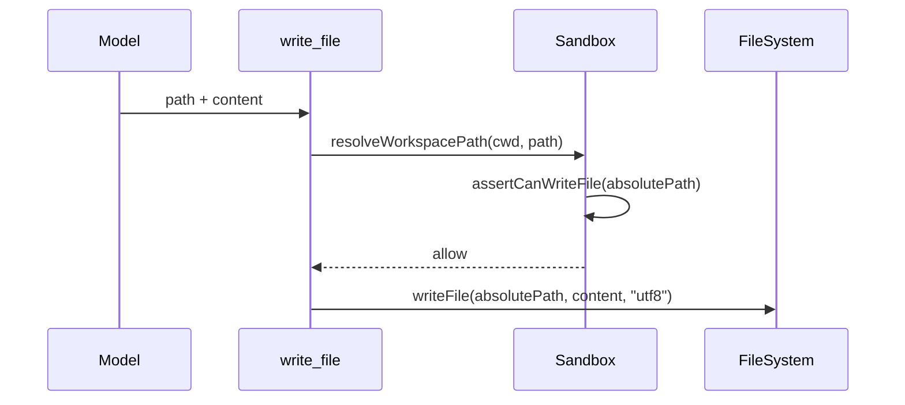
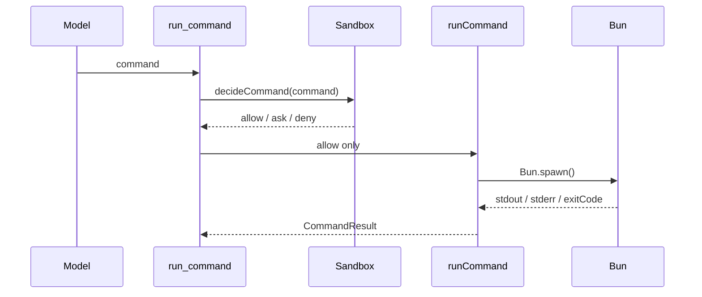

# 第 14 章：实现 Sandbox

## 本章目标

这一章要给 Claude Code Mini 加上一层执行安全边界。

第 13 章之后，Mini 已经可以维护计划：

```text
/plan 进入 plan mode
  -> update_plan 创建计划
  -> plan mode 只允许 read-only tools + update_plan
  -> /plan show 查看计划
  -> 持久化 session
```

但它仍然有一个很大的缺口：

```text
模型一旦能写文件、跑命令，就可能误删文件、修改仓库外路径、执行危险命令。
```

真实 Claude Code 不会把工具调用直接裸跑。

它会把权限模式、工具权限、Bash 命令分析、路径约束、sandbox 开关、用户审批和结果渲染串在一起。

本章先实现 Mini 版 Sandbox：

- 给所有文件写入加工作区边界。
- 新增 `run_command` 工具，使用 Bun 执行 shell 命令。
- 对命令做 allow / ask / deny 策略判断。
- 默认只允许只读检查命令。
- 给命令执行加超时和输出截断。
- 把 `read_only`、`workspace_write`、`dangerous` 三种模式接入 CLI。

注意：本章的 Sandbox 是应用层安全策略，不是完整 OS 级隔离。

它能解决教程阶段最重要的问题：

```text
模型不能随便写仓库外文件，不能自动执行明显危险命令。
```

完整的交互式审批和更细粒度权限规则，会在第 15 章闭环里继续补齐。

---

## 本章完成效果

启动默认只读模式：

```bash
bun run dev -- --sandbox read_only
```

让模型读取信息：

```text
> 运行 pwd，然后运行 git status
```

Mini 可以执行：

```text
[tool_use] run_command
input: {
  "command": "pwd"
}

exitCode: 0
stdout:
/Users/me/project
```

但如果模型尝试写入或删除：

```text
> 创建 tmp/a.txt
```

会得到：

```text
[tool_use] run_command
input: {
  "command": "touch tmp/a.txt"
}

Sandbox blocked command.
mode: read_only
decision: ask
reason: Command may modify files. Mini does not auto-approve it yet.
```

如果模型尝试访问工作区外文件：

```text
[tool_use] write_file
input: {
  "path": "../outside.txt",
  "content": "..."
}
```

会被拒绝：

```text
Path is outside workspace: ../outside.txt
```

切到允许工作区内文件写入：

```bash
bun run dev -- --sandbox workspace_write
```

这时 `write_file` 和 `edit_file` 可以写当前项目内的文件。

但 shell 写命令仍然需要审批；本章没有实现审批 UI，所以 `ask` 会被阻断。

---

## 本章项目结构变化

本章新增 `sandbox` 模块，并接入文件工具和工具注册表：

```bash
src/
  sandbox/
    types.ts        # 新增：Sandbox 类型
    path.ts         # 新增：工作区路径边界
    policy.ts       # 新增：命令和文件写入策略
    runCommand.ts   # 新增：Bun shell 执行器
    index.ts        # 新增：统一导出
  tools/
    types.ts        # 修改：ToolContext 增加 sandbox
    builtin/
      runCommand.ts # 新增：run_command 工具
      writeFile.ts  # 修改：写入前检查 sandbox
      editFile.ts   # 修改：编辑前检查 sandbox
    index.ts        # 修改：createDefaultToolRegistry 注册 run_command
  main.ts           # 修改：增加 --sandbox / --command-timeout 选项，createSessionToolRegistry 注入 SandboxPolicyEngine
```

本章不新增依赖。

仍然使用 Bun：

```bash
bun run typecheck
```

---

## 为什么需要这个模块

到目前为止，Mini 的工具已经很强：

```text
read_file
write_file
edit_file
update_plan
```

如果再加上 shell 命令，模型几乎可以自动完成一轮开发任务。

但“可以自动执行”和“可以安全自动执行”是两件事。

一个 Coding Agent 最容易出事故的地方有四类。

第一，路径越界。

例如模型想写：

```text
../config.json
```

如果没有边界检查，它可能改到项目外的文件。

第二，危险删除。

例如：

```bash
rm -rf /
```

这种命令不能只靠模型“应该不会这么做”来避免。

第三，shell 组合命令。

例如：

```bash
git status && rm -rf tmp
```

只看第一个命令是 `git status` 不够，必须把整条命令当成一个风险单元。

第四，长时间运行和大输出。

例如运行一个永不结束的服务，或输出几十 MB 日志。

如果没有超时和输出截断，CLI 体验会直接被拖垮。

所以本章要加一层明确的边界：

```text
Tool 调用
  -> SandboxPolicyEngine 判断
  -> allow 才执行
  -> ask 在本章先阻断
  -> deny 永远拒绝
```

---

## 整体架构

本章 Sandbox 位于 Tool Registry 和具体工具实现之间：



文件工具的路径是：

```text
write_file / edit_file
  -> resolveWorkspacePath()
  -> assertCanWriteFile()
  -> writeFile() (node:fs/promises)
```

命令工具的路径是：

```text
run_command
  -> decideCommand()
  -> runCommand()
  -> Bun.spawn(["bash", "-lc", command])
  -> timeout / output limit
  -> ToolResult
```

三种模式的含义：

| 模式 | 文件写入 | shell 命令 |
| --- | --- | --- |
| `read_only` | 拒绝 | 只允许只读命令 |
| `workspace_write` | 允许写工作区内文件 | 写入类命令返回 `ask` |
| `dangerous` | 允许写工作区内文件 | 跳过 `ask`，但仍拒绝硬危险命令 |

为什么 `workspace_write` 不直接放开 shell 写命令？

因为 shell 的表达能力太强。

同样是“写入工作区”，文件工具能明确知道目标路径；shell 命令可能通过重定向、脚本、管道、子进程绕开简单判断。

因此 Mini 的策略是：

```text
文件写入交给结构化工具。
shell 写入需要后续审批 UI。
```

---

## 核心流程

### 1. 文件写入检查



如果路径越界：

```text
resolveWorkspacePath() 直接抛错
```

如果模式是 `read_only`：

```text
assertCanWriteFile() 直接抛错
```

### 2. 命令执行检查



`ask` 在真实产品里应该弹出权限确认。

本章 Mini 暂时没有权限 UI，所以：

```text
ask -> 阻断，并告诉用户原因
```

这比直接执行更安全，也为第 15 章补审批流留好接口。

---

## 完整核心代码

### src/sandbox/types.ts

新增文件：

```ts
export type SandboxMode = "read_only" | "workspace_write" | "dangerous";

export type SandboxDecisionBehavior = "allow" | "ask" | "deny";

export type SandboxDecision = {
  behavior: SandboxDecisionBehavior;
  reason: string;
};

export type SandboxConfig = {
  cwd: string;
  mode: SandboxMode;
  commandTimeoutMs: number;
  maxOutputBytes: number;
};

export type RunCommandInput = {
  command: string;
};

export type CommandResult = {
  command: string;
  exitCode: number;
  stdout: string;
  stderr: string;
  durationMs: number;
  truncated: boolean;
};
```

这里把 `ask` 保留下来，即使本章还不弹确认框。

这能避免以后重构：

```text
第 14 章：ask = blocked
第 15 章：ask = show permission prompt
```

### src/sandbox/path.ts

新增文件：

```ts
import { isAbsolute, relative, resolve } from "node:path";

export function resolveWorkspacePath(cwd: string, inputPath: string): string {
  const absolutePath = isAbsolute(inputPath)
    ? resolve(inputPath)
    : resolve(cwd, inputPath);

  const relativePath = relative(cwd, absolutePath);

  if (relativePath === "") {
    return absolutePath;
  }

  if (!relativePath.startsWith("..") && !isAbsolute(relativePath)) {
    return absolutePath;
  }

  throw new Error(`Path is outside workspace: ${inputPath}`);
}
```

这个函数有两个关键点。

第一，先转成绝对路径。

这样 `a/../b`、`./x`、绝对路径都会变成统一形态。

第二，用 `relative(cwd, absolutePath)` 判断是否仍在工作区内。

不能只用字符串前缀判断。

例如：

```text
/repo
/repo-old
```

`/repo-old` 虽然以 `/repo` 开头，但不是 `/repo` 的子目录。

### src/sandbox/policy.ts

新增文件：

```ts
import type { SandboxConfig, SandboxDecision, SandboxMode } from "./types";

const MODE_SET = new Set<SandboxMode>([
  "read_only",
  "workspace_write",
  "dangerous",
]);

const ALWAYS_DENY_PATTERNS: Array<{ pattern: RegExp; reason: string }> = [
  {
    pattern: /\brm\s+(-[^\s]*r[^\s]*f|-[^\s]*f[^\s]*r)\s+(\/|~)(\s|$)/,
    reason: "Refuse recursive force removal of root or home.",
  },
  {
    pattern: /\b(sudo|doas|pkexec)\b/,
    reason: "Privilege escalation is not allowed.",
  },
  {
    pattern: /\b(curl|wget)\b[\s\S]*\|\s*(bash|sh)\b/,
    reason: "Piping network data into a shell is not allowed.",
  },
  {
    pattern: /\bgit\s+reset\s+--hard\b/,
    reason: "Hard reset may discard local work.",
  },
  {
    pattern: /\bgit\s+clean\s+-[a-zA-Z]*f/,
    reason: "Forced git clean may delete untracked files.",
  },
  {
    pattern: /:\s*\(\)\s*\{/,
    reason: "Shell fork pattern is not allowed.",
  },
];

const WRITE_LIKE_PATTERNS: RegExp[] = [
  /(^|[;&|]\s*)(rm|mv|cp|mkdir|rmdir|touch|chmod|chown|ln)\b/,
  /(^|[^<])>{1,2}/,
  /\bgit\s+(add|commit|push|merge|rebase|checkout|switch|restore|rm)\b/,
  /\bbun\s+(add|install)\b/,
];

const READ_ONLY_EXACT_COMMANDS = new Set([
  "pwd",
  "ls",
  "cat",
  "head",
  "tail",
  "sed",
  "rg",
  "grep",
  "find",
  "wc",
  "git status",
  "git diff",
  "git log",
  "git show",
  "bun run typecheck",
]);

export function parseSandboxMode(value: string | undefined): SandboxMode {
  if (value && MODE_SET.has(value as SandboxMode)) {
    return value as SandboxMode;
  }

  return "read_only";
}

export class SandboxPolicyEngine {
  constructor(readonly config: SandboxConfig) {}

  decideCommand(command: string): SandboxDecision {
    const normalized = command.trim();

    if (!normalized) {
      return { behavior: "deny", reason: "Command is empty." };
    }

    for (const rule of ALWAYS_DENY_PATTERNS) {
      if (rule.pattern.test(normalized)) {
        return { behavior: "deny", reason: rule.reason };
      }
    }

    if (this.config.mode === "dangerous") {
      return {
        behavior: "allow",
        reason: "Dangerous mode allows shell execution after hard denials.",
      };
    }

    if (isReadOnlyCommand(normalized)) {
      return { behavior: "allow", reason: "Command is read-only." };
    }

    if (WRITE_LIKE_PATTERNS.some(pattern => pattern.test(normalized))) {
      return {
        behavior: "ask",
        reason: "Command may modify files. Mini does not auto-approve it yet.",
      };
    }

    return {
      behavior: "ask",
      reason: "Command is not in the read-only allowlist.",
    };
  }

  assertCanWriteFile(path: string): void {
    if (this.config.mode === "read_only") {
      throw new Error(`Sandbox is read-only. File write blocked: ${path}`);
    }
  }
}

function isReadOnlyCommand(command: string): boolean {
  if (READ_ONLY_EXACT_COMMANDS.has(command)) {
    return true;
  }

  if (command.startsWith("git diff ")) return true;
  if (command.startsWith("git show ")) return true;
  if (command.startsWith("git log ")) return true;
  if (command.startsWith("rg ")) return true;
  if (command.startsWith("grep ")) return true;
  if (command.startsWith("find ")) return true;
  if (command.startsWith("ls ")) return true;
  if (command.startsWith("cat ")) return true;
  if (command.startsWith("sed ")) return !/(^|[;&|]\s*)sed\s+.*\s-i\b/.test(command);

  return false;
}
```

这份策略刻意偏保守。

它不是要“聪明地理解所有 shell 语法”，而是先建立一条清晰边界：

```text
只读命令自动执行。
写入类命令进入审批。
硬危险命令直接拒绝。
```

真实 Claude Code 的 Bash 权限实现更复杂。

它会分析 compound command、重定向、路径、规则匹配、权限模式和分类器。

Mini 现在不追求完整覆盖，只保证默认安全。

### src/sandbox/runCommand.ts

新增文件：

```ts
import type { CommandResult } from "./types";

type RunCommandOptions = {
  cwd: string;
  timeoutMs: number;
  maxOutputBytes: number;
};

type LimitedText = {
  text: string;
  truncated: boolean;
};

export async function runCommand(
  command: string,
  options: RunCommandOptions,
): Promise<CommandResult> {
  const startedAt = Date.now();
  const abortController = new AbortController();
  let timedOut = false;

  const timeoutId = setTimeout(() => {
    timedOut = true;
    abortController.abort();
  }, options.timeoutMs);

  const proc = Bun.spawn(["bash", "-lc", command], {
    cwd: options.cwd,
    stdout: "pipe",
    stderr: "pipe",
    signal: abortController.signal,
  });

  try {
    const [stdout, stderr, exitCode] = await Promise.all([
      readLimitedText(proc.stdout, options.maxOutputBytes),
      readLimitedText(proc.stderr, options.maxOutputBytes),
      proc.exited,
    ]);

    return {
      command,
      exitCode,
      stdout: stdout.text,
      stderr: stderr.text,
      durationMs: Date.now() - startedAt,
      truncated: stdout.truncated || stderr.truncated,
    };
  } catch (error) {
    if (timedOut) {
      throw new Error(`Command timed out after ${options.timeoutMs}ms.`);
    }

    throw error;
  } finally {
    clearTimeout(timeoutId);
  }
}

async function readLimitedText(
  stream: ReadableStream<Uint8Array> | null,
  maxBytes: number,
): Promise<LimitedText> {
  if (!stream) {
    return { text: "", truncated: false };
  }

  const reader = stream.getReader();
  const chunks: Uint8Array[] = [];
  let seenBytes = 0;
  let truncated = false;

  while (true) {
    const { done, value } = await reader.read();
    if (done) break;

    const remaining = maxBytes - seenBytes;

    if (remaining > 0) {
      chunks.push(value.slice(0, remaining));
    }

    seenBytes += value.byteLength;

    if (seenBytes > maxBytes) {
      truncated = true;
    }
  }

  const text = new TextDecoder().decode(joinChunks(chunks));
  return { text, truncated };
}

function joinChunks(chunks: Uint8Array[]): Uint8Array {
  const totalBytes = chunks.reduce((sum, chunk) => sum + chunk.byteLength, 0);
  const output = new Uint8Array(totalBytes);
  let offset = 0;

  for (const chunk of chunks) {
    output.set(chunk, offset);
    offset += chunk.byteLength;
  }

  return output;
}
```

这里用的是 `Bun.spawn()`。

不要换成 Node 的 `child_process`。

本教程项目运行时就是 Bun，命令执行层也应该保持一致。

为什么 stdout 和 stderr 要并发读取？

因为子进程的输出管道如果没人读，进程可能卡住。

所以这里同时等待：

```text
read stdout
read stderr
wait process exit
```

为什么超过 `maxOutputBytes` 后还继续读取？

因为如果直接停止读取，子进程仍然可能因为管道塞满而阻塞。

正确做法是：

```text
超过限制后丢弃内容，但继续 drain stream。
```

### src/sandbox/index.ts

新增文件：

```ts
export { resolveWorkspacePath } from "./path";
export { parseSandboxMode, SandboxPolicyEngine } from "./policy";
export { runCommand } from "./runCommand";
export type {
  CommandResult,
  RunCommandInput,
  SandboxConfig,
  SandboxDecision,
  SandboxDecisionBehavior,
  SandboxMode,
} from "./types";
```

### src/tools/types.ts

修改 `ToolContext`，把 sandbox 放进去。

不要覆盖掉第 13 章已经接进去的 `readFileState` 和 `planner`。

把 `src/tools/types.ts` 里的 `ToolContext` 相关定义改成下面这个形状：

```ts
import type { ChatMessage } from "../llm/types";
import type { PlannerStore } from "../planner";
import type { SandboxPolicyEngine } from "../sandbox";

export type ReadFileStateEntry = {
  content: string;
  mtimeMs: number;
};

export type ToolContext = {
  cwd: string;
  readFileState: Map<string, ReadFileStateEntry>;
  sessionId: string;
  messages: readonly ChatMessage[];
  planner: PlannerStore;
  sandbox: SandboxPolicyEngine;
};
```

这样所有工具都能共享同一份策略。

不要让每个工具自己读环境变量。

策略应该在 session 创建时确定，并通过 context 注入。

### src/tools/builtin/runCommand.ts

新增文件：

```ts
import { z } from "zod";
import { runCommand } from "../../sandbox";
import type { Tool } from "../types";

const inputSchema = z.object({
  command: z.string().min(1),
  reason: z.string().optional(),
});

type RunCommandToolInput = z.infer<typeof inputSchema>;

export const runCommandTool: Tool<RunCommandToolInput> = {
  name: "run_command",
  description:
    "Run a shell command inside the workspace sandbox. Prefer read-only inspection commands.",
  inputSchema,

  async execute(input, context) {
    const parsed = inputSchema.parse(input);
    const decision = context.sandbox.decideCommand(parsed.command);

    if (decision.behavior !== "allow") {
      throw new Error(
        [
          "Sandbox blocked command.",
          `mode: ${context.sandbox.config.mode}`,
          `decision: ${decision.behavior}`,
          `reason: ${decision.reason}`,
        ].join("\n"),
      );
    }

    const result = await runCommand(parsed.command, {
      cwd: context.sandbox.config.cwd,
      timeoutMs: context.sandbox.config.commandTimeoutMs,
      maxOutputBytes: context.sandbox.config.maxOutputBytes,
    });

    return formatCommandResult(result);
  },
};

function formatCommandResult(result: {
  exitCode: number;
  stdout: string;
  stderr: string;
  durationMs: number;
  truncated: boolean;
}): string {
  const lines = [
    `exitCode: ${result.exitCode}`,
    `durationMs: ${result.durationMs}`,
  ];

  if (result.stdout.trim()) {
    lines.push("stdout:", result.stdout.trimEnd());
  }

  if (result.stderr.trim()) {
    lines.push("stderr:", result.stderr.trimEnd());
  }

  if (result.truncated) {
    lines.push("[output truncated]");
  }

  return lines.join("\n");
}
```

这里的重点不是 zod schema，而是执行顺序：

```text
parse input
  -> decideCommand()
  -> allow 才 runCommand()
```

不要先执行再判断。

### src/tools/builtin/writeFile.ts

修改写文件工具，在实际写入前插入 sandbox 检查。

Mini 项目之前用 `writeFile()`（来自 `node:fs/promises`）写入。现在在 `writeFile()` 调用前加入 sandbox 边界：

```ts
import { resolveWorkspacePath } from "../../sandbox";

// 在工作区写入模式/危险模式下：验证目标路径在 workspace 内
const sandboxPath = resolveWorkspacePath(context.cwd, input.path);
// read_only 模式下直接抛错
context.sandbox.assertCanWriteFile(sandboxPath);

await writeFile(absolutePath, input.content, "utf8");
```

这一步同时解决两个问题：

- 路径必须在工作区内。
- `read_only` 模式不能写。

### src/tools/builtin/editFile.ts

编辑工具也必须接同样检查。

在生成新内容之后、写入之前，验证目标路径：

```ts
import { resolveWorkspacePath } from "../../sandbox";

const sandboxPath = resolveWorkspacePath(context.cwd, input.path);
context.sandbox.assertCanWriteFile(sandboxPath);

await writeFile(absolutePath, updatedContent, "utf8");
```

这里不要只保护 `write_file`。

`edit_file` 本质也是写入。

### src/tools/index.ts

在 `createDefaultToolRegistry()` 中注册 `runCommandTool`：

```ts
import { runCommandTool } from "./builtin/runCommand";

export function createDefaultToolRegistry(context: ToolContext): ToolRegistry {
  const registry = new ToolRegistry(context);

  registry.register(currentTimeTool);
  registry.register(readFileTool);
  registry.register(writeFileTool);
  registry.register(editFileTool);
  registry.register(updatePlanTool);
  registry.register(runCommandTool);  // 新增

  return registry;
}
```

Mini 的工具注册通过 `ToolRegistry` 类的 `.register()` 方法，不是简单数组导出。建议把 `run_command` 放在文件工具之后：

```text
读文件 -> 写文件 -> 编辑文件 -> 计划 -> 命令
```

### src/main.ts — CLI 参数

Mini 项目使用 Commander.js 解析 CLI 参数（`src/main.ts`）。

第一步，在 `RootOptions` type 中增加 sandbox 相关字段：

```ts
type RootOptions = {
  // ... 已有字段 ...
  sandbox?: string;
  commandTimeout?: string;
};
```

第二步，在 Commander program 定义中注册两个新 option：

```ts
program
  // ... 已有 option ...
  .option("--sandbox <mode>", "Sandbox mode: read_only | workspace_write | dangerous", "read_only")
  .option("--command-timeout <ms>", "Command timeout in milliseconds", parsePositiveInteger, 30_000)
```

第三步，修改 `createSessionToolRegistry()`，创建 `SandboxPolicyEngine` 并注入 `ToolContext`：

```ts
import { SandboxPolicyEngine, parseSandboxMode, type SandboxMode } from "./sandbox";

function createSessionToolRegistry(
  cwd: string,
  planner: PlannerStore,
  sandboxMode: SandboxMode,
  commandTimeoutMs: number,
): ToolRegistry {
  const sandbox = new SandboxPolicyEngine({
    cwd,
    mode: sandboxMode,
    commandTimeoutMs,
    maxOutputBytes: 64 * 1024,
  });

  const readFileState: ToolContext["readFileState"] = new Map();

  return createDefaultToolRegistry({
    cwd,
    readFileState,
    sessionId: "",  // 由 ChatSession 在实际使用时填充
    messages: [],
    planner,
    sandbox,
  });
}
```

第四步，在 `handlePrompt()` 和 `runChatLoop()` 调用处传入 sandbox 参数：

```ts
const toolRegistry = createSessionToolRegistry(
  options.cwd,
  planner,
  parseSandboxMode(options.sandbox),
  options.commandTimeout ?? 30_000,
);
```

关键设计决策：

- sandbox 在 `createSessionToolRegistry()` 中创建，不在 `ChatSession` 中创建。
- `ToolContext` 已经有 `sandbox` 字段（第 13 章后的 `src/tools/types.ts`），这里只是补齐实际赋值。
- `planner` 必须还是第 13 章创建的同一个 `PlannerStore`。
- `readFileState` 不能丢，否则第 6 章的读后写保护会退化。
- plan mode 的写工具限制仍然在 `AgentLoop` 里做，Sandbox 是执行安全层，不负责切换 `/plan` 语义。

之后工具不需要知道 CLI 参数从哪里来，只依赖 `context.sandbox`。

---

## 逐步实现

### 第一步：先做路径边界

先新增：

```text
src/sandbox/path.ts
```

然后把 `write_file` 和 `edit_file` 都接上 `resolveWorkspacePath()`。

先验证这两个输入会失败：

```text
../outside.txt
/tmp/outside.txt
```

再验证这个会通过：

```text
tmp/inside.txt
```

路径边界必须先做。

否则后面的 shell 策略即使写得再好，文件工具仍然能越界。

### 第二步：实现只读命令 allowlist

先不要追求完整 shell parser。

先让这些命令能跑：

```text
pwd
ls
git status
git diff
rg "keyword" src
bun run typecheck
```

这已经覆盖了 Coding Agent 最常见的检查动作。

再把写入类命令统一转成 `ask`。

本章 `ask` 不执行。

### 第三步：接入 Bun.spawn

新增 `runCommand()` 时只做三件事：

- 使用 `Bun.spawn()`。
- 设置 `AbortController` 超时。
- 限制 stdout / stderr 最大字节数。

不要在执行器里判断命令安全。

安全判断属于 `SandboxPolicyEngine`。

执行器只负责：

```text
给定 command，运行并返回结果。
```

### 第四步：注册 run_command 工具

把 `runCommandTool` 放入 `builtinTools` 后，模型就能看到新工具。

如果第 7 章的 tool schema 会发给模型，确认 `run_command` 的描述里强调：

```text
Prefer read-only inspection commands.
```

模型会更倾向于先跑检查命令，而不是一上来就写入。

### 第五步：把 sandbox 模式接进 CLI

默认必须是：

```text
read_only
```

不要默认 `workspace_write`。

更不要默认 `dangerous`。

默认值决定了用户第一次运行 Mini 时的安全姿态。

---

## 关键源码分析

真实工程里的相关实现分散在几类文件里。

### Tool 权限上下文

`src/Tool.ts` 定义了 `ToolPermissionContext` 和 `ToolUseContext`。

其中权限上下文包含：

- 当前 permission mode。
- always allow / deny / ask 规则。
- 额外工作目录。
- 是否允许 bypass。
- plan mode 前的权限模式。

这说明真实 Claude Code 不是在工具内部散落读取配置，而是把权限状态作为工具调用上下文的一部分传递。

Mini 本章也采用同样方向：

```text
SandboxPolicyEngine 放进 ToolContext。
```

第 13 章已经有一个轻量 plan mode 边界：

```text
plan mode 下只允许 read-only tools + update_plan
```

本章 Sandbox 不替换这个边界。

Sandbox 负责“工具真正要执行时能不能写、能不能跑命令”。

plan mode 负责“计划阶段不要暴露写工具”。

### 权限模式

`src/types/permissions.ts` 和 `src/utils/permissions/PermissionMode.ts` 定义了权限模式。

真实工程里有：

```text
default
acceptEdits
bypassPermissions
dontAsk
plan
auto
```

Mini 不直接照搬这些模式。

原因是这些模式依赖完整权限 UI、设置文件、规则持久化和 classifier。

本章只保留教程阶段需要的三种：

```text
read_only
workspace_write
dangerous
```

这三种更容易验证，也更适合从零实现。

### Bash 工具

`packages/builtin-tools/src/tools/BashTool/BashTool.tsx` 是真实 Bash 工具入口。

它的结构和 Mini 本章的 `run_command` 很像：

- 定义输入 schema。
- 判断命令是否只读。
- 在 `checkPermissions()` 中进入权限判断。
- 在 `call()` 中执行命令。
- 处理超时、后台任务、输出聚合、错误解释和 sandbox 标记。

真实实现还支持后台任务和更复杂的 UI 渲染。

Mini 本章只保留核心链路：

```text
schema -> permission decision -> Bun.spawn -> result text
```

### Bash 权限判断

`packages/builtin-tools/src/tools/BashTool/bashPermissions.ts` 负责 Bash 权限判断。

这里的关键思想不是某个具体规则，而是顺序：

```text
解析命令
  -> 拆 compound command
  -> 检查模式
  -> 检查显式规则
  -> 检查路径和语义
  -> 返回 allow / ask / deny
```

Mini 本章没有引入 shell AST parser。

但仍然保留同样的返回形态：

```ts
type SandboxDecision = {
  behavior: "allow" | "ask" | "deny";
  reason: string;
};
```

以后要换成更强的解析器时，工具层不需要改。

### 只读命令校验

`packages/builtin-tools/src/tools/BashTool/readOnlyValidation.ts` 中有大量只读命令和 flag 校验。

这说明“只读命令”不是简单看命令名。

例如同样是 `sed`：

```text
打印内容是只读。
原地修改不是只读。
```

Mini 本章只做最小实现：

```ts
command.startsWith("sed ") && !command.includes(" -i")
```

这不完整，但足够表达架构。

课程阶段的重点是把校验位置放对，而不是一次覆盖全部 shell 语法。

### 路径和危险操作

`packages/builtin-tools/src/tools/BashTool/pathValidation.ts` 会检查危险删除路径。

`src/utils/permissions/dangerousPatterns.ts` 会维护危险命令模式。

这两个文件说明一个原则：

```text
某些操作即使用户曾经允许过相似命令，也不能轻易自动放行。
```

Mini 本章的 `ALWAYS_DENY_PATTERNS` 就是这个原则的简化版。

### 是否使用 sandbox

`packages/builtin-tools/src/tools/BashTool/shouldUseSandbox.ts` 会根据 sandbox 是否开启、命令是否被排除、是否显式危险关闭 sandbox 来决定是否启用。

真实实现中还有 `SandboxManager` 负责平台层能力。

Mini 本章没有实现平台 sandbox。

因此不要把它宣传成“强隔离环境”。

准确说法是：

```text
Mini 实现的是命令和文件工具的应用层安全边界。
```

---

## 调试与验证

### 1. 类型检查

```bash
bun run typecheck
```

必须通过。

### 2. 默认只读模式

启动：

```bash
bun run dev -- --sandbox read_only
```

输入：

```text
> 运行 pwd 和 git status
```

应该允许。

再输入：

```text
> 创建 tmp/a.txt
```

如果模型调用 `write_file`，应被 `read_only` 阻断。

如果模型调用 `run_command` 执行 `touch tmp/a.txt`，也应被阻断。

### 3. 工作区写入模式

启动：

```bash
bun run dev -- --sandbox workspace_write
```

输入：

```text
> 写入 tmp/sandbox-check.txt，内容是 hello
```

如果模型调用 `write_file`，应该成功。

再输入：

```text
> 运行 touch tmp/shell-check.txt
```

本章应该阻断，并显示 `decision: ask`。

这是预期行为。

### 4. 路径越界

在任意模式下测试：

```text
> 写入 ../outside.txt，内容是 no
```

应该失败：

```text
Path is outside workspace: ../outside.txt
```

### 5. 超时

启动时设置较短超时：

```bash
bun run dev -- --sandbox dangerous --command-timeout 1000
```

输入：

```text
> 运行 sleep 5
```

应该失败：

```text
Command timed out after 1000ms.
```

### 6. 输出截断

让命令输出大量内容：

```text
> 运行 yes hello
```

在超时和输出限制下，结果应该不会刷爆终端，并出现：

```text
[output truncated]
```

---

## 常见问题

### 为什么不直接让 `workspace_write` 放开所有命令？

因为 shell 不是结构化工具。

文件工具知道自己要写哪个路径。

shell 命令可能通过脚本、重定向、管道和子进程做很多额外动作。

本章先让文件写入走结构化工具，让 shell 写入进入审批分支。

### 为什么 `ask` 现在也是阻断？

因为本章还没有实现权限确认 UI。

如果没有 UI，却把 `ask` 当成 `allow`，那 `ask` 就失去了意义。

所以 Mini 暂时采用：

```text
ask = blocked with reason
```

第 15 章再把它升级成：

```text
ask = show prompt -> user approves or denies
```

### 为什么 `dangerous` 仍然拒绝一部分命令？

因为本教程的 `dangerous` 不是完全裸奔。

它表示跳过普通 `ask`，方便本地验证和开发。

但明显灾难级命令仍然应该拒绝。

如果读者真的要执行这些命令，应离开 Agent，自己在终端里手动执行。

### 这个 Sandbox 能防住恶意脚本吗？

不能完整防住。

本章实现的是应用层策略。

如果你允许执行任意脚本，脚本内部能做什么取决于操作系统权限。

真正强隔离需要平台 sandbox、容器、虚拟机或专用执行环境。

本教程先做 Mini 可理解、可跟做、可验证的一层。

### 为什么不用复杂 shell parser？

复杂 parser 很重要，但不适合在第一版 Mini 里引入。

本章的目标是先把架构接对：

```text
工具调用必须经过策略层。
策略层必须返回 allow / ask / deny。
执行层必须有超时和输出限制。
```

后续替换 parser 时，只替换 `SandboxPolicyEngine.decideCommand()` 内部实现。

---

## 本章小结

本章给 Mini 增加了执行安全边界：

- 新增 `src/sandbox` 模块。
- 用 `resolveWorkspacePath()` 限制文件路径。
- 用 `SandboxPolicyEngine` 统一判断 allow / ask / deny。
- 新增基于 `Bun.spawn()` 的 `run_command` 工具。
- 给命令执行加超时和输出截断。
- 把 `read_only`、`workspace_write`、`dangerous` 接入 CLI。

完成这一章后，Mini 的能力链路变成：

```text
Planner 制定步骤
  -> Agent 调用工具
  -> Sandbox 判断风险
  -> 允许的动作执行
  -> 危险动作阻断
```

现在还缺最后一块：

```text
当 Sandbox 返回 ask 时，如何让用户审批，并让 Agent 完成完整任务闭环。
```

这就是第 15 章要做的内容。
