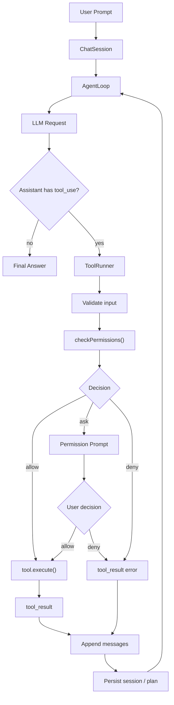
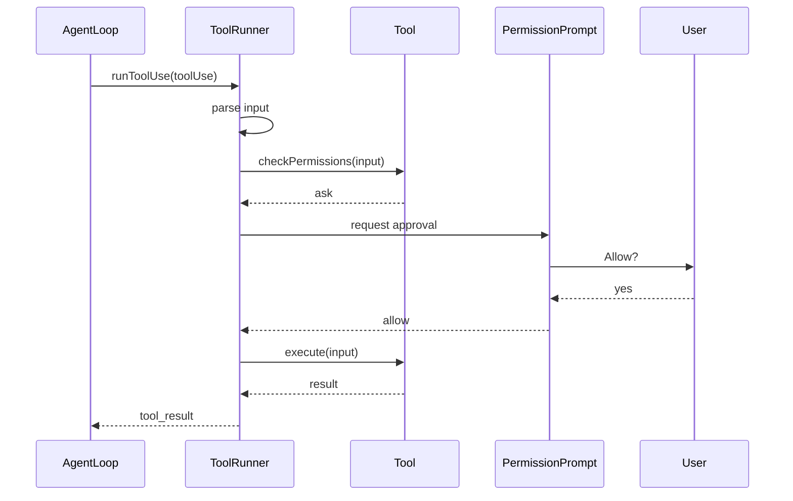
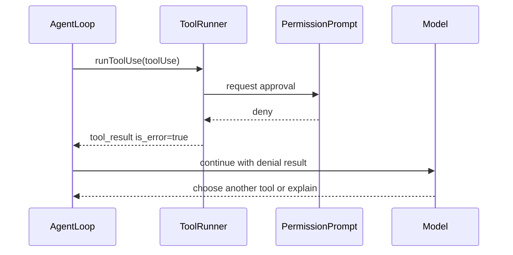
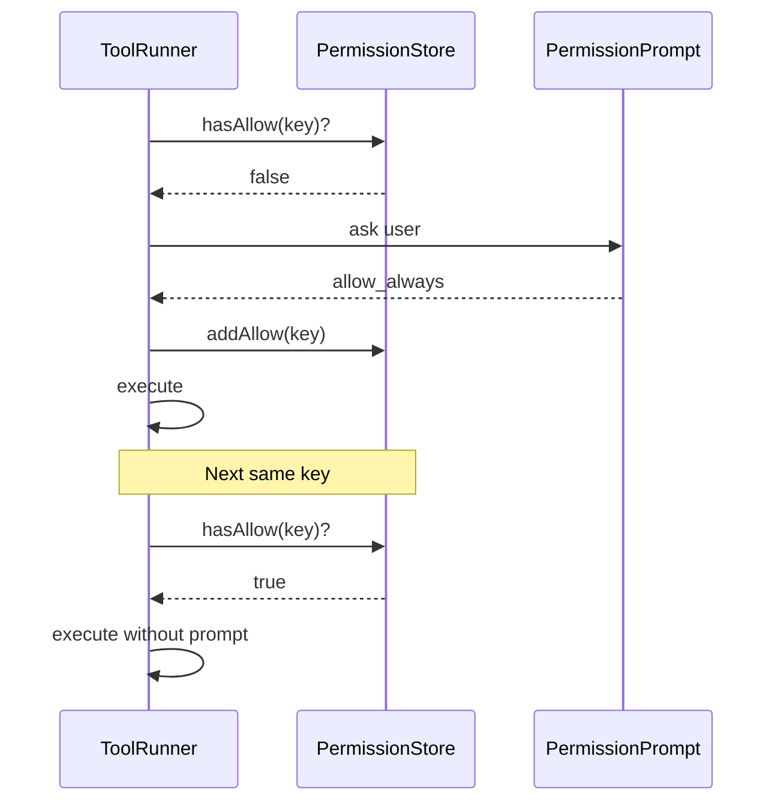

# 第 15 章：实现 Claude Code Mini 完整闭环

## 本章目标

这一章要把前 14 章的模块串成一个能完成真实小任务的 Claude Code Mini。

第 14 章结束时，Mini 已经有了 Sandbox：

```text
Tool 调用
  -> Sandbox 判断 allow / ask / deny
  -> allow 才执行
  -> ask 暂时阻断
  -> deny 拒绝
```

但它还不是完整闭环。

因为 `ask` 只会被阻断，用户没有机会审批。

真实 Claude Code 的闭环不是“模型要工具，程序直接跑工具”。

而是：

```text
模型请求工具
  -> 系统校验工具输入
  -> 系统检查权限
  -> 需要用户确认时暂停
  -> 用户批准后执行工具
  -> 工具结果返回模型
  -> 模型继续下一步
  -> 最后给用户总结
```

本章要给 Mini 补上最后一块：

- 新增 Mini 版 Permission Prompt。
- 把 `ask` 从阻断升级为用户审批。
- 支持本次允许和本会话始终允许。
- 把权限拒绝也作为 `tool_result` 返回给模型，让模型能换方案。
- 把 Planner、Sandbox、Session、Agent Loop 串成完整任务闭环。
- 给最终 Mini 增加一次端到端验证流程。

完成这一章后，Mini 不再只是多个模块的集合。

它会成为一个能“计划、执行、确认、恢复、收尾”的最小 Coding Agent。

---

## 本章完成效果

启动：

```bash
bun run dev -- --sandbox workspace_write --max-turns 12
```

输入：

```text
> 创建 tmp/final-loop.txt，写入 hello mini，然后读取它确认，最后运行 ls tmp
```

你会看到类似流程：

```text
[session] started 6fd0f148-2a7f-4a30-a3f4-41d8ac38c203

[tool_use] update_plan
[plan]
● Creating tmp/final-loop.txt
○ Reading tmp/final-loop.txt
○ Listing tmp

[tool_use] write_file
input: {"path":"tmp/final-loop.txt","content":"hello mini\n"}
[tool_result] wrote tmp/final-loop.txt

[tool_use] read_file
input: {"path":"tmp/final-loop.txt"}
[tool_result] hello mini

[tool_use] run_command
input: {"command":"ls tmp"}
[tool_result]
exitCode: 0
stdout:
final-loop.txt

[assistant]
已创建并确认 tmp/final-loop.txt，内容为 hello mini。
```

如果模型尝试运行需要确认的命令：

```text
[tool_use] run_command
input: {"command":"touch tmp/from-shell.txt"}
```

Mini 会暂停并询问：

```text
Permission required
tool: run_command
reason: Command may modify files.
command: touch tmp/from-shell.txt

Allow? [y]es / [a]lways this session / [n]o:
```

输入 `y`：

```text
[permission] allowed once
[tool_result] exitCode: 0
```

输入 `a`：

```text
[permission] allowed for this session
[tool_result] exitCode: 0
```

输入 `n`：

```text
[permission] denied
[tool_result] Permission denied by user.
```

拒绝不会让进程崩溃。

拒绝会作为工具结果回到模型，模型可以选择改用 `write_file`，或向用户解释无法继续。

---

## 本章项目结构变化

本章新增 `permissions` 模块，并改造工具执行入口：

```bash
src/
  permissions/
    types.ts          # 新增：权限请求、权限响应、权限决策类型
    keys.ts           # 新增：把工具调用转成稳定 approval key
    store.ts          # 新增：本会话 always allow 记录
    prompt.ts         # 新增：终端审批提示
    index.ts          # 新增：统一导出
  sandbox/
    policy.ts         # 修改：增加 decideFileWrite()
  tools/
    types.ts          # 修改：Tool 增加 checkPermissions，ToolContext 增加 permissions/askUser
    builtin/
      runCommand.ts   # 修改：增加 checkPermissions，ask 交给权限系统处理
      writeFile.ts    # 修改：增加 checkPermissions，使用 decideFileWrite()
      editFile.ts     # 修改：增加 checkPermissions，使用 decideFileWrite()
  agent/
    toolRunner.ts     # 新增：校验输入、检查权限、请求审批、执行工具
    loop.ts           # 修改：executeToolUse 改用 runToolUse()，保留 plan mode 工具过滤
  main.ts             # 修改：createSessionToolRegistry 注入 PermissionStore 和 askUser
  chat/
    chatLoop.ts       # 修改：把 askUser 函数传入 createSessionToolRegistry
```

本章不新增依赖。

继续使用 Bun：

```bash
bun run typecheck
```

---

## 为什么需要这个模块

前 14 章已经做了很多能力：

```text
CLI
LLM API
Streaming
Tool Registry
Tool Calling
Agent Loop
文件读写
代码编辑
Diff / Patch
Context
Session
Planner
Sandbox
```

但这些模块还差一个协调层。

如果没有协调层，会出现三个问题。

第一，安全策略无法落地。

第 14 章能判断：

```text
allow / ask / deny
```

但 `ask` 没有 UI，只能阻断。

这会让很多合理操作无法完成。

第二，拒绝没有反馈闭环。

如果用户拒绝一个命令，模型应该知道：

```text
用户拒绝了这个工具调用。
```

然后模型可以改用别的工具。

如果程序直接抛异常退出，Agent Loop 就断了。

第三，工具执行逻辑会散落。

如果每个工具自己处理：

- zod 输入校验
- 权限检查
- 用户确认
- 错误包装
- 工具结果格式

那后续维护会很困难。

真实 Claude Code 有一个集中入口处理这些事。

Mini 本章也要做同样的分层：

```text
AgentLoop 只负责循环。
ToolRunner 负责单次工具调用生命周期。
Tool 只负责自己的业务动作。
Permission 模块负责用户确认。
Sandbox 负责风险判断。
```

---

## 整体架构

本章完整闭环如下：



注意这里有两个关键边界。

第一个边界：

```text
ToolRunner 在 tool.execute() 之前处理权限。
```

这和真实工程一致。

真实工程的工具执行路径里，权限检查在 `tool.call()` 之前。

第二个边界：

```text
deny 不是进程异常，而是 tool_result error。
```

模型需要看到这次工具失败的原因。

否则它无法调整下一步。

---

## 核心流程

### 1. 单个工具调用



### 2. 用户拒绝工具



### 3. 本会话始终允许



本章的 always allow 只保存在当前进程内。

退出后会失效。

这比直接写磁盘权限更安全，也更适合 Mini。

---

## 完整核心代码

### src/permissions/types.ts

新增文件：

```ts
export type ToolPermissionBehavior = "allow" | "ask" | "deny";

export type ToolPermissionDecision = {
  behavior: ToolPermissionBehavior;
  message: string;
  approvalKey?: string;
};

export type ToolApprovalRequest = {
  toolName: string;
  inputSummary: string;
  reason: string;
  approvalKey: string;
};

export type ToolApprovalResponse =
  | {
      behavior: "allow";
      scope: "once" | "session";
    }
  | {
      behavior: "deny";
      feedback?: string;
    };
```

`ToolPermissionDecision` 是工具返回给 ToolRunner 的结果。

`ToolApprovalRequest` 是 ToolRunner 给终端提示用的数据。

`ToolApprovalResponse` 是用户的选择。

这里刻意不把 UI 逻辑放进 Tool。

工具只负责回答：

```text
这次调用是否需要审批？
```

用户怎么审批，是 Permission 模块的职责。

### src/permissions/keys.ts

新增文件：

```ts
export function approvalKeyForToolInput(
  toolName: string,
  input: Record<string, unknown>,
): string {
  if (toolName === "run_command") {
    return `run_command:${String(input.command ?? "").trim()}`;
  }

  if (toolName === "write_file" || toolName === "edit_file") {
    return `${toolName}:${String(input.path ?? "").trim()}`;
  }

  return `${toolName}:${JSON.stringify(input)}`;
}

export function summarizeToolInput(
  toolName: string,
  input: Record<string, unknown>,
): string {
  if (toolName === "run_command") {
    return String(input.command ?? "");
  }

  if (toolName === "write_file" || toolName === "edit_file") {
    return String(input.path ?? "");
  }

  return JSON.stringify(input, null, 2);
}
```

`approvalKey` 用来做本会话的 always allow。

为什么不直接把整个 input 当 key？

因为有些 input 很大。

例如 `write_file` 的 `content` 可能很长。

对于文件写入，更合理的 key 是：

```text
write_file:<path>
```

对于命令执行，更合理的 key 是：

```text
run_command:<command>
```

Mini 不做复杂的前缀规则。

例如不会实现：

```text
允许所有 git status 类命令。
```

真实工程支持更复杂的规则匹配。

本章先保持可理解和可审计。

### src/permissions/store.ts

新增文件：

```ts
export class PermissionStore {
  private readonly sessionAllowKeys = new Set<string>();

  hasSessionAllow(key: string): boolean {
    return this.sessionAllowKeys.has(key);
  }

  addSessionAllow(key: string): void {
    this.sessionAllowKeys.add(key);
  }

  listSessionAllows(): string[] {
    return [...this.sessionAllowKeys].sort();
  }
}
```

这个 store 只存内存。

它不会写入 session transcript。

原因很简单：

```text
会话 transcript 是行为记录。
权限授权是安全策略。
```

这两类数据不要混在一起。

本章先只做进程内授权。

### src/permissions/prompt.ts

新增文件：

```ts
import type { ToolApprovalRequest, ToolApprovalResponse } from "./types";

export type AskUser = (prompt: string) => Promise<string>;

export async function promptForToolApproval(
  request: ToolApprovalRequest,
  askUser: AskUser,
): Promise<ToolApprovalResponse> {
  console.log("");
  console.log("Permission required");
  console.log(`tool: ${request.toolName}`);
  console.log(`reason: ${request.reason}`);
  console.log(`input: ${request.inputSummary}`);
  console.log("");

  while (true) {
    const answer = (
      await askUser("Allow? [y]es / [a]lways this session / [n]o: ")
    )
      .trim()
      .toLowerCase();

    if (answer === "y" || answer === "yes") {
      return { behavior: "allow", scope: "once" };
    }

    if (answer === "a" || answer === "always") {
      return { behavior: "allow", scope: "session" };
    }

    if (answer === "n" || answer === "no") {
      const feedback = (
        await askUser("Optional feedback for the model: ")
      ).trim();

      return {
        behavior: "deny",
        feedback: feedback || undefined,
      };
    }

    console.log("Please answer y, a, or n.");
  }
}
```

注意这里没有自己创建新的 readline。

它接收一个 `askUser` 函数。

因为 `chatLoop.ts` 通常已经拥有用户输入循环。

如果 Permission Prompt 另起一个输入流，容易和主输入循环抢 stdin。

所以正确做法是：

```text
chatLoop 拥有输入能力。
promptForToolApproval 只复用它。
```

### src/permissions/index.ts

新增文件：

```ts
export { approvalKeyForToolInput, summarizeToolInput } from "./keys";
export { promptForToolApproval, type AskUser } from "./prompt";
export { PermissionStore } from "./store";
export type {
  ToolApprovalRequest,
  ToolApprovalResponse,
  ToolPermissionBehavior,
  ToolPermissionDecision,
} from "./types";
```

### src/tools/types.ts

修改 Tool 和 ToolContext。

Mini 项目中 Tool 已有 `execute(input, context): Promise<ToolResult>`。ToolContext 已有 `planner`、`sandbox`、`readFileState` 等字段。

本章增加 `permissions` 和 `askUser` 到 ToolContext，并给 Tool 增加可选的 `checkPermissions`：

```ts
import type {
  AskUser,
  PermissionStore,
  ToolPermissionDecision,
} from "../permissions";
import type { ChatMessage } from "../llm/types";
import type { PlannerStore } from "../planner";
import type { SandboxPolicyEngine } from "../sandbox";
import type { z } from "zod";

// ... 已有类型不变 ...

export type ToolContext = {
  cwd: string;
  readFileState: Map<string, ReadFileStateEntry>;
  sessionId: string;
  messages: readonly ChatMessage[];
  planner: PlannerStore;
  sandbox: SandboxPolicyEngine;
  permissions: PermissionStore;   // 新增
  askUser: AskUser;               // 新增
};

export type ToolResult = {
  content: string;
  metadata?: Record<string, unknown>;
  diff?: string;
};

export type Tool<TInput = unknown> = {
  name: string;
  description: string;
  inputSchema: z.ZodType<TInput>;
  inputJSONSchema: ToolInputJSONSchema;
  isReadOnly: boolean;
  checkPermissions?: (             // 新增
    input: TInput,
    context: ToolContext,
  ) => Promise<ToolPermissionDecision> | ToolPermissionDecision;
  execute(input: TInput, context: ToolContext): Promise<ToolResult>;
};
```

为什么 `checkPermissions` 是可选的？

因为 `read_file` 和 `update_plan` 这类工具可以默认允许。

ToolRunner 会把没有 `checkPermissions` 的工具视为 `allow`。

### src/sandbox/policy.ts

第 14 章只有 `assertCanWriteFile()`。

本章要升级成可返回 `ask` 的判断：

```ts
import type { SandboxConfig, SandboxDecision, SandboxMode } from "./types";

export class SandboxPolicyEngine {
  constructor(readonly config: SandboxConfig) {}

  decideFileWrite(path: string): SandboxDecision {
    if (this.config.mode === "read_only") {
      return {
        behavior: "ask",
        reason: `File write requires approval in read_only mode: ${path}`,
      };
    }

    return {
      behavior: "allow",
      reason: "Workspace file writes are allowed in this sandbox mode.",
    };
  }

  assertCanWriteFile(path: string): void {
    const decision = this.decideFileWrite(path);

    if (decision.behavior !== "allow") {
      throw new Error(decision.reason);
    }
  }

  decideCommand(command: string): SandboxDecision {
    // 保留第 14 章的实现：
    // - 硬危险命令 deny
    // - 只读命令 allow
    // - 写入类 shell 命令 ask
  }
}
```

为什么保留 `assertCanWriteFile()`？

因为它仍然适合工具内部做 defense-in-depth。

但 ToolRunner 需要能看到 `ask`。

所以工具的权限检查使用 `decideFileWrite()`，工具执行阶段再用 `assertCanWriteFile()` 或更严格的最终检查。

### src/tools/builtin/writeFile.ts

给 `write_file` 增加 `checkPermissions` 方法。

Mini 项目中 writeFile 原有逻辑使用 `writeFile()`（来自 `node:fs/promises`），返回 `ToolResult`（`{ content, metadata }`），并已包含 readFileState 读后写保护。

本章在 Tool 定义上加一个 `checkPermissions`：

```ts
import { mkdir, readFile, stat, writeFile } from "node:fs/promises";
import { dirname } from "node:path";
import { z } from "zod";
import { resolveToolPath, toDisplayPath } from "../path";
import { resolveWorkspacePath } from "../../sandbox";
import type { Tool } from "../types";

const inputSchema = z.object({
  path: z.string().min(1),
  content: z.string(),
}).strict();

type WriteFileInput = z.infer<typeof inputSchema>;

export const writeFileTool: Tool<WriteFileInput> = {
  name: "write_file",
  description: "Create or overwrite a UTF-8 text file in the current working directory.",
  inputSchema,
  inputJSONSchema: {
    type: "object",
    properties: {
      path: { type: "string", description: "Path to write, relative to cwd or absolute inside cwd." },
      content: { type: "string", description: "Full file content to write." },
    },
    required: ["path", "content"],
    additionalProperties: false,
  },
  isReadOnly: false,

  // 新增：权限检查
  checkPermissions(input, context) {
    const absolutePath = resolveWorkspacePath(context.cwd, input.path);
    const decision = context.sandbox.decideFileWrite(absolutePath);
    return {
      behavior: decision.behavior,
      message: decision.reason,
      approvalKey: `write_file:${absolutePath}`,
    };
  },

  async execute(input, context) {
    const absolutePath = resolveToolPath(context.cwd, input.path);
    const displayPath = toDisplayPath(context.cwd, absolutePath);

    const existing = await readExistingFile(absolutePath);
    if (existing) {
      const lastRead = context.readFileState.get(absolutePath);
      if (!lastRead) {
        throw new Error(`Refusing to overwrite ${displayPath}. Read the file first with read_file.`);
      }
      if (existing.mtimeMs > lastRead.mtimeMs && existing.content !== lastRead.content) {
        throw new Error(`Refusing to overwrite ${displayPath}. The file changed after it was read. Read it again before writing.`);
      }
    }

    await mkdir(dirname(absolutePath), { recursive: true });

    const sandboxPath = resolveWorkspacePath(context.cwd, input.path);
    context.sandbox.assertCanWriteFile(sandboxPath);
    await writeFile(absolutePath, input.content, "utf8");

    const newStat = await stat(absolutePath);
    context.readFileState.set(absolutePath, {
      content: input.content,
      mtimeMs: Math.floor(newStat.mtimeMs),
    });

    return {
      content: existing ? `File updated: ${displayPath}` : `File created: ${displayPath}`,
      metadata: {
        path: displayPath,
        bytes: Buffer.byteLength(input.content, "utf8"),
        operation: existing ? "update" : "create",
      },
    };
  },
};
```

`checkPermissions` 用 `resolveWorkspacePath` 判断路径是否在工作区内，把 sandbox 决策返回给 ToolRunner。`execute` 里仍然保留 `assertCanWriteFile()` 做 defense-in-depth。

### src/tools/builtin/editFile.ts

编辑工具同理，增加 `checkPermissions`：

```ts
import { readFile, stat, writeFile } from "node:fs/promises";
import { z } from "zod";
import { createUnifiedDiff } from "../../diff";
import { resolveToolPath, toDisplayPath } from "../path";
import { resolveWorkspacePath } from "../../sandbox";
import type { Tool } from "../types";

const inputSchema = z.object({
  path: z.string().min(1),
  old_string: z.string().min(1),
  new_string: z.string(),
  replace_all: z.boolean().optional().default(false),
}).strict();

type EditFileInput = z.infer<typeof inputSchema>;

export const editFileTool: Tool<EditFileInput> = {
  name: "edit_file",
  description:
    "Edit an existing UTF-8 text file by replacing old_string with new_string. Read the file first with read_file.",
  inputSchema,
  inputJSONSchema: {
    type: "object",
    properties: {
      path: { type: "string", description: "Path to edit, relative to cwd or absolute inside cwd." },
      old_string: { type: "string", description: "Exact text to replace." },
      new_string: { type: "string", description: "Replacement text." },
      replace_all: { type: "boolean", description: "Replace every occurrence. Defaults to false." },
    },
    required: ["path", "old_string", "new_string"],
    additionalProperties: false,
  },
  isReadOnly: false,

  // 新增：权限检查
  checkPermissions(input, context) {
    const absolutePath = resolveWorkspacePath(context.cwd, input.path);
    const decision = context.sandbox.decideFileWrite(absolutePath);
    return {
      behavior: decision.behavior,
      message: decision.reason,
      approvalKey: `edit_file:${absolutePath}`,
    };
  },

  async execute(input, context) {
    if (input.old_string === input.new_string) {
      throw new Error("No changes to make: old_string and new_string are identical.");
    }

    const absolutePath = resolveToolPath(context.cwd, input.path);
    const displayPath = toDisplayPath(context.cwd, absolutePath);

    // ... 读后写保护、内容替换、生成 diff（保留第 9 章逻辑）...

    const sandboxPath = resolveWorkspacePath(context.cwd, input.path);
    context.sandbox.assertCanWriteFile(sandboxPath);
    await writeFile(absolutePath, updatedContent, "utf8");

    // ... 更新 readFileState ...

    return {
      content: `File edited: ${displayPath}`,
      diff: diff.patch,
      metadata: { path: displayPath, operation: "edit", /* ... */ },
    };
  },
};
```
```

### src/tools/builtin/runCommand.ts

修改 `run_command`，增加 `checkPermissions`。

Mini 项目中 runCommand 原有 `execute` 返回 `ToolResult`，且 execute 内部已调用 `context.sandbox.decideCommand()` 做 allow/deny 判断。

本章把 sandbox 决策前移到 `checkPermissions`，让 ToolRunner 能处理 `ask`：

```ts
import { z } from "zod";
import { approvalKeyForToolInput } from "../../permissions";
import { runCommand } from "../../sandbox";
import type { Tool } from "../types";

const inputSchema = z.object({
  command: z.string().min(1),
  reason: z.string().optional(),
});

type RunCommandInput = z.infer<typeof inputSchema>;

export const runCommandTool: Tool<RunCommandInput> = {
  name: "run_command",
  description:
    "Run a shell command inside the workspace sandbox. Prefer read-only inspection commands.",
  inputSchema,
  inputJSONSchema: {
    type: "object",
    properties: {
      command: { type: "string" },
      reason: { type: "string" },
    },
    required: ["command"],
    additionalProperties: false,
  },
  isReadOnly: false,

  // 新增：权限检查
  checkPermissions(input, context) {
    const decision = context.sandbox.decideCommand(input.command);
    return {
      behavior: decision.behavior,
      message: decision.reason,
      approvalKey: approvalKeyForToolInput("run_command", input),
    };
  },

  async execute(input, context) {
    const parsed = inputSchema.parse(input);
    const decision = context.sandbox.decideCommand(parsed.command);

    // 即使绕过了 ToolRunner，deny 仍然不能执行
    if (decision.behavior === "deny") {
      throw new Error(decision.reason);
    }

    const result = await runCommand(parsed.command, {
      cwd: context.sandbox.config.cwd,
      timeoutMs: context.sandbox.config.commandTimeoutMs,
      maxOutputBytes: context.sandbox.config.maxOutputBytes,
    });

    return {
      content: [
        `exitCode: ${result.exitCode}`,
        `durationMs: ${result.durationMs}`,
        result.stdout.trim() ? `stdout:\n${result.stdout.trimEnd()}` : "",
        result.stderr.trim() ? `stderr:\n${result.stderr.trimEnd()}` : "",
        result.truncated ? "[output truncated]" : "",
      ].filter(Boolean).join("\n"),
    };
  },
};
```

注意执行阶段仍然检查 `deny`。

即使某个调用绕过了 ToolRunner，硬危险命令也不能执行。

但执行阶段不会拦截 `ask`。

因为 `ask` 已经在 ToolRunner 中被用户批准了。

---

## ToolRunner

### src/agent/toolRunner.ts

新增文件：

```ts
import {
  approvalKeyForToolInput,
  promptForToolApproval,
  summarizeToolInput,
} from "../permissions";
import type { Tool, ToolContext, ToolResult as ToolExecuteResult } from "../tools/types";

export type ToolUse = {
  id: string;
  name: string;
  input: unknown;
};

export type ExecutedToolResult = {
  toolUseId: string;
  content: string;
  isError: boolean;
};

export async function runToolUse(
  toolUse: ToolUse,
  tool: Tool<unknown>,
  context: ToolContext,
): Promise<ExecutedToolResult> {
  const parsed = tool.inputSchema.safeParse(toolUse.input);

  if (!parsed.success) {
    return toolError(
      toolUse.id,
      `InputValidationError: ${parsed.error.message}`,
    );
  }

  const input = parsed.data;
  const permission = await checkToolPermission(tool, input, context);

  if (permission.behavior === "deny") {
    return toolError(toolUse.id, permission.message);
  }

  if (permission.behavior === "ask") {
    const approval = await promptForToolApproval(
      {
        toolName: tool.name,
        inputSummary: summarizeToolInput(
          tool.name,
          input as Record<string, unknown>,
        ),
        reason: permission.message,
        approvalKey:
          permission.approvalKey ??
          approvalKeyForToolInput(
            tool.name,
            input as Record<string, unknown>,
          ),
      },
      context.askUser,
    );

    if (approval.behavior === "deny") {
      return toolError(
        toolUse.id,
        approval.feedback
          ? `Permission denied by user: ${approval.feedback}`
          : "Permission denied by user.",
      );
    }

    if (approval.scope === "session") {
      context.permissions.addSessionAllow(
        permission.approvalKey ??
          approvalKeyForToolInput(
            tool.name,
            input as Record<string, unknown>,
          ),
      );
      console.log("[permission] allowed for this session");
    } else {
      console.log("[permission] allowed once");
    }
  }

  try {
    const result = await tool.execute(input, context);
    return {
      toolUseId: toolUse.id,
      content: result.content,
      isError: false,
    };
  } catch (error) {
    return toolError(
      toolUse.id,
      error instanceof Error ? error.message : String(error),
    );
  }
}

async function checkToolPermission(
  tool: Tool<unknown>,
  input: unknown,
  context: ToolContext,
) {
  const key = approvalKeyForToolInput(
    tool.name,
    input as Record<string, unknown>,
  );

  if (context.permissions.hasSessionAllow(key)) {
    return {
      behavior: "allow" as const,
      message: "Allowed by session permission.",
      approvalKey: key,
    };
  }

  if (!tool.checkPermissions) {
    return {
      behavior: "allow" as const,
      message: "Tool does not require explicit permission.",
      approvalKey: key,
    };
  }

  const decision = await tool.checkPermissions(input, context);

  return {
    ...decision,
    approvalKey: decision.approvalKey ?? key,
  };
}

function toolError(toolUseId: string, content: string): ExecutedToolResult {
  return {
    toolUseId,
    content,
    isError: true,
  };
}
```

这个文件是本章最重要的代码。

它把一次工具调用拆成稳定顺序：

```text
parse input
  -> check permission
  -> maybe prompt
  -> execute
  -> wrap result
```

`runToolUse()` 永远返回 `ExecutedToolResult`。

它不把普通工具失败抛给 Agent Loop。

这样 Agent Loop 可以继续把失败结果发回模型。

### ExecutedToolResult 转消息

在 `toolRunner.ts` 中，把 `ExecutedToolResult` 映射为 Anthropic Messages API 的 `tool_result` 消息块：

```ts
import type { ChatMessage } from "../llm/types";

export function toolResultToMessage(result: ExecutedToolResult): ChatMessage {
  return {
    role: "user",
    content: [
      {
        type: "tool_result",
        tool_use_id: result.toolUseId,
        content: result.content,
        is_error: result.isError,
      },
    ],
  };
}
```

注意 `role` 是 `user`。

Anthropic Messages API 的 `tool_result` 是用户消息内容块。

---

## Agent Loop 改造

### src/agent/loop.ts

Mini 的 AgentLoop（`src/agent/loop.ts`）已有 async generator 模式的 `*run()` 方法，工具执行通过 `executeToolUse()` → `toolRegistry.execute()`。

本章把 `executeToolUse()` 中的 `toolRegistry.execute()` 替换为 `runToolUse()`，让权限审批在工具执行前介入。

关键改动点：

```ts
// src/agent/loop.ts
import { runToolUse, type ExecutedToolResult } from "./toolRunner";
// ... 已有 import ...

export class AgentLoop {

  // ... constructor、*run()、runAssistantTurn() 保持不变 ...

  // 修改：executeToolUse 改用 runToolUse()
  private async executeToolUse(
    toolUse: ToolUseContentBlock,
    mode: AgentLoopOptions["mode"],
  ): Promise<ExecutedToolResult> {
    try {
      if (!this.isToolAllowed(toolUse.name, mode)) {
        throw new Error(`Tool "${toolUse.name}" is not allowed in plan mode.`);
      }

      const tool = this.toolRegistry.get(toolUse.name);
      if (!tool) {
        return {
          toolUseId: toolUse.id,
          content: `Unknown tool: ${toolUse.name}`,
          isError: true,
        };
      }

      // 替换：原来直接调 toolRegistry.execute()，现在走 runToolUse
      return await runToolUse(
        { id: toolUse.id, name: toolUse.name, input: toolUse.input },
        tool,
        this.context,  // ToolContext（含 permissions、askUser、sandbox）
      );
    } catch (error) {
      const message = error instanceof Error ? error.message : String(error);
      return {
        toolUseId: toolUse.id,
        content: `Error: ${message}`,
        isError: true,
      };
    }
  }

  // ... listTools()、isToolAllowed() 保持不变 ...
}
```

`*run()` 方法中原本构造 `tool_result` 消息块的代码也需适配 `ExecutedToolResult`：

```ts
// run() 方法内，原来是 { type: "tool_result", tool_use_id, content, ... }
// 现在直接映射 ExecutedToolResult 字段：
messages.push({
  role: "user",
  content: toolResults.map(result => ({
    type: "tool_result",
    tool_use_id: result.toolUseId,
    content: result.content,
    is_error: result.isError,
  })),
});
```

这里仍然串行执行工具。

真实工程会把只读工具分批并发执行。

Mini 先不做并发。

原因是权限 prompt 和文件写入会让并发复杂很多。

先保证正确顺序：

```text
一个 tool_use 完成后，再执行下一个。
```

---

## ToolContext 接入 PermissionStore 和 askUser

### src/main.ts — createSessionToolRegistry 扩展

Mini 的 sandbox 和 ToolContext 在第 14 章已接入 `createSessionToolRegistry()`（`src/main.ts`）。

本章在 `ToolContext` 中新增 `permissions` 和 `askUser`，并在 `createSessionToolRegistry()` 中填充：

```ts
// src/main.ts
import { PermissionStore } from "./permissions";
import type { AskUser } from "./permissions";

function createSessionToolRegistry(
  cwd: string,
  planner: PlannerStore,
  sandboxMode: SandboxMode,
  commandTimeoutMs: number,
  askUser: AskUser,           // 新增
): ToolRegistry {
  const sandbox = new SandboxPolicyEngine({
    cwd,
    mode: sandboxMode,
    commandTimeoutMs,
    maxOutputBytes: 64 * 1024,
  });

  const permissions = new PermissionStore();  // 新增

  const readFileState: ToolContext["readFileState"] = new Map();

  return createDefaultToolRegistry({
    cwd,
    readFileState,
    sessionId: "",
    messages: [],
    planner,
    sandbox,
    permissions,   // 新增
    askUser,       // 新增
  });
}
```

### src/chat/chatLoop.ts

第 3 章已实现基于 `readline` 的主循环。把 `question` 函数传给 `createSessionToolRegistry()`，让 `promptForToolApproval()` 复用同一个输入流：

```ts
// src/chat/chatLoop.ts 或 src/main.ts 的 handlePrompt/repl 逻辑
import { createInterface } from "node:readline";

const rl = createInterface({ input: process.stdin, output: process.stdout });
const askUser: AskUser = (prompt: string) =>
  new Promise<string>(resolve => rl.question(prompt, resolve));

const toolRegistry = createSessionToolRegistry(
  options.cwd,
  planner,
  parseSandboxMode(options.sandbox),
  options.commandTimeout ?? 30_000,
  askUser,  // 注入到 ToolContext 中
);
```

当工具审批发生时，`promptForToolApproval()` 会复用同一个 `askUser`。

这样终端输入顺序是稳定的 — 不会出现两个模块抢 stdin。

---

## Session 持久化

第 12 章已经实现 transcript。

第 13 章已经把 plan 写进 session。

本章不需要把 permission store 写进 session。

但本章要确保以下内容会被记录：

- 用户原始输入。
- 模型 assistant 消息。
- `tool_use`。
- `tool_result`。
- 权限拒绝产生的 `tool_result error`。
- plan 更新。

一个被拒绝的命令应该长这样：

```json
{
  "role": "user",
  "content": [
    {
      "type": "tool_result",
      "tool_use_id": "toolu_123",
      "content": "Permission denied by user.",
      "is_error": true
    }
  ]
}
```

为什么不单独写一条 permission entry？

Mini 暂时不需要。

因为对模型来说，关键事实是：

```text
这个工具调用失败了，原因是用户拒绝。
```

这已经可以通过 `tool_result` 表达。

真实工程会记录更丰富的 telemetry、权限来源、hook 结果和 UI 状态。

Mini 不做这些。

---

## 最终端到端流程

完成本章后，一个完整任务会这样走：

```text
1. 用户输入需求。
2. ChatSession 追加 user message。
3. AgentLoop 调用模型。
4. 模型创建计划 update_plan。
5. ToolRunner 执行 update_plan。
6. PlannerStore 更新并渲染。
7. AgentLoop 把 tool_result 发回模型。
8. 模型调用 write_file / edit_file / run_command。
9. ToolRunner 做输入校验和权限检查。
10. Sandbox 返回 allow / ask / deny。
11. ask 时 Permission Prompt 等用户选择。
12. allow 后执行工具。
13. deny 后返回 tool_result error。
14. AgentLoop 继续下一轮模型请求。
15. 模型确认结果并输出最终总结。
16. ChatSession 落盘 transcript 和 plan。
```

这就是 Mini 的完整闭环。

---

## 关键源码分析

真实工程里，完整闭环主要分布在几组文件。

### query.ts

`src/query.ts` 是主循环的一部分。

它在模型返回后收集 `tool_use`，再调用工具执行器。

工具执行完成后，它把 `tool_result` 归一化成下一轮 Messages API 需要的用户消息，再继续请求模型。

Mini 的 `AgentLoop` 对应这条主线：

```text
model -> tool_use -> tool_result -> model
```

### toolOrchestration.ts

`src/services/tools/toolOrchestration.ts` 负责工具调度。

它会把工具分批：

- 只读且并发安全的工具可以并行。
- 非只读工具串行执行。

Mini 本章暂时全部串行执行。

但保留 ToolRunner 后，未来要做并发时可以把调度层换掉，不需要改每个工具。

### toolExecution.ts

`src/services/tools/toolExecution.ts` 是单次工具调用生命周期的核心。

真实流程包括：

- 找到工具。
- 校验 zod 输入。
- 运行 PreToolUse hooks。
- 调用权限系统。
- 权限通过后执行 `tool.call()`。
- 映射 tool result。
- 运行 PostToolUse hooks。
- 把结果包装成消息。

Mini 的 `toolRunner.ts` 是这个文件的极简版：

```text
validate -> permission -> execute -> result
```

### useCanUseTool.tsx

`src/hooks/useCanUseTool.tsx` 返回一个 `CanUseToolFn`。

它会调用权限判断逻辑。

如果结果是 `allow`，直接 resolve。

如果结果是 `deny`，返回拒绝。

如果结果是 `ask`，它会创建一个 `ToolUseConfirm`，推入确认队列。

Mini 没有 React/Ink 队列。

所以本章用终端 prompt 替代：

```text
ask -> promptForToolApproval()
```

### PermissionRequest.tsx

`src/components/permissions/PermissionRequest.tsx` 会根据工具类型选择不同的确认组件。

例如 Bash、文件写入、文件编辑、Plan 退出都有不同 UI。

Mini 不做多套 UI。

本章只做一个通用提示：

```text
tool
reason
input
Allow? y / a / n
```

### interactiveHandler.ts

`src/hooks/toolPermission/handlers/interactiveHandler.ts` 是真实交互确认的关键。

它把确认请求放进队列，并提供：

- `onAllow`
- `onReject`
- `onAbort`
- `recheckPermission`

这些回调最终 resolve 权限 Promise。

Mini 的 `promptForToolApproval()` 同样返回 Promise。

只是它没有队列，也没有远程确认、hook 竞态和 classifier。

### REPL.tsx

`src/screens/REPL.tsx` 负责把 `toolUseConfirmQueue[0]` 渲染成 `PermissionRequest`。

当用户处理完成后，队列移除第一项。

Mini 的终端版没有 overlay。

但思想一样：

```text
当前工具等待用户确认时，Agent Loop 暂停。
用户处理后，Agent Loop 继续。
```

---

## 调试与验证

### 1. 类型检查

```bash
bun run typecheck
```

必须通过。

### 2. 默认完成一个完整任务

启动：

```bash
bun run dev -- --sandbox workspace_write --max-turns 12
```

输入：

```text
> 创建 tmp/final-loop.txt，写入 hello mini，然后读取它确认，最后运行 ls tmp
```

期望：

- 先出现 plan。
- `write_file` 成功。
- `read_file` 成功。
- `run_command` 成功。
- 最后 assistant 总结。

### 3. 触发命令审批

输入：

```text
> 运行 touch tmp/approval-check.txt，然后读取 tmp 目录
```

期望看到：

```text
Permission required
tool: run_command
...
Allow? [y]es / [a]lways this session / [n]o:
```

输入 `y` 后命令执行。

输入 `n` 后命令不执行，模型收到拒绝结果。

### 4. 验证本会话始终允许

第一次输入：

```text
> 运行 touch tmp/session-allow.txt
```

审批时输入：

```text
a
```

再次输入同样请求：

```text
> 再运行 touch tmp/session-allow.txt
```

这次不应该再次询问。

### 5. 验证硬拒绝

输入：

```text
> 运行 rm -rf /
```

期望：

```text
tool_result is_error=true
Refuse recursive force removal of root or home.
```

不应该出现审批提示。

硬危险命令没有审批机会。

### 6. 验证恢复会话

退出后继续：

```bash
bun run dev -- --continue --sandbox workspace_write
```

输入：

```text
> /plan show
```

应该能看到第 13 章持久化的最近 plan。

本会话权限授权不需要恢复。

退出后重新启动，同样命令应该重新询问。

---

## 常见问题

### 为什么不把权限授权写进 session？

因为 transcript 是事实记录，权限授权是安全配置。

把安全配置悄悄写进会话文件，容易让用户下次恢复时误以为仍然处于默认安全状态。

Mini 只做进程内授权。

退出即失效。

### 为什么拒绝后还继续 Agent Loop？

因为拒绝本身也是上下文。

模型需要知道：

```text
这个工具调用被用户拒绝了。
```

然后它可以：

- 改用更安全的工具。
- 询问用户下一步。
- 停止并解释原因。

如果程序直接退出，模型没有机会恢复。

### 为什么不是每个工具自己弹确认？

因为确认流程应该统一。

工具只负责声明：

```text
这次调用需要什么权限。
```

ToolRunner 统一负责：

```text
展示确认 -> 保存本会话授权 -> 执行或拒绝。
```

这样以后新增工具，不需要复制一份审批 UI。

### 为什么不做并发工具执行？

并发执行需要更复杂的安全和状态管理。

例如两个工具同时修改同一个文件，或者两个工具同时要求用户确认。

真实工程会区分只读工具和非只读工具。

Mini 最终章先保持串行。

这是更容易理解、也更容易验证的闭环。

### 这个 Mini 和真实 Claude Code 还差什么？

仍然差很多能力：

- 完整 Ink UI。
- 多种权限模式和持久化规则。
- hooks。
- 并发只读工具调度。
- 后台任务。
- MCP 权限桥接。
- OS 级 sandbox。
- 上下文压缩的复杂策略。
- 子 Agent。

但 Mini 已经具备核心骨架：

```text
模型循环 + 工具系统 + 文件编辑 + 计划 + 会话 + sandbox + 权限确认
```

这就是理解 Claude Code 的最小工程闭环。

---

## 本章小结

本章完成了 Claude Code Mini 的最后一块主流程：

- 新增 `permissions` 模块。
- 给 Tool 增加 `checkPermissions()`。
- 新增 `ToolRunner` 统一处理输入校验、权限审批、执行和结果包装。
- 把 `ask` 从“阻断”升级为“用户确认”。
- 支持本次允许和本会话始终允许。
- 把拒绝作为 `tool_result error` 返回给模型。
- 把 Planner、Sandbox、Session、Agent Loop 串成完整闭环。

最终 Mini 的核心架构是：

```text
ChatSession
  -> AgentLoop
  -> LLM
  -> ToolRunner
  -> Permission Prompt
  -> Sandbox
  -> Tool
  -> tool_result
  -> LLM
  -> final answer
```

到这里，课程的主线完成。

你已经从零构建了一个可以运行、可以调用工具、可以编辑文件、可以维护计划、可以保存会话、可以做安全确认的 Claude Code Mini。
