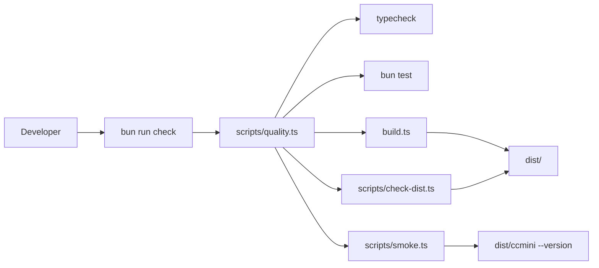
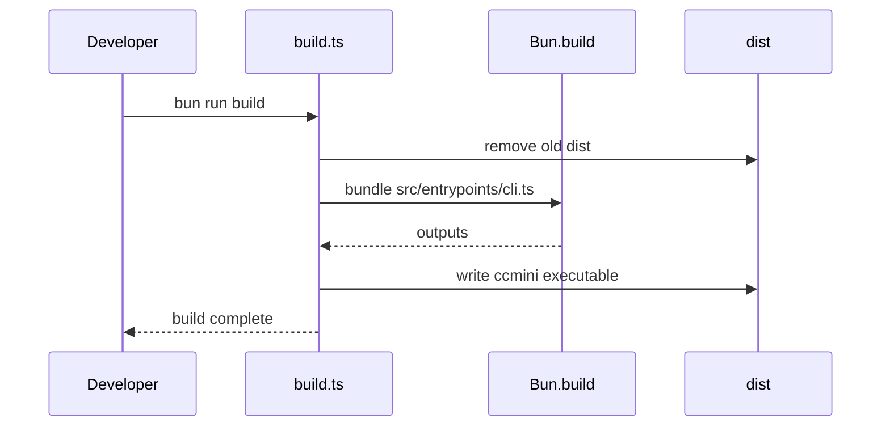
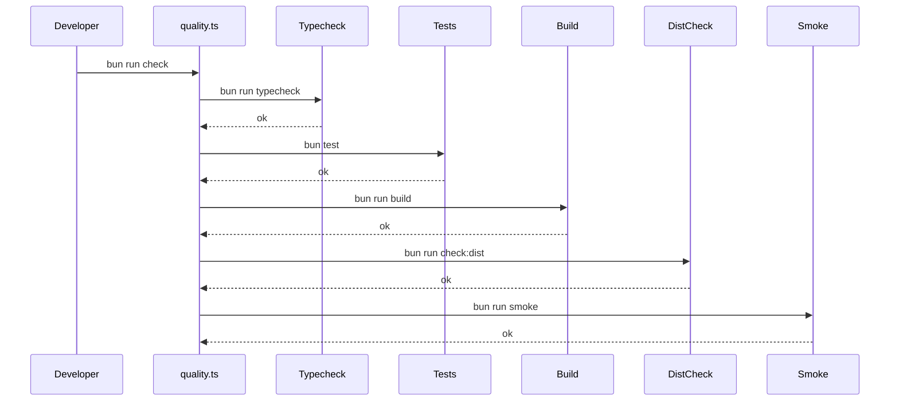

# 第 16 章：实现质量门禁与发布构建

## 本章目标

第 15 章之后，Claude Code Mini 已经具备完整主流程：

```text
用户输入
  -> Agent Loop
  -> 模型请求工具
  -> ToolRunner
  -> Permission Prompt
  -> Sandbox
  -> Tool 执行
  -> tool_result
  -> 模型继续
  -> 最终总结
```

但一个能在本机跑通的 Agent，还不能算“可交付”。

真实项目必须能回答四个问题：

- 改动有没有破坏类型？
- 核心工具和策略有没有回归？
- 构建产物是否真的能启动？
- 发布前能不能一条命令跑完检查？

本章给 Mini 增加工程化质量门禁：

- 新增 `build.ts`，用 `Bun.build()` 生成 `dist/`。
- 新增 `scripts/check-dist.ts`，检查构建产物入口和 chunk 引用。
- 新增 `scripts/smoke.ts`，验证构建后的 CLI 能启动。
- 新增 `scripts/quality.ts`，串联类型检查、测试、构建、产物检查和 smoke test。
- 补上 Sandbox 与 Permission 的关键单元测试。
- 给 `package.json` 增加稳定脚本。

完成后，读者可以在 Mini 项目里运行：

```bash
bun run check
```

它会完成发布前最小质量门禁。

---

## 本章完成效果

新增脚本后，运行：

```bash
bun run check
```

你会看到类似输出：

```text
▶ typecheck
✓ typecheck

▶ test
✓ test

▶ build
✓ build

▶ check:dist
✓ check:dist

▶ smoke
✓ smoke

All quality checks passed.
```

构建产物会出现在：

```text
dist/
  cli.js
  ccmini
```

可以直接运行：

```bash
bun dist/ccmini --version
```

看到：

```text
0.1.0 (Claude Code Mini)
```

如果构建产物缺失、入口不可执行、chunk 引用断裂，`bun run check` 会失败。

这章的重点不是写很多测试。

而是先建立一条稳定质量链：

```text
类型 -> 单测 -> 构建 -> 产物检查 -> 启动验证
```

---

## 本章项目结构变化

本章新增 `scripts/` 和 `tests/`：

```bash
claude-code-mini/
  build.ts                  # 新增：Bun 构建脚本
  package.json              # 修改：新增 build / check / smoke 等脚本
  scripts/
    check-dist.ts           # 新增：检查 dist 产物完整性
    quality.ts              # 新增：串联质量门禁
    smoke.ts                # 新增：运行构建后 CLI 做 smoke test
  tests/
    permissions.test.ts     # 新增：权限 key 与 session allow 测试
    sandbox.test.ts         # 新增：路径边界与命令策略测试
```

本章不新增依赖。

继续使用 Bun 自带测试能力：

```bash
bun test
```

---

## 为什么需要这个模块

Coding Agent 项目最容易出现一种错觉：

```text
刚才演示跑通了，所以系统没问题。
```

这不可靠。

Mini 现在已经有很多跨模块调用：

- CLI 参数进入 ChatSession。
- ChatSession 注入 Planner、Sandbox、PermissionStore。
- AgentLoop 调模型。
- ToolRunner 校验输入和权限。
- Tool 执行文件和命令。
- SessionStore 写 transcript。

这些模块任何一个接口变了，都可能让完整任务中途断掉。

质量门禁要解决的是：

```text
每次改动后，用固定命令确认核心链路仍然成立。
```

真实工程也有类似做法。

当前参考项目里能看到几类质量脚本：

- `build.ts`：用 `Bun.build()` 输出 `dist/`。
- `scripts/check-bundle-integrity.ts`：扫描构建产物，检查断裂引用和运行时缺失模块。
- `scripts/smoke-test-commands.ts`：加载命令模块，验证命令能被解析和调用。
- `scripts/defines.ts`：集中管理构建宏和默认 feature。
- `biome.json` 与 `tsconfig.json`：把格式、类型和源码范围固定下来。

Mini 不需要一次复刻全部。

本章只实现最小但有效的一条线。

---

## 整体架构



质量门禁分成五层：

```text
typecheck
  -> 单测
  -> 构建
  -> 产物结构检查
  -> CLI smoke test
```

顺序不能乱。

例如类型检查已经失败，就不需要继续构建。

构建失败，也不需要继续 smoke test。

所以 `quality.ts` 应该串行执行，并在第一处失败时退出。

---

## 核心流程

### 1. 构建流程



### 2. 质量门禁流程



### 3. 失败路径

任何一步失败，直接停止：

```text
typecheck failed
  -> quality.ts exit 1
  -> 不继续 test / build / smoke
```

这能让错误定位更快。

---

## 完整核心代码

### package.json

修改脚本区。

如果前面章节已经有 `dev` 和 `typecheck`，保留它们，只新增这些：

```json
{
  "scripts": {
    "dev": "bun run src/entrypoints/cli.ts",
    "typecheck": "tsc --noEmit",
    "test": "bun test",
    "build": "bun run build.ts",
    "check:dist": "bun run scripts/check-dist.ts",
    "smoke": "bun run scripts/smoke.ts",
    "check": "bun run scripts/quality.ts"
  }
}
```

这里故意让 `check` 调 `scripts/quality.ts`。

不要把所有命令直接写成一长串。

质量门禁迟早会需要：

- 计时。
- 失败摘要。
- 跳过某些慢检查。
- 输出更清晰的日志。

这些都应该在脚本里做。

### build.ts

新增文件：

```ts
import { chmod, rm, writeFile } from "node:fs/promises";
import { join } from "node:path";

const outdir = "dist";

await rm(outdir, { recursive: true, force: true });

const result = await Bun.build({
  entrypoints: ["src/entrypoints/cli.ts"],
  outdir,
  target: "bun",
  splitting: true,
  sourcemap: "linked",
  define: {
    "process.env.NODE_ENV": JSON.stringify("production"),
  },
});

if (!result.success) {
  console.error("Build failed:");

  for (const log of result.logs) {
    console.error(log);
  }

  process.exit(1);
}

const executablePath = join(outdir, "ccmini");

await writeFile(
  executablePath,
  "#!/usr/bin/env bun\nimport './cli.js';\n",
);

await chmod(executablePath, 0o755);

console.log(`Built ${result.outputs.length} files into ${outdir}/`);
console.log(`Generated ${executablePath}`);
```

这和真实工程的 `build.ts` 思路一致：

- 清理旧产物。
- 用 `Bun.build()` 打包入口。
- 输出 `dist/`。
- 生成带 shebang 的可执行入口。

真实工程还做了更多事：

- 替换 `import.meta.require`。
- 修补某些运行时兼容问题。
- 复制 native addon 和内置二进制。
- 生成多运行时入口。

Mini 暂时不需要这些。

本章只要保证 Bun 运行时下可执行。

### scripts/check-dist.ts

新增文件：

```ts
import { access, readdir, readFile, stat } from "node:fs/promises";
import { join } from "node:path";

const distDir = "dist";

await assertFile(join(distDir, "cli.js"));
await assertFile(join(distDir, "ccmini"));
await assertExecutable(join(distDir, "ccmini"));
await assertNoBrokenLocalImports(distDir);

console.log("dist check passed");

async function assertFile(path: string): Promise<void> {
  try {
    const info = await stat(path);

    if (!info.isFile()) {
      throw new Error(`${path} is not a file`);
    }
  } catch {
    throw new Error(`Missing build artifact: ${path}`);
  }
}

async function assertExecutable(path: string): Promise<void> {
  await access(path);

  const content = await readFile(path, "utf8");

  if (!content.startsWith("#!/usr/bin/env bun")) {
    throw new Error(`${path} does not start with Bun shebang`);
  }
}

async function assertNoBrokenLocalImports(distDir: string): Promise<void> {
  const files = (await readdir(distDir)).filter(file => file.endsWith(".js"));
  const fileSet = new Set(files);
  const importPattern = /(?:from\s+|import\s*)["']\.\/([^"']+\.js)["']/g;

  for (const file of files) {
    const content = await readFile(join(distDir, file), "utf8");

    for (const match of content.matchAll(importPattern)) {
      const target = match[1];

      if (!fileSet.has(target)) {
        throw new Error(`${file} imports missing file: ${target}`);
      }
    }
  }
}
```

这个脚本参考真实工程的 `scripts/check-bundle-integrity.ts`，但只保留 Mini 需要的最小检查：

- `dist/cli.js` 存在。
- `dist/ccmini` 存在。
- 可执行入口 shebang 正确。
- 本地 chunk 引用没有断链。

为什么要查 chunk？

因为 `Bun.build({ splitting: true })` 会生成多个文件。

如果构建后移动、删除或发布时漏掉 chunk，CLI 启动时才会炸。

发布前检查更早发现问题。

### scripts/smoke.ts

新增文件：

```ts
type RunResult = {
  exitCode: number;
  stdout: string;
  stderr: string;
};

await assertCommand(["dist/ccmini", "--version"], output => {
  if (!output.stdout.includes("Claude Code Mini")) {
    throw new Error("version output does not include product name");
  }
});

await assertCommand(["dist/ccmini", "--help"], output => {
  if (!output.stdout.includes("Usage")) {
    throw new Error("help output does not include Usage");
  }
});

console.log("smoke test passed");

async function assertCommand(
  command: string[],
  assertOutput: (output: RunResult) => void,
): Promise<void> {
  const result = await run(command);

  if (result.exitCode !== 0) {
    throw new Error(
      [
        `Command failed: ${command.join(" ")}`,
        `exitCode: ${result.exitCode}`,
        result.stderr,
      ]
        .filter(Boolean)
        .join("\n"),
    );
  }

  assertOutput(result);
}

async function run(command: string[]): Promise<RunResult> {
  const proc = Bun.spawn(command, {
    stdout: "pipe",
    stderr: "pipe",
  });

  const [stdout, stderr, exitCode] = await Promise.all([
    new Response(proc.stdout).text(),
    new Response(proc.stderr).text(),
    proc.exited,
  ]);

  return { stdout, stderr, exitCode };
}
```

Smoke test 只验证离线能力。

不要在 smoke test 里真实请求模型。

原因很直接：

- 需要密钥。
- 依赖网络。
- 成本不可控。
- 失败原因不稳定。

发布前的 smoke test 应该先回答：

```text
构建后的 CLI 能不能启动？
基础参数能不能工作？
```

模型调用可以放到单独的手动验收里。

### scripts/quality.ts

新增文件：

```ts
type Step = {
  name: string;
  command: string[];
};

const steps: Step[] = [
  { name: "typecheck", command: ["bun", "run", "typecheck"] },
  { name: "test", command: ["bun", "test"] },
  { name: "build", command: ["bun", "run", "build"] },
  { name: "check:dist", command: ["bun", "run", "check:dist"] },
  { name: "smoke", command: ["bun", "run", "smoke"] },
];

for (const step of steps) {
  await runStep(step);
}

console.log("");
console.log("All quality checks passed.");

async function runStep(step: Step): Promise<void> {
  console.log("");
  console.log(`▶ ${step.name}`);

  const startedAt = Date.now();
  const proc = Bun.spawn(step.command, {
    stdout: "inherit",
    stderr: "inherit",
  });

  const exitCode = await proc.exited;
  const durationMs = Date.now() - startedAt;

  if (exitCode !== 0) {
    console.error(`✗ ${step.name} failed in ${durationMs}ms`);
    process.exit(exitCode);
  }

  console.log(`✓ ${step.name} passed in ${durationMs}ms`);
}
```

这里没有用 shell 字符串拼接。

每一步都是数组：

```ts
["bun", "run", "typecheck"]
```

这样参数边界更清楚，也避免 shell 转义问题。

### tests/sandbox.test.ts

新增文件：

```ts
import { describe, expect, test } from "bun:test";
import { resolveWorkspacePath } from "../src/sandbox/path";
import { SandboxPolicyEngine } from "../src/sandbox/policy";

describe("resolveWorkspacePath", () => {
  test("allows paths inside workspace", () => {
    const cwd = "/repo";

    expect(resolveWorkspacePath(cwd, "src/main.ts")).toBe(
      "/repo/src/main.ts",
    );
  });

  test("rejects parent traversal", () => {
    const cwd = "/repo";

    expect(() => resolveWorkspacePath(cwd, "../outside.txt")).toThrow(
      "Path is outside workspace",
    );
  });

  test("rejects sibling prefix tricks", () => {
    const cwd = "/repo";

    expect(() => resolveWorkspacePath(cwd, "/repo-old/file.txt")).toThrow(
      "Path is outside workspace",
    );
  });
});

describe("SandboxPolicyEngine", () => {
  const sandbox = new SandboxPolicyEngine({
    cwd: "/repo",
    mode: "workspace_write",
    commandTimeoutMs: 30_000,
    maxOutputBytes: 64 * 1024,
  });

  test("allows read-only commands", () => {
    expect(sandbox.decideCommand("git status").behavior).toBe("allow");
    expect(sandbox.decideCommand("rg hello src").behavior).toBe("allow");
  });

  test("asks before shell writes", () => {
    expect(sandbox.decideCommand("touch tmp/a.txt").behavior).toBe("ask");
  });

  test("denies hard dangerous commands", () => {
    expect(sandbox.decideCommand("rm -rf /").behavior).toBe("deny");
  });
});
```

这些测试覆盖第 14 章最关键的安全边界。

尤其是这个用例：

```text
/repo-old
```

它能防止用字符串前缀误判工作区路径。

### tests/permissions.test.ts

新增文件：

```ts
import { describe, expect, test } from "bun:test";
import { approvalKeyForToolInput } from "../src/permissions/keys";
import { PermissionStore } from "../src/permissions/store";

describe("approvalKeyForToolInput", () => {
  test("uses command as run_command key", () => {
    expect(
      approvalKeyForToolInput("run_command", {
        command: "touch tmp/a.txt",
      }),
    ).toBe("run_command:touch tmp/a.txt");
  });

  test("uses path as write_file key", () => {
    expect(
      approvalKeyForToolInput("write_file", {
        path: "tmp/a.txt",
        content: "large content should not be part of key",
      }),
    ).toBe("write_file:tmp/a.txt");
  });
});

describe("PermissionStore", () => {
  test("stores session allow keys", () => {
    const store = new PermissionStore();

    expect(store.hasSessionAllow("run_command:touch tmp/a.txt")).toBe(false);

    store.addSessionAllow("run_command:touch tmp/a.txt");

    expect(store.hasSessionAllow("run_command:touch tmp/a.txt")).toBe(true);
  });
});
```

这些测试覆盖第 15 章的权限闭环基础。

尤其是 `write_file` 的 key：

```text
write_file:path
```

它确认不会把大段文件内容塞进授权 key。

---

## 逐步实现

### 第一步：先加 build.ts

先写 `build.ts`，然后运行：

```bash
bun run build
```

确认生成：

```text
dist/cli.js
dist/ccmini
```

再运行：

```bash
bun dist/ccmini --version
```

如果这里不通，先不要继续写 quality 脚本。

构建是后面所有检查的基础。

### 第二步：加 check-dist

新增 `scripts/check-dist.ts` 后运行：

```bash
bun run check:dist
```

这一步不应该请求模型，不应该读用户配置。

它只检查构建产物结构。

### 第三步：加 smoke test

新增 `scripts/smoke.ts` 后运行：

```bash
bun run smoke
```

它只跑：

```text
dist/ccmini --version
dist/ccmini --help
```

这两个命令不依赖网络，也不依赖密钥。

### 第四步：补单元测试

新增：

```text
tests/sandbox.test.ts
tests/permissions.test.ts
```

运行：

```bash
bun test
```

如果路径测试在 Windows 路径上失败，先把测试里的 cwd 改成用 `resolve()` 生成。

本教程为了简化展示，用 POSIX 路径写法。

真实跨平台项目要单独处理路径差异。

### 第五步：串联 quality.ts

最后新增 `scripts/quality.ts`，运行：

```bash
bun run check
```

这应该成为以后每章结束后的默认检查。

---

## 关键源码分析

### build.ts

真实工程的 `build.ts` 使用 `Bun.build()`，入口是 `src/entrypoints/cli.tsx`，输出到 `dist/`，并开启 `splitting`。

构建后它还会做产物后处理：

- 修补运行时兼容代码。
- 复制 vendored 文件。
- 生成不同入口。
- 设置可执行权限。

Mini 本章复用核心思想：

```text
构建入口 -> 输出 dist -> 生成可执行入口
```

不复制复杂兼容逻辑。

因为 Mini 只承诺 Bun 运行时。

### scripts/check-bundle-integrity.ts

真实工程的 bundle 检查会扫描：

- 断裂 chunk 引用。
- 未被打包的第三方模块。
- 运行时专用模块误入产物。

Mini 的 `check-dist.ts` 只检查断裂本地引用。

这已经覆盖本教程最容易出错的问题：

```text
dist/cli.js import 了一个不存在的 chunk。
```

以后如果 Mini 要发布成更复杂的包，再扩展第三方模块扫描。

### scripts/smoke-test-commands.ts

真实工程的 smoke 脚本会动态加载命令模块，确认命令可见、可加载、能调用。

Mini 没有那么多 slash command。

本章只对最终 CLI 做 smoke：

```text
--version
--help
```

这两个检查很小，但很有价值。

它们能发现：

- 构建入口找不到。
- shebang 不正确。
- dist 缺 chunk。
- CLI 快速路径崩溃。

### scripts/defines.ts

真实工程把构建宏集中在 `scripts/defines.ts`。

Mini 现在只有一个版本号和生产模式，不需要独立宏文件。

但如果后续要加 feature flag，应该参考这个做法：

```text
不要在 build.ts 里散落硬编码 feature。
```

把宏和默认开关集中管理。

### tsconfig 与 Biome

真实工程的 `tsconfig.json` 开启 strict，`biome.json` 负责格式和 lint 规则。

Mini 本章至少要坚持：

```text
tsc --noEmit 必须通过。
```

格式检查可以后续再加。

原因是教程项目还在快速演进，先把类型和行为质量链跑起来更重要。

---

## 调试与验证

### 1. 类型检查

```bash
bun run typecheck
```

必须通过。

### 2. 单元测试

```bash
bun test
```

至少应看到 sandbox 和 permissions 测试通过。

### 3. 构建

```bash
bun run build
```

期望生成：

```text
dist/cli.js
dist/ccmini
```

### 4. 产物检查

```bash
bun run check:dist
```

期望：

```text
dist check passed
```

### 5. smoke test

```bash
bun run smoke
```

期望：

```text
smoke test passed
```

### 6. 完整质量门禁

```bash
bun run check
```

期望：

```text
All quality checks passed.
```

---

## 常见问题

### `dist/ccmini` 不存在

先确认是否运行过：

```bash
bun run build
```

如果运行过仍然不存在，检查 `build.ts` 是否写入了：

```text
dist/ccmini
```

### smoke test 里 `--help` 失败

先直接运行：

```bash
bun dist/ccmini --help
```

如果直接运行也失败，说明问题在 CLI 快速路径或构建产物，不在 smoke 脚本。

### `check-dist` 报 chunk 缺失

通常是 `dist/` 里少了构建生成的某个 `.js` 文件。

重新运行：

```bash
bun run build
```

如果仍然失败，检查 `Bun.build()` 是否开启了 splitting，以及是否有构建后脚本误删产物。

### 单元测试路径在不同系统失败

本章测试用 POSIX 路径展示实现思路。

如果你要跨平台稳定运行，测试里用 `resolve()` 生成 cwd 和目标路径。

生产代码仍然应该使用 `node:path` 的 `resolve()`、`relative()`、`isAbsolute()`。

### 为什么 smoke test 不调用真实模型？

发布前 smoke test 应该稳定、快速、低成本。

真实模型调用依赖密钥、网络和额度。

把它放进默认门禁，会让本地开发变慢，也会制造不稳定失败。

模型链路可以做手动验收，或放进单独的可选检查。

---

## 本章小结

本章把 Claude Code Mini 从“功能跑通”推进到“可以交付前自检”。

新增能力包括：

- `build.ts` 构建产物。
- `scripts/check-dist.ts` 检查 dist 完整性。
- `scripts/smoke.ts` 验证构建后的 CLI 能启动。
- `scripts/quality.ts` 串联完整质量门禁。
- `tests/sandbox.test.ts` 覆盖安全边界。
- `tests/permissions.test.ts` 覆盖权限授权基础。

现在 Mini 的开发闭环变成：

```text
实现功能
  -> bun run check
  -> 修复失败
  -> 再提交 / 发布
```

第 15 章让 Mini 成为一个完整 Agent。

第 16 章让 Mini 有了工程交付底线。

下一章可以继续扩展真实 Claude Code 的高级能力，例如 Memory、模型路由、插件系统或 MCP。
