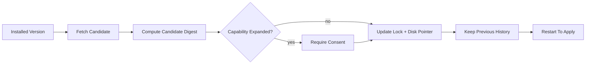
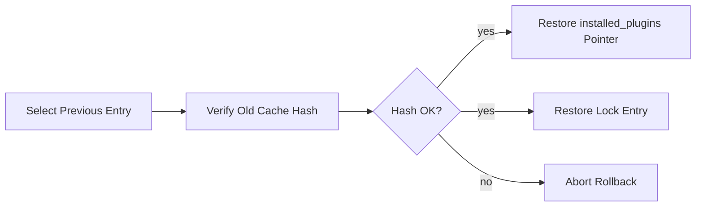

# 第 63 章：扩展供应链 v2：MCPB、Lockfile、安装授权与回滚

第 62 章已经把插件、Skill、Agent、Hook 纳入统一策略治理。

但策略治理只回答：

```txt
这个扩展能力现在允不允许启用？
```

它还没有回答：

```txt
我现在加载的扩展，真的是我当初安装和授权的那一份吗？
```

这就是第 63 章要补的供应链 v2。

官方级 Claude Code 不是只靠“用户信任这个插件”。

它至少需要把这些事实稳定记录下来：

```txt
插件来自哪个 marketplace
marketplace 当时解析到哪个 revision
插件目录当时的文件树 hash 是什么
plugin manifest 当时声明了哪些组件
MCPB bundle 当时的内容 hash 是什么
用户当时同意了哪些能力
更新后能力有没有扩大
回滚时要恢复哪一组安装记录和锁记录
```

这一章会做一个 Mini 版但结构正确的实现。

目标不是写一个完整的签名基础设施，而是先建立官方级工程里最关键的四层：

```txt
lockfile
install-time consent
load-time integrity check
rollback history
```

## 本章目标

完成后，Mini 会具备这些能力：

```txt
1. 为 plugin / MCPB / agent / skill / hook 生成扩展锁记录
2. 对插件目录生成 deterministic tree hash
3. 对 MCPB bundle 生成完整 sha256，而不是只用短 hash
4. 安装时展示组件能力摘要，并记录 consent digest
5. 更新时区分 metadata-only change 与 capability expansion
6. 加载时按 lockfile 校验扩展内容
7. 校验失败时按 policy fail-closed 或降级禁用
8. 插件更新采用 non-inplace，并保留可回滚历史
9. 回滚前重新校验旧版本 hash
10. 把供应链事件写入 audit timeline
```

## 为什么第 62 章还不够

第 62 章的核心是：

```txt
ExtensionPolicyEngine
```

它根据 source trust 和 enterprise policy 做 allow / deny / strip。

但它默认“source 声称的东西是真的”。

比如：

```txt
marketplace 说插件版本是 1.2.0
plugin.json 说只有一个 command
MCPB manifest 说 server command 是 ./server
用户同意安装 review-tools
```

这些声明在后续都可能变化：

```txt
marketplace 被更新
git ref 指向新 commit
插件目录被本地篡改
MCPB URL 重新返回不同字节
plugin.json 新增 Hook
MCP server env 新增敏感字段
```

如果 Mini 只在安装时看一眼，启动时直接加载，就会出现供应链绕过：

```txt
安装时安全
运行时变成另一份内容
```

所以官方级实现要把“安装时看到的事实”固化成锁记录。

## 当前源码里的基础

项目里已经有不少可以复用的基础。

插件安装状态在：

```txt
src/utils/plugins/installedPluginsManager.ts
```

它已经有：

```txt
installed_plugins.json
version: 2
pluginId -> installation[]
scope
installPath
version
gitCommitSha
installedAt
lastUpdated
```

插件版本计算在：

```txt
src/utils/plugins/pluginVersioning.ts
```

它按优先级使用：

```txt
manifest.version
marketplace entry version
git commit sha
unknown
```

插件缓存和孤儿版本清理在：

```txt
src/utils/plugins/cacheUtils.ts
```

它已经会把旧版本标记为：

```txt
.orphaned_at
```

插件更新在：

```txt
src/services/plugins/pluginOperations.ts
```

它已经是 non-inplace：

```txt
新版本写入新的 versioned cache path
disk installed_plugins.json 指向新版本
当前进程内存继续使用旧版本
重启后新版本生效
```

MCPB 处理在：

```txt
src/utils/plugins/mcpbHandler.ts
```

它已经做了：

```txt
下载 bundle
解压 archive
解析 manifest.json
生成 contentHash
保存 cache metadata
处理 user_config
sensitive 字段进入 secure storage
```

marketplace policy 在：

```txt
src/utils/plugins/marketplaceHelpers.ts
```

它已经支持：

```txt
strictKnownMarketplaces
blockedMarketplaces
hostPattern
pathPattern
```

这些都很好。

但还差一层：

```txt
把安装时的事实固化，并在加载时强校验。
```

## 供应链 v2 的整体结构

新增一个安全层：

```txt
src/extensions/supplyChain/
  lockfile.ts
  hashTree.ts
  capabilityDigest.ts
  consent.ts
  verifier.ts
  rollback.ts
  audit.ts
  __tests__/
```

数据流：


更新路径：



回滚路径：



## Lockfile 放在哪里

Mini 可以使用项目级锁文件：

```txt
.claude/extension-lock.json
```

也可以有用户级锁文件：

```txt
~/.claude/extension-lock.json
```

这一章先采用一个简单规则：

```txt
user scope plugin -> 用户级锁文件
project scope plugin -> 项目级锁文件
local scope plugin -> 本地设置旁边的锁文件
managed scope plugin -> managed policy lock
```

为了教程简单，先实现一个通用路径函数。

```ts
// src/extensions/supplyChain/lockfile.ts
import { mkdir, readFile, rename, writeFile } from 'fs/promises';
import { dirname, join } from 'path';
import { z } from 'zod';

export const ExtensionSurfaceSchema = z.enum([
  'plugin',
  'mcpb',
  'skill',
  'agent',
  'hook',
  'lsp',
]);

export type ExtensionSurface = z.infer<typeof ExtensionSurfaceSchema>;

export const ExtensionLockEntrySchema = z.object({
  id: z.string().min(1),
  surface: ExtensionSurfaceSchema,
  source: z.object({
    marketplace: z.string().optional(),
    sourceType: z.string().optional(),
    sourceRef: z.string().optional(),
    resolvedRevision: z.string().optional(),
    url: z.string().optional(),
    path: z.string().optional(),
  }),
  version: z.string().optional(),
  installPath: z.string().min(1),
  manifestHash: z.string().min(16),
  treeHash: z.string().min(16).optional(),
  bundleHash: z.string().min(16).optional(),
  capabilityDigest: z.string().min(16),
  consentDigest: z.string().min(16).optional(),
  policyVersion: z.string().optional(),
  lockedAt: z.string().datetime(),
  lockedBy: z.enum(['user', 'project', 'local', 'managed']),
});

export type ExtensionLockEntry = z.infer<typeof ExtensionLockEntrySchema>;

export const ExtensionLockFileSchema = z.object({
  version: z.literal(1),
  generatedAt: z.string().datetime(),
  entries: z.record(z.string(), ExtensionLockEntrySchema),
});

export type ExtensionLockFile = z.infer<typeof ExtensionLockFileSchema>;

export function emptyExtensionLockFile(): ExtensionLockFile {
  return {
    version: 1,
    generatedAt: new Date().toISOString(),
    entries: {},
  };
}

export async function loadExtensionLockFile(
  lockPath: string,
): Promise<ExtensionLockFile> {
  try {
    const raw = await readFile(lockPath, 'utf8');
    return ExtensionLockFileSchema.parse(JSON.parse(raw));
  } catch (error) {
    if (isMissingFile(error)) {
      return emptyExtensionLockFile();
    }
    throw error;
  }
}

export async function saveExtensionLockFile(
  lockPath: string,
  file: ExtensionLockFile,
): Promise<void> {
  const parsed = ExtensionLockFileSchema.parse({
    ...file,
    generatedAt: new Date().toISOString(),
  });
  await mkdir(dirname(lockPath), { recursive: true });

  const tempPath = `${lockPath}.${Date.now()}.tmp`;
  await writeFile(tempPath, JSON.stringify(parsed, null, 2), 'utf8');
  await rename(tempPath, lockPath);
}

export async function upsertLockEntry(
  lockPath: string,
  entry: ExtensionLockEntry,
): Promise<void> {
  const file = await loadExtensionLockFile(lockPath);
  file.entries[entry.id] = entry;
  await saveExtensionLockFile(lockPath, file);
}

export async function getLockEntry(
  lockPath: string,
  id: string,
): Promise<ExtensionLockEntry | null> {
  const file = await loadExtensionLockFile(lockPath);
  return file.entries[id] ?? null;
}

function isMissingFile(error: unknown): boolean {
  return (
    typeof error === 'object' &&
    error !== null &&
    'code' in error &&
    error.code === 'ENOENT'
  );
}

export function getExtensionLockPath(baseDir: string): string {
  return join(baseDir, '.claude', 'extension-lock.json');
}
```

注意这里有两个重要决定。

第一，lockfile 不是替代 `installed_plugins.json`。

```txt
installed_plugins.json 记录当前使用哪个 installPath
extension-lock.json 记录这个 installPath 应该是什么内容
```

第二，lockfile 不直接保存 secret。

```txt
userConfig sensitive value 不进入 lockfile
只保存 schema digest 和 consent digest
```

## deterministic tree hash

插件目录 hash 不能直接对目录做 hash。

要先定义稳定规则：

```txt
递归读取所有普通文件
路径统一使用 /
按路径排序
忽略 .git
忽略临时 cache
记录 path + sha256(file bytes)
再对这个列表做 sha256
```

新增：

```ts
// src/extensions/supplyChain/hashTree.ts
import { createHash } from 'crypto';
import { readdir, readFile, stat } from 'fs/promises';
import { join, relative, sep } from 'path';

type FileHashEntry = {
  path: string;
  sha256: string;
  size: number;
};

const IGNORED_NAMES = new Set([
  '.git',
  '.mcpb-cache',
  '.orphaned_at',
  '.DS_Store',
]);

export async function sha256Bytes(data: Uint8Array): Promise<string> {
  return createHash('sha256').update(data).digest('hex');
}

export async function sha256Text(text: string): Promise<string> {
  return sha256Bytes(new TextEncoder().encode(text));
}

export async function hashFile(path: string): Promise<string> {
  const data = await readFile(path);
  return sha256Bytes(data);
}

export async function hashJsonStable(value: unknown): Promise<string> {
  return sha256Text(stableStringify(value));
}

export async function hashDirectoryTree(root: string): Promise<string> {
  const entries = await collectFileHashes(root, root);
  entries.sort((a, b) => a.path.localeCompare(b.path));
  return hashJsonStable(entries);
}

async function collectFileHashes(
  root: string,
  current: string,
): Promise<FileHashEntry[]> {
  const dirents = await readdir(current, { withFileTypes: true });
  const result: FileHashEntry[] = [];

  for (const dirent of dirents) {
    if (IGNORED_NAMES.has(dirent.name)) {
      continue;
    }

    const fullPath = join(current, dirent.name);

    if (dirent.isDirectory()) {
      result.push(...(await collectFileHashes(root, fullPath)));
      continue;
    }

    if (!dirent.isFile()) {
      continue;
    }

    const fileStat = await stat(fullPath);
    const rel = relative(root, fullPath).split(sep).join('/');
    result.push({
      path: rel,
      sha256: await hashFile(fullPath),
      size: fileStat.size,
    });
  }

  return result;
}

export function stableStringify(value: unknown): string {
  return JSON.stringify(sortDeep(value));
}

function sortDeep(value: unknown): unknown {
  if (Array.isArray(value)) {
    return value.map(sortDeep);
  }

  if (value && typeof value === 'object') {
    return Object.fromEntries(
      Object.entries(value as Record<string, unknown>)
        .sort(([a], [b]) => a.localeCompare(b))
        .map(([key, inner]) => [key, sortDeep(inner)]),
    );
  }

  return value;
}
```

为什么要 hash 文件列表，而不是只 hash zip？

因为插件可能来自：

```txt
git checkout
local directory
marketplace local source
zip cache extraction
MCPB extraction
```

统一成 tree hash 后，加载阶段只关心：

```txt
最终目录内容是否和安装时一致
```

## manifest hash

tree hash 粒度更大。

manifest hash 更适合判断能力声明有没有变化。

```ts
// src/extensions/supplyChain/manifestHash.ts
import { readFile } from 'fs/promises';
import { join } from 'path';
import { hashJsonStable } from './hashTree.js';

export async function hashPluginManifest(pluginPath: string): Promise<string> {
  const raw = await readFile(
    join(pluginPath, '.claude-plugin', 'plugin.json'),
    'utf8',
  );
  return hashJsonStable(JSON.parse(raw));
}

export async function hashMcpbManifest(extractedPath: string): Promise<string> {
  const raw = await readFile(join(extractedPath, 'manifest.json'), 'utf8');
  return hashJsonStable(JSON.parse(raw));
}
```

加载时如果 tree hash 没变，manifest hash 一定不变。

但更新比较时，manifest hash 很有用：

```txt
treeHash 变化
manifestHash 不变
=> 可能只是 README 或实现文件变化

manifestHash 变化
capabilityDigest 也变化
=> 能力声明变化，可能需要重新授权
```

## capability digest

安装授权不应该把所有文件展示给用户。

用户真正需要确认的是：

```txt
这个扩展会带来哪些能力？
```

定义一个能力摘要：

```ts
// src/extensions/supplyChain/capabilityDigest.ts
import { hashJsonStable } from './hashTree.js';

export type ExtensionCapabilityDisclosure = {
  commands: string[];
  agents: Array<{
    name: string;
    tools: string[];
    hasHooks: boolean;
    hasMcpServers: boolean;
  }>;
  skills: Array<{
    name: string;
    allowedTools: string[];
    hasHooks: boolean;
  }>;
  hooks: Array<{
    event: string;
    matcher?: string;
    commandLike: boolean;
    networkLike: boolean;
  }>;
  mcpServers: Array<{
    name: string;
    transport: string;
    hasSensitiveConfig: boolean;
  }>;
  lspServers: string[];
  settingsKeys: string[];
  outputStyles: string[];
};

export function emptyDisclosure(): ExtensionCapabilityDisclosure {
  return {
    commands: [],
    agents: [],
    skills: [],
    hooks: [],
    mcpServers: [],
    lspServers: [],
    settingsKeys: [],
    outputStyles: [],
  };
}

export async function computeCapabilityDigest(
  disclosure: ExtensionCapabilityDisclosure,
): Promise<string> {
  return hashJsonStable(normalizeDisclosure(disclosure));
}

export function normalizeDisclosure(
  disclosure: ExtensionCapabilityDisclosure,
): ExtensionCapabilityDisclosure {
  return {
    commands: [...disclosure.commands].sort(),
    agents: disclosure.agents
      .map(agent => ({
        ...agent,
        tools: [...agent.tools].sort(),
      }))
      .sort((a, b) => a.name.localeCompare(b.name)),
    skills: disclosure.skills
      .map(skill => ({
        ...skill,
        allowedTools: [...skill.allowedTools].sort(),
      }))
      .sort((a, b) => a.name.localeCompare(b.name)),
    hooks: [...disclosure.hooks].sort((a, b) =>
      `${a.event}:${a.matcher ?? ''}`.localeCompare(
        `${b.event}:${b.matcher ?? ''}`,
      ),
    ),
    mcpServers: [...disclosure.mcpServers].sort((a, b) =>
      a.name.localeCompare(b.name),
    ),
    lspServers: [...disclosure.lspServers].sort(),
    settingsKeys: [...disclosure.settingsKeys].sort(),
    outputStyles: [...disclosure.outputStyles].sort(),
  };
}
```

这个 digest 的意义是：

```txt
用户同意的不是某个版本号
用户同意的是能力集合
```

如果扩展更新后只是修复 bug，不新增能力，可以静默更新。

如果扩展更新后新增 Hook、MCP server、Agent tool，就必须重新确认。

## 从 plugin manifest 构建 disclosure

插件 manifest 已经有 commands、agents、skills、hooks、mcpServers、lspServers 等字段。

Mini 可以从 manifest 里构建能力摘要。

```ts
// src/extensions/supplyChain/pluginDisclosure.ts
import type { PluginManifest } from '../../types/plugin.js';
import {
  emptyDisclosure,
  type ExtensionCapabilityDisclosure,
} from './capabilityDigest.js';

export function buildPluginDisclosure(
  manifest: PluginManifest,
): ExtensionCapabilityDisclosure {
  const disclosure = emptyDisclosure();

  if (manifest.commands) {
    if (Array.isArray(manifest.commands)) {
      disclosure.commands.push(...manifest.commands);
    } else {
      disclosure.commands.push(...Object.keys(manifest.commands));
    }
  }

  if (manifest.agents) {
    const agents = Array.isArray(manifest.agents)
      ? manifest.agents
      : Object.keys(manifest.agents);

    for (const name of agents) {
      disclosure.agents.push({
        name,
        tools: ['declared-in-agent-frontmatter'],
        hasHooks: false,
        hasMcpServers: false,
      });
    }
  }

  if (manifest.skills) {
    const skills = Array.isArray(manifest.skills)
      ? manifest.skills
      : Object.keys(manifest.skills);

    for (const name of skills) {
      disclosure.skills.push({
        name,
        allowedTools: ['declared-in-skill-frontmatter'],
        hasHooks: false,
      });
    }
  }

  if (manifest.hooks) {
    for (const [event, matchers] of Object.entries(manifest.hooks)) {
      for (const matcher of matchers ?? []) {
        disclosure.hooks.push({
          event,
          matcher: matcher.matcher,
          commandLike: true,
          networkLike: hasNetworkLikeHook(matcher),
        });
      }
    }
  }

  if (manifest.mcpServers) {
    for (const [name, server] of Object.entries(manifest.mcpServers)) {
      disclosure.mcpServers.push({
        name,
        transport: 'type' in server ? String(server.type) : 'stdio',
        hasSensitiveConfig: JSON.stringify(server).includes('user_config'),
      });
    }
  }

  if (manifest.lspServers) {
    disclosure.lspServers.push(...Object.keys(manifest.lspServers));
  }

  if (manifest.settings) {
    disclosure.settingsKeys.push(...Object.keys(manifest.settings));
  }

  if (manifest.outputStyles) {
    disclosure.outputStyles.push(...manifest.outputStyles);
  }

  return disclosure;
}

function hasNetworkLikeHook(value: unknown): boolean {
  const text = JSON.stringify(value).toLowerCase();
  return text.includes('http://') || text.includes('https://');
}
```

真实实现里，Agent 和 Skill 的 frontmatter 还要进一步解析。

第 62 章已经读过这些入口：

```txt
packages/builtin-tools/src/tools/AgentTool/loadAgentsDir.ts
src/skills/loadSkillsDir.ts
src/utils/hooks/registerFrontmatterHooks.ts
```

所以后续可以把 disclosure 构建拆成：

```txt
manifest disclosure
agent frontmatter disclosure
skill frontmatter disclosure
hook disclosure
```

这一章先把接口留好。

## MCPB disclosure

MCPB 的能力核心来自 manifest。

最小摘要：

```ts
// src/extensions/supplyChain/mcpbDisclosure.ts
import type { McpbManifestAny } from '@anthropic-ai/mcpb';
import type { ExtensionCapabilityDisclosure } from './capabilityDigest.js';
import { emptyDisclosure } from './capabilityDigest.js';

export function buildMcpbDisclosure(
  manifest: McpbManifestAny,
): ExtensionCapabilityDisclosure {
  const disclosure = emptyDisclosure();

  disclosure.mcpServers.push({
    name: manifest.name,
    transport: manifest.server?.type ?? 'stdio',
    hasSensitiveConfig:
      !!manifest.user_config &&
      Object.values(manifest.user_config).some(
        field => field && typeof field === 'object' && field.sensitive === true,
      ),
  });

  return disclosure;
}
```

这里不把用户填的 key 写进去。

只记录：

```txt
这个 MCPB 是否要求 sensitive config
```

这样 audit 和 lockfile 能说明：

```txt
用户当时同意安装了一个需要敏感配置的 MCP server
```

但不会泄漏敏感值。

## 安装授权快照

第 62 章提到 `PluginTrustWarning` 只是一段通用提醒。

供应链 v2 需要更具体：

```txt
安装 review-tools@company

来源：
company marketplace
revision abc123

将启用：
2 commands
1 agent
1 MCP server
0 hooks

敏感配置：
MCP server review-api 需要 REVIEW_API_KEY

是否允许？
```

授权结果写成 consent record。

```ts
// src/extensions/supplyChain/consent.ts
import { hashJsonStable } from './hashTree.js';
import type { ExtensionCapabilityDisclosure } from './capabilityDigest.js';
import { normalizeDisclosure } from './capabilityDigest.js';

export type ExtensionConsentRecord = {
  extensionId: string;
  surface: string;
  sourceSummary: string;
  capabilityDigest: string;
  disclosure: ExtensionCapabilityDisclosure;
  acceptedAt: string;
  acceptedBy: 'user' | 'managed';
  policyVersion?: string;
};

export async function computeConsentDigest(
  record: Omit<ExtensionConsentRecord, 'acceptedAt'>,
): Promise<string> {
  return hashJsonStable({
    extensionId: record.extensionId,
    surface: record.surface,
    sourceSummary: record.sourceSummary,
    capabilityDigest: record.capabilityDigest,
    disclosure: normalizeDisclosure(record.disclosure),
    acceptedBy: record.acceptedBy,
    policyVersion: record.policyVersion,
  });
}

export async function createConsentRecord(input: {
  extensionId: string;
  surface: string;
  sourceSummary: string;
  capabilityDigest: string;
  disclosure: ExtensionCapabilityDisclosure;
  acceptedBy: 'user' | 'managed';
  policyVersion?: string;
}): Promise<ExtensionConsentRecord & { consentDigest: string }> {
  const base = {
    ...input,
    acceptedAt: new Date().toISOString(),
  };

  return {
    ...base,
    consentDigest: await computeConsentDigest(input),
  };
}
```

## capability expansion 判断

更新时最重要的是判断：

```txt
能力有没有扩大？
```

不要只判断 digest 不同。

因为 digest 不同可能只是删除了一个 command。

Mini 先用保守策略：

```txt
新增 commands -> expansion
新增 agents -> expansion
新增 skills -> expansion
新增 hooks -> expansion
新增 mcpServers -> expansion
新增 lspServers -> expansion
新增 settingsKeys -> expansion
敏感配置从 false 变 true -> expansion
```

实现：

```ts
// src/extensions/supplyChain/capabilityDiff.ts
import type { ExtensionCapabilityDisclosure } from './capabilityDigest.js';

export type CapabilityDiff = {
  expanded: boolean;
  reasons: string[];
};

export function diffCapabilities(
  oldValue: ExtensionCapabilityDisclosure,
  nextValue: ExtensionCapabilityDisclosure,
): CapabilityDiff {
  const reasons: string[] = [];

  pushAdded(reasons, 'command', oldValue.commands, nextValue.commands);
  pushAdded(reasons, 'lsp server', oldValue.lspServers, nextValue.lspServers);
  pushAdded(reasons, 'setting key', oldValue.settingsKeys, nextValue.settingsKeys);
  pushAdded(reasons, 'output style', oldValue.outputStyles, nextValue.outputStyles);

  pushAdded(
    reasons,
    'agent',
    oldValue.agents.map(x => x.name),
    nextValue.agents.map(x => x.name),
  );

  pushAdded(
    reasons,
    'skill',
    oldValue.skills.map(x => x.name),
    nextValue.skills.map(x => x.name),
  );

  pushAdded(
    reasons,
    'hook',
    oldValue.hooks.map(x => `${x.event}:${x.matcher ?? ''}`),
    nextValue.hooks.map(x => `${x.event}:${x.matcher ?? ''}`),
  );

  pushAdded(
    reasons,
    'mcp server',
    oldValue.mcpServers.map(x => x.name),
    nextValue.mcpServers.map(x => x.name),
  );

  for (const nextServer of nextValue.mcpServers) {
    const oldServer = oldValue.mcpServers.find(x => x.name === nextServer.name);
    if (oldServer && !oldServer.hasSensitiveConfig && nextServer.hasSensitiveConfig) {
      reasons.push(`mcp server "${nextServer.name}" added sensitive config`);
    }
  }

  return {
    expanded: reasons.length > 0,
    reasons,
  };
}

function pushAdded(
  reasons: string[],
  label: string,
  oldItems: string[],
  nextItems: string[],
): void {
  const oldSet = new Set(oldItems);
  for (const item of nextItems) {
    if (!oldSet.has(item)) {
      reasons.push(`added ${label}: ${item}`);
    }
  }
}
```

这个算法偏保守。

它不会尝试判断“Hook 命令是否变危险”。

第 62 章已经提到 Hook command 内容级安全分类还没做。

这里先做到：

```txt
新增能力一定需要确认
```

## 安装时写 lock entry

安装流程接入点在：

```txt
src/utils/plugins/pluginInstallationHelpers.ts
cacheAndRegisterPlugin()
installResolvedPlugin()
```

Mini 可以在 cache 完成后生成锁记录。

示例：

```ts
// src/extensions/supplyChain/pluginLock.ts
import type { PluginMarketplaceEntry } from '../../utils/plugins/schemas.js';
import type { PluginScope } from '../../utils/plugins/schemas.js';
import { hashDirectoryTree } from './hashTree.js';
import { hashPluginManifest } from './manifestHash.js';
import { buildPluginDisclosure } from './pluginDisclosure.js';
import { computeCapabilityDigest } from './capabilityDigest.js';
import { createConsentRecord } from './consent.js';
import { upsertLockEntry, type ExtensionLockEntry } from './lockfile.js';
import { loadPluginManifest } from '../../utils/plugins/pluginLoader.js';
import { join } from 'path';

export async function lockInstalledPlugin(input: {
  lockPath: string;
  pluginId: string;
  entry: PluginMarketplaceEntry;
  installPath: string;
  scope: PluginScope;
  version?: string;
  gitCommitSha?: string;
  acceptedBy: 'user' | 'managed';
}): Promise<ExtensionLockEntry> {
  const manifest = await loadPluginManifest(
    join(input.installPath, '.claude-plugin', 'plugin.json'),
    input.entry.name,
    input.entry.source,
  );

  const disclosure = buildPluginDisclosure(manifest);
  const capabilityDigest = await computeCapabilityDigest(disclosure);
  const consent = await createConsentRecord({
    extensionId: input.pluginId,
    surface: 'plugin',
    sourceSummary: JSON.stringify(input.entry.source),
    capabilityDigest,
    disclosure,
    acceptedBy: input.acceptedBy,
  });

  const entry: ExtensionLockEntry = {
    id: input.pluginId,
    surface: 'plugin',
    source: {
      sourceType:
        typeof input.entry.source === 'string'
          ? 'local'
          : input.entry.source.source,
      sourceRef:
        typeof input.entry.source === 'string'
          ? input.entry.source
          : JSON.stringify(input.entry.source),
      resolvedRevision: input.gitCommitSha,
    },
    version: input.version,
    installPath: input.installPath,
    manifestHash: await hashPluginManifest(input.installPath),
    treeHash: await hashDirectoryTree(input.installPath),
    capabilityDigest,
    consentDigest: consent.consentDigest,
    lockedAt: new Date().toISOString(),
    lockedBy: input.scope === 'managed' ? 'managed' : input.scope,
  };

  await upsertLockEntry(input.lockPath, entry);
  return entry;
}
```

这里有一个顺序问题。

安装时至少有三份状态：

```txt
versioned cache directory
installed_plugins.json
extension-lock.json
```

严格事务很难跨文件实现。

Mini 采用可恢复顺序：

```txt
1. cache 到 versioned path
2. 写 lock entry
3. 写 installed_plugins.json
```

如果第 2 步失败：

```txt
插件没有进入 installed_plugins
缓存目录后续可被 orphan cleanup 清理
```

如果第 3 步失败：

```txt
lockfile 有一条未使用记录
下一次 reconcile 可以清理没有 installation 引用的 lock entry
```

不要先写 `installed_plugins.json`。

因为那会让下次启动看到插件已安装，但没有锁记录。

## MCPB 完整 bundle hash

当前 `mcpbHandler.ts` 里 `contentHash` 是短 hash。

它适合做 cache directory name，但不适合作为安全证明。

供应链 v2 需要完整 hash：

```ts
// src/extensions/supplyChain/mcpbLock.ts
import type { McpbManifestAny } from '@anthropic-ai/mcpb';
import { hashDirectoryTree, sha256Bytes } from './hashTree.js';
import { hashMcpbManifest } from './manifestHash.js';
import { buildMcpbDisclosure } from './mcpbDisclosure.js';
import { computeCapabilityDigest } from './capabilityDigest.js';
import { createConsentRecord } from './consent.js';
import { upsertLockEntry, type ExtensionLockEntry } from './lockfile.js';

export async function lockMcpbBundle(input: {
  lockPath: string;
  pluginId: string;
  serverName: string;
  source: string;
  bundleBytes: Uint8Array;
  manifest: McpbManifestAny;
  extractedPath: string;
  acceptedBy: 'user' | 'managed';
}): Promise<ExtensionLockEntry> {
  const extensionId = `${input.pluginId}/mcpb/${input.serverName}`;
  const disclosure = buildMcpbDisclosure(input.manifest);
  const capabilityDigest = await computeCapabilityDigest(disclosure);
  const consent = await createConsentRecord({
    extensionId,
    surface: 'mcpb',
    sourceSummary: input.source,
    capabilityDigest,
    disclosure,
    acceptedBy: input.acceptedBy,
  });

  const entry: ExtensionLockEntry = {
    id: extensionId,
    surface: 'mcpb',
    source: {
      sourceType: input.source.startsWith('https://') ? 'url' : 'local',
      sourceRef: input.source,
      url: input.source.startsWith('https://') ? input.source : undefined,
      path: input.source.startsWith('https://') ? undefined : input.source,
    },
    version: input.manifest.version,
    installPath: input.extractedPath,
    manifestHash: await hashMcpbManifest(input.extractedPath),
    treeHash: await hashDirectoryTree(input.extractedPath),
    bundleHash: await sha256Bytes(input.bundleBytes),
    capabilityDigest,
    consentDigest: consent.consentDigest,
    lockedAt: new Date().toISOString(),
    lockedBy: input.acceptedBy === 'managed' ? 'managed' : 'user',
  };

  await upsertLockEntry(input.lockPath, entry);
  return entry;
}
```

MCPB 的校验层要比较三样东西：

```txt
bundleHash
manifestHash
treeHash
```

原因：

```txt
bundleHash 证明下载字节没变
manifestHash 证明声明没变
treeHash 证明解压后的执行内容没变
```

如果只比较 manifest：

```txt
server binary 被换掉也发现不了
```

如果只比较 bundle：

```txt
本地已解压目录被篡改也发现不了
```

## 加载时 verifier

扩展加载前必须过 verifier。

输入：

```txt
lock entry
installPath
当前 policy
当前文件系统内容
```

输出：

```txt
allow
warn
deny
```

```ts
// src/extensions/supplyChain/verifier.ts
import { hashDirectoryTree } from './hashTree.js';
import { hashPluginManifest, hashMcpbManifest } from './manifestHash.js';
import type { ExtensionLockEntry } from './lockfile.js';

export type ExtensionVerifyDecision =
  | {
      decision: 'allow';
      reasons: string[];
    }
  | {
      decision: 'warn';
      reasons: string[];
    }
  | {
      decision: 'deny';
      reasons: string[];
    };

export type ExtensionVerifyPolicy = {
  missingLock: 'allow' | 'warn' | 'deny';
  mismatch: 'warn' | 'deny';
  localDevMode: boolean;
};

export async function verifyExtensionIntegrity(input: {
  lockEntry: ExtensionLockEntry | null;
  id: string;
  surface: 'plugin' | 'mcpb';
  installPath: string;
  policy: ExtensionVerifyPolicy;
}): Promise<ExtensionVerifyDecision> {
  if (!input.lockEntry) {
    return decideFromPolicy(input.policy.missingLock, [
      `missing lock entry for ${input.id}`,
    ]);
  }

  const reasons: string[] = [];

  if (input.lockEntry.installPath !== input.installPath) {
    reasons.push('install path differs from lockfile');
  }

  const treeHash = await hashDirectoryTree(input.installPath);
  if (input.lockEntry.treeHash && input.lockEntry.treeHash !== treeHash) {
    reasons.push('tree hash mismatch');
  }

  const manifestHash =
    input.surface === 'mcpb'
      ? await hashMcpbManifest(input.installPath)
      : await hashPluginManifest(input.installPath);

  if (input.lockEntry.manifestHash !== manifestHash) {
    reasons.push('manifest hash mismatch');
  }

  if (reasons.length === 0) {
    return {
      decision: 'allow',
      reasons: ['integrity verified'],
    };
  }

  if (input.policy.localDevMode) {
    return {
      decision: 'warn',
      reasons,
    };
  }

  return decideFromPolicy(input.policy.mismatch, reasons);
}

function decideFromPolicy(
  decision: 'allow' | 'warn' | 'deny',
  reasons: string[],
): ExtensionVerifyDecision {
  if (decision === 'allow') {
    return { decision: 'allow', reasons };
  }
  if (decision === 'warn') {
    return { decision: 'warn', reasons };
  }
  return { decision: 'deny', reasons };
}
```

推荐默认：

```txt
用户本地开发插件：missing lock -> warn
marketplace 插件：missing lock -> deny
managed 插件：missing lock -> deny
hash mismatch -> deny
```

不要默认自动修复 lockfile。

因为自动修复会把篡改内容“洗白”成可信状态。

正确操作是：

```txt
用户显式 update / reinstall / trust
```

## 接入 plugin loader

插件 loader 最终会返回 enabled / disabled / errors。

供应链 v2 的接入点应该在“插件已经找到，但组件还没注册”之前。

伪代码：

```ts
// src/utils/plugins/pluginLoader.ts
const verification = await verifyPluginBeforeLoad({
  pluginId,
  installPath,
  source,
});

if (verification.decision === 'deny') {
  errors.push({
    type: 'generic-error',
    source,
    plugin: pluginId,
    error: `Plugin integrity check failed: ${verification.reasons.join(', ')}`,
  });
  continue;
}

if (verification.decision === 'warn') {
  logForDebugging(
    `Plugin integrity warning for ${pluginId}: ${verification.reasons.join(', ')}`,
    { level: 'warn' },
  );
}

registerPluginComponents(plugin);
```

这里必须在这些之前：

```txt
loadPluginCommands
loadPluginAgents
loadPluginHooks
loadPluginMcpServers
loadPluginOutputStyles
```

因为这些组件一旦注册，就可能影响模型上下文、工具列表、Hook 执行链或 MCP 连接。

## 接入 MCPB loader

MCPB 的接入点在：

```txt
src/utils/plugins/mcpbHandler.ts
loadMcpbFile()
```

它现在会：

```txt
download/load bytes
generate contentHash
unzip
parse manifest
extract
generate mcp config
```

供应链 v2 需要插入：

```txt
bundleHash = sha256(full bytes)
manifestHash = hash manifest
treeHash = hash extracted dir
lock or verify
```

安装或首次配置时：

```ts
const lockEntry = await lockMcpbBundle({
  lockPath,
  pluginId,
  serverName: manifest.name,
  source,
  bundleBytes: mcpbData,
  manifest,
  extractedPath: extractPath,
  acceptedBy: 'user',
});
```

加载缓存时：

```ts
const verification = await verifyExtensionIntegrity({
  lockEntry: await getLockEntry(lockPath, `${pluginId}/mcpb/${manifest.name}`),
  id: `${pluginId}/mcpb/${manifest.name}`,
  surface: 'mcpb',
  installPath: metadata.extractedPath,
  policy,
});

if (verification.decision === 'deny') {
  throw new Error(
    `MCPB integrity check failed: ${verification.reasons.join(', ')}`,
  );
}
```

缓存命中也要校验。

否则攻击面会从：

```txt
下载时篡改
```

变成：

```txt
缓存目录篡改
```

## 更新时不能直接覆盖授权

插件更新现在已经是 non-inplace。

供应链 v2 要增加一个“候选版本检查”。

```ts
// src/extensions/supplyChain/updateGate.ts
import type { ExtensionLockEntry } from './lockfile.js';
import type { ExtensionCapabilityDisclosure } from './capabilityDigest.js';
import { computeCapabilityDigest } from './capabilityDigest.js';
import { diffCapabilities } from './capabilityDiff.js';

export type UpdateGateResult =
  | {
      ok: true;
      requiresConsent: false;
      capabilityDigest: string;
    }
  | {
      ok: true;
      requiresConsent: true;
      capabilityDigest: string;
      reasons: string[];
    }
  | {
      ok: false;
      reason: string;
    };

export async function evaluateUpdateGate(input: {
  previousLock: ExtensionLockEntry | null;
  previousDisclosure: ExtensionCapabilityDisclosure | null;
  nextDisclosure: ExtensionCapabilityDisclosure;
}): Promise<UpdateGateResult> {
  const nextDigest = await computeCapabilityDigest(input.nextDisclosure);

  if (!input.previousLock || !input.previousDisclosure) {
    return {
      ok: true,
      requiresConsent: true,
      capabilityDigest: nextDigest,
      reasons: ['missing previous consent snapshot'],
    };
  }

  if (input.previousLock.capabilityDigest === nextDigest) {
    return {
      ok: true,
      requiresConsent: false,
      capabilityDigest: nextDigest,
    };
  }

  const diff = diffCapabilities(input.previousDisclosure, input.nextDisclosure);

  return {
    ok: true,
    requiresConsent: diff.expanded,
    capabilityDigest: nextDigest,
    reasons: diff.reasons,
  };
}
```

这里需要保存 previous disclosure。

可以扩展 lockfile：

```txt
只保存 digest -> 更小
保存 disclosure snapshot -> 更容易 diff
```

Mini 建议保存 disclosure snapshot，但要继续避免 secrets。

本章上面的 `ExtensionLockEntrySchema` 为了简洁没有包含 disclosure。

真实落地可以加：

```ts
disclosure: ExtensionCapabilityDisclosureSchema.optional()
```

## 回滚历史

`installed_plugins.json` 只保存当前指针。

回滚需要历史。

新增：

```txt
.claude/extension-history.json
```

结构：

```ts
// src/extensions/supplyChain/history.ts
import { z } from 'zod';
import { readFile, rename, writeFile, mkdir } from 'fs/promises';
import { dirname } from 'path';
import { ExtensionLockEntrySchema } from './lockfile.js';

export const ExtensionHistoryEntrySchema = z.object({
  id: z.string(),
  previous: ExtensionLockEntrySchema.optional(),
  next: ExtensionLockEntrySchema,
  changedAt: z.string().datetime(),
  operation: z.enum(['install', 'update', 'rollback', 'reinstall']),
});

export const ExtensionHistoryFileSchema = z.object({
  version: z.literal(1),
  entries: z.array(ExtensionHistoryEntrySchema),
});

export type ExtensionHistoryEntry = z.infer<typeof ExtensionHistoryEntrySchema>;
export type ExtensionHistoryFile = z.infer<typeof ExtensionHistoryFileSchema>;

export async function appendExtensionHistory(
  path: string,
  entry: ExtensionHistoryEntry,
): Promise<void> {
  const file = await loadExtensionHistory(path);
  file.entries.push(entry);
  await saveExtensionHistory(path, file);
}

export async function loadExtensionHistory(
  path: string,
): Promise<ExtensionHistoryFile> {
  try {
    const raw = await readFile(path, 'utf8');
    return ExtensionHistoryFileSchema.parse(JSON.parse(raw));
  } catch (error) {
    if (isMissingFile(error)) {
      return { version: 1, entries: [] };
    }
    throw error;
  }
}

async function saveExtensionHistory(
  path: string,
  file: ExtensionHistoryFile,
): Promise<void> {
  await mkdir(dirname(path), { recursive: true });
  const tempPath = `${path}.${Date.now()}.tmp`;
  await writeFile(tempPath, JSON.stringify(file, null, 2), 'utf8');
  await rename(tempPath, path);
}

function isMissingFile(error: unknown): boolean {
  return (
    typeof error === 'object' &&
    error !== null &&
    'code' in error &&
    error.code === 'ENOENT'
  );
}
```

每次 install / update / rollback 都追加：

```txt
previous lock entry
next lock entry
operation
changedAt
```

注意不要保存 token、key 或用户输入的敏感配置。

## 插件回滚

回滚不是删除新版本目录那么简单。

正确顺序：

```txt
1. 从 history 找到目标 old lock entry
2. 确认 old installPath 仍存在
3. 对 old installPath 重新计算 treeHash / manifestHash
4. 通过后更新 installed_plugins.json 指针
5. 恢复 lockfile entry
6. 追加 rollback history
7. 清缓存，提示重启
```

实现：

```ts
// src/extensions/supplyChain/rollback.ts
import { getLockEntry, upsertLockEntry } from './lockfile.js';
import { verifyExtensionIntegrity } from './verifier.js';
import { loadExtensionHistory, appendExtensionHistory } from './history.js';

export type ExtensionRollbackResult =
  | {
      ok: true;
      restoredVersion?: string;
      restoredPath: string;
    }
  | {
      ok: false;
      reason: string;
    };

export async function rollbackExtension(input: {
  id: string;
  lockPath: string;
  historyPath: string;
  targetVersion?: string;
  updateInstalledPointer: (installPath: string, version?: string) => Promise<void>;
}): Promise<ExtensionRollbackResult> {
  const current = await getLockEntry(input.lockPath, input.id);
  const history = await loadExtensionHistory(input.historyPath);

  const candidates = history.entries
    .filter(entry => entry.id === input.id && entry.previous)
    .map(entry => entry.previous!)
    .reverse();

  const target = input.targetVersion
    ? candidates.find(entry => entry.version === input.targetVersion)
    : candidates[0];

  if (!target) {
    return {
      ok: false,
      reason: 'no rollback target found',
    };
  }

  const verification = await verifyExtensionIntegrity({
    lockEntry: target,
    id: input.id,
    surface: target.surface === 'mcpb' ? 'mcpb' : 'plugin',
    installPath: target.installPath,
    policy: {
      missingLock: 'deny',
      mismatch: 'deny',
      localDevMode: false,
    },
  });

  if (verification.decision !== 'allow') {
    return {
      ok: false,
      reason: `rollback target failed integrity check: ${verification.reasons.join(', ')}`,
    };
  }

  await input.updateInstalledPointer(target.installPath, target.version);
  await upsertLockEntry(input.lockPath, target);

  await appendExtensionHistory(input.historyPath, {
    id: input.id,
    previous: current ?? undefined,
    next: target,
    changedAt: new Date().toISOString(),
    operation: 'rollback',
  });

  return {
    ok: true,
    restoredVersion: target.version,
    restoredPath: target.installPath,
  };
}
```

回滚必须 fail-closed。

如果旧版本缓存已经被清理：

```txt
不能回滚
```

如果旧版本 hash 不匹配：

```txt
不能回滚
```

如果只剩 lock entry 没有文件：

```txt
不能凭 lock entry 重新构造代码
```

## 和 orphan cleanup 的关系

当前缓存清理逻辑会在旧版本孤儿超过 7 天后删除。

回滚历史要尊重这个事实：

```txt
history 表示曾经可回滚
cache 存在才表示现在可回滚
```

所以 UI 可以展示：

```txt
1.2.0  available
1.1.0  available
1.0.0  expired
```

不要为了无限回滚而永久保存所有旧版本。

官方级系统也要平衡：

```txt
安全
磁盘
可恢复性
```

企业托管插件可以使用更长保留期：

```txt
managed rollback retention: 30 days
user plugin rollback retention: 7 days
local plugin rollback retention: best effort
```

## audit event

供应链事件应该进入第 56 章的 timeline。

新增事件类型：

```ts
// src/extensions/supplyChain/audit.ts
export type ExtensionSupplyChainAuditEvent = {
  type:
    | 'extension_lock_written'
    | 'extension_integrity_verified'
    | 'extension_integrity_failed'
    | 'extension_consent_required'
    | 'extension_consent_accepted'
    | 'extension_update_blocked'
    | 'extension_rollback_started'
    | 'extension_rollback_completed'
    | 'extension_rollback_failed';
  extensionId: string;
  surface: string;
  version?: string;
  installPath?: string;
  reasons?: string[];
  treeHash?: string;
  manifestHash?: string;
  bundleHash?: string;
  capabilityDigest?: string;
  consentDigest?: string;
  timestamp: string;
};

export function createSupplyChainAuditEvent(
  event: Omit<ExtensionSupplyChainAuditEvent, 'timestamp'>,
): ExtensionSupplyChainAuditEvent {
  return {
    ...event,
    timestamp: new Date().toISOString(),
  };
}
```

不要记录：

```txt
user_config values
env values
完整 command 参数里可能含 secret 的字段
本地绝对路径之外的敏感文件内容
```

可以记录：

```txt
hash
surface
plugin id
version
policy decision
reason code
```

## 企业 policy 如何影响供应链

第 61 章和第 62 章已经有 policy layer。

供应链 v2 要接入这些策略：

```txt
requireExtensionLock
allowMissingLockForLocalDev
requireConsentOnCapabilityExpansion
denyMcpbWithoutBundleHash
denyUnsignedManagedExtension
rollbackRetentionDays
```

类型：

```ts
// src/extensions/supplyChain/policy.ts
export type ExtensionSupplyChainPolicy = {
  requireExtensionLock: boolean;
  allowMissingLockForLocalDev: boolean;
  requireConsentOnCapabilityExpansion: boolean;
  denyMcpbWithoutBundleHash: boolean;
  denyManagedExtensionWithoutLock: boolean;
  rollbackRetentionDays: {
    user: number;
    project: number;
    local: number;
    managed: number;
  };
};

export function defaultSupplyChainPolicy(): ExtensionSupplyChainPolicy {
  return {
    requireExtensionLock: true,
    allowMissingLockForLocalDev: true,
    requireConsentOnCapabilityExpansion: true,
    denyMcpbWithoutBundleHash: true,
    denyManagedExtensionWithoutLock: true,
    rollbackRetentionDays: {
      user: 7,
      project: 14,
      local: 7,
      managed: 30,
    },
  };
}
```

在企业 managed settings 下：

```txt
managed 插件缺锁 -> deny
managed MCPB 缺 bundleHash -> deny
managed plugin hash mismatch -> deny
```

本地开发插件可以更宽松：

```txt
local directory 缺锁 -> warn
local directory hash mismatch -> warn
```

但 warning 必须可见。

不能静默加载。

## install-time consent UI

这一章不重写 Ink UI，只定义 UI 需要的数据。

```ts
// src/extensions/supplyChain/consentViewModel.ts
import type { ExtensionCapabilityDisclosure } from './capabilityDigest.js';

export type ConsentViewModel = {
  title: string;
  sourceLines: string[];
  capabilityLines: string[];
  riskLines: string[];
  confirmLabel: string;
  cancelLabel: string;
};

export function buildConsentViewModel(input: {
  pluginId: string;
  sourceSummary: string;
  disclosure: ExtensionCapabilityDisclosure;
  capabilityExpansionReasons?: string[];
}): ConsentViewModel {
  const riskLines: string[] = [];

  if (input.disclosure.hooks.length > 0) {
    riskLines.push('Runs hooks during session events');
  }

  if (input.disclosure.mcpServers.length > 0) {
    riskLines.push('Starts or connects to MCP servers');
  }

  if (input.disclosure.lspServers.length > 0) {
    riskLines.push('Starts language servers');
  }

  if (input.disclosure.mcpServers.some(server => server.hasSensitiveConfig)) {
    riskLines.push('Requests sensitive configuration');
  }

  for (const reason of input.capabilityExpansionReasons ?? []) {
    riskLines.push(`New capability: ${reason}`);
  }

  return {
    title: `Install ${input.pluginId}`,
    sourceLines: [input.sourceSummary],
    capabilityLines: [
      `${input.disclosure.commands.length} command(s)`,
      `${input.disclosure.agents.length} agent(s)`,
      `${input.disclosure.skills.length} skill(s)`,
      `${input.disclosure.hooks.length} hook(s)`,
      `${input.disclosure.mcpServers.length} MCP server(s)`,
      `${input.disclosure.lspServers.length} LSP server(s)`,
    ],
    riskLines,
    confirmLabel: 'Allow',
    cancelLabel: 'Cancel',
  };
}
```

UI 文案要短。

不要把整份 manifest 打给用户。

也不要把敏感配置值打出来。

## lockfile 和 installed_plugins 的一致性检查

需要一个 health check。

```ts
// src/extensions/supplyChain/health.ts
import type { ExtensionLockFile } from './lockfile.js';

export type ExtensionLockHealthIssue = {
  id: string;
  severity: 'info' | 'warning' | 'error';
  message: string;
};

export function checkLockAgainstInstalled(input: {
  lockFile: ExtensionLockFile;
  installedPluginIds: string[];
}): ExtensionLockHealthIssue[] {
  const issues: ExtensionLockHealthIssue[] = [];
  const installed = new Set(input.installedPluginIds);

  for (const id of input.installedPluginIds) {
    if (!input.lockFile.entries[id]) {
      issues.push({
        id,
        severity: 'error',
        message: 'installed extension has no lock entry',
      });
    }
  }

  for (const id of Object.keys(input.lockFile.entries)) {
    if (!installed.has(id) && !id.includes('/mcpb/')) {
      issues.push({
        id,
        severity: 'info',
        message: 'lock entry is not referenced by installed state',
      });
    }
  }

  return issues;
}
```

这个检查可以挂到：

```txt
doctor
health
plugin validate
startup warning
```

但不要每次都阻塞启动。

启动阻塞只用于：

```txt
即将加载的扩展 hash 不匹配
```

普通清理问题可以提示用户运行 health。

## 测试：hash 稳定性

```ts
// src/extensions/supplyChain/__tests__/hashTree.test.ts
import { describe, expect, test } from 'bun:test';
import { mkdtemp, writeFile } from 'fs/promises';
import { join } from 'path';
import { tmpdir } from 'os';
import { hashDirectoryTree } from '../hashTree.js';

describe('hashDirectoryTree', () => {
  test('is stable when files are written in different order', async () => {
    const a = await mkdtemp(join(tmpdir(), 'ext-a-'));
    const b = await mkdtemp(join(tmpdir(), 'ext-b-'));

    await writeFile(join(a, 'one.txt'), '1');
    await writeFile(join(a, 'two.txt'), '2');

    await writeFile(join(b, 'two.txt'), '2');
    await writeFile(join(b, 'one.txt'), '1');

    expect(await hashDirectoryTree(a)).toBe(await hashDirectoryTree(b));
  });

  test('changes when file content changes', async () => {
    const dir = await mkdtemp(join(tmpdir(), 'ext-'));
    await writeFile(join(dir, 'one.txt'), '1');
    const before = await hashDirectoryTree(dir);

    await writeFile(join(dir, 'one.txt'), '2');
    const after = await hashDirectoryTree(dir);

    expect(after).not.toBe(before);
  });
});
```

运行：

```bash
bun test src/extensions/supplyChain/__tests__/hashTree.test.ts
```

## 测试：capability expansion

```ts
// src/extensions/supplyChain/__tests__/capabilityDiff.test.ts
import { describe, expect, test } from 'bun:test';
import { emptyDisclosure } from '../capabilityDigest.js';
import { diffCapabilities } from '../capabilityDiff.js';

describe('diffCapabilities', () => {
  test('does not expand when command is removed', () => {
    const oldValue = emptyDisclosure();
    oldValue.commands.push('review');

    const nextValue = emptyDisclosure();

    const diff = diffCapabilities(oldValue, nextValue);
    expect(diff.expanded).toBe(false);
  });

  test('expands when hook is added', () => {
    const oldValue = emptyDisclosure();
    const nextValue = emptyDisclosure();
    nextValue.hooks.push({
      event: 'PreToolUse',
      commandLike: true,
      networkLike: false,
    });

    const diff = diffCapabilities(oldValue, nextValue);
    expect(diff.expanded).toBe(true);
    expect(diff.reasons[0]).toContain('hook');
  });

  test('expands when MCP server starts requiring sensitive config', () => {
    const oldValue = emptyDisclosure();
    oldValue.mcpServers.push({
      name: 'review-api',
      transport: 'stdio',
      hasSensitiveConfig: false,
    });

    const nextValue = emptyDisclosure();
    nextValue.mcpServers.push({
      name: 'review-api',
      transport: 'stdio',
      hasSensitiveConfig: true,
    });

    const diff = diffCapabilities(oldValue, nextValue);
    expect(diff.expanded).toBe(true);
  });
});
```

运行：

```bash
bun test src/extensions/supplyChain/__tests__/capabilityDiff.test.ts
```

## 测试：lockfile 原子写

```ts
// src/extensions/supplyChain/__tests__/lockfile.test.ts
import { describe, expect, test } from 'bun:test';
import { mkdtemp } from 'fs/promises';
import { join } from 'path';
import { tmpdir } from 'os';
import {
  getLockEntry,
  upsertLockEntry,
  type ExtensionLockEntry,
} from '../lockfile.js';

describe('extension lockfile', () => {
  test('writes and reads lock entry', async () => {
    const dir = await mkdtemp(join(tmpdir(), 'lock-'));
    const lockPath = join(dir, 'extension-lock.json');

    const entry: ExtensionLockEntry = {
      id: 'review@company',
      surface: 'plugin',
      source: { marketplace: 'company' },
      version: '1.0.0',
      installPath: '/tmp/review',
      manifestHash: 'a'.repeat(64),
      treeHash: 'b'.repeat(64),
      capabilityDigest: 'c'.repeat(64),
      consentDigest: 'd'.repeat(64),
      lockedAt: new Date().toISOString(),
      lockedBy: 'user',
    };

    await upsertLockEntry(lockPath, entry);

    expect(await getLockEntry(lockPath, 'review@company')).toEqual(entry);
  });
});
```

运行：

```bash
bun test src/extensions/supplyChain/__tests__/lockfile.test.ts
```

## 测试：verifier fail-closed

```ts
// src/extensions/supplyChain/__tests__/verifier.test.ts
import { describe, expect, test } from 'bun:test';
import { mkdtemp, mkdir, writeFile } from 'fs/promises';
import { join } from 'path';
import { tmpdir } from 'os';
import { hashDirectoryTree } from '../hashTree.js';
import { hashPluginManifest } from '../manifestHash.js';
import { verifyExtensionIntegrity } from '../verifier.js';

describe('verifyExtensionIntegrity', () => {
  test('denies missing lock under strict policy', async () => {
    const decision = await verifyExtensionIntegrity({
      lockEntry: null,
      id: 'review@company',
      surface: 'plugin',
      installPath: '/tmp/unused',
      policy: {
        missingLock: 'deny',
        mismatch: 'deny',
        localDevMode: false,
      },
    });

    expect(decision.decision).toBe('deny');
  });

  test('denies manifest mismatch', async () => {
    const dir = await mkdtemp(join(tmpdir(), 'plugin-'));
    await mkdir(join(dir, '.claude-plugin'), { recursive: true });
    await writeFile(
      join(dir, '.claude-plugin', 'plugin.json'),
      JSON.stringify({ name: 'review', version: '1.0.0' }),
    );

    const lockEntry = {
      id: 'review@company',
      surface: 'plugin' as const,
      source: { marketplace: 'company' },
      version: '1.0.0',
      installPath: dir,
      manifestHash: await hashPluginManifest(dir),
      treeHash: await hashDirectoryTree(dir),
      capabilityDigest: 'c'.repeat(64),
      lockedAt: new Date().toISOString(),
      lockedBy: 'user' as const,
    };

    await writeFile(
      join(dir, '.claude-plugin', 'plugin.json'),
      JSON.stringify({ name: 'review', version: '2.0.0' }),
    );

    const decision = await verifyExtensionIntegrity({
      lockEntry,
      id: 'review@company',
      surface: 'plugin',
      installPath: dir,
      policy: {
        missingLock: 'deny',
        mismatch: 'deny',
        localDevMode: false,
      },
    });

    expect(decision.decision).toBe('deny');
  });
});
```

运行：

```bash
bun test src/extensions/supplyChain/__tests__/verifier.test.ts
```

## CLI 命令设计

这一章不一定马上实现 CLI。

但接口应该提前设计。

```bash
bun run src/entrypoints/cli.tsx plugin supply-chain status
bun run src/entrypoints/cli.tsx plugin supply-chain verify
bun run src/entrypoints/cli.tsx plugin supply-chain history review@company
bun run src/entrypoints/cli.tsx plugin supply-chain rollback review@company
bun run src/entrypoints/cli.tsx plugin supply-chain rollback review@company --to 1.2.0
```

输出不要泄漏 secrets。

示例：

```txt
review@company
  installed: 1.3.0
  locked: yes
  integrity: verified
  capabilities: unchanged
  rollback:
    1.2.0 available
    1.1.0 expired
```

verify 失败示例：

```txt
review@company
  integrity: failed
  reason:
    manifest hash mismatch
    tree hash mismatch
  action:
    reinstall, update, or rollback
```

不要给“自动信任当前内容”的快捷按钮。

那会鼓励用户把篡改后的内容直接纳入信任根。

如果确实要支持开发模式，可以叫：

```txt
relock local development plugin
```

并限制：

```txt
只允许 local directory source
不允许 marketplace source
不允许 managed source
必须写 audit event
```

## 常见错误

错误一：

```txt
只锁 version
```

问题：

```txt
同一个 version 可能对应不同内容
```

正确：

```txt
version + revision + treeHash + manifestHash
```

错误二：

```txt
只在安装时校验
```

问题：

```txt
缓存目录后续可能被改
```

正确：

```txt
每次加载前校验
```

错误三：

```txt
MCPB 只校验 manifest
```

问题：

```txt
server binary 或脚本可能被替换
```

正确：

```txt
bundleHash + manifestHash + treeHash
```

错误四：

```txt
capability digest 里包含用户 secret
```

问题：

```txt
lockfile 会泄漏凭证
```

正确：

```txt
只记录 schema 和 sensitive 标记，不记录 value
```

错误五：

```txt
hash mismatch 后自动更新 lockfile
```

问题：

```txt
篡改内容会被洗白
```

正确：

```txt
deny / warn，然后要求显式 reinstall、update 或 rollback
```

错误六：

```txt
更新后立即影响当前 session
```

问题：

```txt
当前 session 已经加载旧组件，热切换会造成状态不一致
```

正确：

```txt
non-inplace update，重启后生效
```

错误七：

```txt
回滚不做 hash 校验
```

问题：

```txt
旧缓存也可能被污染
```

正确：

```txt
回滚目标也必须通过 lock 校验
```

错误八：

```txt
企业 managed 插件允许缺锁运行
```

问题：

```txt
组织策略失去供应链证明
```

正确：

```txt
managed 缺锁 fail-closed
```

## 本章完成后的能力

Mini 的扩展系统从：

```txt
能安装扩展
能启用扩展
能按策略治理扩展
```

升级成：

```txt
能证明扩展内容
能记录授权快照
能发现运行时篡改
能阻止能力静默扩大
能安全回滚到旧版本
```

它新增了：

```txt
extension-lock.json
extension-history.json
deterministic tree hash
manifest hash
MCPB full bundle hash
capability digest
consent digest
load-time verifier
update gate
rollback verifier
supply-chain audit events
```

这比第 40 章的“插件签名与完整性校验”更进一步。

第 40 章关注：

```txt
下载和缓存时的完整性
```

第 63 章关注：

```txt
安装授权、加载校验、更新扩权、回滚恢复这一整条生命周期
```

## 和官方 Claude Code 的差距

这一章仍然不是完整官方级供应链。

仍然缺：

```txt
真实签名证书链
组织私有根证书
透明日志
SBOM 生成与校验
binary provenance
跨设备 lock sync
remote worker lock attestation
policy 热更新下的 lock 重新评估
安装 UI 的完整 Ink 实现
锁文件冲突合并策略
```

但架构已经到位。

从这里继续做官方级体验，下一章建议补 **终端 UI 官方体验层**：

```txt
status line
permission dialog
diff viewer
plan view
interrupt feedback
plugin consent dialog
integrity failure display
```

因为安全能力如果没有清晰 UI，用户很难正确理解和操作。
