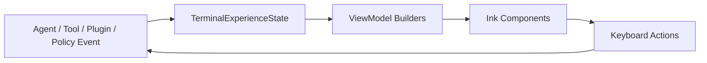

# 第 64 章：终端 UI 官方体验层：状态栏、权限、Diff、Plan、中断与插件授权

第 63 章已经把扩展供应链补到生命周期级别：

```txt
lockfile
consent
load-time verify
update gate
rollback
```

但安全能力如果没有好的终端 UI，用户很难正确操作。

官方级 Claude Code 的体验不是“把所有文本打印出来”。

它更像一个在终端里运行的交互系统：

```txt
底部输入永远稳定
状态信息轻量但实时
权限请求只问一个清晰问题
长 plan 可以滚动，但确认选项始终可见
diff 能快速扫文件，也能深入看 hunk
中断和取消有明确反馈
插件安装前明确展示能力和风险
完整性失败时告诉用户下一步怎么处理
```

这一章不重写 Ink 框架。

我们基于现有结构继续往上抽象：

```txt
src/components/FullscreenLayout.tsx
src/components/StatusLine.tsx
src/components/BuiltinStatusLine.tsx
src/components/permissions/PermissionRequest.tsx
src/components/permissions/PermissionDialog.tsx
src/components/diff/DiffDialog.tsx
src/components/StructuredDiff.tsx
src/hooks/useCancelRequest.ts
src/commands/plugin/PluginTrustWarning.tsx
src/commands/plugin/PluginOptionsDialog.tsx
```

目标是给 Mini 建立一套统一的“终端体验模型”。

## 本章目标

完成后，Mini 会具备这些 UI 层能力：

```txt
1. 用 TerminalExperienceState 统一描述底部栏、modal、overlay、toast 和 sticky footer
2. 内置 status line 显示模型、上下文、限流、成本、缓存和远程状态
3. 权限弹窗统一成 PermissionViewModel，而不是每个工具随意拼 UI
4. 文件编辑、Shell、MCP、Skill、Hook、插件授权都使用同一套风险摘要
5. Diff 视图支持文件列表、详情视图、turn source 切换和窄终端降级
6. Plan approval 支持长内容滚动和 sticky footer 决策区
7. 中断、取消、队列 pop、后台 agent 停止有统一反馈
8. 插件 consent dialog 复用第 63 章的 capability disclosure
9. integrity failure dialog 展示原因和安全操作
10. 增加 UI view-model 单元测试，避免终端组件逻辑散落
```

## 为什么要单独写 UI 体验层

到第 63 章，Mini 已经有很多能力：

```txt
agent loop
tool calling
permission engine
plan mode
diff
remote sessions
daemon
plugin marketplace
MCPB
extension lock
audit timeline
```

如果每个能力都自己决定怎么显示，就会很快变成：

```txt
权限弹窗一种样式
插件安装一种样式
完整性失败一种样式
remote approval 又一种样式
Plan 确认选项被长内容挤走
Diff 在窄终端里换行混乱
中断后用户不知道到底停了什么
```

官方级体验的关键是：

```txt
交互语义统一
视觉层级稳定
焦点所有权明确
键盘行为可预期
安全信息足够具体
```

所以这一章先做“view model 层”。

Ink 组件只负责渲染，不负责临时推理。

## 现有源码里的好模式

现有代码已经有几个值得继承的模式。

第一，状态栏已经分成内置状态和用户自定义命令：

```txt
src/components/StatusLine.tsx
src/components/BuiltinStatusLine.tsx
```

内置状态显示：

```txt
model
context usage
rate limit
cost
cache hit rate
```

自定义命令通过：

```txt
executeStatusLineCommand()
```

第二，权限弹窗已经有统一入口：

```txt
src/components/permissions/PermissionRequest.tsx
```

它按 tool 分发到：

```txt
BashPermissionRequest
FileEditPermissionRequest
FileWritePermissionRequest
ExitPlanModePermissionRequest
SkillPermissionRequest
FallbackPermissionRequest
```

第三，Diff dialog 已经有 modal 和 keybinding 隔离：

```txt
src/components/diff/DiffDialog.tsx
```

它支持：

```txt
current diff
turn diff
list mode
detail mode
source switching
esc close
```

第四，Plan approval 已经支持 sticky footer：

```txt
setStickyFooter
```

这点很重要。

长 plan 的内容应该可滚动，但确认按钮不能滚出屏幕。

第五，中断逻辑已经集中在：

```txt
src/hooks/useCancelRequest.ts
```

它区分：

```txt
Escape 取消当前请求或弹出队列
Ctrl+C 中断运行任务
二次快捷键停止后台 agent
```

第 64 章要做的是把这些模式固化成 Mini 的 UI 架构。

## 终端体验层的分层

新增目录：

```txt
src/terminal-ui/
  experience/
    types.ts
    priority.ts
    statusViewModel.ts
    permissionViewModel.ts
    diffViewModel.ts
    planViewModel.ts
    interruptViewModel.ts
    pluginConsentViewModel.ts
    integrityFailureViewModel.ts
    __tests__/
```

核心原则：

```txt
业务层产出事件和状态
experience 层产出 view model
Ink 组件只消费 view model
```

数据流：



这让 UI 可测试。

不用在 React 组件里拼凑复杂判断。

## TerminalExperienceState

先定义统一状态。

```ts
// src/terminal-ui/experience/types.ts
export type ExperienceSurface =
  | 'main'
  | 'status'
  | 'permission'
  | 'diff'
  | 'plan'
  | 'plugin-consent'
  | 'integrity-failure'
  | 'interrupt'
  | 'background-task';

export type ExperienceSeverity = 'info' | 'success' | 'warning' | 'danger';

export type StatusPill = {
  id: string;
  label: string;
  value?: string;
  severity?: ExperienceSeverity;
  priority: number;
  minColumns: number;
};

export type TerminalToast = {
  id: string;
  text: string;
  severity: ExperienceSeverity;
  timeoutMs?: number;
};

export type TerminalModal =
  | {
      type: 'permission';
      requestId: string;
    }
  | {
      type: 'diff';
      source: 'current' | 'turn';
    }
  | {
      type: 'plan';
      requestId: string;
    }
  | {
      type: 'plugin-consent';
      pluginId: string;
    }
  | {
      type: 'integrity-failure';
      extensionId: string;
    };

export type TerminalExperienceState = {
  surface: ExperienceSurface;
  statusPills: StatusPill[];
  modal: TerminalModal | null;
  overlay: TerminalModal | null;
  stickyFooter: 'permission-actions' | 'plan-actions' | null;
  toasts: TerminalToast[];
  inputDisabled: boolean;
};

export function emptyTerminalExperienceState(): TerminalExperienceState {
  return {
    surface: 'main',
    statusPills: [],
    modal: null,
    overlay: null,
    stickyFooter: null,
    toasts: [],
    inputDisabled: false,
  };
}
```

这个类型不是替代 AppState。

它是 UI 的投影。

```txt
AppState 是事实来源
TerminalExperienceState 是展示决策
```

## Surface 优先级

终端 UI 容易出问题的地方是多个东西同时出现：

```txt
tool permission
diff dialog
plugin consent
status notice
remote approval
prompt input
spinner
```

必须定义优先级。

```ts
// src/terminal-ui/experience/priority.ts
import type { ExperienceSurface } from './types.js';

const SURFACE_PRIORITY: Record<ExperienceSurface, number> = {
  'integrity-failure': 100,
  'permission': 90,
  'plugin-consent': 85,
  'plan': 80,
  'diff': 70,
  'background-task': 50,
  'interrupt': 40,
  'status': 20,
  'main': 0,
};

export function compareSurfacePriority(
  a: ExperienceSurface,
  b: ExperienceSurface,
): number {
  return SURFACE_PRIORITY[b] - SURFACE_PRIORITY[a];
}

export function highestPrioritySurface(
  surfaces: ExperienceSurface[],
): ExperienceSurface {
  return [...surfaces].sort(compareSurfacePriority)[0] ?? 'main';
}
```

为什么完整性失败比普通权限更高？

因为完整性失败说明：

```txt
扩展内容不再可信
```

这时不能继续展示普通“允许工具运行吗”。

要先要求用户处理供应链问题。

## Status line 设计

状态栏不能变成信息垃圾场。

Mini 的内置状态栏建议只显示：

```txt
model
context
rate limit
cost
cache
permission mode
remote/worktree
background tasks
```

按终端宽度逐步降级。

```ts
// src/terminal-ui/experience/statusViewModel.ts
import type { StatusPill } from './types.js';

export type StatusLineSnapshot = {
  model: string;
  contextUsedPct: number;
  usedTokensLabel: string;
  contextWindowLabel: string;
  totalCostLabel?: string;
  cacheHitRate?: string;
  cacheTtl?: string;
  sessionRateLimit?: string;
  weeklyRateLimit?: string;
  permissionMode?: string;
  remoteSession?: string;
  worktree?: string;
  backgroundTaskCount: number;
};

export function buildStatusPills(snapshot: StatusLineSnapshot): StatusPill[] {
  const pills: StatusPill[] = [
    {
      id: 'model',
      label: snapshot.model,
      priority: 100,
      minColumns: 20,
    },
    {
      id: 'context',
      label: 'Context',
      value: `${snapshot.contextUsedPct}%`,
      severity: snapshot.contextUsedPct >= 90 ? 'danger' : snapshot.contextUsedPct >= 70 ? 'warning' : 'info',
      priority: 95,
      minColumns: 38,
    },
  ];

  if (snapshot.sessionRateLimit) {
    pills.push({
      id: 'session-limit',
      label: 'Session',
      value: snapshot.sessionRateLimit,
      severity: snapshot.sessionRateLimit.startsWith('9') ? 'warning' : 'info',
      priority: 80,
      minColumns: 56,
    });
  }

  if (snapshot.weeklyRateLimit) {
    pills.push({
      id: 'weekly-limit',
      label: 'Weekly',
      value: snapshot.weeklyRateLimit,
      priority: 70,
      minColumns: 72,
    });
  }

  if (snapshot.totalCostLabel) {
    pills.push({
      id: 'cost',
      label: snapshot.totalCostLabel,
      priority: 60,
      minColumns: 64,
    });
  }

  if (snapshot.cacheHitRate) {
    pills.push({
      id: 'cache',
      label: 'Cache',
      value: `${snapshot.cacheHitRate} ${snapshot.cacheTtl ?? ''}`.trim(),
      priority: 50,
      minColumns: 76,
    });
  }

  if (snapshot.permissionMode) {
    pills.push({
      id: 'permission-mode',
      label: snapshot.permissionMode,
      severity: snapshot.permissionMode === 'bypass' ? 'warning' : 'info',
      priority: 45,
      minColumns: 88,
    });
  }

  if (snapshot.remoteSession) {
    pills.push({
      id: 'remote',
      label: 'Remote',
      value: snapshot.remoteSession,
      priority: 40,
      minColumns: 92,
    });
  }

  if (snapshot.worktree) {
    pills.push({
      id: 'worktree',
      label: 'Worktree',
      value: snapshot.worktree,
      priority: 35,
      minColumns: 96,
    });
  }

  if (snapshot.backgroundTaskCount > 0) {
    pills.push({
      id: 'background',
      label: 'BG',
      value: String(snapshot.backgroundTaskCount),
      severity: 'info',
      priority: 90,
      minColumns: 48,
    });
  }

  return pills.sort((a, b) => b.priority - a.priority);
}

export function visibleStatusPills(
  pills: StatusPill[],
  columns: number,
): StatusPill[] {
  return pills.filter(pill => columns >= pill.minColumns);
}
```

渲染组件：

```tsx
// src/terminal-ui/components/StatusPills.tsx
import React from 'react';
import { Box, Text } from '@anthropic/ink';
import type { StatusPill } from '../experience/types.js';

type Props = {
  pills: StatusPill[];
};

export function StatusPills({ pills }: Props): React.ReactNode {
  return (
    <Box>
      {pills.map((pill, index) => (
        <React.Fragment key={pill.id}>
          {index > 0 && <Text dimColor>{' │ '}</Text>}
          <Text color={colorForSeverity(pill.severity)}>{pill.label}</Text>
          {pill.value && (
            <>
              <Text dimColor> </Text>
              <Text>{pill.value}</Text>
            </>
          )}
        </React.Fragment>
      ))}
    </Box>
  );
}

function colorForSeverity(
  severity: StatusPill['severity'],
): 'text' | 'warning' | 'error' | 'success' {
  if (severity === 'danger') return 'error';
  if (severity === 'warning') return 'warning';
  if (severity === 'success') return 'success';
  return 'text';
}
```

状态栏规则：

```txt
短终端只显示 model + context
中等终端显示 rate limit + cost
宽终端显示 cache + remote + worktree
危险信息用颜色，不用长句
```

## 权限弹窗的 ViewModel

工具权限 UI 的核心不是按钮，而是“用户要判断什么风险”。

统一成：

```ts
// src/terminal-ui/experience/permissionViewModel.ts
export type PermissionAction = {
  id: string;
  label: string;
  description?: string;
  kind: 'allow-once' | 'allow-rule' | 'deny' | 'edit';
  default?: boolean;
  dangerous?: boolean;
};

export type PermissionRiskLine = {
  severity: 'info' | 'warning' | 'danger';
  text: string;
};

export type PermissionViewModel = {
  title: string;
  subtitle?: string;
  toolName: string;
  summaryLines: string[];
  riskLines: PermissionRiskLine[];
  actions: PermissionAction[];
  debugLines?: string[];
};

export type BuildPermissionViewModelInput = {
  toolName: string;
  description: string;
  inputSummary: string[];
  decisionReason?: string;
  suggestedAllowRule?: string;
  destructive?: boolean;
  writesFiles?: boolean;
  runsNetwork?: boolean;
  usesSandbox?: boolean;
};

export function buildPermissionViewModel(
  input: BuildPermissionViewModelInput,
): PermissionViewModel {
  const riskLines: PermissionRiskLine[] = [];

  if (input.destructive) {
    riskLines.push({
      severity: 'danger',
      text: 'May modify or delete important files',
    });
  }

  if (input.writesFiles) {
    riskLines.push({
      severity: 'warning',
      text: 'Writes to the workspace',
    });
  }

  if (input.runsNetwork) {
    riskLines.push({
      severity: 'warning',
      text: 'Uses network access',
    });
  }

  if (input.usesSandbox) {
    riskLines.push({
      severity: 'info',
      text: 'Will run inside sandbox when available',
    });
  }

  const actions: PermissionAction[] = [
    {
      id: 'allow-once',
      label: 'Allow once',
      kind: 'allow-once',
      default: true,
    },
  ];

  if (input.suggestedAllowRule) {
    actions.push({
      id: 'allow-rule',
      label: 'Allow similar',
      description: input.suggestedAllowRule,
      kind: 'allow-rule',
    });
  }

  actions.push({
    id: 'deny',
    label: 'Deny',
    kind: 'deny',
    dangerous: false,
  });

  return {
    title: `${input.toolName} permission`,
    subtitle: input.description,
    toolName: input.toolName,
    summaryLines: input.inputSummary,
    riskLines,
    actions,
    debugLines: input.decisionReason ? [input.decisionReason] : undefined,
  };
}
```

这让所有工具遵循同一个结构：

```txt
标题：谁要做什么
摘要：做什么
风险：为什么要谨慎
动作：允许一次、允许类似、拒绝
调试：规则为什么命中
```

Shell、文件编辑、MCP、Skill、插件 Hook 都可以用这个模型。

## PermissionDialog 渲染

渲染层要稳定。

```tsx
// src/terminal-ui/components/PermissionCard.tsx
import React from 'react';
import { Box, Text } from '@anthropic/ink';
import { Select } from '../../components/CustomSelect/index.js';
import { PermissionDialog } from '../../components/permissions/PermissionDialog.js';
import type { PermissionViewModel } from '../experience/permissionViewModel.js';

type Props = {
  viewModel: PermissionViewModel;
  onAction: (actionId: string) => void;
  onCancel: () => void;
};

export function PermissionCard({
  viewModel,
  onAction,
  onCancel,
}: Props): React.ReactNode {
  return (
    <PermissionDialog
      title={viewModel.title}
      subtitle={viewModel.subtitle}
      color={viewModel.riskLines.some(r => r.severity === 'danger') ? 'error' : 'permission'}
    >
      <Box flexDirection="column" marginTop={1}>
        {viewModel.summaryLines.map((line, index) => (
          <Text key={`summary-${index}`}>{line}</Text>
        ))}

        {viewModel.riskLines.length > 0 && (
          <Box flexDirection="column" marginTop={1}>
            {viewModel.riskLines.map((risk, index) => (
              <Text key={`risk-${index}`} color={colorForRisk(risk.severity)}>
                {risk.text}
              </Text>
            ))}
          </Box>
        )}

        <Box marginTop={1}>
          <Select
            options={viewModel.actions.map(action => ({
              label: action.label,
              value: action.id,
              description: action.description,
            }))}
            onChange={onAction}
            onCancel={onCancel}
            inlineDescriptions
          />
        </Box>
      </Box>
    </PermissionDialog>
  );
}

function colorForRisk(
  severity: 'info' | 'warning' | 'danger',
): 'text' | 'warning' | 'error' {
  if (severity === 'danger') return 'error';
  if (severity === 'warning') return 'warning';
  return 'text';
}
```

注意：

```txt
Select 负责焦点
PermissionDialog 负责边框和标题
ViewModel 负责内容结构
业务层负责 action 语义
```

不要让组件直接调用权限引擎。

## Diff 官方体验

Diff 体验有两个层次：

```txt
快速知道改了哪些文件
必要时深入查看每个 hunk
```

已有 `DiffDialog` 已经实现了 list/detail。

Mini 可以把 view model 抽出来。

```ts
// src/terminal-ui/experience/diffViewModel.ts
export type DiffFileViewModel = {
  path: string;
  linesAdded: number;
  linesRemoved: number;
  isBinary: boolean;
  isLarge: boolean;
  isTruncated: boolean;
  status: 'added' | 'modified' | 'deleted' | 'renamed';
};

export type DiffSummaryViewModel = {
  title: string;
  subtitle?: string;
  filesChanged: number;
  linesAdded: number;
  linesRemoved: number;
  files: DiffFileViewModel[];
  emptyMessage: string;
};

export function buildDiffSummaryViewModel(input: {
  sourceLabel: string;
  promptPreview?: string;
  files: DiffFileViewModel[];
}): DiffSummaryViewModel {
  const linesAdded = input.files.reduce((sum, file) => sum + file.linesAdded, 0);
  const linesRemoved = input.files.reduce((sum, file) => sum + file.linesRemoved, 0);

  return {
    title: input.sourceLabel,
    subtitle: input.promptPreview,
    filesChanged: input.files.length,
    linesAdded,
    linesRemoved,
    files: [...input.files].sort((a, b) => a.path.localeCompare(b.path)),
    emptyMessage: input.sourceLabel === 'Current' ? 'Working tree is clean' : 'No file changes in this turn',
  };
}
```

文件列表渲染规则：

```txt
一行一个文件
左侧状态符号
右侧 +N -M
二进制文件只显示 binary
过大文件显示 truncated
```

```tsx
// src/terminal-ui/components/DiffFileRows.tsx
import React from 'react';
import { Box, Text } from '@anthropic/ink';
import type { DiffFileViewModel } from '../experience/diffViewModel.js';

type Props = {
  files: DiffFileViewModel[];
  selectedIndex: number;
};

export function DiffFileRows({ files, selectedIndex }: Props): React.ReactNode {
  return (
    <Box flexDirection="column">
      {files.map((file, index) => {
        const selected = index === selectedIndex;
        return (
          <Box key={file.path}>
            <Text color={selected ? 'text' : 'secondaryText'}>
              {selected ? '› ' : '  '}
              {statusSymbol(file.status)} {file.path}
            </Text>
            <Text dimColor> </Text>
            {file.isBinary ? (
              <Text dimColor>binary</Text>
            ) : (
              <>
                {file.linesAdded > 0 && <Text color="diffAdded">+{file.linesAdded}</Text>}
                {file.linesRemoved > 0 && <Text color="diffRemoved"> -{file.linesRemoved}</Text>}
              </>
            )}
            {file.isTruncated && <Text color="warning"> truncated</Text>}
          </Box>
        );
      })}
    </Box>
  );
}

function statusSymbol(status: DiffFileViewModel['status']): string {
  if (status === 'added') return '+';
  if (status === 'deleted') return '-';
  if (status === 'renamed') return '→';
  return '~';
}
```

Diff keybinding 要保持简单：

```txt
↑/↓ 选择文件
Enter 进入详情
← 返回或切 source
→ 切 source
Esc 关闭
```

不要在 Diff 视图里塞太多快捷键。

## 窄终端降级

终端宽度小于 80 时：

```txt
隐藏 token 明细
隐藏长路径前缀
隐藏 source selector 细节
Diff 只显示文件名和统计
Plan sticky footer 保持可见
```

新增路径缩短函数：

```ts
// src/terminal-ui/experience/pathDisplay.ts
export function compactPathForColumns(path: string, columns: number): string {
  if (path.length <= columns) return path;

  const parts = path.split('/');
  if (parts.length <= 2) {
    return truncateMiddle(path, columns);
  }

  const fileName = parts[parts.length - 1] ?? path;
  const parent = parts[parts.length - 2] ?? '';
  const compact = `${parent}/${fileName}`;

  if (compact.length <= columns) return compact;
  return truncateMiddle(fileName, columns);
}

export function truncateMiddle(value: string, columns: number): string {
  if (columns <= 1) return '…';
  if (value.length <= columns) return value;
  const left = Math.max(1, Math.floor((columns - 1) / 2));
  const right = Math.max(1, columns - left - 1);
  return `${value.slice(0, left)}…${value.slice(value.length - right)}`;
}
```

## Plan View

Plan approval 的核心体验：

```txt
长计划可滚动
确认选项固定在底部
用户可以补充反馈
用户可以选择保留上下文或清理上下文
风险模式明确
```

View model：

```ts
// src/terminal-ui/experience/planViewModel.ts
export type PlanActionId =
  | 'accept-manual'
  | 'accept-auto-edits'
  | 'accept-clear-context'
  | 'keep-planning'
  | 'refine-remote';

export type PlanAction = {
  id: PlanActionId;
  label: string;
  description?: string;
  requiresFeedback?: boolean;
  risky?: boolean;
};

export type PlanViewModel = {
  title: string;
  planMarkdown: string;
  contextUsedPercent?: number;
  planFilePath?: string;
  actions: PlanAction[];
  footerHint: string;
};

export function buildPlanViewModel(input: {
  planMarkdown: string;
  contextUsedPercent?: number;
  planFilePath?: string;
  canClearContext: boolean;
  canUseAutoEdits: boolean;
  canRefineRemote: boolean;
}): PlanViewModel {
  const actions: PlanAction[] = [];

  if (input.canClearContext) {
    actions.push({
      id: 'accept-clear-context',
      label: `Yes, clear context${input.contextUsedPercent === undefined ? '' : ` (${input.contextUsedPercent}% used)`}`,
      description: 'Start implementation with a compact context',
    });
  }

  if (input.canUseAutoEdits) {
    actions.push({
      id: 'accept-auto-edits',
      label: 'Yes, auto-accept edits',
      risky: true,
    });
  }

  actions.push({
    id: 'accept-manual',
    label: 'Yes, manually approve edits',
  });

  if (input.canRefineRemote) {
    actions.push({
      id: 'refine-remote',
      label: 'No, refine remotely',
      description: 'Send this plan to remote refinement',
    });
  }

  actions.push({
    id: 'keep-planning',
    label: 'No, keep planning',
    requiresFeedback: true,
  });

  return {
    title: 'Ready to code?',
    planMarkdown: input.planMarkdown,
    contextUsedPercent: input.contextUsedPercent,
    planFilePath: input.planFilePath,
    actions,
    footerHint: 'Ctrl+G edits the plan in your editor',
  };
}
```

Plan UI 不应该用一大段说明教育用户。

应该让动作本身足够清晰：

```txt
Yes, manually approve edits
Yes, auto-accept edits
No, keep planning
```

## Sticky footer 协议

现有 `PermissionRequestProps` 已经有：

```txt
setStickyFooter?: (jsx: React.ReactNode | null) => void
```

Mini 应该明确哪些 UI 可以使用 sticky footer：

```txt
Plan approval
large diff confirmation
plugin consent with long disclosure
integrity failure with long reason list
```

规则：

```txt
正文进入 scrollable overlay
决策按钮进入 bottom sticky footer
关闭时必须清理 footer
footer 不读取旧闭包，回调用 ref 保持新鲜
```

这是为了避免长内容把确认按钮顶出屏幕。

## 中断反馈

中断体验要回答三个问题：

```txt
用户刚刚按键影响了什么？
还有什么在运行？
下一步可以做什么？
```

View model：

```ts
// src/terminal-ui/experience/interruptViewModel.ts
export type InterruptKind =
  | 'turn-cancelled'
  | 'queued-command-removed'
  | 'background-agents-stopping'
  | 'permission-rejected'
  | 'nothing-to-cancel';

export type InterruptFeedbackViewModel = {
  kind: InterruptKind;
  toast: string;
  modelNotification?: string;
  severity: 'info' | 'warning';
};

export function buildInterruptFeedback(input: {
  kind: InterruptKind;
  affectedCount?: number;
  commandPreview?: string;
}): InterruptFeedbackViewModel {
  if (input.kind === 'turn-cancelled') {
    return {
      kind: input.kind,
      toast: 'Stopped current response',
      modelNotification: 'The user interrupted the current response.',
      severity: 'info',
    };
  }

  if (input.kind === 'queued-command-removed') {
    return {
      kind: input.kind,
      toast: `Removed queued command${input.commandPreview ? `: ${input.commandPreview}` : ''}`,
      severity: 'info',
    };
  }

  if (input.kind === 'background-agents-stopping') {
    const count = input.affectedCount ?? 0;
    return {
      kind: input.kind,
      toast: `Stopping ${count} background agent${count === 1 ? '' : 's'}`,
      modelNotification: `${count} background agent${count === 1 ? '' : 's'} were stopped by the user.`,
      severity: 'warning',
    };
  }

  if (input.kind === 'permission-rejected') {
    return {
      kind: input.kind,
      toast: 'Permission request rejected',
      severity: 'info',
    };
  }

  return {
    kind: input.kind,
    toast: 'Nothing to cancel',
    severity: 'info',
  };
}
```

这可以接到 `useCancelRequest.ts`。

现有代码已经有：

```txt
addNotification
enqueuePendingNotification
clearCommandQueue
killAllRunningAgentTasks
```

第 64 章的改进是：

```txt
所有 interrupt 分支都生成统一 feedback
```

而不是每个分支临时拼一句话。

## 插件 consent dialog

第 63 章定义了 capability disclosure：

```txt
commands
agents
skills
hooks
mcpServers
lspServers
settingsKeys
outputStyles
```

第 64 章把它变成终端 UI。

```ts
// src/terminal-ui/experience/pluginConsentViewModel.ts
import type { ExtensionCapabilityDisclosure } from '../../extensions/supplyChain/capabilityDigest.js';

export type PluginConsentAction = 'allow' | 'cancel' | 'view-files';

export type PluginConsentViewModel = {
  title: string;
  sourceLines: string[];
  capabilityLines: string[];
  riskLines: string[];
  actions: Array<{
    id: PluginConsentAction;
    label: string;
    description?: string;
  }>;
};

export function buildPluginConsentViewModel(input: {
  pluginId: string;
  marketplace?: string;
  version?: string;
  sourceSummary: string;
  disclosure: ExtensionCapabilityDisclosure;
  expansionReasons?: string[];
}): PluginConsentViewModel {
  const capabilityLines = [
    `${input.disclosure.commands.length} command(s)`,
    `${input.disclosure.agents.length} agent(s)`,
    `${input.disclosure.skills.length} skill(s)`,
    `${input.disclosure.hooks.length} hook(s)`,
    `${input.disclosure.mcpServers.length} MCP server(s)`,
    `${input.disclosure.lspServers.length} LSP server(s)`,
  ];

  const riskLines: string[] = [];

  if (input.disclosure.hooks.length > 0) {
    riskLines.push('Runs hooks during session events');
  }

  if (input.disclosure.mcpServers.length > 0) {
    riskLines.push('Starts or connects to MCP servers');
  }

  if (input.disclosure.mcpServers.some(server => server.hasSensitiveConfig)) {
    riskLines.push('Requests sensitive configuration');
  }

  if (input.disclosure.lspServers.length > 0) {
    riskLines.push('Starts language servers');
  }

  for (const reason of input.expansionReasons ?? []) {
    riskLines.push(`New capability: ${reason}`);
  }

  return {
    title: `Install ${input.pluginId}`,
    sourceLines: [
      input.marketplace ? `Marketplace: ${input.marketplace}` : 'Marketplace: unknown',
      input.version ? `Version: ${input.version}` : 'Version: unknown',
      input.sourceSummary,
    ],
    capabilityLines,
    riskLines,
    actions: [
      {
        id: 'allow',
        label: 'Allow install',
      },
      {
        id: 'view-files',
        label: 'View files',
        description: 'Open installed plugin directory after download',
      },
      {
        id: 'cancel',
        label: 'Cancel',
      },
    ],
  };
}
```

这里要替换掉单纯的通用 warning。

通用 warning 仍然可以保留，但应该放在 capability disclosure 之后：

```txt
先给事实
再给提醒
```

不要只说“请信任插件”。

用户需要知道插件具体会带来哪些能力。

## Integrity Failure Dialog

第 63 章的 verifier 会返回：

```txt
missing lock
manifest hash mismatch
tree hash mismatch
bundle hash mismatch
capability digest mismatch
```

终端 UI 要把这些变成可操作信息。

```ts
// src/terminal-ui/experience/integrityFailureViewModel.ts
export type IntegrityFailureAction =
  | 'disable-extension'
  | 'rollback'
  | 'reinstall'
  | 'open-details'
  | 'cancel';

export type IntegrityFailureViewModel = {
  title: string;
  subtitle: string;
  reasonLines: string[];
  safeActionLines: string[];
  actions: Array<{
    id: IntegrityFailureAction;
    label: string;
    description?: string;
    recommended?: boolean;
  }>;
};

export function buildIntegrityFailureViewModel(input: {
  extensionId: string;
  surface: string;
  reasons: string[];
  rollbackAvailable: boolean;
  reinstallAvailable: boolean;
}): IntegrityFailureViewModel {
  const actions: IntegrityFailureViewModel['actions'] = [
    {
      id: 'disable-extension',
      label: 'Disable extension',
      recommended: !input.rollbackAvailable,
    },
  ];

  if (input.rollbackAvailable) {
    actions.push({
      id: 'rollback',
      label: 'Rollback',
      description: 'Restore the previous verified version',
      recommended: true,
    });
  }

  if (input.reinstallAvailable) {
    actions.push({
      id: 'reinstall',
      label: 'Reinstall',
      description: 'Fetch a fresh copy from the configured source',
    });
  }

  actions.push(
    {
      id: 'open-details',
      label: 'Open details',
    },
    {
      id: 'cancel',
      label: 'Cancel',
    },
  );

  return {
    title: 'Extension integrity check failed',
    subtitle: `${input.extensionId} (${input.surface})`,
    reasonLines: input.reasons,
    safeActionLines: [
      'The extension was not loaded.',
      'Do not relock marketplace or managed extensions unless you trust the source.',
    ],
    actions,
  };
}
```

这个 dialog 必须避免两件事。

第一，不要默认提供：

```txt
Trust current files
```

那会把篡改内容洗白。

第二，不要继续加载失败扩展。

完整性失败不是普通 warning。

## 渲染 Integrity Failure

```tsx
// src/terminal-ui/components/IntegrityFailureDialog.tsx
import React from 'react';
import { Box, Text, Dialog } from '@anthropic/ink';
import { Select } from '../../components/CustomSelect/index.js';
import type { IntegrityFailureViewModel } from '../experience/integrityFailureViewModel.js';

type Props = {
  viewModel: IntegrityFailureViewModel;
  onAction: (id: string) => void;
  onCancel: () => void;
};

export function IntegrityFailureDialog({
  viewModel,
  onAction,
  onCancel,
}: Props): React.ReactNode {
  return (
    <Dialog
      title={viewModel.title}
      subtitle={viewModel.subtitle}
      color="error"
      onCancel={onCancel}
      inputGuide={() => <Text>Choose a safe action</Text>}
    >
      <Box flexDirection="column">
        <Text bold>Reason</Text>
        {viewModel.reasonLines.map((line, index) => (
          <Text key={`reason-${index}`} color="error">
            {line}
          </Text>
        ))}

        <Box flexDirection="column" marginTop={1}>
          {viewModel.safeActionLines.map((line, index) => (
            <Text key={`safe-${index}`} dimColor>
              {line}
            </Text>
          ))}
        </Box>

        <Box marginTop={1}>
          <Select
            options={viewModel.actions.map(action => ({
              label: action.recommended ? `${action.label} (recommended)` : action.label,
              value: action.id,
              description: action.description,
            }))}
            onChange={onAction}
            onCancel={onCancel}
            inlineDescriptions
          />
        </Box>
      </Box>
    </Dialog>
  );
}
```

注意这里使用 `Dialog`，不是 `PermissionDialog`。

因为完整性失败不是权限请求。

它是安全阻断。

## 焦点所有权

终端交互最容易乱的是焦点。

Mini 需要明确：

```txt
Chat 输入拥有普通字符输入
Select 拥有上下选择和 Enter
Dialog 拥有 Esc / Ctrl+C
DiffDialog 拥有 diff navigation
PromptInput 模式退出拥有 Escape 的优先权
```

已有 keybinding context：

```txt
Chat
Confirmation
DiffDialog
Select
Plugin
```

第 64 章建议新增：

```txt
PluginConsent
IntegrityFailure
PlanApproval
```

配置：

```ts
// src/keybindings/defaultBindings.ts
export const terminalExperienceBindings = [
  {
    context: 'PluginConsent',
    bindings: {
      escape: 'pluginConsent:cancel',
      enter: 'pluginConsent:accept',
      up: 'select:previous',
      down: 'select:next',
    },
  },
  {
    context: 'IntegrityFailure',
    bindings: {
      escape: 'integrityFailure:cancel',
      enter: 'integrityFailure:accept',
      up: 'select:previous',
      down: 'select:next',
    },
  },
  {
    context: 'PlanApproval',
    bindings: {
      escape: 'planApproval:reject',
      'ctrl+g': 'planApproval:edit',
      'shift+tab': 'planApproval:acceptFast',
    },
  },
];
```

如果不想扩 keybinding schema，也可以复用现有 `Confirmation` 和 `Select`。

但要保证：

```txt
一个弹窗出现时，Chat 快捷键不抢焦点
```

现有 `useRegisterOverlay()` 就是这类机制。

## 通知层级

通知不应该全都一样。

定义优先级：

```ts
// src/terminal-ui/experience/toast.ts
import type { TerminalToast } from './types.js';

const TOAST_PRIORITY: Record<TerminalToast['severity'], number> = {
  danger: 100,
  warning: 70,
  success: 40,
  info: 20,
};

export function sortToasts(toasts: TerminalToast[]): TerminalToast[] {
  return [...toasts].sort(
    (a, b) => TOAST_PRIORITY[b.severity] - TOAST_PRIORITY[a.severity],
  );
}

export function collapseToasts(toasts: TerminalToast[], max = 3): TerminalToast[] {
  return sortToasts(toasts).slice(0, max);
}
```

示例：

```txt
integrity failure > permission prompt > interrupt > background task > status hint
```

用户按 Ctrl+C 后应该马上看到：

```txt
Stopped current response
```

而不是只看到 spinner 消失。

## UI 测试：status pills

```ts
// src/terminal-ui/experience/__tests__/statusViewModel.test.ts
import { describe, expect, test } from 'bun:test';
import { buildStatusPills, visibleStatusPills } from '../statusViewModel.js';

describe('statusViewModel', () => {
  test('keeps model and context on narrow terminals', () => {
    const pills = buildStatusPills({
      model: 'Sonnet 4.5',
      contextUsedPct: 42,
      usedTokensLabel: '42k',
      contextWindowLabel: '200k',
      totalCostLabel: '$1.25',
      cacheHitRate: '80%',
      cacheTtl: '20m',
      backgroundTaskCount: 2,
    });

    const visible = visibleStatusPills(pills, 50);
    expect(visible.map(p => p.id)).toContain('model');
    expect(visible.map(p => p.id)).toContain('context');
  });

  test('marks high context usage as warning or danger', () => {
    const pills = buildStatusPills({
      model: 'Sonnet 4.5',
      contextUsedPct: 91,
      usedTokensLabel: '182k',
      contextWindowLabel: '200k',
      backgroundTaskCount: 0,
    });

    expect(pills.find(p => p.id === 'context')?.severity).toBe('danger');
  });
});
```

运行：

```bash
bun test src/terminal-ui/experience/__tests__/statusViewModel.test.ts
```

## UI 测试：permission view model

```ts
// src/terminal-ui/experience/__tests__/permissionViewModel.test.ts
import { describe, expect, test } from 'bun:test';
import { buildPermissionViewModel } from '../permissionViewModel.js';

describe('permissionViewModel', () => {
  test('adds danger line for destructive command', () => {
    const vm = buildPermissionViewModel({
      toolName: 'Bash',
      description: 'Run shell command',
      inputSummary: ['rm -rf dist'],
      destructive: true,
    });

    expect(vm.riskLines.some(line => line.severity === 'danger')).toBe(true);
  });

  test('includes allow similar when suggested rule exists', () => {
    const vm = buildPermissionViewModel({
      toolName: 'Bash',
      description: 'Run tests',
      inputSummary: ['bun test'],
      suggestedAllowRule: 'Bash(bun test:*)',
    });

    expect(vm.actions.map(action => action.id)).toContain('allow-rule');
  });
});
```

运行：

```bash
bun test src/terminal-ui/experience/__tests__/permissionViewModel.test.ts
```

## UI 测试：Diff view model

```ts
// src/terminal-ui/experience/__tests__/diffViewModel.test.ts
import { describe, expect, test } from 'bun:test';
import { buildDiffSummaryViewModel } from '../diffViewModel.js';

describe('diffViewModel', () => {
  test('sorts files and sums line counts', () => {
    const vm = buildDiffSummaryViewModel({
      sourceLabel: 'Current',
      files: [
        {
          path: 'b.ts',
          linesAdded: 1,
          linesRemoved: 2,
          isBinary: false,
          isLarge: false,
          isTruncated: false,
          status: 'modified',
        },
        {
          path: 'a.ts',
          linesAdded: 3,
          linesRemoved: 4,
          isBinary: false,
          isLarge: false,
          isTruncated: false,
          status: 'added',
        },
      ],
    });

    expect(vm.linesAdded).toBe(4);
    expect(vm.linesRemoved).toBe(6);
    expect(vm.files.map(file => file.path)).toEqual(['a.ts', 'b.ts']);
  });
});
```

运行：

```bash
bun test src/terminal-ui/experience/__tests__/diffViewModel.test.ts
```

## UI 测试：插件 consent

```ts
// src/terminal-ui/experience/__tests__/pluginConsentViewModel.test.ts
import { describe, expect, test } from 'bun:test';
import { buildPluginConsentViewModel } from '../pluginConsentViewModel.js';

describe('pluginConsentViewModel', () => {
  test('shows risk lines for hooks and sensitive MCP config', () => {
    const vm = buildPluginConsentViewModel({
      pluginId: 'review@company',
      marketplace: 'company',
      sourceSummary: 'git source',
      disclosure: {
        commands: [],
        agents: [],
        skills: [],
        hooks: [
          {
            event: 'PreToolUse',
            commandLike: true,
            networkLike: false,
          },
        ],
        mcpServers: [
          {
            name: 'review-api',
            transport: 'stdio',
            hasSensitiveConfig: true,
          },
        ],
        lspServers: [],
        settingsKeys: [],
        outputStyles: [],
      },
    });

    expect(vm.riskLines.join('\\n')).toContain('hooks');
    expect(vm.riskLines.join('\\n')).toContain('sensitive');
  });
});
```

运行：

```bash
bun test src/terminal-ui/experience/__tests__/pluginConsentViewModel.test.ts
```

## 和现有 REPL 的接入顺序

建议按这个顺序接：

```txt
1. 先只新增 view model 和测试，不改现有组件行为
2. StatusLine 接入 statusViewModel
3. PermissionRequest 子组件逐步改成 PermissionViewModel
4. DiffDialog 接入 DiffSummaryViewModel
5. ExitPlanModePermissionRequest 接入 PlanViewModel
6. 插件安装 UI 接入 PluginConsentViewModel
7. 供应链 verifier 接入 IntegrityFailureDialog
8. useCancelRequest 接入 InterruptFeedbackViewModel
```

不要一次性大改所有 Ink 组件。

这些组件都在用户交互主路径上。

每一步都要能单独回滚。

## 常见错误

错误一：

```txt
把 UI 文案拼在业务函数里
```

正确：

```txt
业务函数返回结构化状态，view model 决定展示文案
```

错误二：

```txt
所有 dialog 都直接抢 Chat 快捷键
```

正确：

```txt
使用 keybinding context 和 overlay registration 管理焦点
```

错误三：

```txt
长 Plan 下面跟确认按钮
```

问题：

```txt
按钮会滚出屏幕
```

正确：

```txt
长内容在 scrollable，动作在 sticky footer
```

错误四：

```txt
完整性失败只显示 warning toast
```

正确：

```txt
阻断扩展加载，并展示可操作 dialog
```

错误五：

```txt
插件 consent 只显示通用警告
```

正确：

```txt
显示 commands / agents / skills / hooks / MCP / LSP 的具体能力摘要
```

错误六：

```txt
状态栏显示所有信息
```

正确：

```txt
按宽度和优先级降级
```

错误七：

```txt
中断后只 abort，没有用户反馈
```

正确：

```txt
显示 toast，并在需要时注入 model-facing notification
```

错误八：

```txt
Diff 详情默认展开所有文件
```

正确：

```txt
默认列表，用户选择后进入详情
```

## 本章完成后的能力

Mini 的终端体验从：

```txt
能把结果打印出来
```

升级成：

```txt
有稳定的交互层级
有统一的安全提示
有可扫读的状态栏
有可操作的权限弹窗
有官方感的 Diff 和 Plan 体验
中断和失败都有明确反馈
插件授权和完整性失败能进入同一套 UI
```

它新增的关键抽象：

```txt
TerminalExperienceState
StatusPill
PermissionViewModel
DiffSummaryViewModel
PlanViewModel
InterruptFeedbackViewModel
PluginConsentViewModel
IntegrityFailureViewModel
surface priority
sticky footer protocol
```

这让前面 63 章的能力真正变成用户可理解、可控制的产品体验。

## 和官方 Claude Code 的差距

这一章仍然不是完整官方级 UI。

还缺：

```txt
完整截图级视觉回归测试
跨终端兼容矩阵
鼠标选择与键盘焦点冲突测试
终端 resize 压测
颜色主题可访问性校验
Screen reader 降级输出
输入法组合输入兼容
remote Web UI 与 CLI UI 的交互一致性
```

但 Mini 已经拥有了接近官方 Claude Code 的终端交互骨架。

下一章建议继续补 **LSP、Magic Docs 与代码智能层**：

```txt
diagnostics
symbols
go-to-definition
semantic edit hints
project index
Magic Docs 自动更新
代码理解上下文注入
```

这样 Mini 不只是能读写文件，而是开始具备“理解工程结构”的能力。
