# 第 70 章：高隔离与私有化部署

> 本章目标：把前面已经恢复的 CLI、模型 Provider、代理、证书、自动更新、RCS、自诊断、企业策略串成一套可以在高隔离网络里落地的私有化部署方案。

第 69 章处理的是团队与企业运营：Managed Settings、Fleet Policy、审计、RCS 管理台、管理员诊断。

这一章继续往下走：如果企业不允许开发机直接访问公网，甚至要求离线安装、内网模型网关、内网插件市场、内网文档、内网 RCS、内网更新镜像，那么一个接近官方 Claude Code 的实现应该怎么设计。

注意，本章不是把所有网络都彻底删除。真正可用的高隔离方案要区分：

- 哪些流量是模型推理必需的。
- 哪些流量可以通过私有网关代理。
- 哪些流量可以镜像到内网。
- 哪些能力必须离线可用。
- 哪些能力在隔离环境里应该默认关闭。
- 哪些缺口需要明确标成后续工程项。

本章继续保持一个原则：**教程不写真实密钥，不把私有凭据塞进示例，不要求用户暴露环境变量值。**

---

## 70.1 为什么要单独做高隔离章节

普通单机 CLI 的闭环是：

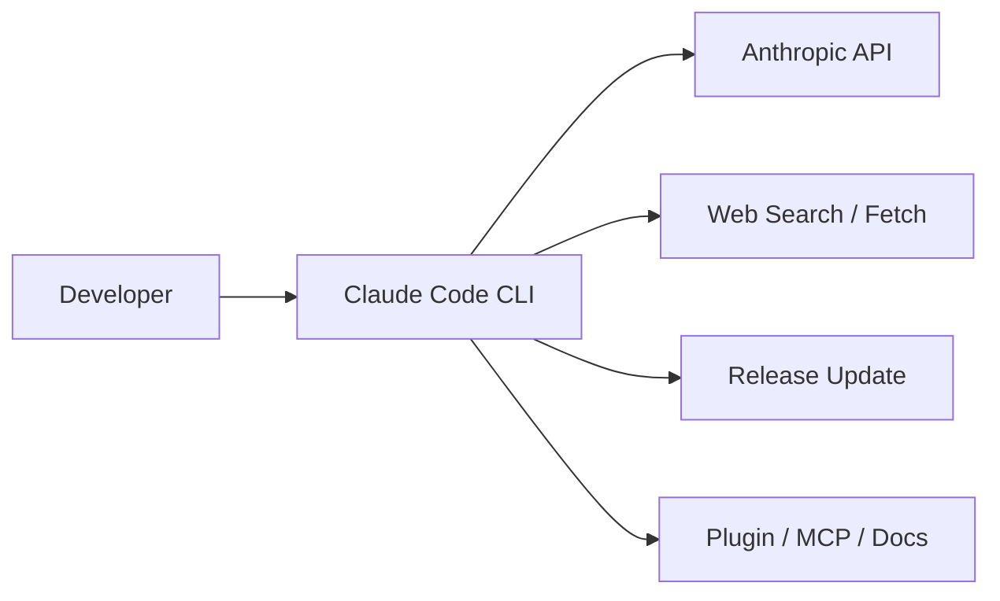

企业内网环境通常不是这样：

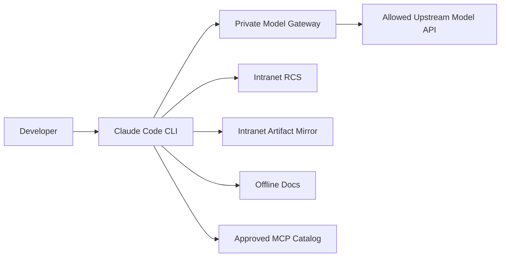

甚至更严格的环境会变成：

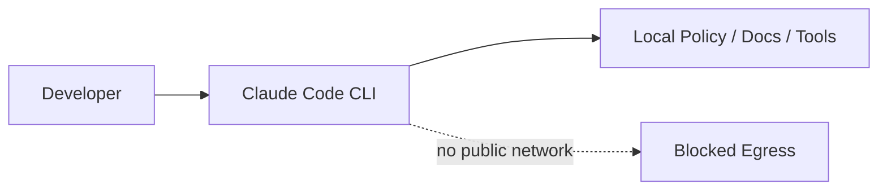

所以“私有化部署”不是一个开关，而是一组边界：

| 边界 | 要解决的问题 |
| --- | --- |
| 网络边界 | CLI 能连哪里，不能连哪里 |
| 模型边界 | 模型请求走官方、云厂商、兼容网关，还是内网代理 |
| 更新边界 | 二进制与 release metadata 从哪里拿 |
| 插件边界 | 允许安装哪些插件、MCP、Skill |
| 审计边界 | 谁可以看会话、审批、诊断包 |
| 数据边界 | 代码、prompt、工具输出是否离开内网 |
| 运维边界 | 如何回滚、诊断、批量下发策略 |

如果这些边界不拆开，后面会出现两个常见问题：

1. 以为设置一个代理就等于私有化。
2. 以为关掉遥测就等于离线可用。

它们都不够。

---

## 70.2 本仓库已经具备的相关能力

先把现状讲清楚。当前工程里和高隔离部署直接相关的能力包括：

| 能力 | 现状 |
| --- | --- |
| Provider 选择 | 支持 firstParty、Bedrock、Vertex、Foundry、OpenAI 兼容、Gemini、Grok |
| Anthropic 兼容 base URL | 可以通过 Anthropic SDK 与 `ANTHROPIC_BASE_URL` 体系接入兼容端点 |
| OpenAI 兼容 Provider | 独立兼容层，可走自定义 base URL |
| Gemini 兼容 Provider | 独立兼容层，可走自定义 base URL |
| 代理 | 支持常见代理环境变量、绕过规则、代理 DNS 策略 |
| CA | 支持额外 CA 证书配置 |
| mTLS | 支持客户端证书、客户端私钥、私钥口令 |
| essential traffic | 可禁用非必要流量，并同时关闭遥测 |
| 原生更新 | 有下载、校验、安装、保留旧版本的基础结构 |
| RCS | 支持自托管 Remote Control Server |
| Bridge | 支持通过私有控制面注册环境、轮询任务、权限回调 |
| Managed Settings | 可做企业级策略约束 |
| Doctor / Diagnostics | 可扩展成高隔离环境自检 |

但也要明确几个缺口：

| 缺口 | 当前状态 |
| --- | --- |
| 通用 release mirror 配置 | 底层有 generic baseUrl 函数，但默认更新路径还没有完整配置入口 |
| 完整离线安装包 | 需要新增打包规范、校验文件、安装脚本或 Bun 入口 |
| 内网插件市场 | 插件系统已有基础，但需要镜像源与策略绑定 |
| 内网文档快照 | 需要固定版本、索引、离线检索入口 |
| 私有部署验收套件 | 需要网络门禁、日志、策略、回滚的自动化检查 |
| RCS 企业持久化 | 当前自托管服务偏轻量，企业长期审计需要持久层 |

本章会把“已具备能力”和“建议补齐能力”分开写。

---

## 70.3 高隔离等级模型

不要只用“私有化”一个词。建议把部署分成六档。

### Level 0：默认联网

特点：

- CLI 可以访问模型 API。
- 可以访问更新源。
- 可以访问插件市场、文档、Web 能力。
- 可选遥测与诊断。

适合：

- 个人开发。
- 低约束团队。
- 内部试点。

### Level 1：企业出口受控

特点：

- 开发机可以出网，但必须走企业代理。
- 代理负责审计与 allowlist。
- CLI 保持默认能力，但所有网络都可被观测。

需要：

- 代理环境变量。
- CA 信任链。
- 可选 mTLS。
- 非必要流量开关。

### Level 2：私有模型网关

特点：

- CLI 不直接访问官方模型 API。
- 所有推理请求进入企业模型网关。
- 网关再决定走官方、云厂商或自有模型。

需要：

- Anthropic 兼容 endpoint。
- OpenAI 兼容 endpoint。
- 统一模型映射。
- 统一鉴权。
- 请求审计。
- 工具调用协议适配。

### Level 3：内网控制面

特点：

- RCS 部署在内网。
- 管理员通过内网 UI 查看环境、会话、权限请求。
- 开发机通过 Bridge 接入内网控制面。

需要：

- 私有 RCS base URL。
- 内网 token 颁发。
- WebSocket / SSE 在内网可达。
- 权限回调不出网。
- 审计日志内存或持久化。

### Level 4：离线安装与内网镜像

特点：

- CLI 的安装包、版本信息、release notes、插件、文档都来自内网镜像。
- 开发机不能访问公网更新源。
- 升级通过企业发布节奏控制。

需要：

- 二进制镜像仓库。
- 版本 manifest。
- SHA256 校验。
- 策略控制版本上限和最低版本。
- 回滚包保留。
- 离线文档索引。

### Level 5：Air-gapped

特点：

- 运行环境完全没有公网。
- 可能没有任何跨区网络。
- 所有输入通过离线介质导入。
- 所有输出需要人工审批后导出。

需要：

- 完整离线 bundle。
- 无网络运行模式。
- 本地策略引擎。
- 本地诊断包。
- 离线验收报告。
- 可复现构建与签名校验。

---

## 70.4 一条主线：高隔离不是删功能，而是改入口

接近官方 Claude Code 的做法不应该是把功能随意删掉，而是把外部依赖全部变成可替换入口。

错误方向：

```text
删掉更新
删掉插件
删掉文档
删掉 RCS
删掉 Web 能力
删掉诊断
```

正确方向：

```text
更新源可镜像
插件源可镜像
文档可快照
RCS 可自托管
Web 能力可策略禁用
诊断包可本地生成
模型请求可走私有网关
```

这也是本章的核心架构。

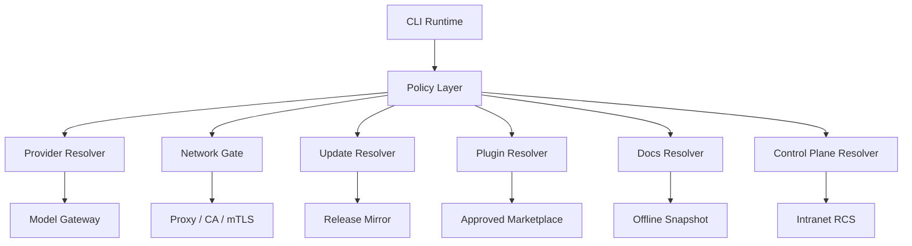

每个 resolver 都应该回答三个问题：

1. 当前环境允许这个能力吗？
2. 如果允许，它的入口在哪里？
3. 如果失败，用户看到的错误是否能直接定位到企业策略或网络配置？

---

## 70.5 网络依赖分类

高隔离部署第一步不是写代码，而是把网络依赖分类。

建议分成五类：

| 类别 | 示例 | 默认策略 |
| --- | --- | --- |
| Essential | 模型推理、OAuth 或企业 token 校验 | 允许，但必须可替换入口 |
| Control Plane | RCS、Bridge、权限审批 | 企业部署时走内网 |
| Update | 二进制、manifest、release notes | 高隔离下走镜像或关闭 |
| Extension | 插件、MCP、Skill、文档 | 高隔离下走镜像或快照 |
| Optional | 遥测、实验配置、外部搜索、反馈上传 | 高隔离下默认关闭 |

当前工程已有 `CLAUDE_CODE_DISABLE_NONESSENTIAL_TRAFFIC` 这类开关，可以作为 Level 1 到 Level 5 的底座。

建议高隔离环境默认设置：

```text
CLAUDE_CODE_DISABLE_NONESSENTIAL_TRAFFIC=1
DISABLE_TELEMETRY=1
```

这不是最终私有化方案，但它提供了一个很重要的默认语义：

> 除了完成用户显式请求所必需的流量，其余外部流量默认不发起。

---

## 70.6 网络 allowlist 表

企业部署前，管理员应该先拿到一张清晰的 allowlist 表。

示例：

| 目的 | 推荐入口 | 是否可关闭 | 说明 |
| --- | --- | --- | --- |
| Anthropic 兼容模型 | `https://models.example.internal/anthropic` | 否 | 主推理入口 |
| OpenAI 兼容模型 | `https://models.example.internal/openai` | 否 | 可选 Provider |
| Gemini 兼容模型 | `https://models.example.internal/gemini` | 否 | 可选 Provider |
| RCS | `https://rcs.example.internal` | 是 | 远程控制与审批 |
| Release Mirror | `https://releases.example.internal/claude-code` | 是 | 更新与回滚 |
| Plugin Mirror | `https://plugins.example.internal/claude-code` | 是 | 插件市场 |
| Docs Snapshot | `https://docs.example.internal/claude-code` | 是 | 内网文档 |
| MCP Catalog | `https://mcp.example.internal/catalog` | 是 | 已批准 MCP |

更严格的环境可以把模型入口也设成不可直接出网的本地地址：

```text
ANTHROPIC_BASE_URL=http://127.0.0.1:8787/anthropic
ANTHROPIC_MODEL=enterprise-coder
```

这里的 `enterprise-coder` 只是占位模型名，不代表仓库已经内置该模型。

---

## 70.7 Provider 选择在私有化里的作用

当前 Provider 选择大致遵循这个优先级：

1. 显式 `modelType`。
2. 云厂商相关环境变量。
3. OpenAI / Gemini / Grok 兼容环境变量。
4. 默认 firstParty。

这对私有化很重要。

企业希望的不是“谁设置了一个环境变量就能绕过网关”，而是：

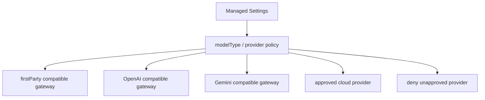

因此第 69 章的 Managed Settings 要在这里继续发挥作用：

```json
{
  "model": {
    "allowedProviders": ["firstParty", "openai"],
    "defaultProvider": "firstParty",
    "allowUserOverride": false
  },
  "network": {
    "disableNonessentialTraffic": true,
    "requireProxy": true,
    "requirePrivateBaseUrl": true
  }
}
```

这段是策略形状示例，字段名需要结合项目最终 settings schema 落地。

---

## 70.8 Anthropic 兼容私有网关

最少改动的私有模型接入路径是：

- 保持 `@anthropic-ai/sdk`。
- 保持 Anthropic message / tool schema。
- 只把 base URL、模型名、鉴权 token 指向企业网关。

配置形态：

```text
ANTHROPIC_BASE_URL=https://models.example.internal/anthropic
ANTHROPIC_MODEL=enterprise-coder
ANTHROPIC_AUTH_TOKEN=<provided-by-environment>
```

这里不要把 token 写进文档、settings 或代码库。企业环境应该通过安全的环境注入、系统凭据、SSO 交换或临时 token 下发。

这种方式的优点：

- 下游工具调用协议改动小。
- 现有 streaming 处理链路可以复用。
- 对 CLI 侧来说仍然是 Anthropic SDK client。
- 可以兼容 DeepSeek 等实现了 Anthropic 协议风格的 endpoint。

但也有风险：

- 不是所有 Anthropic 兼容 endpoint 都完全支持相同的 beta、tool、thinking、cache 语义。
- 私有网关需要明确处理 streaming 事件映射。
- 错误码要转换成 CLI 能理解的错误类型。
- 模型名要统一映射，否则 UI 与策略会不一致。

建议私有网关至少实现这几层：

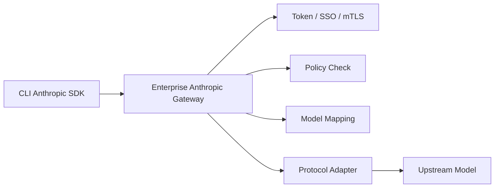

协议适配要覆盖：

| 维度 | 要求 |
| --- | --- |
| message content | text、tool_use、tool_result、image 等按需支持 |
| streaming | delta、message_start、message_stop、error 事件稳定 |
| tool schema | JSON schema 不被网关破坏 |
| stop reason | 与 CLI 侧判断一致 |
| usage | token 统计字段可用或明确置空 |
| request id | 网关生成并回传可追踪 id |
| error | 401、403、429、5xx 能映射为可读提示 |

---

## 70.9 OpenAI 兼容私有网关

仓库已经有 OpenAI 兼容层。适合以下情况：

- 企业已有统一 OpenAI-compatible 网关。
- 模型供应商只提供 Chat Completions 或类似接口。
- 需要接入 Ollama/vLLM/DeepSeek 风格 endpoint。
- 工具调用可以被转换成 OpenAI tool schema。

配置形态：

```text
CLAUDE_CODE_USE_OPENAI=1
OPENAI_BASE_URL=https://models.example.internal/openai
OPENAI_MODEL=enterprise-coder
OPENAI_API_KEY=<provided-by-environment>
```

CLI 侧要特别关注：

| 问题 | 处理方式 |
| --- | --- |
| tool call 格式差异 | 在 OpenAI adapter 里转换 |
| streaming 事件差异 | 转成 Anthropic 内部格式 |
| thinking / reasoning 字段 | 明确支持或降级 |
| system prompt 位置 | adapter 做消息重排 |
| max token 语义 | adapter 做边界控制 |
| 错误码差异 | 转成统一 API 错误 |

企业网关侧要特别关注：

- 不要记录完整代码上下文，除非策略明确允许。
- 不要把 request body 透传到未经批准的上游。
- 不要让用户模型名绕过策略。
- 对工具调用的参数做大小限制。
- 对异常重试做速率限制，避免放大流量。

---

## 70.10 Gemini 与云厂商 Provider

Gemini、Bedrock、Vertex、Foundry 这类 Provider 的私有化逻辑与 Anthropic / OpenAI 不完全一样。

它们通常更依赖云账号、区域、IAM、服务端凭据和企业网络。

建议策略：

| Provider | 私有化建议 |
| --- | --- |
| Gemini | 允许自定义 base URL 时走企业代理或网关 |
| Bedrock | 通过企业云账号与区域策略控制 |
| Vertex | 通过 GCP 项目、区域、服务账号控制 |
| Foundry | 通过企业租户策略控制 |
| Grok | 仅在企业批准时开放 |

在高隔离环境里，最关键的是不要只靠用户本地环境变量决定 Provider。

应该由 Managed Settings 下发：

```json
{
  "providerPolicy": {
    "mode": "managed",
    "allowed": ["firstParty", "openai"],
    "blocked": ["grok"],
    "requireGatewayHostSuffix": ".example.internal"
  }
}
```

然后 CLI 启动时做本地校验：

```ts
type ProviderPolicy = {
  mode: "managed";
  allowed: string[];
  blocked: string[];
  requireGatewayHostSuffix?: string;
};

function assertProviderAllowed(
  provider: string,
  baseUrl: string | undefined,
  policy: ProviderPolicy,
) {
  if (policy.blocked.includes(provider)) {
    throw new Error(`Provider is blocked by enterprise policy: ${provider}`);
  }

  if (!policy.allowed.includes(provider)) {
    throw new Error(`Provider is not approved: ${provider}`);
  }

  if (policy.requireGatewayHostSuffix && baseUrl) {
    const host = new URL(baseUrl).hostname;
    if (!host.endsWith(policy.requireGatewayHostSuffix)) {
      throw new Error(`Provider endpoint is outside the approved domain`);
    }
  }
}
```

这段代码是教程示例，不是现有导出函数。

---

## 70.11 私有网关的 request id

高隔离环境里，问题排查不能依赖公网控制台。

每个模型请求都应该有三层 request id：

| 层级 | 例子 | 用途 |
| --- | --- | --- |
| CLI request id | `cc_req_...` | 用户侧诊断 |
| Gateway request id | `gw_req_...` | 企业网关审计 |
| Upstream request id | `up_req_...` | 上游供应商排查 |

网关应该把可公开给用户的 id 放回响应 header 或错误体。

CLI 错误提示应该长这样：

```text
Model request failed

Provider: firstParty
Endpoint: models.example.internal
Gateway request id: gw_req_123
Status: 429
Reason: quota exceeded for team policy
```

不要这样：

```text
fetch failed
```

高隔离环境里，低质量错误信息会直接变成运维成本。

---

## 70.12 代理、CA 与 mTLS

当前代码已经具备三类网络基础设施：

1. 代理。
2. 自定义 CA。
3. mTLS。

它们应该被视为高隔离部署的第一层入口。

### 代理

代理要支持：

- HTTP endpoint。
- HTTPS endpoint。
- `NO_PROXY` 绕过规则。
- hostname suffix。
- port-specific rule。
- IP 直连。
- 由代理解析 DNS 的模式。

示例：

```text
HTTPS_PROXY=http://proxy.example.internal:8080
NO_PROXY=localhost,127.0.0.1,.example.internal
CLAUDE_CODE_PROXY_RESOLVES_HOSTS=1
```

### CA

企业代理通常会用内部 CA。

示例：

```text
NODE_EXTRA_CA_CERTS=/etc/claude-code/enterprise-ca.pem
```

需要注意：

- CA 文件路径不应该硬编码到源码。
- 如果 Managed Settings 下发 CA 路径，要先验证文件存在。
- 错误信息要区分“证书不可信”和“网络不可达”。
- 诊断包可以记录 CA 文件路径，但不能记录证书私钥。

### mTLS

某些企业会要求客户端证书。

示例：

```text
CLAUDE_CODE_CLIENT_CERT=/etc/claude-code/client.crt
CLAUDE_CODE_CLIENT_KEY=/etc/claude-code/client.key
CLAUDE_CODE_CLIENT_KEY_PASSPHRASE=<provided-by-environment>
```

注意：

- 证书路径可以进入诊断包。
- 私钥内容不能进入诊断包。
- passphrase 不能进入日志。
- 如果证书过期，Doctor 应该直接给出过期时间。

---

## 70.13 私有网络门禁

高隔离环境不能只相信配置。

CLI 自己也应该有 network gate。

目标：

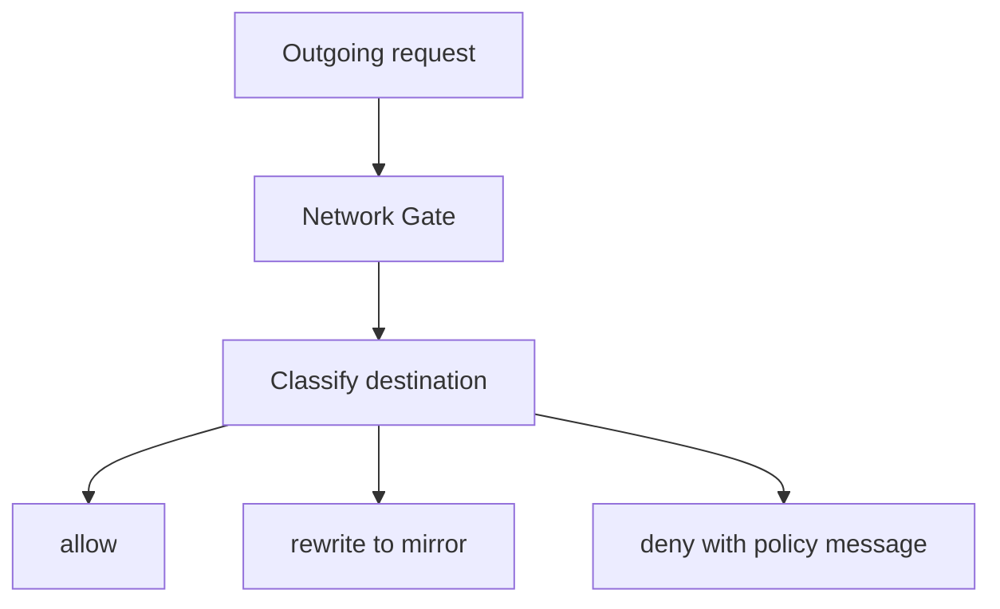

门禁输入：

| 输入 | 来源 |
| --- | --- |
| destination URL | fetch / SDK / WebSocket |
| traffic category | model、update、plugin、docs、rcs、optional |
| policy | Managed Settings |
| privacy level | 环境变量与设置 |
| execution mode | interactive、headless、daemon、bridge |

建议接口：

```ts
type TrafficCategory =
  | "model"
  | "control-plane"
  | "update"
  | "extension"
  | "docs"
  | "optional";

type NetworkDecision =
  | { type: "allow" }
  | { type: "rewrite"; url: string }
  | { type: "deny"; reason: string };

type NetworkPolicy = {
  allowedHosts: string[];
  deniedHosts: string[];
  rewrites: Record<string, string>;
  disableOptionalTraffic: boolean;
};
```

这里是建议新增的抽象，不代表现有代码已经有统一 network gate。

为什么需要统一 gate？

- Provider client 不会知道企业策略。
- 插件系统不应该自己重新实现 allowlist。
- 更新器不应该绕过 RCS 或 Managed Settings。
- Doctor 需要复用同一套规则做 dry-run。

---

## 70.14 Release Mirror 的现有基础

当前原生安装器已经具备几个关键能力：

- 从远端读取 latest / stable 版本信息。
- 下载指定平台二进制。
- 读取 manifest。
- 校验 SHA256。
- staging 目录下载。
- 原子安装。
- 保留旧版本。
- 安装锁。
- Windows 使用复制与回滚。

这说明 release mirror 不需要从零开始。

真正缺的是把默认远端变成可配置的企业入口。

建议新增配置：

```text
CLAUDE_CODE_RELEASES_BASE_URL=https://releases.example.internal/claude-code
CLAUDE_CODE_RELEASES_CHANNEL=stable
CLAUDE_CODE_RELEASES_REQUIRE_CHECKSUM=1
```

注意：这是建议配置。落地前需要把现有更新路径接入该配置。

---

## 70.15 Release Mirror 目录结构

建议企业镜像采用稳定、简单、可静态托管的结构：

```text
claude-code-releases/
  latest
  stable
  2.1.888/
    manifest.json
    darwin-arm64/
      claude
    darwin-x64/
      claude
    linux-arm64/
      claude
    linux-x64/
      claude
    linux-arm64-musl/
      claude
    linux-x64-musl/
      claude
    win32-x64/
      claude.exe
```

`latest` 文件内容：

```text
2.1.888
```

`stable` 文件内容：

```text
2.1.888
```

manifest 示例：

```json
{
  "version": "2.1.888",
  "createdAt": "2026-05-27T00:00:00.000Z",
  "platforms": {
    "darwin-arm64": {
      "file": "darwin-arm64/claude",
      "checksum": "sha256-placeholder"
    },
    "linux-x64": {
      "file": "linux-x64/claude",
      "checksum": "sha256-placeholder"
    },
    "win32-x64": {
      "file": "win32-x64/claude.exe",
      "checksum": "sha256-placeholder"
    }
  }
}
```

镜像仓库应该满足：

- 静态文件服务即可。
- HTTPS。
- 企业 CA 可验证。
- 支持 range request 更好，但不是必须。
- manifest 与二进制不可被普通用户修改。
- 发布后不可变。

---

## 70.16 二进制校验

高隔离部署的更新链路必须校验二进制。

最少校验：

1. manifest 中包含平台 checksum。
2. 下载后二进制计算 SHA256。
3. 不匹配则删除 staging 文件。
4. 不进入安装步骤。
5. 错误显示镜像 URL、版本、平台、期望 checksum、实际 checksum。

错误示例：

```text
Release checksum mismatch

Version: 2.1.888
Platform: linux-x64
Expected: sha256-placeholder-a
Actual: sha256-placeholder-b
Mirror: releases.example.internal
```

不要把错误写成：

```text
Update failed
```

企业运维需要能立刻判断是：

- 镜像同步失败。
- 文件被替换。
- 平台选择错误。
- manifest 与文件不一致。
- 用户机器拿到了缓存旧文件。

---

## 70.17 离线安装 bundle

Level 5 场景下，开发机没有可用网络。

这时需要一个完整离线 bundle。

建议结构：

```text
claude-code-offline-bundle/
  README.md
  checksums.json
  cli/
    darwin-arm64/
      claude
    linux-x64/
      claude
    win32-x64/
      claude.exe
  releases/
    stable
    2.1.888/
      manifest.json
  policies/
    managed-settings.json
    network-policy.json
    permission-policy.json
  docs/
    index.json
    search.db
    pages/
  plugins/
    marketplace.json
    archives/
  mcp/
    catalog.json
  rcs/
    image-metadata.json
  tests/
    smoke.json
    expected-output.json
```

安装过程不应该要求公网。

校验过程：

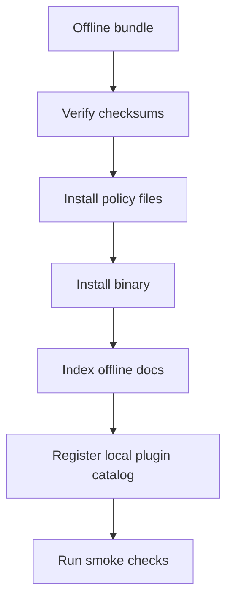

可以用 Bun 提供一个离线验收入口：

```text
bun run typecheck
bun run build
bun scripts/check-bundle-integrity.ts
bun scripts/smoke-test-commands.ts
```

这些命令面向仓库开发者。最终离线 bundle 可以再封装成用户侧命令。

---

## 70.18 版本策略：上限、下限与回滚

企业不一定希望所有开发机立刻升级到最新版本。

应支持：

| 策略 | 含义 |
| --- | --- |
| minimumVersion | 低于该版本必须升级 |
| maximumVersion | 高于该版本不允许安装 |
| preferredVersion | 默认推荐版本 |
| blockedVersions | 禁止版本 |
| rollbackVersion | 紧急回滚版本 |

示例：

```json
{
  "versionPolicy": {
    "minimumVersion": "2.1.880",
    "maximumVersion": "2.1.888",
    "preferredVersion": "2.1.888",
    "blockedVersions": ["2.1.884"],
    "rollbackVersion": "2.1.882"
  }
}
```

更新器的判断顺序建议：

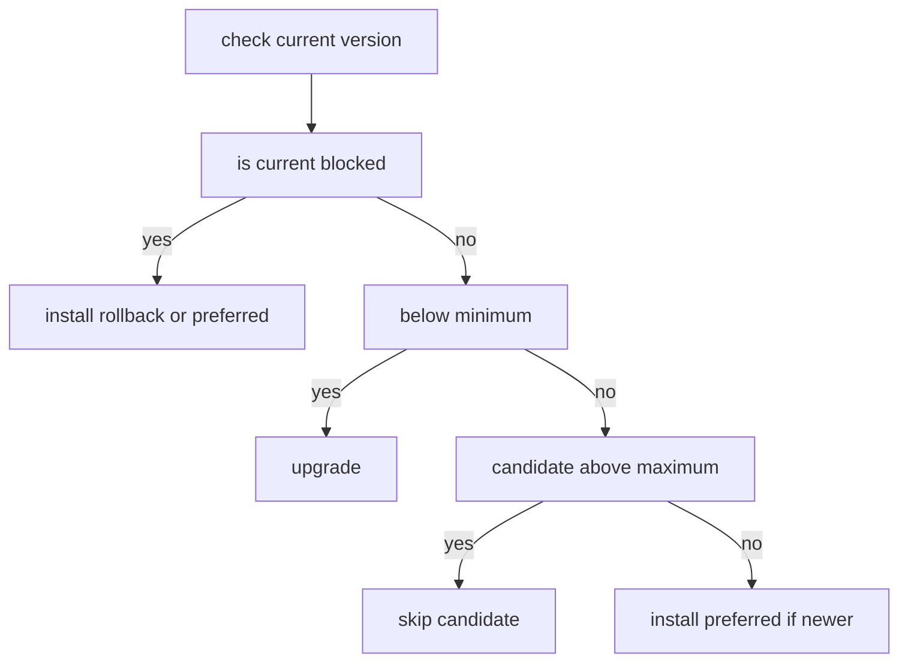

当前代码已有 `assertMinVersion`、`getMaxVersion`、`shouldSkipVersion` 相关思路，可以继续扩展成企业策略。

---

## 70.19 Release Notes 的离线化

Release notes 在普通环境里可以从远端 changelog 拉取。

高隔离环境应该改成：

- 随 release mirror 一起同步。
- 或随 offline bundle 一起打包。
- 或由企业管理员审核后发布到内网 docs。

建议目录：

```text
release-notes/
  2.1.888.md
  2.1.887.md
  index.json
```

index 示例：

```json
{
  "versions": [
    {
      "version": "2.1.888",
      "title": "Enterprise policy and private mirror improvements",
      "publishedAt": "2026-05-27T00:00:00.000Z",
      "file": "2.1.888.md"
    }
  ]
}
```

CLI 展示 release notes 时的优先级：

1. 企业内网 release notes。
2. 本地缓存。
3. 随二进制打包的 release notes。
4. 不展示，并说明当前处于高隔离模式。

不要在高隔离模式下因为 release notes 拉取失败而阻塞 CLI 启动。

---

## 70.20 插件市场镜像

插件系统恢复以后，高隔离环境不能允许随意访问公开 marketplace。

建议改成：

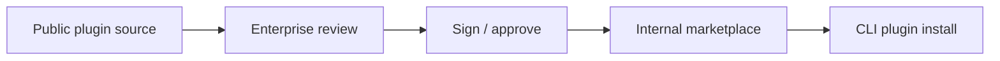

企业 marketplace manifest 示例：

```json
{
  "version": 1,
  "updatedAt": "2026-05-27T00:00:00.000Z",
  "plugins": [
    {
      "id": "approved-docs",
      "name": "Approved Docs",
      "version": "1.0.0",
      "archive": "archives/approved-docs-1.0.0.tgz",
      "checksum": "sha256-placeholder",
      "autoUpdate": false,
      "permissions": {
        "network": ["docs.example.internal"],
        "filesystem": "workspace"
      }
    }
  ]
}
```

策略要求：

- 默认关闭公开 marketplace。
- 只允许已批准插件。
- 插件 archive 必须校验 checksum。
- 插件权限进入审计。
- 插件更新跟随企业 release window。
- 插件安装失败不能回退到公网源。

高隔离默认：

```json
{
  "plugins": {
    "allowPublicMarketplace": false,
    "marketplaceUrl": "https://plugins.example.internal/claude-code/marketplace.json",
    "requireChecksum": true,
    "allowUserAddedMarketplaces": false
  }
}
```

---

## 70.21 MCP Catalog 镜像

MCP 是另一个容易破坏隔离边界的入口。

因为 MCP server 可以：

- 访问网络。
- 读取本地文件。
- 调用外部服务。
- 持有自己的凭据。
- 影响工具结果。

高隔离环境不能只看 MCP 名称，必须看 MCP 能力。

建议 MCP catalog：

```json
{
  "version": 1,
  "servers": [
    {
      "id": "internal-docs",
      "displayName": "Internal Docs Search",
      "command": "claude-mcp-internal-docs",
      "version": "1.0.0",
      "checksum": "sha256-placeholder",
      "network": ["docs.example.internal"],
      "filesystem": "none",
      "secrets": ["DOCS_TOKEN"],
      "approved": true
    }
  ]
}
```

CLI 启动时应该检查：

| 检查 | 目的 |
| --- | --- |
| MCP 是否来自 catalog | 防止用户手工添加未知 server |
| 二进制 checksum | 防止被替换 |
| 网络声明 | 进入 allowlist |
| secrets 声明 | 防止凭据散落 |
| 权限模式 | 与企业 policy 合并 |

如果用户尝试添加未批准 MCP，错误要明确：

```text
MCP server is blocked by enterprise policy

Server: unknown-search
Reason: server is not present in the approved MCP catalog
```

---

## 70.22 离线文档

接近官方体验的 CLI 不能在高隔离环境里失去文档帮助。

建议把文档分成三类：

| 文档 | 来源 | 访问方式 |
| --- | --- | --- |
| CLI help | 随二进制内置 | 本地 |
| Course / Guide | 离线 bundle | 本地或内网 docs |
| API / MCP docs | 企业审核快照 | 内网 |

离线 docs 结构：

```text
docs-snapshot/
  index.json
  pages/
    cli.md
    mcp.md
    permissions.md
    troubleshooting.md
  search/
    terms.json
    pages.json
```

CLI 查询逻辑：

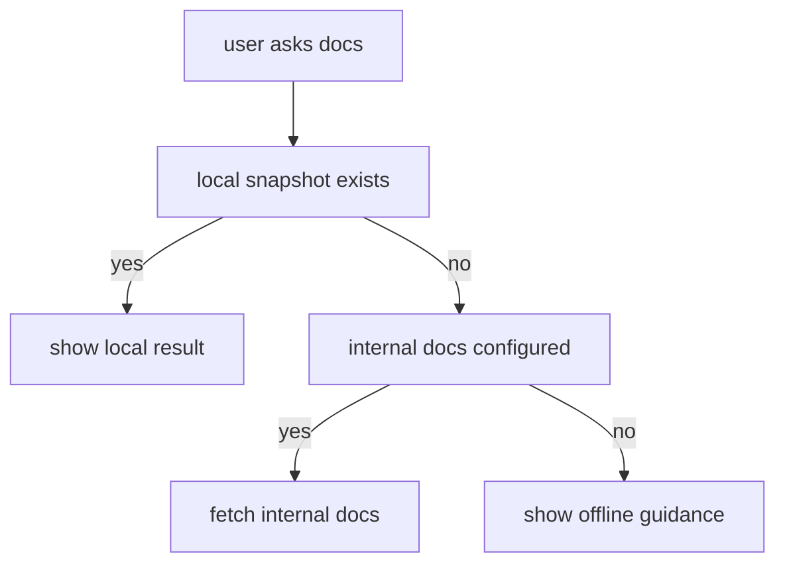

高隔离模式下不要静默访问公网文档。

---

## 70.23 Web Fetch 与 Web Search

Web Fetch / Web Search 是高隔离环境最敏感的能力之一。

建议策略：

| 模式 | Web Fetch | Web Search |
| --- | --- | --- |
| 默认联网 | 允许，按权限提示 |
| 企业出口受控 | 允许，但只走代理 |
| 私有网关 | 只允许内网域名 |
| 离线安装 | 默认禁用 |
| Air-gapped | 禁用 |

Policy 示例：

```json
{
  "web": {
    "fetch": {
      "enabled": true,
      "allowedHosts": ["docs.example.internal", "wiki.example.internal"]
    },
    "search": {
      "enabled": false,
      "reason": "External search is disabled in high isolation mode"
    }
  }
}
```

用户看到的错误：

```text
Web Search is disabled by enterprise policy.

Allowed alternative:
- internal docs search
- approved MCP catalog
```

这比“网络错误”更清楚。

---

## 70.24 RCS 内网自托管

RCS 是企业高隔离部署里非常关键的一块。

它可以承载：

- 环境注册。
- 会话列表。
- 权限审批。
- 工作轮询。
- 会话归档。
- 管理台展示。
- ACP agent 接入。

内网架构：

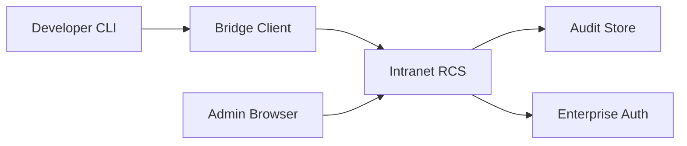

客户端配置形态：

```text
CLAUDE_BRIDGE_BASE_URL=https://rcs.example.internal
CLAUDE_CODE_REMOTE=1
```

token 仍然通过安全方式注入，不写进教程。

RCS 服务端建议配置：

```text
RCS_HOST=0.0.0.0
RCS_PORT=3000
RCS_BASE_URL=https://rcs.example.internal
RCS_VERSION=2.1.888
```

注意：这只是环境变量示例，不包含密钥。

---

## 70.25 RCS 高隔离增强项

自托管 RCS 要达到企业可用，建议补齐这些能力：

| 能力 | 说明 |
| --- | --- |
| 持久化环境表 | 服务重启后环境不丢 |
| 持久化会话索引 | 方便审计与追踪 |
| 权限请求日志 | 谁批准了什么工具 |
| 管理员身份 | 与企业 SSO 或内网账号绑定 |
| token 轮换 | API key / JWT 可轮换 |
| IP allowlist | 限制 CLI 与管理员入口 |
| TLS 强制 | 禁止明文生产部署 |
| audit export | 导出给 SIEM 或审计系统 |
| retention policy | 会话、日志、诊断包保留周期 |

当前轻量 RCS 更适合作为基础实现。

企业级要继续演进成：

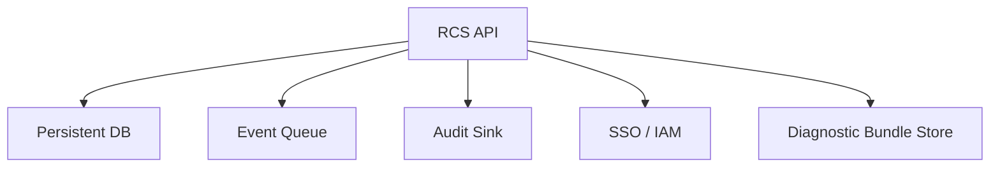

---

## 70.26 Bridge 模式的内网化

Bridge 模式在私有化里扮演的是“CLI 与控制面的长连接/轮询通道”。

它需要支持：

- 环境注册。
- 拉取工作。
- ack。
- stop。
- heartbeat。
- 权限响应。
- 会话重连。
- 会话归档。

在高隔离环境里，Bridge 不应该访问公开控制面。

策略：

```json
{
  "bridge": {
    "enabled": true,
    "baseUrl": "https://rcs.example.internal",
    "allowPublicBridge": false,
    "requireTrustedDevice": true,
    "heartbeatSeconds": 30
  }
}
```

如果 `baseUrl` 指向公网域名，CLI 应该拒绝：

```text
Bridge base URL is blocked by enterprise policy.

Configured host: public.example.com
Required suffix: .example.internal
```

---

## 70.27 诊断包：本地生成，不自动上传

高隔离环境里诊断依然重要，但不能自动上传。

诊断包应该包含：

| 内容 | 是否允许 |
| --- | --- |
| CLI version | 允许 |
| Bun version | 允许 |
| OS / arch | 允许 |
| Provider 类型 | 允许 |
| endpoint host | 允许 |
| endpoint path | 视策略 |
| API key | 禁止 |
| OAuth token | 禁止 |
| client private key | 禁止 |
| prompt / code context | 默认禁止 |
| network policy | 允许 |
| allowlist / denylist | 允许 |
| CA path | 允许 |
| CA content | 视策略 |
| mTLS cert path | 允许 |
| mTLS key content | 禁止 |

建议生成结构：

```text
diagnostic-bundle/
  manifest.json
  environment.json
  network-policy.json
  provider.json
  update.json
  rcs.json
  logs/
    redacted.log
```

manifest 示例：

```json
{
  "version": 1,
  "generatedAt": "2026-05-27T00:00:00.000Z",
  "mode": "high-isolation",
  "redaction": {
    "secrets": true,
    "prompts": true,
    "fileContents": true
  }
}
```

用户导出前应该看到摘要：

```text
Diagnostic bundle created locally.

No data was uploaded.
Secrets redacted: yes
Prompt content included: no
File content included: no
```

---

## 70.28 Doctor 的高隔离检查项

Doctor 在高隔离环境里应该从“通用环境检查”扩展成“部署验收检查”。

建议检查：

| 检查 | 期望 |
| --- | --- |
| privacy level | essential traffic enabled |
| telemetry | disabled |
| provider | approved |
| base URL | internal host |
| proxy | present when required |
| CA | file exists and parseable |
| mTLS cert | not expired |
| release mirror | reachable or explicitly offline |
| release manifest | checksum present |
| plugin marketplace | internal or disabled |
| MCP catalog | internal or disabled |
| RCS | internal or disabled |
| Web Search | disabled unless allowlisted |
| Web Fetch | allowlist enforced |

输出示例：

```text
High isolation doctor

Mode: restricted-egress
Provider: firstParty via private gateway
Base URL: models.example.internal
Telemetry: disabled
Nonessential traffic: disabled
Release mirror: configured
RCS: configured
Result: pass
```

失败示例：

```text
High isolation doctor

Result: fail

Failures:
- OPENAI_BASE_URL points outside approved domain
- release mirror is missing manifest checksum
- Web Search is enabled while policy requires offline mode
```

---

## 70.29 无网络 dry-run

Air-gapped 环境里最需要的是 dry-run。

dry-run 不应该真的访问网络，而是检查配置是否会触发网络访问。

输入：

- Managed Settings。
- 环境变量摘要。
- Provider 配置。
- 插件配置。
- MCP 配置。
- RCS 配置。
- 更新配置。

输出：

```json
{
  "mode": "air-gapped",
  "wouldAccessNetwork": false,
  "blockedFeatures": [
    "web-search",
    "release-update",
    "public-plugin-marketplace"
  ],
  "localFeatures": [
    "file-tools",
    "bash-tools",
    "offline-docs",
    "local-policy"
  ]
}
```

如果某个配置会访问外部地址，dry-run 必须指出：

```text
Dry-run failed

The following configured endpoints are outside approved offline mode:
- release mirror: releases.example.com
- plugin marketplace: plugins.example.com
```

---

## 70.30 日志脱敏

高隔离不代表可以把日志随意打出来。

日志脱敏规则：

| 类型 | 处理 |
| --- | --- |
| API key | 永远遮蔽 |
| bearer token | 永远遮蔽 |
| OAuth code | 永远遮蔽 |
| client private key | 永远不记录 |
| certificate | 默认不记录内容 |
| endpoint host | 可记录 |
| endpoint query | 默认遮蔽 |
| prompt | 默认不进入诊断包 |
| tool input | 视权限与策略 |
| tool output | 视权限与策略 |

建议脱敏形态：

```text
ANTHROPIC_AUTH_TOKEN=sk-...redacted
OPENAI_API_KEY=sk-...redacted
CLAUDE_CODE_CLIENT_KEY=/etc/claude-code/client.key
CLAUDE_CODE_CLIENT_KEY_PASSPHRASE=<redacted>
```

不要把完整 token 的前后缀都打出来。

高隔离环境通常会把日志接入企业审计系统，日志本身就是数据边界的一部分。

---

## 70.31 私有策略包

离线部署需要一个可版本化的 policy pack。

建议结构：

```text
policy-pack/
  pack.json
  managed-settings.json
  network-policy.json
  provider-policy.json
  permission-policy.json
  mcp-catalog.json
  plugin-policy.json
  checksums.json
```

`pack.json`：

```json
{
  "id": "enterprise-high-isolation",
  "version": "2026.05.27",
  "targetClaudeCode": {
    "minimumVersion": "2.1.880",
    "maximumVersion": "2.1.888"
  },
  "createdAt": "2026-05-27T00:00:00.000Z"
}
```

CLI 加载 policy pack 时：

1. 校验 pack checksum。
2. 校验目标 CLI 版本。
3. 合并 Managed Settings。
4. 初始化 network gate。
5. 初始化 Provider policy。
6. 初始化工具权限策略。
7. 输出策略摘要。

策略摘要示例：

```text
Enterprise policy loaded

Pack: enterprise-high-isolation
Version: 2026.05.27
Network: restricted-egress
Provider: managed
Public marketplace: disabled
Web Search: disabled
```

---

## 70.32 权限系统与高隔离

权限系统不能只管本地工具，也要管网络与扩展。

建议把权限分层：

| 层 | 控制对象 |
| --- | --- |
| Tool Permission | Bash、Read、Write、Edit、WebFetch |
| Network Permission | 访问哪些 host |
| Extension Permission | 插件、MCP、Skill |
| Provider Permission | 使用哪些模型入口 |
| Control Plane Permission | 是否允许 RCS / Bridge |
| Diagnostic Permission | 是否允许导出哪些数据 |

如果用户在高隔离环境里触发 Web Fetch：

```text
Tool: WebFetch
Destination: docs.example.internal
Decision: allowed
Reason: host is in enterprise allowlist
```

如果访问外部站点：

```text
Tool: WebFetch
Destination: external.example.com
Decision: blocked
Reason: host is not in enterprise allowlist
```

这类结果应该进入审计。

---

## 70.33 高隔离下的 Bash

Bash 工具是另一个关键风险点。

即使 CLI 自己禁用了外网，用户也可能让 Bash 执行网络命令。

因此高隔离环境至少要支持：

- 命令 allowlist / denylist。
- 网络命令检测。
- 环境变量注入控制。
- 工作目录限制。
- 输出脱敏。
- 超时。
- 审计。

策略示例：

```json
{
  "bash": {
    "enabled": true,
    "requireApproval": true,
    "blockedCommands": ["ssh", "scp", "rsync"],
    "blockedNetworkTools": ["curl", "wget"],
    "maxTimeoutSeconds": 120,
    "redactEnv": true
  }
}
```

这里不是说这些命令在所有企业都必须禁用，而是要让企业能用策略表达。

更高级的做法是把 Bash 放进 sandbox 或 remote runner，这样网络门禁可以由系统层兜底。

---

## 70.34 文件工具与数据边界

高隔离环境里，文件工具本身不是问题，问题是文件内容可能进入模型请求。

建议分三层控制：

| 控制 | 说明 |
| --- | --- |
| Read allowlist | 允许读取哪些目录 |
| Prompt inclusion policy | 哪些文件内容允许发给模型 |
| Diagnostic export policy | 哪些文件内容允许进诊断包 |

示例：

```json
{
  "files": {
    "allowedRoots": ["${workspace}"],
    "blockedGlobs": ["**/.env", "**/secrets/**", "**/*.pem"],
    "promptInclusion": {
      "requireApprovalForLargeFiles": true,
      "maxFileBytes": 200000
    },
    "diagnostics": {
      "includeFileContents": false
    }
  }
}
```

模型请求前可以做一次 content boundary check：

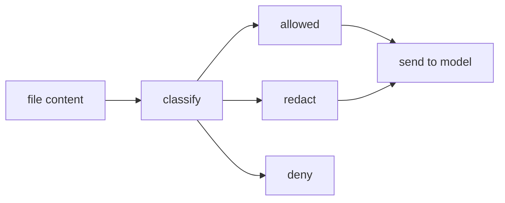

---

## 70.35 私有模型网关的工具调用审计

Claude Code 的价值很大一部分来自 tool use。

高隔离环境里，工具调用审计要能回答：

- 模型请求里暴露了哪些工具 schema。
- 模型选择了哪个工具。
- 工具参数是什么。
- 用户是否批准。
- 工具结果是否回传给模型。
- 结果是否包含敏感内容。

网关不一定要理解所有工具，但至少要能记录结构化元信息。

建议审计事件：

```json
{
  "type": "tool_call",
  "sessionId": "session-placeholder",
  "toolName": "FileRead",
  "approved": true,
  "inputBytes": 128,
  "outputBytes": 4096,
  "redacted": false,
  "timestamp": "2026-05-27T00:00:00.000Z"
}
```

不要记录：

- 完整 API key。
- 私钥内容。
- 用户没有授权记录的源代码片段。
- 被策略标记为敏感的文件内容。

---

## 70.36 私有网关与 streaming 超时

很多兼容网关最容易出问题的是 streaming。

常见问题：

| 问题 | 表现 |
| --- | --- |
| 网关缓冲完整响应 | CLI 看起来很慢 |
| 心跳缺失 | 长推理被中间层断开 |
| event 格式不一致 | adapter 报解析错误 |
| 错误混在 data 流里 | CLI 无法正常显示 |
| 代理 idle timeout 太短 | 大任务中断 |

建议：

- 网关按事件实时 flush。
- 长请求每 15 到 30 秒有 heartbeat。
- 错误事件走统一 schema。
- CLI 显示 gateway request id。
- 代理与 RCS WebSocket timeout 分开配置。

高隔离网络链路更长，timeout 需要比公网默认值更可控。

---

## 70.37 Update Mirror 与 RCS 的关系

RCS 可以帮助企业观察“谁还在旧版本”。

但更新本身不应该强依赖 RCS。

推荐关系：

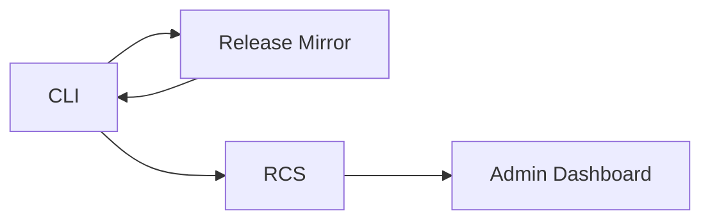

RCS 可以展示：

- 当前版本。
- 是否低于最低版本。
- 是否使用批准 Provider。
- 是否启用 essential traffic。
- 是否连接内网 RCS。
- 最近一次 Doctor 结果。

但如果 RCS 不可用：

- CLI 仍可本地运行。
- 本地策略仍然生效。
- 更新可以从镜像进行。
- 诊断包可以本地生成。

高隔离系统不能把所有能力都绑在一个控制面上。

---

## 70.38 私有部署验收矩阵

上线前建议做验收矩阵。

| 场景 | 期望 |
| --- | --- |
| 断开公网，只保留模型网关 | 普通对话可用 |
| 断开公网，只保留 RCS | 会话控制可用，模型请求按策略失败 |
| 断开 release mirror | CLI 启动不受影响，更新提示清晰 |
| 证书过期 | Doctor 明确指出证书过期 |
| token 缺失 | 提示通过环境注入，不展示 token |
| plugin mirror 不可达 | 插件安装失败，不回退公网 |
| MCP 未批准 | 明确被企业策略阻止 |
| Web Search 触发 | 被策略阻止 |
| Web Fetch 内网域名 | 允许 |
| Web Fetch 外部域名 | 阻止 |
| manifest checksum 错误 | 更新中止 |
| RCS token 过期 | 要求重新认证或重新注入 |
| no network dry-run | 不触发真实网络 |

每个场景都应该有自动化测试或手工 Runbook。

---

## 70.39 推荐测试入口

仓库开发阶段可以先跑这些最相关的检查：

```text
bun test src/utils/__tests__/privacyLevel.test.ts
bun test src/utils/model/__tests__/providers.test.ts
bun test packages/acp-link/src/__tests__/cert.test.ts
bun test packages/remote-control-server/src/__tests__/auth.test.ts
bun test packages/remote-control-server/src/__tests__/routes.test.ts
bun run typecheck
```

如果改到 release mirror，还要补：

```text
bun scripts/check-bundle-integrity.ts
bun scripts/smoke-test-commands.ts
```

如果改到 RCS，还要补：

```text
bun test packages/remote-control-server/src/__tests__/middleware.test.ts
bun test packages/remote-control-server/src/__tests__/services.test.ts
bun test packages/remote-control-server/src/__tests__/ws-handler.test.ts
bun test packages/remote-control-server/src/__tests__/disconnect-monitor.test.ts
```

本章不新增生产代码，所以最终只需要跑全局类型检查确认文档改动没有影响工程类型。

---

## 70.40 建议新增模块边界

如果继续落地本章能力，建议不要把所有逻辑塞进已有 API client。

可以新增这些模块：

```text
src/enterprise/
  networkPolicy.ts
  providerPolicy.ts
  releaseMirror.ts
  offlineBundle.ts
  diagnostics.ts
  policyPack.ts
```

职责：

| 模块 | 责任 |
| --- | --- |
| `networkPolicy.ts` | host allowlist、rewrite、deny |
| `providerPolicy.ts` | Provider 与 base URL 校验 |
| `releaseMirror.ts` | mirror URL、manifest、版本策略 |
| `offlineBundle.ts` | bundle 校验与本地资源定位 |
| `diagnostics.ts` | 高隔离诊断包 |
| `policyPack.ts` | policy pack 加载、校验、合并 |

注意：这只是后续工程建议。当前章节先建立设计与验收标准。

---

## 70.41 统一配置摘要

高隔离环境里，用户和管理员都需要看到“当前到底用了什么配置”。

建议 CLI 启动时可输出摘要：

```text
Claude Code enterprise configuration

Mode: high-isolation
Provider: firstParty
Model endpoint: models.example.internal
RCS: rcs.example.internal
Release mirror: releases.example.internal
Plugin marketplace: disabled
MCP catalog: mcp.example.internal
Web Search: disabled
Telemetry: disabled
```

摘要要求：

- 显示 host，不显示 token。
- 显示启用/禁用状态。
- 显示策略来源。
- 显示冲突配置。
- 可以写入诊断包。

冲突示例：

```text
Configuration conflict

Policy requires private endpoint suffix: .example.internal
Configured ANTHROPIC_BASE_URL: https://models.external.example
Action: update provider configuration or contact your administrator
```

---

## 70.42 私有部署 Runbook

企业管理员可以按下面步骤部署。

### 第一步：确定隔离等级

选择：

- restricted-egress。
- private-gateway。
- intranet-control-plane。
- offline-mirror。
- air-gapped。

### 第二步：准备模型入口

确定：

- Anthropic compatible。
- OpenAI compatible。
- Gemini compatible。
- Cloud provider。

并确认：

- endpoint host。
- token 注入方式。
- CA。
- mTLS。
- request id。
- streaming。
- rate limit。

### 第三步：准备策略包

包含：

- provider policy。
- network policy。
- permission policy。
- plugin policy。
- MCP catalog。
- update policy。

### 第四步：准备镜像

包含：

- release manifest。
- 平台二进制。
- checksum。
- release notes。
- plugin archives。
- docs snapshot。

### 第五步：部署 RCS

如果需要远程控制：

- 部署内网 RCS。
- 配置 base URL。
- 配置 token。
- 配置 TLS。
- 配置管理员入口。
- 配置审计。

### 第六步：客户端验收

运行：

```text
bun run typecheck
```

项目开发者还可以运行相关 Bun 测试。

最终用户侧应该运行未来的 high-isolation doctor。

---

## 70.43 失败模式清单

高隔离部署最常见失败模式：

| 失败 | 根因 |
| --- | --- |
| CLI 启动慢 | release notes 或更新检查未正确离线化 |
| 模型请求失败 | base URL、CA、mTLS、token、代理任一配置错误 |
| streaming 卡住 | 网关缓冲或代理 idle timeout |
| 工具调用失败 | 兼容网关没有支持 tool schema |
| 插件安装失败 | marketplace 未镜像或 checksum 不匹配 |
| MCP 启动失败 | catalog 与本地二进制不一致 |
| RCS 无法连接 | WebSocket / SSE 被代理拦截 |
| Doctor 误报 | 没有复用统一 policy |
| 日志泄密 | 脱敏规则没有覆盖新增 env |
| 用户绕过 Provider | Managed Settings 没锁住 Provider |

解决方式不是给每个模块打补丁，而是统一：

- policy。
- resolver。
- network gate。
- diagnostics。
- acceptance tests。

---

## 70.44 本章落地优先级

如果要从当前仓库继续开发，建议按下面顺序：

1. 高隔离 Doctor。
2. Provider endpoint policy。
3. 统一 network gate。
4. release mirror 配置入口。
5. offline bundle 校验。
6. plugin marketplace mirror。
7. MCP catalog policy。
8. RCS 企业持久化。
9. 诊断包本地导出。
10. 完整验收套件。

原因：

- Doctor 可以最快发现真实部署问题。
- Provider policy 可以先守住最大数据边界。
- network gate 可以防止后续模块各自绕过策略。
- release mirror 和 offline bundle 解决安装与升级。
- plugin / MCP 是扩展入口，风险高但可以稍后逐步推进。
- RCS 企业持久化属于运营增强，不应该阻塞单机高隔离可用。

---

## 70.45 最小可用私有化方案

如果只追求最小可用，可以先做到：

```text
private model gateway
essential traffic only
custom CA
optional mTLS
internal RCS disabled or configured
public marketplace disabled
Web Search disabled
release update disabled or internal mirror
local diagnostic bundle
```

配置摘要：

```text
CLAUDE_CODE_DISABLE_NONESSENTIAL_TRAFFIC=1
DISABLE_TELEMETRY=1
ANTHROPIC_BASE_URL=https://models.example.internal/anthropic
ANTHROPIC_MODEL=enterprise-coder
NODE_EXTRA_CA_CERTS=/etc/claude-code/enterprise-ca.pem
```

如果需要 OpenAI 兼容：

```text
CLAUDE_CODE_USE_OPENAI=1
OPENAI_BASE_URL=https://models.example.internal/openai
OPENAI_MODEL=enterprise-coder
```

真实密钥仍然由环境注入，不写进配置文件。

---

## 70.46 接近官方体验还差什么

从“能跑”到“接近官方 Claude Code”，还差这些体验：

| 能力 | 要求 |
| --- | --- |
| 统一错误文案 | 用户知道是策略、网络、证书、token 还是模型问题 |
| 一键 Doctor | 管理员能快速定位部署缺陷 |
| 自动降级 | release notes、插件、docs 失败不影响核心推理 |
| 离线文档 | 无网也能查命令与排障 |
| 策略解释 | 被拦截时说明哪条 policy 生效 |
| 审计可追踪 | request id、session id、tool event 可串起来 |
| 更新可回滚 | 坏版本能快速退回 |
| 私有控制面 | RCS 内网审批、会话管理 |
| 无公网验收 | 可以证明没有外部 egress |

这也是第 70 章的最终判断：

> 高隔离部署不是一个功能点，而是一套把模型、网络、更新、扩展、诊断、控制面全部企业化的系统工程。

---

## 70.47 本章小结

本章完成了高隔离与私有化部署的设计梳理：

- 定义了六个隔离等级。
- 梳理了当前仓库已有能力。
- 区分了已具备能力和后续建议能力。
- 设计了私有模型网关接入方式。
- 设计了代理、CA、mTLS 的部署边界。
- 设计了 release mirror 和离线 bundle。
- 设计了插件市场、MCP catalog、离线文档。
- 设计了内网 RCS 与 Bridge 的企业化路径。
- 设计了本地诊断包和高隔离 Doctor。
- 给出了私有部署 Runbook 与验收矩阵。

到这里，70 章课程正式收束。

安全验证与红队演练不再作为新章节展开，而是归入本章的后续工程清单：permission fuzzing、prompt injection、防止 secret 外泄、sandbox escape、工具参数注入、MCP 风险、网络 egress 测试、供应链校验与合规验收自动化，都属于高隔离部署最终验收的一部分。
