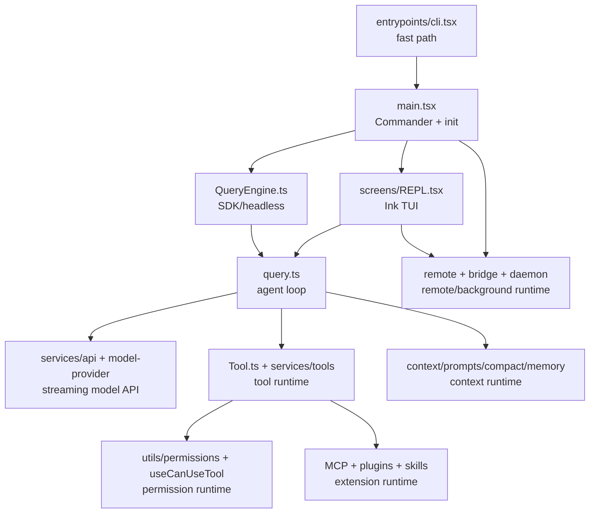

# 00. 总体架构与能力地图

## 一句话定位

Claude Code 是一个运行在终端中的 agent runtime。它把 LLM、工具执行、权限控制、上下文压缩、会话持久化、TUI、MCP/插件扩展、远程执行和后台任务组织成一个统一系统。

核心源码参考：

- `claude-code/src/entrypoints/cli.tsx`: 最外层 CLI fast path。
- `claude-code/src/main.tsx`: Commander CLI、初始化、模式分发。
- `claude-code/src/screens/REPL.tsx`: 交互式 TUI 主屏。
- `claude-code/src/query.ts`: 核心 agent loop。
- `claude-code/src/QueryEngine.ts`: SDK/headless 会话级 query 引擎。
- `claude-code/src/Tool.ts`: 工具接口和工具上下文。
- `claude-code/src/tools.ts`: 内置工具池和 MCP 工具池组装。

## 顶层分层

## 核心架构原则

### 1. 入口快路径优先

`entrypoints/cli.tsx` 在加载完整 CLI 前处理大量 fast path，例如 `--version`、Chrome/MCP、ACP、daemon worker、remote-control、daemon、background、autonomy 等。这样可以避免为了简单命令加载完整 React/TUI/Commander 模块树。

### 2. Agent loop 是 async generator

`query()` 和 `queryLoop()` 通过 async generator 持续 yield `StreamEvent`、`Message`、`ToolUseSummaryMessage` 等事件。TUI、SDK、headless 都能消费同一条流式事件链。

### 3. 工具是 runtime 边界

每个工具不仅是一个 `call()` 函数，还包含：

- 模型可见描述和 prompt。
- Zod input schema 和可选 JSON schema。
- 是否只读、是否并发安全、是否开放世界、是否破坏性。
- 权限检查、hook matcher、结果映射、UI 渲染函数。
- MCP metadata、deferred/alwaysLoad 标记。

### 4. 权限不是工具内部临时判断

权限体系是独立 runtime：配置规则、工具自定义权限、hooks、自动分类器、交互弹窗、非交互降级、MCP server 级匹配共同参与决策。

### 5. 上下文管理是主循环的一部分

每次模型调用前都会经过上下文阶段：compact boundary、tool result budget、snip、microcompact、context collapse、autocompact、predictive compact、blocking limit。上下文不是简单拼接历史消息。

### 6. 扩展能力通过多个入口注入

扩展不只来自 MCP tools。插件可以注入 commands、skills、hooks、MCP servers；skills 可以来自磁盘、bundled、plugin、managed、MCP resources；deferred tools 通过 `SearchExtraTools` 和 `ExecuteTool` 进入。

## 功能地图

| 模块 | 主要能力 | 关键源码 |
| --- | --- | --- |
| CLI bootstrap | fast path、feature gate、daemon/remote 快速入口 | `src/entrypoints/cli.tsx` |
| CLI main | Commander options/subcommands、初始化、headless/TUI 分发 | `src/main.tsx` |
| TUI | REPL、PromptInput、Messages、Permission UI、StatusLine | `src/screens/REPL.tsx`, `src/components/*` |
| Agent loop | streaming、tool loop、错误恢复、stop hooks、token budget | `src/query.ts` |
| SDK/headless | 会话级状态、transcript、SDK message 输出 | `src/QueryEngine.ts`, `src/cli/print.ts` |
| API/model | Anthropic、Bedrock、Vertex、OpenAI/Gemini/Grok、fallback | `src/services/api/*`, `packages/@ant/model-provider/*` |
| Tools | 内置工具、工具调度、结果处理 | `src/Tool.ts`, `src/tools.ts`, `src/services/tools/*` |
| Permissions | 模式、规则、交互确认、classifier、policy | `src/utils/permissions/*`, `src/hooks/useCanUseTool.tsx` |
| MCP | server config、connection、tool/resource/prompt、auth | `src/services/mcp/*`, `packages/mcp-client/*` |
| Plugins | marketplace、安装、启停、manifest、hooks/skills/MCP | `src/utils/plugins/*`, `src/services/plugins/*` |
| Skills | bundled/user/plugin/MCP skills、SkillTool、skill discovery | `src/skills/*`, `packages/builtin-tools/src/tools/SkillTool/*` |
| Context | CLAUDE.md、git status、system/user context、attachments | `src/context.ts`, `src/utils/attachments.ts` |
| Compact | auto compact、microcompact、snip、reactive compact | `src/services/compact/*` |
| Session | JSONL transcript、resume、history、file history | `src/utils/sessionStorage.ts`, `src/utils/sessionRestore.ts` |
| Remote | CCR remote、SSH、direct connect、bridge | `src/remote/*`, `src/ssh/*`, `src/server/*`, `src/bridge/*` |
| Background | daemon、bg sessions、tmux/detached engines | `src/daemon/*`, `src/cli/bg/*` |
| Agents/tasks | subagent、task tools、swarm/coordinator | `packages/builtin-tools/src/tools/AgentTool/*`, `src/utils/swarm/*` |

## 对后续实现的启示

重新实现时建议先固定这些基础接口：

- `Message` / `ContentBlock` / transcript 格式。
- `Tool` / `ToolUseContext` / `ToolResult`。
- `PermissionContext` / `PermissionResult` / permission rule。
- `QueryEvent` / `Terminal` / `Continue`。
- `Command` 类型和 command 执行结果。
- `AppState` 和 session persistence。

如果这些接口不稳定，后续工具、TUI、MCP、插件、remote 都会互相拖拽。

