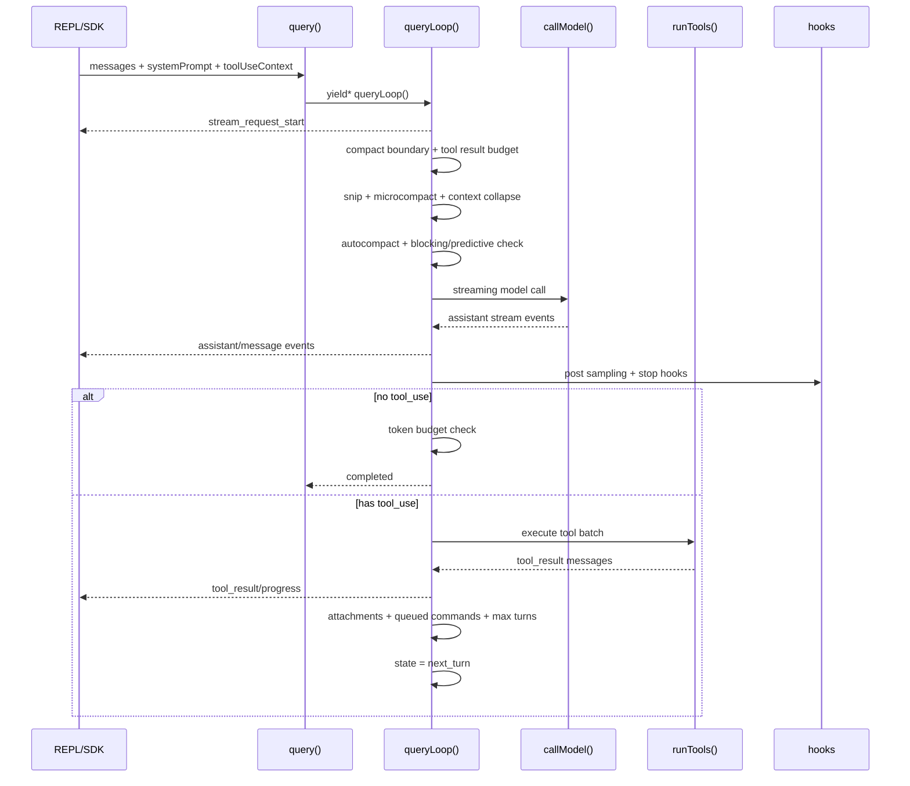

# 01. Core Agent Loop

## 核心入口

源码有两条主要 query 入口：

- `src/QueryEngine.ts`: SDK/headless 会话级入口。`QueryEngine.submitMessage()` 维护跨 turn 状态，例如 transcript、permission denials、usage、file state、AbortController。
- `src/query.ts`: 真正的模型调用和工具循环。`query()` 是外层 generator，`queryLoop()` 是核心状态机。

交互式 REPL 也直接调用 `query()`，入口在 `src/screens/REPL.tsx` 的 `onQueryImpl`。

## 状态机模型

`queryLoop()` 本质是一个 `while (true)` 状态机。状态集中在 `State`：

- `messages`: 当前对话上下文。
- `toolUseContext`: 工具上下文，包含 app state、权限、工具列表、hooks、MCP、skills、通知、stream 状态等。
- `autoCompactTracking`: 自动压缩状态。
- `maxOutputTokensRecoveryCount`: 输出 token 恢复次数。
- `hasAttemptedReactiveCompact`: 是否已经做过响应式压缩。
- `maxOutputTokensOverride`: 临时输出 token 上限。
- `pendingToolUseSummary`: 工具摘要异步任务。
- `stopHookActive`: stop hook 是否处于阻塞重试。
- `turnCount`: 当前 agent 内部轮次。
- `transition`: 继续原因。

主要 terminal：

- `completed`
- `blocking_limit`
- `image_error`
- `model_error`
- `aborted_streaming`
- `aborted_tools`
- `prompt_too_long`
- `stop_hook_prevented`
- `hook_stopped`
- `max_turns`

主要 continue：

- `next_turn`: 执行完工具，带 tool_result 进入下一轮。
- `collapse_drain_retry`: prompt too long 后先排空 context-collapse。
- `reactive_compact_retry`: 413/media 错误后做 reactive compact。
- `max_output_tokens_escalate`: 提升输出 token 上限重试。
- `max_output_tokens_recovery`: 注入继续生成提示并重试。
- `stop_hook_blocking`: stop hook 注入错误消息后重试。
- `token_budget_continuation`: token budget 未满足，注入 nudge 继续。

## 单轮执行顺序

## 上下文压缩链路

每次 API 调用前，`queryLoop()` 都会处理上下文：

1. `getMessagesAfterCompactBoundary()`: 只取 compact boundary 之后的消息。
2. 删除历史 `toolUseResult` 原始 payload，避免 UI 已消费的大对象常驻内存。
3. `applyToolResultBudget()`: 控制 tool result 总字符预算，可将大结果替换为持久化引用。
4. `HISTORY_SNIP`: 按历史窗口裁剪。
5. `microcompact`: 清理/压缩工具结果，降低上下文占用。
6. `contextCollapse`: 按 collapse store 投影上下文视图。
7. `autocompact`: approaching limit 时 fork 模型总结旧上下文。
8. `predictive autocompact`: 估算下一轮增长会溢出时提前 compact。
9. `blocking limit`: 自动压缩不可用或无效时，阻止 API 调用。

相关源码：

- `src/services/compact/autoCompact.ts`
- `src/services/compact/compact.ts`
- `src/services/compact/reactiveCompact.ts`
- `src/services/compact/microCompact.ts`
- `src/services/compact/snipCompact.ts`
- `src/utils/toolResultStorage.ts`

## 错误恢复机制

模型调用经过 `services/api/withRetry.ts` 和 `queryLoop()` 两层恢复：

- API retry: 处理 429/529、OAuth refresh、stale connection、fallback model、max_tokens/context 调整。
- Streaming fallback: fallback 触发后 tombstone 已 yield 的 partial assistant/tool result，避免无效 tool_use_id 留在 UI/transcript。
- Prompt too long: withheld，不立即展示。优先 context-collapse drain，再 reactive compact，最后才暴露错误。
- Media/image too large: withheld 后尝试 reactive compact。
- Max output tokens: 可升级输出 token 上限，或注入继续生成消息恢复。

## 工具循环

模型消息中出现 `tool_use` 后：

1. `queryLoop()` 收集 tool blocks。
2. 可选 `StreamingToolExecutor` 在模型流式输出期间提前执行已完整的 tool_use。
3. 常规路径调用 `runTools()`。
4. 工具结果转成 user message 的 `tool_result` content block。
5. 新状态拼接：`messagesForQuery + assistantMessages + toolResults`。
6. `transition = next_turn`，重新进入模型调用。

这意味着“执行工具”不是一个外部回调，而是 agent loop 的第一等阶段。

## Token budget

源码里有两套预算：

- API `task_budget`: 传给服务端，compact 后用 `remaining` 修正服务端看不到的已消耗上下文。
- 本地 `TOKEN_BUDGET`: 根据当前 turn output tokens 判断是否继续，未达成时注入 nudge message，让模型继续完成任务。

相关源码：

- `src/query/tokenBudget.ts`
- `src/query.ts`
- `src/services/api/claude.ts`

## 实现时必须保留的抽象

- `query()` 必须是可流式消费的 async generator。
- `Terminal` 和 `Continue` 要显式建模。
- 工具执行必须回到 message 流，而不是单独 callback。
- compact/error recovery/token budget 必须在 loop 内部统一处理。
- TUI 和 SDK 只能消费事件，不应该各自实现一套 agent loop。

