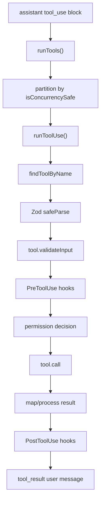

# 03. 工具系统与权限系统

## 工具接口

工具核心类型在 `src/Tool.ts`。一个工具不是简单函数，而是一组 runtime 能力：

- `name`, `aliases`, `searchHint`
- `inputSchema`, `inputJSONSchema`, `outputSchema`
- `call(args, context, canUseTool, parentMessage, onProgress)`
- `description(input, options)`
- `prompt(options)`
- `isEnabled()`
- `isConcurrencySafe(input)`
- `isReadOnly(input)`
- `isDestructive(input)`
- `isOpenWorld(input)`
- `checkPermissions(input, context)`
- `validateInput(input, context)`
- `preparePermissionMatcher(input)`
- `mapToolResultToToolResultBlockParam(result, toolUseId)`
- UI 渲染函数，例如 `renderToolUseMessage`、`renderToolResultMessage`
- MCP metadata: `mcpInfo`
- deferred tool metadata: `shouldDefer`, `alwaysLoad`

`ToolUseContext` 是工具运行时上下文，包含 AppState、权限上下文、工具池、MCP clients/resources、commands、agent definitions、hooks、通知、message 更新函数、Langfuse trace、file history、content replacement 等。

## 工具池

工具注册入口在 `src/tools.ts`：

- `getAllBaseTools()`: 所有内置工具。
- `getTools(permissionContext)`: 根据 simple mode、REPL mode、deny rules、feature flags 过滤。
- `assembleToolPool(permissionContext, mcpTools)`: 合并内置工具和 MCP tools，内置工具优先，排序保证 prompt cache 稳定。
- `getMergedTools(...)`: 获取完整工具列表用于 token counting 或工具搜索。

工具大类：

- 文件和代码：`Read`, `Edit`, `Write`, `NotebookEdit`, `LSP`
- Shell：`Bash`, `PowerShell`, `REPL`
- 搜索和网络：`Glob`, `Grep`, `WebFetch`, `WebSearch`, `VaultHttpFetch`
- Agent 和任务：`Agent`, `TaskOutput`, `TaskStop`, `TaskCreate`, `TaskGet`, `TaskUpdate`, `TaskList`
- 计划和交互：`EnterPlanMode`, `ExitPlanMode`, `AskUserQuestion`
- Skills 和延迟发现：`Skill`, `SearchExtraTools`, `ExecuteTool`, `DiscoverSkills`
- MCP：`ListMcpResources`, `ReadMcpResource`, dynamic MCP tools
- 高级 feature：cron、monitor、browser、workflow、worktree、send message、team、review artifact 等

## 工具执行链路

关键源码：

- `src/services/tools/toolOrchestration.ts`
- `src/services/tools/toolExecution.ts`
- `src/services/tools/StreamingToolExecutor.ts`
- `src/utils/toolResultStorage.ts`

## 并发调度

`runTools()` 会把同一轮 tool_use 分批：

- 连续 `isConcurrencySafe() === true` 的工具批量并发执行。
- 非并发安全工具串行执行。
- 并发批次的 `contextModifier` 会先排队，批次结束后按 tool_use 顺序应用，避免并发写 context。
- 最大并发由 `CLAUDE_CODE_MAX_TOOL_USE_CONCURRENCY` 控制，默认 10。

这使 Read/Grep/Glob 等只读工具可以并发，而 Bash/Edit/Write 等默认串行。

## 权限模式

权限模式定义在 `src/types/permissions.ts` 和 `src/utils/permissions/*`：

- `default`: 常规模式，危险或未授权工具需要确认。
- `plan`: 计划模式，阻止执行型或破坏性操作。
- `acceptEdits`: 自动接受编辑类工具，其他仍按规则。
- `bypassPermissions`: 尽可能跳过确认，但仍不能绕过强制交互/安全检查。
- `dontAsk`: 非交互倾向，无法问用户时拒绝或降级。
- `auto`: 内部自动模式，结合 classifier。

规则来源包括：

- user settings
- project settings
- local settings
- flag settings
- policy settings
- CLI arg
- command
- session

规则格式支持：

- `Tool`
- `Tool(content)`
- MCP server/tool 前缀，如 `mcp__server`、`mcp__server__*`

解析和匹配参考：

- `src/utils/permissions/permissionRuleParser.ts`
- `src/utils/permissions/permissions.ts`
- `src/utils/permissions/PermissionRule.ts`

## 权限决策顺序

高层顺序：

1. blanket deny rule。
2. blanket ask rule。
3. 工具自己的 `checkPermissions()`，例如 Bash 命令分析、文件路径安全、MCP 注解。
4. content-level allow/deny/ask。
5. permission mode 处理。
6. classifier / yolo / auto mode。
7. hooks 结果。
8. 交互确认 UI 或非交互降级。

交互侧由 `src/hooks/useCanUseTool.tsx` 协调：

- 先调用 `hasPermissionsToUseTool()`。
- `allow` 直接返回。
- `deny` 记录并返回。
- `ask` 时进入 coordinator/swarm/interactive handler。
- Bash 可等待 speculative classifier 最多约 2 秒，再决定是否弹窗。

## Hooks 与工具权限

工具执行支持：

- `PreToolUse`: 可以阻止、更新 input、返回 permission decision、添加消息。
- `PostToolUse`: 可以观察/修改结果。
- permission denied hooks。
- stop hooks 在 assistant 完成后介入，可能阻止继续。

源码：

- `src/services/tools/toolHooks.ts`
- `src/utils/hooks.ts`
- `src/query/stopHooks.ts`

## 工具结果处理

工具结果会被转为 Anthropic-compatible `tool_result` block。大结果不能无限塞回上下文：

- 单工具 `maxResultSizeChars` 控制结果大小。
- tool result budget 控制聚合大小。
- content replacement 可持久化大结果。
- microcompact 可以清理旧 tool result。

这部分对长会话稳定性非常关键。

## 重新实现建议

先实现最小但正确的工具 runtime：

1. 固定 `Tool`、`ToolUseContext`、`ToolResult`。
2. 实现 `runTools()` 的串行/并发分批。
3. 实现 `runToolUse()` 的校验、hooks、权限、调用、结果映射。
4. 权限规则先支持 `Tool` 和 `Tool(pattern)`，再支持 MCP server 级匹配。
5. TUI permission queue 与 `canUseTool` 分离，避免工具执行直接依赖 UI。
