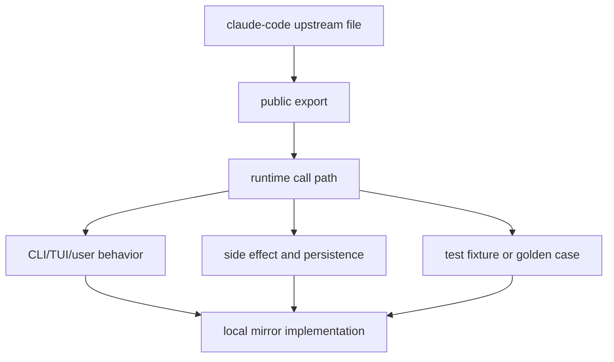
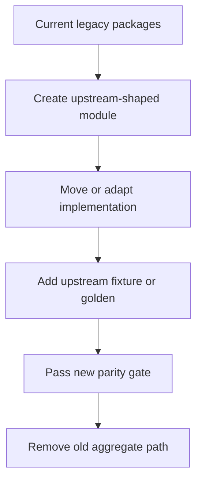

# Source-First 1:1 Refactor Plan

## 目标

本重构的目标是让当前仓库做到源码级、结构级、行为级、TUI 体验级、外部集成级 100% 对齐 `claude-code/`。

完成后，不能再用“strict parity gate 视角下的映射覆盖、关键符号存在、本地测试通过”来证明 1:1。完成标准必须回到源码事实：

- 上游有的 package，本地有同名 package 或同构 package 边界。
- 上游有的 source module，本地有同路径或明确同构路径。
- 上游有的 command module，本地有同名 command module。
- 上游有的 tool module，本地有同名 tool module。
- 上游有的 TUI component、hook、service、transport、native package，本地有同构实现。
- 上游 fixture 能迁移的全部迁移，不能迁移的必须有等价 golden case 和原因记录。

## 当前问题

当前实现已经能通过 `/parity --strict --tui --platform --voice --memory --agent-workflows --source-inventory`，但这只能说明当前 gate 认为“覆盖充分”。它不能证明源码级 1:1。

关键问题：

- 代码量差异巨大：上游 `claude-code/src + claude-code/packages` TS/TSX 约 68 万行，本地 `packages` TS/TSX 约 5.6 万行。
- 结构不是同构：大量上游目录被一个本地文件承接。
- TUI 体验不是同构：滚动、复制、streaming、loading、markdown、overlay 曾反复出现肉眼可见差异。
- Provider 不是同构：当前默认 provider 是 DeepSeek adapter，不是 Claude Code 原生 provider registry 和 Anthropic message/cache/error 语义。
- Native package 不是同构：多个上游 native package 被映射到普通 TS helper。
- 外部 control plane 不能证明同构：MCP、OAuth、plugin marketplace、remote bridge、browser、IDE、mobile、team/coordinator 仍需要真实 transport 与上游行为对齐。

## 非目标

以下内容不允许作为最终完成标准：

- 一个本地文件承接多个上游源码目录。
- 只检查 symbol 存在。
- 只登记 command/tool surface，不实现真实行为。
- 用本地 JSON 记录替代 HTTP、SSE、WebSocket、OAuth、stdio MCP、browser protocol、native addon。
- 只跑单元测试，不跑 TUI golden、transport smoke、native smoke。
- 用 DeepSeek 行为替代 Claude provider 行为。
- 用 manifest mapping 让 gate pass。

## 重构原则

### 1. Source First

`claude-code/` 是唯一规格源。每一项功能都必须从上游源码入口开始追踪：



### 2. Structure Before Feature

先修结构，再搬行为。否则会继续形成 many-to-one 聚合实现。

顺序：

1. package surface；
2. source directory；
3. entrypoint；
4. public export；
5. command/tool/component/service implementation；
6. test fixture；
7. golden/smoke gate。

### 3. No Many-To-One Final State

临时迁移可以保留 adapter，但最终必须清零 many-to-one mapping。

示例债务：

```text
claude-code/src/components/* -> packages/tui/src/TuiApp.tsx
claude-code/src/services/langfuse/* -> packages/core/src/observability.ts
claude-code/src/cli/transports/* -> packages/cli/src/transports.ts
```

最终形态必须拆成上游同构模块。

### 4. Behavior Golden Over Symbol Evidence

关键行为必须用 golden case 验证：

- CLI stdout/stderr；
- exit code；
- JSON/stream-json frame；
- ANSI/TUI frame；
- mouse/keyboard interaction；
- permission prompt；
- tool result；
- transcript record；
- persisted file；
- network request/response；
- native package availability。

### 5. Legacy Is Migration Source Only

当前 `packages/*` 里的实现可以迁移，但不能直接作为最终架构。

迁移策略：

- 先复制行为到同构模块；
- 再把旧聚合模块改成薄 re-export 或 compatibility layer；
- 新 gate 通过后删除旧聚合模块；
- 删除旧 manifest gate 的完成地位。

## 目标结构

### Root Source

必须镜像这些上游目录：

```text
src/assistant
src/bootstrap
src/bridge
src/buddy
src/cli
src/commands
src/components
src/constants
src/context
src/coordinator
src/daemon
src/entrypoints
src/environment-runner
src/hooks
src/jobs
src/keybindings
src/memdir
src/migrations
src/moreright
src/native-ts
src/outputStyles
src/plugins
src/proactive
src/query
src/remote
src/schemas
src/screens
src/self-hosted-runner
src/server
src/services
src/skills
src/ssh
src/state
src/tasks
src/types
src/upstreamproxy
src/utils
src/vim
src/voice
```

### Workspace Packages

必须镜像这些上游 package surface：

```text
packages/@ant/claude-for-chrome-mcp
packages/@ant/computer-use-input
packages/@ant/computer-use-mcp
packages/@ant/computer-use-swift
packages/@ant/ink
packages/@ant/model-provider
packages/acp-link
packages/agent-tools
packages/audio-capture-napi
packages/builtin-tools
packages/color-diff-napi
packages/image-processor-napi
packages/mcp-client
packages/modifiers-napi
packages/remote-control-server
packages/url-handler-napi
packages/weixin
```

本地可以保留 `packages/core`、`packages/session` 等辅助包，但不能用它们吞并上游 package surface。

## 功能域重构

### CLI And Entrypoints

必须对齐：

- `src/entrypoints/cli.tsx`
- `src/entrypoints/mcp.ts`
- `src/entrypoints/agentSdkTypes.ts`
- `src/entrypoints/sandboxTypes.ts`
- `src/entrypoints/sdk/*`
- `src/cli/print.ts`
- `src/cli/structuredIO.ts`
- `src/cli/remoteIO.ts`
- `src/cli/transports/*`
- `src/cli/bg/*`
- `src/cli/handlers/*`

验收：

- CLI help diff 为 0。
- print mode stdout/stderr/exit code diff 为 0。
- stream-json frame diff 为 0。
- MCP stdio request/response diff 为 0。
- SSE/WebSocket/Hybrid transport smoke 真实跑通。

### Commands

每个上游 `src/commands/<name>` 都要成为本地独立 command module。

必须覆盖：

- command availability；
- feature gate；
- arg parsing；
- interactive path；
- noninteractive path；
- help text；
- error text；
- exit code；
- auth/permission gating；
- persisted side effect；
- transcript impact。

验收：

- command file diff 为 0；
- command export diff 为 0；
- command golden output diff 为 0；
- unknown command、bad args、missing auth、permission denied 等错误路径都有 fixture。

### Tools

以 `packages/builtin-tools/src/tools/*` 为唯一工具规格。

必须覆盖：

- tool name；
- input schema；
- provider schema；
- permission check；
- read/write/destructive/concurrency metadata；
- execution behavior；
- result content；
- error result；
- TUI tool rendering；
- transcript block；
- file snapshot；
- hook interaction。

验收：

- tool inventory diff 为 0；
- schema diff 为 0；
- permission matrix diff 为 0；
- tool result golden diff 为 0。

### TUI And Ink

必须把当前聚合 TUI 拆成上游组件体系。

重点模块：

```text
components/PromptInput
components/messages
components/permissions
components/HelpV2
components/Settings
components/TrustDialog
components/CustomSelect
components/StructuredDiff
components/LogoV2
components/Spinner
components/wizard
components/sandbox
components/tasks
components/teams
components/memory
components/mcp
components/design-system
```

必须覆盖：

- startup screen；
- prompt input；
- slash menu；
- completions；
- permission panel；
- tool rendering；
- markdown rendering；
- code/diff rendering；
- streaming frame；
- loading frame；
- scroll behavior；
- native terminal selection；
- NoSelect；
- overlay stack；
- theme；
- vim/editing/history；
- image paste；
- voice indicator。

验收：

- ANSI frame golden diff 为 0；
- screenshot golden diff 为 0；
- mouse wheel、drag selection、copy selection golden diff 为 0；
- long streaming answer 不闪动；
- previous answer 不被新 answer 吞掉；
- prompt/footer/header 与 Claude Code 对齐。

### Provider And Agent Runtime

必须实现 Claude Code 原生 provider semantics。

重点：

- provider registry；
- model aliases；
- Anthropic message format；
- thinking blocks；
- reasoning return；
- cache control；
- provider cache break；
- usage/balance；
- rate limit；
- error taxonomy；
- tool use loop；
- stop/max turns；
- abort；
- compact/context overflow retry。

DeepSeek 只能作为额外 adapter，不能替代 Claude provider 行为。

验收：

- provider request golden diff 为 0；
- provider response adapter diff 为 0；
- thinking/cache/usage/error fixture diff 为 0。

### MCP, OAuth, Plugins, Skills

必须按上游服务拆分：

```text
services/mcp
services/oauth
services/plugins
skills
plugins
```

必须覆盖：

- stdio MCP；
- HTTP MCP；
- SSE MCP；
- OAuth device/code flow；
- token refresh；
- server approval；
- managed policy；
- resource list/read/subscribe；
- tool discovery/call；
- plugin install/update/enable/disable/reload；
- plugin MCP lifecycle；
- skill discovery/generation/ranking/cache/promotion。

验收：

- real transport smoke；
- OAuth fake identity server fixture；
- no raw credential persistence；
- plugin file tree golden；
- skill ranking golden。

### Remote, Bridge, Daemon, ACP

必须镜像：

```text
bridge/*
remote/*
daemon/*
services/acp/*
remote-control-server
acp-link
```

必须覆盖：

- bridge API；
- bridge config；
- webhook sanitizer；
- inbound messages/attachments；
- trusted device；
- capacity wake；
- session runner；
- permission callbacks；
- remote interrupt；
- WebSocket sessions；
- remote-control HTTP/SSE server；
- ACP message protocol。

验收：

- HTTP/SSE/WebSocket smoke；
- remote permission bridge fixture；
- ACP JSONL fixture；
- session runner golden。

### Native And Platform

必须同名 package 化：

- `audio-capture-napi`
- `color-diff-napi`
- `image-processor-napi`
- `modifiers-napi`
- `url-handler-napi`
- computer-use packages；
- Chrome MCP；
- IDE integration；
- desktop/mobile/weixin surface。

验收：

- package build smoke；
- native load path smoke；
- platform unsupported error golden；
- clipboard/image/modifier/url behavior golden。

### Memory, Session, Context

必须按上游服务拆：

```text
services/compact
services/contextCollapse
services/extractMemories
services/SessionMemory
services/teamMemorySync
memdir
state
history
```

必须覆盖：

- transcript graph；
- session resume；
- fork/rewind；
- compact；
- context collapse；
- local memory；
- session memory；
- team memory；
- provider cache break；
- restore plan；
- file snapshot；
- cost/usage。

验收：

- transcript JSONL golden；
- resume graph golden；
- compact boundary golden；
- cache break reason golden；
- file snapshot restore fixture。

### Hooks, Telemetry, Policy, Privacy

必须覆盖：

- `hooks/notifs`
- `hooks/toolPermission`
- analytics；
- diagnostic tracking；
- internal logging；
- langfuse；
- Perfetto；
- managed settings；
- policy limits；
- privacy settings；
- update/upgrade detection；
- installation and migration。

验收：

- hook ordering golden；
- redaction fixture；
- telemetry payload golden；
- managed policy deny fixture；
- migration fixture。

### Build, Release, Install

上一版计划容易遗漏这一块，必须补齐：

- package scripts；
- build artifacts；
- bundled binary layout；
- native vendor layout；
- version display；
- update detection；
- install/upgrade command；
- shell integration；
- terminal setup；
- migration scripts；
- release smoke。

验收：

- clean checkout build；
- packaged CLI smoke；
- version/help diff；
- upgrade/update command golden；
- migration fixture。

## 新 Gate 设计

旧 `/parity --strict` 降级为辅助报告。新增 gate：

```bash
bun run parity:structure
bun run parity:exports
bun run parity:commands
bun run parity:tools
bun run parity:tui-golden
bun run parity:runtime
bun run parity:transports
bun run parity:native
bun run parity:fixtures
bun run parity:release
bun run parity:all
```

### Gate 定义

`parity:structure`：
上游目录和文件在本地同构存在。many-to-one mapping 计为 fail。

`parity:exports`：
public exports、schemas、types、command exports、tool exports、entrypoints diff 为 0。

`parity:commands`：
command help、args、output、exit code、side effect golden diff 为 0。

`parity:tools`：
tool schema、permission、execution、result、rendering golden diff 为 0。

`parity:tui-golden`：
ANSI frame、screenshot、scroll、selection、streaming、overlay diff 为 0。

`parity:runtime`：
provider、agent loop、context、session、hooks、telemetry、policy runtime golden diff 为 0。

`parity:transports`：
stdio、HTTP、SSE、WebSocket、OAuth、MCP、browser、ACP、remote-control smoke 真实跑。

`parity:native`：
native package build/load/platform smoke 真实跑。

`parity:fixtures`：
上游可迁移 fixture 覆盖率 100%。

`parity:release`：
packaged CLI、install、upgrade、migration、version smoke 通过。

`parity:all`：
所有 gate 通过才允许声明 1:1。

## 迁移策略



每个迁移 PR 必须包含：

- upstream source path；
- local mirror path；
- moved implementation；
- fixture/golden；
- side effect checklist；
- gate command output。

## 完成定义

只有满足以下全部条件，才能说“100% 1:1”：

- structure diff 为 0；
- export diff 为 0；
- command diff 为 0；
- tool diff 为 0；
- package diff 为 0；
- TUI golden diff 为 0；
- runtime golden diff 为 0；
- transport smoke 全通过；
- native smoke 全通过；
- upstream fixture 迁移覆盖率 100%；
- legacy many-to-one mapping 为 0；
- 旧 `strict-parity-manifest.json` 不再是完成 gate；
- `bun run cli` 的实际交互与 Claude Code 截图/ANSI golden 对齐。
