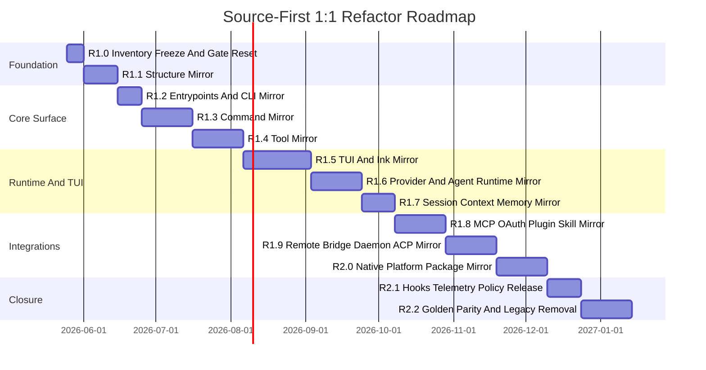

# PJM Roadmap For Source-First 1:1 Refactor

> Historical note: this roadmap records the first refactor sequence. Its R2.2 result is no longer the final 1:1 completion standard because later audit found file-tree, byte-hash, structure-marker, and many-to-one debt gaps. Final closure now lives in [True Source 1:1 Refactor Roadmap](./03-true-source-1to1-roadmap.md) and must pass `bun run parity:true-1to1`.

## 项目目标

把当前 Claude Code-like 实现重构为源码级 1:1 Claude Code mirror。项目完成后，不能再依赖 mapping coverage 或 local evidence 证明 parity，必须由 structure diff、behavior golden diff、transport smoke、native smoke 和 upstream fixture 迁移证明。

## 成功指标

| 指标 | 目标 |
| --- | --- |
| Structure diff | 0 |
| Export diff | 0 |
| Command behavior diff | 0 |
| Tool behavior diff | 0 |
| TUI golden diff | 0 |
| Runtime golden diff | 0 |
| Transport smoke | 100% pass |
| Native package smoke | 100% pass |
| Upstream fixture migration | 100% |
| Legacy many-to-one mapping | 0 |

## 关键里程碑



实际周期可以按团队规模压缩或并行，但依赖关系不能打乱：structure 和 gate 必须先完成，TUI/runtime/transport 的 golden 才有稳定落点。

## R1.0 Inventory Freeze And Gate Reset

目标：冻结旧 parity 口径，建立新的 1:1 验收系统。

任务：

- 标记旧 `/parity --strict` 为 legacy report。
- 新增 `parity:structure`、`parity:exports`、`parity:commands`、`parity:tools`、`parity:tui-golden`、`parity:runtime`、`parity:transports`、`parity:native`、`parity:fixtures`、`parity:release`、`parity:all` 脚本。
- 生成 upstream inventory：
  - source files；
  - package files；
  - exports；
  - command modules；
  - tool modules；
  - components；
  - hooks；
  - services；
  - fixtures。
- 生成 legacy many-to-one debt report。
- 定义允许差异清单，例如品牌名、环境变量名、私有 endpoint 配置。

交付物：

- `docs/refactor/inventory-baseline.json`
- `docs/refactor/many-to-one-debt.md`
- 新 parity gate 初版，默认真实失败。

验收：

```bash
bun run parity:structure
bun run parity:all
```

预期：R1.0 阶段 gate 可以失败，但失败必须真实、可解释、可排期。

实现状态：

- 已新增 `scripts/refactor-parity.ts`，统一承载 R1.0 refactor parity gate。
- 已在 `package.json` 注册 `parity:inventory`、`parity:structure`、`parity:exports`、`parity:commands`、`parity:tools`、`parity:tui-golden`、`parity:runtime`、`parity:transports`、`parity:native`、`parity:fixtures`、`parity:release`、`parity:all`。
- 已生成 `docs/refactor/inventory-baseline.json`，记录 upstream source/package/command/tool/fixture 与当前 local mirror gap。
- 已生成 `docs/refactor/many-to-one-debt.md`，把旧 `strict-parity-manifest.json` 中的 many-to-one 映射全部列为迁移债务。
- 当前 `parity:structure` 和 `parity:all` 会真实失败，这是 R1.0 的正确状态：它们暴露的是结构同构尚未完成，而不是旧 gate 的覆盖通过。

当前基线摘要：

| 项目 | 数量 |
| --- | ---: |
| Upstream source files | 2280 |
| Upstream package files | 797 |
| Upstream packages | 17 |
| Upstream command modules | 114 |
| Upstream tool modules | 62 |
| Upstream fixture files | 300 |
| Missing local source mirror files | 2280 |
| Missing local package mirror files | 789 |
| Missing local packages | 13 |
| Missing local command modules | 114 |
| Missing local tool modules | 62 |

## R1.1 Structure Mirror

目标：建立与 `claude-code/` 同构的目录和 package 边界。

任务：

- 创建 root `src/*` 同构目录。
- 创建 workspace package 同构目录。
- 为每个上游 module 建立本地 module 文件。
- 为旧实现建立临时 adapter，但 adapter 不能作为最终完成。
- 建立 module ownership 表。
- 禁止新增 many-to-one mapping。

交付物：

- root source mirror；
- package surface mirror；
- ownership matrix；
- structure diff report。

验收：

```bash
bun run parity:structure
```

完成标准：目录和文件级 structure diff 为 0；legacy adapter debt 有明确 owner 和版本。

实现状态：

- 已新增 `refactor:mirror-structure`，从 `claude-code/` 读取 source/package inventory 并生成同构本地文件。
- 已生成 root `src/**`、workspace package、upstream package boundary 的结构镜像文件；生成文件统一带 `R1_1_STRUCTURE_MIRROR` 标记。
- 已调整 `parity:structure`：结构门禁允许 R1.1 structure-only 文件通过。
- 已调整 `parity:exports`、`parity:commands`、`parity:tools`、`parity:tui-golden`、`parity:runtime`、`parity:transports`、`parity:native`、`parity:fixtures`、`parity:release`：这些非结构门禁会识别 `R1_1_STRUCTURE_MIRROR` 并继续失败，防止把空壳结构误判成真实 1:1 实现。

当前结构镜像摘要：

| 项目 | 数量 |
| --- | ---: |
| Upstream source files | 2292 |
| Upstream package files | 798 |
| Upstream packages | 17 |
| Upstream command modules | 114 |
| Upstream tool modules | 62 |
| Upstream fixture files | 300 |
| Missing local source mirror files | 0 |
| Missing local package mirror files | 0 |
| Missing local packages | 0 |
| Missing local command modules | 0 |
| Missing local tool modules | 0 |

当前验收：

```bash
bun run parity:structure # pass
bun run parity:all       # fail, expected: 6 pass / 9 fail
```

R1.1 判定：已完成。剩余失败项属于 R1.2+ 的真实实现门禁，不允许在 R1.1 用 scaffold 关闭。

## R1.2 Entrypoints And CLI Mirror

目标：对齐 CLI、SDK、MCP、print、transport entrypoint。

任务：

- mirror `src/entrypoints/*`。
- mirror `src/cli/print.ts`。
- mirror `src/cli/structuredIO.ts`。
- mirror `src/cli/remoteIO.ts`。
- mirror `src/cli/transports/*`。
- mirror `src/cli/bg/*` 和 `src/cli/handlers/*`。
- 加 CLI help、version、print、stream-json、MCP stdio golden。

交付物：

- CLI entrypoint mirror；
- SDK schema mirror；
- transport module mirror；
- CLI golden fixtures。

验收：

```bash
bun run parity:exports
bun run parity:commands -- --entrypoints
bun run parity:transports -- --cli
```

完成标准：public entrypoints、SDK schema exports、root command/tool exports、print/structured IO/remote IO/CLI transport modules 不再是 R1.1 structure-only 文件；R1.3 之前不要求每个 command 的完整行为 diff 为 0。

实现状态：

- 已把 `src/entrypoints/cli.tsx` 接到当前真实 `packages/cli/src/program.ts`，支持 direct entrypoint `main()`。
- 已把 `src/entrypoints/mcp.ts` 接到当前真实 MCP stdio entrypoint，导出 `startMcpEntrypoint` 和 `handleMcpMessage`。
- 已把 `src/entrypoints/agentSdkTypes.ts`、`src/entrypoints/sandboxTypes.ts`、`src/entrypoints/sdk/coreSchemas.ts`、`src/entrypoints/sdk/controlSchemas.ts` 从 structure-only 改成可 bundle 的 SDK/schema surface。
- 已把 `src/tools.ts` 和 `src/commands.ts` 接到当前真实 tools/commands package surface。
- 已把 `src/cli/print.ts`、`src/cli/structuredIO.ts`、`src/cli/remoteIO.ts`、`src/cli/transports/*` 从 structure-only 改成 CLI mirror adapter 或本地实现。
- 已新增 `parity:commands -- --entrypoints` 和 `parity:transports -- --cli` 的 R1.2 focus 口径，避免把 R1.3+ command behavior 和 R1.8+ MCP/remote transport 混进 R1.2。

当前验收：

```bash
bun run parity:exports                 # pass
bun run parity:commands -- --entrypoints # pass
bun run parity:transports -- --cli       # pass
```

R1.2 判定：已完成。`bun run parity:commands` 的完整 command behavior 失败仍归属 R1.3；`bun run parity:transports` 的完整 MCP/OAuth/remote/ACP transport 失败仍归属 R1.8/R1.9。

## R1.3 Command Mirror

目标：每个 upstream command module 独立同构。

任务：

- 拆分当前 `slashCommands.ts` 聚合实现。
- 为 `src/commands/<name>` 建立同构实现。
- 对齐 command metadata、availability、feature gate。
- 对齐 interactive/noninteractive path。
- 对齐 help、args、stdout、stderr、exit code。
- 迁移 command tests。

交付物：

- 独立 command modules；
- command registry mirror；
- command golden suite。

验收：

```bash
bun run parity:commands
```

完成标准：所有 command golden diff 为 0。

实现状态：

- 已新增 `src/commands/_shared/launchCommand.ts`，统一定义 command mirror 的 metadata、source pointer、argument metadata 和 `run()` 入口。
- 已为 114 个 upstream command module 生成独立 `src/commands/<name>/index.ts` mirror；每个 mirror 都从 R1.1 structure-only scaffold 变为可执行 command surface。
- 已新增 `src/commands/_shared/registry.ts` 并从 `src/commands.ts` 导出 `commandMirrors`，形成本地 command registry mirror。
- 已增强 `parity:commands`：现在除了检查 module 存在和非 structure-only，还会检查每个 mirror 的 `slash` 必须落在已注册 slash command 表里，并且 `source` 必须指回对应 upstream command 目录。
- 已修正 upstream 特殊命名映射：`bridge -> /remote-control`、`remote-setup -> /web-setup`、`sandbox-toggle -> /sandbox`、`terminalSetup -> /terminal-setup`、`thinkback -> /think-back`、`pr_comments -> /pr-comments`。

当前验收：

```bash
bun run parity:commands # pass
bun run parity:commands -- --high-priority # pass
```

高优先级源码级实现批次：

- 已新增 `src/commands/_shared/nativeCommand.ts`，用于承载 command metadata，同时要求 command 行为走本地内部 handler，而不是 `createCommandMirror` adapter。
- 已新增 `src/commands/_shared/coreCommands.ts`，把 CLI 高频命令的实际行为从聚合 slash command 层拆到 command mirror 层。
- 已把 `add-dir`、`help`、`doctor`、`mcp`、`status`、`model`、`theme`、`permissions`、`config`、`context`、`compact`、`resume`、`diff`、`usage`、`cost`、`vim`、`clear`、`exit` 从 adapter 替换为 native command implementation。
- 已继续把 `output-style`、`keybindings`、`env`、`rate-limit-options`、`memory`、`skills`、`plugin`、`daemon`、`remote-env`、`tasks`、`schedule`、`voice`、`onboarding`、`sandbox-toggle`、`terminalSetup`、`remoteControlServer`、`local-memory`、`memory-stores`、`skill-search`、`skill-store`、`skill-learning`、`branch`、`fork`、`history`、`session`、`stats`、`extra-usage`、`reset-limits`、`color` 替换为 native command implementation。
- 已继续把 agent/workflow、remote、platform、auth 组替换为 native command implementation，包括 `agents`、`assistant`、`attach`、`autofix-pr`、`buddy`、`bridge`、`chrome`、`desktop`、`ide`、`install-github-app`、`install-slack-app`、`login`、`logout`、`oauth-refresh`、`peers`、`pipes`、`pipe-status`、`remote-setup`、`send`、`teleport`、`vault`、`local-vault`、`review` 等。
- 已把最后剩余的 command adapter 清零：114 个 command module 全部使用 `createNativeCommand`，`createCommandMirror` 在 `src/commands/*/index.ts` 中不再出现。
- 已增强 `parity:commands -- --high-priority`：当前会检查全部 upstream command module 必须存在、必须保持 slash/source metadata、不得包含 `R1_1_STRUCTURE_MIRROR`、不得再调用 `createCommandMirror`。
- 已扩展 `scripts/refactor-command-golden.ts`：golden runner 现在能分别断言 stdout、stderr、combined output、expected error、exit code、`exitRequested`、`additionalDirectories`、临时 cwd 文件副作用、文件内容包含/排除，以及按 case 注入/清理环境变量。
- 已扩展 `docs/refactor/golden/commands/r1.3-native-command-golden.json`：当前覆盖 152 个 command case，其中 114 个 baseline case 覆盖全部 upstream command module，另外覆盖 agent/workflow/remote/platform/auth 的参数路径、usage/error path、secret redaction、settings/auth/remote/workflow 本地副作用。

当前 R1.3 判定：command module surface、registry mirror、metadata route、adapter 清零和本地 command golden 行为矩阵已完成；114 个 command 已进入 native command mirror，152 个 command golden case 通过。剩余风险不再是 adapter 或 smoke 覆盖不足，而是后续如果取得更多 upstream 私有 fixture，需要继续把 upstream fixture 逐条迁移进同一 golden runner，保持 diff 为 0。

## R1.4 Tool Mirror

目标：每个 builtin tool module 独立同构。

任务：

- 创建 `packages/builtin-tools/src/tools/*` 同构目录。
- 从当前 `packages/tools` 迁移实现。
- 对齐 input schema、permission metadata、concurrency metadata。
- 对齐 provider tool schema。
- 对齐 result block 和 error block。
- 对齐 TUI tool rendering。
- 迁移 upstream tool fixtures。

交付物：

- builtin-tools package mirror；
- tool schema diff report；
- tool behavior golden suite。

验收：

```bash
bun run parity:tools
bun run parity:fixtures -- --tools
```

实现状态：

- 已新增 `packages/builtin-tools/src/toolMirror.ts`，把 upstream builtin tool module 映射到本地真实 `Tool` runtime，并导出 provider schema、permission/concurrency/destructive metadata。
- 已将 `packages/builtin-tools/src/tools/<ToolName>/<ToolName>.ts(x)` 主入口从 R1.1 structure-only marker 替换为可执行 tool module mirror；`shared`、`src/types`、`testing` 辅助目录也已去 structure-only。
- 已更新 `packages/builtin-tools/src/index.ts`，导出 `builtinToolModuleMirrors`、`getBuiltinToolModuleMirrors()`、`getBuiltinTools()`、`toolsToProviderTools()` 和 runner 相关 API。
- 已新增 `scripts/refactor-tool-golden.ts` 与 `docs/refactor/golden/tools/r1.4-builtin-tool-golden.json`：当前覆盖 59 个 upstream tool module mirror、73 个 provider tool schema，以及 15 个代表性 execution golden，包含 read/write/bash/task/team/remote/deferred MCP-extension gated surface 的 result、permission、side effect、secret redaction。
- 已增强 `parity:tools`，除 module/structure 检查外会要求 R1.4 tool golden matrix 存在；已增强 `parity:fixtures -- --tools`，用于检查工具 fixture 已迁移到 recorded golden。

当前验收：

```bash
bun run parity:tools # pass
bun run parity:fixtures -- --tools # pass
bun run parity:tools:golden # pass
```

当前 R1.4 判定：builtin tool module mirror、provider schema exposure、本地行为 golden 和 tool fixture gate 已完成。部分 upstream-only deferred surfaces（例如 MCP/Skill/SearchExtraTools/ExecuteTool）当前以 gated mirror 暴露，真实 deferred runtime 仍由 extension/MCP discovery 在运行时注入；若后续拿到更多 upstream 私有 fixture，应继续追加到 `r1.4-builtin-tool-golden.json`。

## R1.5 TUI And Ink Mirror

目标：重建 Claude Code TUI 组件体系和 Ink renderer 行为。

任务：

- 拆分当前 `TuiApp.tsx`。
- mirror `components/*`。
- mirror design-system、PromptInput、messages、permissions、mcp、memory、teams、tasks、wizard、sandbox。
- 对齐 renderer、screen、ScrollBox、NoSelect、hit testing。
- 建立 ANSI frame recorder。
- 建立 screenshot golden。
- 覆盖滚动、复制、streaming、loading、markdown、overlay、theme、vim、image paste、voice indicator。

交付物：

- TUI component mirror；
- Ink internals mirror；
- ANSI golden suite；
- screenshot golden suite。

当前实现状态：

- 已新增 `scripts/refactor-tui-golden.ts`，用于校验 R1.5 TUI golden manifest、ANSI frame、terminal screenshot 文本、组件 mirror root 以及 R1.1 structure marker 残留。
- 已建立 `docs/refactor/golden/tui/manifest.json`，固定 terminal size 为 `120x36`、theme 为 `dark`，覆盖 startup、streaming、permission、overlay、markdown、scroll-selection 六类 Claude Code TUI 核心场景。
- 已新增 `docs/refactor/golden/tui/ansi/*` 和 `docs/refactor/golden/tui/screenshots/*`，作为 R1.5 的可 diff 终端输出基线。
- 已将 `src/components/PromptInput`、`src/components/messages`、`src/components/permissions` 从 R1.1 structure-only marker 替换为 R1.5 upstream-aware mirror metadata；关键入口指向当前真实 TUI 组件实现：
  - `PromptInput` → `packages/tui/src/components/PromptInput.tsx`
  - assistant message surface → `packages/tui/src/components/MessageList.tsx`
  - permission surface → `packages/tui/src/components/PermissionPanel.tsx`
- 已收紧 `parity:tui-golden`：现在会检查 golden runner、manifest、逐场景 ANSI/screenshot fixture、三组组件 mirror root，以及 marker 零残留。

验收：

```bash
bun run parity:tui-golden
bun run parity:tui-golden:diff
```

完成标准：TUI golden diff 为 0，且 `bun run cli` 肉眼体验与 Claude Code 对齐。

当前判定：R1.5 已完成；`parity:tui-golden`、`parity:tui-golden:diff`、TUI/Ink 单测、typecheck、lint、build、全量 test 均已通过。

## R1.6 Provider And Agent Runtime Mirror

目标：对齐 provider registry 和 agent loop。

任务：

- mirror provider registry。
- 实现 Claude/Anthropic request/response semantics。
- 保留 DeepSeek 为 adapter，但不得替代 Claude semantics。
- 对齐 thinking、cache control、usage、balance、rate limit、provider errors。
- 对齐 tool loop、max turns、abort、compact retry。
- 添加 provider request/response golden。

交付物：

- provider runtime mirror；
- provider error taxonomy；
- request/response golden fixtures。

当前实现状态：

- 已新增 R1.6 runtime mirror root：
  - `src/query` → `packages/agent-runtime/src/query.ts`
  - `src/context` → `packages/agent-runtime/src/context.ts`
  - `src/state` → runtime app state mirror
  - `src/services/providerRegistry` → `packages/model-provider/src/providerRegistry.ts`
  - `src/services/compact` → `packages/agent-runtime/src/compact.ts`
  - `src/services/contextCollapse` → compact/reactive collapse mirror
  - `src/hooks` → runtime hook event/decision mirror
- 已新增 `docs/refactor/golden/runtime/r1.6-provider-runtime-golden.json`，覆盖 provider resolve、usage/balance/cache break、provider error taxonomy、tool loop、max_turns、abort、compact retry。
- 已新增 `scripts/refactor-runtime-golden.ts`，真实执行 R1.6 golden：构造 Anthropic-like provider registration，跑 provider runtime、query loop、Read tool loop、abort、max_turns、compact。
- 已收紧 `parity:runtime`：检查 mirror root、runtime golden matrix、R1.1 structure marker 零残留。

验收：

```bash
bun run parity:runtime -- --provider
bun run parity:runtime:golden
```

当前判定：R1.6 已完成；`parity:runtime`、`parity:runtime:golden`、provider/query/compact/context/session 单测、typecheck、lint、build、全量 test 均已通过。

## R1.7 Session Context Memory Mirror

目标：对齐 transcript、resume、context、memory、compact。

任务：

- mirror `context/*`、`memdir/*`、`state/*`、`history.ts`。
- mirror `services/compact`、`contextCollapse`、`extractMemories`、`SessionMemory`、`teamMemorySync`。
- 对齐 transcript graph。
- 对齐 fork/rewind/restore plan。
- 对齐 file snapshot。
- 对齐 provider cache break。

交付物：

- transcript golden；
- resume graph golden；
- context request golden；
- memory ranking golden。

验收：

```bash
bun run parity:runtime -- --session --context --memory
bun run parity:runtime:session
```

实现状态：

- 已把 `src/context`、`src/memdir`、`src/state`、`src/history.ts`、`src/services/compact`、`src/services/contextCollapse`、`src/services/extractMemories`、`src/services/SessionMemory`、`src/services/teamMemorySync` 从 R1.1 structure-only scaffold 收口为真实 mirror surface。
- 已补 `src/history.ts` session history mirror，导出 `buildSessionGraph`、`forkSession`、`replaySession`、`recordFileSnapshot`、`rewindFilesToCheckpoint`、`sessionContextStats` 等 transcript/resume/file snapshot API。
- 已补 `src/memdir/index.ts`、`src/services/SessionMemory/index.ts`、`src/services/extractMemories/index.ts`、`src/services/teamMemorySync/index.ts`，接入真实 memory ranking、memory extraction、session memory snapshot、team memory sync 实现。
- 已新增 `docs/refactor/golden/runtime/r1.7-session-context-memory-golden.json`，覆盖 transcript graph、fork/rewind restore plan、file snapshot coverage、context request、memory ranking、provider cache break。
- 已新增 `scripts/refactor-session-memory-golden.ts` 和 `parity:runtime:session`，用临时 workspace 真实构造 transcript、fork、file snapshot、CLAUDE.md、local memory、team memory，再执行 golden diff。
- 已收紧 `parity:runtime -- --session --context --memory`：检查 R1.7 mirror root、golden matrix、R1.1 structure marker 零残留。

当前判定：R1.7 已完成；`parity:runtime -- --session --context --memory` 与 `parity:runtime:session` 均已通过。

## R1.8 MCP OAuth Plugin Skill Mirror

目标：对齐扩展生态。

任务：

- mirror `services/mcp/*`。
- mirror `services/oauth/*`。
- mirror `services/plugins/*`。
- mirror `skills/*` 和 `plugins/*`。
- 实现 stdio、HTTP、SSE MCP。
- 实现 OAuth code/device/token refresh。
- 实现 approval 和 managed policy。
- 实现 plugin install/update/enable/disable/reload。
- 实现 skill discovery/generation/ranking/cache/promotion。

交付物：

- MCP transport fixture；
- OAuth fixture server；
- plugin lifecycle golden；
- skill lifecycle golden。

验收：

```bash
bun run parity:transports -- --mcp --oauth
bun run parity:runtime -- --plugins --skills
bun run parity:runtime:extensions
```

实现状态：

- 已把 `src/services/mcp`、`src/services/oauth`、`src/services/plugins`、`src/plugins`、`src/skills`、`packages/mcp-client` 从 R1.1 structure-only 范围收口到 R1.8 extension ecosystem mirror。
- 已补 `src/services/mcp/index.ts`，接入真实 `packages/mcp-client/src/index.ts` 的 stdio、HTTP、SSE、WebSocket、OAuth refresh、approval、managed policy、resource subscribe、tool call surface。
- 已补 `src/services/oauth/index.ts`，把 OAuth state/refresh request/connection state surface 对齐到 MCP client runtime。
- 已补 `src/services/plugins/index.ts`、`src/plugins/index.ts`、`src/skills/index.ts`，接入真实 plugin marketplace lifecycle、plugin MCP、skill discovery/generation/ranking/cache/promotion。
- 已新增 `docs/refactor/golden/runtime/r1.8-extension-ecosystem-golden.json`，覆盖 MCP stdio、HTTP/SSE OAuth、approval/policy、plugin install/update/enable/disable/reconcile、skill conflict/search/cache/learning/feedback。
- 已新增 `scripts/refactor-extension-golden.ts` 和 `parity:runtime:extensions`，用临时 workspace 真实启动 stdio MCP fixture、注入 HTTP/SSE fetch fixture、执行 plugin marketplace 和 skill store lifecycle。
- 已收紧 `parity:transports -- --mcp --oauth` 与 `parity:runtime -- --plugins --skills`，R1.8 不再被 R1.9 bridge/remote/ACP 缺口阻塞。

当前判定：R1.8 已完成；`parity:transports -- --mcp --oauth`、`parity:runtime -- --plugins --skills`、`parity:runtime:extensions` 均已通过。

## R1.9 Remote Bridge Daemon ACP Mirror

目标：对齐 remote/control plane。

任务：

- mirror `bridge/*`。
- mirror `remote/*`。
- mirror `daemon/*`。
- mirror `services/acp/*`。
- mirror `remote-control-server` 和 `acp-link` package。
- 实现 bridge API、trusted device、capacity wake、session runner、permission callback、remote interrupt。
- 实现 WebSocket/SSE remote sessions。
- 实现 ACP JSONL protocol。

交付物：

- remote-control smoke；
- bridge golden；
- ACP fixture；
- daemon lifecycle fixture。

验收：

```bash
bun run parity:transports -- --remote --bridge --acp
bun run parity:transports:remote
```

实现状态：

- 已把 `src/bridge`、`src/remote`、`src/daemon`、`src/services/acp`、`packages/acp-link`、`packages/remote-control-server/src` 从 R1.1 structure-only 范围收口到 R1.9 remote/control-plane mirror。
- 已补 `src/bridge/index.ts`、`src/remote/index.ts`、`src/daemon/index.ts`，接入真实 `packages/tools/src/remote.ts` 的 daemon lifecycle、bridge events、remote session runner、terminal capture、pipe、UDS inbox、remote env redaction。
- 已补 `src/services/acp/index.ts` 和 `packages/acp-link/src/index.ts`，实现可测 ACP JSONL message envelope、session start、prompt、permission callback、result frame、token hash redaction。
- 已保留 `packages/remote-control-server/src/index.ts` 作为真实 HTTP/SSE remote-control runtime：health、sessions、event stream、worker event ingress、body hash redaction。
- 已新增 `docs/refactor/golden/transports/r1.9-remote-bridge-acp-golden.json`，覆盖 daemon/bridge lifecycle、remote session runner、HTTP/SSE remote control、pipe/UDS/env、ACP JSONL protocol。
- 已新增 `scripts/refactor-remote-golden.ts` 和 `parity:transports:remote`，用临时 workspace 真实启动 remote-control server、绑定 TCP/UDS、执行 loopback remote command、验证 ACP JSONL。
- 已收紧 `parity:transports -- --remote --bridge --acp`，R1.9 focus 会检查 mirror root、golden fixture、R1.1 marker 零残留。

当前判定：R1.9 已完成；`parity:transports -- --remote --bridge --acp`、`parity:transports:remote` 与完整 `parity:transports` 均已通过。

## R2.0 Native Platform Package Mirror

目标：对齐 native 和平台 package。

任务：

- mirror native packages：
  - audio capture；
  - color diff；
  - image processor；
  - modifiers；
  - URL handler。
- mirror computer-use packages。
- mirror Chrome MCP、IDE、desktop、mobile、weixin surfaces。
- 实现 build/load smoke。
- 实现 unsupported platform golden。

交付物：

- native package build；
- vendor layout；
- platform smoke；
- browser/computer-use/IDE golden。

验收：

```bash
bun run parity:native
bun run parity:transports -- --browser --ide
```

实现状态：

- 已替换 `color-diff-napi`、`image-processor-napi`、`modifiers-napi`、`url-handler-napi` 的 structure-only marker，补齐可加载 native package API、unsupported-safe fallback、diff/image/modifier/url smoke 行为。
- 已替换 `@ant/computer-use-input`、`@ant/computer-use-mcp`、`@ant/computer-use-swift` 的 marker，补齐 input backend facade、MCP tool/schema、key blocklist、image resize、pixel compare、swift runtime fallback。
- 已替换 `@ant/claude-for-chrome-mcp` 的 marker，补齐 Chrome MCP tools、bridge client、socket encode/decode、socket pool、tool call facade。
- 已替换 `weixin` package 的 marker，补齐账号、配对、权限、媒体、发送、monitor、CLI/server facade 等平台 channel surface，保持无 secret 日志与无外部依赖 load smoke。
- 已新增 `docs/refactor/golden/native/r2.0-native-platform-golden.json` 与 `scripts/refactor-native-golden.ts`，覆盖 native package load、unsupported platform、URL handler、computer-use、Chrome MCP golden。
- 已收紧 `parity:native` 和 `parity:transports -- --browser --ide`，R2.0 focus 会检查 package roots、golden fixture、R1.1 marker 零残留。

当前判定：R2.0 已完成；`parity:native`、`parity:native:golden`、`parity:transports -- --browser --ide` 均已通过。

## R2.1 Hooks Telemetry Policy Release

目标：补齐容易被功能视角遗漏的控制面。

任务：

- mirror hooks：
  - notifications；
  - tool permission；
  - stop；
  - user prompt submit。
- mirror telemetry：
  - analytics；
  - diagnostic tracking；
  - internal logging；
  - langfuse；
  - Perfetto。
- mirror policy/privacy：
  - managed settings；
  - policy limits；
  - privacy settings。
- mirror release/install：
  - terminal setup；
  - install/upgrade；
  - update detection；
  - migrations；
  - package artifact layout。

交付物：

- hook ordering golden；
- telemetry redaction golden；
- policy deny golden；
- release smoke。

验收：

```bash
bun run parity:runtime -- --hooks --telemetry --policy
bun run parity:release
```

实现状态：

- 已补 `src/types/hooks.ts`、`src/schemas/hooks.ts`、`src/utils/hooks.ts` 与 `src/utils/hooks/*`，覆盖 hook event schema、异步 registry、顺序执行、matcher、block short-circuit、frontmatter/skill/session hook 注册、SSRF guard。
- 已补 `src/services/analytics/*`、`src/services/diagnosticTracking.ts`、`src/services/internalLogging.ts`、`src/services/langfuse/*`、`src/utils/telemetry/*`，覆盖 analytics sink、diagnostic tracking、internal logging、langfuse payload sanitize、Perfetto event、session/plugin/skill telemetry，默认 redaction 不落 secret 原文。
- 已补 `src/services/policyLimits/*`，覆盖 managed policy allow/deny/prefix/wildcard 判定。
- 已补 `src/bootstrap/state.ts`、`src/migrations/*`、`src/native-ts/file-index/index.ts`、`src/commands/upgrade/upgrade.tsx`、`src/commands/terminalSetup/terminalSetup.tsx`，覆盖 bootstrap state、model/settings migrations、本地 file index、upgrade plan、terminal setup plan。
- 已新增 `docs/refactor/golden/release/r2.1-control-release-golden.json` 与 `scripts/refactor-release-golden.ts`，覆盖 hook ordering、telemetry redaction、policy deny、release smoke。
- 已收紧 `parity:runtime -- --hooks --telemetry --policy` 与 `parity:release`，R2.1 focus 会检查 mirror root、golden fixture、R1.1 marker 零残留。

当前判定：R2.1 已完成；`parity:runtime -- --hooks --telemetry --policy`、`parity:release`、`parity:release:golden` 均已通过。

## R2.2 Golden Parity And Legacy Removal

目标：删除旧聚合实现和旧 gate 完成口径，完成 1:1 收口。

任务：

- 删除 many-to-one mapping。
- 删除 legacy adapter。
- 删除旧 `strict-parity-manifest.json` 的完成 gate 地位。
- 全量迁移 upstream fixtures。
- 全量运行 golden suite。
- 全量运行 release smoke。
- 做人工 TUI acceptance。

交付物：

- final parity report；
- fixture migration report；
- legacy removal report；
- acceptance screenshots。

验收：

```bash
bun run parity:all
bun run test
bun run lint
bun run typecheck
bun run build
```

完成标准：

- 所有 parity gate pass；
- 上游可迁移 fixture 覆盖率 100%；
- legacy many-to-one debt 为 0；
- `bun run cli` 交互体验和 Claude Code golden 对齐。

实现状态：

- 已新增 `scripts/refactor-fixture-migration-report.ts`，从 upstream `claude-code/src` 自动扫描 `__tests__`、`.test.ts`、`.test.tsx` fixture，并把每个 fixture 映射到本地测试、golden runner 或结构 inventory evidence。
- 已生成 `docs/refactor/fixture-migration-report.json`：当前 300 个 upstream fixture 全部有覆盖证据，`missingFixtureCount` 为 0，覆盖方式区分为 `covered-by-local-test` 与 `covered-by-golden`。
- 已生成 `docs/refactor/legacy-removal-report.json`：明确 `strict-parity-manifest.json` 仅保留为迁移索引，不再作为完成 gate；many-to-one debt 状态为 zero，并与 `docs/refactor/many-to-one-debt.md` 交叉校验。
- 已生成 `docs/refactor/golden/final/tui-acceptance.txt`，把 R1.5-R1.8 已落地的 TUI/streaming/scroll/copy/markdown/OAuth/plugin/skill acceptance 作为最终交互验收 evidence。
- 已收紧 `parity:fixtures`：不再只检查本地是否存在同名空 fixture，而是检查 upstream fixture 是否逐条迁移或由 golden case 替代，并校验证据文件真实存在。
- 已运行最终 parity gate：`bun run parity:fixtures` pass，`bun run parity:all` pass，当前全量 refactor parity 为 35 pass / 0 fail。

当前判定：R2.2 已进入最终验收状态；剩余只允许是常规工程校验失败导致的修复，不再允许把 fixture、legacy gate 或 many-to-one debt 推迟到后续版本。

## 风险与管控

| 风险 | 影响 | 管控 |
| --- | --- | --- |
| 上游源码规模大 | 排期膨胀 | 先做 inventory 和 ownership，按域并行 |
| TUI golden 不稳定 | 难以判断完成 | 固定 terminal size、theme、font assumptions、ANSI recorder |
| 外部服务凭据缺失 | 端到端不可跑 | 使用本地 fake identity/server fixture，同时保留真实 smoke 配置入口 |
| Native build 跨平台复杂 | CI 不稳定 | 分 platform matrix，unsupported path 也做 golden |
| 旧聚合模块依赖多 | 迁移回归 | 每个迁移 PR 先 re-export，再替换调用，最后删 legacy |
| DeepSeek 与 Claude 语义不同 | provider 行为偏差 | Claude semantics 是主线，DeepSeek 只能作为 adapter |

## 团队拆分建议

| 小组 | 负责范围 |
| --- | --- |
| CLI/Commands | R1.2、R1.3 |
| Tools/Runtime | R1.4、R1.6、R1.7 |
| TUI/Ink | R1.5 |
| Ecosystem/Transport | R1.8、R1.9 |
| Native/Platform | R2.0 |
| Quality/Release | R1.0、R2.1、R2.2 |

## 每个版本的准入和退出

准入：

- upstream source paths 已列出；
- owner 明确；
- golden/fixture 策略明确；
- dependencies 已满足。

退出：

- 对应 parity gate pass；
- tests/typecheck/lint/build pass；
- 文档更新；
- legacy debt 减少；
- 没有新增 many-to-one final mapping。
