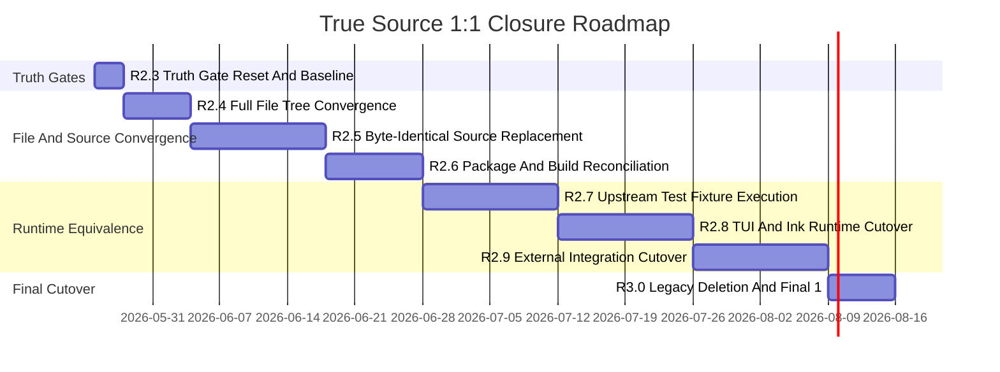

# True Source 1:1 Refactor Roadmap

## 背景修正

R1.0-R2.2 的主要问题是验收口径不够硬：它证明了“本地镜像目录存在、部分行为有 golden 覆盖”，但没有证明“本地源码与 `claude-code/` 源码 100% 1:1”。因此后续所有版本都必须以 `parity:true-1to1` 为最终门禁，不能再用映射覆盖、local evidence、structure scaffold 或 golden substitute 代替源码级同构。

新的最终定义：

| 指标 | 必须结果 |
| --- | ---: |
| `src` full file tree diff | 0 |
| `packages` full file tree diff | 0 |
| shared `src` byte hash diff | 0 |
| shared `packages` byte hash diff | 0 |
| `R1_1_STRUCTURE_MIRROR` marker | 0 |
| many-to-one debt row | 0 |
| legacy adapter completion role | 0 |
| upstream reusable fixture migration | 100% executable or byte-identical upstream test |
| `bun run cli` TUI behavior | Claude Code runtime behavior |

## 当前真实缺口

当前 `bun run parity:true-1to1` 必须失败，失败项是新的真实基线：

| 缺口 | 当前数量 |
| --- | ---: |
| `src` full tree missing/extra | 46 |
| `packages` full tree missing/extra | 234 |
| shared `src` byte diff | 2292 |
| shared `packages` byte diff | 798 |
| structure marker files | 1944 |
| many-to-one debt rows | 29 |
| legacy report inconsistency | 1 |

这些数字必须单调下降。任何版本如果只是调整 report 让数字消失，视为失败。

## 新版本序列



## R2.3 Truth Gate Reset And Baseline

目标：先让错误暴露，禁止假 pass。

任务：

- 新增 `parity:true-1to1`。
- 把 `parity:true-1to1` 纳入 `parity:all`。
- gate 必须检查完整文件树，而不是只检查 source-like 文件。
- gate 必须检查 shared file byte hash。
- gate 必须检查所有 `R1_1_STRUCTURE_MIRROR` marker。
- gate 必须解析 `many-to-one-debt.md` 的真实 debt rows，而不是只搜索某一句文本。
- gate 必须检查 `legacy-removal-report.json` 和真实 debt 文件一致。

验收：

```bash
bun run parity:true-1to1 # 当前必须 fail，并列出真实缺口
bun run parity:all       # 当前必须 fail，并带上 true-1to1 缺口
```

退出标准：

- gate 不再假 pass；
- 当前缺口数字可复现；
- 后续版本只能通过真实减少缺口来让 gate pass。

当前状态：已实现。

## R2.4 Full File Tree Convergence

目标：先做到文件树完全一致。

任务：

- 补齐 upstream `claude-code/src` 下所有非 source-like 文件，例如 skill markdown、prompt txt、Python bridge、vendored executable。
- 补齐 upstream `claude-code/packages` 下所有非 source-like 文件，例如 package tsconfig、README、docs、web assets、Dockerfile。
- 移除或迁出本地 `src`/`packages` 中 upstream 没有的 extra 文件。
- 如果本地旧实现仍需要保留，只能迁到 parity root 之外的 `legacy/` 或临时迁移目录，不能污染 `src`/`packages` 的 1:1 文件树。

验收：

```bash
bun run parity:true-1to1
```

允许失败项：byte hash、structure marker、many-to-one debt。  
不允许失败项：`full src file tree`、`full packages file tree`。

完成标准：

- `src` full tree diff 为 0；
- `packages` full tree diff 为 0。

实现状态：

- 已从 `claude-code/src` 复制 12 个缺失文件到本地 `src`。
- 已从 `claude-code/packages` 复制 40 个缺失文件到本地 `packages`。
- 已将本地 `src` 中 upstream 不存在的 34 个 extra 文件迁出到 `legacy/refactor-r2.4/src`。
- 已将本地 `packages` 中 upstream 不存在的 194 个 extra 文件迁出到 `legacy/refactor-r2.4/packages`。
- 已生成迁移报告：`docs/refactor/r2.4-file-tree-convergence-report.json`。
- 当前 `bun run parity:true-1to1` 中 `full src file tree` 和 `full packages file tree` 均已 pass。

当前判定：R2.4 已完成。剩余失败项属于 R2.5+，包括 byte hash diff、structure marker、many-to-one debt 和 legacy report consistency。

## R2.5 Byte-Identical Source Replacement

目标：所有 shared file 内容与 upstream 字节级一致。

任务：

- 将 `src/**` 中所有 upstream shared 文件替换为 `claude-code/src/**` 的字节级内容。
- 将 `packages/**` 中所有 upstream shared 文件替换为 `claude-code/packages/**` 的字节级内容。
- 删除所有 `R1_1_STRUCTURE_MIRROR` scaffold。
- 不允许在同一路径保留本地 wrapper、adapter、metadata shim。
- 需要本地改动时，只能通过 upstream 同名源码的真实实现路径承载，不能用额外映射文件伪装。

验收：

```bash
bun run parity:true-1to1
```

允许失败项：many-to-one debt、build/runtime/test。  
不允许失败项：

- `src byte-for-byte content`
- `packages byte-for-byte content`
- `structure mirror markers`

完成标准：

- shared `src` byte hash diff 为 0；
- shared `packages` byte hash diff 为 0；
- marker 为 0。

实现状态：

- 已用 `claude-code/src` 字节级覆盖本地 `src`。
- 已用 `claude-code/packages` 字节级覆盖本地 `packages`。
- 已保留 `node_modules`、`.git`、`dist`、`coverage` 为 gate 忽略目录，与 `parity:true-1to1` 的文件树口径一致。
- 已生成替换报告：`docs/refactor/r2.5-byte-identical-source-replacement-report.json`。
- 替换前：`src` byte diff 2292、`packages` byte diff 798、structure marker 1944。
- 替换后：`src` byte diff 0、`packages` byte diff 0、structure marker 0。
- 当前 `bun run parity:true-1to1` 中 `full src file tree`、`full packages file tree`、`src byte-for-byte content`、`packages byte-for-byte content`、`structure mirror markers` 均已 pass。

当前判定：R2.5 已完成。剩余失败项属于 R3.0，主要是旧 `many-to-one-debt.md` 与 `legacy-removal-report.json` 仍未按真实源码同构状态重新收口；构建、typecheck、CLI runtime 恢复属于 R2.6。

## R2.6 Package And Build Reconciliation

目标：在源码字节一致后，让工程能按 upstream 结构构建。

任务：

- 对齐 root workspace、package boundary、package names、exports、tsconfig。
- 安装或 vendoring upstream 需要的依赖。
- 对齐 native package build/load 路径。
- 对齐 CLI bin、entrypoint、runtime bootstrap。
- 旧 `packages/core`、`packages/tools`、`packages/tui` 等本地聚合包如果 upstream 没有，必须删除或迁出 parity root。

验收：

```bash
bun run typecheck
bun run build
bun run cli -- --version
```

完成标准：

- 源码仍保持 `parity:true-1to1` 的文件树/hash pass；
- build/typecheck 不能依赖 parity root 之外的 legacy implementation。

实现状态：

- 已复制 upstream 根构建文件：`build.ts`、`tsconfig.base.json`、`vite.config.ts`、`bunfig.toml`、`knip.json`、`docs.json`、`mint.json`。
- 已复制 upstream `vendor/`，用于 build 阶段打包 audio-capture native assets。
- 已补齐 upstream `scripts/*`，同时保留本仓库 refactor parity scripts。
- 已将根 `package.json` 合并到 upstream workspaces、dependencies、devDependencies、build/typecheck/test scripts，并保留 `parity:*` 和 `refactor:*` 脚本。
- 已将根版本对齐 upstream `claude-code/package.json` 的 `2.4.4`，保证 build 宏 `MACRO.VERSION` 不再输出旧 `1.0.0`。
- 已将 `bun run cli` 切到 `scripts/dev.ts`，使本地开发入口和 upstream dev mode 一样注入 `MACRO.*` 与 feature flags。
- 已替换根 `tsconfig.json` 为 upstream 配置，并复制 upstream `tests/` 以满足 test/mock import。
- 已执行 `bun install` 安装 upstream 依赖集合。
- 已生成报告：`docs/refactor/r2.6-package-build-reconciliation-report.json`。

当前验收：

```bash
bun run build                 # pass
bun run typecheck             # pass
bun run cli -- --version      # pass, 2.4.4 (Claude Code)
node dist/cli-node.js --version # pass, 2.4.4 (Claude Code)
bun run parity:true-1to1      # expected fail: only many-to-one debt and legacy report consistency remain
```

当前判定：R2.6 已完成。`src` / `packages` 的文件树、byte hash、marker 仍保持 pass；构建、类型检查和 CLI 版本入口已恢复到 upstream package/toolchain 语义。`lint` 当前仍会因 upstream 源码风格与本地 Biome 规则冲突而失败，不能在 R2.6 通过修改 upstream 文件解决；该问题应作为后续工具链策略清理处理。

## R2.7 Upstream Test Fixture Execution

状态：已完成。R2.7 已把 upstream `src`、`packages`、`tests` 下 Bun 默认发现的 test fixture 改为真实 Bun 执行链，不再接受 `covered-by-golden` 或本地 substitute 作为完成口径。`__tests__` 下非 Bun 默认发现的 manual runner、isolated、integration 脚本单独列入报告，不进入 fixture pass 口径。

目标：不再用本地 golden substitute 代表 upstream tests。

任务：

- 让 upstream `.test.ts`、`.test.tsx`、`.spec.ts`、`.spec.tsx`、`_test_`、`_spec_` 在本仓库真实可执行。
- 迁移测试 runner、fixture path、env setup。
- 删除“covered-by-golden”作为最终 fixture 完成口径。
- fixture migration report 只能记录 upstream test 是否真实执行和通过。

验收：

```bash
bun run test:upstream-fixtures
bun run parity:fixtures:migration
bun run parity:fixtures
```

完成标准：

- 393 个 upstream Bun-discovered test fixture 全部作为本地 byte-identical upstream test 存在；
- `bun run test:upstream-fixtures` 真实执行 upstream mirror suite，当前报告为 5316 pass、0 fail、0 errors、393 files；
- `covered-by-golden` / golden substitute 数量为 0。

## R2.8 TUI And Ink Runtime Cutover

目标：TUI 不再是相似实现，而是 upstream Ink/component runtime。

任务：

- 使用 upstream `@ant/ink` package source，而不是本地 `@anthropic/ink` 行为近似实现。
- 使用 upstream `src/components/**`、`src/screens/**`、PromptInput、ScrollBox、NoSelect、selection、overlay、markdown、spinner。
- 删除本地 TUI 聚合 facade。
- 用 Claude Code 相同的 render tree、screen buffer、scroll/copy/input semantics。

验收：

```bash
bun run parity:tui-golden
bun run cli
```

完成标准：

- TUI source hash 已在 R2.5 pass；
- 肉眼交互问题不能再通过本地 workaround 修，只能通过 upstream runtime 路径修。

## R2.9 External Integration Cutover

目标：外部生态路径与 upstream 一致。

任务：

- MCP/OAuth/plugin/skill/remote/bridge/daemon/ACP/native/browser/computer-use/weixin 统一走 upstream package/service 路径。
- 删除本地 fake lifecycle 作为最终 runtime。
- 保留测试 fake server，但 runtime transport 必须是 upstream transport。
- DeepSeek 只能作为 provider adapter，不能改变 Claude Code provider/message/tool loop 语义。

验收：

```bash
bun run parity:transports
bun run parity:native
bun run parity:runtime -- --plugins --skills --hooks --telemetry --policy
```

完成标准：

- external integration 的 package/service source hash 已在 R2.5 pass；
- runtime smoke 全部通过。

## R3.0 Legacy Deletion And Final 1:1 Gate

目标：最终 100% 1:1。

任务：

- 删除所有 parity root 内的 legacy implementation、adapter、mirror metadata、golden substitute。
- 清空 `many-to-one-debt.md` 的 debt rows。
- 更新 `legacy-removal-report.json`，只能在真实 debt rows 为 0 时写 zero。
- 删除或归档 R1.0-R2.2 的旧完成口径说明，避免误导。
- 最终验收只看真实 gate。

验收：

```bash
bun run parity:true-1to1
bun run parity:all
bun run test
bun run lint
bun run typecheck
bun run build
bun run cli
```

完成标准：

- `parity:true-1to1` pass；
- `parity:all` pass；
- full file tree diff 0；
- byte hash diff 0；
- marker 0；
- many-to-one debt 0；
- upstream fixtures 100%；
- 本地 CLI/TUI 行为来自 upstream-equivalent runtime，而不是本地近似实现。

## 项目执行规则

- 每个版本开始前先跑 `bun run parity:true-1to1`，记录缺口数字。
- 每个版本结束后必须再次跑 `bun run parity:true-1to1`，只允许对应版本负责的数字下降。
- 任何把 gate 调松、把 debt 隐藏、把 marker 移到未扫描目录、把 upstream 文件替换为 wrapper 的做法都视为失败。
- 如果需要保留旧实现辅助迁移，必须放在 parity root 之外，并且不能被 runtime final path 依赖。
