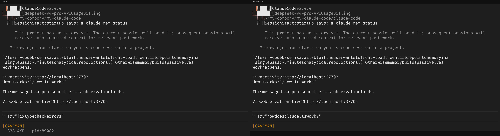
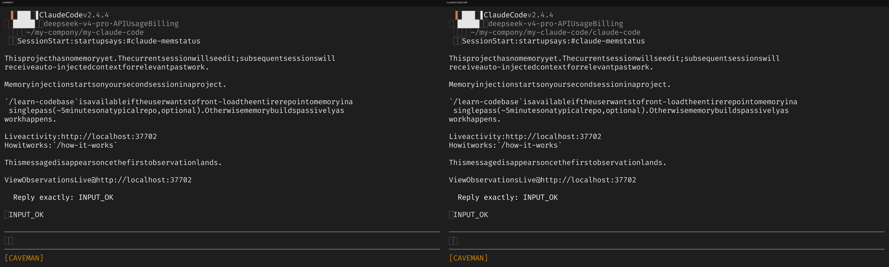
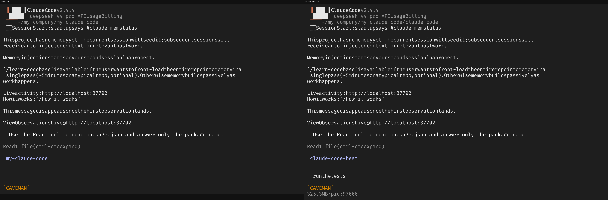
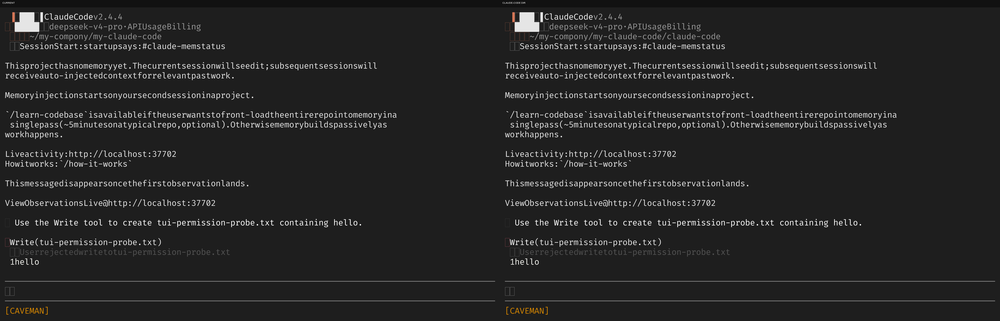
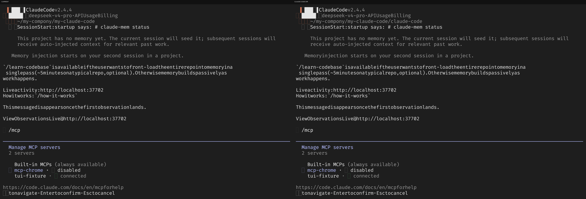
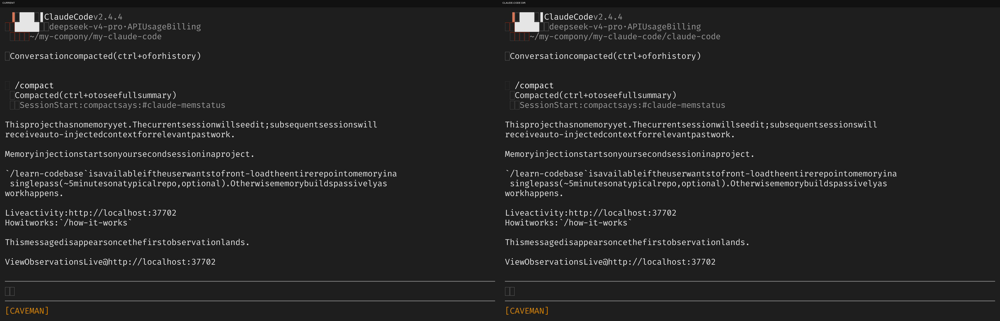

# TUI Chain Comparison Report

Generated: 2026-05-26T03:08:25.934Z

Terminal: 100x32

## 18.1-startup-interactive

18.1 startup: cli.tsx -> main.tsx -> REPL first render

- current: captured, exit=0, 17079ms
- claude-code dir: captured, exit=0, 17583ms
- normalized screen equal: false
- current-only sample:  ▘▘▝▝~/my-compony/my-claude-code | ❯ Try"fixtypecheckerrors" |   338.4MB · pid:89082
- upstream-only sample:  ▘▘▝▝~/my-compony/my-claude-code/claude-code | ❯ Try"howdoesclaude.tswork?"

## 18.1-print-headless

18.1 print/headless branch

- current: captured, exit=0, 7737ms
- claude-code dir: captured, exit=0, 7451ms
- normalized screen equal: true

## 18.2-user-input-model

18.2 PromptInput -> handlePromptSubmit -> queryLoop -> callModel

- current: captured, exit=0, 47613ms
- claude-code dir: captured, exit=0, 47656ms
- normalized screen equal: false
- current-only sample:  ▘▘▝▝~/my-compony/my-claude-code
- upstream-only sample:  ▘▘▝▝~/my-compony/my-claude-code/claude-code

## 18.3-tool-call-read

18.3 assistant tool_use -> runTools -> Read -> tool_result -> next model turn

- current: captured, exit=0, 62626ms
- claude-code dir: captured, exit=0, 63802ms
- normalized screen equal: false
- current-only sample:  ▘▘▝▝~/my-compony/my-claude-code | ⏺my-claude-code | ❯
- upstream-only sample:  ▘▘▝▝~/my-compony/my-claude-code/claude-code | ⏺claude-code-best | ❯ runthetests | 325.3MB·pid:97666

## 18.4-permission-write

18.4 tool permission ask -> PermissionRequest panel

- current: captured, exit=0, 55137ms
- claude-code dir: captured, exit=0, 54733ms
- normalized screen equal: false
- current-only sample:  ▘▘▝▝~/my-compony/my-claude-code
- upstream-only sample:  ▘▘▝▝~/my-compony/my-claude-code/claude-code

## 18.5-mcp-load

18.5 --mcp-config -> connect stdio -> list tools/resources/prompts -> /mcp UI

- current: captured, exit=0, 32758ms
- claude-code dir: captured, exit=0, 32583ms
- normalized screen equal: false
- current-only sample:  ▘▘▝▝~/my-compony/my-claude-code |    Memory injection starts on your second session in a project.
- upstream-only sample:  ▘▘▝▝~/my-compony/my-claude-code/claude-code |    Memoryinjection starts on your second session in a project.

## 18.6-compact

18.6 messages -> /compact -> compact/context collapse update

- current: captured, exit=0, 69042ms
- claude-code dir: captured, exit=0, 68966ms
- normalized screen equal: false
- current-only sample:  ▘▘▝▝~/my-compony/my-claude-code
- upstream-only sample:  ▘▘▝▝~/my-compony/my-claude-code/claude-code
