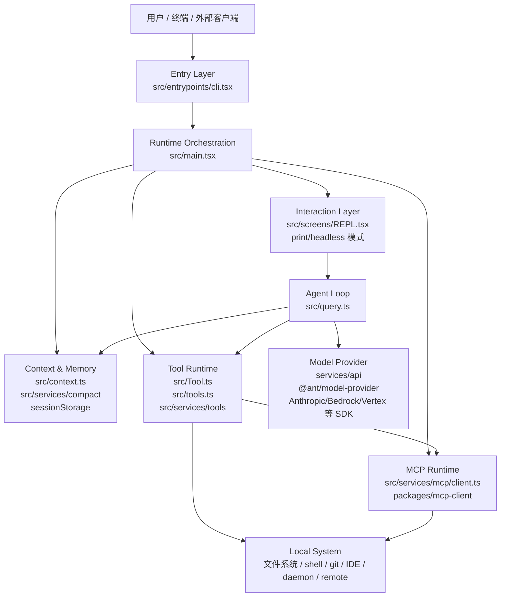
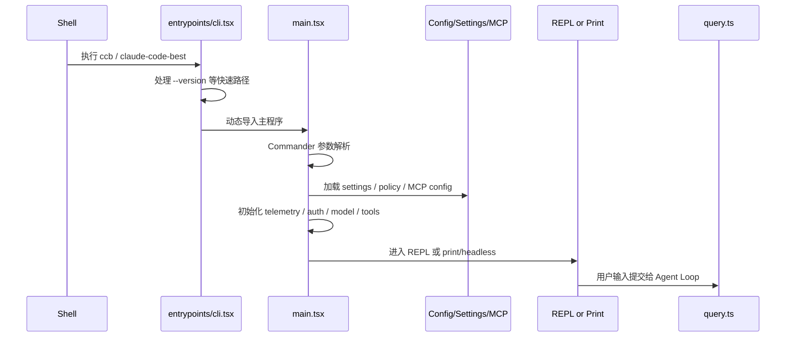
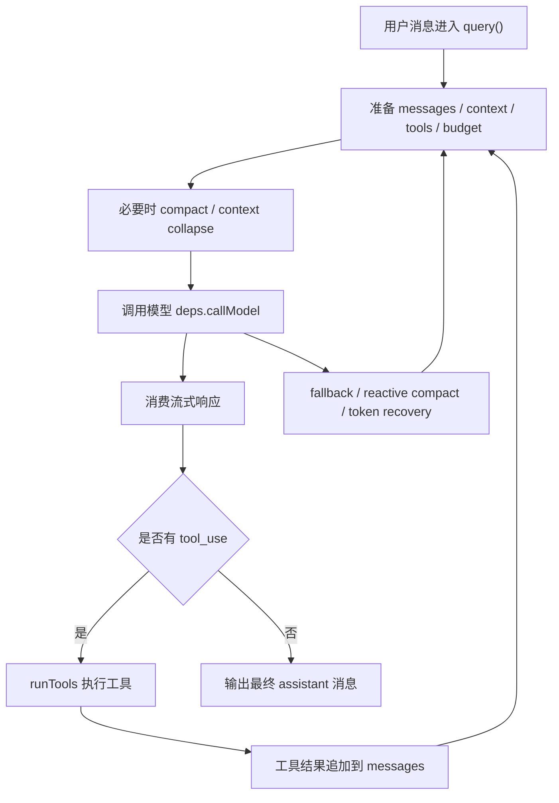
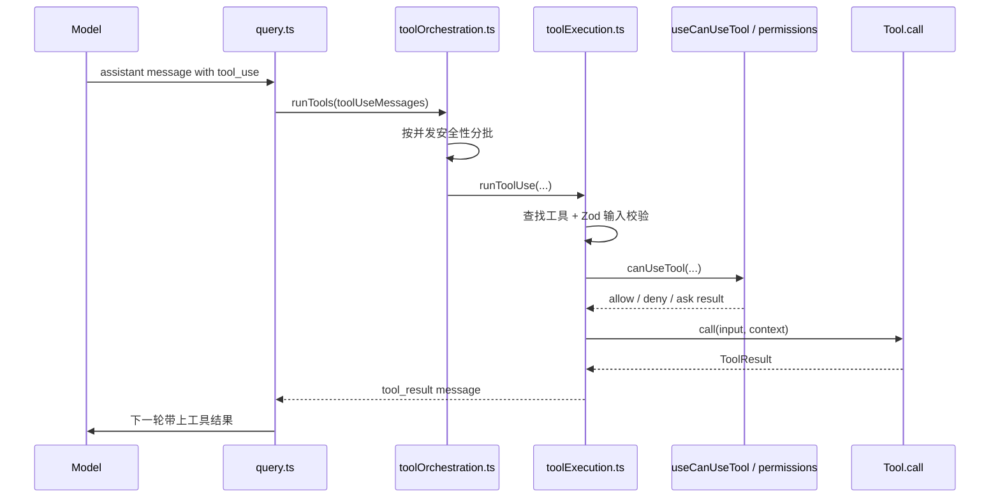
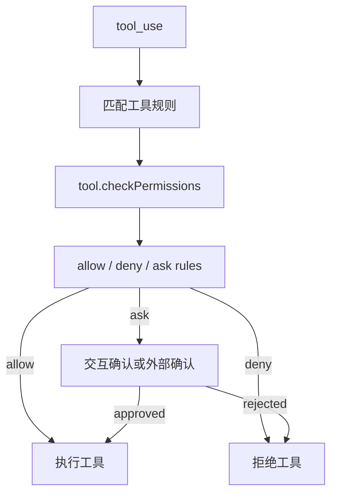
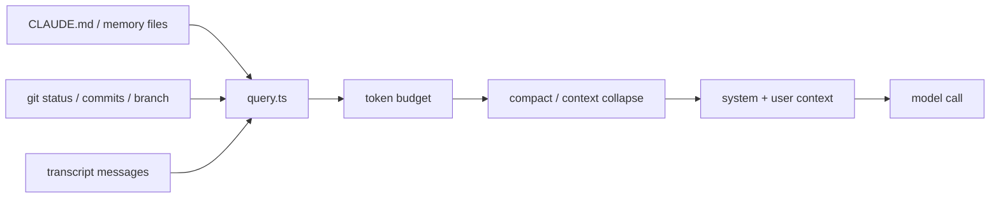
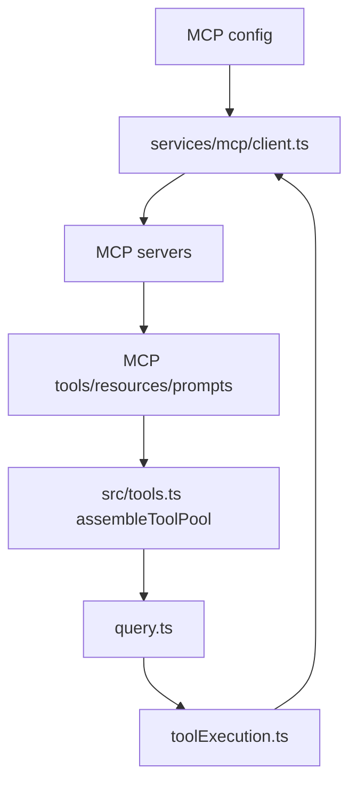

# Claude Code 全局架构地图

> 本文是《从 0 到 1 实现 Claude Code》的第一章。
>
> 源码根固定为 `claude-code/`。本文所有源码路径都以 `claude-code/` 为相对根目录，不分析、不引用其它目录作为 Claude Code 源码。

## 1. 本章目标

读完本章，你应该能回答四个问题：

1. Claude Code 这个 CLI 程序从哪里启动。
2. 一次用户输入如何进入 Agent Loop，并如何触发模型、工具、权限、上下文压缩。
3. MCP、内置工具、权限、记忆、IDE/远程通信分别落在哪些模块。
4. 如果要从 0 实现一个最小 Claude Code，应先拆哪些核心抽象。

本章不深入每个函数的细节，只建立全局地图。后续章节再逐层实现。

## 2. 一句话定位

Claude Code 本质上是一个运行在终端里的 Agent Runtime：

```text
Terminal UI / Headless CLI
  -> CLI 启动器与运行时编排
  -> Agent Loop
  -> Model Provider
  -> Tool Runtime
  -> Permission / Context / Memory / MCP / Session Storage
```

它不是单纯的命令行工具，也不是单纯的聊天客户端。它更接近一个把模型、工具、上下文、权限、MCP 服务、终端交互、会话存储组合起来的本地 Agent 操作系统。

## 3. 源码结构总览

核心代码主要在 `claude-code/src`，可复用包主要在 `claude-code/packages`。

```text
claude-code/
  package.json
  src/
    entrypoints/
      cli.tsx
    main.tsx
    query.ts
    Tool.ts
    tools.ts
    screens/
      REPL.tsx
    hooks/
      useCanUseTool.tsx
    context.ts
    commands.ts
    services/
      tools/
        toolExecution.ts
        toolOrchestration.ts
      mcp/
        client.ts
      compact/
        autoCompact.ts
      ...
    utils/
      permissions/
        permissions.ts
      sessionStorage.ts
      ...
    state/
    bootstrap/
    cli/
    bridge/
    daemon/
    remote/
    server/
    skills/
    plugins/
  packages/
    builtin-tools/
    mcp-client/
    @ant/model-provider/
    @ant/ink/
    remote-control-server/
    acp-link/
    ...
```

这棵树可以先按职责理解：

| 层级 | 代表路径 | 主要职责 |
| --- | --- | --- |
| 进程入口 | `src/entrypoints/cli.tsx` | Bun CLI 入口、快速命令分流、延迟加载主程序 |
| CLI 编排 | `src/main.tsx` | 参数解析、配置加载、模式分发、REPL/print/headless 启动 |
| 交互界面 | `src/screens/REPL.tsx` | Ink 终端 UI、输入框、消息列表、权限弹窗、状态展示 |
| Agent Loop | `src/query.ts` | 模型调用循环、工具调用循环、上下文管理、fallback、stop hook |
| 工具抽象 | `src/Tool.ts` | Tool、ToolUseContext、ToolResult、权限上下文等核心类型 |
| 工具池 | `src/tools.ts` | 内置工具注册、MCP 工具合并、工具过滤、稳定排序 |
| 工具执行 | `src/services/tools/*` | 工具输入校验、权限检查、并发调度、结果映射 |
| 权限系统 | `src/hooks/useCanUseTool.tsx`, `src/utils/permissions/permissions.ts` | allow/deny/ask 规则、交互确认、权限消息构造 |
| 上下文系统 | `src/context.ts`, `src/services/compact/*` | system/user context、CLAUDE.md、git 信息、自动压缩 |
| MCP | `src/services/mcp/client.ts`, `packages/mcp-client` | MCP transport、tools/resources/prompts、OAuth、内容处理 |
| 会话存储 | `src/utils/sessionStorage.ts` | transcript jsonl、resume、项目会话目录 |
| 命令系统 | `src/commands.ts`, `src/commands/*` | slash commands、动态 skills/plugins 命令 |
| 远程/IDE/后台 | `src/bridge`, `src/remote`, `src/daemon`, `src/server`, `src/cli` | bridge、remote control、daemon、server、SDK control |

## 4. 分层架构

从上到下，Claude Code 可以画成七层：



这张图最重要的点是：`query.ts` 是 Agent Loop 的中心，但它不是全能模块。它通过 `ToolUseContext`、`canUseTool`、`deps.callModel`、MCP 工具池、上下文压缩服务与外部世界协作。

## 5. 进程启动链路

入口是 `src/entrypoints/cli.tsx`。这个文件非常轻，它优先处理不需要完整加载主程序的快速路径，例如：

- `--version`
- `--dump-system-prompt`
- Chrome MCP / native host
- computer-use MCP
- ACP
- weixin
- daemon worker
- remote control
- daemon
- autonomy

只有不命中这些快速路径时，才动态导入主 CLI。

简化后的启动链路：



`src/main.tsx` 是启动编排中心。它承担的事情很多：

- 命令行参数解析。
- 配置、策略、权限、MCP 配置加载。
- 工具池初始化。
- 认证与模型供应商准备。
- interactive REPL、print/headless、MCP/daemon/remote 等模式分发。
- 启动前后的 hook、日志、健康检查、迁移等杂项。

从 0 实现时，不建议一开始就写成 `main.tsx` 这样的大编排文件。更适合先做一个最小启动器：

```text
parse args
  -> load config
  -> build model client
  -> build tool registry
  -> start repl or run print query
```

等功能扩展后，再把不同模式和平台能力拆出去。

## 6. 运行时生命周期

一次完整的交互大致经历以下阶段：

```text
进程启动
  -> 加载配置、权限、MCP、commands、skills、plugins
  -> 构建工具池
  -> 进入 REPL 或 headless
  -> 用户输入
  -> 组装 system prompt / user context / system context
  -> 调用 Agent Loop
  -> 模型流式输出
  -> 解析 tool_use
  -> 权限判断
  -> 执行工具
  -> 工具结果写回消息
  -> 继续下一轮模型调用
  -> 输出最终回答
  -> 写 transcript / 更新状态
```

对应到核心文件：

```text
src/entrypoints/cli.tsx
  -> src/main.tsx
  -> src/screens/REPL.tsx
  -> src/query.ts
  -> src/services/tools/toolOrchestration.ts
  -> src/services/tools/toolExecution.ts
  -> src/hooks/useCanUseTool.tsx
  -> src/utils/sessionStorage.ts
```

## 7. Agent Loop 核心

`src/query.ts` 是 Claude Code 的 Agent Loop。它负责把“聊天”变成“可多轮调用工具的任务执行循环”。

简化模型：



真实的 `query.ts` 还处理了更多生产级问题：

- 流式输出期间的消息组装。
- tool_use block 的收集。
- streaming tool executor。
- stop hook。
- fallback model。
- prompt too long 恢复。
- max output token 恢复。
- auto compact / micro compact / context collapse。
- tool result budget。
- task budget。
- MCP 工具与 pending MCP server 状态。
- Langfuse trace。
- autonomy command finalization。

一个最小 Agent Loop 可以先实现为：

```ts
while (true) {
  const assistant = await callModel(messages, tools)
  messages.push(assistant)

  const toolUses = extractToolUses(assistant)
  if (toolUses.length === 0) break

  const toolResults = await runTools(toolUses)
  messages.push(...toolResults)
}
```

Claude Code 的复杂度来自于把这个最小循环扩展到真实本地开发场景：大上下文、权限、安全、并发工具、MCP、会话恢复、流式 UI、错误恢复。

## 8. Tool 抽象

工具核心类型在 `src/Tool.ts`。

可以把 `Tool` 理解成模型可调用能力的统一协议：

```ts
type Tool = {
  name: string
  inputSchema: ZodSchema
  call(input, context): AsyncGenerator<ToolResult>
  checkPermissions?(input, context): Promise<PermissionResult>
  isReadOnly?(): boolean
  isConcurrencySafe?(): boolean
  isEnabled?(): Promise<boolean>
  userFacingName(): string
}
```

真实类型比这个复杂得多，还包含：

- alias。
- prompt 生成。
- UI 渲染。
- MCP 标记。
- LSP 标记。
- 是否 open-world。
- 是否 destructive。
- 输入等价判断。
- deferred tool。
- strict schema。
- 结果映射为模型 tool_result block。
- 搜索文本提取。

`ToolUseContext` 是工具执行时能访问的运行时上下文，里面包含：

- abort controller。
- options。
- permission context。
- read file state。
- app state。
- MCP clients/resources。
- agent definitions。
- prompts。
- notifications。
- skill triggers。
- Langfuse trace。
- rendered system prompt。

这说明 Claude Code 的工具不是孤立函数。工具执行时需要知道当前会话、权限、MCP、UI 状态、agent 状态、上下文状态。

## 9. 工具池与工具执行

工具池入口在 `src/tools.ts`。

`getAllBaseTools()` 注册了大量内置工具，典型类别包括：

- 文件读写编辑。
- Bash / PowerShell。
- Glob / Grep。
- WebFetch / WebSearch / WebBrowser。
- Todo。
- Agent / Task。
- MCP resources。
- Skills。
- Memory。
- LSP。
- workflow / cron / monitor / remote。
- peer/team/coordinator 相关工具。

工具池构建要做几件事：

1. 根据运行模式过滤工具。
2. 根据权限规则过滤 deny 工具。
3. 根据 `isEnabled` 过滤当前不可用工具。
4. 合并 MCP 工具。
5. 稳定排序，保证 prompt cache 友好。
6. 去重，优先保留内置工具。

工具执行分为两层：

```text
src/services/tools/toolOrchestration.ts
  负责批处理、并发调度、串行约束

src/services/tools/toolExecution.ts
  负责单个工具的输入校验、权限检查、call、错误映射、hook、结果转换
```

执行链路：



这里有一个关键设计：模型永远不直接执行系统操作。模型只产出 `tool_use`，真正执行必须经过工具注册、输入校验、权限系统和执行上下文。

## 10. 权限系统

权限系统主要分散在两个地方：

- `src/utils/permissions/permissions.ts`
- `src/hooks/useCanUseTool.tsx`

权限判断结果大致是：

```text
allow: 直接执行
deny: 拒绝执行，返回错误或提示
ask: 弹出交互确认，或走 coordinator/bridge/swarm 等外部确认路径
```

权限来源包括：

- settings。
- project settings。
- local settings。
- policy。
- CLI 参数。
- command/session 临时规则。
- tool 自己的 `checkPermissions`。
- hooks 或 classifier 的判断。

权限系统不是简单的“是否允许 Bash”。它还需要处理：

- MCP 工具名与 server 级权限。
- 子命令结果。
- sandbox override。
- working directory。
- destructive action。
- async agent。
- permission prompt tool。
- interactive dialog。

简化链路：



从 0 实现时，权限系统应该尽早建模，哪怕一开始只有简单规则：

```ts
type PermissionDecision =
  | { type: 'allow' }
  | { type: 'deny'; reason: string }
  | { type: 'ask'; prompt: string }
```

不要把权限散落在工具内部，否则后面接 MCP、Bash、文件写入、远程执行时会很难维护。

## 11. Context Flow

上下文系统核心在：

- `src/context.ts`
- `src/services/compact/autoCompact.ts`
- `src/services/compact/*`
- `src/utils/sessionStorage.ts`

`src/context.ts` 负责构造两类上下文：

```text
System Context:
  - git 状态
  - 分支
  - 最近提交
  - 用户名
  - 系统 prompt 注入与 cache breaker

User Context:
  - CLAUDE.md / memory files
  - 当前日期
  - add-dir 相关上下文
  - bare mode / env 开关
```

`query.ts` 在每一轮模型调用前，会根据 token 情况做上下文治理：

```text
messages
  -> tool result budget
  -> snip / microcompact
  -> context collapse
  -> auto compact
  -> appendSystemContext
  -> prependUserContext
  -> callModel
```

`autoCompact.ts` 处理接近上下文窗口时的自动压缩。它不是等模型报错才处理，而是会估算下一轮增长：

- 模型 context window。
- 预留 summary output tokens。
- 当前 token usage。
- max output tokens。
- 工具结果增长估计。
- warning/error buffer。
- consecutive failure circuit breaker。

Context Flow 示意：



从实现角度看，Context Flow 是 Claude Code 区别于普通 Chat CLI 的关键之一。它要在“尽量保留有效上下文”和“不超过模型窗口”之间动态平衡。

## 12. Memory 与 Session Storage

会话存储在 `src/utils/sessionStorage.ts`。

关键点：

- project 级会话目录在 Claude 配置目录的 `projects` 下。
- transcript 使用 jsonl。
- 支持 resume。
- 区分 user / assistant / attachment / system 等消息。
- progress 类临时消息不进入主链路。
- subagent 有独立 transcript 路径。
- 有最大读取字节限制，避免一次性读爆历史。

Memory 与 Session 不完全相同：

```text
Session:
  本次或历史对话的消息流水，用来恢复会话和继续任务。

Memory:
  项目级、用户级或工具生成的长期上下文，例如 CLAUDE.md、memory files、session memory compact 结果。
```

最小实现可以先做两件事：

1. 把每条消息追加写入 jsonl。
2. 启动时按 session id 加载历史 messages。

之后再补：

- 项目维度隔离。
- subagent transcript。
- 压缩摘要。
- memory file discovery。
- 大文件读取保护。

## 13. MCP Flow

MCP 客户端核心在 `src/services/mcp/client.ts`，并结合 `packages/mcp-client`。

它负责：

- 连接 MCP server。
- 支持 stdio / SSE / streamable HTTP / WebSocket 等 transport。
- 加载 MCP tools。
- 加载 MCP resources。
- 加载 MCP prompts。
- OAuth / auth cache / 401 恢复。
- session expiry。
- elicitation。
- image resizing/downsampling。
- binary content persistence。
- tool result 截断。
- MCP skills。
- MCP tool 命名与权限适配。

MCP 工具最终会合并到普通工具池：



这个设计的关键是“统一工具协议”：Agent Loop 不需要知道某个工具来自内置模块还是 MCP server。只要它实现了 Tool 协议，就能进入同一套 schema、权限、执行、结果映射链路。

## 14. Sandbox 与本地系统边界

Claude Code 的危险操作主要通过工具触达本地系统，例如：

- Bash / PowerShell。
- 文件写入和编辑。
- notebook 编辑。
- LSP。
- WebFetch / WebSearch。
- MCP 外部工具。
- remote / daemon / bridge 相关能力。

系统边界不是一个单独模块解决的，而是由多层共同限制：

```text
Tool schema
  -> validateInput
  -> checkPermissions
  -> permission rules
  -> interactive ask
  -> sandbox override / working dir
  -> tool-specific execution guard
  -> transcript / audit
```

所以从 0 实现时，不要把 sandbox 只理解成“子进程隔离”。它至少应该包含：

- 工具输入白名单。
- 工作目录限制。
- 文件路径规范化。
- 命令执行权限。
- destructive 操作确认。
- 可审计日志。
- 可撤销或可检查的结果。

## 15. IDE / Bridge / Remote 通信

相关目录包括：

```text
src/bridge/
src/remote/
src/daemon/
src/server/
src/cli/
packages/remote-control-server/
packages/acp-link/
```

这些模块把 Claude Code 从“单终端进程”扩展成可被其它客户端或后台服务驱动的运行时。

可以把通信能力分成几类：

| 类型 | 作用 |
| --- | --- |
| bridge | 与外部 UI、宿主或控制层通信 |
| remote control | 远程触发、同步、控制 |
| daemon | 后台 worker / 常驻能力 |
| server | 本地服务能力 |
| ACP | Agent Client Protocol 相关接入 |
| SDK control | 外部程序化控制 CLI 会话 |

这些模块不是实现最小 Agent Loop 的必要条件，但它们决定了 Claude Code 能不能从“本地 CLI”升级为“可集成的 Agent Runtime”。

## 16. Commands、Skills、Plugins

命令系统入口是 `src/commands.ts`，具体命令分布在 `src/commands/*`。

命令类型包括：

- 基础命令：help、clear、compact、config、doctor、login/logout。
- 项目命令：add-dir、memory、mcp、ide、session、resume。
- 开发命令：review、pr-comments、vim、release-notes。
- Agent 命令：agents、tasks、schedule、monitor、brief。
- 动态命令：skills、plugins 注入的命令。

Skills 与 Plugins 让 Claude Code 的能力可以扩展，而不必把所有功能硬编码在主程序里。

简化关系：

```text
commands.ts
  -> static command list
  -> feature-gated commands
  -> skills commands
  -> plugin commands
```

从架构上看，slash command 是用户主动触发的控制面；tool_use 是模型触发的执行面。二者都可能影响上下文、工具池、权限和会话状态。

## 17. Package 层职责

`claude-code/packages` 下是可复用包和原生能力包。重点包括：

| Package | 职责 |
| --- | --- |
| `packages/builtin-tools` | 内置工具实现来源之一 |
| `packages/mcp-client` | MCP 客户端能力 |
| `packages/@ant/model-provider` | 模型供应商抽象 |
| `packages/@ant/ink` | 终端 UI 底层能力 |
| `packages/remote-control-server` | 远程控制服务 |
| `packages/acp-link` | ACP 相关接入 |
| `packages/*-napi` | 原生扩展能力，例如音频、图片、diff、URL handler |
| `packages/@ant/computer-use-*` | computer use 相关能力 |

源码层 `src/` 是应用运行时，`packages/` 是被运行时复用的能力库。阅读时建议先看 `src/` 主链路，再按需深入 package。

## 18. 核心调用链清单

后续章节会沿着这些调用链逐个拆：

### 18.1 启动链

```text
src/entrypoints/cli.tsx
  -> src/main.tsx
  -> src/screens/REPL.tsx 或 print/headless 分支
```

### 18.2 一次用户输入

```text
REPL PromptInput
  -> handlePromptSubmit
  -> query()
  -> queryLoop()
  -> deps.callModel()
```

### 18.3 一次工具调用

```text
assistant tool_use
  -> query.ts 收集 tool_use
  -> runTools()
  -> partitionToolCalls()
  -> runToolUse()
  -> canUseTool()
  -> tool.call()
  -> tool_result
  -> 下一轮模型调用
```

### 18.4 一次权限确认

```text
tool_use
  -> tool.checkPermissions
  -> hasPermissionsToUseTool
  -> allow / deny / ask
  -> interactive PermissionRequest 或外部确认
```

### 18.5 一次 MCP 工具加载

```text
MCP config
  -> services/mcp/client.ts
  -> connect transport
  -> list tools/resources/prompts
  -> 转换为 Tool
  -> assembleToolPool()
```

### 18.6 一次上下文压缩

```text
messages
  -> token usage estimate
  -> shouldAutoCompact()
  -> autoCompactIfNeeded()
  -> compact/context collapse result
  -> 更新 messages
```

## 19. 从 0 实现的最小模块切分

如果要从 0 写一个迷你 Claude Code，建议第一阶段只做这些模块：

```text
src/
  cli.ts
  repl.ts
  agentLoop.ts
  model.ts
  tool.ts
  tools/
    readFile.ts
    writeFile.ts
    bash.ts
  permissions.ts
  context.ts
  session.ts
```

最小闭环：

1. CLI 接收用户输入。
2. 构造 system prompt。
3. 调用模型。
4. 模型返回文本或 tool_use。
5. 根据 schema 找到工具。
6. 权限检查。
7. 执行工具。
8. 把 tool_result 追加到 messages。
9. 继续循环直到无工具调用。
10. 写入 session transcript。

第二阶段再补：

- streaming UI。
- auto compact。
- MCP。
- skills/plugins。
- slash commands。
- remote/daemon。
- 多模型 provider。
- 复杂权限策略。

## 20. 设计哲学

Claude Code 的架构可以总结成几个原则：

### 20.1 Agent Loop 是中心，但不是上帝对象

`query.ts` 控制循环，但不直接实现所有能力。模型调用、工具执行、权限判断、上下文压缩、MCP 都通过独立模块协作。

### 20.2 工具是统一边界

无论是文件编辑、Bash、WebSearch，还是 MCP server 暴露的能力，最终都进入 Tool 协议。这让 Agent Loop 可以用同一种方式处理内置能力和外部能力。

### 20.3 权限是运行时协议，不是 UI 装饰

权限判断发生在工具执行链路中，而不只是 REPL 弹窗。这样 headless、remote、coordinator、bridge 等场景也能复用同一套规则。

### 20.4 Context 是动态资产

上下文不是简单拼 prompt。它包含项目文件、git 状态、会话历史、工具结果、压缩摘要、token budget。Agent Runtime 的质量很大程度取决于上下文治理。

### 20.5 启动器要轻，主运行时可以重

`entrypoints/cli.tsx` 先处理快速路径，再延迟加载主程序。这能减少简单命令的启动成本，也让特殊模式在主运行时外快速分发。

### 20.6 可扩展性来自协议化

MCP、skills、plugins、commands、tools 都是协议化扩展点。Claude Code 不是靠不断堆 if/else 扩展，而是把能力转成可注册、可过滤、可权限化、可执行的对象。

## 21. 下一章建议

下一章可以进入启动链路，拆 `src/entrypoints/cli.tsx` 与 `src/main.tsx`：

```text
第 2 章：CLI 启动器与 Runtime Bootstrap
  - bin 命令如何进入 Bun
  - 快速路径为什么放在 entrypoint
  - main.tsx 如何解析参数
  - interactive / print / daemon / remote 如何分流
  - 从 0 写一个最小 bootstrap
```

掌握启动链路后，再进入 `query.ts` 的 Agent Loop，会更容易理解每个参数和运行时上下文为什么存在。
