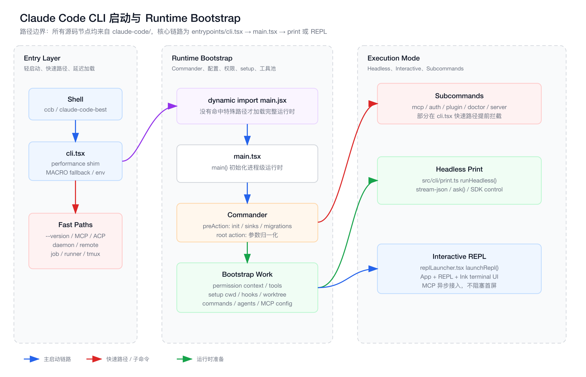

# 第 2 章：CLI 启动器与 Runtime Bootstrap

> 本章继续《从 0 到 1 实现 Claude Code》。
>
> 本章所有路径仍以 `claude-code/` 为源码根。

## 1. 本章要解决的问题

上一章我们建立了 Claude Code 的全局地图。现在开始进入第一条真实源码主线：CLI 进程如何启动，如何从一个 shell 命令变成可运行的 Agent Runtime。

本章重点不是把 `main.tsx` 每一行翻译一遍，而是建立启动链路的架构认知：

1. 为什么 CLI 入口要极轻。
2. 为什么很多模式要在加载完整主程序前提前分流。
3. `main.tsx` 为什么会成为 Runtime Bootstrap 中心。
4. interactive REPL 和 headless print 为什么是两条不同运行路径。
5. 从 0 实现时，应该如何设计一个可演进的启动器。

## 2. 前端工程师视角：CLI Bootstrap 像什么@@

前端工程师可以把 Claude Code 的启动过程类比成一个大型前端应用启动：

| Claude Code | 前端类比 | 说明 |
| --- | --- | --- |
| `entrypoints/cli.tsx` | `index.html` + 最小入口脚本 | 先处理最低成本的事情，避免过早加载大包 |
| fast path | 路由级 code splitting | 命中特殊路由就直接进入专属 bundle |
| `main.tsx` | `main.ts` / app bootstrap | 初始化配置、插件、全局状态、路由 |
| Commander | Router + 命令 DSL | 把 CLI 参数映射成运行模式 |
| `setup.ts` | app mount 前的环境准备 | cwd、hooks、worktree、session 基础设施 |
| `runHeadless()` | SSR / server-side task | 没有 UI，但要完整跑业务逻辑 |
| `launchRepl()` | React render | 创建 UI 树，进入交互态 |
| `AppState` | Redux / Zustand store | 运行时全局状态容器 |

这也是理解 AI Agent 工程化的第一个关键点：

> Coding Agent 不是一个函数，而是一个要启动、配置、挂载、调度、恢复和退出的 Runtime。

## 3. 本章源码入口清单

本章主要阅读这些文件：

```text
claude-code/src/entrypoints/cli.tsx
claude-code/src/main.tsx
claude-code/src/setup.ts
claude-code/src/replLauncher.tsx
claude-code/src/cli/print.ts
```

它们之间的关系：

```text
entrypoints/cli.tsx
  -> main.tsx
    -> setup.ts
    -> cli/print.ts
    -> replLauncher.tsx
      -> screens/REPL.tsx
```

## 4. 启动流程图

下图使用 `fireworks-tech-graph` 风格绘制，源文件在 `./assets/02-cli-bootstrap-flow.svg`，PNG 导出文件在 `./assets/02-cli-bootstrap-flow.png`。



这张图的核心结论是：

- `cli.tsx` 是轻入口，优先处理 fast path。
- `main.tsx` 是完整 Runtime Bootstrap。
- `setup.ts` 负责把进程环境变成一个可运行会话。
- `print.ts` 和 `REPL.tsx` 分别对应 headless 与 interactive。

## 5. 第一层：`entrypoints/cli.tsx` 为什么必须轻

源码入口是：

```text
claude-code/src/entrypoints/cli.tsx
```

文件开头有几个关键动作：

```text
#!/usr/bin/env bun
import '../utils/performanceShim.js'
```

这里有两个信息：

1. Claude Code 运行时入口是 Bun。
2. performance shim 必须最先 import。

为什么要这么设计？

因为 CLI 启动性能非常敏感。用户在终端里运行 `claude --version`，期望的是几十毫秒内返回，而不是加载完整 React、MCP、插件、权限、工具、模型 provider 后再输出版本号。

这和前端首屏性能一样：

- 不是所有页面都应该加载整站 bundle。
- 不是所有命令都应该加载完整 Agent Runtime。
- 最小路径要尽量短，重路径要延迟到真正需要时。

`cli.tsx` 的定位可以总结成一句话：

> 先判断“这次启动到底需不需要完整 Claude Code”，需要才 import `main.jsx`。

## 6. Fast Path：为什么特殊命令要提前分流

`cli.tsx` 在导入 `main.jsx` 前处理大量 fast path，包括：

```text
--version
--dump-system-prompt
--claude-in-chrome-mcp
--chrome-native-host
--computer-use-mcp
--acp
weixin
--daemon-worker
remote-control / rc / remote / sync / bridge
daemon
autonomy
--bg / --background
job
environment-runner
self-hosted-runner
--worktree --tmux
```

这些路径不是随便堆 if/else，而是一个重要架构取舍：

```text
特殊模式如果不需要完整 TUI，就不要进入完整 TUI bootstrap。
```

例如：

- `--version` 只需要输出版本，不需要读配置。
- `daemon worker` 是内部 worker，不应该加载交互式 CLI。
- `remote-control` 是 bridge 能力，进入自己的 remote runtime。
- `mcp serve` 这种服务模式和普通聊天不是同一个生命周期。
- `--worktree --tmux` 需要在完整 CLI 加载前处理 exec/tmux 语义。

如果这些都放进 `main.tsx` 之后再处理，会带来三个问题：

1. 启动慢：无意义加载大量模块。
2. 副作用多：配置、keychain、analytics、hooks 可能被提前触发。
3. 生命周期乱：worker/server/remote/TUI 混在同一个启动路径里。

从 0 实现时，可以先写成这样：

```ts
async function cliEntry() {
  const args = process.argv.slice(2)

  if (isVersion(args)) {
    printVersion()
    return
  }

  if (isMcpServer(args)) {
    const { runMcpServer } = await import('./mcpServer')
    await runMcpServer(args)
    return
  }

  const { main } = await import('./main')
  await main()
}
```

这就是最早期的 code splitting。

## 7. 第二层：`main.tsx` 是 Runtime Bootstrap 中心

当 `cli.tsx` 没有命中 fast path，会执行：

```text
dynamic import('../main.jsx')
```

进入 `claude-code/src/main.tsx` 后，事情开始变重。这个文件不是普通 CLI 参数解析器，而是完整运行时的总装线。

它负责的事情包括：

- 设置进程级安全环境。
- 注册 SIGINT / exit 清理。
- 处理 entrypoint 类型。
- eager load settings。
- 初始化 warning handler。
- Commander 参数定义。
- preAction 初始化。
- root action 执行默认会话路径。
- subcommand 注册。
- permission context 初始化。
- MCP 配置加载。
- tool pool 初始化。
- setup cwd / hooks / worktree。
- commands / agents 加载。
- model / thinking / effort 解析。
- headless 与 interactive 分流。

`main.tsx` 很大，这是事实。但它大的原因不是“代码写乱了”这么简单，而是它处在一个天然容易膨胀的位置：

```text
所有运行模式都要从这里分发。
所有全局配置都要在这里收敛。
所有启动性能优化都要在这里协调。
所有安全边界都要在这里建立第一层。
```

工程上，这类文件要重点关注两个问题：

1. 哪些事情必须同步阻塞启动。
2. 哪些事情可以异步预热或延后到首屏后。

Claude Code 在 `main.tsx` 里大量使用了“提前发起 Promise，后面再 join”的模式，本质就是为了减少启动关键路径。

## 8. Commander：参数不是配置，是 Runtime DSL

`main.tsx` 使用 Commander 构造 CLI：

```text
new CommanderCommand()
  .configureHelp(...)
  .enablePositionalOptions()
```

然后挂上大量 option：

```text
--print
--bare
--output-format
--input-format
--allowedTools
--disallowedTools
--mcp-config
--permission-prompt-tool
--system-prompt
--append-system-prompt
--permission-mode
--continue
--resume
--model
--fallback-model
--add-dir
--ide
--strict-mcp-config
--session-id
--agents
--plugin-dir
--disable-slash-commands
```

这些参数不是简单配置项。它们共同构成了 Agent Runtime 的启动 DSL。

例如：

| 参数 | 影响范围 |
| --- | --- |
| `--print` | 切到 headless 生命周期 |
| `--bare` | 关闭大量自动发现、prefetch、hooks、keychain |
| `--mcp-config` | 改变工具池和外部能力 |
| `--allowedTools` | 改变权限上下文 |
| `--system-prompt` | 改变 prompt pipeline |
| `--resume` | 改变 session storage 加载路径 |
| `--model` | 改变 model provider 选择 |
| `--agents` | 改变 agent definitions |

这就是为什么 CLI 层在 AI Agent 里比传统工具更重要：

> CLI 参数不是“程序启动参数”，而是在定义这次 Agent 会话的能力边界。

## 9. `preAction`：命令真正执行前的公共初始化

Commander 的 `preAction` 是所有命令执行前的公共入口。

源码里它做了几类事情：

```text
ensureMdmSettingsLoaded()
ensureKeychainPrefetchCompleted()
init()
process.title = 'claude'
initSinks()
setInlinePlugins()
runMigrations()
loadRemoteManagedSettings()
loadPolicyLimits()
uploadUserSettingsInBackground()
```

这相当于前端路由切换前的全局 guard：

- 必要配置先准备好。
- 日志和 telemetry sink 接起来。
- 插件目录参数写入全局插件系统。
- migration 和远程策略异步启动。

但它也刻意避免在 help 场景触发。因为用户只是看帮助时，不应该执行完整初始化。

这个设计点很关键：

```text
初始化应该绑定到“即将执行动作”，而不是绑定到“解析了命令行”。
```

否则 `claude --help` 也会触发配置、keychain、插件、远程设置加载，启动成本和副作用都会不可控。

## 10. Root Action：默认会话路径的总装线

Claude Code 默认行为不是执行某个 subcommand，而是启动一个会话。

也就是：

```text
claude
claude "帮我改这个 bug"
claude -p "解释这段代码"
```

都会进入 root action。

root action 里可以按阶段理解：

### 10.1 输入与模式归一化

首先处理：

- `--bare`。
- prompt 参数。
- `--print`。
- SDK URL。
- input/output format。
- session id。
- continue/resume/fork。
- permission mode。
- model/fallback model。

这一层的目标是把各种 CLI 写法规整成一组内部运行时参数。

### 10.2 初始化权限上下文

源码会调用类似：

```text
initializeToolPermissionContext(...)
```

输入包括：

- allowed tools。
- disallowed tools。
- base tools。
- permission mode。
- add-dir。
- 是否允许 dangerously skip permissions。

输出是 `toolPermissionContext`。

注意这个顺序：先有权限上下文，再有工具池。

原因很简单：

```text
工具可不可用，本身取决于权限。
```

比如某些工具被 deny rule 禁掉，就不应该出现在当前会话的可用工具集合里。

### 10.3 提前加载 MCP 配置

`main.tsx` 会很早发起 MCP config promise：

```text
getClaudeCodeMcpConfigs(dynamicMcpConfig)
```

但此时只读配置，不急着连接 server。

这个分层很重要：

```text
读配置是低风险 I/O。
连接 MCP server 可能执行外部进程或网络连接。
```

因此 Claude Code 把 MCP 拆成两步：

1. 提前读配置，和 setup/commands 加载并行。
2. 在合适时机连接 MCP server。

interactive 模式下，MCP 不阻塞 REPL 首屏；print 模式下，因为往往只有一轮请求，所以会更积极地等待 MCP 工具准备。

### 10.4 构建基础工具池

之后会执行：

```text
getTools(toolPermissionContext)
```

这一步得到当前会话的基础工具集合。

它不是简单 `import tools`：

- 会考虑 `CLAUDE_CODE_SIMPLE`。
- 会考虑 REPL mode。
- 会考虑 coordinator mode。
- 会应用 deny rule。
- 会跑每个工具的 `isEnabled`。

也就是说，工具池是运行时产物，而不是静态常量。

### 10.5 `setup()`：把进程变成会话

真正进入会话前，`main.tsx` 会调用：

```text
setup(...)
```

`setup.ts` 负责更底层的环境准备：

- 检查 Node.js 版本。
- 设置 custom session id。
- 启动 UDS messaging。
- 捕获 teammate snapshot。
- 恢复终端配置备份。
- `setCwd(cwd)`。
- 捕获 hooks config snapshot。
- 初始化 FileChanged watcher。
- 处理 `--worktree`。
- 创建 tmux session。
- 切换 cwd 到 worktree。
- 更新 project root。
- 清理 memory file cache。

这一步非常像前端应用 mount 前的运行时环境准备：

```text
确定根容器
  -> 初始化全局状态
  -> 注入插件
  -> 建立事件监听
  -> 再开始真正 render
```

Claude Code 的区别是它的“根容器”不是 DOM，而是：

```text
cwd + session + hooks + permissions + tools + model + AppState
```

## 11. 为什么 `setup()` 必须在很多事情之前

源码注释里反复强调：

```text
setup() must be called before any other code that depends on the cwd or worktree setup
```

原因是 cwd 在 Agent Runtime 里不是小事。

对前端工程师来说，cwd 类似于应用的 base URL 加上 workspace root。它会影响：

- CLAUDE.md 查找。
- `.claude/settings.json`。
- hooks。
- MCP 配置。
- skills/plugins。
- 文件工具可访问范围。
- git 状态。
- session project 归属。
- worktree 模式。

如果先加载 commands/agents，再切 worktree，就会出现一个严重问题：

```text
命令和 agent 是从旧目录加载的，但工具执行发生在新目录。
```

这类 bug 很隐蔽，表现可能是：

- slash command 缺失。
- hooks 不生效。
- memory 文件读错。
- agent 定义来自错误项目。
- session 归档到错误目录。

所以启动链路里必须明确一个原则：

> 所有依赖项目根目录的能力，都必须在 cwd/project root 最终确定后加载。

Claude Code 为了性能，会在不启用 worktree 时并行预加载 commands/agents；但一旦 worktree 可能改变 cwd，就会关掉这类并行路径。

这就是工业级启动器和 demo 代码的区别：不是能跑就行，而是要知道哪些优化在什么条件下不能做。

## 12. Headless Print：没有 UI，但不是简化版 Runtime

当用户传入：

```text
-p
--print
```

会进入 headless 路径。

对应代码在：

```text
claude-code/src/cli/print.ts
```

入口是：

```text
runHeadless(...)
```

headless 模式容易被误解成“简单调用一次模型”。实际上它仍然是完整 Agent Runtime，只是没有 Ink UI。

它仍然需要：

- AppState。
- tools。
- MCP clients/tools。
- commands。
- agents。
- canUseTool。
- session transcript。
- structured IO。
- streaming JSON。
- SDK control。
- permission prompt tool。
- ask/query loop。

`runHeadless()` 内部会构建一套无 UI 的运行时循环，最终仍然会调用：

```text
ask(...)
```

`ask()` 再进入后续 Agent Loop。

这就是为什么 print 模式不能偷懒：

```text
脚本调用同样可能需要工具、权限、MCP、resume、上下文压缩和多轮 tool_use。
```

区别只在交互界面：

| 能力 | Interactive REPL | Headless Print |
| --- | --- | --- |
| 输入来源 | TUI 输入框 | CLI 参数 / stdin / SDK stream |
| 输出形式 | Ink UI | text/json/stream-json |
| 权限确认 | 弹窗/交互组件 | permission prompt tool 或策略 |
| MCP 连接 | 可异步进入后续 turn | 倾向首轮前准备好 |
| 生命周期 | 长会话 | 常见为单任务，但可多 turn |

## 13. Interactive REPL：把 Runtime 挂到终端 UI

interactive 模式最终进入：

```text
claude-code/src/replLauncher.tsx
```

核心函数很小：

```text
launchRepl(root, appProps, replProps, renderAndRun)
```

它动态导入：

```text
components/App
components/SentryErrorBoundary
screens/REPL
```

然后渲染：

```tsx
<SentryErrorBoundary>
  <App {...appProps}>
    <REPL {...replProps} />
  </App>
</SentryErrorBoundary>
```

这个结构很像普通 React 应用：

```text
Root
  -> ErrorBoundary
  -> App Provider
  -> Page / Screen
```

区别是它跑在终端里，用 Ink 渲染，而不是浏览器 DOM。

interactive 模式启动前，`main.tsx` 会构造一个很大的 `initialState`，里面包含：

- settings。
- verbose。
- mainLoopModel。
- toolPermissionContext。
- agentDefinitions。
- MCP 状态。
- plugin 状态。
- notifications。
- todos。
- fileHistory。
- attribution。
- thinkingEnabled。
- fastMode。
- teamContext。
- initialMessage。

这说明 REPL 不是一个输入框组件，而是完整 Runtime 的 UI 壳。

## 14. 为什么 interactive 不阻塞等待全部 MCP

源码里有一个重要设计：

```text
MCP never blocks REPL render OR turn 1 TTFT.
```

interactive 模式下，MCP 连接可能比较慢。如果所有 MCP server 都阻塞首屏，用户会感觉 CLI 卡住。

所以 Claude Code 的策略是：

- 先渲染 REPL。
- MCP 后台连接。
- 已连接工具进入 AppState。
- 第一轮能看到多少工具取决于连接完成情况。
- 慢 server 可以在第二轮之后可用。

这和前端很像：

```text
先让页面可交互，再懒加载非首屏数据。
```

但 headless print 不一样。print 常常只有一个 turn，如果 MCP 第一轮不可用，任务可能直接失败。所以 print 模式会更倾向等待 MCP 连接。

这就是同一个功能在不同运行模式下的启动策略差异：

```text
interactive 优先 time-to-first-render
headless 优先 first-turn completeness
```

## 15. Subcommands：控制面和会话面要分开

`main.tsx` 后半段注册了大量 subcommands，例如：

```text
mcp
server
ssh
open
auth
plugin
agents
auto-mode
autonomy
doctor
install
update
task
completion
```

这些命令不是默认聊天会话，它们属于控制面。

可以这样理解：

```text
默认 action:
  启动一个 Agent 会话。

subcommands:
  管理 Agent Runtime 的配置、插件、服务、认证、状态。
```

这和 Kubernetes 类似：

- `kubectl apply` 是控制面操作。
- Pod 运行是数据面/执行面。

Claude Code 里：

- `claude mcp add` 是控制面。
- 模型调用 MCP 工具是执行面。

分清这两个面，后面读 MCP、plugins、commands 会更清楚。

## 16. 启动链路里的安全边界

CLI bootstrap 不是只有性能问题，还有安全问题。

源码中有几个典型边界：

### 16.1 Windows PATH 劫持防护

`main.tsx` 很早设置：

```text
NoDefaultCurrentDirectoryInExePath = '1'
```

这是为了避免 Windows 从工作目录执行命令，降低 PATH hijacking 风险。

### 16.2 print 模式跳过 trust dialog 的代价

`--print` 帮助文案里明确说 workspace trust dialog 会被跳过。因为 headless 场景无法弹交互 UI。

这意味着 print 模式要更依赖调用方对目录可信度的判断。

### 16.3 权限上下文先于工具池

工具可用性不能只由工具自己决定。CLI 传入的 allow/deny、settings、policy、permission mode 都要先合并为 `toolPermissionContext`。

### 16.4 MCP 配置和 MCP 连接分离

读配置可以提前；连接 server 要考虑 trust、policy、strict config、bare mode、interactive/headless 差异。

这些设计共同说明：

> Agent Runtime 的启动阶段就是安全边界建立阶段。

如果启动阶段偷懒，后面工具执行再补权限通常已经太晚。

## 17. 从 0 实现：第一版 Bootstrap 应该怎么写

如果我们自己从 0 实现一个迷你 Claude Code，不要一上来写成几千行 `main.tsx`。可以先分成五个文件：

```text
src/
  cli.ts
  main.ts
  setup.ts
  print.ts
  repl.ts
```

第一版伪代码：

```ts
// cli.ts
async function entry() {
  const args = process.argv.slice(2)

  if (args.includes('--version')) {
    console.log(version)
    return
  }

  if (args[0] === 'mcp' && args[1] === 'serve') {
    const { runMcpServer } = await import('./mcpServer')
    await runMcpServer()
    return
  }

  const { main } = await import('./main')
  await main()
}
```

```ts
// main.ts
async function main() {
  const options = parseArgs(process.argv)

  const settings = await loadSettings(options)
  const permissionContext = await buildPermissionContext(options, settings)
  const tools = await buildTools(permissionContext)

  await setup({
    cwd: process.cwd(),
    sessionId: options.sessionId,
    permissionMode: options.permissionMode,
  })

  const commands = await loadCommands()
  const agents = await loadAgents()
  const mcpConfig = await loadMcpConfig(options)

  if (options.print) {
    await runHeadless({ options, tools, commands, agents, mcpConfig })
  } else {
    await runRepl({ options, tools, commands, agents, mcpConfig })
  }
}
```

第二版再加优化：

- fast path 更多分支。
- settings eager load。
- preAction hook。
- setup 与 commands 并行。
- MCP config 预读。
- interactive 首屏不阻塞 MCP。
- headless 首轮等待 MCP。
- session resume。
- structured JSON IO。

从工程经验看，这个演进顺序很重要：

```text
先做清楚生命周期，再做性能优化。
先做权限边界，再做工具扩展。
先做模式分离，再做插件化。
```

## 18. 本章源码阅读路线

建议按这个顺序读源码：

1. `src/entrypoints/cli.tsx`
   - 看所有 fast path。
   - 理解为什么最后才 import `main.jsx`。

2. `src/main.tsx` 的 `main()`
   - 看进程级初始化。
   - 看 early argv rewrite。
   - 看 Commander 创建。

3. `program.hook('preAction')`
   - 看公共初始化边界。
   - 重点看哪些事在 help 时不会触发。

4. root action
   - 看 options 如何变成 runtime config。
   - 看 permission context、tools、setup、commands、agents、MCP。

5. `src/setup.ts`
   - 看 cwd、hooks、worktree、UDS messaging。

6. `src/cli/print.ts`
   - 看 headless 如何构造 store、tools、MCP、structured IO。
   - 找到 `ask(...)` 调用点。

7. `src/replLauncher.tsx`
   - 看 interactive 如何挂载 App + REPL。

## 19. 本章结论

Claude Code 的启动器体现了一个成熟 Agent Runtime 的基本功：

- 入口要轻。
- 特殊模式要提前分流。
- CLI 参数是 Runtime DSL。
- 权限上下文要早于工具池。
- cwd/project root 是会话根基。
- interactive 和 headless 不是 UI 差异，而是两套生命周期策略。
- MCP 连接时机要根据运行模式权衡。
- Bootstrap 阶段就是性能、安全、可扩展性的交汇点。

如果你要实现自己的 Coding Agent，第二章的核心不是“学会 Commander 怎么写”，而是学会设计这个启动管线：

```text
Entry
  -> Fast Path
  -> Runtime Bootstrap
  -> Environment Setup
  -> Mode Dispatch
  -> Agent Loop
```

下一章可以进入真正的心脏：

```text
第 3 章：Agent Loop 是如何运转的
  - query.ts 的循环结构
  - model stream 如何变成 assistant message
  - tool_use 如何被收集和执行
  - 为什么 Agent Loop 像前端 Event Loop
  - 从 0 实现一个最小 query loop
```
