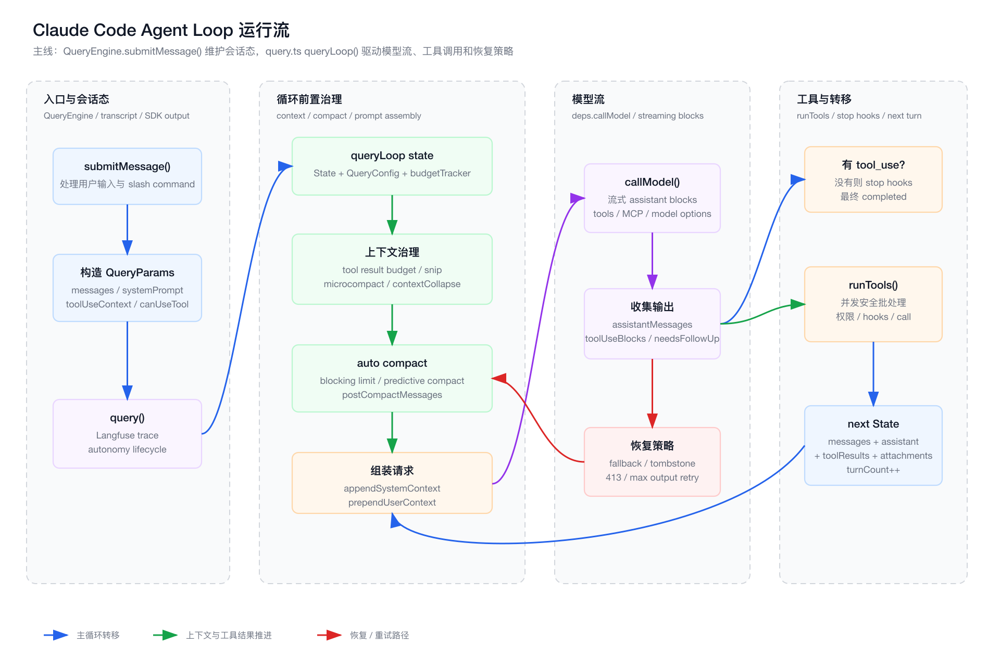
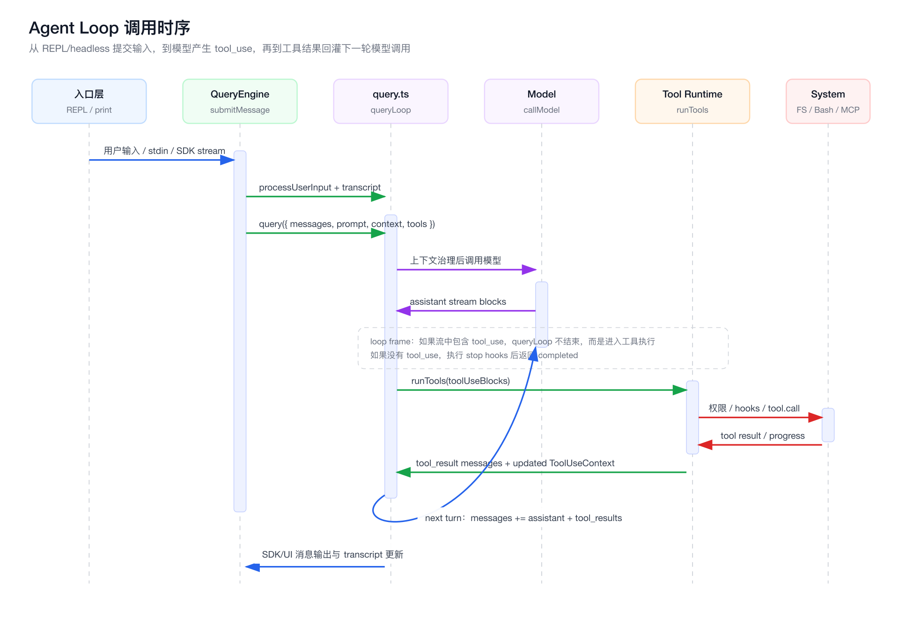

# 第 3 章：Agent Loop 是如何运转的

> 本章继续《从 0 到 1 实现 Claude Code》。
>
> 本章所有路径仍以 `claude-code/` 为源码根。

## 1. 本章目标

第二章讲的是“进程如何启动”。这一章进入 Claude Code 的心脏：Agent Loop。

你会看到一次用户输入如何被 Claude Code 变成一个可多轮执行的任务：

```text
用户输入
  -> 构造 messages / context / tools
  -> 调用模型
  -> 模型输出 assistant message
  -> 如果包含 tool_use，则执行工具
  -> 把 tool_result 写回 messages
  -> 继续调用模型
  -> 直到没有 tool_use 或被 stop/recovery/maxTurns 中断
```

本章重点不是“模型 API 怎么调”，而是讲清楚：

1. Agent Loop 为什么像前端 Event Loop。
2. `QueryEngine` 和 `query.ts` 的边界是什么。
3. Claude Code 如何把模型流、工具流、上下文压缩、权限、恢复策略组合成一个稳定循环。
4. 从 0 实现时，最小 Agent Loop 应该怎么抽象。

## 2. 前端工程师视角：Agent Loop 像 Event Loop

前端工程师可以把 Agent Loop 理解成浏览器事件循环的 AI 版本。

| 前端世界 | Agent 世界 | 解释 |
| --- | --- | --- |
| Event Loop | Agent Loop | 不断接收输入、调度任务、产出结果 |
| Task Queue | message queue / tool queue | 用户输入、工具结果、系统附件都会进入消息流 |
| Browser API | Tool Calling | 模型不能直接操作系统，只能请求工具 |
| Call Stack | queryLoop state | 当前 turn 的执行状态 |
| Microtask | prefetch / summary / hook | 不阻塞主链路的并行工作 |
| DOM update | UI/SDK message yield | 每个流式消息都会被消费端渲染或记录 |
| Error boundary | fallback / compact / recovery | 出错后尽量恢复，而不是直接崩溃 |

关键认知是：

> Agent Loop 不是一次模型调用，而是一个“模型决策 -> 工具执行 -> 上下文回灌 -> 再决策”的运行时循环。

传统 ChatBot 只需要：

```text
prompt -> model -> response
```

Coding Agent 需要：

```text
prompt -> model -> tool_use -> permission -> tool_result -> model -> ...
```

这就是 Claude Code 架构复杂度的来源。

## 3. 本章源码入口

本章主要阅读这些文件：

```text
claude-code/src/QueryEngine.ts
claude-code/src/query.ts
claude-code/src/query/deps.ts
claude-code/src/query/config.ts
claude-code/src/services/tools/toolOrchestration.ts
claude-code/src/services/tools/toolExecution.ts
```

它们之间的关系：

```text
QueryEngine.submitMessage()
  -> processUserInput()
  -> query()
    -> queryLoop()
      -> deps.callModel()
      -> runTools()
        -> runToolUse()
          -> canUseTool()
          -> tool.call()
```

## 4. Agent Loop 总图

下图是本章的主图。源文件在 `./assets/03-agent-loop-runtime-flow.svg`，PNG 导出文件在 `./assets/03-agent-loop-runtime-flow.png`。



这张图可以先记住四个区域：

1. `QueryEngine`：会话态、输入处理、transcript、SDK 输出。
2. `query.ts` 前置治理：上下文预算、压缩、prompt 组装。
3. 模型流：`deps.callModel()` 产出 assistant stream。
4. 工具与转移：`tool_use` 进入工具执行，结果回灌后继续下一轮。

## 5. 调用时序图

下图展示一次包含工具调用的典型 turn。源文件在 `./assets/03-agent-loop-call-chain.svg`，PNG 导出文件在 `./assets/03-agent-loop-call-chain.png`。



这个时序图有一个很重要的事实：

> 模型永远不直接执行工具。模型只产生 `tool_use`；真正执行发生在 Tool Runtime，并经过 schema、hooks、权限和上下文。

这就是 Coding Agent 的安全边界。

## 6. `QueryEngine`：会话控制器，不是模型循环本体

文件：

```text
claude-code/src/QueryEngine.ts
```

`QueryEngine` 的注释已经说得很清楚：

```text
One QueryEngine per conversation.
Each submitMessage() call starts a new turn within the same conversation.
State persists across turns.
```

它负责的是“会话级生命周期”，不是“模型如何循环”。

主要职责包括：

- 保存 `mutableMessages`。
- 保存 read file cache。
- 保存 permission denials。
- 处理用户输入。
- 处理 slash command。
- 构造 system prompt / user context / system context。
- 记录 transcript。
- 把 `query()` yield 出来的内部消息转换成 SDK/UI 可消费消息。
- 维护 structured output、file history、permission report。

可以把它类比成前端里的 store controller：

```text
QueryEngine
  = conversation store
  + input processor
  + transcript writer
  + output adapter
```

真正的 Agent Loop 在：

```text
claude-code/src/query.ts
```

这种拆分很重要。如果没有 `QueryEngine`，`query.ts` 就会被迫同时处理：

- 用户输入解析。
- slash command。
- session 存储。
- SDK 输出格式。
- 模型循环。
- 工具循环。
- 上下文压缩。

那会让核心循环变成不可测试、不可复用的巨型函数。

## 7. `submitMessage()` 的关键步骤

`QueryEngine.submitMessage()` 大致做这些事：

```text
1. 解构配置：tools / commands / mcpClients / canUseTool / model / options
2. 包装 canUseTool，用于记录权限拒绝
3. fetchSystemPromptParts()
4. 构造 systemPrompt
5. 构造 ProcessUserInputContext
6. processUserInput()
7. 把用户消息 push 到 mutableMessages
8. 写 transcript
9. 更新 AppState 里的 permission context
10. 加载 skills/plugins cache
11. yield system init message
12. 如果 shouldQuery=false，返回本地命令结果
13. for await query(...)
14. 记录 assistant/user/compact_boundary 到 transcript
15. 转换为 SDK/UI message 输出
```

这里有一个容易忽略的设计：

```text
用户消息在进入 query loop 之前就会写入 transcript。
```

为什么？

因为如果进程在模型返回前被杀掉，至少还能恢复到“用户消息已经被接受”的状态。否则 resume 时会发现没有有效会话。

这就是工业级 Agent 和 demo 的区别。demo 往往只在最终 response 后保存；真实产品必须考虑“中途被杀”“用户点 Stop”“远程客户端断开”这些场景。

## 8. `query()`：给循环包一层运行时壳

文件：

```text
claude-code/src/query.ts
```

对外入口是：

```ts
export async function* query(params: QueryParams)
```

`query()` 自己不是主要循环，它做的是运行时包裹：

- 创建或复用 Langfuse trace。
- 把 trace 挂到 `toolUseContext`。
- 调用 `queryLoop()`。
- 结束 autonomy command lifecycle。
- 结束 trace。
- flush Langfuse。
- 清理 performance marks。
- 标记 consumed command completed。

这相当于前端里：

```text
withTracing(withLifecycle(queryLoop))
```

所以理解源码时，不要把 `query()` 和 `queryLoop()` 混在一起：

| 函数 | 职责 |
| --- | --- |
| `query()` | 运行时外壳、trace、生命周期收尾 |
| `queryLoop()` | 真正的模型/工具循环 |

## 9. `QueryParams`：Agent Loop 的输入协议

`query()` 接收的参数可以分成几类：

```text
messages
systemPrompt
userContext
systemContext
canUseTool
toolUseContext
fallbackModel
querySource
maxOutputTokensOverride
maxTurns
skipCacheWrite
taskBudget
deps
```

这就是 Agent Loop 的输入协议。

其中最关键的是四个：

### 9.1 `messages`

会话历史，也是模型下一次推理的主输入。

它不是普通聊天记录，里面可能包含：

- user message。
- assistant message。
- tool_use。
- tool_result。
- attachment。
- compact boundary。
- interruption。
- synthetic meta message。

### 9.2 `systemPrompt` / `userContext` / `systemContext`

Claude Code 没有把所有东西都拼成一个大字符串，而是保留了不同上下文来源。

后面调用模型前会组合：

```text
appendSystemContext(systemPrompt, systemContext)
prependUserContext(messagesForQuery, userContext)
```

这比简单字符串拼接更容易治理。

### 9.3 `canUseTool`

工具执行前的权限函数。

模型说“我要执行 Bash”不代表 Bash 会执行。必须经过：

```text
canUseTool(tool, input, toolUseContext, assistantMessage, toolUseId)
```

### 9.4 `toolUseContext`

工具运行时上下文，里面有：

- tools。
- commands。
- mcpClients。
- AppState get/set。
- abortController。
- readFileState。
- permissions。
- agent definitions。
- skill triggers。
- progress hooks。
- Langfuse trace。

这是工具能安全运行的环境。

## 10. `queryLoop` 的状态机

`queryLoop()` 内部维护一个 `State`：

```text
messages
toolUseContext
maxOutputTokensOverride
autoCompactTracking
stopHookActive
maxOutputTokensRecoveryCount
hasAttemptedReactiveCompact
turnCount
pendingToolUseSummary
transition
```

这就是 Agent Loop 的 call stack。

为什么要显式维护 `State`，而不是到处改变量？

因为这个循环有大量 `continue` 分支：

- context collapse drain retry。
- reactive compact retry。
- max output tokens escalate。
- max output tokens recovery。
- stop hook blocking retry。
- token budget continuation。
- next turn。

每个分支都要明确下一轮循环使用什么 messages、toolUseContext、tracking、turnCount。

这很像前端状态机：

```text
currentState + event -> nextState
```

只是这里的 event 不是 click/change，而是：

- 模型返回 tool_use。
- API 返回 413。
- 输出 token 超限。
- hook 阻止继续。
- 工具执行完成。
- 用户中断。

## 11. 循环第一步：上下文治理

每一轮 `while (true)` 不是直接调用模型，而是先处理上下文。

简化链路：

```text
getMessagesAfterCompactBoundary()
  -> applyToolResultBudget()
  -> snipCompactIfNeeded()
  -> microcompact()
  -> contextCollapse.applyCollapsesIfNeeded()
  -> autocompact()
  -> blocking limit / predictive compact
```

为什么 Agent Loop 必须把上下文治理放在模型调用前？

因为 Coding Agent 的上下文增长极快：

- 文件读取结果很大。
- grep/glob 输出很多。
- Bash 可能输出几千行。
- MCP 工具结果不可控。
- 多轮工具调用会产生大量 tool_result。
- 用户可能连续追问。

如果每轮只是把历史全部塞给模型，很快就会超上下文窗口。

Claude Code 在这里做了几层治理：

| 机制 | 目的 |
| --- | --- |
| tool result budget | 控制工具结果占用 |
| snip | 剪掉历史中可移除片段 |
| microcompact | 小范围压缩工具结果或缓存片段 |
| context collapse | 把部分历史投影成折叠视图 |
| autocompact | 生成摘要，替换大段历史 |
| predictive compact | 预测下一轮增长，提前压缩 |

这就是为什么第一章说：

> Context Engineering 比 Prompt Engineering 更重要。

Prompt 决定模型怎么想；Context Engineering 决定模型能看到什么、还能不能继续想。

## 12. 循环第二步：组装模型请求

上下文治理后，才组装模型请求：

```text
fullSystemPrompt = appendSystemContext(systemPrompt, systemContext)

deps.callModel({
  messages: prependUserContext(messagesForQuery, userContext),
  systemPrompt: fullSystemPrompt,
  thinkingConfig,
  tools,
  signal,
  options: {
    model,
    mcpTools,
    hasPendingMcpServers,
    agents,
    taskBudget,
    fallbackModel,
    queryTracking,
    langfuseTrace,
    ...
  }
})
```

这里有几个设计点：

### 12.1 `deps.callModel` 是依赖注入

真实实现来自：

```text
claude-code/src/query/deps.ts
```

生产环境：

```text
callModel = queryModelWithStreaming
microcompact = microcompactMessages
autocompact = autoCompactIfNeeded
uuid = randomUUID
```

为什么这样设计？

为了让 `query.ts` 可测试。测试可以传入 fake model、fake compact，不必 mock 一堆模块全局函数。

### 12.2 工具 schema 在模型请求里

`tools: toolUseContext.options.tools` 会作为模型可见工具。

这一步决定模型“知道自己能调用什么”。

但注意：模型可见不代表一定能执行。真正执行仍然要过权限。

### 12.3 AppState 动态参与请求

模型请求里会读：

- tool permission context。
- fastMode。
- mcp tools。
- pending MCP servers。
- effort。
- advisor model。

也就是说，模型调用不是纯函数：

```text
messages + prompt -> response
```

而是：

```text
messages + prompt + runtime state + tools + policy + MCP status -> response
```

这就是 Agent Runtime 的复杂性。

## 13. 循环第三步：消费模型流

`queryLoop()` 使用：

```ts
for await (const message of deps.callModel(...)) {
  ...
}
```

模型流中可能出现：

- assistant text。
- thinking block。
- tool_use block。
- API error message。
- usage delta。
- fallback signal。

Claude Code 会维护几个数组：

```text
assistantMessages
toolResults
toolUseBlocks
needsFollowUp
```

只要 assistant message 里出现 `tool_use`，就会：

```text
toolUseBlocks.push(...)
needsFollowUp = true
```

这个 `needsFollowUp` 是循环分叉点：

```text
needsFollowUp = false
  -> 没有工具调用，准备结束或 stop hook/recovery

needsFollowUp = true
  -> 执行工具，把结果回灌，再进入下一轮
```

这就是 Agent Loop 的最小内核。

## 14. 为什么 stop_reason 不可靠

源码里有一条重要注释：

```text
stop_reason === 'tool_use' is unreliable
```

所以 Claude Code 不依赖 API 的 stop_reason 判断是否要执行工具，而是直接扫描 assistant content 中的 `tool_use` block。

这是一条很实际的工程经验：

> 不要完全信任模型 API 的高级语义字段，关键控制流应该从可验证的数据结构中推导。

如果 assistant message 里确实有 `tool_use`，就执行工具；没有就不执行。这比依赖 stop_reason 更稳。

## 15. Streaming Tool Execution

Claude Code 支持 streaming tool executor：

```text
new StreamingToolExecutor(tools, canUseTool, toolUseContext)
```

当模型流式输出中出现 tool_use block 时，可以把工具加入 executor。

好处是：

- 不必等完整 assistant message 结束才开始工具准备。
- 长流式响应中可以提前调度工具。
- 工具结果也可以边完成边 yield。

但这会带来复杂性：

- fallback 时要丢弃旧 executor，避免旧 tool_use_id 的结果泄漏。
- abort 时要补 synthetic tool_result，避免 tool_use 没有匹配结果。
- tombstone 要移除已经流出的孤儿 assistant message。

这类设计说明 Agent Loop 在生产环境里不是简单 while 循环，而是一个要处理并发、流式、回滚、补偿的执行系统。

## 16. Fallback：模型切换不是简单 retry

如果 `deps.callModel()` 抛出 `FallbackTriggeredError`，并且配置了 fallback model，Claude Code 会：

1. 切换 `currentModel`。
2. 清理已收集的 assistant messages。
3. 为已经出现的 tool_use 补 error tool_result。
4. 丢弃 streaming tool executor。
5. 更新 `toolUseContext.options.mainLoopModel`。
6. 必要时剥离 thinking signature blocks。
7. yield warning system message。
8. 重新调用模型。

为什么这么复杂？

因为 fallback 发生时，第一轮模型可能已经流出了一部分 assistant message，甚至已经出现 tool_use。

如果直接 retry，会出现几个危险问题：

- UI 上存在孤儿 assistant message。
- transcript 里有 tool_use 但没有 tool_result。
- 新模型看到旧模型的 thinking signature，可能报错。
- 旧 executor 还在产出旧 tool_use_id 的结果。

所以 fallback 不是“再调一次 API”，而是一次小型事务回滚。

## 17. 没有工具调用时：结束也要经过检查

如果 `needsFollowUp` 是 false，Claude Code 也不会立刻结束。

它还要处理：

- prompt too long recovery。
- media size recovery。
- max output tokens recovery。
- API error。
- stop hooks。
- token budget continuation。

这说明“没有工具调用”只是表示模型暂时不需要外部动作，不代表 turn 可以立即完成。

典型分支：

```text
没有 tool_use
  -> 如果是 withheld 413，尝试 context collapse drain
  -> 如果还不行，尝试 reactive compact
  -> 如果 max_output_tokens，尝试提升输出上限或注入续写消息
  -> 如果 API error，结束为 model_error
  -> 执行 stop hooks
  -> 如果 stop hook blocking，注入错误消息并重试
  -> 如果 token budget 要求继续，注入 nudge message 并重试
  -> completed
```

这就是为什么 `queryLoop()` 看起来很长。真正的生产 Agent 需要处理大量“模型不按理想路径返回”的情况。

## 18. 有工具调用时：进入 Tool Runtime

如果 `needsFollowUp` 是 true，会进入：

```text
runTools(toolUseBlocks, assistantMessages, canUseTool, toolUseContext)
```

文件：

```text
claude-code/src/services/tools/toolOrchestration.ts
```

它不是简单 `Promise.all(toolCalls)`。

它会先分批：

```text
partitionToolCalls()
```

规则是：

- 并发安全的工具可以合并批量并行。
- 非并发安全工具单独串行。

为什么？

因为工具不是纯函数。

例如：

- 多个 read-only 工具并发通常安全。
- 文件编辑工具并发可能相互覆盖。
- Bash 命令可能依赖执行顺序。
- 工具可能修改 `ToolUseContext`。

所以 Claude Code 用工具自己的 `isConcurrencySafe()` 来决定调度方式。

这是非常重要的抽象：

> 并发策略应该由工具能力声明驱动，而不是由 Agent Loop 猜。

## 19. 单个工具如何执行

单个工具执行在：

```text
claude-code/src/services/tools/toolExecution.ts
```

入口是：

```text
runToolUse()
```

执行链路大致是：

```text
findToolByName()
  -> fallback alias lookup
  -> inputSchema.safeParse()
  -> tool.validateInput()
  -> speculative Bash classifier
  -> runPreToolUseHooks()
  -> canUseTool()
  -> tool.call()
  -> runPostToolUseHooks()
  -> map result to tool_result message
```

这条链路再次证明：

```text
tool_use 只是模型的请求，不是执行事实。
```

真正执行前还有很多关口：

| 阶段 | 作用 |
| --- | --- |
| find tool | 工具必须存在 |
| Zod schema | 输入结构必须合法 |
| validateInput | 工具自定义语义校验 |
| pre hook | 外部 hook 可观察/修改/阻止 |
| canUseTool | 权限系统最终裁决 |
| tool.call | 真正执行 |
| post hook | 执行后观察和附加结果 |
| result mapping | 转成模型可读 tool_result |

如果任何阶段失败，都会生成 `tool_result` error，让模型在下一轮看到失败原因。

这比直接 throw 更适合 Agent：

```text
工具失败也是上下文，模型需要读到它，才能决定下一步。
```

## 20. 工具结果如何回到模型

工具执行产生的结果会被转换成 user message 里的 `tool_result` block。

然后 `queryLoop()` 组装下一轮 state：

```text
messages = messagesForQuery
  + assistantMessages
  + toolResults

turnCount += 1
transition = { reason: 'next_turn' }
```

下一轮模型调用时，模型看到的是：

```text
上一轮 assistant: 我调用工具 X
用户侧 tool_result: 工具 X 返回了结果
```

然后模型继续推理。

这就是 Tool Calling 的协议闭环：

```text
assistant tool_use
  -> user tool_result
  -> assistant next response
```

注意 tool_result 被建模成 user-side message，这是多数 LLM tool calling 协议的核心结构。

## 21. 附件与中途消息

工具执行后，Claude Code 还会注入一些附件消息：

- queued command attachments。
- memory attachments。
- skill discovery attachments。
- search extra tools attachments。
- file change attachments。
- max turns reached attachment。

这些附件不是用户直接输入，也不是模型直接输出，而是 Runtime 在 turn 边界插入的上下文。

这说明 Agent Loop 的 messages 来源至少有四类：

```text
用户输入
模型输出
工具结果
Runtime 附件
```

前端类比：

```text
用户输入事件
网络响应事件
浏览器 API 回调
框架内部事件
```

一个成熟 Agent Runtime 必须能把这些来源合并成稳定的消息流。

## 22. 中断处理：必须补齐 tool_result

用户可能在两个阶段中断：

```text
模型流式输出中断
工具执行中断
```

Claude Code 分别返回：

```text
aborted_streaming
aborted_tools
```

关键点是：如果中断发生时 assistant message 已经包含 `tool_use`，必须补 synthetic `tool_result`。

否则下一轮模型会看到不完整协议：

```text
assistant tool_use(id=abc)
但是没有 user tool_result(tool_use_id=abc)
```

很多模型 API 会直接拒绝这种历史，或者产生不可预测行为。

所以源码里有 `yieldMissingToolResultBlocks()`，专门为这种场景补 error result。

这是一条非常重要的工程原则：

> Agent Loop 可以被中断，但消息协议不能破坏。

## 23. Stop Hooks：模型完成后也可能被要求重试

当模型没有工具调用，Claude Code 会执行：

```text
handleStopHooks(...)
```

stop hook 可以：

- 阻止继续。
- 返回 blocking errors。
- 要求注入错误消息后重新进入 loop。

这类似前端表单提交后的校验：

```text
模型认为自己完成了
  -> Runtime 做完成态校验
  -> 如果不满足要求，把反馈写回 messages
  -> 让模型继续修正
```

这是一种很强的 Agent 工程模式：

> 不要只依赖模型自觉完成任务，用 Runtime hook 把完成标准编码进循环。

## 24. Token Budget：主动续跑

如果启用了 token budget，循环会检查当前 turn 的输出预算。

当判断应该继续时，会注入一个 meta user message：

```text
decision.nudgeMessage
```

然后继续下一轮。

这和 max output tokens recovery 类似，都是通过“给模型写入一条内部用户消息”来推动它继续。

这背后的设计思想是：

```text
Agent Loop 的控制信号也可以被建模成 messages。
```

只要消息协议稳定，模型就能把这些控制信号当作上下文继续执行。

## 25. 为什么 `while (true)` 合理

很多人看到 `queryLoop()` 的 `while (true)` 会本能觉得危险。

但 Agent Loop 天然就是一个循环。关键不是有没有 `while (true)`，而是有没有明确退出条件。

Claude Code 的退出条件包括：

- completed。
- blocking_limit。
- model_error。
- prompt_too_long。
- image_error。
- aborted_streaming。
- aborted_tools。
- stop_hook_prevented。
- hook_stopped。
- max_turns。

同时它有多种防无限循环机制：

- `maxTurns`。
- max output tokens recovery limit。
- reactive compact single-shot guard。
- autocompact consecutive failure circuit breaker。
- stopHookActive 状态。
- token budget diminishing returns。

所以问题不是“能不能写无限循环”，而是：

> 每个 continue 是否都有状态变化，每个恢复分支是否有上限。

这是写 Agent Runtime 时必须守住的底线。

## 26. `query/config.ts`：把可变配置拍成快照

`query/config.ts` 里有 `buildQueryConfig()`。

它会在 query entry 时快照：

- session id。
- streaming tool execution gate。
- emit tool use summaries gate。
- isAnt。
- fastMode enabled。

为什么要拍快照？

因为一次 query 过程中，不希望某些运行时配置在中途突然变化，导致同一个 turn 前后逻辑不一致。

这类似 React render 里读取 props：

```text
一次 render 使用同一份 props snapshot。
下一次 render 再读新的 props。
```

Agent Loop 也是一样：

```text
一次 query 使用同一份 QueryConfig。
下一次 query 再读新的 runtime gates。
```

## 27. 从 0 实现：最小 QueryEngine

如果自己实现，第一版可以这样拆：

```text
QueryEngine
  - messages
  - submitMessage(input)
  - recordTranscript()
  - call queryLoop()
```

伪代码：

```ts
class QueryEngine {
  private messages: Message[] = []

  async *submitMessage(input: string) {
    const userMessage = createUserMessage(input)
    this.messages.push(userMessage)
    await recordTranscript(this.messages)

    for await (const event of queryLoop({
      messages: this.messages,
      tools: this.tools,
      canUseTool: this.canUseTool,
      systemPrompt: this.systemPrompt,
    })) {
      if (isPersistentMessage(event)) {
        this.messages.push(event)
        await recordTranscript(this.messages)
      }
      yield toClientEvent(event)
    }
  }
}
```

这一步先不要加：

- compact。
- fallback。
- streaming tool execution。
- MCP。
- stop hooks。

先把消息协议闭环跑通。

## 28. 从 0 实现：最小 queryLoop

最小版本：

```ts
async function* queryLoop(params: QueryParams) {
  let messages = params.messages
  let turn = 1

  while (true) {
    const assistantMessages = []
    const toolUseBlocks = []

    for await (const msg of callModel({
      messages,
      systemPrompt: params.systemPrompt,
      tools: params.tools,
    })) {
      yield msg
      if (msg.type === 'assistant') {
        assistantMessages.push(msg)
        toolUseBlocks.push(...extractToolUseBlocks(msg))
      }
    }

    if (toolUseBlocks.length === 0) {
      return { reason: 'completed' }
    }

    const toolResults = []
    for await (const result of runTools(toolUseBlocks, params.canUseTool)) {
      yield result
      toolResults.push(result)
    }

    messages = [...messages, ...assistantMessages, ...toolResults]
    turn += 1

    if (params.maxTurns && turn > params.maxTurns) {
      return { reason: 'max_turns' }
    }
  }
}
```

第二版再补：

- input schema validation。
- permission ask/deny。
- abort。
- prompt too long。
- max output tokens recovery。
- compact。
- tool concurrency。
- stop hooks。
- transcript。

## 29. 实现 Agent Loop 的三个铁律

### 29.1 消息协议必须完整

每个 `tool_use` 必须有对应 `tool_result`。

中断、fallback、工具失败时也要补 error result。

### 29.2 工具执行必须受控

模型只发请求，Runtime 决定能不能执行。

至少需要：

- schema 校验。
- 权限。
- abort。
- 错误映射。

### 29.3 每个 retry 都必须有上限

Agent Loop 很容易因为“恢复策略”变成无限循环。

所以必须给这些分支加上限：

- compact retry。
- max output retry。
- stop hook retry。
- token budget continuation。
- tool failure retry。

## 30. 本章源码阅读路线

建议按这个顺序读：

1. `src/QueryEngine.ts`
   - 看类注释。
   - 看 `submitMessage()` 如何处理输入、transcript、system init。

2. `src/query.ts`
   - 先看 `QueryParams`。
   - 再看 `State`。
   - 再看 `query()` 包裹逻辑。
   - 最后看 `queryLoop()`。

3. `src/query/deps.ts`
   - 理解 `callModel/microcompact/autocompact/uuid` 依赖注入。

4. `src/query/config.ts`
   - 理解 query-level config snapshot。

5. `src/services/tools/toolOrchestration.ts`
   - 看工具并发分批。

6. `src/services/tools/toolExecution.ts`
   - 看单个工具如何校验、过 hook、过权限、执行、映射结果。

读源码时不要一开始陷入所有 feature gate。先抓住主线：

```text
message -> model -> tool_use -> tool_result -> next message
```

其它复杂度都是围绕这条主线做生产级增强。

## 31. 本章结论

Claude Code 的 Agent Loop 不是一段“调用大模型的代码”，而是一个小型运行时内核。

它有自己的：

- 输入协议。
- 状态机。
- 消息队列。
- 工具调度器。
- 权限边界。
- 上下文治理。
- 错误恢复。
- 中断语义。
- transcript 持久化。

如果说 CLI Bootstrap 决定 Agent Runtime 如何启动，那么 Agent Loop 决定它是否真的能完成复杂任务。

下一章建议进入：

```text
第 4 章：Tool Runtime 与权限系统
  - Tool 抽象为什么是 Claude Code 的能力边界
  - 内置工具和 MCP 工具如何统一
  - runTools 如何调度并发与串行
  - canUseTool 如何把模型意图变成受控执行
  - 从 0 实现一个安全工具系统
```
