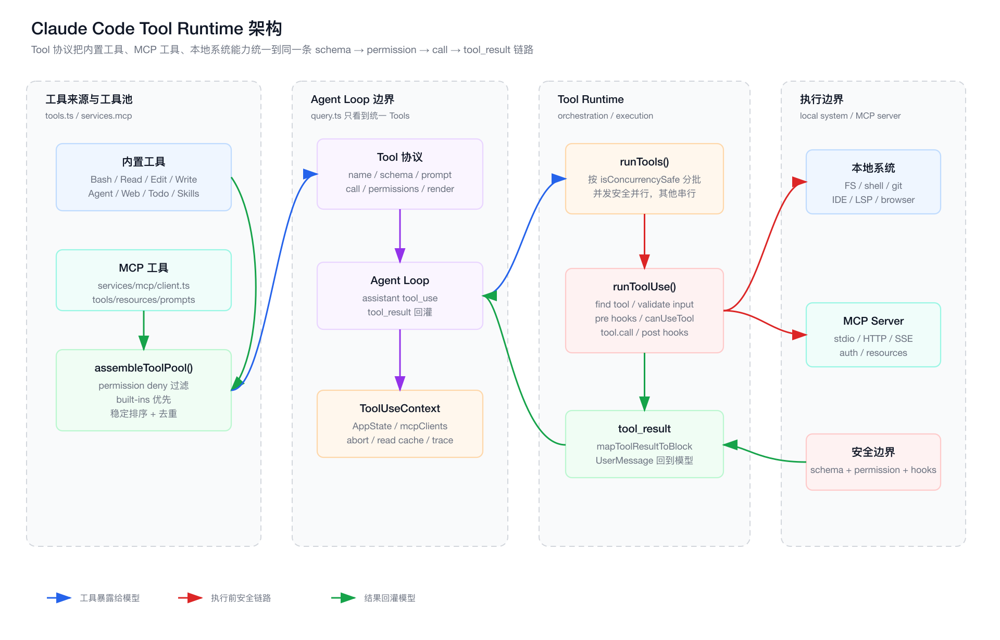
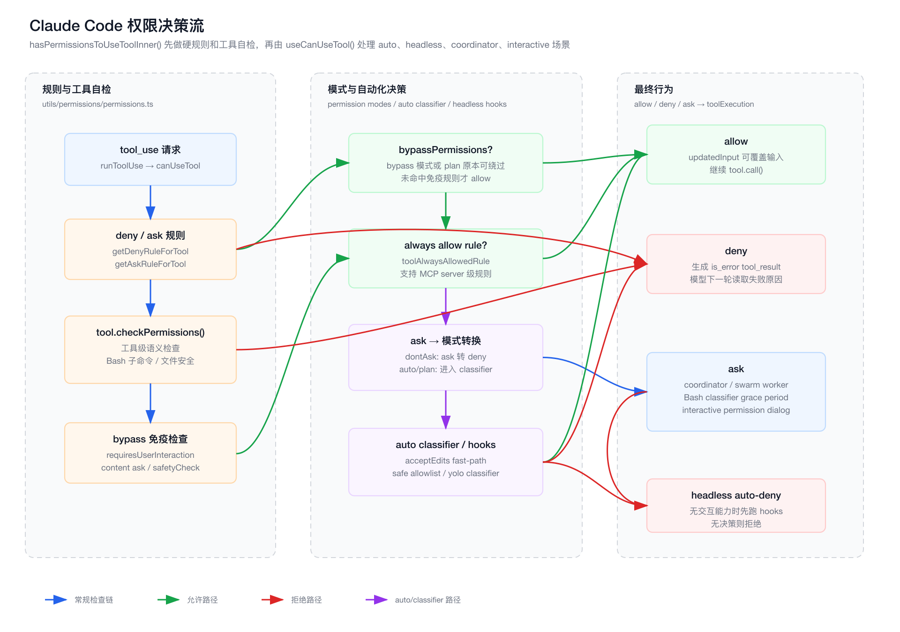

# 第 4 章：Tool Runtime 与权限系统

> 本章继续《从 0 到 1 实现 Claude Code》。
>
> 本章所有路径仍以 `claude-code/` 为源码根。

## 1. 本章目标

第三章讲了 Agent Loop：模型如何产生 `tool_use`，工具结果如何回灌成 `tool_result`。这一章进入 Claude Code 真正触达外部世界的边界：Tool Runtime 与权限系统。

本章要回答五个问题：

1. 为什么 Tool 是 Claude Code 的核心能力边界。
2. 内置工具和 MCP 工具如何统一进同一个工具池。
3. `runTools()` 为什么要区分并发安全和串行执行。
4. 单个工具执行前为什么要经过 schema、hooks、permission、classifier。
5. 从 0 实现一个安全 Tool Runtime，最小抽象应该是什么。

如果 Agent Loop 是“思考循环”，Tool Runtime 就是“行动系统”。没有工具，Coding Agent 只是聊天机器人；有了工具但没有权限系统，它就是一个危险的自动脚本执行器。

## 2. 前端工程师视角：Tool Calling 像浏览器 API

前端工程师可以这样类比：

| 前端世界 | Claude Code | 解释 |
| --- | --- | --- |
| Browser API | Tool | JS 不能直接控制硬件，只能调用浏览器暴露的 API |
| DOM API 权限 | Tool Permission | 不是所有能力都默认开放 |
| Web Extension API | MCP Tool | 外部插件通过协议扩展能力 |
| TypeScript 类型 | Zod inputSchema | 先约束输入结构，再执行能力 |
| Event handler | tool.call | 真正执行副作用 |
| Error boundary | tool_result error | 工具失败也要转成模型可理解的消息 |
| CSP / sandbox | permission + sandbox | 限制危险行为 |

最核心的认知是：

> 模型不是 Runtime。模型只负责提出意图，Tool Runtime 负责把意图变成受控行动。

## 3. 本章源码入口

本章主要阅读这些文件：

```text
claude-code/src/Tool.ts
claude-code/src/tools.ts
claude-code/src/services/tools/toolOrchestration.ts
claude-code/src/services/tools/toolExecution.ts
claude-code/src/services/tools/StreamingToolExecutor.ts
claude-code/src/hooks/useCanUseTool.tsx
claude-code/src/utils/permissions/permissions.ts
claude-code/src/types/permissions.ts
```

调用主线：

```text
query.ts
  -> runTools()
    -> partitionToolCalls()
    -> runToolUse()
      -> inputSchema.safeParse()
      -> validateInput()
      -> runPreToolUseHooks()
      -> canUseTool()
        -> hasPermissionsToUseTool()
        -> interactive / auto / headless decision
      -> tool.call()
      -> mapToolResultToToolResultBlockParam()
      -> runPostToolUseHooks()
      -> createUserMessage(tool_result)
```

## 4. Tool Runtime 架构图

下图展示 Tool Runtime 的整体架构。源文件在 `./assets/04-tool-runtime-architecture.svg`，PNG 导出文件在 `./assets/04-tool-runtime-architecture.png`。



这张图里有三条关键线：

1. 工具来源线：内置工具 + MCP 工具进入 `assembleToolPool()`。
2. 执行控制线：Agent Loop 只看到统一 Tool 协议，实际执行交给 Tool Runtime。
3. 安全边界线：任何本地系统/MCP 副作用都必须经过 schema、hooks、permission。

## 5. 权限决策流图

下图展示一次工具执行前的权限链路。源文件在 `./assets/04-permission-decision-flow.svg`，PNG 导出文件在 `./assets/04-permission-decision-flow.png`。



这张图的重点是：

> 权限不是一个 if 判断，而是一条分层决策流水线。

它包含：

- deny/ask/allow 规则。
- 工具自己的 `checkPermissions()`。
- bypass 免疫检查。
- permission mode。
- auto classifier。
- headless hook。
- coordinator/swarm/interactive dialog。

## 6. `Tool.ts`：统一能力协议

文件：

```text
claude-code/src/Tool.ts
```

`Tool` 是 Claude Code 最关键的抽象之一。简化后可以理解成：

```ts
type Tool = {
  name: string
  inputSchema: ZodSchema
  prompt(): Promise<string>
  description(input, options): Promise<string>
  validateInput?(input, context): Promise<ValidationResult>
  checkPermissions(input, context): Promise<PermissionResult>
  call(input, context, canUseTool, parentMessage, onProgress?): Promise<ToolResult>
  mapToolResultToToolResultBlockParam(output, toolUseID): ToolResultBlockParam
  isEnabled(): boolean
  isReadOnly(input): boolean
  isConcurrencySafe(input): boolean
}
```

真实类型还包含很多生产级能力：

- `aliases`：工具重命名后的兼容。
- `searchHint`：给 SearchExtraTools 做工具发现。
- `inputJSONSchema`：MCP 工具可以直接提供 JSON Schema。
- `isDestructive`：标记不可逆操作。
- `interruptBehavior`：用户新输入时取消还是阻塞。
- `isSearchOrReadCommand`：UI 折叠展示。
- `isOpenWorld`：表示工具会接触开放世界。
- `requiresUserInteraction`：即使绕过权限也必须交互。
- `isMcp` / `mcpInfo`：标识 MCP 工具来源。
- `shouldDefer` / `alwaysLoad`：延迟加载工具 schema。
- `maxResultSizeChars`：大结果持久化与裁剪。
- `backfillObservableInput`：给观察者补 legacy/derived 字段，但不污染模型原始输入。
- `renderToolResultMessage`：UI 层展示。
- `extractSearchText`：transcript 搜索索引。

这说明 Claude Code 的 Tool 不是普通函数，而是一个完整的能力对象：

```text
模型可见描述
  + 输入协议
  + 权限协议
  + 执行协议
  + UI 展示协议
  + 结果回灌协议
  + 观测与搜索协议
```

如果从 0 实现，不要把工具写成：

```ts
const tools = {
  readFile(path) {},
  bash(cmd) {},
}
```

这种结构很快会撑不住权限、MCP、UI、schema、并发、结果映射。

## 7. `ToolUseContext`：工具运行时的上下文背包

`ToolUseContext` 也定义在 `Tool.ts`。

它是工具执行时能访问的运行时环境，里面包括：

- commands。
- mainLoopModel。
- tools。
- mcpClients。
- mcpResources。
- agentDefinitions。
- abortController。
- readFileState。
- AppState get/set。
- handleElicitation。
- setToolJSX。
- notifications。
- nested memory state。
- skill discovery state。
- in-progress tool ids。
- file history updater。
- attribution updater。
- queryTracking。
- Langfuse trace。
- contentReplacementState。
- renderedSystemPrompt。

这就是为什么工具不能只是纯函数。

例如 Bash 工具需要知道：

- 当前 permission mode。
- 是否被 abort。
- 是否有 sandbox。
- 结果如何上报进度。
- 是否处于 subagent。
- 是否要记录 trace。

文件工具需要知道：

- read file cache。
- file history。
- attribution。
- additional working directories。

MCP 工具需要知道：

- MCP clients。
- elicitation handler。
- auth 状态。
- mcpMeta 如何回传给 SDK。

所以 `ToolUseContext` 可以类比前端里的 dependency injection container：

```text
工具本身描述能力
ToolUseContext 提供运行环境
```

## 8. `ToolResult`：工具返回的不只是 data

`ToolResult` 结构大致是：

```ts
type ToolResult<T> = {
  data: T
  newMessages?: Message[]
  contextModifier?: (context: ToolUseContext) => ToolUseContext
  mcpMeta?: {
    _meta?: Record<string, unknown>
    structuredContent?: Record<string, unknown>
  }
}
```

这里有三个重要设计：

### 8.1 `data`

工具真正产出的业务结果，后续会被 `mapToolResultToToolResultBlockParam()` 转成模型能读的 `tool_result`。

### 8.2 `newMessages`

工具可以额外注入消息。例如某些工具执行后，需要把系统提示、附件、补充上下文加入消息流。

### 8.3 `contextModifier`

非并发安全工具可以修改后续工具执行上下文。

这就是为什么 `runTools()` 对并发很谨慎。并发执行时如果每个工具都能修改上下文，就必须决定修改顺序；Claude Code 只在安全位置应用这些 modifier。

### 8.4 `mcpMeta`

MCP 工具可能带结构化内容和 `_meta`，这些要透传给 SDK 消费端，但不能污染普通工具协议。

## 9. `tools.ts`：工具池不是静态数组

文件：

```text
claude-code/src/tools.ts
```

工具池来源包括：

- `getAllBaseTools()`：内置工具全集。
- feature gate：按编译/运行特性加入工具。
- env gate：比如 LSP、PowerShell、simple mode。
- REPL mode：隐藏 primitive tools，改由 REPL wrapper 暴露。
- permission deny rule：被 blanket deny 的工具不会暴露给模型。
- MCP tools：从 MCP server 加载后合并。

重点函数：

```text
getAllBaseTools()
getTools(permissionContext)
assembleToolPool(permissionContext, mcpTools)
filterToolsByDenyRules()
```

### 9.1 `getAllBaseTools()`

这是内置工具全集，包含文件、Bash、Agent、Web、Todo、Skills、MCP resource、worktree、cron、monitor 等能力。

它是“当前构建和运行环境下可能存在的能力全集”。

### 9.2 `getTools(permissionContext)`

这是“当前会话可暴露给模型的内置工具”。

它会处理：

- `CLAUDE_CODE_SIMPLE`。
- coordinator mode。
- deny rules。
- REPL mode。
- `isEnabled()`。

也就是说：

```text
工具全集 != 当前会话工具池
```

### 9.3 `assembleToolPool()`

这个函数把内置工具和 MCP 工具合并：

```text
builtInTools = getTools(permissionContext)
allowedMcpTools = filterToolsByDenyRules(mcpTools, permissionContext)
sort built-ins
sort MCP tools
concat
uniqBy(name)
```

为什么 built-ins 要作为连续前缀？

源码注释解释了原因：prompt cache 稳定性。

如果把 MCP 工具和内置工具混排，只要 MCP 工具名排序插入中间，就可能改变后续工具 schema 的顺序，破坏 prompt cache key。

所以工具排序不是审美问题，而是推理成本和延迟问题。

## 10. 为什么 deny rule 要在工具池阶段过滤

`filterToolsByDenyRules()` 会在工具暴露给模型前过滤 blanket deny 工具。

这很关键：

```text
被完整禁止的工具，不应该让模型看到。
```

如果模型看到了工具，但执行时才被拒绝，会出现两类问题：

1. 模型浪费回合不断尝试不可用工具。
2. 用户以为工具不可用，但模型 prompt 里仍然暗示可用。

所以 deny rule 有两层作用：

- 工具池阶段：从模型可见能力中移除。
- 执行阶段：兜底拒绝。

这是安全系统常见的双层防御。

## 11. `runTools()`：工具调度器

文件：

```text
claude-code/src/services/tools/toolOrchestration.ts
```

入口：

```text
runTools(toolUseBlocks, assistantMessages, canUseTool, toolUseContext)
```

它做的事情不是直接循环执行工具，而是：

1. 创建工具批次 trace。
2. 调用 `partitionToolCalls()` 分批。
3. 并发安全批次用 `runToolsConcurrently()`。
4. 非并发安全批次用 `runToolsSerially()`。
5. 收集 `contextModifier`。
6. yield 每个工具产生的 message。
7. 更新 in-progress tool ids。

### 11.1 为什么要分并发和串行

有些工具天然可并发：

- Glob。
- Grep。
- Read。
- WebFetch。
- 部分只读 MCP 工具。

有些工具必须串行：

- Edit。
- Write。
- Bash。
- 修改 AppState 的工具。
- 会影响后续上下文的工具。

如果两个 Edit 并发改同一个文件，结果可能互相覆盖。如果 Bash 命令有依赖顺序，乱并发会破坏任务。

所以并发策略由工具声明：

```text
tool.isConcurrencySafe(input)
```

这比 Agent Loop 自己猜要可靠。

### 11.2 为什么 contextModifier 只对非并发安全工具直接生效

`ToolResult.contextModifier` 可以修改 `ToolUseContext`。

串行执行时，修改立即影响下一个工具。

并发执行时，多个工具同时返回 modifier，如果立即应用，会出现顺序不确定。因此 Claude Code 先排队，等并发批次完成后按 tool block 顺序应用。

这是一个典型的并发一致性设计。

## 12. `StreamingToolExecutor`：边流式输出边启动工具

文件：

```text
claude-code/src/services/tools/StreamingToolExecutor.ts
```

普通路径是模型完整响应结束后再执行工具。StreamingToolExecutor 则可以在模型流式输出中发现 `tool_use` 后提前排队。

它维护：

- tracked tools。
- status：queued / executing / completed / yielded。
- concurrency safe 标记。
- pending progress。
- context modifiers。
- sibling abort controller。
- discarded 标记。

它要解决几个问题：

### 12.1 并发控制

```text
如果当前没有执行中工具，可以启动。
如果当前都是并发安全工具，新工具也并发安全，可以一起执行。
如果新工具不并发安全，等待。
```

### 12.2 fallback 丢弃

模型 streaming fallback 时，已经排队或运行的工具结果不能再进入新的模型尝试。

所以 executor 有：

```text
discard()
```

它会 abort 子工具、清空引用、结束 span。

### 12.3 synthetic error

如果 sibling tool 失败、用户中断、streaming fallback，需要为未完成的 tool_use 生成 synthetic error tool_result。

这保持了工具协议完整：

```text
每个 tool_use 都有 tool_result
```

## 13. `runToolUse()`：单个工具的执行总线

文件：

```text
claude-code/src/services/tools/toolExecution.ts
```

入口：

```text
runToolUse(toolUse, assistantMessage, canUseTool, toolUseContext)
```

这个函数的第一段做工具查找：

```text
findToolByName(toolUseContext.options.tools, toolUse.name)
```

如果找不到，会尝试 deprecated alias fallback。再找不到，就生成错误 `tool_result`。

这说明模型调用工具失败时，不是 runtime crash，而是把失败返回给模型：

```text
<tool_use_error>Error: No such tool available</tool_use_error>
```

为什么这样做？

因为模型需要知道“这条路走不通”，才能改用其它方式。

## 14. 输入校验：模型输出不可信

工具执行前第一道硬门槛是：

```text
tool.inputSchema.safeParse(input)
```

如果失败，返回：

```text
InputValidationError
```

注意源码注释里有一句很现实的话：

```text
the model is not great at generating valid input
```

这就是为什么工具必须有 schema。

模型经常会：

- 少传字段。
- 字段类型错误。
- snake_case/camelCase 搞错。
- 给 deferred tool 传旧 schema。
- 对 MCP 工具产生幻觉参数。

没有 schema，错误会直接进入文件系统、shell、网络请求。schema 是工具执行的第一道安全边界。

## 15. `validateInput()`：结构合法不代表语义合法

schema 只验证结构。例如：

```text
{ file_path: string, content: string }
```

但它不知道：

- 路径是否允许访问。
- 文件是否在工作区。
- Bash 命令是否危险。
- notebook 是否存在。
- MCP 参数是否符合业务规则。

所以 Tool 还有：

```text
validateInput(input, toolUseContext)
```

这个阶段用于工具自己的语义校验。

从 0 实现时要区分：

```text
inputSchema: 结构校验
validateInput: 语义校验
checkPermissions: 权限裁决
```

不要混成一个函数。

## 16. PreToolUse Hooks：权限前的外部拦截点

`toolExecution.ts` 在权限前会执行：

```text
runPreToolUseHooks()
```

hook 可以：

- 产出 progress。
- 产出 attachment。
- 返回 hookPermissionResult。
- 修改 input。
- preventContinuation。
- stop。
- 添加 additional context。

这说明 Claude Code 允许外部系统在工具执行前参与决策。

典型场景：

- 企业策略检查。
- 审计记录。
- 自动修正输入。
- 阻止敏感操作。
- 给模型额外上下文。

PreToolUse hook 在权限前执行，是因为它可能产生权限决策或修改即将被权限系统检查的 input。

## 17. `canUseTool()`：权限系统入口

`canUseTool` 类型来自：

```text
claude-code/src/hooks/useCanUseTool.tsx
```

简化签名：

```ts
type CanUseToolFn = (
  tool,
  input,
  toolUseContext,
  assistantMessage,
  toolUseID,
  forceDecision?
) => Promise<PermissionDecision>
```

在 interactive REPL 中，`useCanUseTool()` 是一个 React hook。它会：

1. 创建 permission context。
2. 调用 `hasPermissionsToUseTool()`。
3. 如果 allow，直接 resolve。
4. 如果 deny，记录并返回拒绝。
5. 如果 ask，尝试 coordinator/swarm/classifier/interactive dialog。
6. 最后清理 classifier checking 状态。

这说明权限系统不是纯后端逻辑，也不是纯 UI 逻辑，而是两者结合：

```text
规则决策在 permissions.ts
交互确认在 useCanUseTool / permission handlers
```

## 18. PermissionDecision：三态模型

权限结果核心是三态：

```text
allow
deny
ask
```

对应类型在：

```text
claude-code/src/types/permissions.ts
```

### 18.1 allow

允许执行，可以携带：

- `updatedInput`。
- `userModified`。
- `decisionReason`。
- `acceptFeedback`。
- `contentBlocks`。

这意味着用户批准时可以改输入，工具最终执行的是更新后的 input。

### 18.2 deny

拒绝执行，会携带 message 和 reason。`toolExecution.ts` 会把它转成 `is_error` 的 `tool_result`。

### 18.3 ask

需要确认。它不是“暂停一切”，而是后续还可能被：

- dontAsk 转 deny。
- auto classifier 转 allow/deny。
- headless hook 转 allow/deny。
- interactive dialog 转 allow/deny。

这就是三态模型的价值：

```text
ask 是一个待裁决状态，不等于一定弹窗。
```

## 19. `hasPermissionsToUseToolInner()` 的分层顺序

文件：

```text
claude-code/src/utils/permissions/permissions.ts
```

核心函数：

```text
hasPermissionsToUseToolInner()
```

它的顺序很关键：

### 19.1 整个工具 deny

先查：

```text
getDenyRuleForTool()
```

这是一票否决。

### 19.2 整个工具 ask

再查：

```text
getAskRuleForTool()
```

如果配置了 ask，一般进入确认；但 Bash sandbox auto allow 场景可以继续交给 Bash 的 `checkPermissions()`。

### 19.3 工具自己的 `checkPermissions()`

工具内部最了解自己的风险。

例如 Bash 可以按子命令、重定向、sandbox 判断；文件工具可以按路径安全判断；MCP 工具可以按 server/tool 信息判断。

### 19.4 bypass 免疫项

即使 permission mode 是 bypass，也有一些情况不能跳过：

- `requiresUserInteraction()`。
- content-specific ask rule。
- safetyCheck。

这很重要。`bypassPermissions` 不是完全无边界执行。

### 19.5 mode allow

如果当前 mode 是 `bypassPermissions`，或者 plan mode 保留了 bypass 能力，并且没有命中免疫项，则 allow。

### 19.6 always allow rule

然后查：

```text
toolAlwaysAllowedRule()
```

命中后 allow。

### 19.7 passthrough 转 ask

如果工具没有明确 allow/deny/ask，而是 passthrough，最终会转成 ask。

这条默认策略很保守：

```text
不确定就问，不默认执行。
```

## 20. Permission Modes

源码里的 mode 包括：

```text
acceptEdits
bypassPermissions
default
dontAsk
plan
auto
bubble
```

用户可直接使用的主要模式来自：

```text
PERMISSION_MODES
```

不同 mode 的意义：

| Mode | 语义 |
| --- | --- |
| `default` | 默认安全模式，很多操作需要确认 |
| `acceptEdits` | 对编辑类操作更宽松 |
| `bypassPermissions` | 尽量绕过确认，但仍尊重 deny/safety/interaction 等免疫项 |
| `dontAsk` | ask 转 deny，不弹确认 |
| `plan` | 计划模式，限制执行类行为 |
| `auto` | 用自动分类器替代部分人工确认 |

这些 mode 不是 UI 选项，而是工具运行时的策略配置。

## 21. Auto Mode：不是无脑自动批准

当 `hasPermissionsToUseTool()` 得到 ask，且当前 mode 是 `auto`，会进入自动分类器逻辑。

源码里有几层 fast-path 和保护：

1. safetyCheck 如果不可 classifier approve，仍然保留 ask 或 headless deny。
2. 需要用户交互的工具不会自动执行。
3. PowerShell 默认需要显式用户许可，除非特性开启。
4. acceptEdits 会允许的安全操作，可以跳过昂贵 classifier。
5. safe allowlist 工具可以跳过 classifier。
6. 其它动作进入 `classifyYoloAction()`。
7. classifier unavailable 时根据 gate fail closed 或 fail open。
8. 连续拒绝过多会 fallback 到人工确认或中止 headless。

这说明 auto mode 不是“自动允许所有 ask”，而是：

```text
用模型分类器替代部分人工确认，但仍保留安全边界和失败策略。
```

## 22. Headless 场景为什么不能弹窗

在 headless、async subagent、background worker 场景里，可能没有 UI。

这时如果出现 ask，不能弹 Permission dialog。

源码逻辑是：

```text
shouldAvoidPermissionPrompts
  -> 先跑 PermissionRequest hooks
  -> hook 决策 allow/deny 则采用
  -> 没有 hook 决策则 auto-deny
```

这比直接 deny 更灵活，因为企业或宿主可以通过 hook 提供非交互决策。

但如果没有任何可用决策，默认拒绝。

从 0 实现时一定要注意：

> headless 模式不能假装有用户可问，必须有非交互权限策略。

## 23. Interactive Ask：不是只弹一个确认框

`useCanUseTool()` 中 ask 分支会先尝试多个自动化路径：

1. coordinator worker：等待自动检查后再决定是否打扰用户。
2. swarm worker：尝试 classifier 自动批准，或把请求转发给 leader。
3. Bash speculative classifier：最多等待 2 秒，如果高置信匹配就自动批准。
4. interactive permission dialog：真正展示确认 UI。
5. bridge/channel callbacks：远程控制或通道场景下的确认。

这说明 ask 是一个“权限协商过程”，不是单纯弹窗。

为什么这么复杂？

因为 Claude Code 的运行场景不止本地 REPL：

- 本地交互。
- headless SDK。
- coordinator worker。
- swarm worker。
- remote control。
- channel session。
- subagent。

同一个 `PermissionDecision.ask` 必须能适配这些环境。

## 24. 权限拒绝也要回灌给模型

如果权限不是 allow，`toolExecution.ts` 不会直接 throw。

它会生成：

```text
tool_result {
  is_error: true,
  content: errorMessage,
  tool_use_id
}
```

然后回灌给模型。

这很重要：

```text
权限拒绝不是程序异常，而是 Agent 上下文的一部分。
```

模型看到权限拒绝后，可以：

- 改用只读工具。
- 请求用户授权。
- 解释无法继续的原因。
- 选择更安全的方案。

如果直接 throw，Agent Loop 就失去了自我修正能力。

## 25. `tool.call()` 是唯一真正执行点

`toolExecution.ts` 里真正执行工具的位置是：

```text
tool.call(callInput, context, canUseTool, assistantMessage, onProgress)
```

在它之前已经完成：

- 工具存在性检查。
- Zod schema 校验。
- `validateInput()`。
- speculative Bash classifier。
- pre hooks。
- permission decision。
- updatedInput 合并。
- telemetry span。

这个顺序就是 Tool Runtime 的安全骨架：

```text
先证明能执行，再执行。
```

执行后还要：

- map tool result。
- run PostToolUse hooks。
- add extra newMessages。
- 生成 `tool_result` user message。
- 记录 trace/telemetry。

## 26. Tool Result 映射：工具输出不能原样塞回模型

每个工具实现：

```text
mapToolResultToToolResultBlockParam(output, toolUseID)
```

为什么不能直接把 `result.data` JSON.stringify 后塞回模型？

因为不同工具需要不同模型可读格式：

- 文件读取要控制长度、提示路径。
- Bash 输出要区分 stdout/stderr/exit code。
- MCP 工具要保留 structuredContent 和 `_meta`。
- 大结果要持久化并返回预览。
- 有些工具的结果只在 UI 面板展示，不进入模型正文。

工具输出有两种消费者：

```text
模型：需要 compact、准确、协议化的 tool_result
用户：需要可读、可搜索、可渲染的 UI 内容
```

所以 Claude Code 把模型映射和 UI 渲染拆开：

- `mapToolResultToToolResultBlockParam()` 给模型。
- `renderToolResultMessage()` 给用户界面。

## 27. MCP 工具如何融入同一套系统

MCP 工具并没有单独开一条执行大路。它们会被包装成 Tool，带上：

```text
isMcp = true
mcpInfo = { serverName, toolName }
inputJSONSchema
mcpMeta
```

然后进入同一套：

```text
assembleToolPool()
  -> Agent Loop tools
  -> runTools()
  -> runToolUse()
  -> permission
  -> tool.call()
  -> tool_result
```

不同点主要在：

- 权限规则要支持 MCP server 级匹配。
- MCP auth error 会更新 client 状态为 needs-auth。
- MCP tool result 可能包含 structuredContent 和 `_meta`。
- PostToolUse hooks 对 MCP 输出有特殊更新逻辑。

这就是协议化的价值：

> 外部工具越多，越需要统一工具协议，而不是给每种外部能力写特殊分支。

## 28. Sandbox：不是单个模块，而是一条链

权限系统里有 Bash sandbox 相关逻辑：

```text
SandboxManager.isSandboxingEnabled()
SandboxManager.isAutoAllowBashIfSandboxedEnabled()
shouldUseSandbox(input)
```

但 Claude Code 的安全不只靠 sandbox。

真正的安全链路是：

```text
工具池过滤
  -> schema
  -> validateInput
  -> pre hooks
  -> deny/ask/allow rules
  -> tool.checkPermissions
  -> permission mode
  -> classifier / interactive ask
  -> sandbox / working dir
  -> tool.call
  -> post hooks
  -> transcript / telemetry
```

Sandbox 是其中一层，不是全部。

这也是实现自己的 Coding Agent 时非常容易犯的错误：

```text
以为把 Bash 放进 sandbox 就安全了。
```

实际上文件写入、MCP、网络、IDE、LSP、远程控制都有各自风险，必须统一纳入 Tool Permission 体系。

## 29. 从 0 实现：最小 Tool 协议

第一版可以这样定义：

```ts
type Tool<Input, Output> = {
  name: string
  description: string
  inputSchema: z.ZodType<Input>
  isReadOnly(input: Input): boolean
  isConcurrencySafe(input: Input): boolean
  validateInput?(input: Input, ctx: ToolContext): Promise<void>
  checkPermissions(input: Input, ctx: ToolContext): Promise<PermissionDecision>
  call(input: Input, ctx: ToolContext): Promise<Output>
  toToolResult(output: Output, toolUseId: string): ToolResultBlock
}
```

同时定义：

```ts
type PermissionDecision =
  | { behavior: 'allow'; updatedInput?: unknown }
  | { behavior: 'deny'; message: string }
  | { behavior: 'ask'; message: string }
```

第一版先不要实现：

- classifier。
- MCP。
- hooks。
- contextModifier。
- streaming tool execution。
- deferred tools。
- UI render。

先把协议闭环跑通。

## 30. 从 0 实现：最小工具执行链

伪代码：

```ts
async function runToolUse(block: ToolUseBlock, ctx: ToolContext) {
  const tool = findTool(ctx.tools, block.name)
  if (!tool) {
    return errorToolResult(block.id, `No such tool: ${block.name}`)
  }

  const parsed = tool.inputSchema.safeParse(block.input)
  if (!parsed.success) {
    return errorToolResult(block.id, parsed.error.message)
  }

  await tool.validateInput?.(parsed.data, ctx)

  const decision = await tool.checkPermissions(parsed.data, ctx)
  if (decision.behavior !== 'allow') {
    return errorToolResult(block.id, decision.message)
  }

  const output = await tool.call(decision.updatedInput ?? parsed.data, ctx)
  return tool.toToolResult(output, block.id)
}
```

第二版再加：

- allow/deny/ask rules。
- interactive prompt。
- headless auto-deny。
- pre/post hooks。
- concurrency batching。
- MCP wrapper。
- large result persistence。

## 31. 从 0 实现：最小工具池

工具池不要直接暴露所有工具：

```ts
function buildToolPool(ctx: PermissionContext, mcpTools: Tool[]) {
  const builtin = getBuiltinTools()
    .filter(tool => tool.isEnabled())
    .filter(tool => !isBlanketDenied(ctx, tool))

  const mcp = mcpTools.filter(tool => !isBlanketDenied(ctx, tool))

  return uniqBy(
    [...builtin].sort(byName).concat([...mcp].sort(byName)),
    tool => tool.name,
  )
}
```

这里保留 Claude Code 的几个重要思想：

- 工具池是会话态产物。
- deny 工具不要暴露给模型。
- built-ins 优先。
- 排序稳定，减少 prompt cache 抖动。

## 32. Tool Runtime 的三个铁律

### 32.1 模型只提议，Runtime 执行

模型输出 `tool_use` 不等于工具执行。中间必须经过 Tool Runtime。

### 32.2 工具失败必须变成上下文

找不到工具、输入错误、权限拒绝、执行异常，都应该转成 `tool_result` error。让模型能读到失败并调整策略。

### 32.3 安全边界要前置

权限、schema、sandbox、hooks 不应该散落在工具内部。它们应该形成统一执行链，所有工具都必须经过。

## 33. 本章源码阅读路线

建议按这个顺序读：

1. `src/Tool.ts`
   - 先看 `Tool`。
   - 再看 `ToolUseContext`。
   - 最后看 `ToolResult`。

2. `src/tools.ts`
   - 看 `getAllBaseTools()`。
   - 看 `getTools()`。
   - 看 `assembleToolPool()`。

3. `src/services/tools/toolOrchestration.ts`
   - 看 `partitionToolCalls()`。
   - 看 `runToolsSerially()` 与 `runToolsConcurrently()`。

4. `src/services/tools/toolExecution.ts`
   - 看 `runToolUse()`。
   - 看 `checkPermissionsAndCallTool()`。
   - 找到唯一 `tool.call()`。

5. `src/hooks/useCanUseTool.tsx`
   - 看 allow/deny/ask 分支如何进入不同处理器。

6. `src/utils/permissions/permissions.ts`
   - 看 `hasPermissionsToUseToolInner()`。
   - 再看 auto mode 和 headless ask 转换。

不要从具体某个 BashTool 或 FileEditTool 开始读。先理解协议和执行链，再读具体工具实现。

## 34. 本章结论

Claude Code 的工具系统不是“给模型几个函数调用”。

它是一套完整的能力运行时：

- Tool 协议统一能力描述。
- ToolUseContext 提供执行环境。
- tools.ts 根据模式、权限、MCP 构造工具池。
- runTools 做并发调度。
- toolExecution 做 schema、hooks、permission、call、result mapping。
- permissions.ts 做规则、模式、classifier、headless 策略。
- useCanUseTool 把 ask 接入交互、远程、coordinator、swarm 场景。

如果第三章的 Agent Loop 是“模型思考”，第四章的 Tool Runtime 就是“受控行动”。

下一章建议进入：

```text
第 5 章：Context Engineering 与 Memory 系统
  - CLAUDE.md 如何进入上下文
  - systemContext / userContext 如何组装
  - tool_result 为什么会撑爆上下文
  - auto compact / micro compact / context collapse 的区别
  - 从 0 实现一个可持续长任务的上下文系统
```
