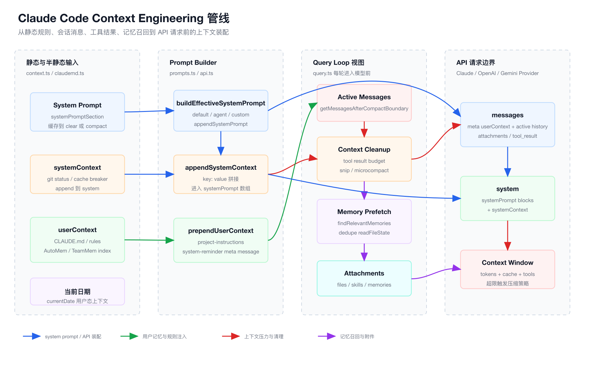
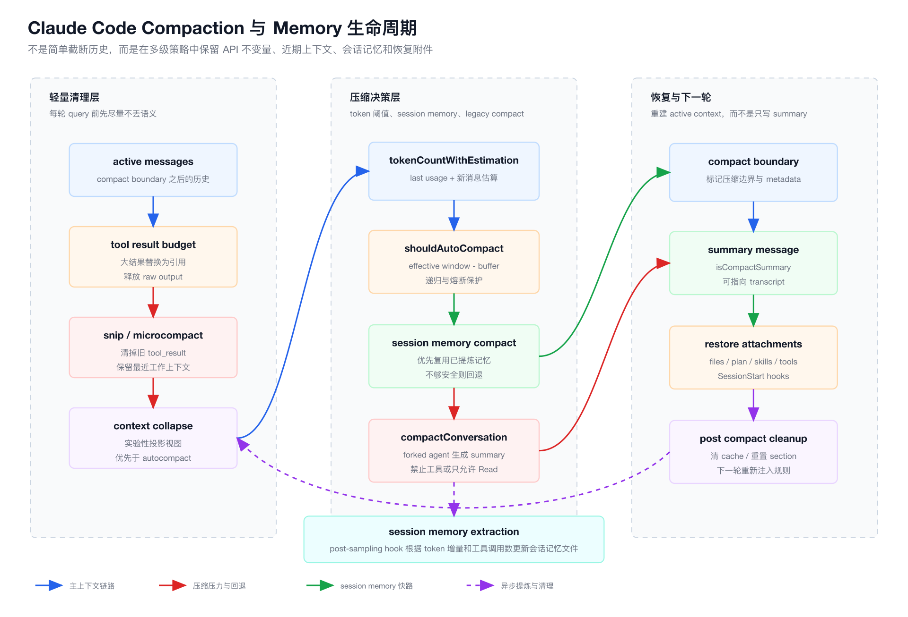

# 第 5 章：Context Engineering 与 Memory 系统

前四章已经把 Claude Code 的主干打通了：

- 第一章建立全局架构。
- 第二章拆 CLI 如何把一次命令变成一个运行中的会话。
- 第三章拆 Agent Loop 如何驱动模型和工具往返。
- 第四章拆 Tool Runtime 与权限系统如何把模型意图变成受控行动。

这一章进入 Coding Agent 最容易被低估、但决定上限的部分：

```text
Context Engineering 与 Memory 系统。
```

很多人做 Agent 时第一反应是调 prompt。

但真实工程里，prompt 只是上下文系统的一小块。

Claude Code 真正难的地方不是“写一段神奇系统提示词”，而是：

- 哪些内容应该长期稳定地放进 system prompt？
- 哪些内容应该作为用户态规则注入？
- 哪些历史消息还在有效上下文里？
- 哪些 tool_result 只是 UI 展示需要，不该无限挤占模型窗口？
- 什么时候应该压缩？
- 压缩后如何恢复必要文件、计划、工具列表、技能和 hooks 结果？
- 什么时候把会话历史提炼为 session memory？
- 什么时候召回跨会话 memory？

这就是 Context Engineering。

对于前端工程师，可以先用一个熟悉类比：

| AI Agent 概念 | 前端类比 |
| --- | --- |
| Context Window | 浏览器运行时内存 |
| System Prompt | 操作系统内核 + 应用启动配置 |
| CLAUDE.md | 项目级配置 / eslint config / tsconfig |
| userContext | SSR 注入的初始数据 |
| systemContext | 运行环境探针 / build metadata |
| Message History | Redux action log / event sourcing 日志 |
| tool_result | API response / 大型查询结果 |
| Microcompact | 缓存裁剪 / 大对象释放 |
| Auto Compact | Snapshot / checkpoint |
| Session Memory | 当前会话的可恢复状态文件 |
| Auto Memory | 跨会话长期用户画像与经验库 |

前端应用一旦复杂，就不能只靠组件 props 往下传。

你会引入状态管理、缓存、数据归一化、路由状态、SSR hydration、持久化、日志回放。

Agent 也是一样。

当任务从“一问一答”变成“持续数小时修改代码库”，上下文系统就是 Agent 的状态管理层。

## 1. 本章目标

读完这一章，你要能回答：

- Claude Code 的上下文由哪些来源组成？
- `systemPrompt`、`systemContext`、`userContext` 分别解决什么问题？
- `CLAUDE.md` 是如何被发现、排序、合并并注入模型的？
- 为什么 `CLAUDE.md` 不直接塞进普通 user message？
- `query.ts` 每轮请求模型前为什么要先处理 message view？
- `tool_result` 为什么是上下文爆炸的主要来源？
- microcompact、auto compact、session memory compact、context collapse 分别是什么？
- 压缩后为什么还要恢复文件、plan、skills、deferred tools、MCP instructions？
- 从 0 实现 Claude Code 时，最小上下文系统应该怎么设计？

本章不会把源码逐行翻译。

我们按“一个上下文系统应该如何演进”的方式拆 Claude Code。

## 2. 本章源码入口

第五章建议先读这些文件：

```text
claude-code/src/context.ts
claude-code/src/utils/claudemd.ts
claude-code/src/constants/prompts.ts
claude-code/src/constants/systemPromptSections.ts
claude-code/src/utils/systemPrompt.ts
claude-code/src/utils/api.ts
claude-code/src/query.ts
claude-code/src/utils/tokens.ts
claude-code/src/services/compact/autoCompact.ts
claude-code/src/services/compact/microCompact.ts
claude-code/src/services/compact/compact.ts
claude-code/src/services/compact/sessionMemoryCompact.ts
claude-code/src/services/compact/postCompactCleanup.ts
claude-code/src/services/SessionMemory/sessionMemory.ts
claude-code/src/services/SessionMemory/sessionMemoryUtils.ts
claude-code/src/memdir/memdir.ts
claude-code/src/memdir/findRelevantMemories.ts
claude-code/src/utils/attachments.ts
```

读的时候不要从 `CLAUDE.md` 文件格式开始。

先看三条主链：

```text
context.ts
  -> getSystemContext()
  -> getUserContext()

constants/prompts.ts
  -> getSystemPrompt()
  -> systemPromptSection()

query.ts
  -> getMessagesAfterCompactBoundary()
  -> microcompact / autocompact
  -> prependUserContext()
  -> callModel()
```

这三条链合起来，才是 Claude Code 的真实上下文系统。

## 3. Context Engineering 不是 Prompt Engineering

Prompt Engineering 的典型问题是：

```text
我要怎么写一句提示词，让模型更听话？
```

Context Engineering 的问题完全不同：

```text
我要把哪些信息、以什么权重、在什么时机、用什么结构、注入到模型上下文里？
```

Claude Code 的上下文不是一坨字符串。

它至少分成：

- 静态系统能力说明。
- 动态系统环境信息。
- 用户与项目规则。
- 当前消息历史。
- 工具调用结果。
- 文件附件。
- MCP 与 deferred tool 增量说明。
- session memory summary。
- auto memory 入口。
- relevant memory attachment。
- compact boundary 与 post compact 恢复附件。

这和前端做大型 SPA 很像。

你不会把所有状态都塞进一个全局变量。

你会区分：

- build-time config。
- runtime config。
- route state。
- server state。
- client cache。
- optimistic state。
- persisted state。
- telemetry state。

Agent 上下文也是状态分层问题。

## 4. Context 管线图

下图展示 Claude Code 一轮模型请求前，上下文如何从不同来源进入最终 API 请求。

源文件在 `./assets/05-context-engineering-pipeline.svg`，PNG 导出文件在 `./assets/05-context-engineering-pipeline.png`。



这张图先抓一个核心：

```text
Claude Code 不是直接把 messages 发给模型。

它先构造 system prompt，再构造 user context，再整理 active messages，
再做工具结果预算、memory prefetch、attachments 注入，
最后才进入 provider API。
```

如果你要从 0 实现，最小也应该保留这四层：

```text
systemPrompt
userContext
activeMessages
attachments
```

否则你的 Agent 很快会出现三个问题：

- 项目规则不稳定。
- 长任务撑爆上下文。
- 压缩后丢失关键工作状态。

## 5. 三类上下文：systemPrompt、systemContext、userContext

Claude Code 的上下文入口在 `context.ts` 和 `constants/prompts.ts`。

这几个名字容易混：

```ts
systemPrompt
systemContext
userContext
```

它们不是同一种东西。

### 5.1 systemPrompt：Agent 的内核协议

`getSystemPrompt()` 位于：

```text
claude-code/src/constants/prompts.ts
```

它负责构造 Claude Code 的默认系统提示词。

这部分包括：

- Claude Code 是什么。
- 当前运行环境。
- 工具使用原则。
- memory 行为说明。
- output style。
- MCP instructions。
- scratchpad。
- function result clearing。
- tool result summary 规则。

前端类比：

```text
systemPrompt 像框架运行时的内核代码。
```

它定义的是 Agent 的基础行为边界。

这里不应该频繁变化，因为 system prompt 是 prompt cache 的关键前缀。

所以 Claude Code 把很多动态片段包装成：

```text
systemPromptSection()
```

对应源码：

```text
claude-code/src/constants/systemPromptSections.ts
```

核心设计：

```ts
export function systemPromptSection(
  name: string,
  compute: ComputeFn,
): SystemPromptSection {
  return { name, compute, cacheBreak: false }
}
```

这表示：

```text
同一个 section 只算一次，缓存到 /clear 或 /compact。
```

这不是性能小优化。

这是上下文工程里的缓存边界设计。

如果 system prompt 每轮都变，provider 侧 prompt cache 命中率会下降，成本和延迟都会恶化。

### 5.2 systemContext：运行环境快照

`getSystemContext()` 位于：

```text
claude-code/src/context.ts
```

它目前主要注入：

- git status。
- cache breaker 注入。

源码里对 git status 有一个很重要的说明：

```text
This status is a snapshot in time, and will not update during the conversation.
```

也就是说，systemContext 不是“实时状态”。

它是会话开始时的运行环境快照。

前端类比：

```text
systemContext 像页面初始化时 SSR 注入的 build/runtime metadata。
```

它被 `appendSystemContext()` 追加到 system prompt 数组尾部：

```text
claude-code/src/utils/api.ts
```

```ts
export function appendSystemContext(
  systemPrompt: SystemPrompt,
  context: { [k: string]: string },
): string[] {
  return [
    ...systemPrompt,
    Object.entries(context)
      .map(([key, value]) => `${key}: ${value}`)
      .join('\n'),
  ].filter(Boolean)
}
```

这个设计说明：

```text
systemContext 仍然属于 system 侧权重。
```

它不是普通对话消息。

### 5.3 userContext：用户与项目规则

`getUserContext()` 也在：

```text
claude-code/src/context.ts
```

它负责加载：

- `CLAUDE.md`。
- `.claude/CLAUDE.md`。
- `.claude/rules/*.md`。
- `CLAUDE.local.md`。
- managed memory。
- user memory。
- auto memory entrypoint。
- team memory entrypoint。
- current date。

最终返回形态类似：

```ts
return {
  ...(claudeMd && { claudeMd }),
  currentDate: `Today's date is ${getLocalISODate()}.`,
}
```

但它不会直接被拼进 system prompt。

在真正请求模型前，`query.ts` 调用：

```ts
messages: prependUserContext(messagesForQuery, userContext)
```

对应源码：

```text
claude-code/src/utils/api.ts
```

其中 `claudeMd` 会被单独包装成：

```xml
<project-instructions>
...
</project-instructions>
```

并作为 `isMeta: true` 的 user message 放到消息最前面。

这段源码注释很关键：

```text
Extract claudeMd as a dedicated high-weight user message so it isn't
buried inside the generic system-reminder...
```

也就是说：

```text
CLAUDE.md 是用户态高权重规则，不是低权重系统提醒。
```

这解释了一个常见误解：

```text
为什么项目规则不直接写进 system prompt？
```

原因是：

- system prompt 更像产品内核，应该稳定。
- CLAUDE.md 是项目和用户可变规则。
- 它要有足够高的模型注意权重。
- 它又不能污染默认 system prompt 的缓存边界。

所以 Claude Code 选择把它作为 meta user message 注入。

## 6. CLAUDE.md 的发现与优先级

核心文件：

```text
claude-code/src/utils/claudemd.ts
```

文件顶部已经把加载顺序写得很清楚：

```text
1. Managed memory
2. User memory
3. Project memory
4. Local memory
```

但它还有一个反直觉点：

```text
Files are loaded in reverse order of priority,
the latest files are highest priority.
```

也就是说，越后加载，模型越容易注意。

Claude Code 会从启动工作目录向上遍历到根目录，再从根向目标目录加载。

这样离启动工作目录越近的规则越晚出现，优先级越高。

前端类比：

```text
这很像 CSS cascade：
全局样式先来，局部样式后覆盖。
```

项目规则包括：

```text
CLAUDE.md
.claude/CLAUDE.md
.claude/rules/*.md
```

本地私有规则是：

```text
CLAUDE.local.md
```

用户全局规则来自用户配置目录。

Managed 规则来自托管策略目录。

这套设计背后的思想是：

```text
Agent 不是只服务一个 repo。
Agent 要同时尊重组织策略、用户习惯、项目约定、局部目录规则和私有偏好。
```

## 7. @include：让规则系统模块化

`claudemd.ts` 还支持 `@include`：

```text
@path
@./relative/path
@~/home/path
@/absolute/path
```

这不是 Markdown 的普通链接。

它会把被 include 的文件作为独立 memory entry 加入上下文。

同时源码里做了几件工程保护：

- 只允许文本类扩展名。
- 跟踪 processed paths，防止循环引用。
- 不存在的文件静默忽略。
- 只在叶子文本节点中生效，避免代码块里误触发。

前端类比：

```text
它像 tsconfig extends 或 eslint config extends。
```

大的项目规则不应该写成一个超长文件。

应该拆成：

- code style。
- testing。
- release。
- security。
- domain glossary。
- team workflow。

再由 `CLAUDE.md` include。

## 8. 条件规则：.claude/rules/*.md

`claudemd.ts` 会解析 frontmatter。

当规则文件带有路径条件时，它可以只对特定路径生效。

这类规则不会无脑塞给每个任务。

设计思想非常重要：

```text
上下文不是越多越好。
上下文要按任务相关性分层注入。
```

前端类比：

```text
不要把所有路由 chunk 一次性打进首屏。
应该按路由、组件、交互时机加载。
```

Agent 的规则系统也是 code splitting。

## 9. Memory Instruction Prompt：规则不是普通笔记

`getClaudeMds()` 最终会拼出：

```text
Codebase and user instructions are shown below...
IMPORTANT: These instructions OVERRIDE any default behavior...
```

这说明 Claude Code 把这些文件当成：

```text
行为约束。
```

而不是“参考资料”。

参考资料可以忽略。

行为约束需要遵守。

这也是为什么 `prependUserContext()` 要给 `claudeMd` 单独高权重通道。

从 0 实现时，不建议把所有信息都叫 memory。

至少要区分：

```text
instructions
facts
working state
retrieved references
summaries
```

不同类型应该进入不同位置。

## 10. System Prompt Section Cache

`systemPromptSection()` 是第五章必须理解的设计。

源码：

```text
claude-code/src/constants/systemPromptSections.ts
```

它做的事很简单：

```text
按 section name 缓存 system prompt 片段。
```

但价值很大：

- 降低重复计算。
- 保持 prompt cache prefix 稳定。
- 避免动态信息每轮扰动大块 system prompt。
- 在 `/clear` 或 `/compact` 后重新计算必要 section。

它还提供了一个危险出口：

```ts
DANGEROUS_uncachedSystemPromptSection()
```

这个名字不是装饰。

它明确告诉维护者：

```text
这个 section 每轮变动会破坏 prompt cache，必须有理由。
```

前端类比：

```text
这像 React 里 useMemo 与非 memoized render 的区别。
```

在 AI Agent 里，这不是单纯 CPU 开销。

它会影响 provider 侧缓存、延迟和账单。

## 11. Effective System Prompt 的优先级

`buildEffectiveSystemPrompt()` 位于：

```text
claude-code/src/utils/systemPrompt.ts
```

它把 system prompt 的优先级写成明确策略：

```text
0. overrideSystemPrompt
1. coordinator system prompt
2. agent system prompt
3. custom system prompt
4. default system prompt
```

然后再追加：

```text
appendSystemPrompt
```

这解决的是多运行模式冲突。

Claude Code 不只有一个主 Agent。

它还可能有：

- coordinator mode。
- main thread agent。
- built-in agent。
- user custom system prompt。
- SDK non-interactive session。
- append prompt。

如果没有统一优先级，系统提示词会很快变成不可预测拼接。

从 0 实现时，也应该把 prompt 优先级写成一个函数，而不是散落在入口层。

## 12. Query Loop 中的上下文准备

`query.ts` 是上下文系统真正工作的地方。

每轮进入模型前，它不会直接用 `messages`。

它先做：

```ts
let messagesForQuery = getMessagesAfterCompactBoundary(messages)
```

意思是：

```text
模型只看 compact boundary 之后的 active context。
```

UI 和 transcript 可以保留完整历史。

模型上下文只保留当前有效视图。

前端类比：

```text
浏览器 devtools 可以看完整日志，但当前 render 只依赖 active state。
```

这是长任务 Agent 的核心分离：

```text
history for humans
active context for model
```

## 13. 为什么 tool_result 会撑爆上下文

第四章讲过，所有工具执行结果都会回灌给模型。

这在短任务里很自然。

但 Coding Agent 里工具结果很容易巨大：

- 读取一个 400KB 文件。
- grep 一批结果。
- bash 输出大量日志。
- WebFetch 返回长文档。
- 多个并发工具结果交错。

如果这些原样长期留在 messages，几轮之后上下文窗口就会被工具结果占满。

Claude Code 在 `query.ts` 里有一段关键逻辑：

```text
Release toolUseResult payloads from previous turns.
```

它删除 UI 已经渲染过、API 不再需要的 raw output 对象。

同时还有：

```text
applyToolResultBudget()
```

用于把过大的 tool result 替换成轻量引用。

这里要区分两个层次：

```text
message.message.content 里的 tool_result 是模型需要读的。
message.toolUseResult 是 UI 或运行时保留的原始对象。
```

能删的是后者。

不能随便删的是前者，因为 API 需要 tool_use 和 tool_result 成对。

这就是上下文工程难点：

```text
你不能只看 token。
你还要维护模型 API 的结构不变量。
```

## 14. tokenCountWithEstimation：不要用累计账单判断上下文

核心文件：

```text
claude-code/src/utils/tokens.ts
```

Claude Code 明确把这个函数称为 canonical：

```ts
export function tokenCountWithEstimation(messages: readonly Message[]): number
```

它的原则是：

```text
使用最后一次真实 API usage，再加上之后新增消息的粗略估算。
```

为什么不能用累计 token？

因为累计 token 是账单维度，不是当前 context window 维度。

前端类比：

```text
累计网络流量不等于当前 Redux store 大小。
```

一次会话可能花了很多 token，但 active context 经过 compact 后已经变小。

反过来，账单不高也可能因为一次大文件读取突然挤爆窗口。

所以阈值判断必须基于：

```text
当前会被发给模型的上下文大小。
```

Claude Code 还处理了一个细节：

并行工具调用 streaming 时，同一次 assistant response 可能被拆成多个 assistant message，但它们共享同一个 message id。

`tokenCountWithEstimation()` 会回退到同一 response 的第一个 sibling，避免漏算中间交错的 tool_result。

这是典型工业级边角。

简单实现很容易在并发 tool calling 下低估上下文。

## 15. Microcompact：轻量释放工具结果

核心文件：

```text
claude-code/src/services/compact/microCompact.ts
```

microcompact 不是完整总结会话。

它更像：

```text
对旧工具结果做轻量清理。
```

源码里定义了可清理工具集合：

```text
FileRead
Bash shell tools
Grep
Glob
WebSearch
WebFetch
FileEdit
FileWrite
```

这些工具的结果容易大，也更容易在未来变成“已读过的历史数据”。

microcompact 有两类路径：

### 15.1 cached microcompact

如果启用 cache editing，它不会直接改本地 message content。

它会生成 cache edits，让 provider 侧删除旧 tool result 的缓存引用。

这能减少上下文压力，同时尽量保住 prompt cache。

### 15.2 time-based microcompact

当距离上次主循环 assistant message 超过配置阈值时，说明 server cache 可能已经冷了。

这时修改旧 prompt 不再损失太多 cache 命中。

于是它会把旧工具结果内容替换为：

```text
[Old tool result content cleared]
```

同时保留最近 N 个工具结果。

这很像前端缓存：

```text
热缓存时只打补丁，冷缓存时直接清大对象。
```

## 16. Snip 与 Context Collapse

`query.ts` 的顺序是：

```text
applyToolResultBudget
snip
microcompact
context collapse
autocompact
```

这个顺序很重要。

Claude Code 会先尝试局部瘦身，再考虑完整 summarization。

`HISTORY_SNIP` 是更粗粒度地剪历史。

`CONTEXT_COLLAPSE` 是实验性投影视图。

源码里 context collapse 当前在该源码目录中是 stub，但 `query.ts` 的注释已经说明目标设计：

```text
projected collapsed context view
summary messages live in collapse store
not the REPL array
```

也就是说，它想实现的不是传统 compact。

它更接近：

```text
把历史分段折叠成可投影的 summary view。
```

前端类比：

```text
不是删除 Redux action log，而是生成 selector projection。
```

这类系统的方向很明确：

```text
未来 Agent 不会只有“全量历史”和“一坨 summary”两种状态。
它会有多级可恢复上下文视图。
```

## 17. Auto Compact：真正的 checkpoint

核心文件：

```text
claude-code/src/services/compact/autoCompact.ts
```

它先计算 effective context window：

```ts
getEffectiveContextWindowSize(model)
```

这个值不是模型最大上下文。

它会预留 compact summary 输出空间：

```text
contextWindow - reservedTokensForSummary
```

为什么要预留？

因为压缩本身也要调用模型生成 summary。

如果等到窗口完全满了再压缩，压缩请求本身也会失败。

这就是一个很工程的点：

```text
压缩系统也消耗上下文。
```

随后 `getAutoCompactThreshold()` 再减去 buffer。

源码里有不同窗口大小的 buffer：

```text
200k 级别：13k
400k 级别：30k
800k 级别：50k
```

这说明 buffer 不是魔法常数，而是和模型窗口相关。

Claude Code 还做了 predictive autocompact：

```text
估计本轮增长是否会把上下文推过窗口。
```

这比“超了再救”更安全。

前端类比：

```text
不是等页面 OOM 后再清缓存，而是在接近内存压力前先释放。
```

## 18. Compaction 生命周期图

下图展示从 active messages 到 post-compact 下一轮上下文的生命周期。

源文件在 `./assets/05-compaction-memory-lifecycle.svg`，PNG 导出文件在 `./assets/05-compaction-memory-lifecycle.png`。



这张图的重点：

```text
compact 不是简单“把前文总结一下”。

它是一个带恢复附件、hook、cache reset、memory fallback、
API 不变量保护的 checkpoint 流程。
```

## 19. Compact Conversation：压缩不是裁剪，是重建

核心文件：

```text
claude-code/src/services/compact/compact.ts
```

它做的事情非常多。

先看压缩模型的 prompt：

```text
claude-code/src/services/compact/prompt.ts
```

Claude Code 要求 summary 包含：

- 用户请求和意图。
- 关键技术概念。
- 文件和代码片段。
- 错误与修复。
- 问题解决过程。
- 用户所有非工具消息。
- 待办任务。
- 当前正在做的事。
- 下一步。

这不是普通摘要。

这是：

```text
让另一个未来 Agent 能接手当前任务的状态快照。
```

它甚至要求模型先写 `<analysis>` 再写 `<summary>`，然后 `formatCompactSummary()` 会去掉 analysis。

这个设计说明：

```text
压缩摘要本身也是一次高质量推理任务。
```

不是 `messages.slice(-20)` 能替代的。

## 20. 为什么 compact agent 要限制工具

`prompt.ts` 里有非常强的 no-tools preamble：

```text
Respond with TEXT ONLY. Do NOT call any tools.
```

原因很直接：

compact agent 的任务是总结已有上下文。

如果它再调用工具：

- 会引入新副作用。
- 会改变会话状态。
- 会浪费唯一 turn。
- 可能让 compact 自己继续撑大上下文。

从 0 实现时，建议把 compact 设计成一个独立 fork：

```text
输入：当前 active messages
输出：结构化 summary
权限：默认无工具，必要时只允许 Read
```

Claude Code 的 fallback 路径在部分场景允许 `FileReadTool`，但也非常克制。

## 21. Post Compact 恢复附件

压缩完成后，Claude Code 不只是把 summary 放回 messages。

`compact.ts` 会恢复很多附件：

- 最近读取过的重要文件。
- async agent 状态。
- plan attachment。
- plan mode instructions。
- invoked skills。
- deferred tools delta。
- agent listing delta。
- MCP instructions delta。
- SessionStart hooks 结果。

为什么？

因为 summary 不是万能的。

如果一个文件刚被读过，模型下一轮很可能还需要它。

如果计划模式还在，模型必须知道自己仍处于 plan mode。

如果某个 skill 已经被调用，压缩不能让模型忘掉 skill 正文。

如果 deferred tools 或 MCP instructions 原本通过增量附件出现，compact 会吃掉这些附件，压缩后就必须重新宣布。

前端类比：

```text
这像应用从 snapshot 恢复时，不只恢复 Redux state，
还要恢复 route、feature flags、active subscriptions、cache handles。
```

## 22. runPostCompactCleanup：压缩后的缓存重置

核心文件：

```text
claude-code/src/services/compact/postCompactCleanup.ts
```

compact 后要清掉很多状态：

- microcompact state。
- context collapse state。
- userContext cache。
- memory files cache。
- system prompt section cache。
- classifier approvals。
- speculative checks。
- beta tracing state。
- session message cache。
- 注册的 compact cleanup callbacks。

这也解释了为什么 `systemPromptSection()` 的缓存边界是 `/clear` 或 `/compact`。

compact 后，很多“之前已经注入过”的上下文需要重新进入模型。

否则压缩会造成隐性丢上下文。

注意这里还有一个重要保护：

```text
subagent compact 不应该重置 main thread 的 module-level state。
```

源码通过 `querySource` 判断是否 main-thread compact。

这是长任务多 Agent 系统很容易踩的坑：

```text
同进程共享模块状态，但不同 agent 的上下文边界不一样。
```

## 23. Session Memory：会话内的长期工作状态

Claude Code 还有一个更进一步的系统：

```text
Session Memory
```

核心文件：

```text
claude-code/src/services/SessionMemory/sessionMemory.ts
claude-code/src/services/SessionMemory/sessionMemoryUtils.ts
claude-code/src/services/compact/sessionMemoryCompact.ts
```

Session Memory 不是跨所有会话的用户记忆。

它更像当前会话的工作笔记。

它通过 post-sampling hook 在合适时机抽取当前会话状态，写入一个 session memory 文件。

触发条件包括：

- 当前上下文 token 达到初始化阈值。
- 距离上次提取的 token 增量达到阈值。
- 工具调用数达到阈值。
- 或者最近一轮没有工具调用，处于自然对话边界。

默认配置在 `sessionMemoryUtils.ts`：

```ts
minimumMessageTokensToInit: 10000
minimumTokensBetweenUpdate: 5000
toolCallsBetweenUpdates: 3
```

这说明 Claude Code 不会每轮都更新 session memory。

它只在信息量足够大、且时机相对安全时提炼。

## 24. Session Memory Extraction 是 forked agent

`sessionMemory.ts` 里，提取 session memory 时会：

1. 创建 session memory 文件。
2. 用 `FileReadTool` 读当前 memory 内容。
3. 构造更新 prompt。
4. 用 `runForkedAgent()` 启动独立 agent。
5. 只允许它编辑特定 memory 文件。

这和主 Agent 直接写 memory 不一样。

它的工程意义是：

```text
把“工作任务”和“整理工作状态”拆成两个 agent。
```

前端类比：

```text
主线程负责交互，后台 worker 负责增量索引。
```

如果让主 Agent 每轮自己整理 memory，会干扰主任务。

用 forked agent 可以：

- 隔离上下文。
- 隔离工具权限。
- 复用 prompt cache。
- 降低主循环延迟感知。
- 避免污染主任务的 readFileState。

## 25. Session Memory Compact：优先用已有记忆压缩

`autoCompactIfNeeded()` 里有一个关键分支：

```text
trySessionMemoryCompaction()
```

也就是说，触发 autocompact 时，Claude Code 会先尝试：

```text
能不能直接用 session memory 作为 summary？
```

如果 session memory 可用，且能计算出哪些 message 已经被总结过，它就只保留之后的新消息。

这比临时调用 compact agent 重新总结整个对话更高效。

但它也有严格 fallback：

- feature gate 没开则不用。
- memory 文件不存在则不用。
- memory 还是空模板则不用。
- last summarized message 找不到则不用。
- post compact token 仍超过阈值则不用。
- 出错则回退 legacy compact。

这体现了 Claude Code 的工程风格：

```text
快路径可以实验，但不能破坏主路径。
```

## 26. API 不变量：不能拆散 tool_use / tool_result

Session memory compact 里有一个非常重要的函数：

```text
adjustIndexToPreserveAPIInvariants()
```

它解决两个问题：

### 26.1 tool_use 和 tool_result 必须成对

如果保留了某个 user message 里的 `tool_result`，就必须保留它对应的 assistant `tool_use`。

否则 API 会报错：

```text
orphan tool_result references non-existent tool_use
```

### 26.2 streaming assistant message 可能被拆成多个记录

同一个 API response 可能包含：

- thinking block。
- tool_use block。
- text block。

streaming 时它们可能变成多个 assistant message，但共享同一个 `message.id`。

压缩裁剪不能从中间切开。

否则 thinking 签名或 tool_use pairing 都可能坏。

这是实现 Coding Agent 时必须记住的铁律：

```text
压缩不是字符串裁剪。
压缩必须维护 provider message schema 的结构完整性。
```

## 27. Auto Memory：跨会话的文件化记忆系统

Session Memory 解决当前会话。

Auto Memory 解决跨会话。

核心在：

```text
claude-code/src/memdir/memdir.ts
claude-code/src/memdir/findRelevantMemories.ts
```

`memdir.ts` 里构造了一个文件化 memory prompt。

它告诉模型：

- memory 存在一个目录里。
- 每条 memory 应该独立成文件。
- 每个文件有 frontmatter。
- `MEMORY.md` 是索引，不是记忆正文。
- 索引每行应该很短。
- memory 应按语义组织，不按时间堆叠。
- 错误或过时 memory 要更新或删除。
- 不要写重复 memory。

这和很多“把所有记忆 append 到一个 JSON”完全不同。

Claude Code 选择的是：

```text
文件系统即 memory store。
```

这对 Coding Agent 很自然：

- 模型已经会读写文件。
- 文件可被版本化、审计、编辑。
- 每条记忆可以独立召回。
- 可以用 frontmatter 做类型、描述、路径。
- 可以通过 grep 或语义选择器检索。

## 28. Auto Memory 的四类内容

`memdir.ts` 把 memory 限定在闭合分类里。

大致包括：

- user。
- feedback。
- project。
- reference。

同时明确不应该保存：

```text
当前项目状态中可推导出来的内容。
```

这是非常关键的边界。

不要把代码库里本来能读到的东西存成 memory。

比如：

```text
这个项目用了 React。
```

这种信息应该从源码和配置读出来，不应该污染长期记忆。

应该存的是：

```text
用户偏好、协作方式、历史决策原因、外部上下文、反复出现的纠错。
```

前端类比：

```text
不要把 derived state 存 Redux。
```

Agent memory 也是一样。

## 29. Relevant Memory Prefetch：异步召回，不阻塞首轮

核心代码在：

```text
claude-code/src/utils/attachments.ts
```

`query.ts` 一进入 `queryLoop` 就启动：

```ts
using pendingMemoryPrefetch = startRelevantMemoryPrefetch(
  state.messages,
  state.toolUseContext,
)
```

它不会阻塞主请求。

它会：

- 找最后一个真实 user prompt。
- 跳过 meta message。
- 单词太少则不做召回。
- 如果已经 surfaced 的 memory 太多则跳过。
- 创建子 abort controller，用户取消时一起取消。
- 调用 `findRelevantMemories()`。

召回完成后，不一定马上注入。

`query.ts` 在工具执行后尝试 consume：

```text
如果 prefetch 已 settle 且还未消费，则转成 attachment message 注入。
```

这个策略很现实：

```text
记忆召回不应该拖慢每次首包。
但如果本轮有工具循环，它可以在下一次模型迭代前赶上。
```

前端类比：

```text
页面先 render，相关数据 prefetch；如果用户进入二级交互时数据到了，就直接使用。
```

## 30. Memory 召回如何避免重复污染

`filterDuplicateMemoryAttachments()` 做了一件很重要的事：

```text
如果 memory 文件已经通过 Read/Write/Edit 进入 readFileState，就不要再次作为 relevant_memories attachment 注入。
```

并且它的注释说明了顺序：

```text
先过滤，再写入 readFileState。
```

否则会出现自我过滤：

```text
prefetch 阶段先把路径写入 readFileState，
consume 阶段发现都已读过，于是全部丢掉。
```

这种 bug 在异步系统里非常常见。

记忆召回不是“查到了就塞进去”。

它要和文件读取缓存、工具调用历史、之前已 surfaced 的 memory 协同。

## 31. Context 与 Memory 的边界

到这里可以给出一个清晰边界：

```text
Context 是当前请求会看到什么。
Memory 是跨时间保存什么。
```

更细一点：

| 类型 | 生命周期 | 进入方式 | 例子 |
| --- | --- | --- | --- |
| system prompt | 产品版本级 | system | Agent 行为协议 |
| systemContext | 会话级 | system tail | git status |
| userContext | 会话级/项目级 | meta user | CLAUDE.md |
| active messages | 当前 compact 区间 | messages | 用户和助手往返 |
| tool_result | 当前任务阶段 | messages/attachments | Read/Grep/Bash 输出 |
| session memory | 当前会话长期 | compact summary | 当前任务状态 |
| auto memory | 跨会话长期 | CLAUDE.md 或 attachment | 用户偏好、经验 |
| relevant memories | 按任务召回 | attachment | 相关 memory 文件 |

从 0 实现时，不要急着上 vector DB。

先把这些生命周期分清楚。

很多 Agent 失败不是因为没有向量检索，而是因为把所有东西都混成“memory”。

## 32. 从 0 实现最小 Context Builder

先写一个最小版本。

### 32.1 数据结构

```ts
type ContextParts = {
  systemPrompt: string[]
  systemContext: Record<string, string>
  userContext: Record<string, string>
  activeMessages: Message[]
  attachments: Message[]
}
```

### 32.2 构造 system prompt

```ts
async function buildSystemPrompt(): Promise<string[]> {
  return [
    'You are a coding agent.',
    'Follow project instructions.',
    'Use tools only through the runtime.',
  ]
}
```

### 32.3 构造 user context

```ts
async function buildUserContext(cwd: string): Promise<Record<string, string>> {
  const instructions = await loadClaudeMdCascade(cwd)
  return {
    ...(instructions ? { claudeMd: instructions } : {}),
    currentDate: `Today's date is ${new Date().toISOString().slice(0, 10)}.`,
  }
}
```

### 32.4 注入 user context

```ts
function prependUserContext(
  messages: Message[],
  context: Record<string, string>,
): Message[] {
  const result: Message[] = []
  const { claudeMd, ...rest } = context

  if (claudeMd) {
    result.push({
      role: 'user',
      meta: true,
      content: `<project-instructions>\n${claudeMd}\n</project-instructions>`,
    })
  }

  if (Object.keys(rest).length > 0) {
    result.push({
      role: 'user',
      meta: true,
      content:
        `<system-reminder>\n` +
        Object.entries(rest)
          .map(([key, value]) => `# ${key}\n${value}`)
          .join('\n\n') +
        `\n</system-reminder>`,
    })
  }

  return [...result, ...messages]
}
```

这个最小版本已经比“把所有字符串拼成一个 prompt”好很多。

## 33. 从 0 实现最小 compact

最小 compact 不需要一开始就做 session memory。

先实现：

```ts
type CompactionResult = {
  boundary: Message
  summary: Message
  keptMessages: Message[]
  attachments: Message[]
}
```

流程：

```ts
async function compactIfNeeded(messages: Message[]): Promise<Message[]> {
  const tokens = estimateContextTokens(messages)
  if (tokens < AUTO_COMPACT_THRESHOLD) return messages

  const { prefix, tail } = splitMessagesForCompact(messages)
  const summary = await summarize(prefix)

  return [
    createCompactBoundary(),
    createSummaryMessage(summary),
    ...restoreAttachments(prefix),
    ...tail,
  ]
}
```

关键不是这段代码。

关键是必须补上三个约束：

### 33.1 不要拆 tool_use / tool_result

裁剪边界必须检查 tool pair。

### 33.2 summary 要面向继续工作

不要写“聊天摘要”。

要写：

```text
可恢复工程状态。
```

### 33.3 compact 后要恢复工作上下文

至少恢复：

- 近期读取文件。
- 当前计划。
- 已加载工具说明。
- 项目规则。

否则模型会“记得大概发生了什么”，但无法继续精确工作。

## 34. 从 0 实现最小 Memory

最小 memory 不建议直接上 embeddings。

可以先用文件化 memory。

目录：

```text
.agent-memory/
  MEMORY.md
  user_preferences.md
  project_release_rules.md
  feedback_testing.md
```

`MEMORY.md` 只做索引：

```md
- [User Preferences](user_preferences.md) - collaboration style and tool preferences
- [Testing Feedback](feedback_testing.md) - repeated testing corrections
```

每个 memory 文件有 frontmatter：

```md
---
name: Testing Feedback
type: feedback
description: User preferences about test and verification behavior
---

The user prefers running the fastest relevant check before broader suites.
```

召回可以先用简单文本匹配：

```ts
async function recallMemories(query: string): Promise<MemoryFile[]> {
  const manifest = await scanMemoryManifest()
  return manifest
    .filter(item => keywordScore(query, item.description) > 0)
    .slice(0, 5)
}
```

后续再替换为：

- LLM selector。
- embeddings。
- hybrid search。
- rerank。

但是文件结构和生命周期不要变。

## 35. Context Engineering 的五条铁律

### 35.1 上下文有权重，不只是顺序

system、meta user、普通 user、attachment、tool_result 的权重不同。

不要把所有东西拼成一段字符串。

### 35.2 上下文有生命周期

项目规则、当前任务状态、工具输出、跨会话记忆不应该共享同一种生命周期。

### 35.3 压缩必须维护 API 不变量

任何裁剪都不能破坏 tool_use / tool_result 配对、thinking block、message id 合并逻辑。

### 35.4 Memory 只存不可轻易推导的信息

能从代码、配置、git 状态读出来的信息，不要存长期 memory。

### 35.5 Compact 后要恢复工作现场

summary 只是 checkpoint 的一部分。

恢复附件和缓存重置同样重要。

## 36. 源码阅读路线

建议按这个顺序读：

1. `claude-code/src/context.ts`
   - 先看 `getSystemContext()`。
   - 再看 `getUserContext()`。

2. `claude-code/src/utils/claudemd.ts`
   - 看顶部加载顺序说明。
   - 看 `getMemoryFiles()`。
   - 看 `getClaudeMds()`。
   - 看 `filterInjectedMemoryFiles()`。

3. `claude-code/src/constants/prompts.ts`
   - 看 `getSystemPrompt()`。
   - 找到 `systemPromptSection('memory', ...)`。

4. `claude-code/src/constants/systemPromptSections.ts`
   - 看 section cache。
   - 理解为什么有 `DANGEROUS_uncachedSystemPromptSection()`。

5. `claude-code/src/utils/api.ts`
   - 看 `appendSystemContext()`。
   - 看 `prependUserContext()`。

6. `claude-code/src/query.ts`
   - 看 `getMessagesAfterCompactBoundary()`。
   - 看 tool result budget。
   - 看 snip、microcompact、context collapse、autocompact 的顺序。
   - 看最终 `callModel()` 前如何注入 user context。

7. `claude-code/src/utils/tokens.ts`
   - 看 `tokenCountWithEstimation()`。

8. `claude-code/src/services/compact/microCompact.ts`
   - 看 compactable tools。
   - 看 cached microcompact 与 time-based microcompact。

9. `claude-code/src/services/compact/autoCompact.ts`
   - 看 effective window。
   - 看 threshold。
   - 看 circuit breaker。
   - 看 session memory compact 优先级。

10. `claude-code/src/services/compact/compact.ts`
    - 看 `compactConversation()`。
    - 看 post-compact attachments。
    - 看 compact boundary。

11. `claude-code/src/services/SessionMemory/sessionMemory.ts`
    - 看 post-sampling hook。
    - 看 `runForkedAgent()` 如何更新 memory 文件。

12. `claude-code/src/memdir/memdir.ts`
    - 看文件化 memory prompt。
    - 看 `MEMORY.md` index 设计。

13. `claude-code/src/utils/attachments.ts`
    - 看 `startRelevantMemoryPrefetch()`。
    - 看 `filterDuplicateMemoryAttachments()`。

不要一上来就读具体 UI 组件。

先理解上下文如何被构造、裁剪、压缩、恢复，再看 `/context` 可视化或 `/memory` 命令。

## 37. 本章结论

Claude Code 的 Context Engineering 可以概括为：

```text
稳定内核 + 项目规则 + active history + 工具结果预算
+ 多级压缩 + 会话记忆 + 跨会话记忆召回。
```

它的核心不是“写一个更强 prompt”。

它的核心是：

- 把不同生命周期的信息放在不同通道。
- 用缓存边界保护 prompt cache。
- 用 active context view 分离 UI 历史和模型输入。
- 用 microcompact 先释放工具结果压力。
- 用 auto compact 做 checkpoint。
- 用 session memory 做长任务提炼。
- 用 file-based memory 做跨会话经验积累。
- 用 attachments 在压缩后恢复工作现场。

如果第三章的 Agent Loop 是“思考循环”，第四章的 Tool Runtime 是“行动系统”，那么第五章的 Context Engineering 就是：

```text
Agent 的状态管理系统。
```

下一章建议进入：

```text
第 6 章：Prompt Pipeline 与 System Prompt 设计
  - 默认 system prompt 如何分层
  - output style 如何影响行为
  - tools prompt 与 deferred tools 如何进入上下文
  - MCP instructions 为什么要做 delta
  - 从 0 设计一个可缓存、可扩展、可调试的 prompt pipeline
```
