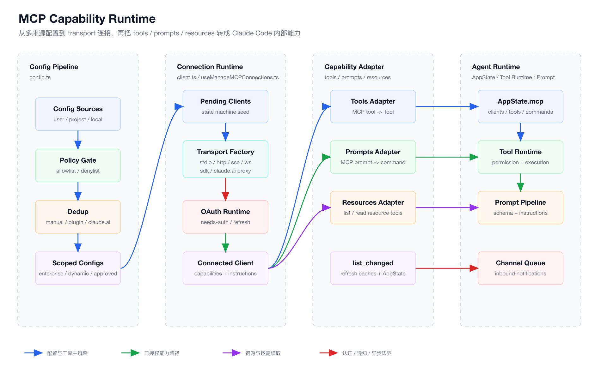
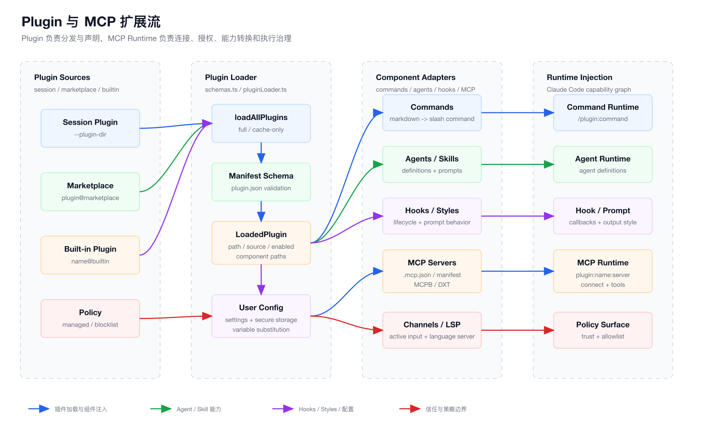

# 第 7 章：MCP 与插件化能力系统

第六章讲了 Prompt Pipeline。

它解决的是：

```text
模型应该看到什么？
哪些内容应该常驻？
哪些内容应该延迟加载？
哪些内容应该通过 delta attachment 增量出现？
```

这一章继续往外走一步。

当一个 Coding Agent 已经有了：

- CLI 启动链路。
- Agent Loop。
- Tool Runtime。
- Permission System。
- Context Engineering。
- Prompt Pipeline。

它接下来一定会遇到一个问题：

```text
能力不可能全部内置。
```

一个真实 AI IDE 不可能把 GitHub、Slack、Jira、Sentry、Notion、Postgres、Figma、浏览器、企业内部系统全部写死在主仓库里。

这会让系统变成一个不可维护的巨型应用。

所以 Claude Code 必须有扩展系统。

在 Claude Code 里，这个扩展系统分成两层：

```text
MCP = 运行时能力协议
Plugin = 能力分发与安装机制
```

前端工程师可以这样类比：

| Claude Code | 前端类比 |
| --- | --- |
| MCP server | 浏览器扩展 / 后端插件服务 |
| MCP tool | Web API / RPC method |
| MCP resource | 静态资源 / Data source |
| MCP prompt | Slash command / route action |
| MCP transport | WebSocket / HTTP / worker bridge |
| Plugin manifest | package.json + vite plugin config |
| Marketplace | npm registry |
| Built-in plugin | framework 内置插件 |
| Plugin hook | Vite/Rollup lifecycle hook |
| Channel notification | Web Push / Service Worker message |

这一章的核心结论是：

```text
MCP 让 Agent 能力协议化。
Plugin 让 Agent 能力产品化。
```

没有 MCP，Agent 的外部能力会变成一堆硬编码集成。

没有 Plugin，MCP server、commands、agents、skills、hooks、output styles 又很难被安装、启用、禁用、审计和更新。

## 1. 本章目标

读完这一章，你要能回答：

- MCP 在 Claude Code 里到底承载了哪些能力？
- 为什么 MCP 不只是 tool calling？
- Claude Code 如何把 MCP tools 转换成内部 `Tool`？
- MCP resources 和 prompts 如何进入运行时？
- MCP server 为什么要有 connected、failed、needs-auth、pending、disabled 这些状态？
- stdio、HTTP、SSE、WebSocket、SDK、claude.ai proxy 这些 transport 各自解决什么问题？
- OAuth 为什么是 MCP 运行时的一部分？
- `list_changed` 通知为什么是插件系统必须具备的能力？
- Plugin manifest 如何声明 commands、agents、skills、hooks、output styles、MCP servers？
- Plugin 与 MCP 的关系是什么？
- 为什么 plugin-provided MCP server 要做命名空间隔离和去重？
- 从 0 实现一个 Coding Agent 插件系统时，最小架构应该是什么？

本章仍然不写成命令手册。

我们重点拆架构思想。

## 2. 本章源码入口

建议从这些文件开始：

```text
claude-code/src/services/mcp/types.ts
claude-code/src/services/mcp/config.ts
claude-code/src/services/mcp/client.ts
claude-code/src/services/mcp/useManageMCPConnections.ts
claude-code/src/services/mcp/MCPConnectionManager.tsx
claude-code/src/services/mcp/auth.ts
claude-code/src/services/mcp/channelNotification.ts
claude-code/src/services/mcp/mcpStringUtils.ts
claude-code/src/services/mcp/normalization.ts
claude-code/src/services/mcp/utils.ts
claude-code/src/utils/mcpValidation.ts
claude-code/src/entrypoints/mcp.ts
claude-code/src/commands/mcp/addCommand.ts
claude-code/src/cli/handlers/mcp.tsx
claude-code/src/types/plugin.ts
claude-code/src/utils/plugins/schemas.ts
claude-code/src/utils/plugins/pluginLoader.ts
claude-code/src/utils/plugins/mcpPluginIntegration.ts
claude-code/src/utils/plugins/loadPluginCommands.ts
claude-code/src/utils/plugins/loadPluginAgents.ts
claude-code/src/utils/plugins/loadPluginHooks.ts
claude-code/src/utils/plugins/loadPluginOutputStyles.ts
claude-code/src/plugins/builtinPlugins.ts
claude-code/src/plugins/bundled/index.ts
```

这些文件分成两组：

```text
MCP runtime：
  types / config / client / connection manager / auth / notifications

Plugin runtime：
  schemas / loader / integration / component loaders / built-in registry
```

第七章的阅读顺序不要反过来。

不要先看 `/mcp` UI。

先看能力如何被加载、连接、转换、注入，再看命令和界面。

## 3. MCP 的本质：Agent 的外设总线

MCP 经常被误解成：

```text
一种让模型调用外部工具的协议。
```

这个说法没错，但太窄。

在 Claude Code 里，MCP 更像：

```text
Agent Runtime 的外设总线。
```

它不仅能提供 tool，还能提供：

- tools：外部动作。
- resources：外部数据资源。
- prompts：外部 slash command。
- server instructions：服务级行为说明。
- elicitation：工具执行中的用户交互。
- list_changed notification：能力动态刷新。
- channel notification：外部消息主动进入会话。
- OAuth auth state：远程能力的授权态。

前端类比：

```text
MCP 不是一个 fetch wrapper。

它更像浏览器扩展协议：
  extension manifest
  background process
  permission
  message channel
  runtime API
  content script
  update notification
```

如果你把 MCP 只做成“远程函数调用”，你会很快遇到瓶颈：

- 工具列表会变。
- server 会断线。
- 授权会过期。
- 工具输出会超大。
- 工具调用中可能需要用户打开 URL 或完成二次确认。
- 一个插件可能同时提供命令、Agent、Hook 和 MCP server。
- 企业需要 allowlist / denylist。
- 用户需要 enable / disable。

Claude Code 的 MCP 设计，本质上是在解决：

```text
外部能力如何以可控、可恢复、可审计的方式进入 Agent Runtime。
```

## 4. MCP Capability Runtime 图

下图展示 Claude Code 从配置源加载 MCP server，到连接、能力发现、状态更新、工具执行的完整链路。

源文件在 `./assets/07-mcp-capability-runtime.svg`，PNG 导出文件在 `./assets/07-mcp-capability-runtime.png`。



这张图有三个关键点：

```text
配置不是连接。
连接不是能力。
能力不是执行权限。
```

Claude Code 把这三件事分开：

- `config.ts` 负责配置源、合并、策略、去重。
- `client.ts` 负责 transport、connect、fetch tools/resources/prompts、call tool。
- `useManageMCPConnections.ts` 负责把连接态和能力态同步到 AppState。

这是一个非常重要的设计。

如果把配置、连接、工具执行揉在一起，MCP 会变成不可测试、不可恢复、不可治理的黑盒。

## 5. 类型系统：先定义能力边界

`types.ts` 是 MCP 系统的入口。

它先定义配置作用域：

```ts
export const ConfigScopeSchema = lazySchema(() =>
  z.enum([
    'local',
    'user',
    'project',
    'dynamic',
    'enterprise',
    'claudeai',
    'managed',
  ]),
)
```

这说明 Claude Code 不是只有一种 MCP 配置来源。

它要同时处理：

- 用户个人配置。
- 项目共享配置。
- 项目本地私有配置。
- 命令行动态配置。
- 企业托管配置。
- claude.ai connector 配置。
- 受管理策略配置。

前端类比：

```text
不是只有一个 vite.config.ts。

而是：
  framework defaults
  workspace config
  user config
  env override
  plugin config
  enterprise policy
```

所以 MCP 一开始就不是“读一个 JSON 文件”这么简单。

它必须有配置分层。

## 6. Transport：MCP server 不等于子进程

`types.ts` 还定义了多种 MCP server config：

```text
stdio
sse
sse-ide
http
ws
ws-ide
sdk
claudeai-proxy
```

这背后对应多种运行形态：

| Transport | 典型场景 |
| --- | --- |
| stdio | 本地启动一个 MCP server 子进程 |
| http | 远程 Streamable HTTP MCP server |
| sse | 老式 SSE remote server |
| ws | WebSocket server |
| sse-ide / ws-ide | IDE 扩展内部桥接 |
| sdk | SDK 内嵌 MCP server |
| claudeai-proxy | claude.ai connector 代理 |

这和前端里的网络层很像：

```text
同样是“调用接口”，底层可能是：
  fetch
  websocket
  worker message
  native bridge
  extension runtime
```

Claude Code 没有把 MCP server 简化成一种连接方式。

因为真实扩展生态一定会混合：

- 本地 CLI 工具。
- 远程 SaaS。
- IDE 内部服务。
- 云端 connector。
- SDK 嵌入式 runtime。

Transport 是插件生态能不能长大的第一道边界。

## 7. MCP Server 状态机

`types.ts` 定义了 MCP server 的连接状态：

```ts
export type MCPServerConnection =
  | ConnectedMCPServer
  | FailedMCPServer
  | NeedsAuthMCPServer
  | PendingMCPServer
  | DisabledMCPServer
```

这几个状态不是 UI 文案。

它们是运行时状态机。

```text
pending      还没连接完成
connected    已连接并拿到 capabilities
needs-auth   需要用户认证
failed       连接失败
disabled     用户或策略禁用
```

为什么需要 `needs-auth`，而不是直接 `failed`？

因为它对应的修复动作不同。

```text
failed：
  用户要检查命令、URL、网络、server 是否崩溃。

needs-auth：
  用户要完成 OAuth 或重新授权。
```

如果所有错误都叫 failed，UI 和 Agent 都无法给出正确下一步。

这就是工业级状态建模和 demo 代码的差距。

## 8. Config Pipeline：能力入口必须先治理

MCP 配置加载在 `config.ts`。

它不是简单 `JSON.parse()`。

配置进入运行时前，要经过几层治理：

```text
schema 校验
环境变量展开
scope 标注
enterprise policy
allowlist / denylist
project approval
plugin dedup
claude.ai dedup
disabled 状态过滤
```

核心函数是：

```text
getClaudeCodeMcpConfigs()
getAllMcpConfigs()
filterMcpServersByPolicy()
dedupPluginMcpServers()
dedupClaudeAiMcpServers()
parseMcpConfig()
```

这些函数共同解决一个问题：

```text
同一个能力可能从多个来源出现，谁应该生效？
```

## 9. 配置优先级

`getClaudeCodeMcpConfigs()` 的合并策略很关键。

非企业独占模式下，它会加载：

```text
plugin servers
user servers
approved project servers
local servers
```

合并顺序是：

```text
plugin < user < project < local
```

这符合前端配置系统的直觉：

```text
越靠近当前使用者，优先级越高。
```

project server 还有一个额外门槛：

```ts
if (getProjectMcpServerStatus(name) === 'approved') {
  approvedProjectServers[name] = config
}
```

这说明共享 `.mcp.json` 不是自动可信的。

因为项目配置可能来自别人提交的仓库。

让一个项目文件自动启动本地子进程，是非常危险的。

所以 project MCP 需要审批。

## 10. Enterprise Config：组织策略可以接管全局

`config.ts` 里有一个非常强的分支：

```text
如果 enterprise MCP config 存在：
  只使用 enterprise servers
  不再使用用户、项目、插件和 claude.ai servers
```

这不是技术洁癖。

这是企业安全边界。

对于企业版 Coding Agent，管理员需要回答：

```text
哪些外部系统可以被模型调用？
哪些本地命令可以被启动？
哪些远程地址可以连接？
```

如果企业配置不能独占，就会出现绕过路径：

- 用户手动添加一个同名 server。
- 项目里放一个 `.mcp.json`。
- 插件暗中声明一个 MCP server。
- claude.ai connector 自动同步。

所以企业模式必须能接管整个 MCP 配置入口。

## 11. Policy：allowlist 和 denylist 必须支持三种维度

`filterMcpServersByPolicy()` 背后有两个核心检查：

```text
isMcpServerDenied()
isMcpServerAllowedByPolicy()
```

它们支持三种匹配维度：

```text
server name
stdio command array
remote URL pattern
```

为什么不只按名字？

因为名字不可信。

用户可以把一个危险 server 命名成：

```text
github
```

但实际命令可能是另一个本地程序。

所以企业策略不能只看 display name。

它必须能看：

- 本地进程启动命令。
- 远程服务 URL。
- server 名称。

这和浏览器扩展审核类似：

```text
不能只看扩展名。
还要看它请求了哪些 host permission。
```

## 12. Plugin Dedup：名字隔离不等于内容不重复

Plugin 提供的 MCP server 会被命名空间化：

```text
plugin:<pluginName>:<serverName>
```

这样它不会和用户手动配置的 server 名字冲突。

但这还不够。

因为两个名字不同的 server 可能启动的是同一个东西。

`dedupPluginMcpServers()` 会计算 signature：

```text
stdio: command + args
url: unwrapped URL
```

然后做内容去重：

```text
手动配置优先于插件配置。
插件之间先加载者优先。
```

这背后的工程判断是：

```text
用户手写配置表达了更强意图。
```

如果用户手动配置了某个 server，插件不应该再偷偷启动一份重复 server。

否则会带来：

- 工具列表重复。
- prompt token 浪费。
- 授权状态混乱。
- 同一个外部系统被调用两次。
- channel 通知重复注入。

## 13. Claude.ai Connector Dedup

`dedupClaudeAiMcpServers()` 处理另一种重复：

```text
用户手动配置了 Slack MCP。
claude.ai connector 又同步了 Slack MCP。
```

这两个 server 名字不会冲突：

```text
slack
claude.ai Slack
```

但底层 URL 可能是同一个 vendor MCP。

所以 Claude Code 用 URL signature 做去重。

而且策略是：

```text
手动启用的 server 优先。
claude.ai connector 被 suppress。
```

这体现了一个很重要的产品原则：

```text
显式配置优先于自动发现。
```

## 14. Config 不是 Runtime

配置合并完成后，MCP 仍然没有“可用”。

它只是得到一组 server config。

真正连接发生在：

```text
useManageMCPConnections()
getMcpToolsCommandsAndResources()
connectToServer()
```

这就是配置层和运行层的分离。

前端类比：

```text
vite config 声明 plugin。
但 dev server 启动时才真正 instantiate plugin。
```

配置层负责：

- 来源。
- 优先级。
- 策略。
- 去重。

运行层负责：

- 建连。
- 授权。
- 抓取能力。
- 更新状态。
- 执行工具。
- 断线重连。

## 15. MCPConnectionManager：React Context 只是壳

`MCPConnectionManager.tsx` 很薄。

它只做一件事：

```tsx
const { reconnectMcpServer, toggleMcpServer } =
  useManageMCPConnections(dynamicMcpConfig, isStrictMcpConfig)
```

然后通过 context 暴露：

```text
reconnectMcpServer
toggleMcpServer
```

真正复杂度在 `useManageMCPConnections.ts`。

这是一种很好的前端工程习惯：

```text
Component 负责挂载边界。
Hook 负责生命周期和状态同步。
Service 负责连接和协议细节。
```

如果把这些都写进组件里，MCP UI 会变成一个巨大的副作用泥潭。

## 16. useManageMCPConnections：MCP 的运行时协调器

`useManageMCPConnections()` 做几类事情：

```text
初始化 server 为 pending
加载 MCP config
连接 server
把 tools / commands / resources 写入 AppState
处理 onclose 自动重连
处理 list_changed 通知
处理 channel 通知
处理 enable / disable / reconnect
清理 stale plugin clients
```

注意它不是“连接一个 server”。

它是一个 runtime coordinator。

它要解决的是：

```text
当 MCP server 集合不断变化时，AppState 里的能力集合如何保持正确？
```

这个问题比调用接口难得多。

因为 MCP server 会动态变化：

- 插件 reload。
- 用户 disable server。
- `.mcp.json` 改了。
- 远程连接断了。
- claude.ai auth 状态改变。
- server 发 `tools/list_changed`。
- server 发 `resources/list_changed`。

所以 `useManageMCPConnections()` 里有非常多状态同步逻辑。

## 17. 批量更新：避免 AppState 抖动

MCP 连接是并发的。

如果有十几个 server，每个 server 连接完成都会更新：

```text
clients
tools
commands
resources
```

如果每次都立即 `setAppState`，会造成大量 UI 和状态重算。

所以源码里用了一个 16ms 的批量窗口：

```ts
const MCP_BATCH_FLUSH_MS = 16
```

这和前端里的 event batching 很像。

```text
多个异步连接结果进来。
先塞进 pendingUpdates。
下一帧统一 flush。
```

这类细节非常工业化。

它不是为了“代码好看”，而是为了让多 server 启动时 UI 和状态稳定。

## 18. Stale Client 清理

插件 reload 或配置变化时，旧 MCP client 不能继续活着。

`excludeStalePluginClients()` 会判断 stale：

```text
dynamic scope 的 server 不再存在
或 config hash 改变
```

然后移除对应：

```text
client
tools
commands
resources
```

这很像前端 HMR：

```text
模块更新后，旧模块导出的副作用必须清理。
```

如果不清理，会出现很难排查的问题：

- 插件已禁用，但工具还在。
- server 参数已变，但旧连接仍在。
- UI 显示 server 已删除，但模型还能调用旧 tool。
- list_changed 更新到旧 client 上。

插件系统里，清理能力和加载能力一样重要。

## 19. connectToServer：Transport Factory

真正建连在 `client.ts` 的 `connectToServer()`。

这个函数根据 config type 创建不同 transport：

```text
sse        -> SSEClientTransport
http       -> StreamableHTTPClientTransport
ws         -> WebSocketTransport
stdio      -> StdioClientTransport
sdk        -> 由 SDK 专用路径处理
claudeai   -> StreamableHTTPClientTransport + claude.ai OAuth proxy
```

还有两个特殊优化：

```text
Chrome MCP server 可以 in-process 启动
Computer Use MCP server 可以 in-process 启动
```

为什么要 in-process？

注释里说得很直白：

```text
避免启动一个很大的 subprocess。
```

这是一种 runtime 优化：

```text
协议边界仍然是 MCP。
部署形态可以是进程内。
```

好的架构会把“协议抽象”和“进程边界”分开。

## 20. Client Capabilities：连接后先问能力

连接成功后，Claude Code 会读取：

```text
client.getServerCapabilities()
client.getServerVersion()
client.getInstructions()
```

capabilities 决定后续能不能拉：

- tools。
- prompts。
- resources。
- listChanged notification。
- resource subscription。
- experimental channel capability。

instructions 会被截断：

```text
超过 MAX_MCP_DESCRIPTION_LENGTH 就截断。
```

这和第六章的 Prompt Pipeline 直接相关。

MCP server instructions 最终会影响模型行为。

如果一个 server 把 60KB OpenAPI 文档塞进 instructions，prompt cache 和上下文都会被拖垮。

所以 Claude Code 在 MCP 层就做了长度治理。

## 21. Roots Capability

连接时 Claude Code client 声明：

```text
roots
elicitation
```

并且处理 `ListRootsRequestSchema`：

```text
返回 file://<original cwd>
```

这让 MCP server 能知道当前 workspace root。

前端类比：

```text
插件不是在真空里运行。
它需要知道项目根、上下文范围、用户正在操作的 workspace。
```

但 root 也必须被协议化。

不能让插件随意推断环境。

## 22. 连接超时和请求超时

MCP runtime 有几类 timeout：

```text
connection timeout
request timeout
tool call timeout
OAuth request timeout
```

源码里分别有：

```text
MCP_TIMEOUT
MCP_REQUEST_TIMEOUT_MS
MCP_TOOL_TIMEOUT
AUTH_REQUEST_TIMEOUT_MS
```

为什么不一个 timeout 走天下？

因为这些操作语义不同：

- 连接失败要尽快反馈。
- SSE GET 是长连接，不能用普通请求 timeout。
- HTTP POST 需要防止悬挂。
- Tool call 可能很长，但不能无限挂死。
- OAuth discovery 和 refresh 要有明确上限。

这就是协议工程和普通 API 封装的区别。

## 23. getMcpToolsCommandsAndResources：能力抓取入口

连接多个 server 的入口是：

```text
getMcpToolsCommandsAndResources()
```

它做几件事：

1. 过滤 disabled server。
2. 区分 local server 和 remote server。
3. 分别用不同并发度连接。
4. 对每个 connected client 拉取 tools、prompts、skills、resources。
5. 如果支持 resources，注入资源读取工具。
6. 通过 `onConnectionAttempt()` 把结果送回 AppState。

并发策略很有意思：

```text
local servers 默认并发 3
remote servers 默认并发 20
```

为什么 local 更低？

因为 local stdio server 会启动子进程。

同时拉太多本地子进程会造成：

- CPU 抖动。
- 内存尖峰。
- 启动竞争。
- stderr 噪声。
- 用户体感卡顿。

remote server 主要是网络连接，可以更高并发。

这就是“按资源类型设计并发”，不是随便 `Promise.all()`。

## 24. MCP Tool 如何变成 Claude Code Tool

`fetchToolsForClient()` 会请求：

```text
tools/list
```

然后把 MCP tool 转成内部 `Tool`。

关键命名逻辑是：

```ts
const fullyQualifiedName = buildMcpToolName(client.name, tool.name)
```

最终形态类似：

```text
mcp__github__create_issue
mcp__sentry__search_events
mcp__slack__send_message
```

`buildMcpToolName()` 在 `mcpStringUtils.ts`：

```ts
export function buildMcpToolName(serverName: string, toolName: string): string {
  return `${getMcpPrefix(serverName)}${normalizeNameForMCP(toolName)}`
}
```

这解决两个问题：

```text
server namespace
tool name normalization
```

没有 namespace，两个 server 都叫 `search` 时会冲突。

没有 normalization，provider API 可能不接受空格、点号或特殊字符。

## 25. MCP Tool 的行为元数据

转换后的内部 Tool 不只是 name + schema。

它还带上很多行为信息：

```text
isConcurrencySafe()
isReadOnly()
isDestructive()
isOpenWorld()
isSearchOrReadCommand()
toAutoClassifierInput()
checkPermissions()
call()
userFacingName()
```

这些信息来自 MCP tool annotations：

```text
readOnlyHint
destructiveHint
openWorldHint
title
```

这非常关键。

Tool Calling 不是只有“能不能调用”。

Agent 还需要知道：

- 这个工具是不是只读？
- 会不会修改外部世界？
- 能不能并发？
- 是否访问开放网络？
- 权限系统如何展示？
- 自动权限分类器如何编码输入？

MCP tool 被转成 Claude Code 内部 Tool 后，才真正进入第四章讲过的 Tool Runtime 和 Permission System。

## 26. Permission：MCP 工具默认不是免审的

MCP tool wrapper 的 `checkPermissions()` 返回：

```text
behavior: passthrough
message: MCPTool requires permission.
suggestion: add localSettings allow rule
```

这说明 MCP tool 默认要进入权限系统。

为什么？

因为 MCP server 是外部能力。

它可能：

- 发消息。
- 创建 issue。
- 删除数据。
- 读取私有系统。
- 启动本地命令。
- 写入远程服务。

所以不能因为它通过了 MCP 协议，就默认可信。

协议解决的是能力接入。

权限解决的是能力治理。

## 27. MCP Tool Call：真正执行仍走内部 Tool.call()

MCP tool 的 `call()` 里会：

```text
ensureConnectedClient()
callMCPToolWithUrlElicitationRetry()
emit progress
handle session expired retry
wrap errors
return content + mcpMeta
```

这说明 MCP tool 虽然来自外部，但执行时仍然服从 Claude Code 内部工具协议。

前端类比：

```text
第三方 Vite plugin 最终也要跑在 Vite 的 plugin container 里。
它不能绕过 dev server 生命周期。
```

MCP 能力进入 Claude Code 后，就被“内化”为 Tool Runtime 的一部分。

## 28. URL Elicitation：工具执行中也可能需要用户参与

`callMCPToolWithUrlElicitationRetry()` 处理一个特殊错误：

```text
ErrorCode.UrlElicitationRequired
```

这表示工具调用不能直接完成，需要用户打开 URL 或做某个外部动作。

Claude Code 的处理流程是：

```text
tool call 返回 -32042
提取 elicitations
先跑 Elicitation hooks
如果 hook 未处理，进入 UI 或 SDK control request
用户 accept / decline / cancel
accept 后 retry tool call
最多 retry 3 次
```

这是 MCP 作为“交互协议”的体现。

不是所有工具调用都是同步 RPC。

现实中经常有：

- 登录。
- 授权。
- 打开浏览器。
- 二次确认。
- 外部系统完成回调。

如果 Agent Runtime 不支持这种中断和恢复，很多企业系统无法接入。

## 29. MCP Tool 输出治理

MCP tool 可能返回巨大内容。

`processMCPResult()` 会做几件事：

```text
transformMCPResult()
mcpContentNeedsTruncation()
truncateMcpContentIfNeeded()
persistToolResult()
```

输出形态可能是：

- `toolResult`
- `structuredContent`
- `content` array

如果太大，Claude Code 有两种策略：

```text
截断
或保存到文件，只把读取指引返回给模型
```

为什么这层在 MCP client 里？

因为 MCP server 不一定会替你控制输出大小。

一个 search tool 可能一次返回 10MB JSON。

如果直接塞回模型：

- token 爆炸。
- compact 压力增加。
- 用户等待变长。
- prompt cache 被污染。

所以外部工具输出必须进入上下文之前就被治理。

## 30. Resources：外部数据不是都应该变成 Tool

MCP server 可以提供 resources。

`fetchResourcesForClient()` 请求：

```text
resources/list
```

返回后加上 server 名：

```ts
return result.resources.map(resource => ({
  ...resource,
  server: client.name,
}))
```

如果某个 server 支持 resources，Claude Code 会注入两个内置工具：

```text
ListMcpResourcesTool
ReadMcpResourceTool
```

这说明 Claude Code 没有把 resource 全部展开进 prompt。

而是让模型按需：

```text
先列资源
再读资源
```

这和前端路由懒加载类似：

```text
不要把所有页面数据一次性塞进首屏。
先给索引，再按需读取。
```

## 31. Prompts：MCP 也能提供 Slash Commands

MCP server 的 prompts 会通过 `fetchCommandsForClient()` 变成 Claude Code command。

命名格式是：

```text
mcp__<server>__<prompt>
```

执行时调用：

```text
client.getPrompt({
  name: prompt.name,
  arguments
})
```

然后把 MCP prompt messages 转成 Claude Code 消息内容。

这意味着 MCP 不只是“工具库”。

它还能扩展交互入口。

例如一个 Jira MCP server 可以提供：

```text
/mcp__jira__triage
/mcp__jira__summarize_ticket
/mcp__jira__plan_release
```

这和插件提供 slash command 是同一种产品形态。

## 32. MCP Skills

源码里有一个 feature gate：

```text
MCP_SKILLS
```

当它开启且 server 支持 resources 时，会调用：

```text
fetchMcpSkillsForClient()
```

这说明 Claude Code 已经把 MCP resources 和 skill system 打通。

从架构上看，这是合理的：

```text
Skill 本质是可发现的任务能力。
MCP resource 可以承载远程提供的 skill definition。
```

但它必须谨慎。

源码里 `loadSkillsDir.ts` 也明确处理 MCP skills 的安全边界：

```text
MCP skills 是远程且不可信的，不能执行 inline script。
```

这再次说明：

```text
能力扩展不是单纯扩展功能，还要扩展信任模型。
```

## 33. list_changed：动态能力必须能刷新

MCP capabilities 里可以声明：

```text
tools.listChanged
prompts.listChanged
resources.listChanged
```

`useManageMCPConnections()` 会注册对应 notification handler：

```text
ToolListChangedNotificationSchema
PromptListChangedNotificationSchema
ResourceListChangedNotificationSchema
```

收到通知后会：

```text
清掉对应 fetch cache
重新拉取 tools / prompts / resources
更新 AppState
必要时清 skill search index
```

为什么这很重要？

因为外部系统的能力可能会变。

例如：

- 用户授权后多了 repo。
- 管理员开通了某个 feature。
- 插件安装了新子模块。
- server 根据 workspace 生成动态 tool。
- 远程 skill 列表更新。

如果 Agent 只在启动时读取一次能力，插件生态会非常僵硬。

## 34. Reconnect：远程 server 必须能自动恢复

`useManageMCPConnections()` 在 connected client 的 `onclose` 里处理重连。

对于非 stdio / sdk 的 transport，会启动指数退避：

```text
max attempts: 5
initial backoff: 1000ms
max backoff: 30000ms
```

它还会把状态切成：

```text
pending
reconnectAttempt
maxReconnectAttempts
```

这对 UI 很重要。

用户应该看到：

```text
这个 server 正在重连，而不是莫名消失。
```

Agent Runtime 也需要知道当前能力是否可用。

远程能力一定会断。

架构里不设计 reconnect，就等于假设网络永远稳定。

这是不现实的。

## 35. OAuth：认证不是 UI 功能，是 Runtime 能力

MCP 远程 server 常常需要 OAuth。

`auth.ts` 里实现了大量 OAuth 逻辑：

```text
metadata discovery
client registration / client config
auth flow
callback port
token storage
token refresh
token revocation
XAA
step-up auth
```

注意这不是简单“打开浏览器登录”。

它要处理：

- RFC 9728 discovery。
- RFC 8414 fallback。
- configured auth server metadata URL。
- token refresh。
- invalid_grant。
- Slack 等非标准错误体。
- secure storage。
- serverName + config hash 作为 credential key。

`getServerKey()` 很关键：

```ts
return `${serverName}|${hash}`
```

为什么 credential key 要包含 config hash？

因为同名 server 可能换了 URL 或 headers。

如果只按 serverName 存 token，就可能把旧 server 的 token 用到新 server 上。

认证状态必须绑定 server identity，而不是只绑定显示名。

## 36. needs-auth Cache

`client.ts` 里还有一个 needs-auth cache：

```text
mcp-needs-auth-cache.json
TTL 15 min
```

连接远程 server 时，如果之前已经确定需要 auth，会短时间跳过重复探测：

```text
onConnectionAttempt({
  client: needs-auth,
  tools: [createMcpAuthTool(...)]
})
```

为什么需要这个 cache？

因为没有 token 的 server 每次连接都 401。

如果启动时有几十个 remote MCP server，每个都做一次：

```text
connect
401
OAuth discovery
needs-auth
```

启动会非常慢。

所以 Claude Code 把“已知需要认证”作为状态缓存。

## 37. McpAuthTool：认证也可以工具化

当 server 处于 needs-auth，Claude Code 会注入：

```text
createMcpAuthTool(name, config)
```

这很有意思。

认证不是只放在 UI 里。

它也可以作为一种 tool 暴露给模型或运行时流程。

这体现了 Agent 产品的一个设计趋势：

```text
系统操作也工具化。
```

因为 Agent Loop 里的很多动作都可以被统一抽象成 tool：

- 读取文件。
- 调用 API。
- 申请权限。
- 执行认证。
- 读取 MCP resource。

只要进入统一 Tool Runtime，就能复用权限、日志、UI、错误处理和上下文管理。

## 38. Channel Notification：MCP 从被动工具变成主动入口

`channelNotification.ts` 定义了一个 Claude Code 扩展协议：

```text
notifications/claude/channel
```

注释解释得很清楚：

```text
一个 channel server：
  用标准 MCP tools 发送 outbound message
  用 notifications/claude/channel 接收 inbound message
```

收到消息后，Claude Code 会包装成：

```xml
<channel source="...">
...
</channel>
```

然后 enqueue 到消息队列。

这意味着 MCP server 不只是被模型调用。

它也可以把外部世界的消息主动推入 Agent 会话。

前端类比：

```text
普通 tool call 像 fetch。
channel notification 像 Web Push / Service Worker message。
```

这会让 Coding Agent 从“命令行问答工具”变成“可被外部事件唤醒的工作代理”。

## 39. Channel 为什么要强 gate

Channel 能把外部消息塞进会话。

这非常强。

所以 `gateChannelServer()` 做了多层门控：

```text
server 必须声明 experimental claude/channel capability
本 session 必须通过 --channels 明确列出
plugin channel 要校验 marketplace 来源
还要过 allowlist / policy / auth gate
```

为什么这么严格？

因为 channel 是主动输入。

如果一个不可信 MCP server 能随便往会话里注入消息，就可能影响模型行为。

这和浏览器扩展的 content script 权限类似。

不是所有扩展都能读写所有页面。

不是所有 MCP server 都能往 Agent 会话里推消息。

## 40. Channel Permission Reply

Channel 还支持一个特殊通知：

```text
notifications/claude/channel/permission
```

它不是普通聊天消息。

它携带结构化字段：

```text
request_id
behavior: allow | deny
```

为什么不用正则解析用户消息里的 `yes abcde`？

因为普通文本容易误匹配。

结构化 permission reply 的好处是：

```text
只有 server 明确声明 capability 并发送专门事件，才会进入权限回复路径。
```

这是安全设计。

权限系统不能靠“看起来像”来触发。

## 41. MCP Serve：Claude Code 自己也能成为 MCP Server

`entrypoints/mcp.ts` 实现了：

```text
claude mcp serve
```

这让 Claude Code 自己作为 MCP server 向外暴露工具。

它创建：

```ts
new Server(
  { name: 'claude/tengu', version: MACRO.VERSION },
  { capabilities: { tools: {} } },
)
```

并处理：

```text
tools/list
tools/call
```

`tools/list` 会把 Claude Code 内部 tools 转成 MCP tool schema。

`tools/call` 会找到内部 tool 并执行。

这里有一个源码注释说明的待实现点：

```text
Also re-expose any MCP tools
```

也就是说当前这个 MCP server 路径主要暴露内置工具，没有把已连接的 MCP tools 再转发出去。

从架构角度看，它形成了一个闭环：

```text
Claude Code 可以作为 MCP client 接别人的能力。
Claude Code 也可以作为 MCP server 把自己的能力给别人用。
```

这就是 Agent Runtime 的协议化。

## 42. Plugin 的本质：扩展能力的产品包装

讲完 MCP，再看 Plugin。

Plugin 不是 MCP 的替代品。

它解决的是另一个层面的问题：

```text
能力如何被分发、安装、启用、禁用、更新、配置和审计？
```

MCP server 可以单独存在。

但如果一个能力想成为“产品”，它往往不止一个 MCP server。

它可能还需要：

- slash commands。
- agents。
- skills。
- hooks。
- output styles。
- MCP servers。
- LSP servers。
- plugin settings。
- user configuration。
- channel declarations。

这就是 plugin manifest 要解决的问题。

前端类比：

```text
MCP server 像运行时服务。
Plugin 像 npm package。

npm package 里可以有：
  runtime code
  vite plugin
  eslint config
  types
  docs
  scripts
```

Claude Code plugin 也是同理。

## 43. Plugin Manifest 能声明什么

`schemas.ts` 里的 `PluginManifestSchema` 合并了很多子 schema：

```text
metadata
hooks
commands
agents
skills
outputStyles
channels
mcpServers
lspServers
settings
userConfig
```

这说明 Claude Code plugin 是一个“能力包”。

不是单一扩展点。

一个插件可以同时提供：

```text
/plugin:command
plugin agent
plugin skill
plugin hook
plugin output style
plugin MCP server
plugin LSP server
plugin settings
```

这和现代前端框架的插件体系很像：

```text
一个 Nuxt module 可能同时注册 routes、components、server middleware、vite config、runtime config。
```

真正的插件系统一定是多扩展点系统。

## 44. Plugin Sources：三类插件来源

`pluginLoader.ts` 里定义了插件加载来源：

```text
session-only plugins
marketplace plugins
built-in plugins
```

源码里的合并顺序是：

```text
session plugins
marketplace plugins
builtin plugins
```

其中 session plugin 来自：

```text
--plugin-dir
```

它用于本地开发和临时加载。

Marketplace plugin 来自：

```text
enabledPlugins 中的 plugin@marketplace
```

Built-in plugin 来自：

```text
src/plugins/builtinPlugins.ts
src/plugins/bundled/index.ts
```

为什么 built-in plugin 也走 LoadedPlugin？

因为系统希望内置能力和外部能力尽量共享一套启用、禁用、展示和加载模型。

这会减少特例。

## 45. Session Plugin 为什么优先

`mergePluginSources()` 里有明确策略：

```text
session plugin 覆盖 marketplace plugin
```

原因很简单：

```text
用户显式传了 --plugin-dir，说明这次 session 想用这个目录里的版本。
```

这对插件开发非常重要。

如果本地开发插件时仍然被已安装版本覆盖，调试体验会很差。

但有一个例外：

```text
managed settings 锁定的插件不能被 session plugin 覆盖。
```

企业管理员意图优先于本地开发便利。

这是扩展系统里必须处理的冲突：

```text
开发者便利
用户控制
企业策略
```

三者必须有明确优先级。

## 46. Cache-only Loader：启动路径不能随便联网

`pluginLoader.ts` 有两条加载路径：

```text
loadAllPlugins()
loadAllPluginsCacheOnly()
```

差别是：

```text
loadAllPlugins() 可以刷新来源。
loadAllPluginsCacheOnly() 只读本地已安装缓存。
```

源码注释说得很清楚：

```text
Use cache-only in startup consumers so interactive startup never blocks on git clones.
```

这非常重要。

启动路径不能因为一个插件 GitHub 慢、npm 慢、网络断开而卡住。

所以：

- 启动时读 cache。
- 用户明确刷新/安装时才联网。

前端类比：

```text
dev server 启动不能每次 npm install。
依赖安装是显式动作，运行时只读 node_modules。
```

## 47. Plugin Manifest 的默认目录约定

一个插件可以有标准目录：

```text
commands/
agents/
skills/
hooks/hooks.json
output-styles/
.mcp.json
```

也可以在 `plugin.json` 里声明额外路径：

```text
commands
agents
skills
hooks
outputStyles
mcpServers
lspServers
```

这种设计兼顾：

- 简单插件：按目录约定即可。
- 复杂插件：通过 manifest 精确声明。

前端类比：

```text
Next.js 约定 app/ pages/。
但复杂项目仍然可以通过 config 扩展。
```

插件系统也需要这种“约定优先，配置兜底”的设计。

## 48. Plugin Commands

`loadPluginCommands.ts` 会从插件的 markdown 文件加载 slash command。

命名规则大致是：

```text
<pluginName>:<namespace>:<commandName>
```

如果是 skill 目录里的 `SKILL.md`，会用 skill 目录名作为 command name。

它还会处理：

- frontmatter description。
- allowed tools。
- argument names。
- model。
- effort。
- shell frontmatter。
- plugin variables。
- userConfig substitution。

这说明 plugin command 不是简单的 markdown include。

它最终要进入 Claude Code command runtime。

## 49. Plugin Agents

`loadPluginAgents.ts` 会从插件的 agents markdown 加载 AgentDefinition。

命名规则也是 namespace 化：

```text
<pluginName>:<namespace>:<agentName>
```

它支持：

- tools。
- skills。
- color。
- model。
- background。
- memory scope。
- isolation。
- effort。
- maxTurns。
- disallowedTools。

但源码里有一个非常重要的安全限制：

```text
plugin agent 不解析 permissionMode、hooks、mcpServers。
```

注释解释原因：

```text
这些字段会提升 agent 能力，第三方插件不应该通过埋在 agent 文件里的 frontmatter 静默添加。
```

如果插件要提供 hooks 或 MCP servers，应该在 manifest 层声明。

这就是安装时信任边界。

## 50. Plugin Hooks

`loadPluginHooks.ts` 会把插件 hooks 转成带 plugin context 的 hook matcher：

```text
pluginRoot
pluginName
pluginId
```

然后注册到全局 hook registry。

支持的事件很多：

```text
PreToolUse
PostToolUse
PermissionDenied
UserPromptSubmit
SessionStart
SessionEnd
PreCompact
PostCompact
Elicitation
ElicitationResult
FileChanged
...
```

Hooks 是极强扩展点。

它可以改变工具调用前后、权限、会话、compact、elicitation 等行为。

所以 plugin hook 必须带来源上下文。

否则出问题时无法知道是哪一个插件触发的。

## 51. Plugin Output Styles

`loadPluginOutputStyles.ts` 会从 `output-styles/` 加载 markdown。

命名规则：

```text
<pluginName>:<styleName>
```

它支持 frontmatter：

```text
name
description
force-for-plugin
```

第六章讲过 output style 会进入 Prompt Pipeline。

这意味着 plugin 可以影响模型回答风格。

所以它不是 UI 主题。

它是 prompt 行为扩展。

插件系统和 Prompt Pipeline 在这里连接起来。

## 52. Plugin Settings

`pluginLoader.ts` 支持插件提供 settings。

但它不是让插件随便改 settings。

源码里有一个 allowlist：

```ts
SettingsSchema()
  .pick({
    agent: true,
  })
  .strip()
```

这表示当前 plugin settings 只允许设置 `agent`。

为什么要 allowlist？

因为 settings 是全局行为入口。

如果插件能随意改：

- permissions。
- env。
- hooks。
- model。
- MCP servers。

那就会绕过用户显式信任边界。

所以 plugin settings 必须是白名单式扩展。

## 53. User Config：插件需要配置，但不能泄密

`schemas.ts` 支持 `userConfig`。

每个配置项可以声明：

```text
type
title
description
required
default
multiple
sensitive
min
max
```

非敏感配置会保存到 settings。

敏感配置会保存到 secure storage。

这些值可以被替换到：

```text
${user_config.KEY}
```

可用于：

- MCP/LSP server config。
- hook command。
- 非敏感 skill/agent content。

这和插件生态的真实需求一致。

例如 Slack 插件可能需要：

- bot token。
- workspace id。
- owner id。
- default channel。

但 token 不能写进普通配置文件，也不能进入 prompt。

这就是 userConfig 存在的原因。

## 54. Plugin MCP Integration 图

下图展示插件如何从 marketplace / session / builtin 进入 plugin loader，再把 MCP server、commands、agents、skills、hooks 等能力注入 Claude Code。

源文件在 `./assets/07-plugin-mcp-extension-flow.svg`，PNG 导出文件在 `./assets/07-plugin-mcp-extension-flow.png`。



这张图的核心是：

```text
Plugin 不是直接把能力塞给模型。

它先变成 LoadedPlugin。
再由各个 component loader 转成 Claude Code 内部能力。
```

这样每类能力都有自己的安全边界和转换逻辑。

## 55. Plugin MCP Servers：插件能力最终还是回到 MCP Runtime

`mcpPluginIntegration.ts` 专门处理 plugin-provided MCP servers。

它支持几种来源：

```text
插件目录下的 .mcp.json
manifest.mcpServers 指向的 JSON 文件
manifest.mcpServers 里的 inline config
MCPB / DXT bundle
```

加载后，它会做环境变量替换：

```text
${CLAUDE_PLUGIN_ROOT}
${CLAUDE_PLUGIN_DATA}
${user_config.KEY}
普通环境变量
```

然后把 server 名称改成：

```text
plugin:<pluginName>:<serverName>
```

并打上：

```text
scope: dynamic
pluginSource
```

这很关键。

插件提供的是分发入口。

真正连接、权限、工具转换、状态更新，仍然进入 MCP Runtime。

## 56. CLAUDE_PLUGIN_ROOT 与 CLAUDE_PLUGIN_DATA

插件 MCP server 里会自动注入：

```text
CLAUDE_PLUGIN_ROOT
CLAUDE_PLUGIN_DATA
```

区别是：

```text
CLAUDE_PLUGIN_ROOT：
  当前插件版本的安装目录。
  插件更新后可能变化。

CLAUDE_PLUGIN_DATA：
  插件持久数据目录。
  插件更新后仍然保留。
```

这和前端/Node 插件很像：

```text
package files 是只读安装产物。
data dir 是运行时持久状态。
```

不要让插件把持久状态写进安装目录。

否则插件升级、GC、缓存清理都会把数据弄丢。

## 57. MCPB / DXT：插件也可以携带 MCP Bundle

`mcpPluginIntegration.ts` 支持：

```text
.mcpb
.dxt
```

这类文件会通过 `mcpbHandler.ts` 加载和转换成 MCP config。

如果 bundle 需要用户配置，它会返回：

```text
needs-config
```

然后跳过 server 加载，让用户去插件管理 UI 配置。

这说明 Claude Code 把 MCP server 分发向“打包格式”推进。

前端类比：

```text
不是让用户手写 webpack plugin 初始化代码。
而是安装一个 package，它带 manifest、配置 schema、默认入口。
```

## 58. Plugin Channels

Plugin manifest 还支持：

```text
channels
```

它声明：

```text
哪个 MCP server 是 channel
展示名是什么
需要哪些 userConfig
```

Channel server 最终还是 MCP server。

但 plugin manifest 能让安装和配置体验变得产品化：

```text
用户安装插件。
插件声明它有 Telegram channel。
UI 提示配置 bot token / owner id。
配置完成后 server 才进入 MCP runtime。
```

这比让用户手写 `.mcp.json` 友好很多。

## 59. Built-in Plugins

`builtinPlugins.ts` 定义了内置插件注册表。

Built-in plugin 的 ID 是：

```text
<name>@builtin
```

它和 marketplace plugin 一样可以：

- enabled。
- disabled。
- 出现在 `/plugin` UI。
- 提供 skills。
- 提供 hooks。
- 提供 MCP servers。

`plugins/bundled/index.ts` 当前注册了：

```text
registerWeixinBuiltinPlugin()
```

内置插件和外部插件共享 LoadedPlugin 模型，是一个很好的架构选择。

它减少了“内置能力特殊处理”的数量。

## 60. Marketplace 安全：名字也会被攻击

`schemas.ts` 里有官方 marketplace 名称保护：

```text
ALLOWED_OFFICIAL_MARKETPLACE_NAMES
BLOCKED_OFFICIAL_NAME_PATTERN
OFFICIAL_GITHUB_ORG
validateOfficialNameSource()
```

它防止第三方 marketplace 冒充官方来源。

还会阻止非 ASCII 字符造成的同形异义攻击。

这看起来像小细节，但插件生态里非常重要。

一旦用户开始从 marketplace 安装插件，攻击面就变成：

- 名称伪装。
- 来源伪装。
- Git URL 劫持。
- NPM 包名混淆。
- 本地路径逃逸。
- manifest 字段滥用。

插件系统必须从一开始就把供应链安全放进设计。

## 61. Plugin Dependency Demotion

`pluginLoader.ts` 在合并插件来源后会调用：

```text
verifyAndDemote(allPlugins)
```

依赖不满足的插件会被 demote：

```text
本 session 中标记为 disabled
不写回 settings
```

这是一种很合理的策略。

依赖缺失是运行时事实，但不应该擅自修改用户配置。

用户可能稍后安装依赖，再 reload。

所以 Claude Code 选择：

```text
当前 session 不启用。
保留用户意图。
把错误暴露出来。
```

## 62. Plugin Settings Cache

插件 settings 会被 merge 后写入同步 cache：

```text
cachePluginSettings(enabledPlugins)
setPluginSettingsBase(settings)
```

为什么要同步 cache？

因为 settings cascade 很多地方是同步读取。

如果每次读取 settings 都异步扫描插件，会把启动和运行时复杂度放大。

所以 Claude Code 的策略是：

```text
插件加载阶段异步解析。
解析完成后把插件 settings base 缓存成同步可读层。
```

这和前端构建系统也类似：

```text
启动时解析 config。
运行时读取 normalized config。
```

## 63. 插件系统和 MCP 系统的分工

现在可以把两者关系总结成：

| 问题 | MCP 负责 | Plugin 负责 |
| --- | --- | --- |
| 能力如何调用 | 是 | 否 |
| server 如何连接 | 是 | 否 |
| tools/resources/prompts 如何发现 | 是 | 否 |
| OAuth 如何处理 | 是 | 否 |
| 能力如何安装 | 否 | 是 |
| 能力如何启用/禁用 | 部分 | 是 |
| manifest 如何声明组件 | 否 | 是 |
| commands/agents/hooks 如何分发 | 否 | 是 |
| MCP server 如何被打包 | 否 | 是 |
| 运行时状态如何恢复 | 是 | 部分 |
| supply chain policy | 部分 | 是 |

一句话：

```text
MCP 是 runtime protocol。
Plugin 是 distribution protocol。
```

这两个协议必须协作，但不能混在一起。

## 64. 为什么不用“插件直接注册 Tool”

你可能会问：

```text
为什么 plugin 不直接注册 tool？
为什么还要 MCP server？
```

原因有几个：

第一，进程隔离。

```text
外部能力可以跑在独立进程或远程服务里。
```

第二，语言无关。

```text
MCP server 不一定用 TypeScript 写。
```

第三，协议标准化。

```text
tools/list、tools/call、resources/list、prompts/list 都有统一形态。
```

第四，权限治理。

```text
所有 MCP tools 进入统一 Tool Runtime。
```

第五，生态复用。

```text
同一个 MCP server 可以被不同 Agent client 使用。
```

如果 plugin 直接注册 JS 函数，短期简单，长期会变成封闭生态。

MCP 把能力从 Claude Code 内部解耦出来。

## 65. 为什么又需要 Plugin

反过来，如果只有 MCP，没有 plugin，也不够。

因为用户不应该手写所有东西：

```json
{
  "mcpServers": {
    "some-server": {
      "type": "stdio",
      "command": "node",
      "args": ["..."],
      "env": {
        "TOKEN": "..."
      }
    }
  }
}
```

真实产品需要：

- 一键安装。
- 版本管理。
- marketplace。
- 配置向导。
- 安全提示。
- enable / disable。
- 自动更新。
- 错误展示。
- 组件组合。

这就是 plugin 层的价值。

MCP 让能力可调用。

Plugin 让能力可交付。

## 66. 从 0 实现 MCP Runtime：最小模型

如果你要自己实现一个最小 MCP Runtime，不要一开始做 marketplace。

先做这几个核心对象：

```ts
type ServerConfig = {
  name: string
  type: 'stdio' | 'http'
  command?: string
  args?: string[]
  url?: string
  env?: Record<string, string>
}

type ServerConnection =
  | { type: 'pending'; name: string; config: ServerConfig }
  | { type: 'connected'; name: string; config: ServerConfig; client: McpClient }
  | { type: 'failed'; name: string; config: ServerConfig; error: string }
  | { type: 'needs-auth'; name: string; config: ServerConfig }
  | { type: 'disabled'; name: string; config: ServerConfig }
```

然后实现三层：

```text
ConfigLoader
ConnectionManager
CapabilityAdapter
```

不要直接做：

```text
loadConfigAndConnectAndRegisterTools()
```

那会把系统耦死。

## 67. 最小 ConfigLoader

最小配置加载器应该负责：

```ts
type ConfigLoader = {
  load(): Promise<Record<string, ServerConfig>>
  validate(config: unknown): ServerConfig
  merge(sources: ConfigSource[]): Record<string, ServerConfig>
  filterByPolicy(configs: Record<string, ServerConfig>): Record<string, ServerConfig>
}
```

即使第一版只有一个 JSON 文件，也建议保留 source 概念。

因为以后一定会有：

- user config。
- project config。
- CLI dynamic config。
- enterprise config。
- plugin config。

一开始不抽象，后面迁移代价很高。

## 68. 最小 ConnectionManager

最小连接管理器：

```ts
class ConnectionManager {
  private connections = new Map<string, ServerConnection>()

  async connectAll(configs: Record<string, ServerConfig>) {
    for (const [name, config] of Object.entries(configs)) {
      this.connections.set(name, { type: 'pending', name, config })
      this.connectOne(name, config).catch(error => {
        this.connections.set(name, {
          type: 'failed',
          name,
          config,
          error: String(error),
        })
      })
    }
  }

  async reconnect(name: string) {
    const current = this.connections.get(name)
    if (!current) throw new Error(`Unknown server: ${name}`)
    await this.connectOne(name, current.config)
  }
}
```

第一版可以不做 React。

先把状态机跑通。

UI 只是状态机的投影。

## 69. 最小 CapabilityAdapter

MCP client 连接成功后，不要直接把 raw tool 给模型。

先做 adapter：

```ts
type InternalTool = {
  name: string
  description: string
  inputSchema: unknown
  isReadOnly: boolean
  isDestructive: boolean
  call(args: Record<string, unknown>): Promise<unknown>
}

function adaptMcpTool(serverName: string, tool: McpTool, client: McpClient): InternalTool {
  return {
    name: `mcp__${normalize(serverName)}__${normalize(tool.name)}`,
    description: tool.description ?? '',
    inputSchema: tool.inputSchema,
    isReadOnly: tool.annotations?.readOnlyHint ?? false,
    isDestructive: tool.annotations?.destructiveHint ?? false,
    async call(args) {
      return client.callTool({ name: tool.name, arguments: args })
    },
  }
}
```

关键是：

```text
外部协议对象不能直接进入 Agent Runtime。
必须转成内部统一 Tool。
```

## 70. 最小 Plugin System

Plugin 第一版也不要做 marketplace。

先支持本地目录：

```text
my-plugin/
  plugin.json
  commands/
  agents/
  hooks/
  .mcp.json
```

最小 manifest：

```ts
type PluginManifest = {
  name: string
  version?: string
  description?: string
  commands?: string | string[]
  agents?: string | string[]
  mcpServers?: string | Record<string, ServerConfig>
}
```

最小 loaded plugin：

```ts
type LoadedPlugin = {
  name: string
  path: string
  source: string
  enabled: boolean
  manifest: PluginManifest
  commandsPath?: string
  agentsPath?: string
  mcpServers?: Record<string, ServerConfig>
}
```

然后把 plugin MCP servers 交给 MCP ConfigLoader：

```text
PluginLoader -> plugin.mcpServers -> ConfigLoader -> ConnectionManager
```

不要让 PluginLoader 自己连接 MCP server。

## 71. 插件系统的十条工程铁律

### 71.1 MCP 是能力协议，不是插件管理器

MCP 负责运行时调用。

安装、版本、marketplace、启用禁用，应该由 plugin 层处理。

### 71.2 Plugin 是分发协议，不是工具执行器

Plugin 可以声明 MCP server。

但执行仍然要进入 MCP Runtime 和 Tool Runtime。

### 71.3 配置源必须分层

一开始就保留 scope。

否则企业策略、项目配置、用户配置会混在一起。

### 71.4 手动配置优先于自动发现

用户显式写的配置应该优先于插件和 connector 自动同步。

### 71.5 project config 必须审批

仓库里的 `.mcp.json` 可能启动本地进程。

不能默认信任。

### 71.6 工具名必须 namespace 化

不同 MCP server 可以提供同名 tool。

内部 tool name 必须包含 server prefix。

### 71.7 能力变化必须有刷新协议

没有 `list_changed`，插件系统会在动态场景下失真。

### 71.8 认证状态必须绑定 server identity

不要只按 server name 存 token。

要把 URL / headers 等 identity 信息纳入 key。

### 71.9 外部输出必须治理

MCP tool result 进入上下文前必须截断、压缩或落盘。

### 71.10 主动输入必须强 gate

Channel notification 可以影响会话。

必须 capability、session opt-in、policy、marketplace 多重校验。

## 72. 源码阅读路线

建议按这个顺序读：

1. `claude-code/src/services/mcp/types.ts`
   - 看 config scope。
   - 看 transport config。
   - 看 `MCPServerConnection` 状态机。

2. `claude-code/src/services/mcp/config.ts`
   - 看 `getClaudeCodeMcpConfigs()`。
   - 看 enterprise exclusive branch。
   - 看 project/user/local 合并。
   - 看 plugin/claude.ai dedup。
   - 看 allowlist / denylist。

3. `claude-code/src/services/mcp/client.ts`
   - 看 `connectToServer()`。
   - 看 transport factory。
   - 看 `fetchToolsForClient()`。
   - 看 `fetchCommandsForClient()`。
   - 看 `fetchResourcesForClient()`。
   - 看 `callMCPToolWithUrlElicitationRetry()`。
   - 看 `processMCPResult()`。

4. `claude-code/src/services/mcp/useManageMCPConnections.ts`
   - 看 pending 初始化。
   - 看分两阶段加载 claude.ai connector。
   - 看 batch AppState update。
   - 看 `list_changed` handlers。
   - 看 reconnect backoff。

5. `claude-code/src/services/mcp/auth.ts`
   - 看 `ClaudeAuthProvider`。
   - 看 `performMCPOAuthFlow()`。
   - 看 `getServerKey()`。
   - 看 token refresh 和 revocation。

6. `claude-code/src/services/mcp/channelNotification.ts`
   - 看 channel schema。
   - 看 `wrapChannelMessage()`。
   - 看 `gateChannelServer()`。

7. `claude-code/src/entrypoints/mcp.ts`
   - 看 Claude Code 如何作为 MCP server 暴露内部 tools。

8. `claude-code/src/utils/plugins/schemas.ts`
   - 看 `PluginManifestSchema` 支持哪些扩展点。
   - 看 userConfig、channels、mcpServers、lspServers。

9. `claude-code/src/utils/plugins/pluginLoader.ts`
   - 看 `loadAllPlugins()`。
   - 看 `loadAllPluginsCacheOnly()`。
   - 看 `mergePluginSources()`。
   - 看 `cachePluginSettings()`。

10. `claude-code/src/utils/plugins/mcpPluginIntegration.ts`
    - 看 plugin MCP server 如何加载。
    - 看 `${CLAUDE_PLUGIN_ROOT}` / `${CLAUDE_PLUGIN_DATA}`。
    - 看 `addPluginScopeToServers()`。

11. `claude-code/src/utils/plugins/loadPluginCommands.ts`
    - 看 plugin command 如何从 markdown 转 command。

12. `claude-code/src/utils/plugins/loadPluginAgents.ts`
    - 看 plugin agent 的能力限制。

13. `claude-code/src/utils/plugins/loadPluginHooks.ts`
    - 看 plugin hooks 如何注册到 hook runtime。

14. `claude-code/src/utils/plugins/loadPluginOutputStyles.ts`
    - 看 plugin output style 如何进入 Prompt Pipeline。

读完这些文件，你会发现：

```text
Claude Code 的插件系统不是一个“扩展菜单”。

它是一整套能力供应链。
```

## 73. 本章结论

Claude Code 的 MCP 与 Plugin 系统可以概括为：

```text
用 MCP 把外部能力协议化
用 Plugin 把外部能力产品化
用 Config Pipeline 管理多来源配置
用 Policy 管理企业安全边界
用 Connection Manager 管理连接状态
用 Capability Adapter 把 tools/resources/prompts 转成内部能力
用 OAuth Runtime 管理远程授权
用 list_changed 维持动态能力一致性
用 Channel Notification 支持主动输入
用 Plugin Loader 支撑 marketplace、session、本地和内置插件
```

这套设计的本质是：

```text
Agent 能力不能只靠主程序内置。
它必须成为一个可治理的扩展生态。
```

如果你要实现一个 Claude Code 类产品，第一个版本可以没有 marketplace。

但一定要尽早设计：

- 能力协议。
- 配置分层。
- 工具命名空间。
- 权限边界。
- 输出治理。
- 认证状态。
- 插件 manifest。
- 插件加载和清理。

否则系统一旦接入第三方能力，就会快速失控。

下一章建议进入：

```text
第 8 章：Sub Agent、Task 编排与多 Agent 协作系统
  - AgentTool 如何启动子 Agent
  - 子 Agent 如何继承 context / tools / permissions
  - 多 Agent 为什么需要隔离和汇总
  - background agent、task lifecycle 和 agent definition
  - 从 0 实现一个可控的多 Agent 编排器
```
