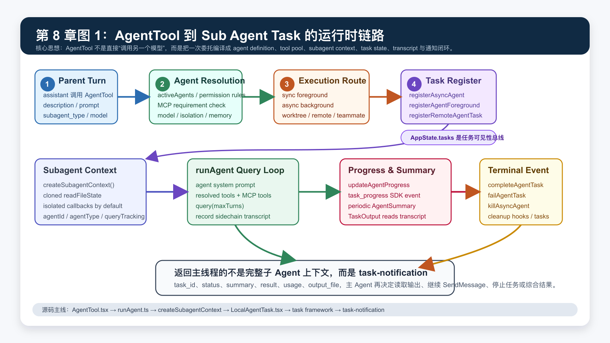
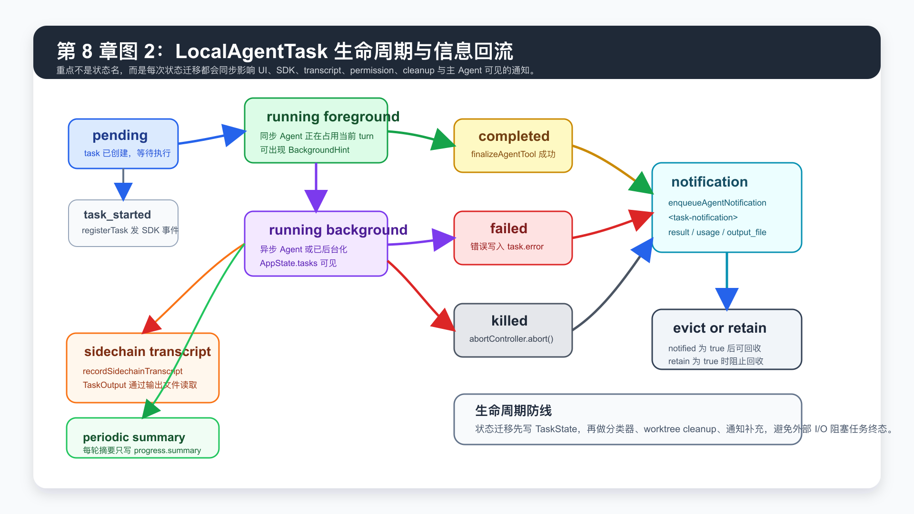

# 第 8 章：Sub Agent、Task 编排与多 Agent 协作系统

第七章讲了 MCP 与 Plugin。

它解决的是：

```text
能力从哪里来？
如何安装、启用、隔离、验证、注入？
```

这一章进入另一个关键问题：

```text
当一个 Agent 不应该独自完成所有事情时，系统如何把工作拆给其他 Agent？
```

这不是简单的“再调用一次模型”。

在 Claude Code 里，Sub Agent 背后至少牵涉这些系统：

- `AgentTool` 的 schema、权限检查与 agent definition 选择。
- `runAgent()` 的独立 query loop。
- `createSubagentContext()` 的上下文隔离与有限共享。
- `LocalAgentTask` 的任务注册、进度、后台化、终止与通知。
- `RemoteAgentTask` 的远程会话轮询。
- `InProcessTeammateTask` 的团队成员生命周期。
- `TaskOutput`、sidechain transcript、SDK events、hooks、summary service。
- `SendMessage`、`TaskStop`、coordinator worker 等继续和终止机制。

这一章的核心结论是：

```text
Sub Agent 是一条独立 Agent Loop。
Task 是让这条 Loop 可见、可控、可恢复、可回收的运行时外壳。
Multi Agent 协作是多个 Task 之间的隔离、通信与结果汇总。
```

如果第三章的 Agent Loop 是“主线程怎么思考”，这一章就是“主线程如何安全地把思考拆出去”。

## 1. 本章目标

读完这一章，你要能回答：

- `AgentTool` 为什么不只是一个普通 tool？
- `subagent_type` 如何映射到 `AgentDefinition`？
- 同步 Sub Agent、后台 Sub Agent、fork Sub Agent、remote agent、teammate 分别是什么？
- 为什么 Sub Agent 需要独立 `ToolUseContext`？
- 子 Agent 会继承哪些东西，又必须隔离哪些东西？
- `LocalAgentTaskState` 为什么要存 `agentId`、`selectedAgent`、`progress`、`pendingMessages`、`retain`、`diskLoaded`？
- 前台 Agent 如何在运行中变成后台 Agent？
- 后台 Agent 如何把结果作为 `<task-notification>` 回流给主 Agent？
- `TaskOutput`、sidechain transcript、SDK `task_progress` 分别解决什么问题？
- coordinator mode 为什么只让 coordinator 使用 `Agent`、`SendMessage`、`TaskStop` 等编排工具？
- 从 0 实现一个可控多 Agent 编排器时，最小架构应该是什么？

本章仍然讲架构，不写成使用手册。

## 2. 本章源码入口

建议从这些文件开始：

```text
claude-code/node_modules/@claude-code-best/builtin-tools/src/tools/AgentTool/AgentTool.tsx
claude-code/node_modules/@claude-code-best/builtin-tools/src/tools/AgentTool/runAgent.ts
claude-code/node_modules/@claude-code-best/builtin-tools/src/tools/AgentTool/agentToolUtils.ts
claude-code/node_modules/@claude-code-best/builtin-tools/src/tools/AgentTool/forkSubagent.ts
claude-code/node_modules/@claude-code-best/builtin-tools/src/tools/AgentTool/resumeAgent.ts
claude-code/src/Task.ts
claude-code/src/tasks.ts
claude-code/src/tasks/types.ts
claude-code/src/tasks/LocalAgentTask/LocalAgentTask.tsx
claude-code/src/tasks/RemoteAgentTask/RemoteAgentTask.tsx
claude-code/src/tasks/InProcessTeammateTask/types.ts
claude-code/src/tasks/InProcessTeammateTask/InProcessTeammateTask.tsx
claude-code/src/tasks/LocalMainSessionTask.ts
claude-code/src/utils/forkedAgent.ts
claude-code/src/utils/agentContext.ts
claude-code/src/utils/agentToolFilter.ts
claude-code/src/utils/task/framework.ts
claude-code/src/utils/task/TaskOutput.ts
claude-code/src/utils/task/sdkProgress.ts
claude-code/src/services/AgentSummary/agentSummary.ts
claude-code/src/coordinator/coordinatorMode.ts
claude-code/src/coordinator/workerAgent.ts
claude-code/src/entrypoints/sdk/coreSchemas.ts
claude-code/src/constants/tools.ts
```

这里有一个容易误解的点：

`AgentTool` 的实现位于内置工具包源码中，但它大量依赖 `claude-code/src` 下的运行时能力，例如 `LocalAgentTask`、`assembleToolPool`、`createSubagentContext`、`AgentSummary`、`RemoteAgentTask`。

所以阅读时要把它看成：

```text
内置工具包中的 AgentTool
  +
claude-code/src 中的任务、上下文、权限、UI、SDK 运行时
```

二者合起来才是完整的 Sub Agent 系统。

## 3. 为什么需要 Sub Agent

没有 Sub Agent 的 Coding Agent 会遇到三个瓶颈。

第一，主上下文会被污染。

一次代码库探索可能需要读几十个文件、跑多个命令、收集大量中间输出。

这些中间输出未必都应该进入主对话。

主 Agent 最终可能只需要一句：

```text
认证失败来自 validateSession() 对 expired session 的 user.id 空访问。
```

而不需要完整 grep 结果、文件片段、失败尝试和命令噪音。

第二，工作无法并行。

例如用户说：

```text
排查登录失败，同时看下最近的测试为什么变慢。
```

这两个任务可以独立探索。

主 Agent 如果串行做，会浪费时间，也会把两个问题的上下文混到一起。

第三，权限与责任边界不清。

研究型 Agent 应该只读。

实现型 Agent 可以改文件。

验证型 Agent 应该独立复核，不应该被实现过程的判断带偏。

如果所有工作都由主 Agent 完成，系统很难给不同任务配置不同 tools、model、permission mode、max turns、memory scope 和 hooks。

所以 Sub Agent 的本质不是“多一个聊天对象”。

它是一种隔离执行单元。

## 4. 总览图：AgentTool 到 Task



这张图可以按三层理解。

第一层是调度入口。

`AgentTool.call()` 接收模型发出的委托请求：

```text
description
prompt
subagent_type
model
run_in_background
name
team_name
mode
isolation
cwd
```

它不会马上进入模型调用，而是先做路由。

第二层是执行准备。

`AgentTool` 会选择 `AgentDefinition`、检查 MCP requirement、解析 model、组装 worker tools、建立 worktree 或 remote session，再决定走同步、异步、fork、teammate 或 remote 分支。

第三层是任务闭环。

真正运行子 Agent 的 `runAgent()` 会拥有独立的 `ToolUseContext`、独立 `agentId`、独立 transcript、独立 hooks，并通过 `LocalAgentTask` 或其他 task 类型把进度和终态回写到主运行时。

可以简化成：

```text
AgentTool input
  -> resolve AgentDefinition
  -> decide execution route
  -> register TaskState
  -> runAgent(query loop)
  -> update progress / transcript
  -> complete | fail | kill
  -> enqueue task-notification
  -> parent agent receives summarized result
```

这也是为什么 Claude Code 里的 `AgentTool` 是一个 orchestration tool。

它的职责不是“产出答案”，而是把一次委托编译成一个可管理的执行单元。

## 5. Task 抽象

`claude-code/src/Task.ts` 定义了统一任务模型。

关键类型有三个：

```text
TaskType
TaskStatus
TaskStateBase
```

`TaskType` 包含：

```text
local_bash
local_agent
remote_agent
in_process_teammate
local_workflow
monitor_mcp
dream
```

这说明 Claude Code 并没有把 Sub Agent 做成孤立特例。

它把 Agent、Shell、Remote、Workflow、Monitor 都放进统一 task model。

统一的 `TaskStatus` 是：

```text
pending
running
completed
failed
killed
```

这带来一个好处：

UI、SDK、通知、清理逻辑都可以围绕同一套状态机实现。

`TaskStateBase` 里有一些非常关键的字段：

| 字段 | 作用 |
| --- | --- |
| `id` | task 全局标识 |
| `type` | 任务类型 |
| `status` | 生命周期状态 |
| `description` | UI 和通知里显示的任务描述 |
| `toolUseId` | 关联触发它的 tool use |
| `startTime` / `endTime` | 统计耗时、排序、展示 |
| `outputFile` | 任务输出文件路径 |
| `outputOffset` | 增量读取输出 |
| `notified` | 是否已经通知过主 Agent 或 SDK |

注意 `outputFile`。

这说明任务输出不是都塞进 React state 或消息列表。

长任务输出会落到文件，再由 `TaskOutput`、`TaskOutputTool`、通知 XML 或 UI 去读取。

这对于后台 Agent 很重要，因为后台任务可能在主 turn 结束后继续运行。

## 6. Task 注册表

`claude-code/src/tasks.ts` 是 task registry。

它注册了：

```text
LocalShellTask
LocalAgentTask
RemoteAgentTask
DreamTask
LocalWorkflowTask
MonitorMcpTask
```

并提供：

```text
getAllTasks()
getTaskByType(type)
```

这个设计和 tools registry 很像。

每个 task 类型只需要实现：

```text
name
type
kill(taskId, setAppState)
```

为什么最小接口里只有 `kill`？

因为 task 的创建、渲染、运行通常由各自入口控制。

但“停止一个任务”必须被统一调度。

比如用户按下停止、coordinator 取消 worker、`TaskStop` 停掉后台 Agent、清理孤儿任务，都需要找到对应 task 类型并执行 kill。

## 7. LocalAgentTask 是 Sub Agent 的本地外壳

`claude-code/src/tasks/LocalAgentTask/LocalAgentTask.tsx` 是本地 Sub Agent 的关键文件。

它的 `LocalAgentTaskState` 在 `TaskStateBase` 之上增加了这些字段：

| 字段 | 作用 |
| --- | --- |
| `agentId` | 子 Agent 的 ID，也作为 task ID 使用 |
| `prompt` | 原始委托 prompt |
| `selectedAgent` | 解析出的 `AgentDefinition` |
| `agentType` | agent 类型，例如 `general-purpose`、`worker`、`main-session` |
| `model` | 可选 model override |
| `abortController` | 停止该 Agent 的控制器 |
| `result` / `error` | 终态结果或错误 |
| `progress` | tool 数、token 数、最近活动、summary |
| `retrieved` | 输出是否被读取过 |
| `messages` | 被 UI 持有时展示的 transcript 镜像 |
| `isBackgrounded` | 前台或后台 |
| `pendingMessages` | `SendMessage` 等中途追加消息 |
| `retain` | UI 正在持有该任务，阻止回收 |
| `diskLoaded` | 是否已从 sidechain transcript 启动加载 |
| `evictAfter` | 终态后延迟回收时间 |

这些字段说明一个事实：

```text
Sub Agent 既是一次模型调用，也是一条可观察的长期任务。
```

它需要被 UI 展示、被用户停止、被主 Agent 读取、被 SDK 订阅、被 transcript 恢复、被清理器回收。

所以不能只返回一个字符串。

## 8. 同步、异步与运行中后台化

Claude Code 里有两类本地 Agent 运行方式。

第一类是同步 Agent。

同步 Agent 会阻塞当前 `AgentTool` 调用，直到 `runAgent()` 结束，然后把结果作为 tool result 返回给主 Agent。

但同步 Agent 也会先注册成 foreground task。

原因是：如果它运行时间变长，用户可以把它后台化。

对应函数是：

```text
registerAgentForeground()
backgroundAgentTask()
unregisterAgentForeground()
```

同步路径一开始是：

```text
isBackgrounded = false
```

如果触发后台化，`backgroundAgentTask()` 会把它改成：

```text
isBackgrounded = true
```

同时 resolve 一个 `backgroundSignal`，让 `AgentTool` 当前的同步执行流中断，并把同一个 Agent 的后续执行转入后台闭包。

这是一种很实用的设计：

```text
短任务：同步返回，主 Agent 立即拿到结果。
长任务：先给用户看进度，必要时转后台，不阻塞主交互。
```

第二类是异步 Agent。

异步 Agent 一开始就通过 `registerAsyncAgent()` 注册：

```text
status = running
isBackgrounded = true
```

然后 `AgentTool.call()` 立即返回：

```text
status: async_launched
agentId
description
prompt
outputFile
canReadOutputFile
```

真正的 `runAgent()` 运行在 detached async lifecycle 里。

完成后，它不会把整个上下文塞回主 Agent，而是发送 task notification。

## 9. AgentTool 的路由职责

`AgentTool.call()` 做的事非常多，但可以归纳为七步。

第一步，读取当前 `AppState` 与 permission mode。

它需要知道当前 tools、MCP tools、agent definitions、permission rules、team context、是否 coordinator mode、是否 background task 被禁用。

第二步，解析 team spawn。

如果传了 `team_name` 和 `name`，并且 agent swarms 可用，就不是普通 Sub Agent，而是 teammate spawn。

这会走 `spawnTeammate()`。

第三步，解析 agent type。

如果传了 `subagent_type`，就从 `activeAgents` 找对应 `AgentDefinition`。

如果没有传，且 fork 功能开启，则走 fork path。

否则默认用 `general-purpose`。

第四步，检查 agent 是否被 permission rules 禁用。

例如 `Agent(code-reviewer)` 可以被 deny rule 拦截。

这和普通 tool permission 是同一套规则体系的一部分。

第五步，检查 required MCP servers。

某些 agent definition 可能声明它依赖特定 MCP server。

如果 server 还在 pending，`AgentTool` 会等待一段时间。

如果缺失，就拒绝启动该 agent。

第六步，决定运行方式。

影响因素包括：

```text
run_in_background
selectedAgent.background
coordinator mode
fork mode
assistant mode
proactive mode
background task disable flag
isolation
cwd
```

第七步，启动对应执行路径。

可能是：

```text
registerAsyncAgent + runAsyncAgentLifecycle
registerAgentForeground + runAgent
registerRemoteAgentTask
spawnTeammate
```

这就是 `AgentTool` 复杂的原因。

它站在模型工具调用和任务运行时之间，是整个 Sub Agent 系统的调度器。

## 10. AgentDefinition 是 Sub Agent 的配置边界

`AgentDefinition` 决定一个 Sub Agent 的行为边界。

从 SDK schema 可以看到它包含：

```text
description
tools
disallowedTools
prompt
model
mcpServers
criticalSystemReminder_EXPERIMENTAL
skills
initialPrompt
maxTurns
background
memory
effort
permissionMode
```

这些字段分别对应几类能力：

| 类别 | 字段 |
| --- | --- |
| 身份与选择 | `description`、`prompt` |
| 工具边界 | `tools`、`disallowedTools` |
| 模型边界 | `model`、`effort` |
| 生命周期 | `maxTurns`、`background` |
| 上下文 | `memory`、`skills`、`initialPrompt` |
| 外部能力 | `mcpServers` |
| 权限 | `permissionMode` |

所以 Sub Agent 不是“同一个 Agent 换一句 prompt”。

它有自己的工具集合、system prompt、MCP 附加能力、memory 策略、权限模式和轮次限制。

这让 Claude Code 可以内置不同类型的 agent：

```text
Explore
Plan
general-purpose
verification
worker
fork
plugin-provided agents
user-defined agents
```

每种 agent 都可以有不同的边界。

## 11. runAgent 是子 Agent 的独立 Agent Loop

`runAgent()` 是真正执行子 Agent 的地方。

它做的关键事情包括：

```text
resolve model
create agentId
prepare prompt messages
load user/system context
filter or omit expensive context
apply permission mode
resolve tools
build agent system prompt
execute SubagentStart hooks
register frontmatter hooks
preload skills
initialize agent-specific MCP servers
create subagent ToolUseContext
record sidechain transcript
create sub-agent trace
enter query loop
record every yielded message
cleanup MCP / hooks / caches / todos / shell tasks
```

这里最重要的是：

```text
runAgent() 不是递归调用 AgentTool。
runAgent() 是给子 Agent 新建一条 query loop。
```

它会调用 `query()`，并传入子 Agent 自己的：

```text
messages
systemPrompt
userContext
systemContext
canUseTool
toolUseContext
querySource
maxTurns
```

也就是说，子 Agent 和主 Agent 一样，拥有完整的：

```text
模型请求
工具调用
permission check
hooks
transcript
progress
cleanup
```

区别是这些资源经过了隔离和裁剪。

## 12. createSubagentContext 的隔离策略

`claude-code/src/utils/forkedAgent.ts` 里的 `createSubagentContext()` 是上下文隔离的核心。

默认策略是：

```text
mutable state 尽量隔离
session-scoped infrastructure 有条件共享
```

它会为子 Agent 创建新的：

```text
readFileState clone
AbortController child
nestedMemoryAttachmentTriggers
loadedNestedMemoryPaths
dynamicSkillDirTriggers
discoveredSkillNames
queryTracking
agentId
localDenialTracking
```

它也会默认把很多 UI mutation callback 置空：

```text
setAppState
setInProgressToolUseIDs
setResponseLength
addNotification
setToolJSX
setStreamMode
openMessageSelector
```

为什么要这样？

因为后台子 Agent 可能和主 Agent 并发运行。

如果它们共享同一个 UI state mutation 通道，子 Agent 的 tool 进度、权限弹窗、spinner、message selector 都可能污染主界面。

但有一个例外非常关键：

```text
setAppStateForTasks
```

即使普通 `setAppState` 在异步子 Agent 里是 no-op，`setAppStateForTasks` 仍然要能到达 root store。

原因是后台 Agent 可能还会启动 shell task、注册 task、清理 task。

如果这些任务不能写入根 `AppState.tasks`，用户看不到，也停不掉，还可能留下孤儿进程。

所以它的隔离不是绝对隔离，而是分层隔离：

| 资源 | 默认策略 |
| --- | --- |
| UI 操作 | 隔离 |
| 文件读取缓存 | clone |
| abort | 子 controller 或显式 override |
| task 注册 | 共享 root store |
| permission prompts | 后台 Agent 默认避免弹窗 |
| response metrics | 可选择共享 |
| attribution | 安全共享 |
| content replacement state | clone 或 resume 重建 |

这是一个很典型的 Agent runtime 设计原则：

```text
隔离会造成不可见。
共享会造成干扰。
真正需要的是按资源类型分层选择。
```

## 13. Tool 继承不是全量继承

Sub Agent 最危险的地方之一是 tool inheritance。

如果父 Agent 有所有工具，子 Agent 也直接继承所有工具，会出现几个问题：

- 子 Agent 可以继续创建子 Agent，导致递归失控。
- 后台 Agent 可能触发需要用户交互的工具。
- 敏感工具可能绕过主线程控制。
- 自定义 agent 的 `tools` 声明失去意义。

Claude Code 用两层机制控制它。

第一层是 `filterToolsForAgent()`。

它会过滤：

```text
ALL_AGENT_DISALLOWED_TOOLS
CUSTOM_AGENT_DISALLOWED_TOOLS
ASYNC_AGENT_ALLOWED_TOOLS
IN_PROCESS_TEAMMATE_ALLOWED_TOOLS
```

例如普通 async agent 默认不能使用：

```text
TaskOutput
ExitPlanMode
EnterPlanMode
AskUserQuestion
TaskStop
LocalMemoryRecall
VaultHttpFetch
```

`AgentTool` 本身也通常会被禁止给子 Agent，避免递归。

第二层是 `filterParentToolsForFork()`。

fork path 为了 prompt cache，需要给子 Agent 传父工具数组，并设置 `useExactTools=true`。

这会绕过常规 `resolveAgentTools()`。

所以 fork path 必须先对父工具数组做一次额外过滤。

这就是 `claude-code/src/utils/agentToolFilter.ts` 的作用。

它的注释说得很直接：

```text
fork path 用 useExactTools=true 时，会跳过 filterToolsForAgent。
因此必须在传入父工具数组之前补一层 disallow-list。
```

这类“双层防线”在 Agent 系统里非常常见。

因为很多能力为了性能或缓存会走特殊路径，而特殊路径最容易绕过通用安全逻辑。

## 14. 权限继承与 permissionMode

Sub Agent 的 permission mode 不是简单复制父 Agent。

`runAgent()` 会基于以下信息构造 agent 的 permission context：

```text
parent appState.toolPermissionContext
agentDefinition.permissionMode
isAsync
canShowPermissionPrompts
allowedTools
parent bypassPermissions / acceptEdits / auto mode
```

几个关键规则：

第一，后台 Agent 默认不能显示权限弹窗。

它会设置：

```text
shouldAvoidPermissionPrompts = true
```

否则后台任务可能在没有 UI 的情况下卡住。

第二，如果 Agent 显式允许 bubble prompt，或 `canShowPermissionPrompts` 为 true，后台 Agent 可以等待自动检查后再弹权限。

这用于更复杂的交互场景。

第三，如果传了 `allowedTools`，会替换 session-level allow rules。

这避免父线程里临时允许过的工具泄漏给子 Agent。

第四，父线程处于 `bypassPermissions` 或 `acceptEdits` 时，优先级更高。

这保证全局模式不会被 agent definition 随意覆盖。

权限系统的目标不是让子 Agent 更自由。

而是让每个委托任务拥有刚好够用的权限。

## 15. 生命周期图



这张图强调三件事。

第一，`running` 不只有一种。

对于 `LocalAgentTask`，运行中至少分为：

```text
running foreground
running background
```

前台 Agent 可以被用户观察，也可以后台化。

后台 Agent 通过 task store、output file、SDK events 和 notification 被观察。

第二，终态迁移要先写 task state。

`runAsyncAgentLifecycle()` 完成时，会先调用：

```text
completeAgentTask()
```

失败时会先调用：

```text
failAgentTask()
```

被停止时会先调用：

```text
killAsyncAgent()
```

然后才做 classifier、worktree cleanup、通知补充等可能变慢的工作。

这样 `TaskOutput(block=true)` 可以尽快解除阻塞，UI 和 SDK 也能看到任务已经进入终态。

第三，通知和回收是分开的。

终态任务不会立刻从 `AppState.tasks` 消失。

它需要先发通知，设置 `notified=true`。

如果 UI 正在查看该 task，`retain=true` 会阻止回收。

如果没有持有，`evictAfter` 到期后可以清理。

这避免了两个问题：

- 主 Agent 还没读到结果，task 就被回收。
- 用户正在看面板，任务突然消失。

## 16. task-notification 是结果回流协议

后台 Agent 完成后，主 Agent 看到的不是一个普通 assistant message。

系统会通过 `enqueueAgentNotification()` 注入一个用户侧消息，格式类似：

```xml
<task-notification>
  <task-id>...</task-id>
  <tool-use-id>...</tool-use-id>
  <output-file>...</output-file>
  <status>completed|failed|killed</status>
  <summary>...</summary>
  <result>...</result>
  <usage>...</usage>
  <worktree>...</worktree>
</task-notification>
```

这是一种非常实用的内部协议。

它比“直接把子 Agent 最终回答当普通用户消息”更好，因为它携带结构化信息：

| 字段 | 用途 |
| --- | --- |
| `task-id` | 后续 `SendMessage` 或 `TaskStop` 的目标 |
| `tool-use-id` | 关联原始 AgentTool 调用 |
| `output-file` | 读取完整任务输出 |
| `status` | 判断成功、失败、停止 |
| `summary` | 快速显示结果 |
| `result` | 子 Agent 最终文本 |
| `usage` | token、tool use、duration |
| `worktree` | 隔离工作区结果 |

主 Agent 收到 notification 后，可以继续：

```text
综合多个结果
读取 outputFile
继续同一个 agent
停止错误方向的 agent
让另一个 agent 验证
报告给用户
```

这就是多 Agent 汇总的基础。

## 17. sidechain transcript 与 TaskOutput

后台 Agent 的完整对话不能只存在内存里。

原因很简单：

- 任务可能很长。
- UI 可能稍后才打开面板。
- 主 Agent 可能需要读取完整输出。
- session 可能恢复。
- SDK 客户端需要重建 subagent 面板。

所以 `runAgent()` 会用 `recordSidechainTranscript()` 记录子 Agent 的消息。

`LocalAgentTask` 会用 `initTaskOutputAsSymlink()` 把 task output 指向子 Agent transcript。

`TaskOutput` 再负责按需读取、tail、spill to disk、增量更新。

这形成一个链路：

```text
runAgent yielded message
  -> recordSidechainTranscript(agentId)
  -> outputFile symlink
  -> TaskOutput / TaskOutputTool / UI panel
  -> parent agent or user reads result
```

这比把所有消息塞进 `AppState` 更稳。

`AppState` 只保存 UI 当前需要的状态。

完整历史落在 transcript 文件里。

这也是 `retain` 和 `diskLoaded` 存在的原因：

```text
retain: UI 正在持有这个 task，不要回收。
diskLoaded: UI 已经从磁盘加载过 transcript，后续只需要 append live suffix。
```

## 18. Progress 与 Summary

长时间运行的 Agent 需要持续可见。

Claude Code 用两套机制。

第一套是直接 progress。

`updateProgressFromMessage()` 会从 assistant message 中统计：

```text
tool_use count
input tokens
output tokens
last activity
recent activities
```

再写入：

```text
task.progress
```

同时 `emitTaskProgress()` 会给 SDK 发送：

```text
task_progress
```

这让 VS Code、Scuttle、CLI print mode 等外部消费者能看到后台 Agent 正在做什么。

第二套是周期性 summary。

`claude-code/src/services/AgentSummary/agentSummary.ts` 会每隔一段时间 fork 当前子 Agent transcript，生成 1-2 句进度摘要。

它不会让摘要 Agent 使用工具。

它只读取已有 transcript，输出类似：

```text
Reading runAgent.ts
Fixing null check in validate.ts
Running auth module tests
```

摘要写到：

```text
task.progress.summary
```

这样 UI 可以显示更像“人能读懂的当前动作”，而不只是最后一个 tool 名。

注意这个 summary 自身也是 Agent 能力，但它被限制得很窄：

```text
只总结，不用工具，不影响原任务状态。
```

## 19. Fork Sub Agent

fork path 是一种特殊 Sub Agent。

普通 Sub Agent 通常只拿到用户给它的 prompt。

fork Sub Agent 会继承父 Agent 的完整对话上下文和父 system prompt。

它的目的不是“选择一个专用 agent type”，而是：

```text
把当前主 Agent 的上下文 fork 出一个后台 worker。
```

`forkSubagent.ts` 里可以看到几个关键点：

- 不传 `subagent_type` 时，在特定功能开启下触发 fork。
- fork child 使用 synthetic agent type：`fork`。
- fork child 的 `tools` 是 `['*']`，但会通过 `filterParentToolsForFork()` 去掉不该继承的工具。
- fork child 使用父线程已经渲染好的 system prompt，避免重算 prompt 导致 prompt cache 失效。
- fork child 通过 placeholder tool result 构造相同前缀，尽量复用 prompt cache。
- fork child 被禁止再次 fork。

fork 的价值是：

```text
当主 Agent 已经积累了大量上下文，子任务又确实需要这些上下文时，fork 比重新描述背景更高效。
```

但它的风险也明显：

```text
上下文太多，权限边界更难控制。
```

所以 fork path 的工具过滤和递归保护非常重要。

## 20. Worktree 与 Remote 隔离

`AgentTool` 支持 `isolation`。

本地隔离是：

```text
isolation: "worktree"
```

它会创建临时 git worktree，让子 Agent 在隔离副本里工作。

这样子 Agent 可以修改文件、提交、验证，而不直接污染父工作区。

如果 worktree 没有变更，可以清理。

如果有变更，会保留路径并在 notification 里返回。

远程隔离是：

```text
isolation: "remote"
```

这会通过 remote session 创建远程 Agent task。

本地侧用 `RemoteAgentTask` 保存：

```text
sessionId
command
title
todoList
log
remoteTaskType
pollStartedAt
```

然后持续轮询 remote session events。

这说明 Claude Code 的 task model 不只服务本地进程。

它也可以把外部会话抽象成 task。

只要能提供：

```text
task id
status
output
notification
kill
```

就能进入同一套 UI 与 SDK 管理体系。

## 21. InProcessTeammateTask

普通 Sub Agent 适合“一次委托，一段执行，完成后汇报”。

但团队协作场景更复杂。

`InProcessTeammateTask` 表示同进程团队成员。

它和 `LocalAgentTask` 不同：

| 维度 | LocalAgentTask | InProcessTeammateTask |
| --- | --- | --- |
| 身份 | `agentId` + `agentType` | `agentName@teamName` |
| 生命周期 | 跑完即终态 | 可 idle，等待后续任务 |
| 通信 | task notification / SendMessage | mailbox / pendingUserMessages |
| 权限 | 来自 agent definition | 每个 teammate 可有独立 permission mode |
| UI | background agent panel | teammate transcript / team UI |
| 上下文 | sidechain transcript | capped UI messages + full local loop |

`InProcessTeammateTaskState` 包含：

```text
identity
prompt
selectedAgent
abortController
currentWorkAbortController
awaitingPlanApproval
permissionMode
progress
messages
pendingUserMessages
isIdle
shutdownRequested
onIdleCallbacks
```

这说明 teammate 更像一个“长期 actor”。

它不只是执行一次 prompt。

它可以：

- 空闲。
- 接收新消息。
- 维护自己的权限模式。
- 进入 plan approval。
- 在 team 内协作。
- 被 shutdown。

这就是多 Agent 系统从“并行任务”走向“多角色协作”的分界线。

## 22. Coordinator Mode 与 worker agent

`claude-code/src/coordinator/workerAgent.ts` 定义了 coordinator mode 的内置 worker。

worker 的定位很明确：

```text
由 coordinator 通过 AgentTool 启动。
负责 research、implementation、verification。
使用标准工具集，但不能拿到内部编排工具。
```

它会从 `ASYNC_AGENT_ALLOWED_TOOLS` 里构造 worker tools，并排除：

```text
TeamCreate
TeamDelete
SendMessage
SyntheticOutput
```

coordinator 自己的工具集合则更窄：

```text
Agent
TaskStop
SendMessage
SyntheticOutput
```

这是一种非常典型的角色分离：

```text
Coordinator 负责拆分、调度、综合、纠偏。
Worker 负责执行具体任务。
```

coordinator prompt 还强调：

- 不要用一个 worker 去检查另一个 worker。
- 不要把简单命令也委托出去。
- launch worker 后要等待 `<task-notification>`。
- research 可以并行。
- implementation 要控制写冲突。
- verification 应该独立。
- 继续 worker 时要给清晰、综合过的 spec。

这些不是普通 prompt 技巧。

它们是在语言层面补足多 Agent runtime 的调度策略。

代码负责隔离和生命周期。

prompt 负责协作纪律。

## 23. Hooks 与 Sub Agent 生命周期

Sub Agent 不是绕过 hooks 的。

SDK schema 里有专门事件：

```text
SubagentStart
SubagentStop
TaskCreated
TaskCompleted
```

`BaseHookInputSchema` 还明确区分：

```text
agent_id
agent_type
```

`agent_id` 表示这是子 Agent 上下文里的调用。

主线程即使用 `--agent` 启动，也不会有 `agent_id`。

这个区别很重要。

因为 hooks 可能要判断：

```text
这是主 Agent 在操作文件？
还是某个 subagent 在操作文件？
```

`runAgent()` 启动时会执行 `executeSubagentStartHooks()`。

如果 agent definition 自带 hooks，会注册 frontmatter hooks。

并且 agent 的 Stop hooks 会被转换成 `SubagentStop`。

这让插件或企业策略可以控制：

- 子 Agent 启动时注入额外上下文。
- 子 Agent 停止前做检查。
- teammate task 创建或完成时触发自动化。
- 子 Agent 工具调用是否允许。

多 Agent 系统如果没有 hooks，很难被企业环境治理。

## 24. AgentContext：并发下的身份隔离

`claude-code/src/utils/agentContext.ts` 使用 `AsyncLocalStorage` 存储当前 agent 身份。

它支持两类上下文：

```text
SubagentContext
TeammateAgentContext
```

为什么不用全局 `AppState`？

因为后台 Agent 可以并发运行。

如果全局只存一个“当前 agentId”，Agent A 和 Agent B 的事件会互相覆盖。

`AsyncLocalStorage` 的作用是：

```text
每条 async execution chain 有自己的 agent identity。
```

这样 analytics、telemetry、hooks、transcript、permission、request boundary 都能知道当前操作属于哪个 Agent。

这也是为什么 `AgentTool` 启动异步 Agent 时，会用：

```text
runWithAgentContext(asyncAgentContext, () => ...)
```

同步 Agent、后台化后的 Agent、resume Agent、main-session background task、in-process teammate 都会进入对应 agent context。

没有这层隔离，多 Agent 的可观测性会很快失真。

## 25. SendMessage 与 resume

后台 Agent 完成后，不一定只能丢弃。

系统可以继续同一个 Agent。

核心原因是：

```text
sidechain transcript 保存了它的上下文。
agent metadata 保存了 agentType、description、worktreePath。
```

`resumeAgentBackground()` 会：

- 读取 agent transcript。
- 过滤 unresolved tool uses、orphan thinking、空白 assistant message。
- 重建 content replacement state。
- 读取 agent metadata。
- 如果原 worktree 仍存在，继续在该 worktree 运行。
- 根据 metadata 重新选择 `AgentDefinition`。
- 注册新的 async task。
- 用 `runAsyncAgentLifecycle()` 继续跑。

这就是为什么 coordinator prompt 会强调：

```text
如果同一个 worker 已经探索了相关文件，继续它可能比新建 worker 更好。
```

继续不是“发一条聊天消息”那么简单。

它要复原 transcript、权限、工具、worktree、summary、notification 和 task state。

## 26. 什么时候应该用 Sub Agent

Sub Agent 不是越多越好。

适合使用 Sub Agent 的场景：

- 独立研究任务。
- 多个互不依赖的问题可以并行。
- 中间输出很大，不想污染主上下文。
- 需要一个只读 reviewer 或 verifier。
- 长任务需要后台运行。
- 需要不同 tools、permission mode、model 或 memory。
- 需要 worktree 隔离修改。

不适合使用 Sub Agent 的场景：

- 一次 `rg` 或读一个文件就能解决。
- 用户在等一个很小的直接修改。
- 任务依赖主 Agent 刚刚形成但尚未写清楚的判断。
- 多个 Agent 会同时改同一组文件。
- 子 Agent 需要频繁问用户问题。
- 权限边界不清楚。

从架构上看，Sub Agent 的成本包括：

```text
额外模型调用
额外 transcript
额外 tool calls
调度复杂度
结果综合成本
权限和清理成本
```

所以它应该用于降低复杂度，而不是制造复杂度。

## 27. 从 0 实现一个可控多 Agent 编排器

如果从 0 实现一个类似系统，最小架构可以这样拆。

第一步，定义 agent definition。

至少包含：

```ts
type AgentDefinition = {
  agentType: string
  description: string
  systemPrompt: string
  tools?: string[]
  disallowedTools?: string[]
  model?: string | 'inherit'
  maxTurns?: number
  background?: boolean
  permissionMode?: PermissionMode
}
```

第二步，定义 task state。

至少包含：

```ts
type TaskState = {
  id: string
  type: 'local_agent' | 'remote_agent' | 'shell'
  status: 'pending' | 'running' | 'completed' | 'failed' | 'killed'
  description: string
  outputFile: string
  notified: boolean
  startTime: number
  endTime?: number
}
```

第三步，实现 agent context fork。

要明确哪些共享，哪些隔离：

```text
messages: 子 Agent 自己的
tools: 根据 definition 解析
permission: 根据父上下文和 definition 合成
abort: 子 controller
state mutation: 默认隔离
task store: 共享
transcript: 独立文件
```

第四步，实现 task lifecycle。

至少要有：

```text
register
progress
complete
fail
kill
notify
evict
```

第五步，实现 result protocol。

不要只返回纯文本。

至少要返回：

```text
task_id
status
summary
result
usage
output_file
```

第六步，实现 continuation。

后台任务需要能继续：

```text
read transcript
read metadata
reconstruct context
append user prompt
start new lifecycle
```

第七步，实现 coordinator discipline。

多 Agent 不是 runtime 自动变聪明。

你还需要 prompt 和策略告诉 coordinator：

- 什么时候并行。
- 什么时候串行。
- 什么时候继续旧 worker。
- 什么时候新建 worker。
- 什么时候停止。
- 如何写自包含 worker prompt。
- 如何综合结果。
- 如何验证实现。

没有这层纪律，多 Agent 很容易变成并发噪音。

## 28. 常见设计陷阱

第一个陷阱：让子 Agent 共享完整父状态。

这会让子 Agent 可以改 UI、污染当前 spinner、覆写主线程 tool 状态。

正确做法是按资源分层共享。

第二个陷阱：后台 Agent 可以弹交互权限。

这会让任务卡住。

正确做法是后台任务默认避免权限弹窗，只允许明确 bubble 的场景。

第三个陷阱：子 Agent 直接继承所有工具。

这会造成递归、敏感工具泄漏和权限绕过。

正确做法是 definition allow-list、global disallow-list、async allow-list 多层过滤。

第四个陷阱：只在内存里存子 Agent 输出。

后台任务、恢复、UI 面板、SDK 都会因此不可靠。

正确做法是 sidechain transcript 加 task output 文件。

第五个陷阱：完成通知不结构化。

纯文本结果不方便继续、停止、读取 output、统计 usage。

正确做法是结构化 task notification。

第六个陷阱：多个 Agent 同时改同一批文件。

这会制造冲突。

正确做法是 coordinator 控制写任务串行，或使用 worktree 隔离。

第七个陷阱：让 verifier 继承 implementer 的上下文。

验证会被实现假设污染。

正确做法是让 verifier 拿明确 spec 和 changed files，独立验证。

## 29. 和前几章的关系

现在可以把前几章串起来。

第三章的 Agent Loop 提供：

```text
query()
model stream
tool calls
message normalization
max turns
```

第四章的 Tool Runtime 提供：

```text
ToolUseContext
canUseTool
permission check
progress
tool result
```

第五章的 Context Engineering 提供：

```text
messages
memory
attachments
compaction
tool result storage
```

第六章的 Prompt Pipeline 提供：

```text
system prompt
agent override
tool schema
cache boundary
provider request
```

第七章的 MCP 与 Plugin 提供：

```text
external tools
plugin agents
plugin hooks
agent-specific MCP servers
skills
```

第八章把这些能力组合成：

```text
可委托、可并行、可后台、可隔离、可恢复、可汇总的多 Agent 系统。
```

Sub Agent 不是独立模块。

它是前面所有运行时能力的一次组合测试。

## 30. 推荐阅读顺序

如果要按源码继续深入，建议这样读：

```text
1. claude-code/node_modules/@claude-code-best/builtin-tools/src/tools/AgentTool/AgentTool.tsx
2. claude-code/node_modules/@claude-code-best/builtin-tools/src/tools/AgentTool/runAgent.ts
3. claude-code/src/utils/forkedAgent.ts
4. claude-code/src/tasks/LocalAgentTask/LocalAgentTask.tsx
5. claude-code/node_modules/@claude-code-best/builtin-tools/src/tools/AgentTool/agentToolUtils.ts
6. claude-code/src/utils/task/framework.ts
7. claude-code/src/services/AgentSummary/agentSummary.ts
8. claude-code/node_modules/@claude-code-best/builtin-tools/src/tools/AgentTool/resumeAgent.ts
9. claude-code/src/tasks/RemoteAgentTask/RemoteAgentTask.tsx
10. claude-code/src/tasks/InProcessTeammateTask/types.ts
11. claude-code/src/coordinator/coordinatorMode.ts
12. claude-code/src/coordinator/workerAgent.ts
```

读的时候不要先陷入 UI 细节。

先抓住这条主线：

```text
AgentTool 解析委托
  -> runAgent 建立独立 loop
  -> createSubagentContext 隔离上下文
  -> LocalAgentTask 暴露生命周期
  -> task notification 回流结果
```

UI、SDK、hooks、summary、remote、teammate 都是围绕这条主线扩展出来的。

## 31. 本章结论

Claude Code 的 Sub Agent 系统可以概括成一句话：

```text
AgentTool 负责委托编译，runAgent 负责独立执行，Task 负责生命周期治理。
```

这个设计让多 Agent 协作具备几个关键性质：

- 子 Agent 有自己的上下文，不会直接污染主 Agent。
- 子 Agent 有自己的工具和权限边界。
- 长任务可以后台运行。
- 主 Agent 可以继续对话，不必等待所有工作完成。
- 完成结果通过结构化 notification 回流。
- 子 Agent 可以被停止、继续、查看输出。
- 多个 worker 可以并行，但由 coordinator 汇总。
- teammate 可以变成长期 actor，而不只是一次性任务。

真正的多 Agent 系统不是“多开几个模型调用”。

它必须有：

```text
身份
隔离
权限
任务状态
输出协议
恢复机制
清理机制
协调纪律
```

下一章可以继续讲 Hooks、事件系统与自动化治理。

因为当 Sub Agent、MCP、Plugin 都能扩展运行时时，系统必须回答一个更底层的问题：

```text
谁能在什么时机观察、修改或阻止运行时行为？
```
