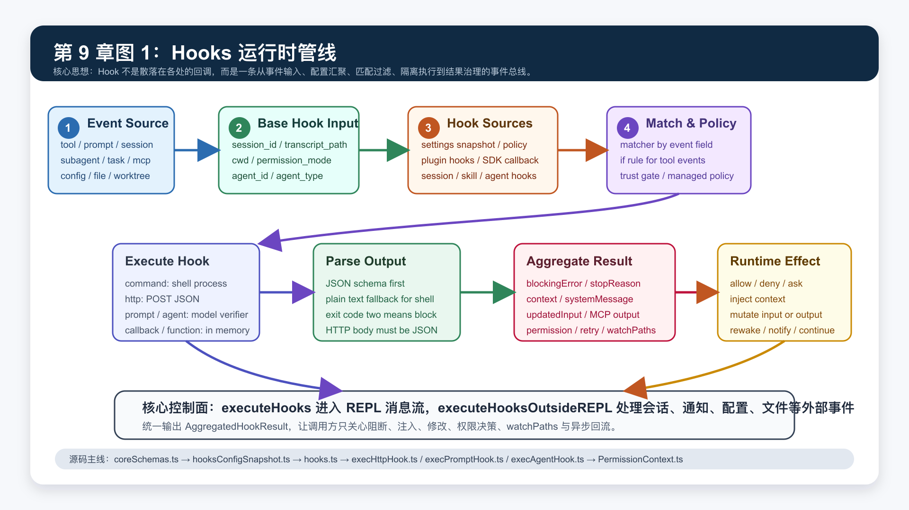
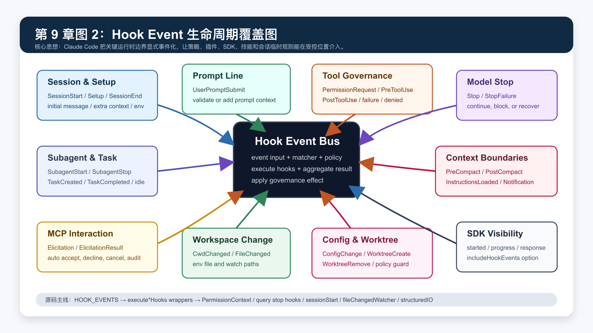

# 第 9 章：Hooks、事件系统与自动化治理

第八章讲了 Sub Agent、Task 与多 Agent 协作。

它回答的是：

```text
当一个 Agent 不该独自完成所有事情时，系统如何把工作拆给其他 Agent？
```

这一章进入另一个问题：

```text
当运行时正在执行时，谁能在什么时机观察、修改或阻止它？
```

这就是 Hooks 系统的职责。

Hooks 不是“命令执行前后跑个脚本”这么简单。

在 Claude Code 里，Hooks 覆盖了：

- 会话启动、初始化、结束。
- 用户提交 prompt。
- 工具权限请求、工具执行前、工具执行后、工具失败后。
- 模型响应停止、停止失败。
- Sub Agent 启动和停止。
- Task 创建和完成。
- compaction 前后。
- MCP elicitation 请求和结果。
- 配置文件变化。
- instruction 文件加载。
- cwd 和被 watch 文件变化。
- worktree 创建与删除。
- SDK hook callback 与 hook event stream。
- plugin、skill、agent frontmatter、session 临时 hook。

这一章的核心结论是：

```text
Hooks 是 Claude Code 的事件治理总线。

它把运行时关键边界显式事件化，再用配置、策略、插件、SDK 与会话临时规则去观察、增强或阻断这些事件。
```

如果第四章的权限系统解决“工具能不能执行”，第七章的 Plugin 系统解决“能力从哪里扩展”，第八章的 Task 系统解决“工作如何被托管”，那么第九章解决的是：

```text
扩展能力如何在运行时被治理？
```

## 1. 本章目标

读完这一章，你要能回答：

- `HOOK_EVENTS` 为什么不是简单的字符串枚举？
- `HookInput` 为什么必须带 `session_id`、`transcript_path`、`cwd`、`permission_mode`、`agent_id`？
- hook 配置为什么要分 settings snapshot、plugin hooks、SDK callback、session hooks、skill/agent frontmatter？
- `matcher` 和 `if` 分别解决什么问题？
- `executeHooks()` 和 `executeHooksOutsideREPL()` 为什么要分开？
- command、http、prompt、agent、callback、function hook 的边界分别是什么？
- 为什么 HTTP hook 要做 URL allowlist、env var allowlist、SSRF guard？
- 为什么 shell hook 在交互模式下要受 workspace trust gate 保护？
- `PermissionRequest` hook 如何和用户权限弹窗、SDK 权限弹窗并行竞速？
- `PreToolUse`、`PostToolUse`、`PostToolUseFailure` 分别能改变什么？
- `Stop` hook 为什么可以让模型继续运行？
- `SessionStart` 和 `Setup` hook 为什么能注入 initial user message、additional context、watch paths？
- `FileChanged`、`CwdChanged` 为什么要配合 `CLAUDE_ENV_FILE`？
- 异步 hook 的 `async`、`asyncTimeout`、`asyncRewake` 解决什么问题？
- 从 0 实现一个可治理 hook bus 时，最小架构应该是什么？

本章仍然讲架构，不写成用户配置手册。

## 2. 本章源码入口

建议从这些文件开始：

```text
claude-code/src/entrypoints/sdk/coreSchemas.ts
claude-code/src/types/hooks.ts
claude-code/src/schemas/hooks.ts
claude-code/src/utils/hooks.ts
claude-code/src/utils/hooks/execPromptHook.ts
claude-code/src/utils/hooks/execHttpHook.ts
claude-code/src/utils/hooks/execAgentHook.ts
claude-code/src/utils/hooks/hookEvents.ts
claude-code/src/utils/hooks/AsyncHookRegistry.ts
claude-code/src/utils/hooks/hooksConfigSnapshot.ts
claude-code/src/utils/hooks/hooksConfigManager.ts
claude-code/src/utils/hooks/hooksSettings.ts
claude-code/src/utils/hooks/sessionHooks.ts
claude-code/src/utils/hooks/registerFrontmatterHooks.ts
claude-code/src/utils/hooks/registerSkillHooks.ts
claude-code/src/utils/hooks/fileChangedWatcher.ts
claude-code/src/utils/plugins/loadPluginHooks.ts
claude-code/src/hooks/toolPermission/PermissionContext.ts
claude-code/src/cli/structuredIO.ts
claude-code/src/query.ts
claude-code/src/query/stopHooks.ts
claude-code/src/utils/sessionStart.ts
claude-code/src/utils/claudemd.ts
claude-code/src/utils/settings/types.ts
```

这组文件分成五层：

| 层级 | 代表文件 | 职责 |
| --- | --- | --- |
| 事件与协议 | `coreSchemas.ts`、`types/hooks.ts`、`schemas/hooks.ts` | 定义事件、输入、输出、配置 schema |
| 配置汇聚 | `hooksConfigSnapshot.ts`、`hooksSettings.ts`、`loadPluginHooks.ts`、`sessionHooks.ts` | 把不同来源的 hook 合成运行时配置 |
| 执行引擎 | `hooks.ts`、`execHttpHook.ts`、`execPromptHook.ts`、`execAgentHook.ts`、`AsyncHookRegistry.ts` | 匹配、执行、解析、聚合 |
| 接入点 | `PermissionContext.ts`、`query.ts`、`stopHooks.ts`、`sessionStart.ts`、`fileChangedWatcher.ts` | 在运行时关键边界触发 hook |
| 可观测性 | `hookEvents.ts`、`structuredIO.ts` | 把 hook started/progress/response 暴露给 SDK 或 debug |

阅读时不要先从某个单独事件开始。

先抓住这条总线：

```text
runtime event
  -> HookInput
  -> getHooksConfig
  -> getMatchingHooks
  -> execute hook
  -> parse output
  -> aggregate result
  -> apply effect
```

## 3. 为什么需要 Hooks

没有 Hooks 的 Agent Runtime 会遇到四个问题。

第一，策略只能写死在核心代码里。

例如：

```text
某些 Bash 命令必须经过额外审计。
某些 MCP elicitation 必须自动拒绝。
某些 SessionStart 必须注入项目环境说明。
某些 Stop 前必须验证计划是否真的完成。
```

如果每种策略都改核心代码，运行时会迅速变成硬编码规则堆。

第二，插件没有安全的介入点。

Plugin 可以提供 commands、agents、tools、MCP servers。

但如果插件想在工具执行前做审计、在任务完成时发通知、在 SessionStart 时注入上下文，就需要一个受控入口。

这个入口不能让插件任意 monkey patch 主循环。

它必须是显式事件。

第三，企业治理需要比用户配置更高优先级。

用户项目可以配置 hooks。

企业策略也可以配置 hooks。

但企业策略必须能做到：

```text
禁用所有 hooks。
只允许运行 managed hooks。
限制 HTTP hook 的 URL。
限制 HTTP hook 能插值哪些环境变量。
限制 hooks 自定义面只来自 plugin。
```

这些都不是普通 callback 能解决的。

第四，自动化要能回流到 Agent Loop。

某些 hook 只是日志。

某些 hook 会注入 context。

某些 hook 会阻断工具。

某些 hook 会改变工具 input。

某些 hook 会让模型继续运行。

某些异步 hook 完成后要唤醒模型。

所以 Hooks 不能只是一组 side effect。

它必须有结构化输出协议和聚合规则。

## 4. 总览图：Hooks 运行时管线



这张图可以按七步理解。

第一步，运行时产生事件。

事件可能来自工具、prompt、session、Sub Agent、MCP、config、file watcher、worktree 或 query stop。

第二步，调用方构造 `HookInput`。

所有 hook input 都有一组基础字段：

```text
session_id
transcript_path
cwd
permission_mode
agent_id
agent_type
```

事件自己的字段再叠加上去。

例如 `PreToolUse` 会有：

```text
tool_name
tool_input
tool_use_id
```

`SessionStart` 会有：

```text
source
```

`FileChanged` 会有：

```text
file_path
event
```

第三步，系统汇聚 hook 来源。

来源不只 settings：

```text
settings snapshot
plugin hooks
SDK callbacks
session hooks
skill frontmatter hooks
agent frontmatter hooks
function hooks
builtin callbacks
```

第四步，执行匹配与策略过滤。

`matcher` 负责按事件字段匹配。

`if` 负责对工具事件做权限规则式匹配。

trust gate 和 managed policy 决定某些 hook 是否根本不允许运行。

第五步，执行 hook。

Claude Code 支持多种 hook 类型：

```text
command
http
prompt
agent
callback
function
```

这些类型不是语法糖。

它们代表不同执行边界：

| 类型 | 执行边界 | 典型用途 |
| --- | --- | --- |
| `command` | 本地 shell 进程 | 调脚本、读写环境文件、做本地审计 |
| `http` | 远端 POST JSON | 企业网关、外部审批、通知服务 |
| `prompt` | 单轮模型判定 | 轻量语义判断 |
| `agent` | 多轮受限 Agent | Stop 前深度验证 |
| `callback` | SDK host 回调 | 让外部 SDK 主机参与 hook |
| `function` | 内存函数 | session 内部临时校验 |

第六步，解析输出。

输出可以是结构化 JSON，也可以是 shell plain text。

HTTP hook 必须返回 JSON。

command hook 的 stdout 如果以 JSON 开头，会走 schema 解析；否则按普通文本处理。

第七步，聚合为 `AggregatedHookResult`。

调用方不应该关心某个 hook 是 shell、HTTP、SDK callback 还是 function。

调用方只关心这些治理结果：

```text
是否阻断？
是否要继续？
是否注入 additionalContext？
是否修改 tool input？
是否更新 MCP tool output？
是否给出 permission decision？
是否请求 retry？
是否返回 watchPaths？
是否要发送异步通知？
```

这就是 Hooks 系统的核心抽象。

## 5. Hook Event 生命周期覆盖图



`HOOK_EVENTS` 在 `claude-code/src/entrypoints/sdk/coreSchemas.ts` 中定义。

它不是随手列出来的事件名，而是运行时边界的清单。

可以按八类理解。

第一类是会话生命周期：

```text
SessionStart
Setup
SessionEnd
```

第二类是用户输入：

```text
UserPromptSubmit
```

第三类是工具治理：

```text
PermissionRequest
PreToolUse
PostToolUse
PostToolUseFailure
PermissionDenied
```

第四类是模型 turn 结束：

```text
Stop
StopFailure
```

第五类是 Sub Agent 与任务：

```text
SubagentStart
SubagentStop
TaskCreated
TaskCompleted
TeammateIdle
```

第六类是上下文边界：

```text
PreCompact
PostCompact
InstructionsLoaded
Notification
```

第七类是 MCP 交互：

```text
Elicitation
ElicitationResult
```

第八类是配置、文件、工作区：

```text
ConfigChange
CwdChanged
FileChanged
WorktreeCreate
WorktreeRemove
```

这个覆盖面说明 Claude Code 对 hook 的定位不是“工具前后脚本”。

它是运行时控制面。

## 6. HookInput：事件输入为什么要标准化

`BaseHookInputSchema` 统一了所有 hook 的基础字段。

最重要的字段是：

```text
session_id
transcript_path
cwd
permission_mode
agent_id
agent_type
```

这些字段解决三个问题。

第一，hook 需要知道它属于哪条会话。

Claude Code 可以同时存在主会话、Sub Agent 会话、hook agent 会话、SDK 会话。

没有 `session_id`，session-scoped hook 很容易泄漏到其他执行链路。

第二，hook 需要能读取 transcript。

例如 Stop hook 或 agent hook 可能需要验证：

```text
模型刚刚是否真的完成了计划？
有没有遗漏用户明确要求？
```

这时 `transcript_path` 就是外部自动化理解上下文的边界。

第三，hook 需要知道自己在主 Agent 还是 Sub Agent 中运行。

`agent_id` 和 `agent_type` 让 hook 可以区分：

```text
主线程 Stop
code-reviewer SubagentStop
worker SubagentStart
hook-agent 内部验证
```

这也是为什么 `createBaseHookInput()` 会优先使用 Sub Agent context 中的 agent type。

Hook 的基础输入不是为了方便。

它是隔离和审计的前提。

## 7. Hook 配置 schema

`claude-code/src/schemas/hooks.ts` 定义了 hook 配置形状。

顶层是按事件名分组：

```ts
type HooksSettings = Partial<Record<HookEvent, HookMatcher[]>>

type HookMatcher = {
  matcher?: string
  hooks: HookCommand[]
}
```

一个事件下面可以有多个 matcher。

每个 matcher 下面可以有多个 hook。

大致形态是：

```json
{
  "PreToolUse": [
    {
      "matcher": "Bash",
      "hooks": [
        {
          "type": "command",
          "command": "node scripts/audit-tool.js",
          "timeout": 30
        }
      ]
    }
  ]
}
```

`HookCommandSchema` 支持四类持久化 hook：

```text
command
prompt
http
agent
```

运行时还会出现两类非持久化 hook：

```text
callback
function
```

其中 `callback` 来自 SDK 或内部注册，`function` 是 session scoped 内存函数，不能写进 settings。

每个 hook 还可以有：

```text
timeout
statusMessage
once
if
```

`once` 常用于 skill hook。

`registerSkillHooks()` 会给 `once: true` 的 hook 注册 `onHookSuccess`，成功一次后把它从 session hooks 里移除。

`if` 是一个容易被忽略但很重要的字段。

它让 hook 不只是按工具名匹配，还能按权限规则语法匹配输入。

例如：

```text
Bash(git *)
Read(/src/**)
```

这样同一个 `PreToolUse` 事件中，hook 可以只拦截某类命令或某类路径。

## 8. matcher：事件字段匹配

`matcher` 的语义跟事件有关。

`hooks.ts` 里 `getMatchingHooks()` 会根据 event 取不同字段作为 match query。

典型对应关系是：

| 事件 | matcher 对应字段 |
| --- | --- |
| `PreToolUse` / `PostToolUse` / `PermissionRequest` | `tool_name` |
| `SessionStart` | `source` |
| `Setup` | `trigger` |
| `PreCompact` / `PostCompact` | `trigger` |
| `Notification` | `notification_type` |
| `SessionEnd` | `reason` |
| `StopFailure` | `error` |
| `SubagentStart` / `SubagentStop` | `agent_type` |
| `Elicitation` / `ElicitationResult` | `mcp_server_name` |
| `ConfigChange` | `source` |
| `InstructionsLoaded` | `load_reason` |
| `FileChanged` | 文件名 |

`matchesPattern()` 支持三种常见形态：

```text
空 matcher 或 *：匹配全部。
普通字符串：精确匹配。
pipe 分隔或正则：匹配多个候选。
```

这让 hook 配置可以保持简单。

例如 `FileChanged` 的 matcher 可以是：

```text
.envrc|.env
```

这表示在当前 cwd 下 watch 这两个文件名。

## 9. if：工具事件的二级过滤

`if` 不是所有事件都能用。

`prepareIfConditionMatcher()` 只对这些事件生效：

```text
PreToolUse
PostToolUse
PostToolUseFailure
PermissionRequest
```

原因是 `if` 依赖工具输入和权限规则匹配器。

例如：

```json
{
  "type": "command",
  "command": "node audit-git.js",
  "if": "Bash(git push *)"
}
```

这个 hook 的含义是：

```text
只在 Bash 工具输入匹配 git push 时执行。
```

它和 `matcher: "Bash"` 的关系是：

```text
matcher 先判断是不是 Bash 工具。
if 再判断 Bash 输入是否符合策略。
```

这类似前端事件系统里的：

```text
先按事件类型监听 click。
再在 handler 里判断 target、modifier key、dataset。
```

只不过 Claude Code 把二级判断也做成了声明式配置。

## 10. Hook 配置来源

`getHooksConfig()` 是理解 hooks 系统的关键。

它会合并几类来源。

第一类，settings snapshot。

`hooksConfigSnapshot.ts` 在启动时捕获 hook 配置。

这样 hook 执行时不需要每次重新读 settings 文件，也能避免配置半更新状态影响当前执行。

第二类，registered hooks。

这包括：

```text
SDK callbacks
plugin hooks
builtin callbacks
```

plugin hooks 由 `loadPluginHooks()` 从启用插件中读取，转换成 runtime hook matcher，再注册进全局 hook registry。

第三类，session hooks。

`sessionHooks.ts` 用 `sessionId` 分组保存临时 hooks。

这类 hook 不落盘，通常来自：

```text
agent frontmatter
skill frontmatter
运行时 function hook
agent hook 内部结构化输出保护
```

第四类，session function hooks。

它们不能被序列化成 settings schema，所以单独从 `getSessionFunctionHooks()` 取出。

这个设计的核心是：

```text
持久配置、插件能力、SDK 扩展、会话临时策略可以共存，但必须在执行时统一成同一种 matcher 列表。
```

## 11. settings snapshot 与企业策略

`hooksConfigSnapshot.ts` 里有三个策略开关很关键。

第一，managed settings 的 `disableAllHooks`。

如果 policy settings 里设置了它，所有 hooks 都不运行。

第二，managed settings 的 `allowManagedHooksOnly`。

如果 policy settings 里设置了它，只运行 managed hooks。

用户、项目、本地 hooks 被忽略。

第三，非 managed settings 的 `disableAllHooks`。

非 managed settings 不能禁用 managed hooks。

所以这种情况会被解释成：

```text
只运行 managed hooks。
```

此外还有 `strictPluginOnlyCustomization`。

如果 hooks 这个 customization surface 被限制为 plugin-only，那么用户、项目、本地 hooks 会被挡掉。

这些策略体现了一个原则：

```text
用户可以自定义自动化，但不能绕过上层管理策略。
```

## 12. Plugin hooks 的原子替换

`claude-code/src/utils/plugins/loadPluginHooks.ts` 里有一个细节很重要。

`loadPluginHooks()` 会：

```text
读取所有 enabled plugins。
把 plugin hooksConfig 转成 native hook matchers。
clearRegisteredPluginHooks()
registerHookCallbacks(allPluginHooks)
```

也就是说，插件 hooks 的刷新是“先组装完整新集合，再原子替换”。

源码注释里还专门提到过一个历史风险：

```text
如果清理 plugin hook cache 时直接清掉已注册 hooks，Stop hooks 可能失效。
```

所以现在的设计是：

```text
clearPluginHookCache 只失效缓存。
真正清理已注册 plugin hooks 放在 loadPluginHooks 的原子 swap 内。
```

这是典型的运行时配置刷新问题。

不能让中间状态暴露给执行引擎。

## 13. Session hooks 与 frontmatter hooks

`registerFrontmatterHooks()` 和 `registerSkillHooks()` 把 agent 或 skill frontmatter 中声明的 hooks 注册成 session hooks。

它们不是全局 hooks。

它们按 sessionId 隔离。

这解决两个问题。

第一，agent 自己声明的 hook 只应该影响这个 agent。

不能让一个 `code-reviewer` agent 的 Stop hook 泄漏到主会话或其他 worker。

第二，skill hook 可能只在当前会话激活。

它应该随着 session 结束被清理，而不是写进全局 settings。

`registerFrontmatterHooks()` 对 agent 还有一个特殊处理：

```text
agent frontmatter 中的 Stop hook 会被转换成 SubagentStop。
```

原因是 Sub Agent 结束时触发的是 `SubagentStop`。

这是一种很实用的兼容层：

```text
作者可以按“这个 agent 停止时”来理解 Stop。
运行时把它映射到真正的 SubagentStop 事件。
```

## 14. executeHooks：进入 REPL 消息流的 hook

`executeHooks()` 是核心执行器。

它是 async generator。

这不是偶然选择。

Hook 执行过程中可能产生多种中间消息：

```text
hook_progress
hook_success
hook_blocking_error
hook_non_blocking_error
additional_context
prompt request
```

如果只返回最终结果，UI 和模型流都无法及时展示 hook 状态。

`executeHooks()` 的主流程可以简化成：

```text
if hooks disabled:
  return

if trust gate fails:
  return

baseInput = createBaseHookInput(...)
matchingHooks = getMatchingHooks(event, input, config)

for every matching hook in parallel:
  run by type
  parse output
  convert to HookResult

aggregate HookResult into AggregatedHookResult
yield messages and final governance result
```

注意这里是并行执行。

多个 hook 不应该因为配置顺序互相阻塞。

但并行执行带来一个问题：

```text
如果多个 hook 都给出治理结果，谁优先？
```

Claude Code 对 permission behavior 做了明确优先级：

```text
deny > ask > allow
```

这符合安全系统的常见原则。

只要有一个 hook 明确拒绝，就不能被另一个 allow 覆盖。

## 15. executeHooksOutsideREPL：外部生命周期 hook

不是所有 hook 都运行在 Agent Loop 消息流里。

例如：

```text
SessionEnd
Notification
PreCompact
PostCompact
ConfigChange
CwdChanged
FileChanged
InstructionsLoaded
WorktreeCreate
WorktreeRemove
```

这些事件可能发生在主 REPL 之外。

所以 `hooks.ts` 里还有 `executeHooksOutsideREPL()`。

它和 `executeHooks()` 的关键区别是：

```text
它不会把消息暴露给模型。
它更像后台生命周期处理器。
prompt hook 和 agent hook 在这里不支持。
function hook 在这里不允许。
```

为什么 prompt/agent hook 不适合 outside REPL？

因为它们需要模型查询、工具上下文和消息流。

在 SessionEnd 或 ConfigChange 这种外部事件中启动模型 loop，容易制造递归和生命周期混乱。

所以 outside REPL 只保留可控的 command、http、callback 类执行。

## 16. Hook 输出协议

`types/hooks.ts` 定义了 hook 输出协议。

最核心的是：

```text
SyncHookJSONOutput
AsyncHookJSONOutput
```

同步 JSON 输出可以包含：

```text
continue
suppressOutput
stopReason
decision
reason
systemMessage
hookSpecificOutput
```

其中 `hookSpecificOutput` 是按事件定制的结构化结果。

例如 `PreToolUse` 可以返回：

```text
permissionDecision
permissionDecisionReason
updatedInput
additionalContext
```

`PostToolUse` 可以返回：

```text
additionalContext
updatedMCPToolOutput
```

`PermissionRequest` 可以返回：

```text
decision allow or deny
updatedInput
updatedPermissions
message
interrupt
```

`SessionStart` 可以返回：

```text
additionalContext
initialUserMessage
watchPaths
```

`CwdChanged` 和 `FileChanged` 可以返回：

```text
watchPaths
```

这就是为什么 hook output 不能只是 stdout 字符串。

不同事件的治理能力不同。

输出协议必须表达这些差异。

## 17. exit code 与 JSON decision

Command hook 仍然保留 shell 世界的 exit code 语义。

常见规则是：

```text
exit code 0：成功。
exit code 2：阻断。
其他 exit code：非阻断错误，通常只展示给用户或 debug。
```

但 JSON 输出可以表达更细粒度决策。

例如：

```json
{
  "decision": "block",
  "reason": "Do not run deployment commands in this repository"
}
```

或：

```json
{
  "hookSpecificOutput": {
    "hookEventName": "PreToolUse",
    "updatedInput": {
      "command": "git status --short"
    }
  }
}
```

`parseHookOutput()` 会优先解析 JSON。

如果 stdout 不是 JSON，则按普通文本处理。

HTTP hook 不走这个宽松规则。

HTTP hook 必须返回 JSON，因为远端服务没有 shell exit code 这种本地约定。

## 18. command hook：本地进程边界

Command hook 是最像传统 hook 的类型。

它会启动 shell 命令，并把 HookInput JSON 传给命令。

`execCommandHook()` 会构造一组环境变量。

重要的包括：

```text
CLAUDE_PROJECT_DIR
CLAUDE_PLUGIN_ROOT
CLAUDE_PLUGIN_DATA
CLAUDE_ENV_FILE
```

`CLAUDE_ENV_FILE` 只在特定环境 hook 中有意义，例如：

```text
SessionStart
Setup
CwdChanged
FileChanged
```

hook 可以往这个文件写 shell exports，让后续 BashTool 命令拿到更新后的环境。

这类似 `direnv` 的思路：

```text
目录或文件变化
  -> hook 计算新环境
  -> 写入 env file
  -> 后续 shell 命令读取
```

但 command hook 的风险也最高。

所以它受 workspace trust gate 和 sandbox 策略影响。

## 19. http hook：远端治理边界

HTTP hook 通过 `execHttpHook()` 执行。

它会把 HookInput JSON POST 到配置的 URL。

HTTP hook 有几层安全控制。

第一，URL allowlist。

settings 里有：

```text
allowedHttpHookUrls
```

如果这个字段存在，hook URL 必须匹配其中一个 pattern。

空数组表示全部阻断。

第二，header env var allowlist。

HTTP hook 的 header value 支持：

```text
$VAR_NAME
${VAR_NAME}
```

但只有 hook 自己声明的 `allowedEnvVars` 可以被插值。

如果 settings 里还配置了：

```text
httpHookAllowedEnvVars
```

则最终可用变量是二者交集。

第三，header value 会清理 CR、LF、NUL。

这是为了避免 header injection。

第四，SSRF guard。

如果没有走 sandbox proxy 或环境代理，HTTP hook 会用 `ssrfGuardedLookup` 阻止私有、link-local 等风险地址。

第五，sandbox network proxy。

当 sandboxing 启用时，HTTP hook 会走 sandbox network proxy。

这让网络访问也进入受控通道。

这些机制说明：

```text
HTTP hook 是企业自动化入口，但不能变成秘密外传通道。
```

## 20. prompt hook 与 agent hook

`prompt` hook 和 `agent` hook 都使用模型，但边界不同。

`execPromptHook()` 是轻量判定。

它会把 hook prompt 和 HookInput 组合成一个用户消息，然后调用小模型，要求返回：

```json
{
  "ok": true
}
```

或：

```json
{
  "ok": false,
  "reason": "..."
}
```

如果 `ok` 是 false，hook 阻断。

这种 hook 适合：

```text
判断一句 prompt 是否符合某个语义条件。
判断工具调用描述是否和策略冲突。
```

`execAgentHook()` 更重。

它会启动一个受限多轮 Agent。

这个 Agent 可以读取 transcript，使用过滤后的 tools，并通过 structured output tool 返回：

```text
ok true or false
reason
```

源码里它还限制了最大 turn 数，并过滤掉 agent 不应该使用的工具。

这种 hook 适合 Stop 前深度验证：

```text
计划是否真的完成？
代码是否真的修改？
测试是否真的执行？
```

prompt hook 像“快速裁判”。

agent hook 像“独立审查员”。

## 21. callback hook 与 function hook

`callback` hook 主要服务 SDK。

`structuredIO.ts` 里的 `createHookCallback()` 会把 hook 调用转成 SDK control request：

```text
subtype: hook_callback
callback_id
input
tool_use_id
```

这让 SDK host 可以参与 hook 决策。

例如 VS Code 扩展、远程宿主或自定义 SDK controller 可以在外部处理 hook，然后返回标准 `HookJSONOutput`。

`function` hook 是内存函数。

它只存在于 session 内部，不能持久化。

`sessionHooks.ts` 里明确把 function hook 和普通 hook 分开，因为 function 没有稳定可序列化身份。

这类 hook 适合内部临时校验。

例如 agent hook 为了强制 structured output，会注册一个 session-level stop hook，完成后再清理。

## 22. PermissionRequest hook：权限弹窗前的自动化治理

`PermissionRequest` 是 hooks 系统和权限系统的交汇点。

在 TUI/React 路径里，`PermissionContext.ts` 的 `runHooks()` 会在权限 prompt 需要展示时执行：

```text
executePermissionRequestHooks(...)
```

hook 可以返回 allow。

此时它还能返回：

```text
updatedInput
updatedPermissions
```

`handleHookAllow()` 会持久化 permission updates，并返回 allow decision。

hook 也可以返回 deny。

如果返回 `interrupt`，会触发 abort controller。

在 SDK structured IO 路径里，逻辑更有意思。

`structuredIO.ts` 会让两件事并行发生：

```text
PermissionRequest hooks 开始执行。
SDK host 权限弹窗立即发出。
```

然后：

```text
Promise.race([hookPromise, sdkPromise])
```

谁先给出明确结果，谁赢。

如果 hook 先决定 allow 或 deny，就取消 SDK prompt。

如果 SDK 用户先响应，就使用 SDK 结果，hook 后续结果被忽略。

这个设计非常关键。

它避免了一个差体验：

```text
慢 hook 阻塞权限弹窗，用户看不到任何可操作界面。
```

同时也保留了自动化治理能力。

## 23. PreToolUse、PostToolUse 与失败 hook

工具相关 hook 有四条线。

第一，`PreToolUse`。

它发生在工具执行前。

它可以：

```text
阻断工具。
修改 tool input。
注入 additional context。
给出 permission decision。
```

这是最强的工具治理点。

第二，`PostToolUse`。

它发生在工具执行成功后。

它可以：

```text
注入 additional context。
修改 MCP tool output。
让输出进入后续模型上下文。
```

第三，`PostToolUseFailure`。

它发生在工具失败后。

它能看到：

```text
tool_name
tool_input
tool_use_id
error
error_type
is_interrupt
is_timeout
```

这适合做失败审计、错误分类、自动建议。

第四，`PermissionDenied`。

它发生在 auto mode classifier 拒绝工具调用之后。

hook 可以返回 `retry`，告诉模型可以重试。

这四个事件覆盖了工具调用的完整治理面：

```text
请求权限
执行前
执行后
失败后
自动拒绝后
```

## 24. Stop hook：模型响应结束前的最后关口

`Stop` hook 在 Claude 即将结束当前 response 时触发。

它不是普通的“结束通知”。

如果 Stop hook 阻断，系统可以把错误信息回给模型，让模型继续运行。

`query/stopHooks.ts` 的 `handleStopHooks()` 做了几件事：

```text
运行 prompt suggestion。
运行 memory extraction。
运行 auto-dream。
清理 computer-use。
执行 Stop 或 SubagentStop hooks。
把 hook blocking error 汇总成 system message。
必要时阻止本轮结束，让模型继续。
```

这就是 Stop hook 的价值：

```text
它让“模型准备停下”也变成可治理事件。
```

例如可以用它实现：

```text
如果任务清单没有完成，不允许停止。
如果测试没有跑，不允许宣称完成。
如果计划中有未处理项，把它反馈给模型继续。
```

Sub Agent 中会触发 `SubagentStop`。

agent frontmatter 里的 Stop hook 会在注册时转换成 `SubagentStop`，从而让 agent 作者不用理解底层事件差异。

## 25. SessionStart 与 Setup：启动期注入

`utils/sessionStart.ts` 里有两个关键函数：

```text
processSessionStartHooks()
processSetupHooks()
```

SessionStart hook 可以返回：

```text
additionalContext
initialUserMessage
watchPaths
```

这些会产生几类效果。

`additionalContext` 会被包装成 `hook_additional_context` 注入模型上下文。

`initialUserMessage` 会通过 side channel 作为待提交用户消息。

`watchPaths` 会交给 file watcher，后续文件变化再触发 `FileChanged` hook。

`processSessionStartHooks()` 还有一个细节：

它会先尝试 `loadPluginHooks()`。

这保证插件 hooks 在 session start 阶段就能参与。

如果 load plugin hooks 失败，会记录错误但继续启动。

这符合启动期的韧性要求：

```text
插件 hook 失败不应该让整个会话无法进入。
```

## 26. CwdChanged 与 FileChanged：环境自动化

`fileChangedWatcher.ts` 把 cwd 和文件变化接入 hook 系统。

初始化时，它会从 hooks snapshot 中解析 `FileChanged` matcher。

例如：

```text
.envrc|.env
```

会被解析成当前 cwd 下的 watch paths。

此外 hook 输出也可以返回动态 `watchPaths`。

所以 watch 集合由两部分组成：

```text
静态 matcher paths
动态 hook output watchPaths
```

当 cwd 变化时，`onCwdChangedForHooks()` 会：

```text
清理 cwd env files。
执行 CwdChanged hooks。
更新 dynamicWatchPaths。
重新按新 cwd 解析静态 matcher paths。
重启 watcher。
```

当 watched file 变化时，会执行：

```text
executeFileChangedHooks(file_path, event)
```

hook 可以写 `CLAUDE_ENV_FILE`，让后续 BashTool 环境更新。

这类 hook 把“项目环境变化”变成了运行时事件。

它适合处理：

```text
.envrc 更新。
工具链版本文件变化。
工作目录切换后的环境重新加载。
项目自定义 setup 状态刷新。
```

## 27. MCP Elicitation hook

第七章讲过 MCP。

MCP server 有时会发起 elicitation，请求用户输入。

Hooks 系统提供两类事件：

```text
Elicitation
ElicitationResult
```

`Elicitation` 发生在 MCP server 请求用户输入时。

hook 可以返回：

```text
accept
decline
cancel
content
```

这允许企业策略自动处理某些 MCP 请求。

例如：

```text
内部 server 请求非敏感选项，可以自动 accept。
未知 server 请求凭据字段，自动 decline。
```

`ElicitationResult` 发生在用户响应之后。

hook 可以审计或改写结果。

这说明 Hooks 不只治理 Claude Code 自己的工具。

它也治理外部 MCP 能力与用户交互之间的边界。

## 28. ConfigChange 与 policy 设置

`ConfigChange` hook 在配置文件变化时触发。

它可以阻止某些配置变更应用到当前 session。

但有一个关键例外：

```text
policy_settings 不能被 ConfigChange hook 阻断。
```

这是正确的安全边界。

如果普通 hook 可以阻断 policy settings，用户或项目 hook 就可能反过来屏蔽企业策略。

所以 Claude Code 在执行 `executeConfigChangeHooks()` 时，对 policy settings 的阻断结果会忽略。

这体现了 hooks 系统的层级原则：

```text
hook 可以治理运行时，但不能治理比自己更高优先级的策略来源。
```

## 29. Worktree hooks

Hooks 还覆盖 worktree 生命周期：

```text
WorktreeCreate
WorktreeRemove
```

`WorktreeCreate` hook 可以接收建议名称，并返回创建出的 worktree 路径。

`WorktreeRemove` hook 可以接收要删除的 worktree path。

这让隔离工作区创建不必完全写死在核心实现里。

对于大型 monorepo，worktree 创建可能涉及：

```text
sparse checkout
symlink node_modules
挂载缓存目录
企业内部 workspace provisioning
```

把它事件化以后，Claude Code 核心只需要关心：

```text
我要一个隔离工作区。
它的路径是什么。
最后如何清理。
```

具体 provisioning 可以交给 hook。

## 30. 异步 hook 与 reawake

有些 hook 不应该阻塞当前 turn。

例如：

```text
发送通知。
后台审计。
异步收集环境状态。
长耗时验证。
```

所以 hook JSON output 支持：

```json
{
  "async": true,
  "asyncTimeout": 15000
}
```

`AsyncHookRegistry.ts` 会登记 pending async hook。

后续 `checkForAsyncHookResponses()` 会检查进程是否完成，读取 stdout，找出同步 JSON 响应，再把它转换成 hook response。

`asyncRewake` 是更进一步的能力。

如果异步 hook 结束后需要唤醒模型，可以让后台执行路径在特定退出条件下 enqueue pending notification。

这样异步自动化不是“跑完就没人知道”。

它能回流成：

```text
task-notification
```

让 Agent 在后续 turn 里看到结果。

这和第八章的后台 Task 通知思想是一致的。

## 31. Hook events 的 SDK 可观测性

`utils/hooks/hookEvents.ts` 提供了独立的 hook execution event bus。

它和主消息流分开。

事件类型包括：

```text
started
progress
response
```

默认总是发出的低噪声事件是：

```text
SessionStart
Setup
```

如果 SDK 设置了 `includeHookEvents`，或运行在 remote 模式，就可以打开更多 hook event。

这个模块还有一个 pending buffer。

如果 event handler 尚未注册，最多缓存一批 pending events。

这解决了启动早期的事件丢失问题。

它的意义是：

```text
hook 执行不仅影响运行时，还需要被外部宿主观察。
```

对 IDE、远程 worker、SDK host 来说，知道 hook 正在执行、输出了什么、如何结束，是调试和产品体验的一部分。

## 32. Trust gate 与 sandbox

Hooks 的安全边界非常重要。

`shouldSkipHookDueToTrust()` 有一个核心规则：

```text
交互模式下，所有 hooks 都要求 workspace trust。
非交互或 SDK 隐式信任。
```

源码注释里明确提到，过去 SessionEnd、SubagentStop 这类看似低风险的 hook 也出现过安全问题。

所以 trust gate 被集中到一个函数里。

不要让某些事件绕过 trust。

Command hook 还有 sandbox 相关处理。

当 sandboxing 启用时，bash hooks 可以在网络受限的沙箱策略下执行。

设计动机是：

```text
hook 可能需要访问文件系统做本地自动化。
但不应该随意把内容通过网络带走。
```

需要网络的自动化应该优先走 HTTP hook。

因为 HTTP hook 有 URL allowlist、env var allowlist、SSRF guard 和 sandbox proxy。

这就是两个 hook 类型的安全分工：

```text
command hook：本地自动化。
http hook：受控网络自动化。
```

## 33. 最小实现：从 0 做一个 Hook Bus

如果要从 0 实现一个简化版，可以先定义事件和输入。

```ts
type HookEvent =
  | 'SessionStart'
  | 'UserPromptSubmit'
  | 'PermissionRequest'
  | 'PreToolUse'
  | 'PostToolUse'
  | 'Stop'

type BaseHookInput = {
  sessionId: string
  transcriptPath: string
  cwd: string
  permissionMode?: string
  agentId?: string
  agentType?: string
}

type ToolHookEvent =
  | 'PermissionRequest'
  | 'PreToolUse'
  | 'PostToolUse'

type HookInput =
  | (BaseHookInput & {
      event: ToolHookEvent
      toolName: string
      toolInput: Record<string, unknown>
      toolUseId: string
    })
  | (BaseHookInput & {
      event: 'SessionStart'
      source: 'startup' | 'resume' | 'compact'
    })
  | (BaseHookInput & {
      event: 'Stop'
      lastAssistantText: string
    })
```

然后定义 hook 配置。

```ts
type HookConfig =
  | {
      type: 'command'
      command: string
      timeoutMs?: number
      if?: string
    }
  | {
      type: 'http'
      url: string
      headers?: Record<string, string>
      timeoutMs?: number
    }
  | {
      type: 'callback'
      callback: (input: HookInput, signal: AbortSignal) => Promise<HookOutput>
    }

type HookMatcher = {
  matcher?: string
  hooks: HookConfig[]
}

type HookRegistry = Partial<Record<HookEvent, HookMatcher[]>>
```

再定义输出。

```ts
type HookOutput = {
  continue?: boolean
  suppressOutput?: boolean
  stopReason?: string
  decision?: 'approve' | 'block'
  reason?: string
  additionalContext?: string
  updatedInput?: Record<string, unknown>
  permission?: {
    behavior: 'allow' | 'deny' | 'ask'
    message?: string
  }
}

type AggregatedHookResult = {
  blocked: boolean
  stopReason?: string
  additionalContexts: string[]
  updatedInput?: Record<string, unknown>
  permissionBehavior?: 'allow' | 'deny' | 'ask'
}
```

接着实现 matcher。

```ts
function getMatchValue(input: HookInput): string {
  switch (input.event) {
    case 'PreToolUse':
    case 'PermissionRequest':
    case 'PostToolUse':
      return input.toolName
    case 'SessionStart':
      return input.source
    case 'Stop':
      return ''
  }
}

function matches(pattern: string | undefined, value: string): boolean {
  if (!pattern || pattern === '*') return true
  if (pattern.includes('|')) {
    return pattern.split('|').some(part => part.trim() === value)
  }
  return pattern === value
}
```

然后实现执行和聚合。

```ts
async function executeHooks(
  registry: HookRegistry,
  input: HookInput,
  signal: AbortSignal,
): Promise<AggregatedHookResult> {
  const matchValue = getMatchValue(input)
  const matchers = registry[input.event] ?? []
  const hooks = matchers.flatMap(matcher =>
    matches(matcher.matcher, matchValue) ? matcher.hooks : [],
  )

  const outputs = await Promise.all(
    hooks.map(hook => runOneHook(hook, input, signal)),
  )

  return aggregate(outputs)
}

function aggregate(outputs: HookOutput[]): AggregatedHookResult {
  const result: AggregatedHookResult = {
    blocked: false,
    additionalContexts: [],
  }

  for (const output of outputs) {
    if (output.decision === 'block') {
      result.blocked = true
      result.stopReason = output.reason
    }
    if (output.additionalContext) {
      result.additionalContexts.push(output.additionalContext)
    }
    if (output.updatedInput) {
      result.updatedInput = output.updatedInput
    }
    if (output.permission) {
      result.permissionBehavior = mergePermission(
        result.permissionBehavior,
        output.permission.behavior,
      )
    }
  }

  return result
}

function mergePermission(
  a: 'allow' | 'deny' | 'ask' | undefined,
  b: 'allow' | 'deny' | 'ask',
) {
  const order = { allow: 1, ask: 2, deny: 3 }
  if (!a) return b
  return order[b] > order[a] ? b : a
}
```

最后把它接进工具执行。

```ts
async function runToolWithHooks(
  toolCall: { name: string; input: Record<string, unknown>; id: string },
  ctx: RuntimeContext,
) {
  const pre = await executeHooks(ctx.hooks, {
    event: 'PreToolUse',
    sessionId: ctx.sessionId,
    transcriptPath: ctx.transcriptPath,
    cwd: ctx.cwd,
    permissionMode: ctx.permissionMode,
    toolName: toolCall.name,
    toolInput: toolCall.input,
    toolUseId: toolCall.id,
  }, ctx.abortSignal)

  if (pre.blocked) {
    return {
      ok: false,
      error: pre.stopReason ?? 'Blocked by hook',
    }
  }

  const finalInput = pre.updatedInput ?? toolCall.input
  const output = await ctx.tools.call(toolCall.name, finalInput)

  await executeHooks(ctx.hooks, {
    event: 'PostToolUse',
    sessionId: ctx.sessionId,
    transcriptPath: ctx.transcriptPath,
    cwd: ctx.cwd,
    permissionMode: ctx.permissionMode,
    toolName: toolCall.name,
    toolInput: finalInput,
    toolUseId: toolCall.id,
  }, ctx.abortSignal)

  return output
}
```

这个最小版本已经具备 Hooks 系统的骨架：

```text
事件
输入协议
配置
匹配
执行
输出
聚合
接入点
```

Claude Code 的实现复杂很多，但复杂性主要来自：

```text
更多事件
更多 hook 类型
多来源配置
SDK callback
插件系统
企业策略
异步 hook
权限和 sandbox
UI 与 SDK 可观测性
```

## 34. 和前端工程的类比

如果从前端角度理解，Hooks 系统像几种机制的组合。

第一，它像 DOM 事件系统。

```text
click / submit / input
```

对应 Claude Code 的：

```text
PreToolUse / UserPromptSubmit / Stop
```

事件有输入、有 listener、有传播后的结果。

第二，它像 Vite/Rollup plugin hooks。

```text
resolveId
load
transform
buildEnd
```

对应 Claude Code 的：

```text
SessionStart
PreToolUse
PostToolUse
Stop
```

插件不是乱改构建器，而是在声明的生命周期点介入。

第三，它像 service worker。

service worker 可以拦截 request，决定：

```text
放行
改写
返回缓存
拒绝
```

`PreToolUse` 也类似：

```text
放行
改写 input
注入 context
阻断
```

第四，它像 CI/CD gate。

Stop hook 可以在“准备结束”前做最终检查。

这和部署前 gate 很像：

```text
测试没跑，不允许发布。
审计不通过，不允许合并。
计划未完成，不允许结束。
```

Claude Code 的 Hooks 是这些机制在 Agent Runtime 里的组合。

## 35. 工业实践：Hooks 系统设计原则

第一，事件要少而稳定。

Hook event 一旦暴露给用户、插件和 SDK，就会变成外部契约。

不要为每个内部函数都加 event。

应该只在稳定边界上加：

```text
输入边界
权限边界
工具边界
模型停止边界
配置边界
外部能力边界
任务生命周期边界
```

第二，输出要结构化。

纯 stdout 很快不够用。

必须能表达：

```text
block
allow
deny
ask
updatedInput
additionalContext
watchPaths
retry
```

第三，权限决策要有合并规则。

多个 hook 并行时，不能让最后一个 wins。

安全决策应该有确定优先级。

第四，外部自动化要有沙箱和白名单。

尤其是 HTTP hook。

它天然会碰到 secret、网络、SSRF、header injection。

第五，配置刷新要原子。

Plugin hook reload 不能出现短暂空窗。

第六，session 级 hook 必须按 sessionId 隔离。

否则 Sub Agent、hook agent、主 Agent 会互相污染。

第七，生命周期 hook 要区分 REPL 内外。

不要在所有地方都能启动 prompt hook 或 agent hook。

第八，hook 执行本身也要可观测。

否则用户只会看到“工具没执行”或“模型卡住”，不知道是哪个 hook 在影响运行时。

## 36. 常见误区

误区一：把 Hooks 当成工具系统的一部分。

Hooks 会治理工具，但它不属于工具系统。

它覆盖 session、prompt、model stop、config、MCP、worktree、file watcher。

误区二：认为 PreToolUse 可以替代 PermissionRequest。

`PermissionRequest` 发生在权限 prompt 边界。

`PreToolUse` 发生在工具执行前。

二者位置不同。

如果要自动批准或拒绝权限弹窗，应使用 `PermissionRequest`。

误区三：认为 settings hooks 是唯一来源。

实际运行时还有 plugin hooks、SDK callback、session hooks、frontmatter hooks、function hooks。

误区四：认为所有 hook 都能阻断。

`InstructionsLoaded` 是 observability-only。

`StopFailure` 是 fire-and-forget。

`ConfigChange` 对 policy settings 的阻断会被忽略。

不同事件的治理能力不同。

误区五：认为 hook 顺序能表达策略优先级。

Claude Code 并行执行 hooks。

策略优先级应该由聚合规则表达，而不是依赖顺序。

误区六：认为 HTTP hook 只是 command hook 的网络版。

HTTP hook 有专门的 URL allowlist、env var allowlist、SSRF guard、proxy 逻辑。

它是受控网络自动化，不是随便 curl。

## 37. 推荐阅读顺序

如果要继续深入源码，建议这样读：

```text
1. claude-code/src/entrypoints/sdk/coreSchemas.ts
2. claude-code/src/types/hooks.ts
3. claude-code/src/schemas/hooks.ts
4. claude-code/src/utils/hooks/hooksConfigSnapshot.ts
5. claude-code/src/utils/hooks/sessionHooks.ts
6. claude-code/src/utils/plugins/loadPluginHooks.ts
7. claude-code/src/utils/hooks.ts
8. claude-code/src/utils/hooks/execHttpHook.ts
9. claude-code/src/utils/hooks/execPromptHook.ts
10. claude-code/src/utils/hooks/execAgentHook.ts
11. claude-code/src/hooks/toolPermission/PermissionContext.ts
12. claude-code/src/cli/structuredIO.ts
13. claude-code/src/query/stopHooks.ts
14. claude-code/src/utils/sessionStart.ts
15. claude-code/src/utils/hooks/fileChangedWatcher.ts
16. claude-code/src/utils/hooks/hookEvents.ts
```

读的时候抓住三条线。

第一条是协议线：

```text
HOOK_EVENTS
  -> HookInput schema
  -> HookJSONOutput schema
  -> AggregatedHookResult
```

第二条是配置线：

```text
settings snapshot
  -> plugin hooks
  -> session hooks
  -> matching hooks
```

第三条是接入线：

```text
PermissionContext
query stop hooks
sessionStart
fileChangedWatcher
structuredIO
```

这三条线合起来，才是完整 Hooks 系统。

## 38. 本章结论

Claude Code 的 Hooks 系统可以概括成一句话：

```text
Hooks 把 Agent Runtime 的关键边界事件化，再用受策略约束的自动化输出反向治理运行时。
```

它的关键设计点是：

- 事件覆盖 session、prompt、tool、permission、stop、subagent、task、MCP、config、file、worktree。
- 所有事件输入都有统一基础字段，方便隔离、审计、读取 transcript。
- 配置来源既包括 settings，也包括 plugin、SDK、session、skill、agent frontmatter。
- matcher 负责事件字段匹配，`if` 负责工具输入二级过滤。
- `executeHooks()` 进入 REPL 消息流，`executeHooksOutsideREPL()` 处理生命周期外部事件。
- 输出协议结构化，能表达阻断、继续、修改 input、注入 context、权限决策、retry、watch paths。
- command hook 偏本地自动化，HTTP hook 偏受控网络自动化，prompt/agent hook 偏模型判定。
- 权限 hook 与用户弹窗、SDK 弹窗并行竞速，避免慢 hook 阻塞体验。
- trust gate、managed policy、HTTP allowlist、SSRF guard 让扩展能力不越界。
- async hook 与 hook event stream 让自动化既能后台运行，也能被宿主观察。

Hooks 让 Claude Code 的扩展能力可治理。

没有它，Plugin、MCP、Sub Agent、Task、SDK callback 都只能靠各自模块局部处理策略。

有了它，系统可以把策略集中到稳定事件边界上：

```text
什么事件发生了？
哪些来源有权介入？
哪些 hook 匹配？
它们返回了什么结构化结果？
运行时应该如何应用？
```

下一章可以继续讲 Sandbox、Shell 执行与隔离系统。

因为 Hooks 能决定“是否执行”和“如何治理”，但真正执行命令、限制网络、隔离文件系统，还需要更底层的执行沙箱。
