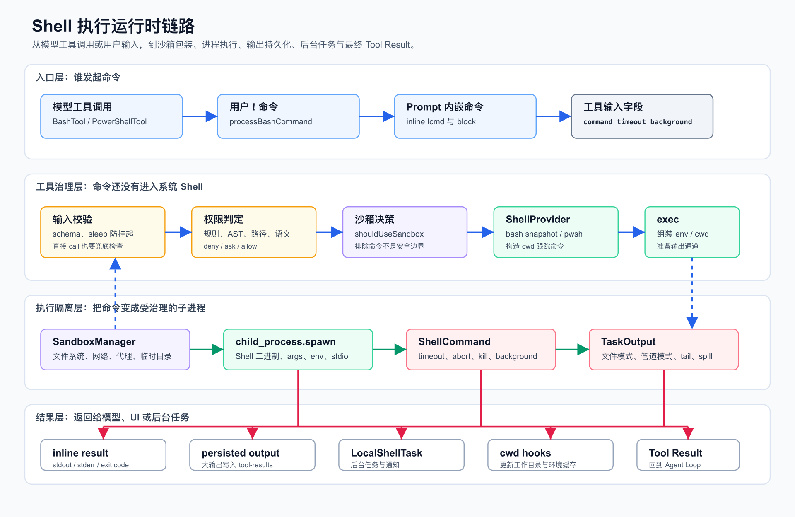
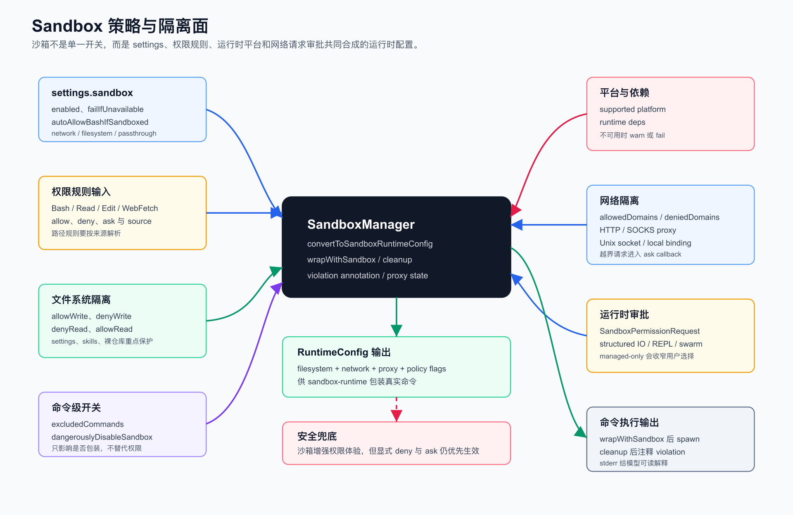

# 第 10 章：Sandbox、Shell 执行与隔离系统

第九章讲了 Hooks、事件系统与自动化治理。

它回答的是：

```text
运行时正在执行时，哪些外部策略可以观察、增强或阻断它？
```

这一章进入 Claude Code 最危险也最有价值的一条能力：

```text
当模型或用户要求执行本机命令时，系统如何让命令真正跑起来，同时不把终端能力变成失控入口？
```

这就是 Sandbox、Shell 执行与隔离系统要解决的问题。

Shell 执行不是普通工具调用。

它同时碰到六类边界：

- 权限边界：命令是否允许执行？
- 文件系统边界：能读写哪些路径？
- 网络边界：能访问哪些域名？
- 进程边界：命令如何启动、超时、终止、后台化？
- 输出边界：超大 stdout/stderr 如何返回给模型？
- 会话边界：命令改变工作目录或环境后，Agent Runtime 如何同步？

本章的核心结论是：

```text
Claude Code 没有把 Shell 当成一条 spawn(command) 调用。

它把 Shell 执行拆成工具治理、沙箱策略、Shell 方言适配、子进程生命周期、输出持久化和后台任务六个层次。
```

如果第四章讲的是“工具能不能执行”，第九章讲的是“执行边界如何被治理”，那么第十章讲的是：

```text
最危险的工具如何被做成可用、可控、可恢复的运行时能力。
```

## 1. 本章目标

读完这一章，你要能回答：

- `BashTool` 和 `PowerShellTool` 为什么不是普通 wrapper？
- 用户输入框里的 `!` 命令和模型发起的 Bash 工具有何不同？
- prompt、skill、command 里的内嵌 `!` 命令为什么仍要走权限检查？
- `shouldUseSandbox()` 到底决定什么？它为什么不是权限系统本身？
- `excludedCommands` 为什么明确不是安全边界？
- `dangerouslyDisableSandbox` 为什么必须受 `allowUnsandboxedCommands` 约束？
- `autoAllowBashIfSandboxed` 为什么能减少弹窗，但不能覆盖显式 deny / ask？
- `SandboxManager` 如何把 settings、权限规则和 WebFetch 域名合成 runtime config？
- 文件系统沙箱为什么要默认保护 settings、skills 和裸 Git 仓库关键路径？
- 网络沙箱为什么需要 allowed domains、denied domains、proxy 与 ask callback？
- `ShellProvider` 为什么要抽象 Bash 与 PowerShell？
- Bash snapshot、session env script、cwd tracking file 分别解决什么？
- PowerShell 为什么在沙箱模式下要用 `-EncodedCommand`？
- `Shell.exec()` 为什么把 stdout/stderr 写到文件，而不是总走 Node pipe？
- `ShellCommand` 为什么监听 `exit`，而不是只等 `close`？
- 超时、Ctrl+B、自动后台化和 `LocalShellTask` 是如何衔接的？
- `TaskOutput` 为什么是命令输出的 single source of truth？
- 命令结束后为什么要更新 cwd、清理 session env cache 并触发 cwd hooks？
- 从 0 实现一个安全 Shell Runtime，最小架构应该是什么？

本章仍然讲架构，不写成用户配置手册。

## 2. 本章源码入口

建议从这些文件开始：

```text
claude-code/node_modules/@claude-code-best/builtin-tools/src/tools/BashTool/BashTool.tsx
claude-code/node_modules/@claude-code-best/builtin-tools/src/tools/BashTool/bashPermissions.ts
claude-code/node_modules/@claude-code-best/builtin-tools/src/tools/BashTool/shouldUseSandbox.ts
claude-code/node_modules/@claude-code-best/builtin-tools/src/tools/BashTool/pathValidation.ts
claude-code/node_modules/@claude-code-best/builtin-tools/src/tools/BashTool/readOnlyValidation.ts
claude-code/node_modules/@claude-code-best/builtin-tools/src/tools/BashTool/bashSecurity.ts
claude-code/node_modules/@claude-code-best/builtin-tools/src/tools/PowerShellTool/PowerShellTool.tsx
claude-code/node_modules/@claude-code-best/builtin-tools/src/tools/PowerShellTool/powershellPermissions.ts
claude-code/src/utils/Shell.ts
claude-code/src/utils/ShellCommand.ts
claude-code/src/utils/shell/shellProvider.ts
claude-code/src/utils/shell/bashProvider.ts
claude-code/src/utils/shell/powershellProvider.ts
claude-code/src/utils/shell/resolveDefaultShell.ts
claude-code/src/utils/bash/ShellSnapshot.ts
claude-code/src/utils/sandbox/sandbox-adapter.ts
claude-code/src/entrypoints/sandboxTypes.ts
claude-code/src/utils/task/TaskOutput.ts
claude-code/src/tasks/LocalShellTask/LocalShellTask.tsx
claude-code/src/tasks/LocalShellTask/killShellTasks.ts
claude-code/src/utils/processUserInput/processBashCommand.tsx
claude-code/src/utils/promptShellExecution.ts
claude-code/src/utils/sessionEnvironment.ts
claude-code/src/utils/subprocessEnv.ts
claude-code/src/setup.ts
claude-code/src/commands/sandbox-toggle/sandbox-toggle.tsx
claude-code/src/components/permissions/SandboxPermissionRequest.tsx
claude-code/src/cli/print.ts
claude-code/src/screens/REPL.tsx
```

这组文件可以分成七层：

| 层级 | 代表文件 | 职责 |
| --- | --- | --- |
| 工具入口 | `BashTool.tsx`、`PowerShellTool.tsx` | 暴露模型可调用的命令工具，处理输入、权限、结果与后台化 |
| 命令权限 | `bashPermissions.ts`、`powershellPermissions.ts`、`pathValidation.ts` | 判断命令、参数、路径、重定向和语义风险 |
| 沙箱决策 | `shouldUseSandbox.ts`、`sandbox-adapter.ts`、`sandboxTypes.ts` | 决定是否沙箱化，并把配置转换为 sandbox-runtime config |
| Shell 方言 | `shellProvider.ts`、`bashProvider.ts`、`powershellProvider.ts`、`ShellSnapshot.ts` | 适配 Bash、zsh、PowerShell 的启动、引用、环境和 cwd 跟踪 |
| 进程生命周期 | `Shell.ts`、`ShellCommand.ts` | spawn、timeout、abort、kill、background、cwd 更新 |
| 输出管理 | `TaskOutput.ts`、`toolResultStorage.ts` | stdout/stderr 聚合、tail、spill、persisted output |
| 交互入口 | `processBashCommand.tsx`、`promptShellExecution.ts` | 处理用户 `!` 命令和 prompt 内嵌命令 |

阅读时不要先看 `spawn()`。

先抓住这条总链路：

```text
tool or prompt input
  -> command validation
  -> permission decision
  -> sandbox decision
  -> shell provider command build
  -> sandbox wrapper
  -> child process
  -> ShellCommand lifecycle
  -> TaskOutput
  -> tool result or background task
```

## 3. Shell 执行为什么是特殊能力

很多系统会把 Shell 工具实现成：

```text
run(command) -> stdout
```

这在 Agent Runtime 里不够。

因为命令不是纯函数。

它可能：

- 修改仓库文件。
- 删除用户配置。
- 访问网络。
- 启动后台服务。
- 持有 stdin 等待输入。
- 输出数 GB 内容。
- 改变工作目录。
- 通过别名、函数、shell 扩展或重定向绕开简单规则。
- 在 PowerShell 与 Bash 中拥有完全不同的语义。
- 被用户直接输入，也可能由模型发起，还可能嵌在 skill 或 slash command prompt 里。

所以 Claude Code 的设计不是：

```text
tool -> spawn -> result
```

而是：

```text
intent
  -> permission
  -> isolation
  -> shell dialect
  -> process lifecycle
  -> output lifecycle
  -> session lifecycle
```

这也是本章要拆开的主线。

## 4. 总览图：Shell 执行运行时链路



这张图可以按四段理解。

第一段，入口层。

命令不只来自模型工具调用：

```text
模型调用 BashTool / PowerShellTool
用户输入框使用 !command
prompt、skill、slash command 内容里出现 !`cmd` 或 ```! block
```

这些入口最后都会复用 BashTool 或 PowerShellTool 的执行能力。

但它们的安全语义不同。

模型工具调用默认要经过完整权限判定和沙箱决策。

用户主动输入的 `!` 命令在 `processBashCommand.tsx` 中会传入 `dangerouslyDisableSandbox: true`，表示用户明确要求本机终端行为；但它仍受 `allowUnsandboxedCommands` 这类策略约束。

prompt 内嵌命令在 `promptShellExecution.ts` 中会先调用 `hasPermissionsToUseTool()`，允许后再直接调用 shell tool。这个入口会绕过 `validateInput()`，所以真正负载安全含义的检查必须放在 `call()` 或更底层。

第二段，工具治理层。

`BashTool` 和 `PowerShellTool` 会做：

```text
schema validation
sleep guard
permission check
sandbox decision
shell provider selection
```

这里的关键点是：命令还没有进入系统 Shell。

系统仍然可以解析它、拒绝它、要求用户确认，或者把它包装进沙箱。

第三段，执行隔离层。

`Shell.exec()` 不直接拼接 `spawn(command)`。

它先让 ShellProvider 生成适合目标 shell 的命令字符串和参数，再根据 `shouldUseSandbox` 决定是否调用 `SandboxManager.wrapWithSandbox()`。

最后才进入 `child_process.spawn()`。

这个子进程会被 `ShellCommand` 包起来，统一处理：

```text
timeout
abort signal
tree kill
background
exit result
large output
```

第四段，结果层。

结果可能不是一个普通字符串。

它可能变成：

```text
inline stdout/stderr
persisted output file
background task notification
image result
cwd changed hook
sandbox violation annotation
```

这就是 Claude Code Shell Runtime 的核心。

## 5. Shell 执行的三个主要入口

Claude Code 里至少有三条常见 Shell 入口。

### 5.1 模型工具调用

模型看到的是工具：

```text
BashTool
PowerShellTool
```

工具 input 包括：

```text
command
timeout
description
run_in_background
dangerouslyDisableSandbox
_simulatedSedEdit
```

其中 `_simulatedSedEdit` 是内部字段。

它不会出现在模型可见 schema 中。

这件事很重要。

因为模拟 sed edit 的目的是：

```text
先按 sed 命令预览改动。
用户批准后，运行时按已批准的 preview 直接应用编辑。
```

如果模型能直接构造 `_simulatedSedEdit`，就可能绕过原始 sed 命令的权限和沙箱路径。

所以这个字段只能由内部流程填入，不能由模型自行生成。

### 5.2 用户输入框里的 `!` 命令

`processBashCommand.tsx` 处理用户输入框的 Bash mode。

这条链路会构造一条 synthetic user message：

```text
<bash-input>...</bash-input>
```

然后调用 BashTool 或 PowerShellTool。

区别是它传入：

```text
dangerouslyDisableSandbox: true
```

原因是用户主动使用 `!` 命令时，预期更接近“我在终端里执行这条命令”。

但这不是无条件绕过。

`shouldUseSandbox.ts` 会继续检查：

```text
settings.sandbox.allowUnsandboxedCommands
```

如果策略不允许非沙箱命令，`dangerouslyDisableSandbox` 就不能生效。

PowerShellTool 还在 `validateInput()` 和 `call()` 中都保留了负载检查，因为某些直接调用路径可能跳过 validate。

### 5.3 prompt、skill、slash command 的内嵌命令

`promptShellExecution.ts` 支持两种语法：

````text
!`command`

```! 
command
```
````

它常用于 skill、plugin command 或内置 command 的 prompt 模板。

这条链路有三个关键点。

第一，先做权限检查。

它调用 `hasPermissionsToUseTool()`，只有结果是 allow 才会执行。

第二，再直接调用 shell tool。

也就是说，这里不会重新走完整的模型工具调用入口。

第三，输出会重新走 `processToolResultBlock()`。

这样大输出持久化、stderr 合并和 tool result 格式不会另起一套。

这说明 Claude Code 有意把“命令入口”和“命令执行内核”分开：

```text
入口可以不同。
权限和执行内核必须复用。
```

## 6. Tool 层：BashTool 不是 spawn wrapper

`BashTool.tsx` 做的事情比名字显示的多。

它至少承担六个职责：

| 职责 | 说明 |
| --- | --- |
| 输入协议 | 定义 command、timeout、description、background、sandbox flag |
| 轻量校验 | 阻止明显会让交互卡死的长 sleep 命令 |
| 权限桥接 | 调用 `bashToolHasPermission()` 得到 allow / ask / deny |
| hook matcher | 为权限 hook 准备 command matcher |
| 执行编排 | 调用 `runShellCommand()`，处理 foreground/background |
| 结果塑形 | 输出截断、持久化、图片处理、sandbox violation 注释 |

`validateInput()` 里有一个很现实的规则：

```text
长时间 sleep 不能作为普通前台命令运行。
```

除非它是后台任务，或命令来自 Monitor 类场景。

这个规则不是安全策略，而是交互策略。

它防止模型把会话挂在没有意义的 `sleep 999999` 上。

真正的权限策略在 `checkPermissions()` 里。

`BashTool` 会把 input 交给：

```text
bashToolHasPermission(input, context)
```

这个函数再拆成语法解析、语义分析、路径约束、规则匹配和沙箱自动允许。

## 7. PowerShellTool 的特殊性

`PowerShellTool.tsx` 和 `BashTool.tsx` 结构相似，但它不是简单复制。

PowerShell 有几个特殊问题。

第一，语法不同。

Bash 的 AST、重定向、管道和 shell expansion 规则不能直接套到 PowerShell。

所以它有自己的：

```text
powershellPermissions.ts
powershellSecurity.ts
pathValidation.ts
readOnlyValidation.ts
parser.ts
```

第二，native Windows 不支持同一套 sandbox 行为。

PowerShellTool 在 Windows native 环境中会认为沙箱不可用。

如果 settings 要求：

```text
sandbox.enabled = true
sandbox.allowUnsandboxedCommands = false
```

那么它会拒绝执行，而不是假装沙箱生效。

第三，直接调用路径必须兜底。

`promptShellExecution.ts` 和 `processBashCommand.tsx` 都可能直接调用 `PowerShellTool.call()`。

所以 PowerShellTool 里有明确注释：

```text
load-bearing guard
```

意思是：不能只把关键检查放在 validateInput，因为 validateInput 并不保证所有入口都会走到。

## 8. 权限引擎：先理解 deny / ask / allow 的顺序

Shell 权限的难点不是“有没有 allowlist”。

难点是：

```text
一条命令可能包含多个子命令、多个路径、多个重定向、多个 shell 语义。
```

例如：

```text
cd /tmp && git status
rg foo > .claude/settings.json
cat <(curl example.com)
rm -rf -- "$HOME"
git -C /repo config core.fsmonitor ...
```

这些都不能只看第一个 token。

`bashPermissions.ts` 的整体思路可以概括为：

```text
parse command
  -> check semantic danger
  -> apply explicit deny / ask / allow
  -> apply sandbox auto allow if eligible
  -> classify read-only command
  -> validate operators and subcommands
  -> validate path constraints and redirects
  -> build permission suggestions
```

其中最重要的是优先级。

| 优先级 | 规则 | 含义 |
| --- | --- | --- |
| 最高 | explicit deny | 用户或策略明确拒绝，不能被沙箱自动允许覆盖 |
| 次高 | explicit ask | 用户或策略明确要求询问，沙箱也不能静默跳过 |
| 中间 | semantic danger | 命令语义可疑时，要求 ask 或 deny |
| 中间 | path constraints | 对文件读写路径做单独判断 |
| 较低 | read-only allow | 命令与 flag 被证明只读，才可以更宽松 |
| 辅助 | sandbox auto allow | 只在无显式 deny / ask 且命令会进沙箱时减少弹窗 |

这里的关键结论是：

```text
沙箱不是权限系统的替代品。

沙箱只能在权限系统没有明确要求阻断或询问时，降低用户确认成本。
```

## 9. AST、read-only 与路径验证为什么要同时存在

Shell 命令很难用字符串规则判断。

Claude Code 同时使用几类检查。

第一类是 AST security parse。

它负责识别命令结构、子命令、重定向、管道和复杂语义。

如果解析结果是 `too-complex`，系统会倾向 ask，而不是默认 allow。

第二类是 read-only validation。

很多命令名字看起来只读，但 flag 可能改变行为。

例如同一个工具可能既能 list，也能 write、delete、exec、network。

所以 `readOnlyValidation.ts` 维护的是“命令加 flag 的只读证明”，不是简单 command allowlist。

第三类是 path validation。

`pathValidation.ts` 会判断：

```text
读路径
写路径
创建路径
输出重定向路径
危险删除路径
```

它还会处理一些容易出错的细节：

- `--` 后的位置参数不能被当成 flag 丢掉。
- `mv`、`cp` 某些 flag 会改变目标路径语义，需要阻断。
- compound command 里带 `cd` 时，写路径的最终位置可能不明确，需要保守处理。
- `/dev/null` 这种重定向目标可以特殊放行。
- process substitution、危险 shell expansion 不能被当成普通文件路径。

第四类是 shell security。

`bashSecurity.ts` 会识别：

```text
process substitution
command substitution
parameter expansion
zsh equals expansion
zsh glob qualifier
zsh always block
PowerShell style comment
危险 zsh module 或 builtin
```

这些规则的目的不是让 BashTool 成为完整 shell 解释器。

它的目的是在权限确认前发现“字符串表面看起来安全，但 shell 运行时会执行另一件事”的风险。

## 10. 沙箱自动允许：减少弹窗，但不改变策略优先级

`bashPermissions.ts` 中有一段关键逻辑：

```text
如果 sandbox enabled
且 autoAllowBashIfSandboxed enabled
且 shouldUseSandbox(input) 为 true
则尝试 sandbox auto allow
```

但它不是直接 allow。

它会先检查：

```text
完整命令是否命中 deny / ask
每个子命令是否命中 deny / ask
```

只要显式规则要求 deny 或 ask，就不能因为沙箱存在而跳过。

这解释了 `autoAllowBashIfSandboxed` 的真实含义：

```text
当命令会被沙箱约束，且没有更高优先级策略要求询问时，可以减少 Bash 权限弹窗。
```

它不是：

```text
沙箱里所有 Bash 都自动安全。
```

这一区别非常重要。

## 11. shouldUseSandbox：它只决定是否包装命令

`shouldUseSandbox.ts` 的名字容易让人误解。

它不是权限决策器。

它只回答：

```text
这条命令执行时要不要交给 sandbox-runtime 包装？
```

它会返回 false 的典型情况包括：

```text
沙箱整体未启用。
dangerouslyDisableSandbox 生效。
命令为空。
命令命中 excludedCommands。
```

但这里有两个关键边界。

第一，`dangerouslyDisableSandbox` 不是绝对开关。

它还要受：

```text
allowUnsandboxedCommands
```

约束。

如果策略不允许非沙箱命令，用户输入框和直接 call 都不能任意绕过。

第二，`excludedCommands` 明确不是安全边界。

源码注释已经把这个说得很清楚。

`excludedCommands` 只是让某些命令不进入 sandbox wrapper。

真正能否执行，仍由权限系统和设置策略决定。

所以正确理解是：

```text
permission decides whether command may run.
sandbox decision decides how command is wrapped when it runs.
```

## 12. 总览图：Sandbox 策略与隔离面



SandboxManager 不是一个布尔值。

它把多种输入合成运行时配置：

```text
settings.sandbox
permission rules
WebFetch allow / deny domains
additional directories
filesystem policies
platform capability
managed policy
runtime ask callback
```

最后输出给 `@anthropic-ai/sandbox-runtime`。

这张图里最重要的是中心的转换：

```text
convertToSandboxRuntimeConfig(settings)
```

它把用户、项目、企业和运行时状态转换为实际沙箱规则。

## 13. SandboxSettingsSchema 的配置面

`sandboxTypes.ts` 定义了 sandbox settings 的 schema。

核心字段包括：

```text
enabled
failIfUnavailable
autoAllowBashIfSandboxed
allowUnsandboxedCommands
network
filesystem
ignoreViolations
excludedCommands
ripgrep
passthrough
```

其中最关键的是四类。

第一类是开关：

```text
enabled
failIfUnavailable
```

`enabled` 决定是否启用沙箱。

`failIfUnavailable` 决定沙箱不可用时是报警后继续，还是直接失败。

第二类是权限体验：

```text
autoAllowBashIfSandboxed
allowUnsandboxedCommands
excludedCommands
```

它们影响 Bash 权限弹窗和是否允许非沙箱执行。

第三类是网络：

```text
allowedDomains
allowManagedDomainsOnly
allowUnixSockets
allowAllUnixSockets
allowLocalBinding
httpProxyPort
socksProxyPort
```

第四类是文件系统：

```text
allowWrite
denyWrite
denyRead
allowRead
allowManagedReadPathsOnly
```

注意：这些字段不是直接拿来用。

它们会进入 `convertToSandboxRuntimeConfig()`，和权限规则、settings 来源、工作区状态一起合成最终规则。

## 14. SandboxManager 初始化与不可用处理

SandboxManager 的可用性不只取决于 settings。

它还要检查：

```text
平台是否支持
依赖是否存在
enabledPlatforms 是否允许
settings.sandbox.enabled 是否打开
```

CLI headless / SDK 模式在 `cli/print.ts` 中会处理不可用情况：

```text
如果 failIfUnavailable，退出。
否则打印 warning，命令会在没有 sandbox 的情况下运行。
```

REPL 模式在 `screens/REPL.tsx` 中初始化 SandboxManager。

它还要提供 sandbox ask callback。

这使得沙箱里的网络越界请求可以回到交互 UI 或结构化 IO：

```text
sandbox runtime detects request
  -> ask callback
  -> UI / SDK / swarm bridge
  -> allow or deny
```

这就是沙箱和第九章 Hooks、权限 UI、SDK structured output 相交的地方。

## 15. 文件系统隔离：默认允许与默认保护

`convertToSandboxRuntimeConfig()` 对文件系统规则的处理非常保守。

默认写入允许包括：

```text
.
Claude temp dir
```

也就是说，普通命令可以在工作空间和临时目录里工作。

但它同时默认拒绝写入一些敏感位置。

代表性规则包括：

```text
settings files
managed settings drop-in dir
.claude/skills
裸 Git 仓库关键文件
```

为什么要特别保护 settings？

因为 settings 能改变权限、hooks、沙箱、MCP、插件等行为。

如果一个命令能静默改写 settings，就等于能影响后续 Agent Runtime 的治理边界。

为什么要保护 `.claude/skills`？

因为 skill 是可被模型加载并影响 prompt 与工具行为的能力载体。

如果命令能无提示写入 skill 内容，就可能把后续上下文污染成持久能力。

为什么要处理裸 Git 仓库？

源码里有专门逻辑检测：

```text
HEAD
objects
refs
hooks
config
```

这些路径如果存在，会被 deny write。

如果不存在，会加入 scrub list，在命令结束后清理掉可能被种下的文件。

目的很明确：

```text
防止通过构造裸 Git 仓库关键文件来触发 fsmonitor 等逃逸路径。
```

这类规则体现了一个实践经验：

```text
沙箱文件系统策略不能只看普通项目文件。
它必须保护能改变运行时信任边界的元数据。
```

## 16. 路径规则的来源语义

Sandbox 的路径规则有两套来源。

第一套来自权限规则。

例如 Read、Edit、Bash 相关规则。

第二套来自 `sandbox.filesystem` settings。

这两套规则的路径解析语义不同。

`sandbox-adapter.ts` 中有两个相关函数：

```text
resolvePathPatternForSandbox
resolveSandboxFilesystemPath
```

权限规则里：

```text
//path  表示绝对根路径
/path   表示相对 settings 文件所在目录
~/path  表示 home
relative path 交给 sandbox-runtime 按其规则处理
```

而 `sandbox.filesystem` settings 中：

```text
/path   表示绝对路径
~/path  表示 home
relative path 表示相对 settings 文件所在目录
//path  保留为 legacy absolute 语义
```

这看起来细，但非常重要。

因为同一个字符串路径来自不同配置源时，用户预期不同。

如果把两者混在一起，会造成：

```text
以为限制了项目内路径，实际限制了系统根路径。
以为允许了绝对路径，实际只允许了 settings 旁边的相对路径。
```

这就是为什么沙箱适配层必须保留 source-aware path resolution。

## 17. 网络隔离：域名、代理与运行时审批

网络沙箱的输入包括：

```text
sandbox.network.allowedDomains
sandbox.network.allowManagedDomainsOnly
WebFetch allow rules
WebFetch deny rules
Unix socket policy
local binding policy
HTTP proxy port
SOCKS proxy port
```

其中 `WebFetch` 规则会被纳入网络域名策略。

这说明网络权限不是 Bash 独立维护一套。

它和工具权限系统共享域名治理。

如果策略开启 managed-only domains，则可访问域名会进一步收窄到托管策略和 WebFetch allow。

这对企业环境很重要。

因为企业往往希望：

```text
用户不能在项目 settings 中随意扩大外网访问范围。
```

当沙箱检测到越界网络请求时，会进入 ask callback。

REPL UI 中对应组件是：

```text
SandboxPermissionRequest.tsx
```

用户可能看到的是“网络请求超出沙箱”的审批。

如果 managed-only 开启，UI 里的“以后都允许”这类选择会被收窄。

SDK / headless 模式则通过 structured IO 把请求交给宿主。

这和普通工具权限弹窗不同：

```text
工具权限是在命令执行前判断。
网络 sandbox ask 是命令运行中发现越界访问时判断。
```

两者处在不同时间点。

## 18. ShellProvider：不要让 Bash 和 PowerShell 混在一起

`shellProvider.ts` 定义了统一接口。

它抽象的是：

```text
type
shellPath
detached
buildExecCommand
getSpawnArgs
getEnvironmentOverrides
```

这不是为了“优雅”。

而是因为 Bash、zsh、PowerShell 的运行方式差异太大。

`resolveDefaultShell.ts` 决定默认 shell：

```text
settings.defaultShell
否则 bash
```

注意，它不会因为平台自动把 Windows 切到 PowerShell。

PowerShell 是否可用还要经过 `isPowerShellToolEnabled()` 这类 gate。

另一个相关函数是 `findSuitableShell()`。

它用于找 Bash/zsh：

```text
CLAUDE_CODE_SHELL
SHELL if bash or zsh
zsh
bash
```

如果都找不到，会抛出明确错误。

这保证了 BashTool 的语义始终落到 Bash/zsh 家族，而不是随意落到用户系统默认 shell。

## 19. BashProvider：恢复用户 shell，又限制 shell 副作用

`bashProvider.ts` 做了几件很关键的事。

第一，创建并复用 shell snapshot。

`ShellSnapshot.ts` 会从用户 shell 配置中抽取：

```text
functions
options
aliases
PATH
ripgrep integration
embedded search tools
```

这样每次命令不需要重新启动完整 login shell。

如果 snapshot 存在，`getSpawnArgs()` 就不必加 `-l`。

如果 snapshot 不存在，才回退 login shell。

第二，source session environment script。

`sessionEnvironment.ts` 会把会话环境文件串起来：

```text
CLAUDE_ENV_FILE
setup hook env
sessionstart hook env
cwdchanged hook env
filechanged hook env
```

BashProvider 构造命令时会 source 这些环境脚本。

这让 hooks 注入的环境变量可以影响后续 shell 命令。

第三，控制 shell option。

BashProvider 会禁用一些可能影响命令语义的 shell 行为，例如 extglob / zsh extended glob。

目的不是让用户 shell 失去能力，而是降低模型生成命令在不同 shell 配置下的不可预测性。

第四，用安全引用包装用户命令。

Provider 会把用户 command 变成可交给 shell 执行的 quoted command，并处理 stdin redirect。

stdin redirect 的目的很实际：

```text
避免某些命令等待 stdin 导致会话挂起。
```

第五，写入 cwd tracking file。

命令结束后会执行：

```text
pwd -P > cwdFile
```

这样 `Shell.exec()` 可以知道命令是否改变了工作目录。

如果改变，就更新运行时 cwd，并触发对应 hooks。

## 20. PowerShellProvider：用 PowerShell 的方式执行 PowerShell

`powershellProvider.ts` 处理 PowerShell 的启动和包装。

普通情况下，PowerShell 使用：

```text
-NoProfile
-NonInteractive
-Command
```

这保证命令不加载用户 profile，并且不进入交互模式。

沙箱模式下则更复杂。

Provider 会先把 PowerShell 命令编码为 UTF-16LE base64，再用：

```text
-EncodedCommand
```

原因是沙箱包装会经过额外的 shell 层。

如果把原始 PowerShell 字符串直接穿过多层引用，很容易被转义破坏。

`-EncodedCommand` 可以让 PowerShell 命令更稳定地穿过 sandbox wrapper。

PowerShellProvider 也会做 cwd tracking。

但它还要处理 PowerShell 的退出码语义：

```text
$LASTEXITCODE
$?
```

这与 Bash 的 `$?` 不同。

所以退出码捕获必须放在 PowerShell provider 里，而不是通用 Shell.exec 里。

## 21. Shell.exec：真正进入子进程前的最后一层

`Shell.ts` 里的 `exec()` 是执行核心。

它做的事情可以简化为：

```text
resolve provider
create command id
prepare sandbox temp dir
build exec command
recover cwd if needed
wrap with sandbox if needed
spawn child process
wrap child with ShellCommand
update cwd after completion
cleanup sandbox and temp files
```

这里有几个关键细节。

第一，sandbox temp dir。

如果命令会进入沙箱，会用：

```text
CLAUDE_CODE_TMPDIR
getClaudeTempDirName()
```

创建沙箱临时目录。

目录权限是 0700。

这避免多个命令共享一个过宽的临时空间。

第二，sandbox wrapper 的 shell 选择。

PowerShell 在 sandbox 模式下会先由 provider 构造：

```text
pwsh -NoProfile -NonInteractive -EncodedCommand ...
```

然后 `Shell.ts` 把 sandbox 包装层使用的 shell 当成 `/bin/sh`。

这让 sandbox runtime 包装的是一个普通 POSIX shell 命令，而内部真实执行的是 PowerShell。

第三，环境变量。

spawn 的 env 来自：

```text
subprocessEnv()
SHELL
GIT_EDITOR=true
CLAUDECODE=1
provider env overrides
CLAUDE_CODE_SESSION_ID
```

`GIT_EDITOR=true` 避免 Git 命令打开交互编辑器。

`CLAUDECODE=1` 让子进程知道自己在 Claude Code 环境下。

第四，stdout/stderr 模式。

Shell.exec 有两种输出模式。

如果没有 `onStdout`，它会把 stdout/stderr 写到同一个文件 fd。

POSIX 下打开文件时会用 `O_NOFOLLOW`，降低符号链接风险。

如果有 `onStdout`，则走 pipe 模式。

hooks 之类需要实时流式输出的场景会用 pipe。

普通 BashTool 更偏向文件模式，因为它能绕开 Node 内存压力。

第五，cwd 更新。

命令结束后，如果不是禁止 cwd change 的场景，`Shell.exec()` 会读取 cwd file。

然后：

```text
setCwd
invalidate session environment cache
trigger onCwdChangedForHooks
unlink cwd file
```

这把 shell 的状态变化回写到了 Agent Runtime。

## 22. ShellCommand：进程生命周期对象

`ShellCommand.ts` 把 child process 包成统一对象。

它的状态包括：

```text
running
backgrounded
completed
killed
```

它暴露的能力包括：

```text
result()
kill()
background()
getStatus()
getTaskOutput()
```

这里有一个非常关键的设计：

```text
ShellCommand 监听 exit，而不是只等 close。
```

原因是某些命令会启动子进程或孙进程。

如果孙进程持有 stdout/stderr fd，`close` 可能长时间不触发。

但主进程已经 exit。

对 Agent Runtime 来说，继续等待 close 可能让工具卡住。

所以它选择以 `exit` 作为进程完成判断。

超时逻辑也在这里。

如果命令超时，默认会 SIGTERM。

如果有 auto-background callback，则可以把命令转成后台任务，而不是直接杀掉。

`kill()` 使用 tree kill，并以 SIGKILL 清理进程树。

它返回的 exit code 会按 137 处理。

这接近 Unix 中 SIGKILL 的惯用表达。

## 23. Abort、interrupt 与后台化

Agent Runtime 的中断并不总是意味着杀掉进程。

`ShellCommand` 对 abort reason 有特殊处理。

如果 abort reason 是：

```text
interrupt
```

它不会直接把子进程杀掉。

原因是用户中断模型输出时，可能希望把仍在运行的 shell 命令转入后台，而不是终止掉。

这和 Ctrl+C 式终端语义不同。

Claude Code 更像是：

```text
中断 Agent 等待。
保留把命令后台化的机会。
```

这也是为什么 `BashTool` 会维护 foreground task registry。

当用户按 Ctrl+B 时，系统可以把前台 shell task 转成 `LocalShellTask`。

## 24. TaskOutput：命令输出的 single source of truth

`TaskOutput.ts` 是命令输出的中心。

它支持两种模式：

```text
file mode
pipe mode
```

file mode 下：

```text
stdout/stderr 直接写入文件 fd
TaskOutput 通过轮询读取 tail
```

这避免 Node 进程把超大输出全吞进内存。

pipe mode 下：

```text
stdout/stderr 先进内存 buffer
超过阈值后 spill 到磁盘
```

这适合 hooks 或需要实时 onStdout 的场景。

TaskOutput 还负责：

```text
定期 poll
读取 tail
提供 progress
生成 stdout preview
返回 outputFilePath / outputFileSize
清理 buffer 和文件
```

这里的核心思想是：

```text
工具结果和后台任务不要各自维护输出。
所有命令输出都统一由 TaskOutput 代表。
```

这样才能在 foreground、background、persisted output 之间切换。

## 25. 大输出为什么要持久化

Shell 命令经常输出很多内容。

例如：

```text
rg .
npm test -- --verbose
git diff
cat large.log
```

如果直接把全部输出塞进模型上下文，会造成三个问题：

- 上下文爆炸。
- UI 卡顿。
- 模型注意力被日志淹没。

所以 `BashTool.call()` 会把大输出转成 persisted output。

结果里会携带类似：

```text
outputFilePath
outputFileSize
outputTaskId
```

最终通过 `processToolResultBlock()` 变成模型可理解的 `<persisted-output>` 结构。

这和第五章的 context engineering 是同一类思想：

```text
不是所有原始数据都该进入上下文。
大数据应先落盘，再给模型摘要、路径和读取能力。
```

## 26. 后台任务：显式后台、自动后台与 Ctrl+B

Shell Runtime 有三种后台化来源。

第一，显式后台。

工具 input 中有：

```text
run_in_background
```

如果设置，`BashTool` 会直接创建 `LocalShellTask`。

第二，超时自动后台。

某些命令前台跑太久时，系统可以把它转后台。

但 `sleep` 这类没有有效输出的命令会被排除。

在 Assistant / Kairos 模式里，还有更短的 blocking budget。

第三，用户手动后台。

前台命令会注册到 foreground task registry。

用户按 Ctrl+B 时，`backgroundExistingForegroundTask()` 可以把它转成后台 task。

`LocalShellTask.tsx` 负责维护后台任务状态：

```text
running
completed
failed
killed
```

完成后它会 enqueue task notification。

通知里包括：

```text
task_id
status
summary
output_file
tool_use_id
```

如果后台命令长时间无输出，但 tail 看起来像交互 prompt，stall watchdog 会提醒模型：

```text
这条命令可能在等输入。
应该 kill 或用非交互参数重跑。
```

这是一条很实际的 Agent Runtime 经验：

```text
后台任务不是把进程放着不管。
它仍然需要状态、输出、通知和卡死检测。
```

## 27. 后台任务与 Agent 生命周期

Sub Agent 退出时，不能留下属于它的 shell 进程继续跑。

`killShellTasks.ts` 处理这个问题。

它会根据 agentId 清理对应的 running local shell tasks。

清理动作包括：

```text
kill shell command
flush and cleanup output
mark status killed
evict output
remove stale notifications
```

这和第八章 Task 系统形成闭环：

```text
Agent 生命周期结束
  -> 它拥有的本地 shell task 也要结束
```

否则一个已经结束的 Agent 可能仍有后台进程在修改文件或输出日志。

## 28. 命令结果如何回到模型

`BashTool.call()` 会把 `ExecResult` 转成模型可消费的数据。

它会处理：

```text
stdout
stderr
exit code
interrupted
persisted output
background task id
image output
sandbox violations
```

其中 sandbox violation annotation 值得注意。

如果命令在沙箱中被拒绝访问某些资源，原始 stderr 可能只是一段低层错误。

`SandboxManager.annotateStderrWithSandboxFailures()` 会把沙箱 violation 转成更可读的提示。

这样模型更容易判断：

```text
命令失败是业务错误？
还是沙箱策略拦截？
```

图片输出也会被特殊处理。

如果命令生成图片，工具结果会走图片尺寸检查和必要的 resize，而不是把二进制内容直接塞进 stdout。

此外，`<claude-code-hint />` 会从输出中剥离。

这类 hint 是运行时内部给模型的辅助信号，不能作为普通命令输出原样混入。

## 29. cwd 与 session environment：Shell 状态要回流到会话

Shell 命令可以改变工作目录。

例如：

```text
cd packages/app
```

如果 Agent Runtime 不知道这件事，后续 Read、Edit、Bash、hooks 都可能使用错误 cwd。

所以 BashProvider / PowerShellProvider 都会构造 cwd tracking。

`Shell.exec()` 在命令结束后读取结果，并更新：

```text
runtime cwd
session environment cache
CwdChanged hook
```

`sessionEnvironment.ts` 则维护 session env 文件。

它会按优先级加载：

```text
CLAUDE_ENV_FILE
setup
sessionstart
cwdchanged
filechanged
```

当 cwd 改变时，旧的 cwd/file changed env cache 会失效。

这使得第九章的 hooks 能真正影响第十章的命令执行环境。

换句话说：

```text
Shell 命令不是孤立进程。
它和会话 cwd、hook env、后续工具调用共享状态。
```

## 30. subprocessEnv：子进程环境不是简单继承

`subprocessEnv.ts` 负责构造子进程环境。

默认情况下，它会继承 `process.env`。

但如果：

```text
CLAUDE_CODE_SUBPROCESS_ENV_SCRUB
```

为真，它会清理敏感环境变量。

清理范围包括：

```text
Anthropic tokens
OTLP headers
AWS / GCP / Azure credentials
GitHub OIDC / cache / action tokens
INPUT_ variants
```

这主要面向不可信 CI 或 GitHub Actions 环境。

因为在这些环境里，把宿主进程环境完整传给用户命令可能造成凭据泄露。

`subprocessEnv()` 还会处理上游 proxy env。

这样命令可以在需要时继承代理配置，但敏感变量又能按策略擦除。

## 31. setup.ts：危险权限模式的启动保护

Shell 沙箱不是唯一保护。

`setup.ts` 还会在危险权限模式下做启动检查。

例如：

```text
permissionMode is bypassPermissions
allowDangerouslySkipPermissions
```

在这些模式下，如果进程以 root / sudo 运行，并且不在 sandbox / bubblewrap 等受控环境中，会被拒绝。

对特定运行用户，它还会检查 Docker、bubblewrap、`IS_SANDBOX` 等环境条件，以及网络限制。

这类检查不是命令级权限。

它属于启动级 guardrail：

```text
如果整个运行时已经处在危险权限模式，就必须先确认外部隔离条件。
```

这解释了 Claude Code 的分层安全模型：

```text
启动保护
  -> 工具权限
  -> 沙箱包装
  -> 运行时网络审批
  -> 输出和任务治理
```

每层解决不同时间点的问题。

## 32. `/sandbox` 命令与可见控制面

`commands/sandbox-toggle/sandbox-toggle.tsx` 提供交互控制面。

它会检查：

```text
平台是否支持
依赖是否存在
enabledPlatforms
policy lock
```

无参数时展示 sandbox settings。

`exclude <pattern>` 可以把命令加入 excludedCommands。

但再次强调：

```text
exclude 只是让命令不走 sandbox wrapper。
它不是权限允许规则。
```

UI 层还有 `SandboxSettings.tsx`。

它呈现的核心模式可以理解为：

```text
auto-allow mode
regular sandbox mode
disabled
```

auto-allow mode 对应：

```text
enabled true
autoAllowBashIfSandboxed true
```

regular mode 对应：

```text
enabled true
autoAllowBashIfSandboxed false
```

disabled 则是不启用沙箱。

## 33. 为什么输出、沙箱和后台任务必须放在同一条链路里

可以想象一个简化实现：

```text
permission check
spawn command
return stdout
```

它很快会遇到问题。

命令被沙箱拦截，stderr 不可读。

命令输出太大，模型上下文爆掉。

命令运行太久，前台会话卡住。

用户想中断模型，但不想杀掉编译命令。

命令改变了工作目录，但后续工具不知道。

Sub Agent 结束了，后台命令还在跑。

这些问题没有一个能靠单独 `spawn()` 解决。

所以 Claude Code 把它们做成一条链：

```text
permission
  -> sandbox
  -> provider
  -> ShellCommand
  -> TaskOutput
  -> LocalShellTask
  -> tool result
```

每层都只负责自己的边界。

这比一个巨大 `runBash()` 函数更可维护。

## 34. 从 0 实现一个安全 Shell Runtime

如果你要为另一个 Agent Runtime 实现类似能力，最小架构应该包含这些模块。

第一，命令入口层。

```text
model tool call
user shell mode
prompt embedded shell
```

三者可以入口不同，但必须共享执行内核。

第二，权限层。

至少要有：

```text
显式 deny / ask / allow
命令结构解析
只读命令证明
路径读写验证
输出重定向验证
危险 shell 语义识别
```

第三，沙箱决策层。

它只回答：

```text
是否包装？
用什么文件系统和网络策略包装？
不可用时是否失败？
```

不要把它写成权限系统。

第四，Shell 方言层。

Bash、zsh、PowerShell 不应共享字符串拼接逻辑。

要为每种 shell 单独处理：

```text
启动参数
引用规则
退出码
cwd tracking
环境注入
profile / noninteractive 行为
```

第五，子进程生命周期层。

必须支持：

```text
timeout
abort
kill process tree
foreground to background
completion result
```

第六，输出层。

必须把输出从上下文中解耦：

```text
内存 buffer
磁盘 spill
tail progress
large output file
model preview
```

第七，会话状态层。

命令结束后要回写：

```text
cwd
environment cache
task notification
hook events
```

这七层缺一层，系统都会在真实项目里出问题。

## 35. 常见误区

第一，把 sandbox 当成权限系统。

这会导致显式 deny 被忽略。

正确做法是：

```text
权限先决定是否允许。
沙箱再决定如何限制运行。
```

第二，只按命令名判断 read-only。

很多命令的 flag 会改变语义。

只看 `git`、`rg`、`docker`、`gh` 这类命令名没有意义。

必须看子命令和参数。

第三，把用户 `!` 命令等同于模型 BashTool。

用户 `!` 命令代表用户主动终端行为，所以会请求非沙箱执行。

但它仍不能绕过全局策略。

第四，忽略 stdout/stderr 的规模。

真实命令输出经常很大。

如果没有 persisted output，很容易把模型上下文和 UI 打爆。

第五，后台任务只保存 pid。

只保存 pid 不够。

还需要：

```text
task id
owner agent
status
output
notification
stall detection
cleanup
```

第六，不跟踪 cwd。

Shell 是状态ful 的。

如果命令改变工作目录，后续运行时必须知道。

第七，PowerShell 套 Bash 逻辑。

PowerShell 的 parser、quoting、退出码、profile、Windows 支持边界都不同。

应该单独 provider 和权限实现。

## 36. 推荐阅读顺序

建议按这个顺序读源码：

```text
1. BashTool.tsx
2. shouldUseSandbox.ts
3. bashPermissions.ts
4. pathValidation.ts
5. readOnlyValidation.ts
6. sandbox-adapter.ts
7. sandboxTypes.ts
8. Shell.ts
9. shellProvider.ts
10. bashProvider.ts
11. powershellProvider.ts
12. ShellCommand.ts
13. TaskOutput.ts
14. LocalShellTask.tsx
15. processBashCommand.tsx
16. promptShellExecution.ts
```

如果只读三处，读：

```text
BashTool.tsx
sandbox-adapter.ts
Shell.ts
```

这三处分别对应：

```text
工具治理入口
沙箱策略转换
真实执行核心
```

## 37. 本章小结

这一章讲的是 Claude Code 如何处理 Shell 这类高风险能力。

最重要的结论有五个。

第一，Shell 执行不是 `spawn(command)`。

它是一条由权限、沙箱、ShellProvider、子进程生命周期、输出持久化和后台任务组成的运行时链路。

第二，权限系统和沙箱系统职责不同。

权限系统决定命令是否可以执行。

沙箱系统决定命令执行时受到哪些文件系统和网络约束。

第三，Bash 与 PowerShell 必须分开处理。

它们共享抽象接口，但不共享解析、引用、退出码和沙箱包装细节。

第四，输出治理和后台任务是 Shell Runtime 的一部分。

没有 TaskOutput、persisted output、LocalShellTask 和 stall detection，Shell 能力在真实项目中不可控。

第五，Shell 执行会影响会话状态。

cwd、session env、hooks、task notification 都需要和命令结果一起回流。

第十一章可以继续进入：

```text
终端 UI、消息渲染与交互系统
```

前十章已经覆盖了 Agent Runtime 的核心内核。

下一章可以看这些能力如何通过 Ink UI、消息组件、进度展示、权限弹窗和 REPL 交互呈现给用户。
