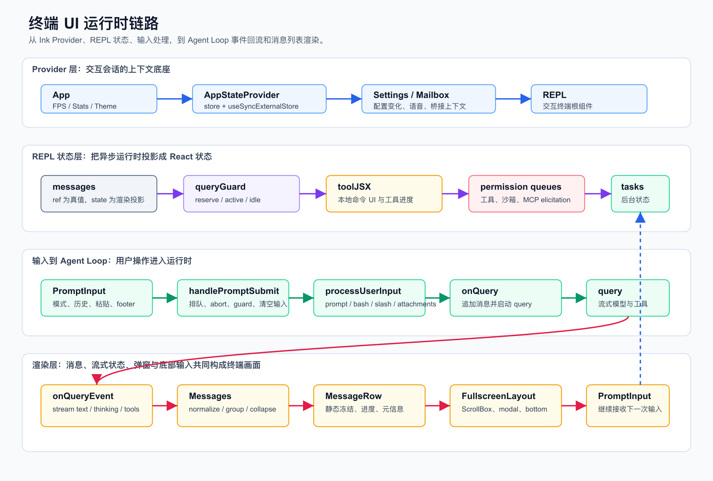
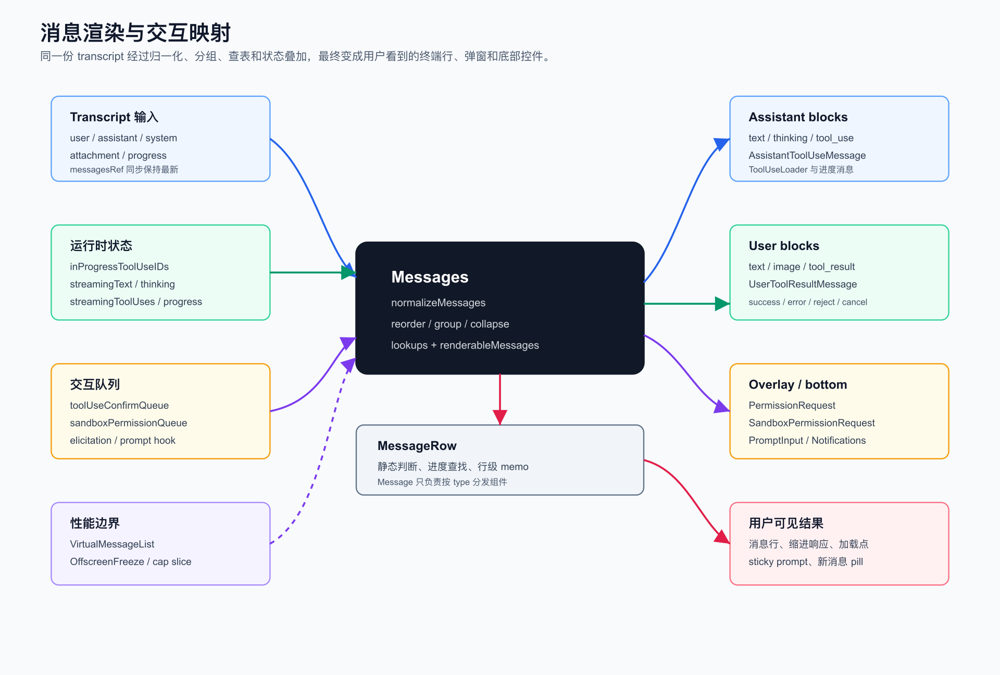

# 第 11 章：终端 UI、消息渲染与交互系统

第十章讲了 Sandbox、Shell 执行与隔离系统。

它回答的是：

```text
当模型或用户要求执行本机命令时，系统如何让命令真正跑起来，并让风险处在可控边界内？
```

这一章进入用户真正看见的层面：

```text
Claude Code 如何把 Agent Runtime 的复杂状态，投影成一个可滚动、可输入、可审批、可中断的终端 UI？
```

这就是终端 UI、消息渲染与交互系统的职责。

Claude Code 的终端 UI 不是“把 transcript 打印出来”这么简单。

它同时承载：

- 用户输入、Bash mode、slash command、历史搜索、粘贴内容和图片引用。
- 模型流式文本、thinking、tool_use、tool_result、progress message。
- 工具权限弹窗、沙箱网络审批、MCP elicitation、hook prompt。
- 本地 JSX 命令、配置菜单、背景任务面板、任务详情。
- spinner、任务树、通知、状态栏、token warning、IDE 状态。
- 全屏 ScrollBox、虚拟列表、sticky prompt、新消息 pill、transcript search。
- 中断、后台化、队列、远程控制、bridge、teammate view。

本章的核心结论是：

```text
Claude Code 的 UI 层不是被动渲染层。

它是 Agent Runtime 的交互协调器：负责把异步模型流、工具执行、权限请求、后台任务和用户输入合成一个稳定的终端体验。
```

如果前十章讲的是运行时内核，那么第十一章讲的是：

```text
这个内核如何以终端应用的形态被用户操作。
```

## 1. 本章目标

读完这一章，你要能回答：

- `App.tsx` 为什么只做 provider 包装，而不承载业务逻辑？
- `REPL.tsx` 为什么会成为最大的交互枢纽？
- `messagesRef` 和 React state 为什么要同时存在？
- `QueryGuard` 为什么用 `useSyncExternalStore()` 投影 loading 状态？
- `toolJSX` 是什么？为什么 slash command 和工具可以临时渲染 JSX？
- `PromptInput` 为什么不只是一个 TextInput？
- 输入提交为什么必须经过 `handlePromptSubmit()`，而不是直接 `onQuery()`？
- `processUserInput()` 如何分发 prompt、bash、slash command 和 attachments？
- `Messages` 如何把 transcript 变成 renderable messages？
- 为什么要做 normalize、reorder、applyGrouping、collapse？
- `MessageRow` 和 `Message` 为什么分两层？
- `AssistantToolUseMessage` 如何显示 queued、executing、completed、permission waiting？
- `UserToolResultMessage` 如何区分 success、error、reject、cancel？
- 全屏模式下 `FullscreenLayout`、`ScrollBox`、`VirtualMessageList` 分别解决什么？
- 为什么长会话必须有虚拟滚动、render cap 和 `OffscreenFreeze`？
- 权限弹窗为什么是 overlay，沙箱网络请求为什么在 bottom 区域？
- spinner 为什么要和流式文本、工具进度、后台任务互斥？
- 从 0 实现一个终端 Agent UI，最小架构应该是什么？

本章仍然讲架构，不写成用户操作手册。

## 2. 本章源码入口

建议从这些文件开始：

```text
claude-code/src/components/App.tsx
claude-code/src/screens/REPL.tsx
claude-code/src/state/AppState.tsx
claude-code/src/state/AppStateStore.ts
claude-code/src/components/FullscreenLayout.tsx
claude-code/src/components/PromptInput/PromptInput.tsx
claude-code/src/utils/handlePromptSubmit.ts
claude-code/src/utils/processUserInput/processUserInput.ts
claude-code/src/utils/processUserInput/processTextPrompt.ts
claude-code/src/utils/processUserInput/processBashCommand.tsx
claude-code/src/utils/processUserInput/processSlashCommand.tsx
claude-code/src/query.ts
claude-code/src/services/tools/StreamingToolExecutor.ts
claude-code/src/components/Messages.tsx
claude-code/src/components/VirtualMessageList.tsx
claude-code/src/components/MessageRow.tsx
claude-code/src/components/Message.tsx
claude-code/src/components/messages/AssistantToolUseMessage.tsx
claude-code/src/components/messages/UserToolResultMessage/UserToolResultMessage.tsx
claude-code/src/components/permissions/PermissionRequest.tsx
claude-code/src/components/permissions/PermissionDialog.tsx
claude-code/src/components/permissions/SandboxPermissionRequest.tsx
claude-code/src/components/PromptInput/Notifications.tsx
claude-code/src/components/Spinner.tsx
claude-code/src/components/ToolUseLoader.tsx
claude-code/src/components/MessageResponse.tsx
claude-code/src/components/BashModeProgress.tsx
claude-code/src/components/shell/OutputLine.tsx
claude-code/src/components/tasks/BackgroundTasksDialog.tsx
```

这些文件可以分成六层：

| 层级 | 代表文件 | 职责 |
| --- | --- | --- |
| Provider | `App.tsx`、`AppState.tsx` | 提供 theme、stats、store、settings watcher、mailbox 等上下文 |
| REPL 状态 | `REPL.tsx`、`AppStateStore.ts` | 维护 messages、queryGuard、toolJSX、弹窗队列、任务、输入模式 |
| 输入系统 | `PromptInput.tsx`、`handlePromptSubmit.ts`、`processUserInput.ts` | 处理输入、队列、slash、bash、attachments、图片、hooks |
| Agent Loop 接入 | `query.ts`、`StreamingToolExecutor.ts` | 把模型 stream、tool_use、tool_result、progress 回流到 UI |
| 消息渲染 | `Messages.tsx`、`MessageRow.tsx`、`Message.tsx` | 归一化、分组、折叠、查表、行级渲染 |
| 交互浮层 | `PermissionRequest.tsx`、`SandboxPermissionRequest.tsx`、`FullscreenLayout.tsx` | 权限、沙箱审批、modal、bottom、scroll chrome |

阅读时不要从某个具体组件开始。

先抓住这条总链路：

```text
App providers
  -> REPL state
  -> PromptInput
  -> handlePromptSubmit
  -> processUserInput
  -> onQuery / query
  -> stream events
  -> messages state
  -> Messages / MessageRow / Message
  -> FullscreenLayout bottom and overlay
```

## 3. 为什么终端 UI 是运行时的一部分

很多 CLI 工具的 UI 很薄：

```text
read stdin
run command
print stdout
```

Claude Code 不能这么做。

因为它的“运行中”状态不是一个线性进程。

同一时刻可能发生：

```text
模型正在流式输出文本。
工具正在执行。
Bash 正在输出 progress。
权限弹窗正在等待用户。
用户继续输入了下一条消息。
后台任务完成并投递通知。
SessionStart hook 还在补充上下文。
沙箱网络请求运行中触发审批。
用户滚动到历史位置查看旧消息。
```

如果 UI 只是打印日志，用户就无法控制这些并发状态。

所以 Claude Code 的终端 UI 必须承担三件事。

第一，状态投影。

运行时状态在内部是异步的、分散的。

UI 要把它投影为：

```text
消息列表
spinner
tool progress
permission dialog
bottom prompt
notifications
background task panel
```

第二，交互仲裁。

同一个按键在不同状态下含义不同。

例如：

```text
Ctrl+C 可能是复制选区，也可能是取消请求。
Enter 可能是提交输入，也可能是确认 footer pill。
上下键可能是移动光标、翻历史、移动 dialog 选项或滚动 transcript。
```

第三，性能边界。

长会话 transcript 可能有几千条消息。

如果每次 streaming delta 都重渲染全部消息，终端会卡死。

所以 UI 层必须有虚拟滚动、冻结、memo、render cap 和结构化查表。

这就是为什么 UI 是 Agent Runtime 的组成部分，而不是它的外壳。

## 4. 总览图：终端 UI 运行时链路



这张图可以按四段理解。

第一段，Provider 层。

`App.tsx` 只做上下文包装：

```text
FpsMetricsProvider
StatsProvider
AppStateProvider
ThemeProvider
```

它不处理用户输入，也不渲染消息。

这让真正的交互逻辑集中在 `REPL.tsx`。

第二段，REPL 状态层。

`REPL.tsx` 维护交互会话的关键状态：

```text
messages
messagesRef
queryGuard
abortController
toolJSX
toolUseConfirmQueue
sandboxPermissionRequestQueue
elicitation queue
streamingText
streamingThinking
streamingToolUses
inProgressToolUseIDs
inputValue
inputMode
showBashesDialog
focusedInputDialog
```

这不是“组件状态太多”的偶然。

REPL 是交互运行时的协调中心。

第三段，输入到 Agent Loop。

用户输入会先进入 `PromptInput`。

真正提交时进入：

```text
handlePromptSubmit()
  -> executeUserInput()
  -> processUserInput()
  -> onQuery()
  -> query()
```

这个链路会处理：

```text
排队
中断
图片缩放
attachments
bash mode
slash command
UserPromptSubmit hooks
file history snapshot
allowed tools
model override
```

第四段，渲染层。

`query()` 产生 stream events。

`REPL` 的 `onQueryEvent` 把这些事件转为：

```text
messages 更新
streamingText
streamingThinking
streamingToolUses
inProgressToolUseIDs
spinner mode
```

然后 `Messages` 把 transcript 投影为终端行。

`FullscreenLayout` 再把 scrollable、overlay、modal、bottom 组合成用户看到的屏幕。

## 5. App：只做 Provider，不做 REPL 逻辑

`components/App.tsx` 很小。

它只是把 children 包进四个 provider：

```text
FpsMetricsProvider
StatsProvider
AppStateProvider
ThemeProvider
```

这说明 Claude Code 把应用根和交互根分开了。

`App` 负责：

```text
性能指标上下文
统计上下文
全局 AppState store
主题读取与保存
```

它不关心：

```text
messages 如何变化
用户如何提交 prompt
工具如何执行
权限弹窗如何展示
```

这些都属于 REPL。

这种拆分让非交互入口也能复用部分运行时能力。

如果把所有逻辑塞进 App，后续 SDK、print、resume、remote session 入口都会被 React UI 细节绑死。

## 6. AppState：共享状态不是直接 useState

`state/AppState.tsx` 里创建的是 store。

组件通过：

```text
useAppState(selector)
useSetAppState()
useAppStateStore()
```

访问它。

关键点是 `useAppState(selector)` 使用：

```text
useSyncExternalStore
```

它只订阅 selector 返回的那一片状态。

源码注释里明确禁止 selector 直接返回整个 state。

原因很现实：

```text
如果每个组件都订阅完整 AppState，任意任务状态、通知、权限上下文变化都会重渲染整棵 UI。
```

AppState 中包含很多交互状态：

```text
settings
toolPermissionContext
tasks
mcp clients
plugins
notifications
elicitation queue
sessionHooks
footerSelection
viewingAgentTaskId
expandedView
thinkingEnabled
promptSuggestionEnabled
```

这些状态变更频繁，且属于不同 UI 区域。

所以 Claude Code 用 store + selector，把状态变化限制在真正依赖它的组件上。

这也是终端 UI 性能设计的第一层。

## 7. REPL 为什么是最大组件

`screens/REPL.tsx` 很大。

这不是因为它只负责“显示聊天窗口”。

它同时负责：

- 消息数组与 transcript。
- query 生命周期。
- streaming text / thinking / tool use。
- permission queue。
- sandbox 网络请求队列。
- MCP elicitation queue。
- prompt input、slash command、本地 JSX command。
- background tasks、teammate view、remote session、bridge。
- scroll、transcript mode、search、message actions。
- spinner、terminal title、prevent sleep、OS notification。
- compaction、resume、initial prompt、session hooks。

可以把 REPL 理解为：

```text
interactive runtime coordinator
```

它不是业务组件。

它是把运行时中的异步事件协调到一个终端 UI 的调度器。

这解释了为什么 REPL 中会有大量 `useRef`。

因为很多回调发生在异步链路中。

如果只依赖 React render 闭包，容易拿到旧 messages、旧 abortController、旧 input state。

所以它使用：

```text
messagesRef
abortControllerRef
toolUseContext refs
loading timing refs
responseLengthRef
```

来给异步代码读取最新状态。

## 8. messagesRef：真值和渲染投影分离

REPL 里维护 messages 时，不只是：

```text
const [messages, setMessages] = useState(...)
```

它还维护 `messagesRef`。

源码注释说明：

```text
messagesRef 是真值。
React state 是渲染投影。
```

`setMessages` 被包装后，会同步更新 ref，再更新 React state。

这解决了一个典型问题：

```text
异步 onQuery、permission 回调、background notification 需要立刻读到最新 messages。
React state 更新可能被批处理，闭包里的 messages 也可能过期。
```

如果没有 messagesRef，就会出现：

- 新消息覆盖旧消息。
- permission 回调基于旧 transcript 构造 context。
- streaming append 与 rewind/compact 互相打架。
- onSubmit 依赖不断变化，导致子组件闭包持有大量旧 render scope。

所以这里的设计原则是：

```text
React 负责渲染。
异步运行时需要一个同步可读的当前值。
```

## 9. QueryGuard：loading 不是一个布尔 useState

REPL 没有简单使用：

```text
const [isLoading, setIsLoading] = useState(false)
```

它使用 `QueryGuard`，再通过：

```text
useSyncExternalStore(queryGuard.subscribe, queryGuard.getSnapshot)
```

投影为 `isQueryActive`。

原因是 query 生命周期不是简单 start/end。

它有至少三种状态：

```text
idle
dispatching
running
```

`handlePromptSubmit()` 在调用 `processUserInput()` 前会先 `reserve()`。

这样即使 `processUserInput()` 中间有 await，例如：

```text
processBashCommand
processSlashCommand
getAttachmentMessages
```

新的用户输入也不会启动第二个并发 turn，而是进入队列。

这就是 `reserve()` 的意义：

```text
输入正在被处理，还没真正进入 query，但系统已经不能接受另一个并发 query。
```

`onQuery()` 中再用 `tryStart()` 正式进入 running。

结束时用 generation 检查 `end()`，防止旧 query 结束误清新 query 的 loading 状态。

这比一个布尔值可靠得多。

## 10. toolJSX：工具和命令可以临时拥有 UI

`Tool.ts` 定义了：

```text
SetToolJSXFn
```

它允许运行时设置一段 React 节点：

```text
jsx
shouldHidePromptInput
shouldContinueAnimation
showSpinner
isLocalJSXCommand
isImmediate
clearLocalJSX
```

这就是 `toolJSX`。

它被用于：

```text
local-jsx slash command
Bash mode progress
配置/菜单/选择器
某些工具执行中的临时 UI
```

`handlePromptSubmit()` 对 immediate local-jsx command 有专门路径。

例如某些 `/config`、`/doctor`、`/theme` 类命令不需要进入模型 query。

它们会：

```text
加载 command implementation
调用 impl.call(onDone, context, args)
把返回 JSX 放入 toolJSX
onDone 后清理 toolJSX
```

这使得 slash command 不只是“生成 prompt”。

它也可以是一个本地终端应用。

REPL 还区分：

```text
isLocalJSXCommand
isImmediate
```

全屏模式下 local-jsx command 会进入 modal slot。

immediate command 可以放在 bottom 区域，避免主对话流式更新时把它挤来挤去。

## 11. PromptInput 不只是输入框

`PromptInput.tsx` 是用户输入的主要组件。

它管理的不是一个字符串，而是一套输入状态机。

它处理：

```text
prompt / bash / other input mode
TextInput / VimTextInput
history navigation
history search
slash command suggestions
typeahead
prompt suggestion
paste text and image
image chip cursor
external editor
stashed prompt
queued commands edit
footer pill navigation
background tasks dialog
model picker
fast mode picker
thinking toggle
permission mode cycle
```

输入 mode 由内容前缀推导。

例如粘贴或输入 `!cmd` 时，会进入 bash mode。

但 PromptInput 不直接执行命令。

它只在合适时机调用传入的：

```text
onSubmit(input, helpers, ...)
```

提交前它还要处理几个 UI 语义。

第一，如果 footer pill 被选中，Enter 打开 footer 对应内容，而不是提交输入。

第二，如果 suggestions 正在显示，Enter 可能选择 suggestion。

第三，图片和 pasted text 以 placeholder 形式出现在输入框，但提交时要和 pastedContents 一起传下去。

第四，历史导航只在光标处于首行/末行边界时触发，不能抢走多行编辑的上下键。

这些细节说明：

```text
PromptInput 是终端交互编辑器，不是普通 textarea。
```

## 12. handlePromptSubmit：提交入口的职责边界

`handlePromptSubmit.ts` 是输入提交的核心。

它做几件事。

第一，过滤空输入。

第二，处理退出命令：

```text
exit
quit
:q
:wq
```

这些会转成 `/exit` 或直接退出。

第三，展开 pasted text refs。

输入框里可能显示：

```text
[Pasted text #1]
```

真正提交时要展开为原文。

第四，处理 local-jsx immediate command。

如果当前已有 query 正在跑，但用户提交的是 immediate local-jsx command，它可以直接打开本地 UI，而不是排队给模型。

第五，如果 query 正在 active，就把输入入队。

允许排队的 mode 是：

```text
prompt
bash
```

如果当前工具都声明 interruptBehavior 为 cancel，还可以 abort 当前 turn。

第六，真正执行时把输入包装成 `QueuedCommand`，进入 `executeUserInput()`。

这说明：

```text
handlePromptSubmit 是 UI 输入和运行时 turn 之间的闸门。
```

它既不是 PromptInput 的内部细节，也不是 query 的一部分。

## 13. executeUserInput：所有输入统一走队列模型

`executeUserInput()` 的设计点是：

```text
直接输入和已排队输入，最终都变成 QueuedCommand 列表。
```

这带来两个好处。

第一，图片处理路径一致。

无论输入是立即执行还是排队后执行，都会在 `processUserInput()` 中处理 pasted images。

第二，多个命令可以在一个 turn 前统一展开。

它会遍历 queuedCommands：

```text
第一个命令带 attachments、IDE selection、pastedContents。
后续命令跳过这些 turn-level context，避免重复注入。
```

它还会：

```text
创建新的 AbortController
reserve queryGuard
运行 processUserInput
收集 newMessages
记录 file history snapshot
清理 toolJSX
调用 onQuery
```

这条链路保证：

```text
输入处理、附件加载、hook 执行和 query 启动之间没有并发空窗。
```

## 14. processUserInput：prompt、bash、slash 的分发点

`processUserInput.ts` 是输入语义分发层。

它先把输入规范化。

如果输入是 content block 数组，会处理 image block。

如果有 pasted image，会：

```text
storeImages
maybeResizeAndDownsampleImageBlock
生成 image metadata text
```

然后根据 mode 和内容分发。

第一，bash mode：

```text
processBashCommand()
```

这就是第十章讲过的用户 `!` 命令路径。

第二，slash command：

```text
processSlashCommand()
```

它可能返回模型 prompt，也可能执行本地 JSX command，也可能 fork subagent。

第三，普通 prompt：

```text
processTextPrompt()
```

它创建 user message，并附加 attachment messages。

第四，UserPromptSubmit hooks。

如果 result.shouldQuery 为 true，会执行：

```text
executeUserPromptSubmitHooks()
```

hook 可以：

```text
blockingError
preventContinuation
additionalContexts
hook_success attachment
```

这说明用户输入在进入模型前，已经通过多层转换：

```text
raw input
  -> normalized input
  -> message objects
  -> attachments
  -> hook-injected context
  -> query messages
```

## 15. onQuery：把 newMessages 接入 Agent Loop

`REPL.tsx` 中的 `onQuery()` 是 UI 与 Agent Loop 的连接点。

它做的事情包括：

```text
tryStart queryGuard
追加 newMessages 到 messages
运行 onBeforeQuery
调用 onQueryImpl
finally 中结束 queryGuard
清理 loading 状态
处理中断后的输入恢复或重试
```

`onQueryImpl()` 则负责构造真正的 query 参数：

```text
messagesIncludingNewMessages
systemPrompt
userContext
systemContext
toolUseContext
canUseTool
tools
model
thinking config
```

并调用 `query()`。

`query()` 是 async generator。

它会 yield：

```text
stream_request_start
assistant message
progress message
tool result message
system message
tombstone
tool use summary
```

REPL 的 `onQueryEvent` 把这些事件映射回 UI state。

这就是模型流和终端渲染的接口。

## 16. StreamingToolExecutor：工具执行如何影响 UI

第八章和第十章已经讲过工具执行。

这里从 UI 角度看 `StreamingToolExecutor`。

当模型流式输出 tool_use block 时，executor 会：

```text
addTool(block, assistantMessage)
判断工具是否并发安全
符合条件就立即 executeTool
setInProgressToolUseIDs 加入 tool id
yield progress messages
yield tool result messages
markToolUseAsComplete
```

这些状态会影响 UI：

| 状态 | UI 结果 |
| --- | --- |
| tool_use 已出现但未执行 | `AssistantToolUseMessage` 显示 queued |
| tool 正在执行 | `ToolUseLoader` 闪烁，显示 tool progress |
| permission ask | 工具行显示 Waiting for permission，REPL 显示权限弹窗 |
| progress message | 工具行下方显示实时进度 |
| tool_result | `UserToolResultMessage` 渲染成功/失败/拒绝 |
| tool 完成 | `inProgressToolUseIDs` 删除该 id |

这说明 UI 不是等工具全部完成后才更新。

它跟随 streaming tool execution 逐步变化。

## 17. Messages：不是 messages.map

`Messages.tsx` 是 transcript 渲染的核心。

它不是简单：

```text
messages.map(message => <Message />)
```

它会做一系列转换：

```text
normalizeMessages
filter empty messages
compute latest bash output
compute last thinking block
create synthetic streaming tool use messages
reorderMessagesInUI
filter brief mode
applyGrouping
collapseReadSearchGroups
collapseHookSummaries
collapseBackgroundBashNotifications
collapseTeammateShutdowns
buildMessageLookups
slice or virtualize renderable messages
```

为什么要这么复杂？

因为原始 transcript 是模型/API 语义。

用户需要的是交互语义。

例如：

```text
多个 Read/Grep/Glob 可以折叠成一个读搜索组。
Hook summary 可以合并。
后台 Bash 通知可以折叠。
tool_use 和 tool_result 要能互相查找。
streaming tool_use 还没进入 messages 时，也要先显示出来。
thinking 在普通模式可以隐藏，但 transcript mode 可显示。
```

这些都不是原始 messages 数组能直接表达的。

## 18. 总览图：消息渲染与交互映射



这张图的关键是：

```text
Messages 的输入不只是 transcript。
```

它还叠加了运行时状态：

```text
inProgressToolUseIDs
streamingToolUses
streamingText
streamingThinking
progressMessages
toolUseConfirmQueue
permission queues
background task state
```

这就是为什么同一条 message 在不同时刻渲染结果不同。

例如一个 tool_use message：

```text
刚出现时：queued
执行中：loading dot + progress
等权限：Waiting for permission
完成后：success / error / reject
滚出屏幕后：OffscreenFreeze
在 transcript mode：可能显示时间和模型
```

消息渲染本质是：

```text
transcript event + runtime state -> terminal presentation
```

## 19. buildMessageLookups：渲染前先建索引

`Messages.tsx` 会调用 `buildMessageLookups()`。

它构建多类查表结构。

这些查表用于回答：

```text
某个 tool_result 对应哪个 tool_use？
某个 tool_use 是否 resolved？
某个 tool_use 是否 errored？
某条 message 对应哪些 progress messages？
某个 grouped/collapsed message 包含哪些 tool ids？
是否还有 unresolved hooks？
```

为什么不在每个 MessageRow 里遍历 messages 查找？

因为长会话里每次 render 都这样做，会变成：

```text
O(number of rows * number of messages)
```

而且 streaming 期间 render 很频繁。

所以 Claude Code 先构建 lookups，再把它传给每行。

它还缓存 lookups。

如果只是 streaming text 内容变化，结构 key 没变，就不必重建大量 Map/Set。

如果只是追加新消息，还会尝试 incremental update。

这是一条典型性能原则：

```text
把全局关系计算前置成索引，不要让每一行自己扫描全局数组。
```

## 20. MessageRow：行级状态与性能边界

`MessageRow.tsx` 位于 `Messages` 和 `Message` 之间。

它的职责不是选择具体消息组件，而是处理行级语义：

```text
是否 transcript mode
是否 grouped / collapsed
是否 active collapsed group
本行 progress messages
sibling tool use ids
是否 static
是否 shouldAnimate
是否显示 timestamp / model metadata
是否 collapse diffs
```

它还使用 `OffscreenFreeze`。

原因是非全屏模式下，终端 scrollback 已经保存了滚出屏幕的内容。

如果滚出屏幕后某个 loading dot 继续变化，就可能触发整屏 terminal reset。

`OffscreenFreeze` 的作用是：

```text
当一行已经离开可见区域时，冻结其 React element，避免无意义重绘。
```

这对 Bash elapsed timer、tool progress、collapsed read/search spinner 这类动态内容尤其重要。

## 21. Message：按消息类型分发

`Message.tsx` 才是具体消息类型分发层。

它处理这些顶层类型：

```text
attachment
assistant
user
system
grouped_tool_use
collapsed_read_search
```

assistant message 内部再按 content block 分发：

```text
tool_use -> AssistantToolUseMessage
text -> AssistantTextMessage
thinking -> AssistantThinkingMessage
redacted_thinking -> AssistantRedactedThinkingMessage
advisor block -> AdvisorMessage
```

user message 内部则分发：

```text
text -> UserTextMessage
image -> UserImageMessage
tool_result -> UserToolResultMessage
```

system message 会处理：

```text
compact boundary
local command
snip boundary
ordinary system text
```

这个分层非常清晰：

```text
Messages 负责全局转换。
MessageRow 负责行级状态。
Message 负责类型分发。
具体 message component 负责显示细节。
```

## 22. AssistantToolUseMessage：工具调用的可视状态机

`AssistantToolUseMessage.tsx` 渲染工具调用。

它先通过 tool name 找到 tool definition：

```text
findToolByName(tools, param.name)
```

再用 tool 的 schema 解析 input。

然后取工具自定义显示能力：

```text
tool.userFacingName()
tool.userFacingNameBackgroundColor()
tool.renderToolUseMessage()
tool.renderToolUseTag()
tool.renderToolUseProgressMessage()
tool.renderToolUseQueuedMessage()
```

这说明 UI 不是写死每个工具的展示。

工具自己拥有一部分 UI 协议。

`AssistantToolUseMessage` 根据 lookups 和 inProgress 状态判断：

```text
isResolved
isQueued
isWaitingForPermission
isClassifierChecking
```

然后显示不同状态：

```text
queued -> renderToolUseQueuedMessage
executing -> ToolUseLoader + progress
waiting permission -> Waiting for permission
classifier checking -> classifier checking 文本
resolved -> 完成状态
errored -> error color
```

这就是工具调用在终端里的状态机。

## 23. ToolUseLoader：一个小点也有终端细节

`ToolUseLoader.tsx` 很小，但注释很重要。

它显示左侧 loading dot。

它特别避免了某些 chalk 样式组合：

```text
dim 后面紧接 bold
```

因为 chalk 对 `dim` 和 `bold` 的 reset 都可能使用相同控制码。

如果写错，工具名会跟着 loading dot 一起闪烁。

这说明终端 UI 和 Web UI 不同。

终端样式是 ANSI 控制码叠加，局部样式泄漏会直接影响后续文本。

所以组件边界必须对 ANSI 行为敏感。

## 24. UserToolResultMessage：工具结果不是一种结果

`UserToolResultMessage.tsx` 根据 tool_result 内容分发成四类：

```text
cancel
reject
error
success
```

具体判断包括：

```text
content startsWith CANCEL_MESSAGE
content startsWith REJECT_MESSAGE
content is INTERRUPT_MESSAGE_FOR_TOOL_USE
param.is_error
```

然后渲染：

```text
UserToolCanceledMessage
UserToolRejectMessage
UserToolErrorMessage
UserToolSuccessMessage
```

这很关键。

对模型来说，tool_result 都是 user message content block。

但对用户来说：

```text
工具成功
工具报错
用户拒绝
用户取消
```

是完全不同的交互语义。

UI 层必须把它们分开显示。

## 25. MessageResponse：统一的工具响应缩进

`MessageResponse.tsx` 提供工具结果常见的缩进样式。

它会显示：

```text
⎿
```

并把子内容放在响应区域。

它还用 context 避免嵌套时重复渲染多个 `⎿`。

这是一种小但重要的抽象。

终端消息经常嵌套：

```text
tool use
  -> progress
  -> result
  -> output line
```

如果每层都自己画缩进，很容易出现多重缩进或不一致。

所以 Claude Code 把“工具响应区域”抽成独立组件。

## 26. Bash 输出的 UI 特殊路径

第十章讲过 Bash 执行。

这里看它的 UI。

用户 `!` 命令会通过 `processBashCommand()` 生成：

```text
<bash-stdout>...</bash-stdout>
<bash-stderr>...</bash-stderr>
```

渲染时：

```text
UserBashInputMessage
UserBashOutputMessage
BashToolResultMessage
ShellProgressMessage
OutputLine
```

`BashModeProgress.tsx` 在命令执行中显示：

```text
UserBashInputMessage
ShellProgressMessage
```

`OutputLine.tsx` 又处理：

```text
JSON 格式化
URL hyperlink
ANSI underline 清理
宽度截断
latest shell output 自动展开
virtual list 中的截断策略
```

这说明 Bash 输出不是普通 text。

它要处理 ANSI、宽度、截断、persisted output、stderr 和实时 progress。

## 27. PermissionRequest：工具审批的 UI 分发器

`PermissionRequest.tsx` 和 `Message.tsx` 很像。

它也是分发器。

它根据 tool 选择不同组件：

```text
FileEditTool -> FileEditPermissionRequest
FileWriteTool -> FileWritePermissionRequest
BashTool -> BashPermissionRequest
PowerShellTool -> PowerShellPermissionRequest
WebFetchTool -> WebFetchPermissionRequest
NotebookEditTool -> NotebookEditPermissionRequest
SkillTool -> SkillPermissionRequest
AskUserQuestionTool -> AskUserQuestionPermissionRequest
Glob/Grep/Read -> FilesystemPermissionRequest
```

权限组件拿到：

```text
toolUseConfirm
toolUseContext
onDone
onReject
workerBadge
setStickyFooter
```

这意味着每类工具可以有自己的审批 UI。

例如 FileEdit 可以显示 diff。

Bash 可以显示命令、规则建议、classifier 状态、沙箱提示。

ExitPlanMode 可以把选项固定到 sticky footer。

`PermissionRequest` 还监听中断键。

在 Confirmation context 下，`app:interrupt` 会触发 reject。

这让权限弹窗和全局取消行为统一。

## 28. useCanUseTool：权限请求如何进入 UI 队列

`useCanUseTool.tsx` 是 UI 侧的 canUseTool 实现。

工具执行前会调用它。

它内部先跑：

```text
hasPermissionsToUseTool()
```

如果 allow，直接 resolve。

如果 deny，直接返回 deny。

如果 ask，它会走多种路径：

```text
coordinator permission
swarm worker permission
speculative classifier grace period
interactive permission dialog
```

interactive 路径会把 `ToolUseConfirm` 放进：

```text
toolUseConfirmQueue
```

REPL 看到 focused dialog 是 tool permission 时，就渲染：

```text
<PermissionRequest ... />
```

这解释了权限弹窗的真实流向：

```text
tool execution asks permission
  -> useCanUseTool
  -> queue ToolUseConfirm
  -> REPL overlay renders PermissionRequest
  -> user allow/reject
  -> Promise resolves
  -> tool execution continues or aborts
```

权限 UI 不是同步函数。

它是一个把 Promise 暂停在 UI 交互上的队列系统。

## 29. SandboxPermissionRequest：运行中审批不同于工具审批

沙箱网络审批不走 `ToolUseConfirm`。

它由 SandboxManager 的 ask callback 在命令运行中触发。

REPL 维护：

```text
sandboxPermissionRequestQueue
workerSandboxPermissions.queue
```

当 focused dialog 是 sandbox permission 时，底部显示：

```text
SandboxPermissionRequest
```

它的问题是：

```text
Network request outside of sandbox
Host: ...
Do you want to allow this connection?
```

选项包括：

```text
Yes
Yes, and don't ask again for host
No, and tell Claude what to do differently
```

如果 managed domains only 开启，“以后都允许”选项会被收窄。

如果用户选择持久允许，REPL 会：

```text
add WebFetch domain allow rule
applyPermissionUpdate
persistPermissionUpdate
SandboxManager.refreshConfig()
```

这和工具权限不同。

工具权限发生在工具执行前。

沙箱网络审批发生在命令执行中。

所以它必须有单独队列和 UI 路径。

## 30. FullscreenLayout：终端布局的核心抽象

`FullscreenLayout.tsx` 负责全屏模式布局。

它把 UI 分为几个槽：

```text
scrollable
bottom
overlay
bottomFloat
modal
```

其中：

| 槽位 | 用途 |
| --- | --- |
| `scrollable` | 消息列表、spinner、工具输出 |
| `bottom` | PromptInput、footer、sticky footer、部分 dialog |
| `overlay` | 在 ScrollBox 后方显示的权限请求 |
| `bottomFloat` | 浮动气泡类内容 |
| `modal` | local-jsx command、配置菜单等底部 anchored pane |

全屏模式下，它使用 `ScrollBox`。

这让消息区可以滚动，而 prompt 固定在底部。

非全屏模式则走顺序渲染，让终端原生 scrollback 继续工作。

这就是为什么 REPL 里有两条渲染路径：

```text
fullscreen path
normal scrollback path
```

两者不能简单合并。

## 31. sticky prompt 与 new message pill

全屏 ScrollBox 带来一个新问题：

用户滚到历史位置时，新的模型输出还在底部产生。

这时 UI 需要告诉用户：

```text
当前位置不是底部。
下面有新消息。
```

`FullscreenLayout.tsx` 提供了：

```text
useUnseenDivider()
computeUnseenDivider()
ScrollChromeContext
sticky prompt
new message pill
```

`useUnseenDivider()` 会在用户第一次滚离底部时记录：

```text
message count
scrollHeight
divider index
```

后续新消息产生时，Messages 可以在对应位置插入：

```text
N new messages
```

bottom pill 则允许用户跳到底部。

`VirtualMessageList` 中的 StickyTracker 会把当前区域的 user prompt 提取出来，写入 ScrollChromeContext。

这样用户滚动时仍能知道当前上下文属于哪条 prompt。

这是一种终端版的“滚动上下文导航”。

## 32. VirtualMessageList：长会话不能全量挂载

`Messages.tsx` 里有很长的注释解释长会话问题。

如果没有虚拟滚动，Ink 会为每条消息挂载完整 fiber tree。

长会话可能造成：

```text
几千行 screen buffer
数百 MB fiber 内存
每帧大量终端写入
GC 压力飙升
```

所以全屏模式下会使用：

```text
VirtualMessageList
```

它基于 `useVirtualScroll()`：

```text
计算 visible range
维护 top spacer / bottom spacer
测量每项高度
支持 scrollToIndex
支持 search jump
支持 message action cursor
```

非虚拟路径也有安全 cap：

```text
MAX_MESSAGES_WITHOUT_VIRTUALIZATION
```

它用 UUID anchor 维护 slice 起点，而不是简单 `slice(-200)`。

原因是 count-based slicing 会在每次追加消息时移动前边界，导致 scrollback 内容不断变化，引发终端 reset。

这类细节说明：

```text
终端 UI 的性能问题不是 React 层面 alone。
它还包括终端缓冲区、ANSI 输出、Ink 布局和用户 scrollback 语义。
```

## 33. transcript mode：同一份消息的另一种投影

REPL 有 transcript mode。

它不是另一个数据源。

它仍然渲染 messages，只是参数不同。

在 transcript mode 中：

```text
verbose true
screen = transcript
hidePastThinking true
showAllInTranscript 可切换
transcript search 可用
VirtualMessageList 可复用
```

它还支持：

```text
renderMessagesToPlainText
open in external editor
dump to terminal scrollback
search badge
```

这说明 Messages 的设计是可投影的。

同一份 transcript 可以投影为：

```text
主聊天窗口
全量 transcript
导出文本
teammate view
brief mode view
```

这就是为什么消息渲染逻辑要集中在 `Messages`，而不是散落在 REPL 各处。

## 34. Spinner：不是简单 loading

`Spinner.tsx` 的职责不只是显示“加载中”。

它根据状态显示：

```text
thinking
tool activity
task list
teammate spinner tree
token count
brief spinner
idle status
stalled indication
spinner tip
stop hook suffix
```

REPL 会计算 `showSpinner`。

它要避免和其他 UI 冲突：

```text
等待 permission 时不该显示普通 spinner。
streaming text 正在显示时，文本本身就是反馈。
local-jsx command 正在显示时，不能让 spinner 抢占注意力。
sandbox permission queue 有内容时，要显示审批而不是普通 loading。
```

这说明 spinner 不是 loading 布尔值的结果。

它是多个运行时状态的合成。

## 35. Notifications：短暂状态的队列

`context/notifications.tsx` 定义通知队列。

通知有：

```text
key
priority
timeoutMs
invalidates
fold
text or jsx
```

`immediate` 优先级会立刻替换当前通知。

普通通知进入队列。

相同 key 可以 fold。

`PromptInput/Notifications.tsx` 负责显示：

```text
IDE 状态
当前 notification
overage 提示
apiKeyHelper 慢提示
登录错误
token warning
memory usage
sandbox footer hint
voice indicator
```

通知系统和 messages 不同。

messages 是 transcript 的一部分。

notifications 是短暂 UI 状态。

这一区分很重要。

否则所有 transient hint 都进入 transcript，会污染上下文和历史。

## 36. BackgroundTasksDialog：后台任务的交互面

第八章讲过 Task 系统。

第十一章看它的 UI。

`BackgroundTasksDialog.tsx` 从 AppState 读取：

```text
tasks
foregroundedTaskId
expandedView
```

它把 task 分类为：

```text
local_bash
remote_agent
local_agent
in_process_teammate
local_workflow
monitor_mcp
dream
leader
```

然后提供 list/detail 两种模式。

用户可以进入某个任务详情。

对 shell task，会进入：

```text
ShellDetailDialog
```

对 agent task，会进入对应 agent detail。

这说明后台任务不是隐藏状态。

它们有可见入口、状态、详情和控制面。

## 37. 本地 JSX command 与 modal/bottom 的布局原则

REPL 对 local-jsx command 有清晰布局规则。

全屏模式下：

```text
local-jsx command 放入 modal slot
```

这让它覆盖在底部 anchored pane 中。

一些 immediate command 则可以放在 bottom。

注释解释得很明确：

```text
immediate command 应该保持固定，不随 ScrollBox 里新消息 relayout。
非 immediate command 可以在 scrollable 中，因为主循环暂停，内容可能很高。
```

这条规则解决的是终端交互稳定性：

```text
用户正在菜单里选择时，不能因为模型继续输出导致菜单位置跳动。
```

所以 modal/bottom/scrollable 的分槽不是视觉偏好，而是交互语义。

## 38. 按键系统：同一个按键在不同 context 下不同含义

REPL 和 PromptInput 都大量使用 keybinding。

典型 context 包括：

```text
Chat
Confirmation
Transcript
```

比如：

```text
PermissionRequest 中 app:interrupt 表示 reject。
ScrollKeybindingHandler 中 Ctrl+C 如果有选区，应该复制而不是取消请求。
PromptInput 中上下键优先移动光标，边界处才进入历史。
footer pill 选中时 Enter 打开对应面板，而不是提交 prompt。
```

这说明按键不是全局硬编码。

它需要上下文仲裁。

否则终端应用会出现最糟糕的体验：

```text
用户以为自己在滚动，实际取消了任务。
用户以为自己提交输入，实际打开了 footer。
用户以为自己复制选区，实际中断了模型。
```

## 39. UI 层的几个重要不变量

从源码看，Claude Code UI 层有几个不变量。

第一，messages 是 append-heavy，但不能假设永远只 append。

它可能被：

```text
compact
rewind
clear
resume
teammate view swap
stream replacement
```

改变。

第二，render key 必须稳定。

`Messages` 对 streaming tool use 使用 deterministic UUID。

原因是随机 key 会导致 React remount，进而出现 Ink 渲染错乱。

第三，UI 不应把所有动态状态写进 transcript。

spinner、notifications、permission dialog、toolJSX 都是 UI 状态。

只有真正需要保留的 user/assistant/system/attachment/progress 才进 messages。

第四，长会话必须有性能保护。

这些保护包括：

```text
useDeferredValue
VirtualMessageList
render cap
OffscreenFreeze
lookups cache
row-level memo
selector-based AppState subscription
```

第五，异步回调不能盲信 render 闭包。

REPL 大量使用 ref，是为了让异步链路读到最新值。

这不是风格问题，而是防止状态竞态。

## 40. 从 0 实现一个终端 Agent UI

如果你要实现类似的终端 Agent UI，最小架构应该包含这些模块。

第一，Provider 层。

```text
theme
global store
settings watcher
notification store
runtime metrics
```

第二，REPL coordinator。

```text
messages state and ref
query lifecycle guard
abort controller
streaming state
permission queues
tool UI slot
background task state
focused dialog state
```

第三，输入编辑器。

```text
prompt mode
shell mode
slash command
history
paste/image handling
queued command editing
keybinding context
```

第四，提交管线。

```text
queue if active
reserve guard
normalize input
load attachments
run prompt hooks
build user messages
start query
```

第五，消息渲染管线。

```text
normalize
reorder
group
collapse
build lookups
render rows
streaming placeholder
```

第六，工具状态 UI。

```text
queued
executing
progress
waiting permission
success
error
rejected
cancelled
```

第七，布局系统。

```text
scrollable transcript
fixed bottom prompt
overlay permission
modal command UI
new message pill
sticky prompt
virtual scroll
```

第八，性能保护。

```text
stable keys
row memo
offscreen freeze
selector subscriptions
output truncation
render caps
virtualization
```

没有这些模块，简单 demo 可以跑，但真实长会话会迅速出现卡顿、状态错乱或交互冲突。

## 41. 常见误区

第一，把 UI 当成 transcript printer。

真实 UI 要渲染的是：

```text
transcript + runtime state
```

第二，把 loading 当成一个布尔值。

Claude Code 中 loading 包括：

```text
dispatching
query running
external loading
streaming text
tool execution
permission waiting
background notification processing
```

第三，忽略长会话性能。

终端 UI 比 Web UI 更容易被全量重绘拖垮。

因为每次重绘都可能变成大量 ANSI 写入和 Yoga layout。

第四，把所有反馈写进 messages。

短暂通知、spinner、dialog 不应该污染 transcript。

第五，直接在每行里全局搜索 tool_use/tool_result。

长会话下必须先构建 lookups。

第六，忽略按键 context。

终端里按键资源很少。

同一个键必须根据当前交互层决定归属。

第七，把 local command UI 放在消息流里。

如果 command 是用户正在操作的菜单，应放在 modal 或 bottom，避免被新消息挤动。

## 42. 推荐阅读顺序

建议按这个顺序读源码：

```text
1. components/App.tsx
2. state/AppState.tsx
3. screens/REPL.tsx
4. components/PromptInput/PromptInput.tsx
5. utils/handlePromptSubmit.ts
6. utils/processUserInput/processUserInput.ts
7. query.ts
8. services/tools/StreamingToolExecutor.ts
9. components/Messages.tsx
10. components/MessageRow.tsx
11. components/Message.tsx
12. components/messages/AssistantToolUseMessage.tsx
13. components/messages/UserToolResultMessage/UserToolResultMessage.tsx
14. components/FullscreenLayout.tsx
15. components/VirtualMessageList.tsx
16. components/permissions/PermissionRequest.tsx
17. components/Spinner.tsx
```

如果只读三处，读：

```text
screens/REPL.tsx
utils/handlePromptSubmit.ts
components/Messages.tsx
```

这三处分别对应：

```text
交互状态中心
输入提交闸门
消息渲染管线
```

## 43. 本章小结

这一章讲的是 Claude Code 如何把复杂 Agent Runtime 呈现为一个可操作的终端应用。

最重要的结论有五个。

第一，终端 UI 是运行时协调器，不是简单输出层。

它要同时处理模型流、工具状态、权限请求、沙箱审批、后台任务和用户输入。

第二，REPL 是交互状态中心。

它用 messagesRef、queryGuard、toolJSX、permission queues、streaming state 和 AppState 把异步运行时同步到 React UI。

第三，输入提交是独立管线。

PromptInput 负责编辑体验，handlePromptSubmit 负责排队和 guard，processUserInput 负责语义分发，onQuery 才进入模型循环。

第四，消息渲染是 transcript 与 runtime state 的合成。

Messages 先 normalize、group、collapse、build lookups，再由 MessageRow 和 Message 分发到具体组件。

第五，长会话性能是核心架构问题。

VirtualMessageList、OffscreenFreeze、render cap、selector subscription、stable key 和 lookup cache 都是为了让终端 UI 在长时间使用中保持可控。

第十二章可以继续进入：

```text
CLI 命令系统、Slash Command 与本地交互扩展
```

前十一章已经覆盖了从运行时内核到终端交互的主链路。

下一章可以专门拆解 `/commands`、内置命令、plugin command、skill command、本地 JSX command 与 forked command 如何共同构成 Claude Code 的可扩展命令面。
