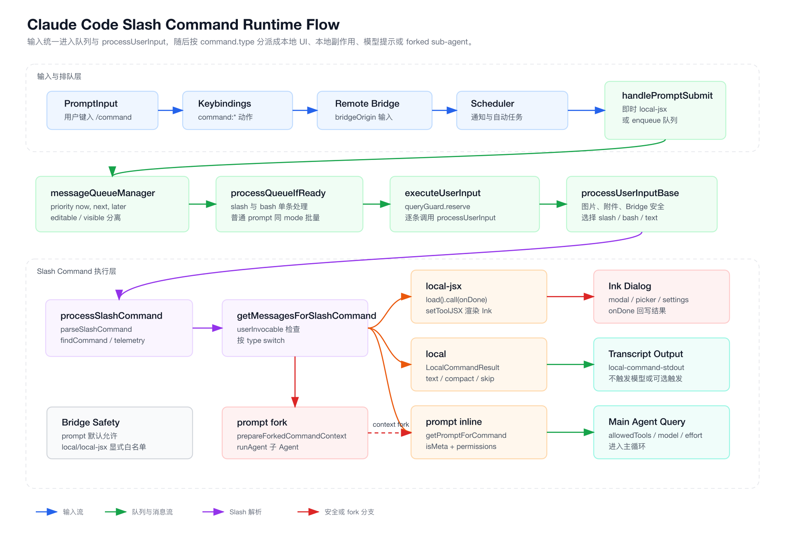
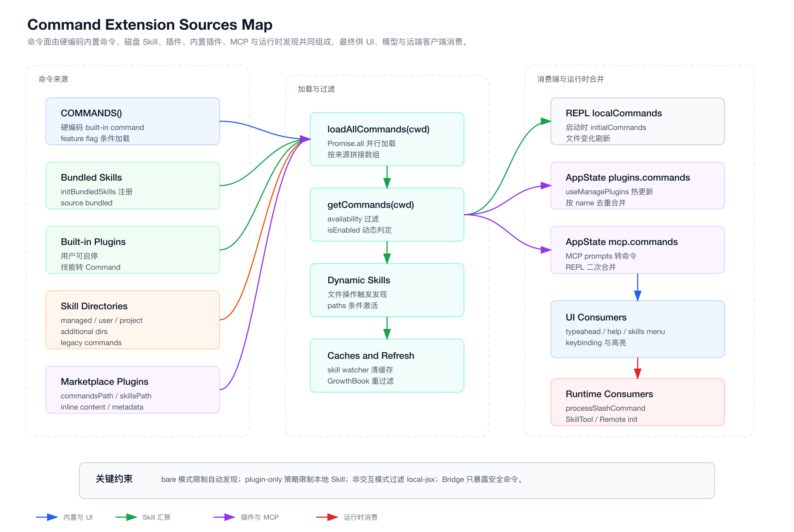
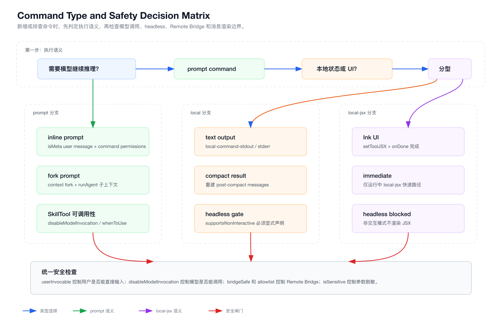

# 第 12 章：CLI 命令系统、Slash Command 与本地交互扩展

> 本章只分析 `claude-code/` 子目录下的实现。所有源码路径都以 `claude-code/` 为根，文档与图表落在 `tech-docs/new/`。

前一章拆解了终端 UI、消息渲染、输入框、队列与本地 JSX 命令之间的关系。
这一章继续沿着输入链路往下看：当用户输入 `/commit`、`/config`、`/compact`、`/review`，或者插件、Skill、MCP 暴露新的命令时，Claude Code 如何把它们统一注册、补全、过滤、执行，并最终转成 UI、副作用、模型 prompt 或 forked sub-agent。

Claude Code 的命令系统容易被误解成一个简单的 slash parser。
源码里真正的设计更接近一个“本地交互扩展总线”：

- 命令既可以来自内置代码，也可以来自磁盘 Skill、插件、内置插件、MCP prompt、运行时动态发现。
- 命令既可以只影响本地 TUI，也可以变成模型可见的提示内容。
- 命令既可以同步返回 stdout，也可以打开 Ink 弹层，还可以派生一个子 Agent。
- 同一个命令列表同时服务于输入补全、Help 页面、SkillTool、Remote Control、非交互模式和实际执行路径。

理解这一章以后，再看 `/commit`、`/model`、`/skills`、插件 command、Skill command 这些能力时，会发现它们并不是散落在不同入口里的特殊逻辑，而是同一个 `Command` 类型的几种执行形态。

## 12.1 源码入口总览

命令系统的核心入口分布在这些文件里：

| 模块 | 职责 |
| --- | --- |
| `src/types/command.ts` | 定义 `Command`、`PromptCommand`、`LocalCommand`、`LocalJSXCommand` 三类命令形态 |
| `src/commands.ts` | 内置命令注册、动态命令加载、过滤、查找、Bridge/Remote 安全判断 |
| `src/utils/slashCommandParsing.ts` | 极简 slash 解析，把 `/name args` 拆成 `commandName` 和 `args` |
| `src/utils/processUserInput/processUserInput.ts` | 从输入模式进入 slash/bash/text 分支，并处理 Bridge 安全覆写 |
| `src/utils/processUserInput/processSlashCommand.tsx` | Slash Command 的核心执行器，按 `command.type` 分派 |
| `src/utils/handlePromptSubmit.ts` | 输入提交、即时命令、排队、`executeUserInput` 统一执行 |
| `src/utils/messageQueueManager.ts` | 统一命令队列，维护优先级、可编辑性、可见性 |
| `src/utils/queueProcessor.ts` | 队列出队策略，slash/bash 单条执行，普通 prompt 批量执行 |
| `src/hooks/useTypeahead.tsx` | slash command 补全、参数提示、mid-input ghost text |
| `src/utils/suggestions/commandSuggestions.ts` | 命令搜索、排序、分组、SuggestionItem 生成 |
| `src/hooks/useMergedCommands.ts` | REPL 里合并本地命令、插件命令、MCP 命令 |
| `src/skills/loadSkillsDir.ts` | 从 `.claude/skills` 与 legacy `.claude/commands` 读取 Skill 命令 |
| `src/utils/plugins/loadPluginCommands.ts` | 从插件目录读取 markdown command 与 plugin skill |
| `src/skills/bundledSkills.ts` | 编译进 CLI 的 bundled skill 注册表 |
| `src/plugins/builtinPlugins.ts` | 内置插件注册表，把内置插件 Skill 转成 Command |
| `src/hooks/useReplBridge.tsx` | Remote Control 对可用 slash command 的过滤与桥接 |
| `src/main.tsx` | Commander CLI 子命令、启动时命令加载、非交互模式过滤 |

这张图先给出运行时主链路：



再看命令来源如何汇聚：



## 12.2 `Command` 类型：三种执行形态

`src/types/command.ts` 是命令系统的类型边界。
它不是简单的 `{ name, handler }`，而是把命令分成三类：

```ts
export type Command = CommandBase &
  (PromptCommand | LocalCommand | LocalJSXCommand)
```

三类命令的区别如下：

| 类型 | 典型命令 | 执行结果 | 是否触发模型 |
| --- | --- | --- | --- |
| `prompt` | `/commit`、`/review`、Skill、插件 command、MCP skill | 生成模型可见的 prompt 内容和临时权限 | 通常会 |
| `local` | `/compact`、`/files`、`/summary`、`/version` | 本地函数返回 text/compact/skip | 通常不会 |
| `local-jsx` | `/config`、`/help`、`/model`、`/permissions` | 渲染 Ink UI，靠 `onDone` 关闭 | 默认不会，可由命令选择 |

### 12.2.1 共同字段：命令被谁看见、如何显示、是否可用

`CommandBase` 里有一组和执行无关、但会影响可见性和安全性的字段：

```ts
export type CommandBase = {
  availability?: CommandAvailability[]
  bridgeSafe?: boolean
  getBridgeInvocationError?: (args: string) => string | undefined
  description: string
  hasUserSpecifiedDescription?: boolean
  isEnabled?: () => boolean
  isHidden?: boolean
  name: string
  aliases?: string[]
  isMcp?: boolean
  argumentHint?: string
  whenToUse?: string
  version?: string
  disableModelInvocation?: boolean
  userInvocable?: boolean
  loadedFrom?: 'commands_DEPRECATED' | 'skills' | 'plugin' | 'managed' | 'bundled' | 'mcp'
  kind?: 'workflow'
  immediate?: boolean
  isSensitive?: boolean
  userFacingName?: () => string
}
```

这些字段在不同位置被消费：

- `isEnabled()`：由 `getCommands()` 每次过滤时动态执行，适合 feature flag、环境变量、平台能力。
- `isHidden`：隐藏在补全和 Help 里，但精确输入可能仍可被处理。
- `aliases`：让 `/settings` 指向 `/config` 这类别名成立。
- `argumentHint`：输入 `/model ` 之后的参数提示。
- `whenToUse`：SkillTool 和技能搜索使用，描述模型何时该用这个能力。
- `disableModelInvocation`：用户仍可能输入，但模型不会通过 SkillTool 调用。
- `userInvocable`：为 false 时，用户直接输入会被拒绝，只允许模型通过 SkillTool 触发。
- `immediate`：当主循环正在执行时，某些 `local-jsx` 命令仍可立即打开 UI。
- `bridgeSafe` 与 `getBridgeInvocationError`：Remote Control 安全白名单。
- `isSensitive`：敏感命令参数在 transcript 中用 `***` 替代。

辅助函数也在类型文件里：

```ts
export function getCommandName(cmd: CommandBase): string {
  const name = cmd.userFacingName?.() ?? cmd.name
  return name || ''
}

export function isCommandEnabled(cmd: CommandBase): boolean {
  return cmd.isEnabled?.() ?? true
}
```

注意 `getCommandName()`。
插件或 Skill 可以通过 `userFacingName()` 改显示名，但 `processSlashCommand` 在 telemetry、metadata 或 forked skill 场景里有时必须使用 `command.name` 的完整限定名。
这也是源码里多处刻意区分 `command.name` 和 `getCommandName(command)` 的原因。

### 12.2.2 `prompt` 命令：把命令变成模型上下文

`PromptCommand` 的核心字段是：

```ts
export type PromptCommand = {
  type: 'prompt'
  progressMessage: string
  contentLength: number
  argNames?: string[]
  allowedTools?: string[]
  model?: string
  source: SettingSource | 'builtin' | 'mcp' | 'plugin' | 'bundled'
  pluginInfo?: { pluginManifest: PluginManifest; repository: string }
  disableNonInteractive?: boolean
  hooks?: HooksSettings
  skillRoot?: string
  context?: 'inline' | 'fork'
  agent?: string
  effort?: EffortValue
  paths?: string[]
  getPromptForCommand(args: string, context: ToolUseContext): Promise<ContentBlockParam[]>
}
```

它的本质是：命令执行时并不直接“完成任务”，而是把命令展开成一段给模型看的上下文。

典型例子是 `src/commands/commit.ts`：

- `type: 'prompt'`
- `allowedTools` 包含 `Bash(git add:*)`、`Bash(git status:*)`、`Bash(git commit:*)`
- `getPromptForCommand()` 构造一段提交指令
- 指令里通过 `!` 语法嵌入 `git status`、`git diff HEAD`、`git branch --show-current`、`git log --oneline -10`
- 再由 `executeShellCommandsInPrompt()` 执行这些 shell 片段，把输出替换进 prompt

最终 `/commit` 不是一个本地 `git commit` 函数。
它是一个“临时强化模型任务”的 prompt command：模型看到 git 状态、diff 和安全协议，然后自己调用工具完成 commit。

### 12.2.3 `local` 命令：本地函数返回结果

`LocalCommand` 是轻量本地命令：

```ts
type LocalCommand = {
  type: 'local'
  supportsNonInteractive: boolean
  load: () => Promise<LocalCommandModule>
}
```

`LocalCommandResult` 有三种：

```ts
export type LocalCommandResult =
  | { type: 'text'; value: string }
  | { type: 'compact'; compactionResult: CompactionResult; displayText?: string }
  | { type: 'skip' }
```

这类命令一般不会让模型继续工作。
它们只是把结果写入 transcript，或者执行本地状态变更。

`/compact` 是典型复杂 `local` 命令。
`src/commands/compact/index.ts` 声明：

```ts
const compact = {
  type: 'local',
  name: 'compact',
  supportsNonInteractive: true,
  argumentHint: '<optional custom summarization instructions>',
  load: () => import('./compact.js'),
}
```

`src/commands/compact/compact.ts` 的 `call()` 会：

- 取出当前 messages。
- 尝试 session memory compaction。
- 可能走 reactive compact。
- 否则走传统 `compactConversation()`。
- 返回 `{ type: 'compact', compactionResult, displayText }`。

`processSlashCommand` 收到 `compact` result 后不会简单打印文本，而是调用 `buildPostCompactMessages()` 重建压缩后的消息边界。
所以 `local` 不是“只能返回字符串”，它也能控制对话历史的结构。

### 12.2.4 `local-jsx` 命令：把命令变成 Ink 交互 UI

`LocalJSXCommand` 更像 TUI 的插件点：

```ts
type LocalJSXCommand = {
  type: 'local-jsx'
  load: () => Promise<LocalJSXCommandModule>
}
```

对应实现函数：

```ts
export type LocalJSXCommandCall = (
  onDone: LocalJSXCommandOnDone,
  context: ToolUseContext & LocalJSXCommandContext,
  args: string,
) => Promise<React.ReactNode>
```

`onDone()` 不只是关闭 UI，它还能传回：

- `display: 'skip' | 'system' | 'user'`
- `shouldQuery`
- `metaMessages`
- `nextInput`
- `submitNextInput`

例如：

- `src/commands/config/index.ts` 定义 `/config`，别名 `/settings`，`load()` 到 `config.js`。
- `src/commands/config/config.tsx` 返回 `<Settings />`。
- `src/commands/help/help.tsx` 返回 `<HelpV2 />`。
- `src/commands/model/model.tsx` 根据 args 决定展示 model picker、直接设置 model，或输出当前 model。
- `src/commands/permissions/permissions.tsx` 返回 `<PermissionRuleList />`，还可以通过 `context.setMessages()` 注入 retry message。

这就是上一章所说的“local JSX command 会占用输入区域”的来源。
Slash 命令系统不是简单执行 handler，而是能把终端局部切换成一个小型交互应用。

## 12.3 内置命令注册：`COMMANDS()` 与 feature-gated require

`src/commands.ts` 是内置命令的中心注册表。
文件顶部会 import 一批稳定内置命令，例如：

- `addDir`
- `clear`
- `compact`
- `config`
- `diff`
- `doctor`
- `help`
- `init`
- `memory`
- `model`
- `permissions`
- `review`
- `securityReview`
- `status`
- `vim`

同时也有大量 feature-gated 命令。
这些命令不是直接静态 import，而是：

```ts
const proactive = feature('KAIROS')
  ? (require('./commands/proactive.js') as typeof import('./commands/proactive.js')).default
  : null
```

源码注释明确提到这是为了 dead code elimination。
也就是说，命令注册同时服务两个目标：

1. 运行时按 feature flag 决定是否启用。
2. 构建时让外部版本能剔除内部能力。

内置命令最终进入 `COMMANDS`：

```ts
const COMMANDS = memoize((): Command[] => [
  addDir,
  advisor,
  agentsPlatform,
  scheduleCommand,
  memoryStoresCommand,
  skillStoreCommand,
  vaultCommand,
  localVaultCommand,
  localMemoryCommand,
  autonomy,
  provider,
  agents,
  branch,
  ...
  compact,
  config,
  ...
  review,
  ultrareview,
  ...
  commit,
  commitPushPr,
  ...
  ...(process.env.USER_TYPE === 'ant' && !process.env.IS_DEMO
    ? INTERNAL_ONLY_COMMANDS
    : []),
])
```

这里有几个重要点：

- `COMMANDS()` 被 `memoize()` 包起来，因为有些命令定义会读取 config，不能在模块初始化时过早执行。
- internal-only 命令通过 `USER_TYPE === 'ant'` 加入。
- 部分 public-but-previously-locked 命令已经从 internal 列表移到主数组。
- `builtInCommandNames()` 会把内置命令名和 aliases 都放进 Set，用于 telemetry 和 parser 分类。

`builtInCommandNames()` 不等于“所有可用命令”。
它只用于识别内置命令名字。
插件、Skill、MCP 的命令会在别的加载链路合入。

## 12.4 动态命令加载：`getCommands(cwd)` 不只是取内置数组

命令系统真正的加载入口是：

```ts
export async function getCommands(cwd: string): Promise<Command[]> {
  const allCommands = await loadAllCommands(cwd)
  const dynamicSkills = getDynamicSkills()
  const baseCommands = allCommands.filter(
    _ => meetsAvailabilityRequirement(_) && isCommandEnabled(_),
  )
  ...
}
```

`loadAllCommands(cwd)` 会并行加载：

```ts
const [
  { skillDirCommands, pluginSkills, bundledSkills, builtinPluginSkills },
  pluginCommands,
  workflowCommands,
] = await Promise.all([
  getSkills(cwd),
  getPluginCommands(),
  getWorkflowCommands ? getWorkflowCommands(cwd) : Promise.resolve([]),
])
```

最终拼接顺序是：

```ts
return [
  ...bundledSkills,
  ...builtinPluginSkills,
  ...skillDirCommands,
  ...(workflowCommands as Command[]),
  ...(pluginCommands as Command[]),
  ...pluginSkills,
  ...COMMANDS(),
]
```

这个顺序有两个信号：

- Skill、插件和 workflow 不只是补充能力，它们和内置命令在同一个 `Command[]` 里竞争展示和执行。
- 内置命令被放在后面，动态技能插入时会刻意插到内置命令之前。

### 12.4.1 availability 和 isEnabled 的区别

`meetsAvailabilityRequirement()` 处理“谁能用”：

- `claude-ai`：claude.ai OAuth subscriber。
- `console`：直连 Anthropic Console API key 用户。

`isCommandEnabled()` 处理“此刻是否启用”：

- GrowthBook flag。
- 平台环境。
- env var。
- 权限状态。
- 运行模式。

源码注释特意说明，availability 不 memoize，因为登录状态可能在会话中变化。
这意味着 `/login` 之后命令列表可以刷新，而不是只能重启生效。

### 12.4.2 缓存层：命令加载昂贵，但过滤必须新鲜

`loadAllCommands` 被 `memoize()` 包起来，因为它涉及磁盘 I/O、插件读取、Skill 解析。
但 `getCommands()` 每次仍会重新执行：

- availability 过滤。
- `isEnabled()` 过滤。
- dynamic skill 注入。

这个分层很关键：

- “命令内容从哪里加载”是昂贵的，可以缓存。
- “命令此刻是否可见”是便宜但易变的，不能永久缓存。

`clearCommandMemoizationCaches()` 和 `clearCommandsCache()` 也体现了这个分层。

```ts
export function clearCommandMemoizationCaches(): void {
  loadAllCommands.cache?.clear?.()
  getSkillToolCommands.cache?.clear?.()
  getSlashCommandToolSkills.cache?.clear?.()
  clearSkillIndexCache?.()
}

export function clearCommandsCache(): void {
  clearCommandMemoizationCaches()
  clearPluginCommandCache()
  clearPluginSkillsCache()
  clearSkillCaches()
}
```

GrowthBook 刷新只需要清命令 memo。
Skill 文件变化则要清更多缓存，重新读磁盘。

## 12.5 Skill 命令：`.claude/skills` 与 legacy `.claude/commands`

`src/skills/loadSkillsDir.ts` 把本地 Skill 变成 `Command`。

新的 Skill 目录格式是：

```text
.claude/skills/
  skill-name/
    SKILL.md
```

legacy custom command 目录也仍支持：

```text
.claude/commands/
  foo.md
  namespace/
    bar.md
  skill-style/
    SKILL.md
```

源码里把 legacy commands 也转成 prompt command，并标记：

```ts
loadedFrom: 'commands_DEPRECATED'
```

### 12.5.1 Skill frontmatter 如何映射到 Command 字段

`parseSkillFrontmatterFields()` 会解析这些字段：

| frontmatter | Command 字段 |
| --- | --- |
| `name` | `userFacingName()` 的显示名 |
| `description` | `description` |
| `allowed-tools` | `allowedTools` |
| `argument-hint` | `argumentHint` |
| `arguments` | `argNames` |
| `when_to_use` | `whenToUse` |
| `version` | `version` |
| `model` | `model` |
| `disable-model-invocation` | `disableModelInvocation` |
| `user-invocable` | `userInvocable` |
| `hooks` | `hooks` |
| `context: fork` | `context: 'fork'` |
| `agent` | `agent` |
| `effort` | `effort` |
| `paths` | 条件激活规则 |
| `shell` | prompt shell 插值使用的 shell |

然后 `createSkillCommand()` 返回一个 `type: 'prompt'` 的命令。

重要逻辑在 `getPromptForCommand()` 里：

1. 如果有 `baseDir`，给 prompt 前缀加上 `Base directory for this skill: ...`。
2. 替换命令参数。
3. 替换 `${CLAUDE_SKILL_DIR}`。
4. 替换 `${CLAUDE_SESSION_ID}`。
5. 对非 MCP skill 执行 `!` shell 插值。
6. 返回 `[{ type: 'text', text: finalContent }]`。

MCP skill 被特殊处理：远端不可信，所以不会执行 markdown body 中的 inline shell command。

### 12.5.2 来源优先级和去重

`getSkillDirCommands(cwd)` 会读取：

- policy/managed skills。
- user skills。
- project skills。
- additional directories。
- legacy commands。

然后通过 `realpath()` 解析文件 identity，避免 symlink 或父目录重叠导致同一个文件加载多次。

顺序上，managed/user/project/additional/legacy 都会被合并。
但重复文件只保留第一次。

### 12.5.3 条件 Skill 和动态发现

Skill 支持 `paths` frontmatter。
这类 Skill 不会一开始暴露给命令列表，而是进入 `conditionalSkills`：

```ts
const conditionalSkills = new Map<string, Command>()
const activatedConditionalSkillNames = new Set<string>()
```

当文件操作触达某些路径时，`activateConditionalSkillsForPaths()` 会用 `ignore` 库做 gitignore 风格匹配。
匹配后：

- 移到 `dynamicSkills`。
- 从 `conditionalSkills` 删除。
- 记录 activated。
- emit `skillsLoaded`。

还有另一条动态发现链路：

- `discoverSkillDirsForPaths(filePaths, cwd)` 从被触达文件往上找嵌套 `.claude/skills`。
- 跳过已检查目录。
- 跳过 gitignored 目录。
- deepest first 排序。
- `addSkillDirectories(dirs)` 加载后写入 `dynamicSkills`。

这就是为什么模型读写某个子目录后，可能突然多出更贴近该子目录的 Skill。
命令系统不仅是启动时扫描，也会随文件操作逐步扩展。

## 12.6 插件命令：Markdown 文件、SKILL.md、inline metadata

插件命令由 `src/utils/plugins/loadPluginCommands.ts` 负责。

它支持两类目录：

- `commandsPath` / `commandsPaths`
- `skillsPath` / `skillsPaths`

也支持 manifest 里的 inline command metadata。

### 12.6.1 插件命令名如何生成

普通 markdown command：

```text
plugin commands root/
  foo.md
  ns/
    bar.md
```

命名为：

```text
pluginName:foo
pluginName:ns:bar
```

Skill 文件：

```text
plugin skills root/
  skill-a/
    SKILL.md
```

命名为：

```text
pluginName:skill-a
```

如果 `SKILL.md` 出现在更深层目录，会把父级目录转成 `:` namespace。
这和本地 legacy `.claude/commands` 的 namespace 规则一致。

### 12.6.2 插件 command 的 prompt 展开

`createPluginCommand()` 会：

- 读取 frontmatter。
- 从 `description` 或 markdown 第一行提取描述。
- 解析 `allowed-tools`。
- 解析 `arguments`、`argument-hint`、`when_to_use`、`version`、`model`、`effort`。
- 解析 `disable-model-invocation` 和 `user-invocable`。
- 解析 `shell`。
- 返回 `type: 'prompt'`。

插件 prompt 展开时还会做几类变量替换：

- `${CLAUDE_PLUGIN_ROOT}`
- `${CLAUDE_PLUGIN_DATA}`
- `${CLAUDE_SKILL_DIR}`
- `${CLAUDE_SESSION_ID}`
- `${user_config.X}`

其中敏感 user config 不会原样进模型 prompt，而是被替换成描述性 placeholder。
这是一个非常重要的安全边界：插件可以声明用户配置，但不能把敏感值直接塞进模型上下文。

插件 command 也会执行 markdown 中的 `!` shell 插值，但执行时会把 `allowedTools` 放进 command 级 always-allow 规则。
这和 built-in `/commit` 的处理方式一致。

### 12.6.3 bare 模式与 inline plugin

`getPluginCommands()` 和 `getPluginSkills()` 都有 bare gate：

```ts
if (isBareMode() && getInlinePlugins().length === 0) {
  return []
}
```

也就是说：

- bare 模式会跳过 marketplace plugin auto-load。
- 但显式 `--plugin-dir` 仍然工作。

这让脚本场景能减少启动成本和环境不确定性，同时保留显式指定插件的能力。

## 12.7 Bundled Skill 与内置插件 Skill

`src/skills/bundledSkills.ts` 提供内存注册表：

```ts
const bundledSkills: Command[] = []

export function registerBundledSkill(definition: BundledSkillDefinition): void {
  const command: Command = {
    type: 'prompt',
    name: definition.name,
    source: 'bundled',
    loadedFrom: 'bundled',
    ...
  }
  bundledSkills.push(command)
}
```

这类 Skill 是编译进 CLI 的。
它和磁盘 Skill 的差别主要在加载来源，不在执行模型。

如果 bundled skill 带 reference files，源码会懒提取到磁盘：

- 目录来自 `getBundledSkillExtractDir(skillName)`。
- 写入时使用 owner-only 权限。
- 使用安全路径解析，阻止 `..`。
- prompt 前缀加 `Base directory for this skill: ...`。

内置插件在 `src/plugins/builtinPlugins.ts`：

- 可以显示在 `/plugin` UI 里。
- 用户可启停。
- 可以包含 skills、hooks、MCP servers。
- Skill 转 Command 时使用 `source: 'bundled'`、`loadedFrom: 'bundled'`。

源码注释解释了这个选择：`Command.source === 'builtin'` 代表硬编码 slash command，比如 `/help`、`/clear`。
内置插件 Skill 虽然随 CLI 发布，但为了进入 SkillTool、analytics 和 prompt truncation exemption，仍然归为 `bundled`。

## 12.8 REPL 合并：本地命令、插件命令、MCP 命令不是一次性列表

启动时 `main.tsx` 会先注册 bundled skills/plugins，再并行启动 setup 与命令加载：

```ts
if (process.env.CLAUDE_CODE_ENTRYPOINT !== 'local-agent') {
  initBuiltinPlugins()
  initBundledSkills()
}
const commandsPromise = worktreeEnabled ? null : getCommands(preSetupCwd)
```

setup 后会 join：

```ts
const [commands, agentDefinitionsResult] = await Promise.all([
  commandsPromise ?? getCommands(currentCwd),
  agentDefsPromise ?? getAgentDefinitionsWithOverrides(currentCwd),
])
```

进入 REPL 后，命令列表不再只是启动时传入的 `initialCommands`。
`src/screens/REPL.tsx` 维护：

```ts
const [localCommands, setLocalCommands] = useState(initialCommands)
useSkillsChange(isRemoteSession ? undefined : getProjectRoot(), setLocalCommands)

const commandsWithPlugins = useMergedCommands(localCommands, plugins.commands as Command[])
const mergedCommands = useMergedCommands(commandsWithPlugins, mcp.commands as Command[])
const commands = useMemo(
  () => (disableSlashCommands ? [] : mergedCommands),
  [disableSlashCommands, mergedCommands],
)
```

`useMergedCommands()` 很简单：

```ts
return uniqBy([...initialCommands, ...mcpCommands], 'name')
```

这里的“简单”是刻意的：

- 初始列表来自 `getCommands()`，已经包含不少插件与 Skill。
- `useManagePlugins()` 可以在会话中更新 `plugins.commands`。
- MCP 连接后会把 prompt 转成 `mcp.commands`。
- 合并按 `name` 去重，避免 UI 重复。

因此命令系统具备热更新能力：

- Skill 文件变化触发 `skillChangeDetector`。
- GrowthBook 刷新触发命令重新过滤。
- 插件管理触发 AppState 插件命令更新。
- MCP server 连接或断开触发 MCP commands 更新。

## 12.9 输入提交：即时 local-jsx 与统一队列

`src/utils/handlePromptSubmit.ts` 是用户输入进入命令系统的第一道实际闸门。

它有两个路径：

1. 直接用户输入。
2. 队列处理器传入的 `queuedCommands`。

为了让两条路径一致，直接用户输入最终也被包装成 `QueuedCommand`：

```ts
const cmd: QueuedCommand = {
  value: finalInput,
  preExpansionValue: input,
  mode,
  pastedContents: hasImages ? pastedContents : undefined,
  skipSlashCommands,
  bridgeOrigin,
  uuid,
}

await executeUserInput({ queuedCommands: [cmd], ... })
```

### 12.9.1 即时命令为何特殊

在主循环正在处理模型响应时，普通输入会排队。
但某些 `local-jsx` 命令可标记 `immediate`。

`handlePromptSubmit()` 会在排队前检查：

```ts
if (!skipSlashCommands && finalInput.trim().startsWith('/')) {
  const immediateCommand = commands.find(
    cmd =>
      cmd.immediate &&
      isCommandEnabled(cmd) &&
      (cmd.name === commandName ||
        cmd.aliases?.includes(commandName) ||
        getCommandName(cmd) === commandName),
  )

  if (
    immediateCommand &&
    immediateCommand.type === 'local-jsx' &&
    (queryGuard.isActive || isExternalLoading)
  ) {
    ...
  }
}
```

满足条件时：

- 清空输入框。
- 创建新的 `ToolUseContext`。
- 调用 `impl.call(onDone, context, commandArgs)`。
- 通过 `setToolJSX()` 渲染 UI。
- `onDone()` 后清掉 local JSX。

这解释了 `/model` 这类命令为什么能在长任务中间打开。
它不是插入模型队列，而是在 UI 层直接执行。

`src/commands/model/index.ts` 里就有：

```ts
get immediate() {
  return shouldInferenceConfigCommandBeImmediate()
}
```

即时命令只对 `local-jsx` 放开。
如果 prompt command 也允许即时执行，就会和正在运行的模型 turn 竞争上下文和工具权限。

### 12.9.2 运行中输入如何排队

如果 `queryGuard.isActive || isExternalLoading`：

- prompt 和 bash 模式允许入队。
- 其他 mode 直接丢弃。
- 若有可中断工具运行，会 abort 当前 turn。
- 入队时保留 raw pastedContents，让真正执行时再处理图片。

```ts
enqueue({
  value: finalInput.trim(),
  preExpansionValue: input.trim(),
  mode,
  pastedContents: hasImages ? pastedContents : undefined,
  skipSlashCommands,
  bridgeOrigin,
  uuid,
})
```

这和上一章的队列 UI 对应。
输入并不马上转成 Message，而是先进统一命令队列。

## 12.10 统一命令队列：优先级、可编辑性、可见性

`src/utils/messageQueueManager.ts` 是模块级队列。
它不是 React state，但提供 `useSyncExternalStore` 接口：

```ts
const commandQueue: QueuedCommand[] = []
let snapshot: readonly QueuedCommand[] = Object.freeze([])
const queueChanged = createSignal()
```

优先级定义：

```ts
const PRIORITY_ORDER: Record<QueuePriority, number> = {
  now: 0,
  next: 1,
  later: 2,
}
```

常规输入 `enqueue()` 默认 `next`。
系统通知 `enqueuePendingNotification()` 默认 `later`。
这样用户输入不会被后台任务通知饿死。

### 12.10.1 队列可编辑和可见是两回事

`isQueuedCommandEditable()`：

```ts
return isPromptInputModeEditable(cmd.mode) && !cmd.isMeta
```

`isQueuedCommandVisible()`：

```ts
if ((feature('KAIROS') || feature('KAIROS_CHANNELS')) && (cmd as any).origin?.kind === 'channel')
  return true
return isQueuedCommandEditable(cmd)
```

这意味着：

- 普通用户输入可显示、可被 UP/ESC 拉回编辑。
- `isMeta` 系统 prompt 默认不显示、不可编辑。
- channel 消息可显示但不可编辑，避免原始 XML 被用户拉进输入框。

`popAllEditable()` 会把队列里的可编辑命令合并回输入框，同时保留图片占位和 pastedContents。
这就是排队输入可以被用户取回继续编辑的基础。

### 12.10.2 队列处理策略

`src/utils/queueProcessor.ts` 负责出队。

规则是：

- slash command 单条处理。
- bash mode 单条处理。
- 其他非 slash command 按最高优先级项的同 mode 批量处理。
- 不处理发给 subagent 的队列项。

源码里重复定义了一个 `isSlashCommand(cmd)`，逻辑和 `messageQueueManager` 里的相近：

```ts
return (
  cmd.value.trim().startsWith('/') &&
  (!cmd.skipSlashCommands || cmd.bridgeOrigin === true)
)
```

这说明 `skipSlashCommands` 不是“这个字符串不以 slash 开头”，而是“即使以 slash 开头也暂时不要按命令解释”。
Remote Bridge 会用 `bridgeOrigin` 做进一步覆写。

## 12.11 `processUserInputBase`：slash/bash/text 的分流点

`processUserInput()` 先做提示展示、hook 执行等，再进入 `processUserInputBase()`。

`processUserInputBase()` 的职责很宽：

- 字符串或 ContentBlock 输入规范化。
- 图片 resize/downsample。
- pasted image 存盘。
- Bridge-safe slash command 覆写。
- 特殊关键词路由。
- 附件抽取。
- bash/slash/text 分支。

对命令系统最关键的是 Bridge 和 slash 分支。

### 12.11.1 Bridge-safe slash command 覆写

远端客户端传来的消息会设置：

```ts
skipSlashCommands: true
bridgeOrigin: true
```

默认这会阻止本地 slash command 被执行。
但 `processUserInputBase()` 会对 Bridge 来源做一次安全判断：

```ts
if (bridgeOrigin && inputString !== null && inputString.startsWith('/')) {
  const parsed = parseSlashCommand(inputString)
  const cmd = parsed
    ? findCommand(parsed.commandName, context.options.commands)
    : undefined
  if (cmd) {
    const safety = getBridgeCommandSafety(cmd, parsed?.args ?? '')
    if (safety.ok) {
      effectiveSkipSlash = false
    } else {
      ...
    }
  }
}
```

如果命令安全：

- 清掉 skip。
- 允许进入 `processSlashCommand()`。

如果命令存在但不安全：

- 返回原始 user message。
- 追加 `<local-command-stdout>`，告诉用户该命令不能通过 Remote Control 使用。
- 不把 `/config` 这种本地 UI 命令当成普通 prompt 发给模型。

如果命令未知：

- 保持 plain text。
- 远端用户输入 `/shrug` 不会被误判成 Unknown skill。

### 12.11.2 slash 命令不在附件抽取前执行

附件抽取条件：

```ts
const shouldExtractAttachments =
  !skipAttachments &&
  inputString !== null &&
  (mode !== 'prompt' || effectiveSkipSlash || !inputString.startsWith('/'))
```

如果是 slash command，附件会由 `getMessagesForSlashCommand()` 内部处理。
这是因为 prompt command 的内容展开后可能包含 `@` mention、MCP resource、agent mention。
这些附件应基于展开后的 command prompt，而不是用户输入的 `/skill arg` 字符串。

## 12.12 Slash 解析：刻意简单的 parser

`src/utils/slashCommandParsing.ts` 的 `parseSlashCommand()` 非常直接：

```ts
export function parseSlashCommand(input: string): ParsedSlashCommand | null {
  const trimmedInput = input.trim()
  if (!trimmedInput.startsWith('/')) return null

  const withoutSlash = trimmedInput.slice(1)
  const words = withoutSlash.split(' ')
  if (!words[0]) return null

  let commandName = words[0]
  let isMcp = false
  let argsStartIndex = 1

  if (words.length > 1 && words[1] === '(MCP)') {
    commandName = commandName + ' (MCP)'
    isMcp = true
    argsStartIndex = 2
  }

  const args = words.slice(argsStartIndex).join(' ')
  return { commandName, args, isMcp }
}
```

它只做三件事：

1. 去掉首个 `/`。
2. 第一段作为 command name。
3. 特判 MCP 展示格式 `(MCP)`。

它不解析 shell 风格引号，也不处理复杂 escaping。
原因是 command args 对 Skill 来说本质是一段字符串，真正的参数替换由 `substituteArguments()` 和 `argNames` 处理。

这个设计避免 parser 变成另一套 shell。
复杂性被放在 Skill markdown、frontmatter 和具体 command 实现里。

## 12.13 `processSlashCommand()`：Unknown skill、普通文本与有效命令

`processSlashCommand()` 是 slash 命令执行主函数。

第一步是 parse：

- parse 失败：返回 `Commands are in the form ...`，不触发模型。
- parse 成功：拿到 `commandName`、`parsedArgs`、`isMcp`。

然后检查命令是否存在：

```ts
if (!hasCommand(commandName, context.options.commands)) {
  ...
}
```

这里有一个细节：如果 slash 后面的内容不像命令，而更像路径，就不要显示 Unknown skill。

逻辑是：

- `looksLikeCommand(commandName)` 只允许 `[a-zA-Z0-9:_-]`。
- 同时尝试 `stat('/' + commandName)` 判断是不是绝对路径。
- 如果像命令且不是路径，返回 `Unknown skill: ${commandName}`。
- 否则把原始输入当普通 prompt 发给模型。

这能避免用户输入 `/tmp/foo`、`/var/log` 时被误判成命令。

有效命令则进入：

```ts
const result = await getMessagesForSlashCommand(...)
```

之后根据结果处理：

- `newMessages.length === 0`：本地命令跳过 transcript，不触发模型。
- unknown command 特殊 message：加 synthetic caveat。
- compact result：保持 compact boundary 自己的 synthetic caveat 排序。
- 普通有效命令：按 `shouldQuery` 决定是否加 synthetic caveat。

telemetry 也在这里记录。
对插件命令会添加 plugin metadata，但第三方 marketplace 会做 redaction 或分类，避免泄漏不该进普通 telemetry 的插件详情。

## 12.14 `getMessagesForSlashCommand()`：按命令类型分派

`getMessagesForSlashCommand()` 先取命令：

```ts
const command = getCommand(commandName, context.options.commands)
```

然后处理用户可调用性：

```ts
if (command.userInvocable === false) {
  return {
    messages: [
      createUserMessage({ content: ... }),
      createUserMessage({
        content: `This skill can only be invoked by Claude...`,
      }),
    ],
    shouldQuery: false,
    command,
  }
}
```

随后按 `command.type` switch：

- `local-jsx`
- `local`
- `prompt`

这三个分支是命令系统最核心的运行时语义。

## 12.15 `local-jsx` 分支：用 Promise 等 `onDone`

`local-jsx` 分支返回一个 Promise。
这个 Promise 不是等 React 节点渲染完，而是等命令调用 `onDone()`。

核心结构是：

```ts
return new Promise<SlashCommandResult>(resolve => {
  let doneWasCalled = false
  const onDone = (result, options) => {
    doneWasCalled = true
    ...
    resolve({ messages, shouldQuery, command, nextInput, submitNextInput })
  }

  void command
    .load()
    .then(mod => mod.call(onDone, { ...context, canUseTool }, args))
    .then(jsx => {
      if (jsx == null) return
      if (context.options.isNonInteractiveSession) {
        resolve({ messages: [], shouldQuery: false, command })
        return
      }
      if (doneWasCalled) return
      setToolJSX({ jsx, shouldHidePromptInput: true, ... })
    })
    .catch(e => { ... })
})
```

这里有几个保护点：

- `doneWasCalled` 防止命令同步调用 `onDone()` 后又设置 stale local JSX。
- 非交互 session 不渲染 Ink UI。
- catch 分支会清掉 local JSX 并 resolve，避免 query guard 永久卡住。
- fullscreen 下对 “dismissed” 类结果会跳过 transcript，避免 modal 关闭噪声污染滚动历史。

`onDone()` 生成消息时有两种显示方式：

- `display: 'system'`：用 `createCommandInputMessage()` 写系统 local command message。
- 默认 user display：用 user message 包装 `/command args` 与 `<local-command-stdout>`。

这解释了为什么有些命令关闭后看起来像系统提示，有些像用户执行了一个本地命令。

## 12.16 `local` 分支：本地 stdout 与 compact 特权

`local` 分支先创建用户输入 message：

```ts
const displayArgs = command.isSensitive && args.trim() ? '***' : args
const userMessage = createUserMessage({
  content: prepareUserContent({
    inputString: formatCommandInput(command, displayArgs),
    precedingInputBlocks,
  }),
})
```

然后：

- lazy load module。
- 执行 `mod.call(args, context)`。
- 按 result type 处理。

`text` result：

```ts
messages: [
  userMessage,
  createCommandInputMessage(`<local-command-stdout>${result.value}</local-command-stdout>`),
]
shouldQuery: false
```

`skip` result：

```ts
messages: []
shouldQuery: false
```

`compact` result 则走特殊路径：

- 构造 slash command messages。
- 把它们 append 到 `messagesToKeep`。
- 调用 `buildPostCompactMessages()`。
- reset microcompact state。

这说明 `local` 命令能够操作 conversation boundary。
它不是普通 stdout wrapper。

## 12.17 `prompt` 分支：inline prompt 与 forked sub-agent

`prompt` 分支先判断：

```ts
if (command.context === 'fork') {
  return await executeForkedSlashCommand(...)
}

return await getMessagesForPromptSlashCommand(...)
```

所以 prompt command 有两种执行形态：

- inline：展开成当前主线程的隐藏 prompt，让主 Agent 继续工作。
- fork：启动子 Agent，单独跑一轮，再把结果作为本地命令输出或后台通知回流。

### 12.17.1 Inline prompt 如何进入主循环

`getMessagesForPromptSlashCommand()` 会调用：

```ts
const result = await command.getPromptForCommand(args, context)
```

然后做几件事：

1. 如果 command 带 hooks，并且 plugin-only 策略允许，注册 skill hooks。
2. `addInvokedSkill()` 记录已调用 Skill，用于 compaction preservation。
3. 构造 loading metadata。
4. 解析 `allowedTools` 成 additional allowed tools。
5. 合并图片、preceding blocks 和 prompt result。
6. 从 command prompt 中抽取附件。
7. 创建 `command_permissions` attachment。

最终返回：

```ts
const messages = [
  createUserMessage({ content: metadata, uuid }),
  createUserMessage({ content: mainMessageContent, isMeta: true }),
  ...attachmentMessages,
  createAttachmentMessage({
    type: 'command_permissions',
    allowedTools: additionalAllowedTools,
    model: command.model,
  }),
]

return {
  messages,
  shouldQuery: true,
  allowedTools: additionalAllowedTools,
  model: command.model,
  effort: command.effort,
  command,
}
```

这里的设计非常关键：

- 用户可见的是一条 `/command args` 或 `Skill(name)` loading message。
- 真正的 command body 是 `isMeta: true` 的 user message，用户看不到但模型能看到。
- 工具权限不是永久加到全局，而是通过 `command_permissions` 与返回值临时传给本 turn。
- command 可以覆写 model 和 effort。

这就是 `/commit`、插件 Skill 和 MCP Skill 能“临时授权一组工具并给模型一段任务说明”的基础。

### 12.17.2 command loading metadata 如何渲染

`formatCommandLoadingMetadata()` 会区分用户可调用 Skill 和模型专用 Skill。

用户可调用：

```xml
<command-message>name</command-message>
<command-name>/name</command-name>
<command-args>args</command-args>
```

模型专用 Skill：

```xml
<command-message>skillName</command-message>
<command-name>skillName</command-name>
<skill-format>true</skill-format>
```

`src/components/messages/UserCommandMessage.tsx` 根据 `skill-format` 决定显示：

- Slash command：`❯ /command args`
- Skill：`❯ Skill(name)`

这让 transcript 能区分“用户手动执行命令”和“模型选择使用某个 Skill”。

## 12.18 Forked prompt command：命令即子 Agent

如果 prompt command 的 frontmatter 或定义里有：

```yaml
context: fork
agent: some-agent
```

就会进入 `executeForkedSlashCommand()`。

这个函数会：

1. 创建 agentId。
2. 记录 slash command fork telemetry。
3. 调用 `prepareForkedCommandContext(command, args, context)`。
4. 合并 `command.effort` 到 agent definition。
5. 决定同步子 Agent 还是后台子 Agent。

同步路径：

- 初始化 progress UI。
- 调用 `runAgent()`。
- 把 assistant/user progress message 转成 Agent progress UI。
- 结束后清掉 `setToolJSX(null)`。
- 提取子 Agent 输出。
- 返回两条 user message：
  - `/command args`
  - `<local-command-stdout>result</local-command-stdout>`
- `shouldQuery: false`

也就是说，同步 fork command 看起来像本地命令执行完成。
它不会把子 Agent 输出再交给主 Agent 继续处理。

### 12.18.1 Assistant/Kairos 下的后台 fork

如果 AppState `kairosEnabled` 且 feature 允许，forked slash command 可以后台运行：

- 创建独立 abort controller。
- 等 MCP pending clients settle，最多 10s。
- refresh tools。
- `runAgent({ isAsync: true })`。
- 完成后把结果包装成：

```xml
<scheduled-task-result command="/name">
...
</scheduled-task-result>
```

再通过：

```ts
enqueuePendingNotification({
  value,
  mode: 'prompt',
  priority: 'later',
  isMeta: true,
  skipSlashCommands: true,
  workload,
})
```

回流到主队列。

这个路径的设计目标是：scheduled tasks 不阻塞用户输入。
多个后台子 Agent 可以并行跑，结果通过隐藏 prompt 回到主线程，让主 Agent 决定是否通知用户或继续行动。

这也是命令系统和 Agent orchestration 的交叉点。
Slash command 不只是 UI 入口，也可以成为自动任务的 worker 调度格式。

## 12.19 Prompt shell 插值：`!` 命令的权限边界

`src/utils/promptShellExecution.ts` 支持两种语法：

````md
Inline: !`git status`

Block:
```!
git diff HEAD
```
````

实现上用两个 pattern：

- `BLOCK_PATTERN`
- `INLINE_PATTERN`

执行时：

1. 选择 BashTool 或 PowerShellTool。
2. 对每个 shell command 先调用 `hasPermissionsToUseTool()`。
3. 权限通过后调用 shell tool。
4. 用 `processToolResultBlock()` 复用普通工具结果持久化。
5. 把 stdout/stderr 替换回 prompt。

这让 `/commit` 这种命令可以在 prompt 生成阶段读取 git 状态。
但它不是绕过权限直接执行 shell。
它仍走工具权限系统，只是 allowedTools 可以由 command 临时注入。

Skill 加载里还有一个安全差异：

- 磁盘 Skill 与插件 Skill 可以执行 shell 插值。
- MCP Skill 不执行 shell 插值，因为远端内容不可信。

## 12.20 Typeahead：命令补全不是简单前缀匹配

命令补全主要由两个文件组成：

- `src/hooks/useTypeahead.tsx`
- `src/utils/suggestions/commandSuggestions.ts`

### 12.20.1 Suggestion 生成

`generateCommandSuggestions(input, commands)` 只处理 slash 输入：

- 输入不以 `/` 开头：返回空。
- 已经有真实参数：返回空。
- 只有 `/`：按分组展示命令。
- 有 query：走 Fuse fuzzy search。

只有 `/` 时，会先拿最近使用的 prompt command：

```ts
const commandsWithScores = visibleCommands
  .filter(cmd => cmd.type === 'prompt')
  .map(cmd => ({ cmd, score: getSkillUsageScore(getCommandName(cmd)) }))
  .filter(item => item.score > 0)
  .sort((a, b) => b.score - a.score)
```

然后按类别追加：

- builtin local/local-jsx。
- user commands。
- project commands。
- policy commands。
- other commands。

带 query 时，Fuse 搜索权重是：

- commandName 权重 3。
- command parts 权重 2。
- aliases 权重 2。
- description 权重 0.5。

排序还会额外优先：

1. exact name。
2. exact alias。
3. prefix name。
4. prefix alias。
5. fuzzy match。
6. usage score 作为近似分数的 tiebreaker。

这解释了为什么命令很多时，补全仍倾向展示用户想要的短命令。

### 12.20.2 Hidden exact match

`generateCommandSuggestions()` 对 hidden command 有一段特殊逻辑：

如果用户输入了 hidden command 的精确名字，且没有可见命令同名，会把 hidden command prepend 到结果。

原因是 Fuse index 只包含 visible commands，并且按 commands array identity 缓存。
当 OAuth 过期或 feature flag 变化导致命令隐藏时，精确输入仍应该可处理得更可预测，而不是被弱 description match 抢走。

### 12.20.3 参数提示

`useTypeahead()` 在命令后面有且仅有一个空格时显示 `argumentHint`：

```ts
if (exactMatch?.argumentHint && hasExactlyOneTrailingSpace) {
  commandArgumentHint = exactMatch.argumentHint
}
```

如果 prompt command 有 `argNames`，则会生成 progressive argument hint。
这来自 Skill frontmatter 的 `arguments`。

所以 Skill author 不只是在写模型 prompt，也在定义输入体验。

### 12.20.4 mid-input slash ghost text

`findMidInputSlashCommand()` 允许输入中间出现 slash command token：

```text
帮我看一下 /com
```

只要 `/` 前面是空白，且 cursor 还在命令 token 内，就会找最佳匹配并显示 ghost text。
这不是 dropdown，而是 inline completion。

这类 UX 逻辑依赖同一份 command registry。
因此命令来源越动态，补全层越需要稳定的缓存和刷新机制。

## 12.21 Help、Skills Menu 与命令展示

`/help` 本身是 `local-jsx`：

```ts
const help = {
  type: 'local-jsx',
  name: 'help',
  description: 'Show help and available commands',
  load: () => import('./help.js'),
}
```

`help.tsx` 返回：

```tsx
<HelpV2 commands={commands} onClose={onDone} />
```

`HelpV2` 把命令分成：

- general tab。
- built-in commands。
- custom commands。
- ant-only commands。

内置与 custom 的分界不是 `source`，而是：

```ts
const builtinNames = builtInCommandNames()
const builtinCommands = commands.filter(cmd => builtinNames.has(cmd.name) && !cmd.isHidden)
const customCommands = commands.filter(cmd => !builtinNames.has(cmd.name) && !cmd.isHidden)
```

也就是说，插件、Skill、MCP 只要不在 builtInCommandNames 里，就会归入 custom。

命令描述显示使用：

```ts
formatDescriptionWithSource(cmd)
```

这个函数会给 plugin、workflow、bundled、settings source 加后缀或前缀。
例如插件命令会显示插件名，projectSettings 也会显示来源。

## 12.22 Remote Mode 与 Bridge：命令不是都能远端执行

命令系统有两类远端约束：

1. `--remote` 模式下本地 REPL 可保留哪些命令。
2. Remote Control bridge 收到远端 `/command` 时允许执行哪些命令。

### 12.22.1 Remote safe commands

`REMOTE_SAFE_COMMANDS` 是一组 Command 对象：

```ts
export const REMOTE_SAFE_COMMANDS: Set<Command> = new Set([
  session,
  exit,
  clear,
  help,
  theme,
  color,
  vim,
  usage,
  copy,
  btw,
  feedback,
  plan,
  proactive,
  keybindings,
  statusline,
  stickers,
  mobile,
])
```

它们主要是 TUI 状态和轻量本地交互，不依赖本地文件系统、git、shell、IDE、MCP。

`filterCommandsForRemoteMode()` 用这个 set 预过滤。
REPL 的 `handleRemoteInit()` 还会根据远端返回的 slash command 列表进一步过滤本地命令：

```ts
setLocalCommands(prev =>
  prev.filter(cmd => remoteCommandSet.has(cmd.name) || REMOTE_SAFE_COMMANDS.has(cmd)),
)
```

### 12.22.2 Bridge safe commands

Bridge inbound 更严格。
`isBridgeSafeCommand()` 规则：

```ts
if (cmd.type === 'local-jsx') return cmd.bridgeSafe === true
if (cmd.type === 'prompt') return true
return cmd.bridgeSafe === true || BRIDGE_SAFE_COMMANDS.has(cmd)
```

解释：

- `prompt` command 只是展开文本给模型，默认安全。
- `local` command 需要白名单或显式 `bridgeSafe`。
- `local-jsx` 默认不安全，因为它会渲染本地 Ink UI，远端客户端无法交互。

`BRIDGE_SAFE_COMMANDS` 包括：

- `compact`
- `clear`
- `usage`
- `summary`
- `releaseNotes`
- `files`

如果某个 command 有参数级安全限制，可以实现：

```ts
getBridgeInvocationError?: (args: string) => string | undefined
```

这让 `/foo safe` 和 `/foo unsafe` 可以被区分。

Remote Control system/init 也只会向远端客户端暴露 bridge-safe commands。
`useReplBridge.tsx` 中构造 init message 时：

```ts
commands: commandsRef.current.filter(isBridgeSafeCommand)
```

所以远端客户端看到的命令列表，从源头上就被裁剪过。

## 12.23 非交互模式：headless command 过滤

`main.tsx` 在非交互 session 下会过滤命令：

```ts
const commandsHeadless = disableSlashCommands
  ? []
  : commands.filter(
      command =>
        (command.type === 'prompt' && !command.disableNonInteractive) ||
        (command.type === 'local' && command.supportsNonInteractive),
    )
```

这意味着：

- `prompt` command 默认可在 headless 模式使用，除非 `disableNonInteractive`。
- `local` command 必须显式 `supportsNonInteractive: true`。
- `local-jsx` 全部排除，因为 headless 没有 Ink UI。

这个规则和 `processSlashCommand()` 里的 `local-jsx` 非交互兜底是两层保护。
前者从命令列表里移除，后者防止某些路径仍然拿到 local-jsx 时卡住。

## 12.24 CLI 子命令与 Slash Command 是两套表面

本章重点是 TUI/REPL 内的 slash command。
但 `main.tsx` 还有 Commander CLI 子命令，例如：

- `plugin`
- `mcp`
- `auth`
- `autonomy`
- `task`
- `auto-mode`

这些是传统 CLI subcommand。
例如 `plugin` 子命令注册：

```ts
const pluginCmd = program
  .command('plugin')
  .alias('plugins')
  .description('Manage Claude Code plugins')
```

随后有：

- `plugin validate`
- `plugin list`
- `plugin marketplace add/list/remove/update`
- `plugin install`
- `plugin uninstall`
- `plugin enable`
- `plugin disable`
- `plugin update`

对应 handler 在 `src/cli/handlers/plugins.js` 和 `src/services/plugins/pluginCliCommands.ts` 一类模块。

这套 CLI subcommand 和 slash command 的区别：

| 维度 | Commander CLI subcommand | Slash Command |
| --- | --- | --- |
| 入口 | `claude plugin install ...` | REPL 中输入 `/plugin` 或 `/skill` |
| 生命周期 | commander action 执行后退出或进入特定流程 | 进入 REPL 消息与模型上下文 |
| 输出 | stdout/stderr/process exit | Message/transcript/toolJSX/onQuery |
| 类型系统 | Commander command | `Command` union |
| 扩展来源 | CLI 代码注册 | 内置、Skill、插件、MCP、动态发现 |

不要把两者混成一套。
Slash command 的核心在 `src/types/command.ts` 和 `processSlashCommand.tsx`。
Commander subcommand 的核心在 `main.tsx` 的 program 注册。

它们会在插件领域交叉：CLI subcommand 管理插件安装启停，插件安装后又可能向 slash command registry 注入命令。

## 12.25 命令、SkillTool 与模型可调用能力

命令不只给用户输入使用。
模型也可以通过 SkillTool 调用部分 prompt command。

`commands.ts` 有两个筛选函数：

```ts
export const getSkillToolCommands = memoize(
  async (cwd: string): Promise<Command[]> => {
    const allCommands = await getCommands(cwd)
    return allCommands.filter(
      cmd =>
        cmd.type === 'prompt' &&
        !cmd.disableModelInvocation &&
        cmd.source !== 'builtin' &&
        ...
    )
  },
)
```

这个列表包括：

- `/skills/` dirs。
- bundled skills。
- legacy `/commands/` entries。
- plugin/MCP commands 里有明确 description 或 whenToUse 的部分。

另一个函数是：

```ts
export const getSlashCommandToolSkills = memoize(...)
```

它更偏向“技能”：

- `source !== 'builtin'`
- 有 `description` 或 `whenToUse`
- `loadedFrom` 是 `skills`、`plugin`、`bundled`，或 `disableModelInvocation`。

这说明命令系统里有两个视角：

- 用户视角：能不能输入 `/name`。
- 模型视角：能不能通过 SkillTool 使用该能力。

`userInvocable` 和 `disableModelInvocation` 就是这两个视角的开关。

## 12.26 安全边界：命令系统防什么

命令系统的安全边界分散在多个层面。

### 12.26.1 来源安全

- policy skills 可通过 managed path 加载。
- user/project skills 受 settings source 和 plugin-only policy 约束。
- bare 模式跳过自动发现。
- dynamic skill discovery 跳过 gitignored 目录。
- 插件 user config 的敏感值不进入 prompt。
- MCP skill 不执行 prompt shell 插值。

### 12.26.2 执行安全

- prompt shell 插值必须先走工具权限检查。
- prompt command 的 allowedTools 是临时授权，不是永久写入全局。
- `local-jsx` 不在 headless 中运行。
- Remote Bridge 默认不执行 local-jsx。
- local command 需要白名单才可 bridge 执行。
- sensitive command args 在 transcript 中脱敏。

### 12.26.3 模型调用安全

- `disableModelInvocation` 禁止模型调用。
- `userInvocable: false` 禁止用户直接调用。
- Skill hooks 注册受 plugin-only policy 和 source trust 限制。
- coordinator mode 下主线程不会加载完整 skill 内容，而是给 worker delegation 摘要。

这些规则共同保证一个事实：命令系统虽然是扩展面，但不是任意 markdown 文件直接获得本地执行权。

## 12.27 生命周期：从文件变更到可执行命令

把整个生命周期串起来：

1. 启动时 `main.tsx` 注册 bundled skills 和 built-in plugins。
2. `getCommands(cwd)` 并行加载 Skill、plugin、workflow、内置命令。
3. `REPL` 用 `localCommands` 保存启动命令。
4. `useSkillsChange()` 订阅 Skill 文件变化和 GrowthBook 刷新。
5. `useManagePlugins()` 把插件命令注入 AppState。
6. MCP 连接把 MCP prompt 转成 `mcp.commands`。
7. `useMergedCommands()` 合并本地、插件、MCP 命令。
8. `useTypeahead()` 使用合并后的 commands 做补全。
9. `HelpV2` 使用同一份 commands 展示。
10. 用户输入 `/name args`。
11. `handlePromptSubmit()` 决定即时执行还是入队。
12. `processQueueIfReady()` 出队。
13. `executeUserInput()` reserve query guard，并逐条 `processUserInput()`。
14. `processUserInputBase()` 选择 slash 分支。
15. `processSlashCommand()` parse、查找、telemetry。
16. `getMessagesForSlashCommand()` 按 type 分派。
17. local-jsx 渲染 UI，local 返回 stdout/compact，prompt 展开成模型上下文或 forked sub-agent。
18. 如果 `shouldQuery` 为 true，`onQuery()` 进入主 Agent loop。

这个链路里只有一个“命令定义”类型，但有多个消费点。
因此新增命令时要考虑的不只是能不能执行，还包括补全、Help、远端、headless、SkillTool、权限和 telemetry。

## 12.28 代表性命令剖面

### 12.28.1 `/config`

定义：

```ts
const config = {
  aliases: ['settings'],
  type: 'local-jsx',
  name: 'config',
  description: 'Open config panel',
  load: () => import('./config.js'),
}
```

实现：

```tsx
export const call: LocalJSXCommandCall = async (onDone, context) => {
  return <Settings onClose={onDone} context={context} defaultTab="Config" />
}
```

特点：

- 不触发模型。
- 打开设置 UI。
- 通过 `/settings` alias 也能进入。
- 不适合 Bridge 默认执行。
- 不适合 headless。

### 12.28.2 `/model`

定义：

```ts
export default {
  type: 'local-jsx',
  name: 'model',
  get description() {
    return `Set the AI model for Claude Code (currently ${renderModelName(getMainLoopModel())})`
  },
  argumentHint: '[model]',
  get immediate() {
    return shouldInferenceConfigCommandBeImmediate()
  },
  load: () => import('./model.js'),
}
```

特点：

- description 是 getter，会展示当前 model。
- `argumentHint` 提供参数提示。
- 可在条件满足时作为 immediate local-jsx。
- 有 args 时可直接设置 model，不一定打开 picker。

### 12.28.3 `/compact`

定义：

```ts
const compact = {
  type: 'local',
  name: 'compact',
  supportsNonInteractive: true,
  argumentHint: '<optional custom summarization instructions>',
  load: () => import('./compact.js'),
}
```

特点：

- local command，但返回 `compact` result。
- 可在 headless 使用。
- Bridge safe allowlist 里包含它。
- 结果重写 conversation boundary。

### 12.28.4 `/commit`

定义：

```ts
const command = {
  type: 'prompt',
  name: 'commit',
  description: 'Create a git commit',
  allowedTools: [
    'Bash(git add:*)',
    'Bash(git status:*)',
    'Bash(git commit:*)',
  ],
  source: 'builtin',
  async getPromptForCommand(_args, context) { ... }
}
```

特点：

- built-in prompt command。
- prompt 生成阶段执行 `git status`、`git diff HEAD` 等 shell 插值。
- 给模型临时工具权限。
- 模型负责真正调用 git tool。

### 12.28.5 `/review`

`/review` 是 prompt command：

- 构造 PR review 任务。
- 让模型调用 `gh pr list/view/diff` 等工具。
- 不走 local JSX。

`/ultrareview` 则是 `local-jsx`，用于远端 bughunter/CCR 交互和授权弹层。
同一业务域可以同时存在 prompt 命令和 UI 命令，取决于执行语义。

## 12.29 如果要新增一个命令，应该先回答哪些问题

新增命令前不要直接写 handler。
先判断它属于哪类：

| 问题 | 倾向类型 |
| --- | --- |
| 只是打开一个设置、选择器、确认弹层？ | `local-jsx` |
| 只读本地状态并输出文本？ | `local` |
| 需要压缩/清理消息结构？ | `local`，可能返回 `compact` |
| 需要让模型按一段任务说明继续工作？ | `prompt` |
| 需要给模型临时工具权限？ | `prompt.allowedTools` |
| 需要独立上下文和 token budget？ | `prompt` + `context: fork` |
| 希望用户不能直接输入，只允许模型用？ | `userInvocable: false` |
| 希望模型不能调用，只允许用户输入？ | `disableModelInvocation: true` |
| 需要 headless 可用？ | prompt 默认可用，local 要 `supportsNonInteractive` |
| 需要 Remote Control 可用？ | prompt 默认可用，local/local-jsx 要显式白名单或 `bridgeSafe` |
| args 里有敏感内容？ | `isSensitive: true` |

### 12.29.1 prompt command 的最小实现

```ts
import type { Command } from '../commands.js'

const command = {
  type: 'prompt',
  name: 'example',
  description: 'Run an example model task',
  progressMessage: 'running example',
  contentLength: 0,
  source: 'builtin',
  allowedTools: ['Read', 'Grep'],
  async getPromptForCommand(args) {
    return [
      {
        type: 'text',
        text: `Use the provided args to inspect the codebase:\n\n${args}`,
      },
    ]
  },
} satisfies Command

export default command
```

然后把它加入 `src/commands.ts` 的 imports 和 `COMMANDS()`。

### 12.29.2 local command 的最小实现

```ts
import type { Command } from '../../commands.js'

const example = {
  type: 'local',
  name: 'example-status',
  description: 'Show example status',
  supportsNonInteractive: true,
  load: () => import('./example-status.js'),
} satisfies Command

export default example
```

实现文件：

```ts
import type { LocalCommandCall } from '../../types/command.js'

export const call: LocalCommandCall = async () => {
  return { type: 'text', value: 'ok' }
}
```

### 12.29.3 local-jsx command 的最小实现

```ts
const example = {
  type: 'local-jsx',
  name: 'example-panel',
  description: 'Open example panel',
  load: () => import('./example-panel.js'),
} satisfies Command
```

实现文件：

```tsx
import { Text } from '@anthropic/ink'
import type { LocalJSXCommandCall } from '../../types/command.js'

export const call: LocalJSXCommandCall = async onDone => {
  return <Text>Example panel</Text>
}
```

真实命令要提供关闭动作，否则 `onDone()` 不触发，`processSlashCommand()` 会一直等。
源码 catch 分支能处理异常，但不能替你关闭一个永远不完成的 UI。

## 12.30 常见陷阱

### 12.30.1 把本地副作用写成 prompt command

如果一个命令只是读取本地状态、切换 UI、清屏、显示版本，不要写成 prompt command。
prompt command 会进入模型上下文，可能触发不必要的模型调用。

### 12.30.2 把需要模型推理的任务写成 local command

`/commit` 没有直接本地 commit，是因为 commit message 和文件选择需要模型判断。
这类任务应该写成 prompt command，让模型拿到上下文和临时工具权限后行动。

### 12.30.3 忘记非交互与远端约束

新增 `local` 命令时，如果没有设置 `supportsNonInteractive`，它不会出现在 headless command 列表。
如果没有加入 Bridge allowlist 或设置 `bridgeSafe`，远端无法执行。

新增 `local-jsx` 命令时，默认不要期望它能在 Remote Control 或 headless 使用。

### 12.30.4 忘记 `userInvocable` 与 `disableModelInvocation`

Skill 可能只希望模型调用，不希望用户直接输入。
也可能只希望用户输入，不希望模型自动调用。

这两个方向要分别用：

- `userInvocable: false`
- `disableModelInvocation: true`

不要用 `isHidden` 代替它们。
`isHidden` 只影响展示，不是执行权限。

### 12.30.5 在 command prompt 里泄漏敏感配置

插件 command 支持 `${user_config.X}`。
敏感配置会被替换成 placeholder。
如果手写 `getPromptForCommand()` 读取 env 或配置并塞进 prompt，就绕过了这个保护。
命令作者应避免把 token、key、secret 写入 prompt 或 logs。

### 12.30.6 忽略 cache refresh

如果新增命令依赖 feature flag 或 settings source，要确认 `isEnabled()` 能在 GrowthBook/settings 刷新后重新计算。
如果新增 Skill 加载路径，要确认 `clearCommandsCache()` 或 skill watcher 能覆盖它。

## 12.31 读源码建议顺序

建议按这个顺序读：

1. `src/types/command.ts`：先理解 `Command` union。
2. `src/commands.ts`：看内置命令、加载来源、过滤和查找。
3. `src/skills/loadSkillsDir.ts`：看 Skill 如何变成 prompt command。
4. `src/utils/plugins/loadPluginCommands.ts`：看插件 markdown command 如何变成 prompt command。
5. `src/utils/handlePromptSubmit.ts`：看输入如何进入队列和即时命令。
6. `src/utils/messageQueueManager.ts` 与 `src/utils/queueProcessor.ts`：看队列如何出队。
7. `src/utils/processUserInput/processUserInput.ts`：看 slash/bash/text 分流和 Bridge 安全。
8. `src/utils/processUserInput/processSlashCommand.tsx`：看三类命令执行分支。
9. `src/utils/suggestions/commandSuggestions.ts` 与 `src/hooks/useTypeahead.tsx`：看补全和参数提示。
10. `src/hooks/useReplBridge.tsx`：看远端命令安全暴露。

读完这条链路，命令系统的几个容易混淆的点会变清楚：

- Slash command parser 很简单，复杂性在 Command 类型和执行分支。
- Skill、plugin command、built-in prompt command 本质都是 `type: 'prompt'`。
- local-jsx 是 UI 扩展，不是模型扩展。
- local command 是本地状态/输出扩展。
- forked prompt command 把命令系统连接到了 sub-agent runtime。
- Remote/headless 不是后处理，而是命令列表和执行层都有约束。

## 12.32 小结

Claude Code 的命令系统可以概括为四句话：

1. `Command` 是统一扩展类型，覆盖模型 prompt、本地函数和 Ink UI。
2. `getCommands(cwd)` 汇聚内置命令、Skill、插件、内置插件、workflow 和动态发现。
3. `handlePromptSubmit -> queue -> processUserInputBase -> processSlashCommand` 是统一执行链路。
4. 安全性通过 source policy、headless filter、Bridge whitelist、tool permission、model invocation gate 多层叠加。

这套设计让 Claude Code 能在不改主 Agent loop 的情况下扩展大量交互：

- 添加一个本地设置面板。
- 添加一个模型可调用 Skill。
- 添加插件命令。
- 添加 headless 可用的本地命令。
- 添加远端可执行的安全命令。
- 添加 forked sub-agent 命令。

下一章建议继续拆 `Settings、配置层级与策略优先级`。
命令系统大量依赖 settings source、plugin-only policy、managed path、project trust、bare mode 和环境变量。
如果不理解配置系统，就很难判断一个命令为什么在某个会话里可见、隐藏、可执行或被策略拦截。

## 12.33 补充：命令类型选择与安全决策矩阵

前文已经按源码链路拆了 command registry、queue、slash parser 与三类执行分支。
实际新增命令或排查命令不可用时，更常见的问题不是“handler 怎么写”，而是“这个命令到底应该被归到哪类，以及在哪些运行模式下可见”。

可以用下面这张决策图辅助判断：



最短判断路径是：

1. 需要模型继续推理或调用工具完成任务，写 `prompt`。
2. 只需要本地读写状态或返回文本，写 `local`。
3. 需要在终端里打开设置页、选择器、确认弹层，写 `local-jsx`。
4. 需要子上下文和独立 token budget，在 `prompt` 上加 `context: 'fork'`。
5. 需要 headless 可用，确认 `prompt.disableNonInteractive` 或 `local.supportsNonInteractive`。
6. 需要 Remote Bridge 可用，确认 `prompt` 默认可用，`local`/`local-jsx` 必须 `bridgeSafe` 或进入 allowlist。

这个决策顺序比从 UI 入口倒推更稳。
因为同一个用户动作可能有多个表面：`/review` 是 prompt command，`/ultrareview` 是 local-jsx command；它们都叫“review”，但运行语义完全不同。

## 12.34 Headless 与 SDK 初始化：命令列表会被再次裁剪

第 12.23 节讲了 `main.tsx` 在非交互模式中过滤命令。
这里再补一层：SDK/print 模式下，命令列表还会作为初始化能力返回给外部调用方。

`src/cli/print.ts` 在 control initialize response 中会输出：

```ts
const initResponse: SDKControlInitializeResponse = {
  commands: commands
    .filter(cmd => cmd.userInvocable !== false)
    .map(cmd => ({
      name: getCommandName(cmd),
      description: formatDescriptionWithSource(cmd),
      argumentHint: cmd.argumentHint || '',
    })),
  ...
}
```

这说明 SDK 侧暴露的 command 信息不是完整 `Command` 对象，而是用户可调用命令的公开摘要：

- `name`
- `description`
- `argumentHint`

不会暴露 `allowedTools`、`pluginInfo`、`hooks`、`skillRoot`、`getPromptForCommand()` 等运行时细节。

插件热更新时也类似。
`reload_plugins` control response 会重新拉：

- `getCommands(cwd())`
- `applyPluginMcpDiff()`
- `loadAllPluginsCacheOnly()`

然后返回刷新后的 commands、agents、plugins、mcpServers。
这意味着在 SDK/print 场景里，命令系统也不是静态的。
插件刷新会重建 command surface，但对外仍只暴露用户可调用摘要。

这里有一个很容易漏掉的边界：

- `userInvocable: false` 的 Skill 可以给模型用，但不会出现在 SDK 初始化给用户的 slash command 列表里。
- `isHidden` 影响 TUI 补全和 Help，但 SDK init 这里看的是 `userInvocable !== false`。
- headless 入口在 `main.tsx` 已经过滤 `local-jsx`，所以 print 模式通常不会拿到需要 Ink UI 的命令。

所以排查“SDK 看不到某个命令”时，不能只看 `getCommands()` 是否返回它。
还要看 headless 过滤、`userInvocable`、以及 control response 的映射逻辑。

## 12.35 local command 输出如何渲染

`local` 和 `local-jsx` 的结果最终会进入 transcript，但不是所有内容都会作为普通用户文本显示。

本地命令输出使用 XML tag：

```xml
<local-command-stdout>...</local-command-stdout>
<local-command-stderr>...</local-command-stderr>
```

渲染组件是 `src/components/messages/UserLocalCommandOutputMessage.tsx`。
它会：

- 抽取 `local-command-stdout`。
- 抽取 `local-command-stderr`。
- 如果都为空，显示 `NO_CONTENT_MESSAGE`。
- 如果有 stdout/stderr，用缩进的 `⎿` 样式渲染。
- 内容交给 `<Markdown>`，所以 local command 可以返回 markdown 格式。

核心逻辑：

```tsx
const stdout = extractTag(content, 'local-command-stdout')
const stderr = extractTag(content, 'local-command-stderr')

if (stdout?.trim()) {
  lines.push(<IndentedContent key="stdout">{stdout.trim()}</IndentedContent>)
}
if (stderr?.trim()) {
  lines.push(<IndentedContent key="stderr">{stderr.trim()}</IndentedContent>)
}
```

这解释了为什么本地命令输出不像普通用户消息，而是更接近 shell output 的缩进样式。

还有一个细节：某些 cloud launch 内容会以特定 diamond 符号开头。
`UserLocalCommandOutputMessage` 会识别这类前缀，用 `CloudLaunchContent` 单独渲染 header 与 suffix。
这说明 local command stdout 不只是纯文本通道，也被用于一些结构化但轻量的 UI 表达。

## 12.36 `command_permissions`：模型可见、UI 隐藏的临时授权附件

prompt command 返回时会追加：

```ts
createAttachmentMessage({
  type: 'command_permissions',
  allowedTools: additionalAllowedTools,
  model: command.model,
})
```

这个 attachment 的作用是把 command 级临时权限传给后续 query。
但 UI 层不会把它显示成一条普通消息。

`src/components/messages/AttachmentMessage.tsx` 中：

```tsx
case 'command_permissions':
  return null
```

`src/utils/messages.ts` 的 API normalization 里也会对 `command_permissions` 返回空数组。

这两个点共同说明：

- `command_permissions` 是运行时控制信息。
- 它不应该显示给用户造成噪声。
- 它也不应该变成普通模型文本。
- 真正的权限生效由 query/tool permission 链路消费。

这也是 prompt command 和普通 prompt 的关键差别之一。
普通用户输入只能提出请求；prompt command 可以随请求携带一组受限的临时工具权限。

## 12.37 reload、插件与 MCP 差异：命令热更新的三条来源

命令列表变化有三类原因，排查时要分清。

第一类是 Skill 文件变化。
`useSkillsChange()` 订阅 `skillChangeDetector`：

```ts
useEffect(() => skillChangeDetector.subscribe(handleChange), [handleChange])
```

触发后：

- `clearCommandsCache()`
- `getCommands(cwd)`
- `setLocalCommands(commands)`

这是磁盘 Skill 与 legacy commands 的刷新路径。

第二类是 feature flag 或 GrowthBook 刷新。
同一个 hook 里还有：

```ts
useEffect(
  () => onGrowthBookRefresh(handleGrowthBookRefresh),
  [handleGrowthBookRefresh],
)
```

这里调用的是 `clearCommandMemoizationCaches()`。
它不一定重新读所有 Skill 文件，而是让 `isEnabled()` 这类动态 gate 重新生效。

第三类是插件与 MCP。
REPL 里使用：

```ts
const commandsWithPlugins = useMergedCommands(localCommands, plugins.commands as Command[])
const mergedCommands = useMergedCommands(commandsWithPlugins, mcp.commands as Command[])
```

插件命令来自 AppState 的 `plugins.commands`。
MCP 命令来自 AppState 的 `mcp.commands`。
它们不是直接写回 `localCommands`。

所以看到命令列表异常时，要先判断异常命令属于哪条链：

| 异常来源 | 优先看 |
| --- | --- |
| `.claude/skills` 不生效 | `skillChangeDetector`、`clearCommandsCache()`、`getSkillDirCommands()` |
| feature-gated command 不刷新 | `onGrowthBookRefresh`、`isEnabled()` |
| 插件 command 不出现 | `useManagePlugins()`、`getPluginCommands()`、plugin enabled state |
| MCP prompt 不出现 | MCP client state、`mcp.commands`、`useMergedCommands()` |
| SDK init 不出现 | headless filter、`userInvocable`、print control response |

## 12.38 测试覆盖：命令系统在测什么

`src/utils/processUserInput/__tests__/processSlashCommand.test.ts` 重点覆盖了 forked command 与后台 scheduled task 的边界。
测试里的 `forkedCommand` 是一个 `type: 'prompt'` 且 `context: 'fork'` 的命令：

```ts
const forkedCommand = {
  type: 'prompt',
  name: 'forked',
  description: 'test forked command',
  progressMessage: 'forking',
  contentLength: 0,
  source: 'builtin',
  context: 'fork',
  getPromptForCommand: async () => [
    { type: 'text', text: 'review from fork' },
  ],
} as const
```

测试主要验证三件事：

1. Kairos background forked command 会延迟 autonomy completion，直到后台子 Agent 完成。
2. 同一个 scheduled task 在后台 fork 运行中不会无限重复入队。
3. `allowBackgroundForkedSlashCommands` 是 test-only override，非 test runtime 会拒绝。

这些测试说明命令系统的风险点已经超出普通 parser：

- 子 Agent 是否后台运行。
- 后台运行是否会把结果重新塞回主队列。
- scheduled task 的重复触发是否有边界。
- autonomy run 的状态是否在成功/失败时正确 finalize。

命令系统如果只按“输入 `/foo` 得到输出”测试，会漏掉这些生命周期问题。

其他命令测试常见模式则是检查静态字段：

- `supportsNonInteractive` 是否符合预期。
- `bridgeSafe` 是否显式 false 或 true。
- 特定 command 的 handler 是否产生期望输出。

这些字段看起来像 metadata，但实际上决定命令能否出现在 headless、Remote Bridge、SDK 或 TUI 中。
因此它们值得单独测试。

## 12.39 排查命令不可用的最短路径

遇到“命令不出现”或“命令不能执行”，按下面顺序排查最快。

### 12.39.1 命令不在补全里

先问：

- `getCommands(cwd)` 是否返回？
- `cmd.isHidden` 是否为 true？
- `isEnabled()` 当前是否返回 false？
- `availability` 是否和当前 auth/provider 匹配？
- REPL 是否开启了 `disableSlashCommands`？
- 插件/MCP 命令是否在 AppState 对应数组里，而不是 `localCommands` 里？

补全层还会缓存 Fuse index，key 是 commands array identity。
如果命令可见性发生变化但 commands array identity 没变，可能需要触发命令列表刷新。

### 12.39.2 命令在补全里但执行 Unknown skill

重点看：

- `getCommandName(cmd)` 和 `cmd.name` 是否一致。
- 用户输入的是 alias、display name 还是真实 name。
- `findCommand()` 是否覆盖该名称。
- MCP command 是否带有 `(MCP)` 展示格式。
- 是否被 Remote Bridge 的 `skipSlashCommands` 当普通文本处理。

`findCommand()` 会匹配：

```ts
_.name === commandName ||
getCommandName(_) === commandName ||
_.aliases?.includes(commandName)
```

所以 display name 能执行，但如果 plugin prefix 被展示名隐藏，telemetry 和 loading metadata 仍可能需要真实 `command.name`。

### 12.39.3 命令执行后没有模型响应

看 `shouldQuery`。

- `local` 默认 `shouldQuery: false`。
- `local-jsx` 由 `onDone(options.shouldQuery)` 决定。
- `prompt` inline 默认 `shouldQuery: true`。
- `prompt fork` 同步路径通常 `shouldQuery: false`，因为子 Agent 已经完成任务。
- background fork 会先返回空消息，结果稍后通过队列回流。

### 12.39.4 命令在 headless 不可用

看 `main.tsx` 的过滤条件：

```ts
(command.type === 'prompt' && !command.disableNonInteractive) ||
(command.type === 'local' && command.supportsNonInteractive)
```

如果是 `local-jsx`，不要期望 headless 可用。
如果是 `local`，必须显式声明 `supportsNonInteractive: true`。

### 12.39.5 命令在 Remote Control 不可用

看 `getBridgeCommandSafety()`：

- `prompt` 默认可用。
- `local` 要么在 `BRIDGE_SAFE_COMMANDS`，要么 `bridgeSafe: true`。
- `local-jsx` 需要 `bridgeSafe: true`，但这必须非常谨慎。
- 参数级别可以被 `getBridgeInvocationError(args)` 拒绝。

如果命令被拒绝，用户会看到 `<local-command-stdout>` 包装的说明，而不是让模型看到原始 `/command`。

## 12.40 对第十二章的小结补充

继续补完这些边界后，第十二章可以再压缩成一个工程判断：

命令系统不是一个“输入字符串到函数”的小模块，而是 Claude Code 的可扩展交互层。
它同时连接：

- TUI 输入、补全、Help 和 modal。
- 模型 prompt、SkillTool、临时工具权限。
- 插件、MCP、bundled skill、动态 Skill。
- headless SDK、Remote Control、scheduled task、forked sub-agent。
- telemetry、policy、settings source 与 cache refresh。

因此，一个命令是否正确，不只看它能不能在本地跑通。
还要看它在五个平面上的表现是否一致：

1. 用户是否能发现它。
2. 用户是否能直接调用它。
3. 模型是否能在合适时调用它。
4. headless 和 Remote 是否应该暴露它。
5. 执行结果是否以正确的 message/attachment 形态进入 transcript 和 query。

这也是后续拆配置系统的原因。
命令系统的很多“为什么不出现”最终都会落回 settings source、policy、trust、plugin state 和运行模式。
