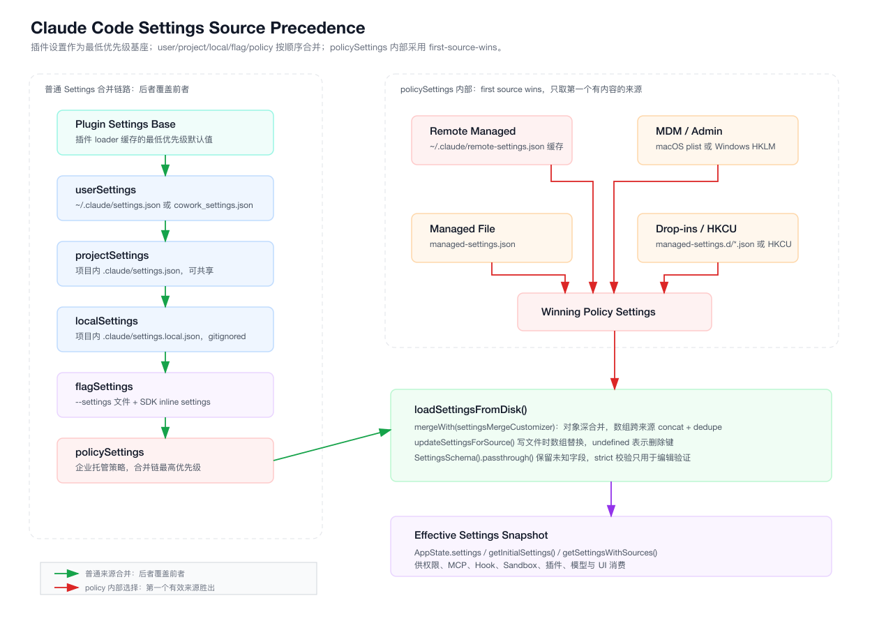
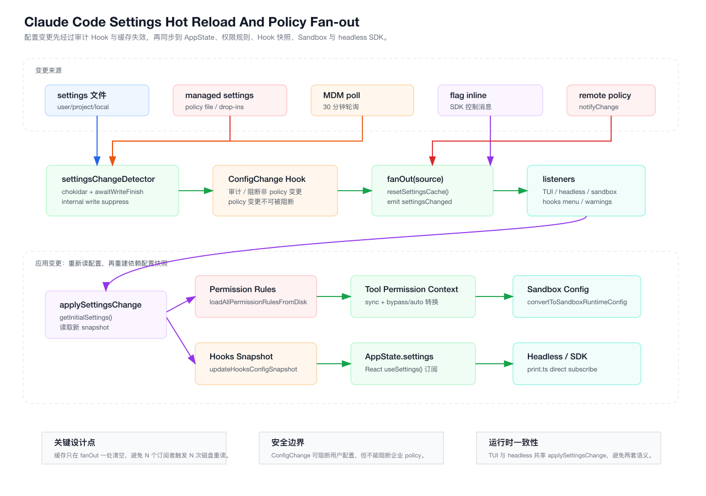

# 第 13 章：Settings、配置层级与企业策略控制面

> 本章只分析 `claude-code/` 子目录下的实现。所有源码路径都以 `claude-code/` 为根，文档与图表落在 `tech-docs/new/`。

上一章拆完了 CLI 命令系统：用户输入 `/config`、`/model`、`/permissions`、插件命令、MCP prompt，最终都会进入同一套 command runtime。
但命令系统里很多“为什么可见、为什么不可执行、为什么不能保存”的答案，不在命令本身，而在 Settings。

这一章进入 Claude Code 的配置控制面。

很多人会把 `settings.json` 理解成普通配置文件，类似前端项目里的 `vite.config.ts`、`.eslintrc` 或用户偏好存储。
Claude Code 不是这样。
它的 Settings 同时承担了五类职责：

- 用户偏好：主题、模型、语言、默认视图、状态栏、spinner、thinking、fast mode。
- 项目协作：共享 MCP、权限规则、插件市场、团队约定。
- 本地私有覆盖：gitignored 的 `.claude/settings.local.json`。
- 会话和 SDK 覆盖：`--settings` 文件、SDK inline flag settings。
- 企业策略：托管 settings、远端 policy、MDM、Hook/MCP/权限/Sandbox/插件约束。

这意味着 Settings 不是“读一个 JSON 然后 Object.assign”。
它更接近前端应用里的：

```text
Redux 初始状态
  + localStorage 用户偏好
  + URL query / feature flag
  + 后台下发实验配置
  + 企业管理员策略
  + 运行时热更新订阅
```

只不过 Claude Code 的场景更敏感。
配置一旦出错，不只是按钮颜色错了，而可能导致：

- 项目仓库通过 `.claude/settings.json` 注入危险环境变量。
- 用户绕过权限弹窗。
- 非管理员 Hook 读取密钥并发到 HTTP endpoint。
- MCP server 被替换成不可信命令。
- 插件、Skill、Agent 绕过企业市场治理。
- headless/SDK 与 TUI 对同一配置的理解不一致。

所以这一章的主线是：

> Claude Code 如何把多个配置来源合并成一个可信运行时快照，并让权限、Hook、MCP、Sandbox、插件和 UI 同步消费它。

## 13.1 源码入口总览

Settings 核心实现集中在这些文件：

| 模块 | 职责 |
| --- | --- |
| `src/utils/settings/constants.ts` | 定义 settings source 顺序、展示名、可编辑来源、`--setting-sources` 解析 |
| `src/utils/settings/types.ts` | `SettingsSchema`、权限/MCP/Hook/插件/企业策略字段定义 |
| `src/utils/settings/settings.ts` | 读取、解析、合并、写回、policy first-source-wins、`getInitialSettings()` |
| `src/utils/settings/settingsCache.ts` | session cache、per-source cache、parse-file cache、plugin settings base |
| `src/utils/settings/changeDetector.ts` | 文件监听、MDM 轮询、ConfigChange Hook、缓存失效、事件广播 |
| `src/utils/settings/applySettingsChange.ts` | 配置变更后同步 AppState、权限规则、Hook 快照、effort |
| `src/utils/settings/pluginOnlyPolicy.ts` | `strictPluginOnlyCustomization` 的 runtime 判断 |
| `src/utils/settings/validation.ts` | Zod 错误格式化、编辑校验、权限规则预过滤 |
| `src/utils/settings/mdm/settings.ts` | macOS/Windows MDM、HKCU 读取与缓存 |
| `src/utils/settings/managedPath.ts` | 托管配置目录路径与 drop-in 目录 |
| `src/utils/managedEnv.ts` | settings.env 应用顺序、信任边界、危险 env 过滤 |
| `src/state/AppState.tsx` | TUI 中订阅 settings 变更并调用 `applySettingsChange()` |
| `src/hooks/useSettings.ts` | React 组件读取 AppState 中的 settings |
| `src/cli/print.ts` | headless/SDK 直接订阅 settings 变更 |

本章两张图先建立全局地图。

第一张是配置来源与优先级：



第二张是配置热更新如何传播到运行时：



## 13.2 Settings 不是 GlobalConfig

Claude Code 里有两套容易混淆的持久配置：

| 系统 | 代表文件 | 典型职责 |
| --- | --- | --- |
| GlobalConfig | `~/.claude.json` | 启动次数、OAuth 账号、历史状态、主题、onboarding、本机级状态 |
| Settings | `~/.claude/settings.json`、`.claude/settings.json` 等 | 权限、模型、MCP、Hook、插件、Sandbox、企业 policy |

`src/utils/config.ts` 定义的是 `GlobalConfig`。
它保存大量“产品状态”和“本机状态”，例如：

- `projects`
- `oauthAccount`
- `theme`
- `autoCompactEnabled`
- `hasCompletedOnboarding`
- `workspaceApiKey`
- transcript、tips、release notes、IDE onboarding 等状态

`src/utils/settings/types.ts` 定义的是 `SettingsSchema`。
它保存的是会影响 runtime 行为和策略边界的配置，例如：

- `env`
- `permissions`
- `hooks`
- `allowedMcpServers`
- `deniedMcpServers`
- `sandbox`
- `enabledPlugins`
- `strictKnownMarketplaces`
- `strictPluginOnlyCustomization`
- `allowManagedHooksOnly`
- `allowManagedPermissionRulesOnly`
- `allowManagedMcpServersOnly`

前端类比：

```text
GlobalConfig ≈ 用户本机 profile + 产品状态 localStorage
Settings     ≈ 应用运行时配置 + 团队配置 + feature flag + enterprise policy
```

为什么要拆开？

因为两者的治理模型不同。

GlobalConfig 更多是“这个用户在这台机器上发生了什么”，通常不适合由项目仓库或企业策略覆盖。
Settings 则是“这次 Agent 运行应该遵守什么规则”，必须支持多来源合并、企业托管、项目共享、CLI/SDK 覆盖和热更新。

这也是实现自己的 Agent 时很容易踩坑的地方：

如果把所有东西都塞进一个 `config.json`，后面会越来越难回答三个问题：

1. 这个字段能不能被项目仓库控制？
2. 这个字段能不能被企业管理员强制覆盖？
3. 这个字段变更后需不需要热更新运行时？

Claude Code 用 Settings 和 GlobalConfig 的分离，提前把这三个问题拆开了。

## 13.3 五个 Settings Source

`src/utils/settings/constants.ts` 定义了所有 settings source：

```ts
export const SETTING_SOURCES = [
  'userSettings',
  'projectSettings',
  'localSettings',
  'flagSettings',
  'policySettings',
] as const
```

源码注释里有一句非常关键：

```ts
// Order matters - later sources override earlier ones
```

因此合并优先级是：

```text
userSettings
  < projectSettings
  < localSettings
  < flagSettings
  < policySettings
```

注意这里的最高优先级不是 `flagSettings`，而是 `policySettings`。
这和很多 CLI 工具的直觉不同。
传统 CLI 里命令行参数通常最大，但 Claude Code 需要让企业托管策略压过本地 flag。
否则用户可以用 `--settings` 绕过管理员的权限、MCP、Hook 或 Sandbox 限制。

五个 source 的语义如下：

| Source | 路径/来源 | 语义 |
| --- | --- | --- |
| `userSettings` | `~/.claude/settings.json` 或 `cowork_settings.json` | 用户全局配置 |
| `projectSettings` | `<cwd>/.claude/settings.json` | 项目共享配置，可能被提交 |
| `localSettings` | `<cwd>/.claude/settings.local.json` | 项目本地私有配置，自动加入 gitignore |
| `flagSettings` | `--settings` 文件 + SDK inline settings | 会话级/SDK 级覆盖 |
| `policySettings` | 远端/MDM/managed-settings/HKCU | 企业托管策略 |

可编辑来源只有三个：

```ts
export const SOURCES = [
  'localSettings',
  'projectSettings',
  'userSettings',
] as const
```

`policySettings` 和 `flagSettings` 不在可编辑列表里。
这不是 UI 选择，而是配置治理边界：

- `policySettings` 是管理员控制，普通 UI 不能写。
- `flagSettings` 是启动参数或 SDK 控制消息，运行时不应该持久化到磁盘。

## 13.4 `getEnabledSettingSources()`：隔离模式但保留 policy

Settings source 并不总是全部启用。
`constants.ts` 里还有 `parseSettingSourcesFlag()` 和 `getEnabledSettingSources()`：

```ts
export function parseSettingSourcesFlag(flag: string): SettingSource[] {
  if (flag === '') return []

  const names = flag.split(',').map(s => s.trim())
  const result: SettingSource[] = []

  for (const name of names) {
    switch (name) {
      case 'user':
        result.push('userSettings')
        break
      case 'project':
        result.push('projectSettings')
        break
      case 'local':
        result.push('localSettings')
        break
      default:
        throw new Error(
          `Invalid setting source: ${name}. Valid options are: user, project, local`,
        )
    }
  }

  return result
}
```

它只允许用户选择 `user`、`project`、`local` 三类普通来源。
真正启用时还会强制加入 `policySettings` 和 `flagSettings`：

```ts
export function getEnabledSettingSources(): SettingSource[] {
  const allowed = getAllowedSettingSources()

  const result = new Set<SettingSource>(allowed)
  result.add('policySettings')
  result.add('flagSettings')
  return Array.from(result)
}
```

这段设计的含义很明确：

- SDK 可以用 `settingSources: []` 做隔离，避免读取用户或项目 settings。
- 但 policy 不能被隔离掉，因为它是企业强制策略。
- flag 也不能被隔离掉，因为它代表当前调用方显式传入的配置。

如果用前端类比，它像是：

```text
页面可以选择不读 localStorage / workspace config
但不能选择不读 server-side enterprise policy
也不能忽略本次请求明确携带的 runtime override
```

这是 Agent 产品里非常重要的安全原则：

> 隔离模式可以减少用户态和项目态影响，但不能给用户提供绕过企业策略的开关。

## 13.5 路径映射：source 如何落到文件

`src/utils/settings/settings.ts` 用 `getSettingsFilePathForSource()` 把 source 映射成文件：

```ts
export function getSettingsFilePathForSource(
  source: SettingSource,
): string | undefined {
  switch (source) {
    case 'userSettings':
      return join(
        getSettingsRootPathForSource(source),
        getUserSettingsFilePath(),
      )
    case 'projectSettings':
    case 'localSettings': {
      return join(
        getSettingsRootPathForSource(source),
        getRelativeSettingsFilePathForSource(source),
      )
    }
    case 'policySettings':
      return getManagedSettingsFilePath()
    case 'flagSettings': {
      return getFlagSettingsPath()
    }
  }
}
```

其中项目路径很直接：

```ts
export function getRelativeSettingsFilePathForSource(
  source: 'projectSettings' | 'localSettings',
): string {
  switch (source) {
    case 'projectSettings':
      return join('.claude', 'settings.json')
    case 'localSettings':
      return join('.claude', 'settings.local.json')
  }
}
```

用户 settings 文件名有一个 cowork 分支：

```ts
function getUserSettingsFilePath(): string {
  if (
    getUseCoworkPlugins() ||
    isEnvTruthy(process.env.CLAUDE_CODE_USE_COWORK_PLUGINS)
  ) {
    return 'cowork_settings.json'
  }
  return 'settings.json'
}
```

这一点说明 Settings 系统不是“路径写死”。
同一个 source 在不同运行模式下可能映射到不同文件。

实现自己的 Agent 时，建议也把“配置源”和“文件路径”拆开：

```text
source identity: user / project / local / flag / policy
path resolver:   根据 cwd、mode、platform、session state 映射到文件
loader:          只关心 source，不关心路径细节
```

这样未来加 remote workspace、container、workspace profile、organization profile 时，不会把路径逻辑散落在业务代码里。

## 13.6 policySettings：合并链最高优先级，但内部不是合并

`policySettings` 在普通 Settings 合并链里最高优先级。
但它内部还有多个可能来源：

```text
remote managed settings
  > macOS plist / Windows HKLM
  > managed-settings.json + managed-settings.d/*.json
  > Windows HKCU
```

这里不是“全部合并”，而是 first-source-wins。
`src/utils/settings/settings.ts` 的注释写得很清楚：

```ts
// policySettings: "first source wins" — use the highest-priority source
// that has content. Priority: remote > HKLM/plist > managed-settings.json > HKCU
```

代码顺序也是这样：

```ts
const remoteSettings = getRemoteManagedSettingsSyncFromCache()
if (remoteSettings && Object.keys(remoteSettings).length > 0) {
  const result = SettingsSchema().safeParse(remoteSettings)
  if (result.success) {
    policySettings = result.data
  }
}

if (!policySettings) {
  const mdmResult = getMdmSettings()
  if (Object.keys(mdmResult.settings).length > 0) {
    policySettings = mdmResult.settings
  }
}

if (!policySettings) {
  const { settings, errors } = loadManagedFileSettings()
  if (settings) {
    policySettings = settings
  }
}

if (!policySettings) {
  const hkcu = getHkcuSettings()
  if (Object.keys(hkcu.settings).length > 0) {
    policySettings = hkcu.settings
  }
}
```

为什么 policy 内部不用合并？

因为企业策略的来源代表不同信任和分发机制。
如果远端策略、MDM、本地 managed file、HKCU 混合合并，会带来两个问题：

1. 管理员很难判断最终策略来自哪里。
2. 低优先级来源可能补充高优先级来源没设置的字段，从而扩大权限。

first-source-wins 的语义更像 Kubernetes admission policy 或浏览器企业策略：

```text
一旦发现更高等级 policy，就把它视为完整 policy snapshot
不要让低等级来源继续补字段
```

这让 `/status`、诊断、审计也更清晰。
`getPolicySettingsOrigin()` 可以返回当前生效来源：

```ts
export function getPolicySettingsOrigin():
  | 'remote'
  | 'plist'
  | 'hklm'
  | 'file'
  | 'hkcu'
  | null
```

配置系统最怕的不是没有优先级，而是“优先级能覆盖，但还能被低优先级补洞”。
Claude Code 在 policy 这里选择了更保守的模型。

## 13.7 托管文件和 drop-in 机制

文件型托管配置来自 `managed-settings.json` 和 `managed-settings.d/*.json`。

托管目录由 `src/utils/settings/managedPath.ts` 决定：

```ts
export const getManagedFilePath = memoize(function (): string {
  switch (getPlatform()) {
    case 'macos':
      return '/Library/Application Support/ClaudeCode'
    case 'windows':
      return 'C:\\Program Files\\ClaudeCode'
    default:
      return '/etc/claude-code'
  }
})
```

drop-in 目录：

```ts
export const getManagedSettingsDropInDir = memoize(function (): string {
  return join(getManagedFilePath(), 'managed-settings.d')
})
```

`loadManagedFileSettings()` 的设计很像 Linux 的 systemd/sudoers drop-in：

```ts
const { settings, errors: baseErrors } = parseSettingsFile(
  getManagedSettingsFilePath(),
)
...
const entries = getFsImplementation()
  .readdirSync(dropInDir)
  .filter(
    d =>
      (d.isFile() || d.isSymbolicLink()) &&
      d.name.endsWith('.json') &&
      !d.name.startsWith('.'),
  )
  .map(d => d.name)
  .sort()
```

合并顺序是：

```text
managed-settings.json
  -> managed-settings.d/10-xxx.json
  -> managed-settings.d/20-yyy.json
  -> managed-settings.d/99-final.json
```

后面的 drop-in 覆盖前面的字段。

这个设计非常适合企业部署：

- 安全团队可以维护 `10-security.json`。
- 平台团队可以维护 `20-telemetry.json`。
- 研发效能团队可以维护 `30-plugins.json`。
- 某些环境可以用更靠后的文件覆盖默认值。

相比把所有策略写进一个大 JSON，drop-in 让组织内部多个 owner 能独立发布策略片段。
但注意，drop-in 只发生在“文件型 managed settings”内部。
一旦 remote 或 MDM 有内容，整个文件型 managed settings 就不会成为 policy 来源。

## 13.8 MDM：企业策略不一定来自文件

`src/utils/settings/mdm/settings.ts` 明确描述了 MDM 来源：

```ts
/**
 * Reads enterprise settings from OS-level MDM configuration:
 * - macOS: `com.anthropic.claudecode` preference domain
 * - Windows: `HKLM\SOFTWARE\Policies\ClaudeCode`
 *   and `HKCU\SOFTWARE\Policies\ClaudeCode`
 * - Linux: No MDM equivalent
 */
```

它还强调：

```ts
// Policy settings use "first source wins"
// Priority (highest to lowest):
//   remote → HKLM/plist → managed-settings.json → HKCU
```

MDM 读取做了两件事：

1. 启动早期异步发起 raw read，让系统命令和模块加载并行。
2. settings pipeline 用同步缓存读取结果，避免 settings.ts 引入重依赖链。

入口函数：

```ts
export function startMdmSettingsLoad(): void
export async function ensureMdmSettingsLoaded(): Promise<void>
export function getMdmSettings(): MdmResult
export function getHkcuSettings(): MdmResult
```

这里有一个很工程化的点：

`settings.ts` 是启动关键路径，如果它直接 import 大量 auth、系统命令、子进程逻辑，会把启动 SCC 变大。
所以 MDM 代码把 raw read、settings parse、sync cache 分开，让 settings pipeline 只读轻量缓存。

同样的思想也出现在远端 managed settings：见下一节。

## 13.9 Remote Managed Settings：避免 settings 与 auth 环依赖

远端 policy 的缓存状态放在 `src/services/remoteManagedSettings/syncCacheState.ts`。
文件顶部注释说明了为什么拆出来：

```ts
/**
 * Split from syncCache.ts to break the settings.ts → syncCache.ts → auth.ts →
 * settings.ts cycle.
 */
```

eligibility 判断在 `syncCache.ts`，因为它需要 auth/provider 信息。
但 settings pipeline 读取的是 leaf state：

```ts
export function getRemoteManagedSettingsSyncFromCache(): SettingsJson | null {
  if (eligible !== true) return null
  if (sessionCache) return sessionCache
  const cachedSettings = loadSettings()
  if (cachedSettings) {
    sessionCache = cachedSettings
    resetSettingsCache()
    return cachedSettings
  }
  return null
}
```

这里的关键不是“从文件读远端缓存”。
关键是分层：

```text
auth/provider 相关 eligibility
  -> syncCache.ts

纯同步 cache state
  -> syncCacheState.ts

settings.ts
  -> 只依赖 leaf cache，避免拉入 auth/settings 环
```

这类拆分在大型前端应用里也常见：

```text
React 组件不能直接 import 初始化整个 SDK
它只 import 一个轻量 store selector
真正的 SDK 初始化在另一个边界完成
```

Agent Runtime 也一样。
配置系统是启动底座，不能让它反向依赖上层 auth、UI、plugin、MCP 大模块。

## 13.10 Schema：兼容优先，而不是强约束优先

`src/utils/settings/types.ts` 的 `SettingsSchema` 很长，但开头的兼容性说明比字段本身更重要。
它明确规定：

- 可以添加新的 optional 字段。
- 可以增加 enum value。
- 可以让校验更宽松。
- 不要删除字段。
- 不要把 optional 改 required。
- 不要让类型更严格。
- 不要无兼容地重命名字段。

最终 schema 以 `.passthrough()` 结束：

```ts
export const SettingsSchema = lazySchema(() =>
  z
    .object({
      ...
    })
    .passthrough(),
)
```

这意味着未知字段不会被丢掉。

但编辑校验使用 strict mode：

```ts
const result = SettingsSchema().strict().safeParse(jsonData)
```

这个差异非常重要：

| 场景 | 策略 |
| --- | --- |
| 启动读取 settings | 宽松，`passthrough`，尽量不中断用户 |
| UI/命令写 settings | 严格，避免继续写入未知/错误字段 |
| 更新已有 settings | 尽量保留原文件中未识别字段 |

这是一种典型的客户端配置兼容策略：

```text
read tolerant
write careful
execute validated
```

如果你做的是面向真实用户的 Agent 产品，配置 schema 千万不能像后端内部服务那样“一错全挂”。
用户可能手写 settings，插件可能写入未来版本字段，企业策略可能提前下发新字段。
老客户端应该尽量降级，而不是把整个配置系统打爆。

## 13.11 权限规则预过滤：一个坏规则不能毒死整个 settings

`parseSettingsFileUncached()` 读取 JSON 后，会先过滤非法权限规则：

```ts
const ruleWarnings = filterInvalidPermissionRules(data, path)

const result = SettingsSchema().safeParse(data)
```

`filterInvalidPermissionRules()` 会检查 `permissions.allow/deny/ask` 数组：

```ts
for (const key of ['allow', 'deny', 'ask'] as const) {
  const rules = perms[key]
  if (!Array.isArray(rules)) continue

  perms[key] = rules.filter(rule => {
    if (typeof rule !== 'string') {
      warnings.push({
        file: filePath,
        path: `permissions.${key}`,
        message: `Non-string value in ${key} array was removed`,
        invalidValue: rule,
      })
      return false
    }
    const result = validatePermissionRule(rule, key)
    ...
  })
}
```

为什么权限规则要特殊处理？

因为权限规则是用户最常手写、最容易写错、同时又最关键的字段。
如果一个无效 rule 让整个 settings 文件失效，用户可能丢掉模型、Hook、MCP、插件等全部配置。
如果完全不校验，危险规则又可能悄悄生效。

Claude Code 的处理是折中：

```text
非法权限规则：跳过并记录 warning
其它 schema 错误：该 source settings 不参与执行，但错误保留给 /doctor 或通知
原始文件：尽量不覆盖
```

这就是工程化配置系统该有的弹性。

## 13.12 读取文件：解析、缓存、clone

`parseSettingsFile()` 有 path-keyed cache：

```ts
const cached = getCachedParsedFile(path)
if (cached) {
  return {
    settings: cached.settings ? clone(cached.settings) : null,
    errors: cached.errors,
  }
}
const result = parseSettingsFileUncached(path)
setCachedParsedFile(path, result)
return {
  settings: result.settings ? clone(result.settings) : null,
  errors: result.errors,
}
```

它刻意 clone。
原因是 `lodash mergeWith` 会修改 target object。
如果直接把 cache 里的 object 交给调用方，合并或写入失败可能污染缓存。

配置缓存这里分三层：

| 缓存 | 文件 | 作用 |
| --- | --- | --- |
| sessionSettingsCache | `settingsCache.ts` | `getInitialSettings()` 的完整合并结果 |
| perSourceCache | `settingsCache.ts` | 单个 source 的解析结果 |
| parseFileCache | `settingsCache.ts` | 单个 path 的 parse + zod 结果 |

另外还有一个特殊的 `pluginSettingsBase`：

```ts
let pluginSettingsBase: Record<string, unknown> | undefined
```

插件加载器在 `cachePluginSettings()` 里写入它：

```ts
export function cachePluginSettings(plugins: LoadedPlugin[]): void {
  const settings = mergePluginSettings(plugins)
  setPluginSettingsBase(settings)
  if (settings && Object.keys(settings).length > 0) {
    resetSettingsCache()
  }
}
```

然后 `loadSettingsFromDisk()` 把它作为最低优先级 base：

```ts
const pluginSettings = getPluginSettingsBase()
let mergedSettings: SettingsJson = {}
if (pluginSettings) {
  mergedSettings = mergeWith(
    mergedSettings,
    pluginSettings,
    settingsMergeCustomizer,
  )
}
```

换句话说：

```text
plugin settings base
  < user/project/local/flag/policy
```

插件可以提供默认设置，但用户、项目、flag、policy 都能覆盖它。

## 13.13 合并语义：跨来源数组 concat + dedupe

`settingsMergeCustomizer()` 是 Settings 合并的核心：

```ts
function mergeArrays<T>(targetArray: T[], sourceArray: T[]): T[] {
  return uniq([...targetArray, ...sourceArray])
}

export function settingsMergeCustomizer(
  objValue: unknown,
  srcValue: unknown,
): unknown {
  if (Array.isArray(objValue) && Array.isArray(srcValue)) {
    return mergeArrays(objValue, srcValue)
  }
  return undefined
}
```

对象字段使用 lodash 默认深合并。
数组字段使用 concat + dedupe。

这对配置语义影响很大。
例如：

```json
// userSettings
{
  "permissions": {
    "allow": ["Read(*)"]
  }
}
```

```json
// projectSettings
{
  "permissions": {
    "allow": ["Bash(git status:*)"]
  }
}
```

最终 `permissions.allow` 不是 project 覆盖 user，而是合并成：

```json
["Read(*)", "Bash(git status:*)"]
```

为什么数组不直接覆盖？

因为很多 settings 数组代表“规则集合”：

- 权限 allow/deny/ask。
- MCP allow/deny list。
- Hook 列表。
- Sandbox allow/deny paths。
- marketplace policy 数组。

如果数组按 source 覆盖，项目只要设置一个 allow 规则，就会抹掉用户所有 allow 规则。
这不符合“多来源规则共同生效”的直觉。

但这也带来一个后果：

> 跨来源合并时，数组更像规则集合；想要删除低优先级数组项，不能靠高优先级空数组覆盖。

因此企业强管控字段通常额外提供 `allowManaged*Only` 这类开关，而不是依赖普通数组覆盖。

## 13.14 写入语义：同一个 source 内数组替换，undefined 删除

跨来源合并数组是 concat + dedupe。
但写回某个 source 时，数组是替换。

`updateSettingsForSource()` 里自定义了写入 merge 行为：

```ts
const updatedSettings = mergeWith(
  existingSettings || {},
  settings,
  (
    _objValue,
    srcValue,
    key,
    object,
  ) => {
    if (srcValue === undefined && object && typeof key === 'string') {
      delete object[key]
      return undefined
    }
    if (Array.isArray(srcValue)) {
      return srcValue
    }
    return undefined
  },
)
```

这给调用方两个明确规则：

```text
settings 合并读取：
  arrays concat + dedupe

settings 写回单个文件：
  arrays replace
  undefined deletes key
```

为什么读写语义不同？

因为写入时调用方通常是在编辑“这个文件里的最终状态”。
例如 UI 删除一条 permission rule，它希望把该文件里的数组替换成删除后的数组。
如果写入也 concat，那删除永远删不掉。

`undefined` 删除也很重要。
比如：

```ts
updateSettingsForSource('userSettings', { modelType: undefined })
```

它不是写入 `"modelType": null`。
它会删除 `modelType` 这个 key，让低优先级或默认逻辑重新接管。

这是配置系统里非常推荐的设计：

```text
null     = 有意写入 null 这个值
undefined = 从这个 source 删除，回退给 lower/default
```

## 13.15 本地 settings 写入会自动保护 gitignore

当写入 `localSettings` 时，`updateSettingsForSource()` 会异步把文件加入 gitignore：

```ts
if (source === 'localSettings') {
  void addFileGlobRuleToGitignore(
    getRelativeSettingsFilePathForSource('localSettings'),
    getOriginalCwd(),
  )
}
```

这看起来是小功能，但它体现了一个产品级判断：

`settings.local.json` 经常包含用户本机偏好、私有目录、临时权限、环境变量。
如果用户误提交，影响比普通 IDE 配置更大。

所以系统不能只靠文档提醒“请不要提交”。
写入本地配置时就应该自动保护。

## 13.16 `getInitialSettings()`：稳定快照，而不是实时读取

对外读配置通常走：

```ts
export function getInitialSettings(): SettingsJson {
  const { settings } = getSettingsWithErrors()
  return settings || {}
}
```

`getSettingsWithErrors()` 使用 session cache：

```ts
const cached = getSessionSettingsCache()
if (cached !== null) {
  return cached
}

const result = loadSettingsFromDisk()
setSessionSettingsCache(result)
return result
```

这表示 `getInitialSettings()` 不是每次都读磁盘。
它返回“当前 session 已缓存的合并快照”。

如果需要强制读取最新文件，可以用：

```ts
export function getSettingsWithSources(): SettingsWithSources {
  resetSettingsCache()
  ...
  return { effective: getInitialSettings(), sources }
}
```

这也是配置系统里常见的两种 API：

| API 类型 | 用途 |
| --- | --- |
| 快照 API | runtime 高频读取，避免磁盘 IO |
| 强制刷新 API | `/status`、debug、诊断、展示每个 source |

不要让所有业务代码都直接读文件。
大型 Agent Runtime 一旦到处读配置，很快会出现：

- 不同模块看到不同时间点的配置。
- 热更新时重复读取磁盘。
- 测试难以控制。
- headless 与 TUI 行为不一致。

## 13.17 Change Detector：配置热更新不是简单 watch

`src/utils/settings/changeDetector.ts` 使用 chokidar 监听 settings 文件和 managed drop-in 目录。
但它不是“文件变了就 reload”这么简单。

几个关键点：

### 13.17.1 remote mode 不启用文件 watcher

```ts
if (getIsRemoteMode()) {
  logForDebugging('Settings change detector skipped in remote mode')
  return
}
```

远程模式下文件系统语义不同，盲目监听本地路径没有意义。

### 13.17.2 只 watch 启动时存在的文件父目录

文件不存在时，watcher 不会无限监听所有可能目录。
这样可以减少跨平台文件系统噪声。

### 13.17.3 跳过 flagSettings watcher

`flagSettings` 可能是临时文件或 SDK inline settings。
它的变更通过程序化 `notifyChange('flagSettings')` 更可靠。

### 13.17.4 内部写入抑制

`updateSettingsForSource()` 写文件前会：

```ts
markInternalWrite(filePath)
```

change detector 在窗口期内会忽略内部写产生的文件事件。

这是为了避免：

```text
UI 改 settings
  -> updateSettingsForSource 写文件
  -> watcher 又触发 applySettingsChange
  -> UI 本地状态和 AppState 重复同步
```

### 13.17.5 删除事件有 grace period

删除文件时，change detector 不会立即应用删除。
它会等待一小段时间，吸收“删除再重建”的写文件模式。

这对编辑器、自动更新器、同步工具都很重要。
很多工具不是原地写，而是：

```text
write temp file
rename
delete old
replace
```

如果没有 grace period，运行时可能短暂看到“配置消失”，导致闪烁或错误变更。

## 13.18 ConfigChange Hook：变更先审计，再应用

change detector 在真正广播配置变更前，会执行 `ConfigChange` hook：

```ts
void executeConfigChangeHooks(
  settingSourceToConfigChangeSource(source),
  path,
).then(results => {
  if (hasBlockingResult(results)) {
    logForDebugging(`ConfigChange hook blocked change to ${path}`)
    return
  }
  fanOut(source)
})
```

Hook 输入的 schema 在 `src/entrypoints/sdk/coreSchemas.ts`：

```ts
export const CONFIG_CHANGE_SOURCES = [
  'user_settings',
  'project_settings',
  'local_settings',
  'policy_settings',
  'skills',
] as const
```

`src/utils/hooks.ts` 里有一个关键安全规则：

```ts
// Policy settings are enterprise-managed — hooks fire for audit logging
// but must never block policy changes from being applied
if (source === 'policy_settings') {
  return results.map(r => ({ ...r, blocked: false }))
}
```

也就是说：

- 用户/项目/local settings 变更可以被 ConfigChange Hook 阻断。
- policy settings 变更可以被审计，但不能被阻断。

这是非常合理的企业策略语义：

```text
普通配置变更：安全 Hook 可以阻止
企业策略变更：安全 Hook 只能记录，不能阻止管理员策略生效
```

如果 policy 也能被 Hook 阻断，低信任来源就可能通过 Hook 机制阻止高信任策略落地。
这会反过来破坏 policy 的权威性。

## 13.19 fanOut：缓存失效必须集中在生产者

change detector 最终调用：

```ts
function fanOut(source: SettingSource): void {
  resetSettingsCache()
  settingsChanged.emit(source)
}
```

注释解释了为什么缓存重置要放在这里：

之前如果每个 listener 都防御性 reset cache，会出现：

```text
listener1 reset -> read disk -> fill cache
listener2 reset -> read disk -> fill cache
listener3 reset -> read disk -> fill cache
...
```

现在是：

```text
fanOut reset once
  -> listener1 触发第一次读盘并填 cache
  -> listener2/3 命中同一个 cache
```

这是典型的事件系统优化：

> 缓存失效应该由变更生产者做一次，而不是由每个消费者各自猜测。

在前端状态管理里也一样。
不要让每个 React component 在 `useEffect` 里自己 invalidate query cache。
应该由 mutation 或 event source 统一 invalidate。

## 13.20 `applySettingsChange()`：把配置快照推入运行时

`src/utils/settings/applySettingsChange.ts` 是配置热更新的核心消费点。

它做四件事：

```ts
const newSettings = getInitialSettings()

const updatedRules = loadAllPermissionRulesFromDisk()
updateHooksConfigSnapshot()

setAppState(prev => {
  let newContext = syncPermissionRulesFromDisk(
    prev.toolPermissionContext,
    updatedRules,
  )
  ...
  newContext = transitionPlanAutoMode(newContext)
  ...
  return {
    ...prev,
    settings: newSettings,
    toolPermissionContext: newContext,
    ...(effortChanged && newEffort !== undefined
      ? { effortValue: newEffort }
      : {}),
  }
})
```

也就是：

1. 读取新的 settings snapshot。
2. 重新加载权限规则。
3. 更新 Hook 配置快照。
4. 更新 AppState 中的 settings、toolPermissionContext、effortValue。

这里没有重新应用 env。
注释说明 env 等副作用由 `onChangeAppState` 处理：

```ts
// Side-effects like clearing auth caches and applying env vars are handled by
// `onChangeAppState` which fires when `settings` changes in state.
```

这种分层很关键。
`applySettingsChange()` 只做“settings 到 AppState/权限上下文”的同步。
更外围的应用状态变更副作用由状态层统一触发。

否则这个函数会越来越像“上帝函数”：

```text
读配置
  -> 改权限
  -> 改 Hook
  -> 改 Sandbox
  -> 改 env
  -> 改 auth
  -> 改 proxy
  -> 改 model
  -> 改 UI
```

Claude Code 已经把其中最核心的权限/Hook/AppState 放在这里，其它副作用尽量留给专门模块。

## 13.21 TUI 与 headless 共享变更语义

TUI 中，`src/state/AppState.tsx` 订阅 settings change：

```ts
const onSettingsChange = useEffectEvent((source: SettingSource) =>
  applySettingsChange(source, store.setState)
)
useSettingsChange(onSettingsChange)
```

headless/SDK 中，没有 React tree，所以 `src/cli/print.ts` 直接订阅：

```ts
settingsChangeDetector.subscribe(source => {
  applySettingsChange(source, setAppState)
  ...
})
```

这点非常重要。

如果 TUI 和 headless 各自实现一套 settings reload，就会出现：

- TUI 支持 managed policy 热更新，headless 不支持。
- TUI 会更新权限上下文，SDK 不会。
- flag inline settings 在 IDE 控制消息里生效，但沙箱/Hook 不刷新。

Claude Code 把共享逻辑收敛到 `applySettingsChange()`，让 TUI 和 headless 只负责“如何订阅事件”。

实现自己的 Agent 时也应该这样设计：

```text
settings event source
  -> shared applySettingsChange()
  -> UI/headless/server 分别接入
```

不要把配置热更新逻辑写进 React component。
React 只是一个 runtime host，不应该拥有配置语义。

## 13.22 `useSettings()`：React 组件读 AppState，不直接读磁盘

React 组件应该用：

```ts
export function useSettings(): ReadonlySettings {
  return useAppState(s => s.settings)
}
```

注释明确说：

```ts
// Use this instead of getSettings_DEPRECATED() in React components for reactive updates.
```

这和前端开发完全一致。
组件不应该在 render 期间读 `localStorage` 或磁盘配置。
它应该订阅一个状态 store。

Claude Code 的链路是：

```text
settings file changed
  -> settingsChangeDetector
  -> resetSettingsCache
  -> useSettingsChange
  -> applySettingsChange
  -> AppState.settings
  -> useSettings(selector)
  -> component re-render
```

如果组件绕过 AppState 直接调用 `getSettings_DEPRECATED()`，可能出现两个问题：

1. 它不会自然 re-render。
2. 它可能在同一次变更中看到和 AppState 不一致的快照。

因此 `useSettings()` 是 Settings 在 TUI 层的唯一推荐入口。

## 13.23 env：最敏感的 settings 字段之一

`settings.env` 看起来只是环境变量。
但在 Agent Runtime 里，它可能改变：

- 模型 API endpoint。
- API key/token 读取方式。
- proxy/CA/mTLS。
- shell 子进程行为。
- 动态库加载。
- PATH 解析。

所以 `src/utils/managedEnv.ts` 对 env 做了非常细的信任分层。

它先定义了可信来源：

```ts
const TRUSTED_SETTING_SOURCES = [
  'userSettings',
  'flagSettings',
  'policySettings',
] as const
```

项目级来源被排除：

```ts
// Project-scoped sources (projectSettings, localSettings) are excluded because they live
// inside the project directory and could be committed by a malicious actor to redirect
// traffic (e.g., ANTHROPIC_BASE_URL) to an attacker-controlled server.
```

启动早期调用 `applySafeConfigEnvironmentVariables()`：

1. 应用 GlobalConfig env。
2. 应用可信 settings source 的 env。
3. 计算 remote managed settings eligibility。
4. 应用 policy env。
5. 对完整合并 settings 只应用 `SAFE_ENV_VARS` allowlist 内变量。

完整信任模型是：

| 阶段 | 来源 | 策略 |
| --- | --- | --- |
| trust dialog 前 | GlobalConfig、user、flag、policy | 可应用全部 env，但有 host/SSH/CCD 过滤 |
| trust 完成前的 project/local | project/local | 只应用 SAFE_ENV_VARS |
| trust 完成后 | merged settings | `applyConfigEnvironmentVariables()` 应用全部安全过滤后的 env |

还有三类过滤：

- SSH tunnel 场景不让 settings 覆盖远端 auth tunnel 变量。
- host-managed provider 场景不让 settings 改 provider/model routing。
- Claude Desktop entrypoint 保护宿主进程传入的 env key。

这告诉我们一个通用原则：

> 项目仓库里的配置不能在信任建立前影响网络、认证、模型路由和进程环境。

前端类比就是：

```text
URL query 可以影响页面 tab
但不应该影响 auth token endpoint
```

## 13.24 权限规则：settings 是权限系统的持久层

第 4 章已经拆过工具权限系统。
这里看 Settings 如何给它提供规则。

`src/utils/permissions/permissionsLoader.ts` 读取权限规则：

```ts
export function loadAllPermissionRulesFromDisk(): PermissionRule[] {
  if (shouldAllowManagedPermissionRulesOnly()) {
    return getPermissionRulesForSource('policySettings')
  }

  const rules: PermissionRule[] = []

  for (const source of getEnabledSettingSources()) {
    rules.push(...getPermissionRulesForSource(source))
  }
  return rules
}
```

企业策略字段是：

```ts
allowManagedPermissionRulesOnly: z
  .boolean()
  .optional()
  .describe(
    'When true (and set in managed settings), only permission rules ... from managed settings are respected.'
  )
```

如果 `policySettings.allowManagedPermissionRulesOnly === true`：

- 只加载 policySettings 的 permission rules。
- UI 中“always allow”这类持久化选项会被隐藏。
- `addPermissionRulesToSettings()` 直接返回 false，不写入新规则。

这不是普通覆盖。
这是“规则来源收敛”：

```text
普通模式：
  user/project/local/flag/policy 的权限规则共同生效

managed-only 模式：
  只有 policySettings 的权限规则生效
```

为什么需要这个字段？

因为跨来源数组是 concat + dedupe。
即使 policySettings 最高优先级，也无法靠空数组删除低来源 allow rules。
所以必须提供一个专门的 managed-only gate。

这是一类常见模式：

```text
配置合并解决默认体验
强管控字段解决企业边界
```

## 13.25 危险模式和 Auto Mode：排除 projectSettings

有些 settings 字段不能被项目配置控制。

例如：

```ts
export function hasSkipDangerousModePermissionPrompt(): boolean {
  return !!(
    getSettingsForSource('userSettings')?.skipDangerousModePermissionPrompt ||
    getSettingsForSource('localSettings')?.skipDangerousModePermissionPrompt ||
    getSettingsForSource('flagSettings')?.skipDangerousModePermissionPrompt ||
    getSettingsForSource('policySettings')?.skipDangerousModePermissionPrompt
  )
}
```

注释写明：

```ts
// projectSettings is intentionally excluded —
// a malicious project could otherwise auto-bypass the dialog (RCE risk).
```

`getUseAutoModeDuringPlan()` 也是类似策略：

```ts
return (
  getSettingsForSource('policySettings')?.useAutoModeDuringPlan !== false &&
  getSettingsForSource('flagSettings')?.useAutoModeDuringPlan !== false &&
  getSettingsForSource('userSettings')?.useAutoModeDuringPlan !== false &&
  getSettingsForSource('localSettings')?.useAutoModeDuringPlan !== false
)
```

`getAutoModeConfig()` 也排除了 `projectSettings`，避免恶意项目注入 classifier allow/deny 规则。

这是 Agent 安全里非常关键的一层：

```text
不是所有 settings source 都能控制所有字段
```

普通合并顺序只能解决“谁覆盖谁”。
但安全字段还需要“谁有资格参与”。

一个最小实现如果只做：

```ts
const settings = merge(user, project, local)
if (settings.skipDangerousModePermissionPrompt) ...
```

就会允许仓库提交：

```json
{
  "skipDangerousModePermissionPrompt": true
}
```

然后用户 clone 后一运行就绕过危险模式提示。

Claude Code 对这类字段逐个写 trusted source helper，而不是盲目使用 merged settings。

## 13.26 Hook 策略：managed-only、disableAll、plugin-only 三套边界

Hook 是 Settings 里最敏感的扩展点之一。
它可以在工具调用、session start、stop、notification、prompt submit 等事件触发外部命令或 HTTP 请求。

`src/utils/hooks/hooksConfigSnapshot.ts` 负责从允许来源读取 hooks：

```ts
function getHooksFromAllowedSources(): HooksSettings {
  const policySettings = settingsModule.getSettingsForSource('policySettings')

  if (policySettings?.disableAllHooks === true) {
    return {}
  }

  if (policySettings?.allowManagedHooksOnly === true) {
    return policySettings.hooks ?? {}
  }

  if (isRestrictedToPluginOnly('hooks')) {
    return policySettings?.hooks ?? {}
  }

  const mergedSettings = settingsModule.getSettings_DEPRECATED()

  if (mergedSettings.disableAllHooks === true) {
    return policySettings?.hooks ?? {}
  }

  return mergedSettings.hooks ?? {}
}
```

这里有四层语义：

1. policy 设置 `disableAllHooks: true`：所有 hooks 都禁用，包括 managed hooks。
2. policy 设置 `allowManagedHooksOnly: true`：只运行 policySettings 中的 hooks。
3. policy 设置 `strictPluginOnlyCustomization` 锁 hooks：跳过用户/项目/local settings hooks，但插件/managed/built-in 仍可。
4. 非 policy 设置 `disableAllHooks: true`：只能禁用非 managed hooks，不能禁用 managed hooks。

这说明 Hook 不是一个简单的数组字段。
它有不同来源、不同信任等级、不同禁用语义。

前端类比：

```text
用户可以关闭浏览器扩展
但不能关闭企业 MDM 强制安装的安全扩展
```

Claude Code 对 Hook 也是这个模型。

## 13.27 HTTP Hook：URL allowlist 和 env var allowlist

HTTP Hook 更敏感，因为它能把 hook input 发到网络。
`src/utils/hooks/execHttpHook.ts` 从 settings 读取 HTTP hook policy：

```ts
function getHttpHookPolicy(): {
  allowedUrls: string[] | undefined
  allowedEnvVars: string[] | undefined
} {
  const settings = settingsModule.getInitialSettings()
  return {
    allowedUrls: settings.allowedHttpHookUrls,
    allowedEnvVars: settings.httpHookAllowedEnvVars,
  }
}
```

执行前先检查 URL allowlist：

```ts
if (policy.allowedUrls !== undefined) {
  const matched = policy.allowedUrls.some(p => urlMatchesPattern(hook.url, p))
  if (!matched) {
    return { ok: false, body: '', error: msg }
  }
}
```

Header 支持环境变量插值，但只允许 hook 自己声明的 `allowedEnvVars`，并与全局 policy allowlist 取交集：

```ts
const effectiveVars =
  policy.allowedEnvVars !== undefined
    ? hookVars.filter(v => policy.allowedEnvVars!.includes(v))
    : hookVars
```

并且 header value 会去掉 CR/LF/NUL，防止 header injection。

这里的安全思想是：

```text
Hook URL 是外发边界
Hook header env interpolation 是密钥边界
二者必须分别 allowlist
```

如果只 allowlist URL，不限制 env var，项目 Hook 仍可能把 `$ANTHROPIC_API_KEY` 放进 header。
如果只限制 env var，不限制 URL，Hook 仍可能把非敏感但高价值的上下文发到任意 endpoint。

## 13.28 MCP 策略：allowlist 和 denylist 的不同合并方式

MCP 配置在第 7 章已经拆过。
这里看 Settings 如何控制 MCP server。

`src/services/mcp/config.ts` 里有两个函数：

```ts
function getMcpAllowlistSettings(): SettingsJson {
  if (shouldAllowManagedMcpServersOnly()) {
    return getSettingsForSource('policySettings') ?? {}
  }
  return getInitialSettings()
}

function getMcpDenylistSettings(): SettingsJson {
  return getInitialSettings()
}
```

`allowManagedMcpServersOnly` 只影响 allowlist：

```ts
export function shouldAllowManagedMcpServersOnly(): boolean {
  return (
    getSettingsForSource('policySettings')?.allowManagedMcpServersOnly === true
  )
}
```

注释说明：

```ts
// Users can still add their own MCP servers and deny servers via deniedMcpServers.
```

也就是说：

| 配置 | managed-only 时 |
| --- | --- |
| `allowedMcpServers` | 只读 policySettings |
| `deniedMcpServers` | 仍从所有来源合并 |
| 用户自定义 MCP server | 仍可添加，但必须满足 admin allowlist |

为什么 denylist 仍然合并所有来源？

因为用户应该永远能为自己更保守。
企业 policy 能规定“只允许这些 server”，用户也能说“其中某个我自己不要用”。

安全配置里常见一条原则：

```text
低信任来源不能放宽高信任策略
但可以进一步收紧自己的运行环境
```

MCP denylist 就是这个原则。

## 13.29 Sandbox 策略：settings 变更后动态刷新隔离配置

Sandbox 在第 10 章已经拆过。
这里看 Settings 的消费方式。

`src/utils/sandbox/sandbox-adapter.ts` 读取 managed-only policy：

```ts
export function shouldAllowManagedSandboxDomainsOnly(): boolean {
  return (
    getSettingsForSource('policySettings')?.sandbox?.network
      ?.allowManagedDomainsOnly === true
  )
}

function shouldAllowManagedReadPathsOnly(): boolean {
  return (
    getSettingsForSource('policySettings')?.sandbox?.filesystem
      ?.allowManagedReadPathsOnly === true
  )
}
```

当 sandbox 初始化后，还会订阅 settings change：

```ts
settingsSubscriptionCleanup = settingsChangeDetector.subscribe(() => {
  const settings = getSettings_DEPRECATED()
  const newConfig = convertToSandboxRuntimeConfig(settings)
  BaseSandboxManager.updateConfig(newConfig)
})
```

所以 sandbox 不是只在启动时读一次 settings。
配置变化后，运行时隔离策略会更新。

同时 network ask callback 也会受 policy 影响：

```ts
if (shouldAllowManagedSandboxDomainsOnly()) {
  logForDebugging(
    `[sandbox] Blocked network request to ${hostPattern.host} (allowManagedDomainsOnly)`,
  )
  return false
}
```

这意味着如果管理员要求只允许 managed domains，用户运行时交互确认也不能临时放行新 host。

这是企业 sandbox 里非常重要的边界：

```text
交互弹窗只能在 policy 允许的空间内授权
不能把弹窗变成绕过 policy 的后门
```

## 13.30 插件策略：enabledPlugins、marketplace 与 plugin settings base

Settings 还控制插件系统。
关键字段包括：

- `enabledPlugins`
- `extraKnownMarketplaces`
- `strictKnownMarketplaces`
- `blockedMarketplaces`
- `pluginConfigs`
- `strictPluginOnlyCustomization`

插件 loader 读取 `enabledPlugins` 后，会加载插件并缓存插件提供的 settings：

```ts
const enabledPlugins = allPlugins.filter(p => p.enabled)
cachePluginSettings(enabledPlugins)
```

`cachePluginSettings()` 写入 `pluginSettingsBase`。
然后下一次 settings 合并时，插件 settings 作为最低优先级 base。

这就形成了一个闭环：

```text
settings.enabledPlugins
  -> plugin loader 决定加载哪些插件
  -> 插件可提供默认 settings
  -> pluginSettingsBase 进入 settings cascade
  -> 用户/project/local/flag/policy 覆盖插件默认值
```

这个设计比“插件直接修改全局配置”更安全。
插件只能贡献默认值，而且优先级最低。
真正的用户意图和管理员策略仍然在 settings source 里。

对于 marketplace，policy 负责允许或阻断来源：

- `strictKnownMarketplaces`：只允许这些 marketplace source。
- `blockedMarketplaces`：显式阻断这些 source。
- `extraKnownMarketplaces`：预注册 marketplace。

这和浏览器企业扩展策略非常像：

```text
管理员定义可信插件市场
用户只能从可信市场安装插件
插件本身可以提供默认能力
但不能越过 settings/policy
```

## 13.31 `strictPluginOnlyCustomization`：把自定义入口收束到插件体系

`strictPluginOnlyCustomization` 是本章最能体现“企业控制面”的字段之一。

`types.ts` 定义了可锁定 surface：

```ts
export const CUSTOMIZATION_SURFACES = [
  'skills',
  'agents',
  'hooks',
  'mcp',
] as const
```

schema 支持两种形式：

```text
true
  -> 锁全部 surface

["skills", "hooks"]
  -> 只锁指定 surface
```

`pluginOnlyPolicy.ts` 判断：

```ts
export function isRestrictedToPluginOnly(
  surface: CustomizationSurface,
): boolean {
  const policy =
    getSettingsForSource('policySettings')?.strictPluginOnlyCustomization
  if (policy === true) return true
  if (Array.isArray(policy)) return policy.includes(surface)
  return false
}
```

什么来源可以绕过？

```ts
const ADMIN_TRUSTED_SOURCES: ReadonlySet<string> = new Set([
  'plugin',
  'policySettings',
  'built-in',
  'builtin',
  'bundled',
])
```

也就是说，锁定后：

- 用户目录里的 Skill/Agent/Hook/MCP 会被跳过。
- 项目目录里的 Skill/Agent/Hook/MCP 会被跳过。
- 插件提供的自定义仍然可用。
- policySettings、built-in、bundled 仍然可用。

为什么要这样设计？

企业真正想要的通常不是“禁止扩展”。
它想要的是：

```text
禁止散落在用户/项目文件系统里的未治理扩展
允许通过可信插件市场分发的可审计扩展
```

这比简单 `disableAllCustomizations` 更高级。
它把扩展能力收束到插件体系，再用 `strictKnownMarketplaces` 控制插件来源。

完整链路是：

```text
strictKnownMarketplaces
  -> 控制插件从哪里来

strictPluginOnlyCustomization
  -> 控制自定义能力只能通过插件来
```

这就是企业级 Agent 扩展治理的雏形。

## 13.32 Settings UI：`/config` 只是控制面的一扇窗

`/config` 命令定义在 `src/commands/config/index.ts`：

```ts
const config = {
  aliases: ['settings'],
  type: 'local-jsx',
  name: 'config',
  description: 'Open config panel',
  load: () => import('./config.js'),
} satisfies Command
```

实际渲染：

```tsx
export const call: LocalJSXCommandCall = async (onDone, context) => {
  return <Settings onClose={onDone} context={context} defaultTab="Config" />
}
```

`src/components/Settings/Config.tsx` 里大量调用 `updateSettingsForSource()`：

```ts
updateSettingsForSource('localSettings', {
  spinnerTipsEnabled,
})
```

```ts
updateSettingsForSource('userSettings', {
  permissions: {
    ...settingsData?.permissions,
    defaultMode: validatedMode,
  },
})
```

这说明 Settings UI 不是直接修改 AppState。
它修改某个 source 的持久配置，再局部更新 UI 状态，必要时同步 AppState。

这和前端表单的最佳实践类似：

```text
表单状态
  -> 调用配置写入 API
  -> 持久化
  -> 状态层收到变更
  -> 运行时重新消费
```

不过内部写入会被 watcher suppress，所以某些 UI 会在写入后手动同步局部 AppState。
例如 `prefersReducedMotion` 会直接更新 AppState，让组件立即响应。

这不是破坏架构，而是为了避免“内部写入被 watcher 忽略后 UI 不即时变更”。
关键是这种直接同步要非常局部，不能把 Settings UI 变成第二套 settings pipeline。

## 13.33 flagSettings：文件 flag + SDK inline flag

`flagSettings` 有两种来源：

1. `--settings` 指向的文件。
2. SDK/控制消息传入的 inline settings。

`getSettingsForSourceUncached('flagSettings')` 会先读文件，再 merge inline：

```ts
if (source === 'flagSettings') {
  const inlineSettings = getFlagSettingsInline()
  if (inlineSettings) {
    const parsed = SettingsSchema().safeParse(inlineSettings)
    if (parsed.success) {
      return mergeWith(
        fileSettings || {},
        parsed.data,
        settingsMergeCustomizer,
      )
    }
  }
}
```

`src/cli/print.ts` 在收到 `apply_flag_settings` 控制消息时：

```ts
const existing = getFlagSettingsInline() ?? {}
const incoming = msg.request.settings
const merged = { ...existing, ...incoming }
for (const key of Object.keys(merged)) {
  if (merged[key as keyof typeof merged] === null) {
    delete merged[key as keyof typeof merged]
  }
}
setFlagSettingsInline(merged)
settingsChangeDetector.notifyChange('flagSettings')
```

这里有两个细节：

- 控制消息里用 `null` 表示清除 key，然后转成删除。
- 必须走 `notifyChange('flagSettings')`，让 fanOut 统一 reset cache 并通知所有 subscriber。

这避免了一个常见 bug：

```text
SDK 改了 inline settings
  -> 只改了内存变量
  -> AppState 没刷新
  -> 权限/Hook/Sandbox 没同步
```

Claude Code 把 flag inline 也接入同一套 settings change bus。

## 13.34 settings.env 和 remote managed eligibility 的顺序依赖

`managedEnv.ts` 里有一个容易忽略的顺序：

```ts
for (const source of TRUSTED_SETTING_SOURCES) {
  if (source === 'policySettings') continue
  if (!isSettingSourceEnabled(source)) continue
  Object.assign(
    process.env,
    filterSettingsEnv(getSettingsForSource(source)?.env),
  )
}

isRemoteManagedSettingsEligible()

Object.assign(
  process.env,
  filterSettingsEnv(getSettingsForSource('policySettings')?.env),
)
```

为什么先应用 user/flag env，再判断 remote managed eligibility？

因为 eligibility 会读取 provider/base URL 等环境变量。
这些变量可能来自 user settings 或 flag settings。

但 policy env 又必须在 eligibility 后读，因为 `getSettingsForSource('policySettings')` 会查询 remote managed settings cache。

顺序是：

```text
user/flag env
  -> 影响 provider/base URL
  -> 判断是否有资格拉 remote managed settings
  -> policySettings 可见
  -> 应用 policy env
```

这类顺序依赖很难通过类型系统表达。
源码用注释把它写清楚。

实现自己的 Agent 时，凡是配置会影响“配置加载自身”的场景，都要非常警惕：

```text
配置影响 auth
auth 影响 remote config
remote config 又影响配置合并
```

不拆清楚，就会出现环依赖和启动时序 bug。

## 13.35 错误收集：settings 错误和 MCP 错误分开聚合

`src/utils/settings/allErrors.ts` 的存在，是为了避免循环依赖：

```ts
/**
 * This module exists to break a circular dependency:
 *   settings.ts → mcp/config.ts → settings.ts
 */
```

它把 settings validation errors 和 MCP config errors 聚合：

```ts
export function getSettingsWithAllErrors(): SettingsWithErrors {
  const result = getSettingsWithErrors()
  const scopes = ['user', 'project', 'local'] as const
  const mcpErrors = scopes.flatMap(scope => getMcpConfigsByScope(scope).errors)
  return {
    settings: result.settings,
    errors: [...result.errors, ...mcpErrors],
  }
}
```

为什么不让 `settings.ts` 直接 import MCP？

因为 MCP config 本身也会读 settings。
如果 settings.ts 聚合 MCP 错误，就会形成：

```text
settings.ts
  -> mcp/config.ts
  -> settings.ts
```

在大型 TypeScript/Bun/Node 项目里，循环依赖不只是“代码味道”。
它会导致：

- 初始化顺序不稳定。
- 测试 mock 失效。
- 启动变慢。
- 某些 export 读取到 undefined。

Claude Code 用 leaf aggregator 模块解决：

```text
settings.ts 不依赖 mcp
mcp/config.ts 可以依赖 settings
allErrors.ts 同时依赖两者，只给 UI/doctor 使用
```

这是一种很实用的依赖治理技巧。

## 13.36 从 0 实现：最小 Settings Runtime

如果我们从 0 实现一个 Claude Code-like Agent，不应该一开始就照抄完整 Settings。
可以按四步演进。

第一步：定义 source 和路径。

```ts
type SettingSource =
  | 'userSettings'
  | 'projectSettings'
  | 'localSettings'
  | 'flagSettings'
  | 'policySettings'

const SETTING_SOURCES: SettingSource[] = [
  'userSettings',
  'projectSettings',
  'localSettings',
  'flagSettings',
  'policySettings',
]
```

第二步：实现 schema 和宽松读取。

```ts
const SettingsSchema = z.object({
  env: z.record(z.string(), z.coerce.string()).optional(),
  permissions: z.object({
    allow: z.array(z.string()).optional(),
    deny: z.array(z.string()).optional(),
    ask: z.array(z.string()).optional(),
    defaultMode: z.enum(['default', 'plan', 'acceptEdits']).optional(),
  }).passthrough().optional(),
  hooks: z.record(z.string(), z.array(z.unknown())).optional(),
}).passthrough()
```

第三步：实现合并和缓存。

```ts
function mergeSettings(a: Settings, b: Settings): Settings {
  return mergeWith({}, a, b, (x, y) => {
    if (Array.isArray(x) && Array.isArray(y)) {
      return Array.from(new Set([...x, ...y]))
    }
    return undefined
  })
}
```

第四步：实现 policy 约束。

```ts
function loadPolicySettings(): Settings | null {
  return (
    loadRemotePolicy() ??
    loadMdmPolicy() ??
    loadManagedFilePolicy() ??
    loadHkcuPolicy()
  )
}
```

最小版本也应该保留这些原则：

- policy 在普通合并链最高优先级。
- policy 内部 first-source-wins。
- 项目 settings 不得控制 auth/env/危险权限确认这类高危字段。
- 配置变更事件先 reset cache，再通知 consumer。
- TUI/headless 共享同一个 apply 函数。

不要一开始就写完整 UI、MDM、remote managed、drop-in。
但一开始就要把 source、priority、trust boundary 定义对。
后面加功能才不会推倒重来。

## 13.37 常见故障排查路径

遇到“配置不生效”，不要直接猜。
按下面顺序排查最快。

### 13.37.1 某个字段最终值不对

先用 `getSettingsWithSources()` 的思路看每个 source：

- `userSettings` 是否有值。
- `projectSettings` 是否有值。
- `localSettings` 是否覆盖。
- `flagSettings` 是否来自 `--settings` 或 SDK inline。
- `policySettings` 是否存在，且是否来自 remote/MDM/file/HKCU。

重点记住：

```text
普通合并链：后者覆盖前者
数组字段：concat + dedupe
policy 内部：first-source-wins
```

### 13.37.2 权限规则没有生效

看：

- `allowManagedPermissionRulesOnly` 是否为 true。
- 该规则是否在 policySettings 中。
- 规则字符串是否被 `filterInvalidPermissionRules()` 过滤。
- TUI/headless 是否经过 `applySettingsChange()` 同步。
- 是否处于 auto mode，危险 Bash/PowerShell/Agent allow rule 被 strip。

### 13.37.3 Hook 没有运行

看：

- `policySettings.disableAllHooks` 是否为 true。
- `policySettings.allowManagedHooksOnly` 是否为 true。
- `strictPluginOnlyCustomization` 是否锁了 `hooks`。
- Hook 是否在 snapshot 更新前后变更。
- HTTP Hook URL 是否被 `allowedHttpHookUrls` 拦截。
- Header env var 是否在 `httpHookAllowedEnvVars` 和 hook 自身 `allowedEnvVars` 交集中。

### 13.37.4 MCP server 被拒绝

看：

- `allowManagedMcpServersOnly` 是否为 true。
- allowlist 是否只从 policySettings 读取。
- denylist 是否来自任意 source。
- entry 是按 `serverName`、`serverCommand` 还是 `serverUrl` 匹配。
- enterprise MCP config 是否另有约束。

### 13.37.5 settings 文件修改后没有热更新

看：

- 是否处于 remote mode，change detector 被跳过。
- 文件是否在启动时 watcher 覆盖的目录下。
- 是否是内部写入，被 `markInternalWrite()` suppress。
- 是否是 flag inline，需要走 `settingsChangeDetector.notifyChange('flagSettings')`。
- ConfigChange Hook 是否阻断了非 policy 变更。
- policy 变更是否通过 `notifyChange('policySettings')` 发出。

### 13.37.6 项目 settings 里的 env 不生效

先判断是否在 trust dialog 前。
项目级 env 在 trust 前只能应用 SAFE_ENV_VARS。

如果是 `ANTHROPIC_BASE_URL`、`PATH`、`LD_PRELOAD` 这类危险变量，项目 settings 不应在信任建立前影响进程。
这是安全设计，不是 bug。

## 13.38 测试策略：不要只测 JSON parse

Settings 系统的测试不能只写：

```text
给一个 JSON
parse 成 object
```

真正需要覆盖的是这些维度：

| 维度 | 应测内容 |
| --- | --- |
| source order | `SETTING_SOURCES` 顺序不能变 |
| schema 兼容 | unknown key passthrough，strict 编辑校验拒绝 unknown |
| merge behavior | 对象深合并，数组 concat + dedupe |
| write behavior | 数组替换，undefined 删除 |
| policy precedence | remote > MDM > file > HKCU，first-source-wins |
| trusted source | projectSettings 不能控制危险模式/auto mode/env 高危字段 |
| managed-only | permissions/hooks/MCP/sandbox 在 managed-only 下只读 policy |
| hot reload | fanOut 只 reset 一次，TUI/headless 都应用同一变更 |
| invalid config | 坏权限规则被过滤，坏 JSON 不覆盖原文件 |

`src/utils/settings/__tests__/config.test.ts` 里已经有基础测试，比如：

```ts
expect(SETTING_SOURCES).toEqual([
  'userSettings',
  'projectSettings',
  'localSettings',
  'flagSettings',
  'policySettings',
])
```

以及 passthrough/strict 的区别：

```ts
const result = SettingsSchema().safeParse({ unknownKey: 'value' })
expect(result.success).toBe(true)
```

```ts
const result = validateSettingsFileContent('{"unknownField": true}')
expect(result.isValid).toBe(false)
```

如果你在自己的 Agent 里加 Settings，测试至少要覆盖“优先级 + 安全边界 + 热更新”。
只测 schema 会漏掉最危险的问题。

## 13.39 这一章的架构判断

Claude Code 的 Settings 系统可以总结成一个判断：

> Settings 是 Agent Runtime 的控制面，不是普通偏好配置。

它的设计围绕四个核心问题展开：

1. 多来源配置如何合并。
2. 哪些来源有资格控制哪些字段。
3. 企业策略如何压过用户和项目配置。
4. 配置变更如何同步到权限、Hook、MCP、Sandbox、插件和 UI。

几个关键结论：

- 普通 source 按 `user -> project -> local -> flag -> policy` 合并。
- policySettings 内部使用 first-source-wins，而不是继续合并。
- 数组跨 source concat + dedupe，所以强管控需要专门的 managed-only 开关。
- schema 读取宽松、编辑严格，尽量保护用户文件。
- settings cache 必须集中失效，避免多订阅者重复读盘。
- TUI 和 headless 共享 `applySettingsChange()`。
- 项目 settings 不能控制高危 env、危险模式确认、auto mode classifier 规则。
- Hook/MCP/Sandbox/插件都不是简单读取 merged settings，而是有各自的 policy gate。

如果你要实现自己的 Coding Agent，可以先做一个简化版：

```text
source registry
  -> schema parse
  -> merge cascade
  -> policy first-source-wins
  -> trusted-source helpers
  -> change bus
  -> applySettingsChange
```

等这些边界稳定后，再接入 UI、远端 policy、MDM、插件市场和 SDK inline settings。

下一章可以继续沿着控制面往下拆：

```text
认证、模型供应商与 API Client
```

因为 Settings 决定了模型类型、base URL、env、force login、provider managed env。
再往后看模型调用，就能理解为什么 Claude Code 的 model provider 不是简单 new 一个 Anthropic client，而是被 auth、settings、policy、环境变量、fallback 和 telemetry 共同驱动的运行时子系统。
