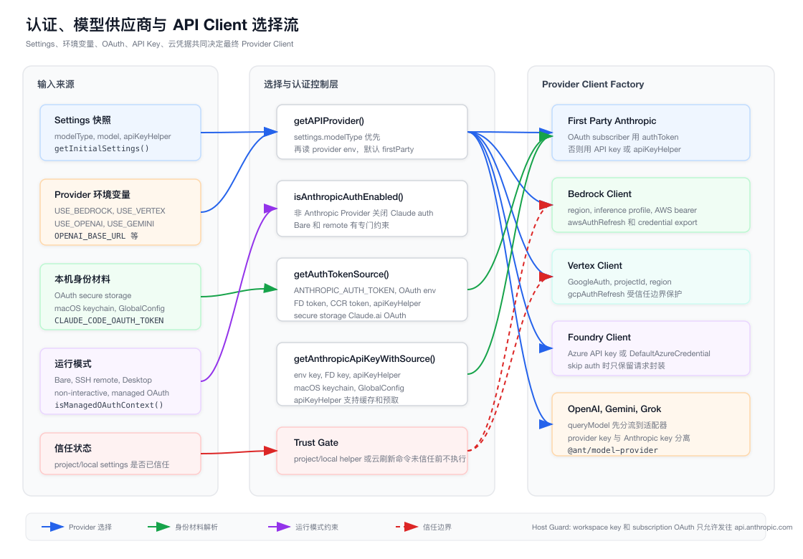
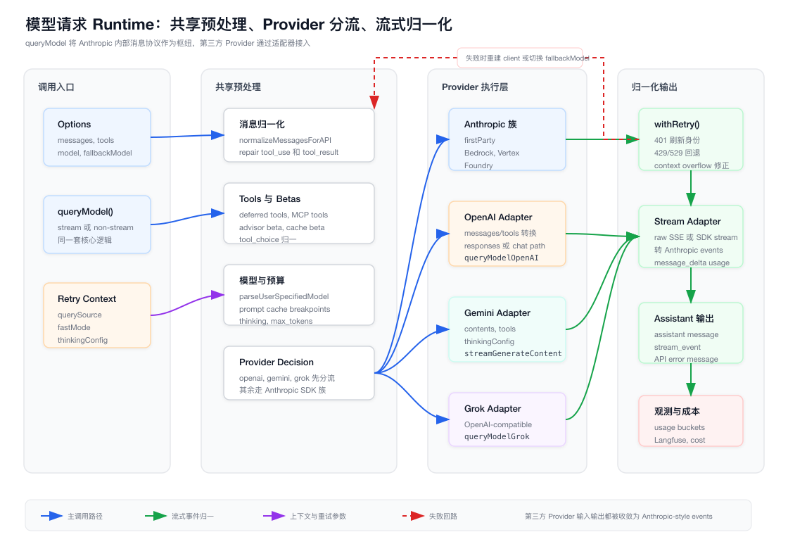

# 第 14 章：认证、模型供应商与 API Client Runtime

> 本章只分析 `claude-code/` 子目录下的实现。所有源码路径都以 `claude-code/` 为根，文档与图表落在 `tech-docs/new/`。

上一章讲的是 Settings。

Settings 解决的是控制面问题：配置从哪里来、谁的优先级更高、哪些字段受企业策略管控、项目配置能不能影响高危行为。
这一章进入模型请求真正发出去之前的运行时问题：

```text
当前会话应该走 Claude.ai OAuth，还是 API Key？
应该连 Anthropic first-party，还是 Bedrock、Vertex、Foundry？
如果用户选择了 OpenAI、Gemini、Grok，消息、工具、流式事件如何转换？
429、529、401、context overflow、fallback model 怎么处理？
```

这套逻辑不是一个简单的：

```ts
new Anthropic({ apiKey })
```

它更像一个运行时路由层：

```text
settings/env/global config/oauth/keychain/cloud credentials
  -> auth source resolver
  -> provider resolver
  -> model resolver
  -> client factory
  -> message/tool adapter
  -> retry/fallback/stream normalization
```

如果把第 13 章的 Settings 看成控制面，本章就是模型 API 的数据面。

## 14.1 源码入口总览

认证、Provider 和 API Client 的核心实现集中在这些文件：

| 模块 | 职责 |
| --- | --- |
| `src/utils/auth.ts` | Anthropic auth 是否启用、OAuth token/API key/apiKeyHelper 获取、云凭据刷新、token 刷新与缓存 |
| `src/services/oauth/*` | OAuth 2.0 PKCE 登录、local callback listener、token exchange、refresh、profile fetch |
| `src/utils/model/providers.ts` | 根据 settings 和环境变量决定当前 API Provider |
| `src/utils/model/model.ts` | 主模型、小模型、默认模型、用户模型、订阅类型、plan mode 模型选择 |
| `src/utils/model/modelStrings.ts` | provider model strings、Bedrock profile 发现、settings.modelOverrides 应用 |
| `src/utils/model/modelAllowlist.ts` | `availableModels` 允许列表和模型别名匹配 |
| `src/services/api/client.ts` | `getAnthropicClient()`，first-party、Bedrock、Vertex、Foundry Client 构造 |
| `src/services/api/claude.ts` | `queryModel()` 主模型调用流程、共享预处理、Provider 分流、流式消费 |
| `src/services/api/withRetry.ts` | API retry、fast mode fallback、OAuth 401、529 fallback、context overflow 修正 |
| `src/services/api/openai/*` | OpenAI 和 ChatGPT auth 兼容路径，OpenAI stream 适配为 Anthropic events |
| `src/services/api/gemini/*` | Gemini 请求体转换、SSE 读取、stream 适配 |
| `src/services/api/grok/*` | Grok OpenAI-compatible 适配 |
| `src/services/auth/hostGuard.ts` | workspace key 和 subscription OAuth 的目标主机保护 |
| `src/services/auth/saveWorkspaceKey.ts` | workspace API key 保存和读取 |
| `src/services/providerRegistry/*` | OpenAI-compatible 自定义 provider 注册、保存、shell export 生成 |
| `packages/@ant/model-provider/src/*` | 跨 Provider 的模型映射、消息/工具转换、stream adapter 抽象 |

本章两张图先建立全局地图。

第一张图展示身份材料和 Provider Client 如何被选择：



第二张图展示一次模型请求如何从 `queryModel()` 进入共享预处理、Provider 分流、流式归一化和 retry/fallback：



## 14.2 为什么这不是普通 API Key 管理

很多 CLI 工具的认证链路可以简化成：

```text
读 env API_KEY
  -> 写入 Authorization header
  -> 请求服务端
```

Claude Code 的复杂度高很多，原因有五个。

第一，它同时支持多种身份平面：

| 身份平面 | 典型来源 | 用途 |
| --- | --- | --- |
| Claude.ai OAuth | secure storage、`CLAUDE_CODE_OAUTH_TOKEN`、FD token | 订阅用户、Claude.ai 登录态、profile scope |
| Anthropic API Key | `ANTHROPIC_API_KEY`、macOS keychain、GlobalConfig、apiKeyHelper | first-party Console/API Key 请求 |
| Workspace API Key | `GlobalConfig.workspaceApiKey`、env override | workspace 相关 API |
| AWS 凭据 | env、AWS SDK、`awsAuthRefresh`、`awsCredentialExport` | Bedrock |
| GCP 凭据 | GoogleAuth、`gcpAuthRefresh` | Vertex |
| Azure 凭据 | API key 或 `DefaultAzureCredential` | Foundry |
| OpenAI/Gemini/Grok Key | provider 自己的 env key | 第三方模型 Provider |

第二，它同时支持多种运行模式：

- 普通 TUI。
- headless/SDK。
- bare mode。
- SSH remote。
- Claude Desktop managed OAuth。
- non-interactive session。
- CI/test 环境。

第三，项目配置可能影响身份命令。
例如 `apiKeyHelper`、`awsAuthRefresh`、`gcpAuthRefresh` 都可能来自 project/local settings。
这些配置本质上是“执行一段本地命令拿凭据”，所以必须受信任边界保护。

第四，Provider 不只是 base URL。
Bedrock、Vertex、Foundry、OpenAI、Gemini、Grok 的认证方式、模型命名、请求体、stream 格式、错误语义都不同。
代码必须把它们统一成 Claude Code 内部能消费的一组事件和成本信息。

第五，模型请求需要恢复能力。
实际运行中会遇到：

- OAuth token 过期或被撤销。
- 云凭据过期。
- keep-alive 连接 stale。
- 429 限流。
- 529 overload。
- context window overflow。
- fast mode 被拒绝或冷却。
- primary model 连续失败后需要 fallback model。

所以这里的设计目标不是“拿到一个 key”，而是：

> 在不同登录态、不同 Provider、不同运行模式和不同失败条件下，稳定地产生一个可请求、可重试、可观测、不会泄漏凭据的模型调用 runtime。

## 14.3 Provider 的第一层选择：getAPIProvider()

Provider 选择入口在 `src/utils/model/providers.ts`。

核心类型是：

```ts
export type APIProvider =
  | 'firstParty'
  | 'bedrock'
  | 'vertex'
  | 'foundry'
  | 'openai'
  | 'gemini'
  | 'grok'
```

`getAPIProvider(settings = getInitialSettings())` 的判断顺序可以压缩为：

```text
settings.modelType = openai -> openai
settings.modelType = gemini -> gemini
settings.modelType = grok   -> grok

CLAUDE_CODE_USE_BEDROCK -> bedrock
CLAUDE_CODE_USE_VERTEX  -> vertex
CLAUDE_CODE_USE_FOUNDRY -> foundry

CLAUDE_CODE_USE_OPENAI  -> openai
CLAUDE_CODE_USE_GEMINI  -> gemini
CLAUDE_CODE_USE_GROK    -> grok

default -> firstParty
```

这有几个重要含义。

第一，Settings 的 `modelType` 优先于大多数 provider env。
这延续了第 13 章的思路：Settings 是控制面，环境变量是运行时输入，但模型类型这种用户/策略配置要先被尊重。

第二，Bedrock、Vertex、Foundry 是 Anthropic 模型的云平台承载方式。
它们仍然走 `getAnthropicClient()` 的 Anthropic SDK 族分支，只是 client 构造、认证和 region 逻辑不同。

第三，OpenAI、Gemini、Grok 是协议适配分支。
它们在 `queryModel()` 中会更早被分流，走各自 adapter，然后把输出重新转回 Anthropic-style stream events。

第四，`firstParty` 仍然是默认。
如果没有任何设置和环境变量，Claude Code 认为请求应该走 Anthropic first-party。

## 14.4 first-party base URL 不是任意 URL

同在 `src/utils/model/providers.ts` 里还有一个容易被忽略的判断：

```text
isFirstPartyAnthropicBaseUrl()
```

它的作用是判断当前 `ANTHROPIC_BASE_URL` 是否仍然属于 Anthropic first-party 主机。
没有配置 `ANTHROPIC_BASE_URL` 时，默认就是 first-party。
配置后，只有特定 Anthropic 主机才被视为 first-party。

这个判断会影响后面的很多行为：

- 是否发送 first-party 专属 header。
- 是否启用 certain OAuth/subscription 路径。
- 是否生成 `x-client-request-id`。
- 是否允许一些只面向 Anthropic first-party 的 bootstrap 或模型能力。

这里的设计重点是：

> base URL 不是字符串替换，主机身份会影响认证和安全边界。

如果把任意 OpenAI-compatible endpoint 填进 Anthropic base URL，而不是走 `OPENAI_BASE_URL` 或 providerRegistry，凭据平面就会混乱。
所以 `hostGuard` 和 provider 判断会尽量把 Anthropic key、subscription OAuth、OpenAI-compatible key 分开。

## 14.5 Anthropic Auth 是否启用：isAnthropicAuthEnabled()

`src/utils/auth.ts` 里最关键的门之一是：

```text
isAnthropicAuthEnabled()
```

它不是“有没有 token”。
它回答的是：

> 当前运行时是否应该尝试 Claude.ai 或 Anthropic first-party 的认证链路？

它会在这些情况下关闭 Anthropic auth：

- bare mode 下。
- 使用 Bedrock、Vertex、Foundry 等 3P 云 Provider。
- settings 选择了 OpenAI/Gemini 等非 Anthropic 协议 Provider。
- 配置了 OpenAI/Gemini base URL 这类外部 Provider 入口。
- 存在外部 `ANTHROPIC_AUTH_TOKEN`、API key、apiKeyHelper 等显式认证输入。

但也有例外。
如果是 managed OAuth context，例如 `CLAUDE_CODE_REMOTE` 或 `CLAUDE_CODE_ENTRYPOINT=claude-desktop`，代码不能轻易退回用户终端里的 API key。
这是为了避免远端或桌面托管登录态被本地 shell 环境污染。

SSH remote 也有单独规则。
当存在 `ANTHROPIC_UNIX_SOCKET` 时，远端 settings 不能随便改变认证语义。
代码会更偏向 `CLAUDE_CODE_OAUTH_TOKEN` 这类显式远端 token，而不是读取本地用户的普通 key。

这里体现了一个模式：

```text
认证开关 = Provider 类型 + 运行模式 + 显式 env/key + 托管上下文
```

它不是单个布尔配置。

## 14.6 Auth Token Source 的解析顺序

`getAuthTokenSource()` 负责判断当前 Bearer token 应该从哪里来。

普通运行时的来源大致是：

```text
ANTHROPIC_AUTH_TOKEN
  -> CLAUDE_CODE_OAUTH_TOKEN
  -> CLAUDE_CODE_OAUTH_TOKEN_FILE_DESCRIPTOR
  -> CCR_OAUTH_TOKEN_FILE
  -> apiKeyHelper
  -> Claude.ai OAuth secure storage
  -> none
```

bare mode 会更严格。
它只允许 flag settings 里的 `apiKeyHelper`，否则返回 none。

这里有一个细节很重要：

> `getAuthTokenSource()` 检测 apiKeyHelper 来源时不会执行 helper。

原因是执行 helper 可能意味着执行项目配置里的命令。
在用户还没有信任项目之前，不能为了“判断 source”就执行任意命令。
所以 source detection 和 credential materialization 是分开的。

这也是 Claude Code 里反复出现的安全模式：

```text
先判断配置来自哪里
再判断这个来源是否可信
最后才执行命令或读取凭据
```

## 14.7 API Key Source 的解析顺序

`getAnthropicApiKeyWithSource()` 负责获取 Anthropic API Key。

它比 token source 更复杂，因为 API key 可能来自：

- `ANTHROPIC_API_KEY`。
- API key 文件描述符。
- `apiKeyHelper`。
- macOS keychain。
- `GlobalConfig.primaryApiKey`。

CI/test 环境有单独要求。
代码会要求显式 `ANTHROPIC_API_KEY`、OAuth env 或 FD token，不会随便从用户本机状态里拿 key。

普通交互运行时也不是永远直接使用 `ANTHROPIC_API_KEY`。
代码会维护一个“用户已批准自定义 API key response”的状态，避免 shell 环境里突然出现的 key 静默改变产品行为。

`apiKeyHelper` 的优先级也值得注意。
当 helper 配置存在但缓存是冷的，它会返回 source 为 `apiKeyHelper` 的 null，而不是直接落到 keychain。
这避免了一个隐蔽问题：

```text
用户配置了 helper
  -> helper 暂时还没跑完
  -> runtime 悄悄 fallback 到旧 keychain key
```

这样会让用户以为正在用 helper，其实请求走了另一个 key。
所以这里宁可返回“helper source 但暂时无 key”，也不静默换身份。

## 14.8 apiKeyHelper 的缓存和信任边界

`apiKeyHelper` 是一项强能力。
它允许用户通过命令动态产生 API key，例如接入公司内部凭据系统。

但它也有两个风险：

1. helper 可能来自 project/local settings。
2. helper 是本地命令执行。

所以 `src/utils/auth.ts` 做了几层保护。

第一，来源检测：

```text
isApiKeyHelperFromProjectOrLocalSettings()
```

它能判断 helper 是否来自 `.claude/settings.json` 或 `.claude/settings.local.json` 这类项目/本地配置。

第二，执行前 gating。
`_executeApiKeyHelper()` 在交互 session 中，如果发现 helper 来自 project/local settings 且项目未被信任，会拒绝执行。

第三，预取也受保护。
`prefetchApiKeyFromApiKeyHelperIfSafe()` 在项目命令还不可信时不会提前执行 helper。

第四，helper 有缓存。
默认 TTL 是 5 分钟，可以通过 `CLAUDE_CODE_API_KEY_HELPER_TTL_MS` 覆盖。
代码实现了 stale-while-revalidate 风格：

```text
缓存可用 -> 先返回缓存
缓存过期 -> 后台刷新
刷新完成 -> epoch 检查，避免旧请求覆盖新缓存
```

这个 epoch 细节很实际。
如果两个 helper 刷新并发执行，较慢的旧请求不能覆盖较快的新结果。

## 14.9 云 Provider 凭据刷新也受信任保护

同样的模式也出现在 Bedrock 和 Vertex。

Settings 里可以配置：

| 字段 | 作用 |
| --- | --- |
| `awsAuthRefresh` | 刷新 AWS 登录态或凭据 |
| `awsCredentialExport` | 导出 AWS 凭据环境 |
| `gcpAuthRefresh` | 刷新 GCP 登录态或凭据 |

这些字段如果来自 project/local settings，也不能在项目未信任前执行。

对应的检测函数包括：

- `isAwsAuthRefreshFromProjectSettings()`
- `isAwsCredentialExportFromProjectSettings()`
- `isGcpAuthRefreshFromProjectSettings()`

Bedrock 相关路径里，`refreshAndGetAwsCredentials()` 有 memoized TTL，默认 1 小时。
刷新后会清理 AWS INI cache，避免 SDK 继续读旧凭据。

Vertex 相关路径里，`checkGcpCredentialsValid()` 带 5 秒超时，避免凭据检测卡死 CLI。
`refreshGcpCredentialsIfNeeded()` 同样带 memoized TTL。

预取函数也强调 “if safe”：

```text
prefetchAwsCredentialsAndBedRockInfoIfSafe()
prefetchGcpCredentialsIfSafe()
```

这类命名很直接：

> 预取不是性能优化优先，而是信任边界优先。

## 14.10 OAuth 登录：PKCE、本地 callback 和 manual code

OAuth 逻辑在 `src/services/oauth/*`。

主要角色是：

| 文件 | 职责 |
| --- | --- |
| `crypto.ts` | `generateCodeVerifier()`、`generateCodeChallenge()`、`generateState()` |
| `OAuthService.ts` | 启动登录流、打开浏览器、等待 callback 或 manual code、交换 token |
| `AuthCodeListener.ts` | 本地 HTTP callback server，校验 path/code/state |
| `client.ts` | 构造 auth URL、token exchange、refresh token、fetch profile、创建 Console API key |

Claude Code 使用 OAuth 2.0 Authorization Code + PKCE。
流程是：

```text
生成 code_verifier
  -> SHA256 得到 code_challenge
  -> 生成 state
  -> 启动 localhost callback listener
  -> 打开浏览器到 authorize URL
  -> 自动 callback 或用户粘贴 manual code
  -> exchange code for tokens
  -> fetch profile info
  -> 保存 OAuth tokens
```

`AuthCodeListener` 会绑定 `localhost`，端口由系统分配。
它只接受 `/callback` path，并校验 `state`。
这防止其他页面或本地进程伪造回调。

登录 URL 支持 Claude.ai 和 Console 两类授权端点。
scope 可以是完整 OAuth scopes，也可以是 inference-only。

这解释了为什么后续 token 里会区分：

- 是否有 `user:inference`。
- 是否有 `user:profile`。
- 是否能拿订阅信息和 rate limit tier。

## 14.11 OAuth Token 的保存、刷新和 401 恢复

OAuth token 保存和刷新仍然在 `src/utils/auth.ts`。

几个关键函数：

| 函数 | 职责 |
| --- | --- |
| `saveOAuthTokensIfNeeded()` | 保存 OAuth tokens，更新 account info，清理缓存 |
| `getClaudeAIOAuthTokens()` | 从 env/FD/secure storage 取 OAuth tokens |
| `checkAndRefreshOAuthTokenIfNeeded()` | 检查过期并刷新 token |
| `handleOAuth401Error()` | 请求遇到 401 后清 token cache 并尝试恢复 |
| `clearOAuthTokenCache()` | 清理 memoized token 和 keychain cache |
| `invalidateOAuthCacheIfDiskChanged()` | 检测 `.credentials.json` mtime，处理跨进程写入 |

`saveOAuthTokensIfNeeded()` 有两个值得关注的细节。

第一，它会跳过非 Claude AI 或 inference-only token 的某些保存路径。
这避免把临时 token 当成完整账号登录态。

第二，如果新 profile fetch 没拿到订阅或 rate limit 信息，它会保留旧的 `subscriptionType` 和 `rateLimitTier`。
这是为了避免一次临时 profile 缺失把本地账号信息降级。

刷新时，`checkAndRefreshOAuthTokenIfNeeded()` 会：

- 合并并发的非 force refresh，避免多个请求同时刷新。
- 使用 config dir lock。
- lock 获取会重试。
- token 过期或 force 时调用 refresh endpoint。
- 保存新 token 后清理 API client 相关缓存。

`handleOAuth401Error(failedAccessToken)` 处理请求中的 401。
它按 failed token 去重，避免同一个坏 token 触发一串刷新。
如果 keychain 里已经有不同 token，会认为其他进程可能已经刷新过，直接恢复。
否则才走强制 refresh。

这里的模型是：

```text
请求前主动刷新
  + 请求后 401 被动恢复
  + 跨进程 token 写入检测
```

这比“过期了就刷新”更接近真实 CLI 场景。

## 14.12 Profile Scope 与订阅类型

OAuth 不只是拿 bearer token。
Claude Code 还会基于 profile 信息判断订阅能力。

相关函数包括：

- `isClaudeAISubscriber()`
- `hasProfileScope()`
- `getSubscriptionType()`
- `isMaxSubscriber()`
- `isTeamSubscriber()`
- `isTeamPremiumSubscriber()`
- `isEnterpriseSubscriber()`
- `isProSubscriber()`
- `getRateLimitTier()`
- `getSubscriptionName()`

这些信息会影响：

- 默认主模型。
- Opus 是否可用。
- Opus 1M 是否启用。
- 是否走 OAuth subscription authToken。
- rate limit tier 展示和请求策略。

所以 OAuth account info 不是 UI 装饰，它会进入模型运行时。

## 14.13 API Key 存储：Keychain 优先，GlobalConfig 兜底

Anthropic API key 的本机保存逻辑仍在 `src/utils/auth.ts`。

macOS 上会优先用系统 keychain。
如果 keychain 不可用，会 fallback 到 `GlobalConfig.primaryApiKey`。

保存 API key 时有几个安全细节：

- 校验 key 字符。
- 使用 `security -i` 加 hex input，避免 key 出现在进程参数里。
- 保存后记录 approved normalized key。

读取时，`getApiKeyFromConfigOrMacOSKeychain()` 会优先尝试 keychain prefetch。
如果不可用，再走 `security find-generic-password`。
最后才 fallback 到 `GlobalConfig.primaryApiKey`。

这套逻辑和 `apiKeyHelper` 的关系是：

```text
helper 配置存在且可执行 -> helper 优先
helper 不可用或无配置 -> keychain / GlobalConfig
```

但如前面所说，helper source 不会静默掉到 keychain，避免用户误判当前身份。

## 14.14 Workspace API Key 是另一条线

`src/services/auth/saveWorkspaceKey.ts` 处理 workspace API key。

它和普通 Anthropic API key 不完全一样。

`saveWorkspaceKey()` 会：

- 校验 key 前缀。
- 避免把 key 放进错误信息。
- 保存到 `~/.claude.json` 的 `workspaceApiKey`。
- 尝试设置文件权限为 600。

`getEffectiveWorkspaceApiKey()` 的优先级是：

```text
ANTHROPIC_API_KEY
  -> GlobalConfig.workspaceApiKey
```

这条线和 `hostGuard` 强绑定。

`src/services/auth/hostGuard.ts` 里：

- `assertWorkspaceHost(url)` 只允许 workspace API key 请求发往 `api.anthropic.com`。
- `assertSubscriptionBaseUrl(url)` 对 subscription OAuth 请求做同样保护。

目的很直接：

> workspace key 和 subscription OAuth 不能因为 base URL 被改写而发给非 Anthropic 主机。

## 14.15 Provider Client Factory：getAnthropicClient()

`src/services/api/client.ts` 的 `getAnthropicClient()` 是 Anthropic SDK 族的 client factory。

它接收：

```ts
{
  apiKey,
  maxRetries,
  model,
  fetchOverride,
  source,
}
```

但它并不只是 new client。
它会先构造共同请求配置：

- 默认 headers。
- User-Agent。
- `x-app: cli`。
- session id。
- custom headers。
- remote/container headers。
- `x-client-app`。
- SSH auth nonce。
- 可选 additional protection header。
- timeout。
- proxy fetch options。
- `dangerouslyAllowBrowser`。
- optional fetch override。

然后它会执行：

```text
checkAndRefreshOAuthTokenIfNeeded()
```

这意味着即使最后走的是 first-party OAuth，也尽量在请求前刷新 token。

如果当前不是 Claude.ai subscriber，它会走 `configureApiKeyHeaders()`。
这个函数负责从 `ANTHROPIC_AUTH_TOKEN` 或 apiKeyHelper 输出等地方设置 Authorization header。

之后进入 Provider 分支。

## 14.16 Bedrock Client 分支

当 `CLAUDE_CODE_USE_BEDROCK` 开启时，`getAnthropicClient()` 会导入 Bedrock client。

Bedrock 分支要处理：

- region 选择。
- small-fast model 的 region override。
- AWS bearer token。
- skip auth。
- AWS credentials refresh。
- application inference profile。

region 不是简单读一个 env。
对 small-fast model，代码允许使用 `ANTHROPIC_SMALL_FAST_MODEL_AWS_REGION` 覆盖。
普通模型则走 `getAWSRegion()`。

认证上，如果存在 `AWS_BEARER_TOKEN_BEDROCK`，可以走 bearer token。
否则会调用 `refreshAndGetAwsCredentials()` 取得 AWS credentials。

因为 Bedrock 仍然承载 Anthropic 模型，所以它属于 Anthropic SDK 族：

```text
queryModel()
  -> Anthropic path
  -> getAnthropicClient()
  -> BedrockClient
  -> stream events
```

但它的 usage/cost、region、profile 和 credential 生命周期都是 Bedrock 专属。

## 14.17 Vertex Client 分支

Vertex 分支由 `CLAUDE_CODE_USE_VERTEX` 控制。

它会：

- 在非 skip auth 时刷新 GCP credentials。
- 导入 Vertex SDK 和 GoogleAuth。
- 解析 projectId。
- 解析 region。
- 构造 Vertex client。

一个实际工程细节是 projectId。
GoogleAuth 从 metadata server 获取 projectId 时可能有超时问题。
代码会优先使用 `ANTHROPIC_VERTEX_PROJECT_ID` 这类显式配置，避免阻塞。

region 会通过 `getVertexRegionForModel(model)` 解析。
不同模型可能需要不同区域，不能只用全局默认。

Vertex 和 Bedrock 一样，仍然在 Anthropic SDK 族路径内。
区别是认证材料和 endpoint 由 GCP 管理。

## 14.18 Foundry Client 分支

Foundry 分支由 `CLAUDE_CODE_USE_FOUNDRY` 控制。

它会导入 `@anthropic-ai/foundry-sdk`。

认证上：

- 如果传入 API key，使用 key。
- 如果没有 key 且没有 skip auth，使用 Azure `DefaultAzureCredential`。
- skip auth 时保留 client 封装，但不主动拿 Azure credentials。

Foundry 分支体现了一个设计取舍：

```text
Anthropic 模型协议仍然相近
但云平台认证和 client SDK 不同
```

所以它被放在 `getAnthropicClient()` 的 Provider factory 里，而不是像 OpenAI/Gemini 那样在 `queryModel()` 前置分流。

## 14.19 First-party Anthropic 分支

如果不是 Bedrock、Vertex、Foundry，就进入 first-party Anthropic 分支。

client config 的关键差异是：

```text
Claude.ai subscriber:
  apiKey = null
  authToken = OAuth access token

非 subscriber:
  apiKey = 显式 apiKey 或 getAnthropicApiKey()
```

如果是 Anthropic 内部 staging OAuth 场景，还会使用 staging OAuth base URL。

first-party 分支里还有一个 `buildFetch()` 包装。
它会：

- 注入 `x-client-request-id`。
- 打日志。
- 处理 proxy。
- 在必要时避免把未知 header 发给 3P Provider。

`x-client-request-id` 只在 first-party 且 base URL 被认为是 first-party 时注入。
这再次说明主机身份会影响请求协议。

## 14.20 第三方协议 Provider 不走 getAnthropicClient 主路径

OpenAI、Gemini、Grok 的分流在 `src/services/api/claude.ts` 的 `queryModel()` 里更早发生。

大致逻辑是：

```text
provider = getAPIProvider()

if provider == openai:
  queryModelOpenAI(...)
  return

if provider == gemini:
  queryModelGemini(...)
  return

if provider == grok:
  queryModelGrok(...)
  return

继续 Anthropic SDK 族逻辑
```

这是合理的。
因为这三个 Provider 不只是 client 不同，请求体和 stream event 都不同。

例如：

- OpenAI 需要把 Anthropic messages/tools/tool_choice 转成 OpenAI chat 或 responses 形态。
- Gemini 需要构造 `contents`、`systemInstruction`、`generationConfig`、`tools`、`toolConfig`。
- Grok 是 OpenAI-compatible，但模型映射、base URL、key env 和成本观测是自己的。

如果强行让这些都进入 `getAnthropicClient()`，会让 client factory 承担消息协议转换。
Claude Code 选择把协议适配放在 Provider adapter 层。

## 14.21 @ant/model-provider 的角色

`packages/@ant/model-provider/src/*` 提供跨 Provider 共享的转换能力。

它导出几类东西：

| 能力 | 说明 |
| --- | --- |
| hooks DI | `registerHooks()`、`getHooks()` |
| client factories DI | `registerClientFactories()`、`getClientFactories()` |
| model mapping | `resolveOpenAIModel()`、`resolveGrokModel()`、`resolveGeminiModel()` |
| OpenAI converters | `anthropicMessagesToOpenAI()`、`anthropicToolsToOpenAI()`、`adaptOpenAIStreamToAnthropic()` |
| Gemini converters | `anthropicMessagesToGemini()`、`anthropicToolsToGemini()`、`adaptGeminiStreamToAnthropic()` |
| shared error formatting | provider 相关错误格式化 |

注意这个包不是“直接发请求”的唯一入口。
实际 client factory 在 `src/services/api/openai/client.ts`、`src/services/api/gemini/client.ts`、`src/services/api/grok/client.ts` 这些文件里。

可以把它理解成：

```text
main app:
  管认证、settings、runtime、observability

@ant/model-provider:
  管模型名映射、协议转换、stream event adapter
```

这个边界有利于复用。
如果以后另一个 runtime 也想接入这些 Provider，不需要复制所有消息转换逻辑。

## 14.22 OpenAI Adapter

OpenAI 路径在 `src/services/api/openai/index.ts`。

`queryModelOpenAI()` 会：

1. 通过 `resolveOpenAIModel()` 解析模型名。
2. 归一化 messages。
3. 处理 SearchExtraTools/deferred tools。
4. 把 Anthropic messages 转成 OpenAI messages。
5. 把 Anthropic tools 转成 OpenAI tools。
6. 处理 tool choice。
7. 根据认证模式选择 ChatGPT subscription path 或普通 OpenAI client。
8. 把 OpenAI stream 适配回 Anthropic events。
9. 累积 assistant message、usage、cost 和观测信息。

`src/services/api/openai/client.ts` 读取的关键 env 是：

- `OPENAI_API_KEY`
- `OPENAI_BASE_URL`
- `OPENAI_ORG_ID`
- `OPENAI_PROJECT_ID`

它会缓存 client，除非有 `fetchOverride`。
同时它的 fetch wrapper 会更新 provider usage buckets。

OpenAI 分支里还有 ChatGPT auth 路径。
当 `isChatGPTAuthEnabled()` 成立时，请求会走 responses adapter，并映射 reasoning effort。
这说明 OpenAI path 本身也不是单一 API。

## 14.23 Gemini Adapter

Gemini 路径在 `src/services/api/gemini/index.ts` 和 `client.ts`。

`queryModelGemini()` 会：

- 通过 `resolveGeminiModel()` 解析模型。
- 将 Anthropic messages 转成 Gemini `contents`。
- 将 system prompt 转成 `systemInstruction`。
- 将 tools/tool choice 转成 Gemini 形态。
- 构造 `generationConfig`。
- 带上 `thinkingConfig`。
- 调用 `streamGeminiGenerateContent()`。
- 将 Gemini SSE stream 适配为 Anthropic events。

Gemini client 默认 base URL 是：

```text
https://generativelanguage.googleapis.com/v1beta
```

可以用 `GEMINI_BASE_URL` 覆盖。

认证使用：

```text
GEMINI_API_KEY -> x-goog-api-key
```

Gemini 的 stream 读取是手动解析 SSE frame：

```text
:streamGenerateContent?alt=sse
```

这和 Anthropic SDK 的 stream 抽象不同，所以 adapter 层必须存在。

## 14.24 Grok Adapter

Grok 路径在 `src/services/api/grok/*`。

Grok 是 OpenAI-compatible Provider，所以它复用了 OpenAI converter 和 stream adapter。
但它有自己的 client 和模型解析：

- `resolveGrokModel()`
- `getGrokClient()`
- `GROK_API_KEY`
- `XAI_API_KEY`
- `GROK_BASE_URL`

默认 base URL 是：

```text
https://api.x.ai/v1
```

Grok 分支说明了一种常见扩展模式：

```text
协议兼容 OpenAI
  -> 复用 OpenAI messages/tools/stream 转换
  -> 只替换 base URL、key env、model mapping、usage/cost 记录
```

这也是 providerRegistry 支持 OpenAI-compatible provider 的原因。

## 14.25 providerRegistry：自定义 OpenAI-compatible Provider

`src/services/providerRegistry/*` 处理自定义 Provider。

配置 schema 在 `types.ts`：

```ts
{
  id: string
  kind: 'openai-compat'
  baseUrl: string
  apiKeyEnv: string
  defaultModel: string
  compatRule: 'cerebras' | 'groq' | 'deepseek' | 'strict-openai' | 'permissive'
}
```

默认 Provider 包括：

- cerebras
- groq
- qwen
- deepseek

用户配置文件是：

```text
~/.claude/providers.json
```

`loader.ts` 的行为是：

- 先加载默认 Provider。
- 再加载用户 Provider。
- 用户同 ID 配置可以替换默认 Provider。
- 配置损坏或不合法时 fallback 到默认 Provider，并返回 diagnostics。
- 保存时用 tmp + rename，避免半写文件。
- 只持久化非默认或被覆盖的默认 Provider。

`switcher.ts` 不直接修改 env。
它是一个 pure function，返回推荐的环境变量：

```text
CLAUDE_CODE_USE_OPENAI=1
OPENAI_BASE_URL=...
OPENAI_MODEL=...
OPENAI_API_KEY=$某个 provider apiKeyEnv
```

如果同时检测到 `ANTHROPIC_API_KEY` 和 OpenAI mode，会给出 warning。
这和 `hostGuard.assertNoAnthropicEnvForOpenAI()` 的目标一致：

> Anthropic key 和 OpenAI-compatible key 不能混用。

## 14.26 模型选择：用户指定、默认模型和订阅

模型选择主要在 `src/utils/model/model.ts`。

用户指定模型的优先级是：

```text
main loop override, 例如 /model
  -> 启动参数 --model
  -> ANTHROPIC_MODEL
  -> settings.model
```

但指定模型还要经过 `isModelAllowed()`。
如果 settings 里的 `availableModels` 不允许，这个模型会被忽略。

默认模型和订阅强相关。

代码会基于 Provider 和 subscription type 选择默认 Opus/Sonnet/Haiku。
例如：

- Anthropic 内部用户可能走专门默认。
- Max 或 Team Premium 用户默认可走 Opus。
- PAYG、Enterprise、Team Standard、Pro 等通常走 Sonnet。
- plan mode 下 `opusplan` 会影响是否使用 Opus。

这里的模型名不是写死一个字符串。
`getDefaultOpusModel()`、`getDefaultSonnetModel()`、`getDefaultHaikuModel()` 会根据 Provider 选择对应默认。

`getSmallFastModel()` 也会按 Provider 读取不同 env override。
例如 Bedrock、Vertex、Foundry、OpenAI、Gemini、Grok 都可能有自己的 small-fast 模型字符串。

所以模型选择实际是：

```text
用户意图
  + Provider
  + settings.modelOverrides
  + availableModels allowlist
  + subscription
  + plan mode
  + env overrides
```

## 14.27 模型字符串与 modelOverrides

`src/utils/model/modelStrings.ts` 负责 Provider model strings。

源头是 `ALL_MODEL_CONFIGS`。
它按 canonical model config 映射不同 Provider 的实际模型字符串。

例如同一个“默认 Sonnet”概念，在 first-party、Bedrock、Vertex、Foundry、OpenAI、Gemini、Grok 下可能是不同字符串。

`getBuiltinModelStrings(provider)` 会取出 Provider 对应字符串。

Bedrock 有特殊逻辑。
`getBedrockModelStrings()` 会尝试获取 inference profiles，并把 canonical first-party ID 的片段和 Bedrock profile 做匹配。
如果获取失败，才 fallback 到 hardcoded strings。

settings 里还可以配置：

```text
modelOverrides
```

`applyModelOverrides()` 会把这些 override 叠加到模型字符串上。
`resolveOverriddenModel()` 则做反向映射，帮助代码从 override 值回到 canonical model。

这让企业或高级用户可以把“Claude Code 认为的某个模型槽位”指向内部部署或指定 Provider 的模型名。

## 14.28 availableModels：不是 UI 下拉过滤而已

`src/utils/model/modelAllowlist.ts` 实现 `availableModels`。

如果没有配置，默认允许所有模型。
如果配置为空数组，则阻止所有用户指定模型。

allowlist 支持多种匹配：

- family alias。
- version prefix。
- full model id。
- override 后的模型。
- 用户输入别名解析后的模型。

它不是简单过滤 `/model` UI 下拉。
在 `getUserSpecifiedModelSetting()` 里，如果用户指定模型不允许，代码会忽略这个设置。

这意味着企业策略可以限制模型使用：

```text
用户通过 /model 选了模型
  -> parseUserSpecifiedModel()
  -> isModelAllowed()
  -> 不允许则不进入 runtime
```

## 14.29 queryModel() 的共享预处理

模型请求主流程在 `src/services/api/claude.ts`。

关键入口包括：

- `queryModelWithoutStreaming()`
- `queryModelWithStreaming()`
- 内部 `queryModel()`

`queryModel()` 的 `Options` 很大，包括：

- `model`
- `fallbackModel`
- `querySource`
- `tools`
- `mcpTools`
- `agents`
- `effortValue`
- `fastMode`
- `fetchOverride`
- `thinkingConfig`
- `systemPrompt`

在 Provider 分流前，它会做一批共享预处理：

- off-switch 检查，例如非 subscriber Opus。
- request chain tracking。
- Bedrock application-inference-profile 到 backing model 的 cost 映射。
- 合并 betas。
- advisor beta 处理。
- tool search/deferred tools 处理。
- MCP tools 和 API tools 过滤。
- `normalizeMessagesForAPI()`。
- 修复 tool_use/tool_result pairing。
- 去掉当前模型不支持的 tool search 字段。
- 去掉没有 beta 时的 advisor blocks。
- 去掉超量 media。

这些逻辑都发生在 OpenAI/Gemini/Grok 分流之前。

这很关键：

> Claude Code 先把内部消息状态清理成一份一致的 Anthropic-style API 输入，再交给各 Provider adapter。

如果每个 Provider 分支都自己修消息、修工具、修 media，行为会很难保持一致。

## 14.30 Anthropic SDK 族请求体

如果 Provider 不是 OpenAI/Gemini/Grok，就继续 Anthropic SDK 族路径。

这个路径会构造 `BetaMessageStreamParams`。
其中包含：

- model。
- messages。
- system blocks。
- tools。
- tool_choice。
- betas。
- metadata。
- max_tokens。
- thinking/adaptive thinking。
- context_management。
- extra body params。
- output_config。
- speed。

system prompt 也不是原样发送。
它会插入：

- attribution。
- CLI prompt prefix。
- advisor/chrome instructions。
- cache break nonce。

system blocks 和 tools 还会设置 prompt cache breakpoint。
这和前面章节的 prompt cache 设计衔接起来。

fast mode 也在这里参与。
它会影响请求里的 speed 配置，并在 `withRetry()` 里参与 fallback 或 cooldown。

## 14.31 流式请求为什么不用 BetaMessageStream

`queryModel()` 里有一个实现选择：

> 使用 raw stream，而不是 SDK 的 `BetaMessageStream`。

注释里的原因是避免 partial JSON parsing 出现 O(n²) 开销。

这类细节很适合学习。
LLM streaming 常见问题不是“能不能收到事件”，而是：

```text
事件数量很多
每次 delta 都重新 parse 累积 JSON
  -> 长输出或工具参数变大时性能劣化
```

所以 Claude Code 选择自己消费 raw stream：

- content block start。
- text delta。
- input JSON delta。
- content block stop。
- message delta。
- message stop。
- error event。

它在 streaming loop 里累积 content blocks 和 text deltas。
文本 delta 用 join 方式避免重复拼接造成额外开销。

最终向上层 yield：

- assistant messages。
- stream_event。
- API error messages。

这就是 UI、hooks、transcript 能统一消费模型输出的原因。

## 14.32 Streaming Watchdog 和 Stall 检测

流式请求可能卡住。
`queryModel()` 里有 watchdog 和 stall 检测。

相关行为包括：

- 可通过 `CLAUDE_ENABLE_STREAM_WATCHDOG` 控制。
- 默认 idle timeout 约 90 秒。
- stall 超过阈值会记录。
- streaming error 可在某些条件下 fallback 到 non-streaming。

但 fallback 到 non-streaming 不是无条件的。
如果已经发生流式工具执行，重复请求可能导致工具重复执行。
所以代码会看 feature flag 和执行状态，避免“为了恢复输出”造成副作用重复。

这是 Agent runtime 里的常见难题：

```text
普通文本生成可重试
带工具调用的流式生成不可随便重放
```

## 14.33 Non-streaming 请求

非流式请求由 `executeNonStreamingRequest()` 处理。

它同样包在 `withRetry()` 里。
同时有 bounded timeout：

- remote 场景默认较短。
- 普通场景默认较长。

非流式路径更容易重试，因为没有中途 tool execution 的流式副作用问题。
但它仍然要和 streaming path 共享：

- model。
- fallbackModel。
- retry context。
- auth refresh。
- client recreation。
- cost/usage 记录。

所以非流式不是另一个独立 client，而是同一套 runtime 的另一种执行方式。

## 14.34 withRetry()：模型调用的恢复层

`src/services/api/withRetry.ts` 是模型请求恢复能力的核心。

默认参数包括：

```text
DEFAULT_MAX_RETRIES = 10
BASE_DELAY_MS = 500
MAX_529_RETRIES = 3
```

它是一个 async generator。
这意味着 retry 过程中可以 yield `SystemAPIErrorMessage` 给上层，让 UI 或 headless 输出知道当前发生了什么。

它处理的情况包括：

- 401。
- OAuth token revoked。
- Bedrock auth errors。
- Vertex auth errors。
- stale connection，例如 `ECONNRESET`、`EPIPE`。
- 429。
- 529。
- context overflow。
- fast mode rejected。
- fallback model trigger。
- timeout。

401 时，它可能重建 client。
如果是 OAuth 401，会调用 `handleOAuth401Error(failedAccessToken)`。

Bedrock/Vertex auth error 时，也会触发凭据刷新并重建 client。

stale connection 时，可能禁用 keep-alive 后重试。

这层的输入不是单个 request function，而是：

```ts
withRetry(
  getClient,
  operation,
  options,
)
```

所以它能在 retry 时重新拿 client，而不是复用一个已经带坏 token 或坏连接的 client。

## 14.35 429、529、fast mode 和 fallback model

429 和 529 是模型 runtime 最常见的恢复场景。

fast mode 下，`withRetry()` 会按情况处理：

- 如果 fast mode overage 不允许，永久禁用 fast mode 并重试 standard。
- 如果 `retry-after` 很短，等待后继续 retry fast。
- 如果等待时间较长，进入 cooldown 并用 standard 重试。
- 如果 API 明确拒绝 fast mode，禁用后重试 standard。

529 overload 有专门策略。
默认只对部分 foreground query source 做 529 retry，避免后台任务在网关故障时放大流量。

连续 529 达到阈值后，如果存在 `fallbackModel`，会抛出 `FallbackTriggeredError`。
外层据此切换 fallback model。

这不是“有 fallback 就立刻用 fallback”。
它需要先判断：

- querySource 是否适合 retry。
- 是否 subscriber。
- 是否 custom model。
- 是否启用了 fallback-for-all-primary-models。
- 529 是否连续达到阈值。

这样做的目的是避免 primary model 轻微抖动就频繁切换。

## 14.36 Persistent Retry：无人值守场景

`withRetry()` 还支持 persistent retry。

相关开关是：

```text
CLAUDE_CODE_UNATTENDED_RETRY
```

它主要面向 Anthropic 内部或特定无人值守场景。
开启后，429/529 可以无限 retry，使用 capped backoff，并每 30 秒 yield heartbeat。

这个模式不适合普通交互请求。
交互 CLI 如果无限等待，用户会以为卡死。

所以 persistent retry 被放在明确开关后面，并且和用户类型、错误类型绑定。

## 14.37 Context Overflow 的动态修正

请求失败不一定是服务不可用，也可能是：

```text
input length + max_tokens exceed context limit
```

`withRetry()` 会解析这类 400 错误。
如果能识别出 context limit，会调整 `maxTokensOverride`，然后重试。

这是一种运行时自适应：

```text
请求体太大
  -> 不是直接失败
  -> 尝试降低输出 token 预算
  -> 保持输入不变重新请求
```

当然这只适用于“输入 + max_tokens 超限”这类情况。
如果输入本身已经超过 context window，就需要上游压缩、裁剪或重新组织上下文。

这也自然引出后续章节：上下文预算和成本控制。

## 14.38 bootstrap API：first-party 的非核心请求

`src/services/api/bootstrap.ts` 负责 bootstrap API。

它只面向 first-party。
在非 firstParty Provider 下会跳过。

它要求：

- OAuth token 且有 profile scope。
- 或 API key。

请求目标是：

```text
/api/claude_cli/bootstrap
```

这个请求会获取：

- `client_data`
- `additional_model_options`

并缓存到 GlobalConfig。
只有数据变化时才写回，避免无意义磁盘 churn。

它使用 `withOAuth401Retry`。
如果 token 失效，能复用 OAuth 401 恢复逻辑。

这里可以看到一条清晰边界：

```text
核心模型请求可以走多 Provider
bootstrap 这类产品元数据只走 first-party
```

## 14.39 错误消息：按交互模式区分

错误格式化在 `src/services/api/errors.ts`。

它不仅把异常转成字符串，还会根据运行模式给出不同建议。

例如：

- interactive 和 non-interactive 的提示不同。
- invalid API key 和 revoked token 的提示不同。
- org disabled 有专门错误。
- repeated 529 有专门错误。
- timeout、prompt too long、media too large 都有不同处理。
- CCR remote 模式下，auth 错误不能随便建议本地 login。

这是 CLI 产品里很重要的一层。
同一个 401，在不同场景下含义不同：

```text
本地 TUI:
  可能应该提示 /login

remote managed OAuth:
  可能应该提示重试或检查远端凭据

OpenAI-compatible mode:
  不应该让用户去修 Anthropic OAuth
```

所以错误处理必须知道 Provider、运行模式和身份来源。

## 14.40 从零实现一个简化版

如果要给自己的 Coding Agent 实现类似系统，可以先做一个简化版。

第一步，定义 Provider。

```ts
type Provider =
  | 'anthropic'
  | 'bedrock'
  | 'vertex'
  | 'openai'
  | 'gemini'
```

第二步，定义身份来源。

```ts
type CredentialSource =
  | { type: 'oauth'; accessToken: string; expiresAt: number }
  | { type: 'apiKey'; apiKey: string }
  | { type: 'helper'; command: string; trusted: boolean }
  | { type: 'cloud'; provider: 'aws' | 'gcp' }
  | { type: 'none' }
```

第三步，把 source detection 和 materialization 分开。

```text
detectCredentialSource()
  -> 不执行命令
  -> 只返回来源和风险

materializeCredential()
  -> 检查信任
  -> 执行 helper 或刷新 token
  -> 返回可用凭据
```

第四步，Provider 分流。

```text
resolveProvider(settings, env)
  -> provider
  -> resolveModel(provider, userModel, defaults)
  -> buildClient(provider, credentials)
```

第五步，统一内部消息协议。

```text
internal messages/tools
  -> provider adapter
  -> provider stream
  -> internal stream events
```

第六步，集中 retry。

```text
withRetry(getClient, operation, context)
  -> 401 refresh
  -> 429 backoff
  -> 529 fallback
  -> context overflow max_tokens adjust
  -> stale connection rebuild
```

不要一开始就支持所有 Provider。
先把边界做对：

- 身份来源不能混。
- helper 不能绕过 trust gate。
- Provider adapter 不能泄漏 Anthropic-specific header。
- retry 必须能重建 client。
- stream output 必须归一。

## 14.41 调试清单

遇到认证或 Provider 问题，可以按这个顺序查。

第一，确认 Provider：

```text
settings.modelType
CLAUDE_CODE_USE_BEDROCK
CLAUDE_CODE_USE_VERTEX
CLAUDE_CODE_USE_FOUNDRY
CLAUDE_CODE_USE_OPENAI
CLAUDE_CODE_USE_GEMINI
CLAUDE_CODE_USE_GROK
```

如果是 OpenAI/Gemini/Grok，要先确认是否在 `queryModel()` 里被前置分流。
如果是 Bedrock/Vertex/Foundry，则看 `getAnthropicClient()` 分支。

第二，确认身份平面：

```text
Claude.ai OAuth
Anthropic API key
apiKeyHelper
AWS/GCP/Azure credentials
OpenAI/Gemini/Grok API key
workspace API key
```

不要把 Anthropic key 拿去排查 OpenAI-compatible Provider。
也不要把 OpenAI base URL 填进 Anthropic base URL 后继续查 OAuth。

第三，确认运行模式：

```text
bare mode
managed OAuth
SSH remote
Desktop entrypoint
non-interactive
CI/test
```

很多 auth fallback 在这些模式下会不同。

第四，确认 trust gate：

```text
apiKeyHelper 是否来自 project/local settings
awsAuthRefresh 是否来自 project/local settings
awsCredentialExport 是否来自 project/local settings
gcpAuthRefresh 是否来自 project/local settings
项目是否已信任
```

第五，确认模型选择：

```text
/model session override
--model
ANTHROPIC_MODEL
settings.model
settings.modelOverrides
settings.availableModels
subscription type
provider model strings
```

第六，确认 retry/fallback：

```text
status code
retry-after
fast mode 状态
querySource
fallbackModel
是否 401 后重建 client
是否 529 连续达到阈值
是否 context overflow 被修正
```

这比直接看最终错误消息更快。
最终错误往往已经是多层 fallback 后的结果。

## 14.42 测试应该覆盖什么

这一层的测试不应该只测“能发请求”。

更重要的是覆盖边界条件。

Provider 选择测试：

- settings.modelType 优先级。
- env provider flag 优先级。
- 默认 firstParty。
- OpenAI/Gemini/Grok 是否前置分流。

认证测试：

- bare mode 只允许 flag settings helper。
- managed OAuth 不被本地 API key 污染。
- env token、OAuth token、FD token、apiKeyHelper 的 source 顺序。
- helper source detection 不执行命令。
- helper 来自 project/local 且未信任时拒绝执行。

OAuth 测试：

- state 校验。
- token refresh 去重。
- 401 后不同 token 恢复。
- credentials file mtime 变化后 cache invalidation。

云凭据测试：

- AWS/GCP refresh 命令受 trust gate 保护。
- refresh TTL 生效。
- skip auth 不触发凭据刷新。

模型测试：

- `availableModels` allowlist。
- `modelOverrides` 正向和反向映射。
- Bedrock profile fallback。
- subscription type 对默认模型的影响。

API runtime 测试：

- `withRetry()` 对 401 重建 client。
- 429 backoff。
- 529 达到阈值后 fallback model。
- fast mode rejected 后降级。
- context overflow 后调整 max tokens。
- streaming error 不重复执行工具。
- OpenAI/Gemini/Grok stream adapter 输出统一事件。

这些测试比 snapshot 更有价值。
认证和 Provider runtime 的核心风险不是 UI 文案变化，而是凭据、模型和请求路径错位。

## 14.43 这一章的架构判断

Claude Code 的认证和模型 Provider runtime 可以总结成一句话：

> 它把多身份、多 Provider、多模型、多失败模式收敛成一条统一的模型事件流。

几个关键结论：

- `getAPIProvider()` 决定 Provider 大类，但认证是否启用还要看运行模式和显式身份输入。
- token source detection 和 credential materialization 被刻意拆开，避免未信任项目命令被提前执行。
- `apiKeyHelper`、AWS/GCP refresh 都受 project/local trust gate 保护。
- OAuth token 刷新同时处理主动过期、请求 401、并发去重和跨进程写入。
- Bedrock、Vertex、Foundry 属于 Anthropic SDK 族，但 client factory 和云凭据逻辑不同。
- OpenAI、Gemini、Grok 在 `queryModel()` 里前置分流，通过 adapter 把请求体和 stream 转回 Anthropic-style events。
- `@ant/model-provider` 承担跨 Provider 的模型映射和协议转换，不承担完整 runtime。
- 模型选择受用户指定、settings、env、Provider、订阅、allowlist 和 overrides 共同影响。
- `withRetry()` 是恢复层，不只是指数退避。它能刷新身份、重建 client、处理 fast mode、切换 fallback model、修正 context overflow。
- host guard 把 workspace key、subscription OAuth 和 Anthropic first-party 主机绑定，降低凭据泄漏风险。

如果第 13 章的 Settings 是控制面，那么本章的 auth/provider/API client 就是模型请求数据面的入口。
再往后，模型请求已经能发出，也能流式返回。
下一章可以继续拆：

```text
上下文预算、Token、压缩与成本控制
```

因为 Provider runtime 解决的是“请求怎么发”，而上下文预算解决的是“应该发多少、如何裁剪、如何计费、何时压缩”。
