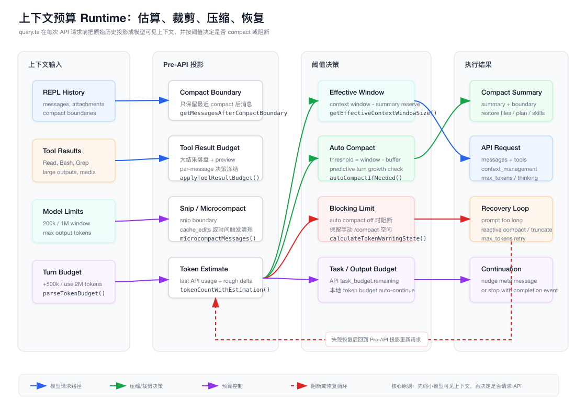
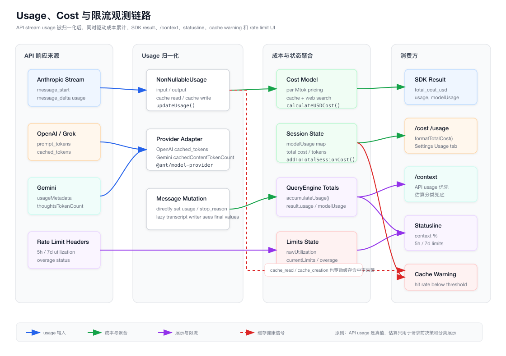

# 第 15 章：上下文预算、Token、压缩与成本控制 Runtime

> 本章只分析 `claude-code/` 子目录下的实现。所有源码路径都以 `claude-code/` 为根，文档与图表落在 `tech-docs/new/`。

上一章讲的是认证、模型供应商和 API Client Runtime。

它回答的问题是：

```text
模型请求应该发给谁？
怎么认证？
怎么把 Provider 差异归一化？
失败后怎么 retry / fallback？
```

这一章继续往模型请求的前后两侧推进。

一个长期运行的 Coding Agent 不只是把消息发给模型。它还必须持续回答这些问题：

```text
当前上下文到底有多少 token？
估算值和 API usage 哪个才可信？
距离 context window 还有多少空间？
tool_result 太大时先裁哪里？
什么时候自动 compact？
compact 后要恢复哪些状态？
prompt too long 之后怎么救回来？
max output tokens 被打满后是否继续？
本轮或本会话已经花了多少钱？
状态栏、/context、/usage 显示的数据从哪里来？
```

第 5 章已经从 Context Engineering 角度讲过 Memory、CLAUDE.md、system prompt、message history、compact、session memory 的整体设计。

本章不重复这些高层概念。

本章把视角收窄到运行时的预算系统：

- Token 如何被计量。
- 上下文如何在请求前被投影和裁剪。
- 压缩阈值如何计算。
- 失败恢复如何接入主循环。
- usage 如何转换为成本、状态栏和命令输出。

可以把第 5 章理解为“上下文系统的产品形态”，把本章理解为“上下文系统的资源调度器”。

## 15.1 源码入口总览

上下文预算和成本控制不是单个模块，而是横跨 query loop、compact、API stream、cost tracker 和 UI command 的一组链路。

核心文件如下：

| 模块 | 职责 |
| --- | --- |
| `src/utils/tokens.ts` | 从 assistant usage、消息增量和估算值中得到当前上下文 token 数 |
| `src/services/tokenEstimation.ts` | count_tokens API、Haiku fallback、粗略 token 估算 |
| `src/utils/context.ts` | context window、1M context、max output tokens、thinking budget 上限 |
| `src/query.ts` | 每轮模型请求前的 message view 投影、预算判断、compact 和恢复主流程 |
| `src/query/tokenBudget.ts` | 用户输入里的 `+500k`、`use 2M tokens` 解析与本轮 token target 续跑 |
| `src/utils/tokenBudget.ts` | token budget tracker、continuation nudge、diminishing returns 判断 |
| `src/utils/toolResultStorage.ts` | 大型 tool_result 落盘、preview 替换、per-message aggregate budget |
| `src/services/compact/autoCompact.ts` | 自动 compact 阈值、warning/error/blocking limit、compact circuit breaker |
| `src/services/compact/microCompact.ts` | time-based microcompact、cached microcompact、请求前轻量清理 |
| `src/services/compact/cachedMicrocompact.ts` | cache editing 形式的工具结果清理状态机 |
| `src/services/compact/apiMicrocompact.ts` | API context management 参数生成 |
| `src/services/compact/compact.ts` | compactConversation 主实现、summary、恢复文件/plan/skills/hooks |
| `src/services/compact/sessionMemoryCompact.ts` | auto compact 前优先尝试的 session memory compact |
| `src/services/compact/reactiveCompact.ts` | prompt too long / media too large 后的 one-shot reactive compact |
| `src/services/compact/snipCompact.ts` | snip boundary 和历史片段删除 |
| `src/services/compact/postCompactCleanup.ts` | compact 后清理各类缓存和运行态状态 |
| `src/services/api/claude.ts` | `max_tokens`、thinking、task_budget、context_management、stream usage、cost 累计 |
| `src/cost-tracker.ts` | 会话成本、模型 usage、token 总量、项目配置持久化 |
| `src/utils/modelCost.ts` | 不同模型的 input/output/cache/web search 计价 |
| `src/QueryEngine.ts` | SDK result 的 usage/cost 聚合、`maxBudgetUsd` 限制 |
| `src/utils/analyzeContext.ts` | `/context` 和 SDK context usage 的分类分析 |
| `src/commands/context/*` | `/context` 交互和非交互输出 |
| `src/commands/cost/cost.ts` | `/cost` 输出 |
| `src/commands/usage/usage.tsx` | `/usage` 设置页和订阅用量视图 |
| `src/services/api/usage.ts` | Claude.ai subscriber usage API |
| `src/services/claudeAiLimits.ts` | rate limit header、5h/7d utilization、overage 状态 |
| `src/utils/cacheWarning.ts` | prompt cache hit rate 警告 |
| `src/components/StatusLine.tsx` | 状态栏 context、cost、rate limit 输入 |

本章两张图先建立整体地图。

第一张图展示一次请求进入 API 之前，query loop 如何把历史消息投影成可发送上下文，并决定是否 snip、microcompact、auto compact、blocking 或进入恢复循环：



第二张图展示 API stream usage 如何归一化为成本、状态、命令输出、SDK result、状态栏和缓存警告：



## 15.2 Claude Code 里有四类 token 数字

读这套代码时，最容易混淆的是“token 数”不是一个概念。

至少有四类数字：

| 数字 | 来源 | 用途 |
| --- | --- | --- |
| 当前上下文 token | `tokenCountWithEstimation()`、API usage、粗略估算 | 判断 compact、blocking、`/context`、状态栏 |
| 输出 token | assistant `usage.output_tokens`、turn output baseline | 判断 max output recovery、本轮 token target |
| cache token | `cache_creation_input_tokens`、`cache_read_input_tokens`、`cache_deleted_input_tokens` | 计算真实 API 输入、成本、缓存命中率、cache edit 效果 |
| 计费 token | `calculateUSDCost()` 按模型价格换算 | `/cost`、`/usage`、SDK result、budget 限制 |

这几类数字不能混用。

例如：

- context warning 需要关心 input + cache creation + cache read，因为这些都占用本次请求可见上下文。
- `finalContextTokensFromLastResponse()` 故意只用 input + output，不把 cache token 算进去，因为它要对齐服务端 `task_budget.remaining` 的语义。
- max output recovery 关心 stop reason 和 output cap，不等同于 context window overflow。
- 成本计算需要 cache read、cache creation 和 web search request，不能只看 input/output。

所以代码里才会同时存在：

```text
getTokenUsage()
getTokenCountFromUsage()
tokenCountFromLastAPIResponse()
finalContextTokensFromLastResponse()
messageTokenCountFromLastAPIResponse()
getCurrentUsage()
tokenCountWithEstimation()
```

这些函数名字相近，但服务的决策不同。

## 15.3 tokenCountWithEstimation 是上下文大小的主入口

`src/utils/tokens.ts` 里的 `tokenCountWithEstimation(messages)` 是运行时判断当前上下文大小时最关键的函数。

它解决一个现实问题：

```text
API usage 只有模型真正返回 assistant message 之后才准确。
但 query loop 在下一次请求之前，还会追加用户消息、tool_result、attachments、meta message。
这部分新增内容没有 API usage，只能估算。
```

所以它采用混合策略：

```text
找到最近一个带真实 usage 的 assistant message
  -> 取这条 usage 作为历史基线
  -> 对这之后新增的 message 做 rough estimate
  -> 两者相加得到当前上下文估算
```

这比“把所有消息都粗估一遍”更稳定，也比“只信最后一次 API usage”更完整。

还有一个细节很重要：并行 tool call 可能把同一个 assistant message 拆成多条内部记录，它们共享同一个 `message.id`。

`tokenCountWithEstimation()` 在找到最近 usage-bearing assistant message 后，会继续往前回退到同 id 的第一条 sibling，然后把后续 interleaved tool_result 都纳入估算。

这避免了一个隐蔽 bug：

```text
assistant message A 拆成 A1、A2、A3
  -> A3 上有 usage
  -> A1/A2 后面夹着 tool_result
  -> 如果只从 A3 往后估算，会漏掉部分 tool_result
```

这也是为什么 Claude Code 没有简单用“最后一条 assistant 的 usage”作为上下文大小。

## 15.4 usage 只在真实 assistant 消息上可信

`getTokenUsage(message)` 只接受真实 assistant message 的 usage。

它会排除：

- synthetic assistant message。
- synthetic model。
- 没有 usage 的消息。

这条规则很关键。

Claude Code 会在会话中插入很多内部消息：

- compact boundary。
- visible transcript summary。
- cache warning。
- meta nudge。
- tool result replacement preview。
- session memory 或 plan attachment。

这些消息对 UI 或后续 prompt 有意义，但不应该冒充真实 API usage。

`getCurrentUsage(messages)` 还额外处理第三方 Provider 的一个常见问题：有些兼容接口会在流式过程中吐出全 0 usage placeholder。

如果状态栏直接消费这个 0，context counter 会突然闪成 0。

所以它从后往前找最新的非零 usage，并跳过无效 placeholder。

## 15.5 估算不是随便 chars / 4

`src/services/tokenEstimation.ts` 提供了两层估算：

第一层是 API 级 token count：

```text
countMessagesTokensWithAPI(messages, tools)
  -> Anthropic beta messages.countTokens
  -> Bedrock countTokens 特殊路径
  -> Gemini 走 rough estimate
```

第二层是 fallback：

```text
countTokensViaHaikuFallback(messages, tools)
  -> 用小模型 / 默认 Sonnet 发 max_tokens 很小的请求
  -> 读返回 usage
```

只有这些路径都不适合时，才退回 rough estimate。

rough estimate 也不是对所有内容统一处理：

| 内容 | 估算策略 |
| --- | --- |
| 普通文本 | 默认按约 4 bytes/token |
| JSON / JSONL / JSONC | 更激进，约 2 bytes/token |
| image / document block | 固定估 2000 tokens |
| tool_use | tool name + JSON input |
| tool_result | 递归估算内部 content |
| thinking / redacted_thinking | 按文本或 data 内容估算 |

image 和 document 不按 base64 长度估算，是一个很务实的选择。

base64 字符串很长，但模型侧看到的多模态 token 成本不等于字符串长度。用 base64 chars / 4 会严重夸大预算，导致过早 compact。

## 15.6 context window 不是硬编码 200k

`src/utils/context.ts` 定义了默认 context window：

```text
MODEL_CONTEXT_WINDOW_DEFAULT = 200_000
```

但真实窗口大小通过 `getContextWindowForModel(model, betas)` 解析，优先级大致是：

```text
CLAUDE_CODE_MAX_CONTEXT_TOKENS 环境变量覆盖
  -> 模型名带 [1m] 后缀
  -> 模型 capability.max_input_tokens
  -> 1M beta header
  -> Sonnet 1M 实验配置
  -> ant model config contextWindow
  -> 默认 200k
```

也就是说，200k 只是兜底，不是运行时事实。

同时，1M context 也不是无条件启用。

代码会考虑：

- `CLAUDE_CODE_DISABLE_1M_CONTEXT`。
- 模型是否支持 1M。
- 当前 betas 是否包含 1M beta header。
- 运行时实验配置。
- 模型 capability 是否被禁用或覆盖。

这解释了为什么 `/context`、statusline、auto compact 不能写死 200k。

## 15.7 max output tokens 是另一条预算线

context window 控制输入可见范围，`max_tokens` 控制模型一次最多生成多少。

`src/utils/context.ts` 里有几组关键常量：

```text
MAX_OUTPUT_TOKENS_DEFAULT = 32_000
MAX_OUTPUT_TOKENS_UPPER_LIMIT = 64_000
COMPACT_MAX_OUTPUT_TOKENS = 20_000
CAPPED_DEFAULT_MAX_TOKENS = 8_000
ESCALATED_MAX_TOKENS = 64_000
```

这些数字服务不同场景：

- 普通模型请求默认给较大的输出空间。
- compact summary 限制在 20k 内，避免压缩本身输出过长。
- slot reservation 特性开启时，默认请求可能先用 8k，命中 max tokens 再升级到 64k。
- thinking budget 不能等于或超过 max output tokens，因此会用 `maxOutputTokens - 1` 作为上限。

所以“模型说到一半停了”不一定是上下文窗口问题，也可能只是 output cap 被打满。

这两类恢复路径在 `query.ts` 里是分开的。

## 15.8 query loop 的请求前投影

第 3 章讲过 agent loop 的大结构。

本章只看每次请求模型前，`src/query.ts` 如何得到最终送进 API 的 messages。

顺序大致是：

```text
messagesForQuery = getMessagesAfterCompactBoundary(messages)
  -> 删除 UI-only toolUseResult payload
  -> applyToolResultBudget()
  -> snipCompactIfNeeded()
  -> microcompactMessages()
  -> applyCollapsesIfNeeded()
  -> appendSystemContext()
  -> autoCompactIfNeeded()
  -> blocking limit check
  -> predictive auto compact check
  -> callModel(prependUserContext(...))
```

这里有两个设计点。

第一，Claude Code 区分“完整会话记录”和“本次 API 可见视图”。

会话里可以保留完整 transcript，但 API 请求只看 compact boundary 之后的消息，且会先做裁剪、落盘、microcompact、snip。

第二，预算决策发生在尽可能接近 API 请求的位置。

因为只有这时才知道：

- 本轮新增了哪些 tool_result。
- system context 是否追加了新内容。
- compact boundary 后实际还剩多少消息。
- microcompact 是否已经释放了空间。
- session memory compact 是否成功。
- 当前模型的 context window 和 max output tokens 是多少。

如果把预算判断放在工具执行时或 UI 输入时，都会太早。

## 15.9 删除 toolUseResult payload 不是删 tool_result

`query.ts` 在请求前会遍历 user messages，把 `toolUseResult` 字段删掉。

这一步容易误解。

它不是删掉真正发给模型的 `tool_result` content。

`toolUseResult` 是 Claude Code 内部为了 UI 渲染、工具结果展示、恢复状态而挂在消息上的额外 payload。模型 API 只需要标准 message content。

所以这一步的目标是：

```text
UI 已经渲染过的内部字段，不再污染 API payload
```

真正控制大工具输出的是后面的 `applyToolResultBudget()` 和 microcompact。

## 15.10 大 tool_result 先落盘，再用 preview 替换

tool_result 是 Coding Agent 最容易爆上下文的来源。

一次 `Read` 大文件、一次 `grep` 大范围命中、一次 shell 输出大量日志，都可能让上下文从几万 token 涨到接近窗口上限。

`src/utils/toolResultStorage.ts` 的策略不是直接截断，而是：

```text
大型 text tool_result
  -> 写入会话目录下的 tool-results 文件
  -> API 消息里保留 preview
  -> preview 内带 persisted-output 标记和文件路径
```

这样做有三个收益：

- 模型仍能知道这个工具结果存在。
- 模型能看到前 2000 bytes 左右的 preview。
- 如需完整内容，可以通过文件路径再读取。

代码里还有一个小但重要的保护：

```text
空 tool result 会替换成 “tool completed with no output” 这类标记
```

原因是空结果在某些 stop sequence 边界上可能造成异常行为。一个明确的空输出标记比真正空字符串更安全。

## 15.11 per-message aggregate budget 保持 prompt cache 稳定

单个 tool_result 太大可以按单条阈值持久化。

但还有另一种情况：

```text
一次 assistant 并行调用很多工具
每个结果都不算巨大
合并到一个 API-level user message 后总量巨大
```

这时靠单条阈值不够。

`toolResultStorage.ts` 还有 per-message aggregate budget：

```text
collectCandidatesByMessage()
  -> 按 normalizeMessagesForAPI 的合并语义分组
  -> enforceToolResultBudget()
  -> 选择最大的 fresh results 替换
  -> applyToolResultBudget()
```

这里的关键不是只把消息变小，而是让替换决策稳定。

`ContentReplacementState` 会记录：

- 哪些 tool result 已经看过。
- 哪些 result 已经替换。
- 替换后的 preview 内容。

一旦某个 result 没被替换，后续不会因为窗口变紧又突然替换它。

一旦某个 result 被替换，后续会复用 byte-identical 的替换内容。

这对 prompt cache 很重要。

如果同一个历史前缀每轮都因为预算波动产生不同的 preview 文本，cache prefix 会频繁破坏，缓存命中率会下降。

## 15.12 snip 是显式历史删除，不是 summary

`src/services/compact/snipCompact.ts` 处理 snip boundary。

它和 compact 的区别是：

| 机制 | 行为 |
| --- | --- |
| compact | 把旧历史总结成 summary，再保留必要附件 |
| snip | 根据 boundary 删除指定历史消息或 boundary 之前历史 |

`snipCompactIfNeeded(messages)` 会找到最近的 `snip_boundary`。

如果 boundary metadata 里有 `removedUuids`，就删除这些消息。

如果没有 `removedUuids`，就保留 boundary 及其之后的消息。

它还会估算释放的 token 数，作为后续 warning state 的修正项。

这就是 `query.ts` 里经常出现的 `snipTokensFreed`。

## 15.13 microcompact 是请求前轻量清理

`src/services/compact/microCompact.ts` 的位置在 auto compact 之前。

它的目标是：

```text
尽量不生成 summary，只清理已经不值得继续占用上下文的工具结果。
```

当前实现里主要有三类路径。

第一类是 time-based microcompact。

如果距离上次 assistant 响应已经过了足够长时间，它会清掉旧的 compactable tool results，只保留最近 N 个。

compactable 工具包括：

- `Read`。
- shell 工具。
- `Grep`。
- `Glob`。
- `WebSearch`。
- `WebFetch`。
- `Edit` / `Write` 一类文件工具。

被清理的 tool_result 会替换成固定文案：

```text
[Old tool result content cleared]
```

第二类是 cached microcompact。

如果模型和运行条件支持 cache editing，Claude Code 不直接改本地 messages，而是在下一次 API 请求里发送 `cache_edits`。等 API 成功返回后，再根据 `cache_deleted_input_tokens` 建立真实边界。

这比本地粗暴删除更适合 prompt cache，因为它把清理动作交给模型 API 的 cache editing 语义。

第三类是 API context management。

`src/services/compact/apiMicrocompact.ts` 会根据 thinking、redacted thinking、tool result 状态生成 `context_management` 参数。

例如：

- 清理 thinking。
- 清理 tool results。
- 清理特定工具的输入。
- 设置 max input / target input。

这一路径不是在本地改 messages，而是把“如何管理上下文”的意图随请求发给 API。

## 15.14 auto compact 的阈值不是窗口上限

`src/services/compact/autoCompact.ts` 里最容易被误读的是 threshold。

自动 compact 不会等到 200k 或 1M 用满才触发。

它先算 effective window：

```text
effectiveWindow = contextWindow - reservedSummaryTokens
```

summary token reserve 通常取：

```text
min(modelMaxOutputTokens, 20_000)
```

原因很直接：compact 本身需要模型输出 summary。如果已经把窗口占满，就没有空间安全地产生 summary。

然后再留 buffer：

```text
autoCompactThreshold = effectiveWindow - autocompactBuffer
```

buffer 也不是固定 13k。

对于更大的窗口，buffer 会变大：

| effective window | autocompact buffer |
| --- | --- |
| `< 400k` | 13k |
| `>= 400k` | 30k |
| `>= 800k` | 50k |

这说明大窗口不是可以无脑贴边使用。

窗口越大，单轮工具结果、模型输出和恢复请求的波动也越大，所以需要更大的安全空间。

## 15.15 warning、error、blocking 是三条线

`calculateTokenWarningState(tokenUsage, model)` 同时计算几类状态。

可以按这张表理解：

| 线 | 作用 |
| --- | --- |
| warning threshold | UI 或状态提示，提醒接近压力区 |
| error threshold | 更严重的上下文压力提示 |
| auto compact threshold | 自动 compact 的触发线 |
| blocking limit | auto compact 关闭或无法处理时，请求前硬阻断 |

blocking limit 不是 context window 本身，而是：

```text
effectiveWindow - MANUAL_COMPACT_BUFFER_TOKENS
```

默认还会保留约 3000 tokens 空间。

这又是一个防守性设计：宁可提前阻断，也不要把请求发出去后稳定触发 prompt too long。

当然，如果 reactive compact 或 context collapse 接管了恢复逻辑，query loop 会避免重复阻断。

## 15.16 autoCompactIfNeeded 先试 session memory

`autoCompactIfNeeded()` 触发后，并不是立刻做普通 compact。

它先尝试：

```text
trySessionMemoryCompaction()
```

session memory compact 的目标是把一段旧历史沉淀为当前会话内可恢复的 memory，而不是生成完整 conversation summary。

默认配置大致是：

```text
minTokens = 10k
minTextBlockMessages = 5
maxTokens = 40k
```

它会从上次 summary 之后开始选择一段旧消息，并注意不要切断：

- tool_use / tool_result 对。
- thinking block 所属的同一 assistant message。

如果 session memory compact 成功：

- 更新 compact boundary。
- 重置 microcompact / collapse 等运行态。
- 执行 post compact cleanup。
- 通知 prompt cache 相关状态。

如果 session memory 不适用，才进入 `compactConversation()`。

## 15.17 compactConversation 的输出不是只有 summary

`src/services/compact/compact.ts` 的 `CompactionResult` 包含很多字段：

```text
boundaryMarker
summaryMessages
attachments
hookResults
messagesToKeep
userDisplayMessage
preCompactTokenCount
postCompactTokenCount
truePostCompactTokenCount
compactionUsage
```

最终 `buildPostCompactMessages(result)` 的顺序是：

```text
boundaryMarker
  -> summaryMessages
  -> stripped messagesToKeep
  -> attachments
  -> hookResults
```

这说明 compact 不是“把历史变成一条 summary”这么简单。

它还要恢复：

- 最近读过的文件。
- plan 和 plan mode 信息。
- invoked skills。
- async agent 结果。
- deferred tools。
- MCP instructions。
- SessionStart hooks 输出。

否则 compact 后模型虽然看到了“摘要”，但失去了继续工作的操作上下文。

## 15.18 compact 前会剥离多模态大对象

compact summary 本身也可能因为上下文太大失败。

所以 `compact.ts` 在生成 summary 前会做几类保护：

- 把 user message 里的 image / document 替换成 `[image]`、`[document]`。
- 去掉可重新注入的 skill discovery/listing attachments。
- prompt too long 时按 API round 从头截断，最多重试几次。
- compact summary streaming 失败时走 fallback streaming 路径。

compact 的目标不是保存所有原始字节，而是生成一个可继续工作的状态快照。

多模态原始内容、重复 skill listing、已经可恢复的附件，都不应该无限挤占 summary 请求。

## 15.19 post compact cleanup 清运行态，但保留技能上下文

compact 完成后，`runPostCompactCleanup()` 会清理很多缓存：

- microcompact state。
- context collapse state。
- user context cache。
- memory files cache。
- system prompt sections cache。
- classifier approvals。
- bash speculative checks。
- beta tracing。
- session messages cache。
- registered cleanup callbacks。

但它有两个刻意不做的动作：

第一，不清空 invoked skill content。

因为 compact 后要通过 invoked skills attachment 把已经调用过的技能重新交给模型。

第二，不重置 sent skill names。

否则下一轮可能重新塞入完整 skill listing，额外浪费约几千 token，并破坏 prompt cache。

这体现了 compact 后清理的核心原则：

```text
清掉运行时缓存，不清掉继续任务所需的语义状态。
```

## 15.20 reactive compact 是失败后的救援路径

auto compact 是请求前预防。

reactive compact 是请求失败后的救援。

`src/services/compact/reactiveCompact.ts` 目前实现很小，但它接入的位置很重要。

当 API 返回：

- prompt too long。
- media too large。

`query.ts` 会先 withholding 错误，不立刻展示给用户。

然后按顺序尝试：

```text
context collapse overflow recovery
  -> reactive compact
  -> 仍失败才把错误交给用户
```

reactive compact 只做 one-shot，避免失败后无限递归 compact。

如果 compact 成功，query loop 会重建 post compact messages，调整 task budget remaining，然后重新进入请求前流程。

## 15.21 context collapse 在当前实现中是接入点

`src/services/contextCollapse/*` 在当前代码里主要是 stub/no-op。

但 `query.ts` 已经预留了多个接入点：

- 请求前 `applyCollapsesIfNeeded()`。
- prompt too long 后 `recoverFromOverflow()`。
- `/context` 非交互分析前 `projectView()`。
- compact cleanup 后 reset collapse state。

所以教程里不要把它讲成完整落地的 collapse 算法。

更准确的说法是：

```text
当前源码已有 context collapse 的 runtime 插槽和 query loop 集成，
但本地实现主要是 gate / stub / no-op。
```

这一点在读代码时很重要，否则容易把未来能力误认为当前行为。

## 15.22 max output tokens recovery 和 prompt too long 不同

`query.ts` 对 `max_output_tokens` 的处理是另一条恢复链。

如果模型因为输出上限停下，代码不会去 compact。

它会先看是否能升级 output cap：

```text
默认 cap 较小时
  -> retry 到 ESCALATED_MAX_TOKENS
```

如果已经到上限或不能升级，就进入 continuation 循环。

query loop 会追加一条 meta user message，让模型直接从中断处继续，不要总结。

这个恢复最多会尝试有限次数，避免无限续写。

所以：

| 错误 | 恢复 |
| --- | --- |
| prompt too long | collapse / reactive compact / truncate |
| media too large | reactive compact strip retry |
| max output tokens | 升级 max_tokens 或 continuation |

不要把这些错误都归为“上下文太长”。

## 15.23 本地 token budget：`+500k` 是让 agent 多跑

`src/query/tokenBudget.ts` 解析用户输入中的 token target。

支持的形式包括：

```text
+500k
+1.5m
use 2M tokens
spend 2M tokens
```

解析结果会在 REPL 查询开始时写入当前 turn 的 budget baseline。

`src/utils/tokenBudget.ts` 的 `checkTokenBudget()` 在每轮模型返回后判断：

```text
如果本轮 output tokens 还没达到目标的 90%
  -> 继续

如果连续几轮收益很小
  -> 停止

如果已经有 continuation 并达到停止条件
  -> 记录 completion event
```

它的目标不是控制费用硬上限，而是表达用户意图：

```text
这轮任务允许你多花 token，继续深入做，不要太早总结结束。
```

UI 层还会在 spinner 显示 Target 进度和 ETA。

附件系统也能在特性开关下追加 output token usage 附件，让模型知道当前 turn 的消耗状态。

## 15.24 API task_budget 是另一套预算

`src/services/api/claude.ts` 里还有一个 `task_budget`。

它通过 `output_config.task_budget` 发送给 API，并带特定 beta header。

这和用户输入的 `+500k` 不是同一个东西。

| 预算 | 所在层 | 作用 |
| --- | --- | --- |
| 本地 token budget | Claude Code query loop | 决定是否继续追加 meta nudge 让 agent 多跑 |
| API task_budget | Claude API output_config | 把总量和 remaining 交给服务端任务预算机制 |

compact 后，`query.ts` 会用 `finalContextTokensFromLastResponse()` 调整 remaining。

这里故意不把 cache read / cache creation 算进 final context token，因为它要对齐服务端 task budget 的计算方式。

## 15.25 API 请求里的 max_tokens、thinking、context_management 同源决策

`queryModel()` 最终进入 `src/services/api/claude.ts`。

构造参数时，它会同时决定：

- `max_tokens`。
- thinking 配置。
- `output_config.task_budget`。
- `context_management`。
- 1M beta。
- speed / fast mode。

这些参数不能独立看。

例如 thinking 开启时：

```text
thinking budget <= max_tokens - 1
```

如果请求被降级为 non-streaming 或 max token cap 改变，thinking budget 也必须跟着下调。

再比如 API context management 只有在对应 beta 存在时才发送，否则同样的本地状态不会变成 API 参数。

这也是预算逻辑集中在 `claude.ts` 的原因：它必须同时知道模型、betas、Provider、thinking、max output 和 task budget。

## 15.26 stream usage 是成本和状态的事实来源

模型请求成功后，真实 usage 来自 stream event。

`src/services/api/claude.ts` 的 `updateUsage()` 会累计：

- input tokens。
- output tokens。
- cache creation tokens。
- cache read tokens。
- cache deleted input tokens。
- server tool use。
- web search / web fetch。
- inference geo。
- iterations。
- speed。

有一个细节非常重要：

```text
message_delta 到来时，代码直接 mutation 最后一条 assistant message 的 usage 和 stop_reason。
```

它没有替换整个对象。

原因是 transcript writer 可能持有同一个对象引用。直接 mutation 可以让延迟写 transcript 的逻辑看到最终 usage。

这属于典型的 runtime 细节：从纯函数角度看不漂亮，但服务于流式写入和最终记录一致性。

## 15.27 成本计算按模型价格，不按 Provider 统一价

`src/utils/modelCost.ts` 维护模型价格。

成本大致由这些部分组成：

```text
input tokens
output tokens
cache creation tokens
cache read tokens
web search requests
```

不同模型价格不同：

- Sonnet 标准价。
- Opus 4 / 4.1。
- Opus 4.5 / 4.6。
- Opus 4.6 fast mode。
- Haiku 3.5 / 4.5。
- 未知模型 fallback。

`calculateUSDCost(resolvedModel, usage)` 只负责把 usage 换成美元。

它不负责保存会话状态。

保存由 `src/cost-tracker.ts` 完成。

这两个模块的边界很清晰：

| 模块 | 职责 |
| --- | --- |
| `modelCost.ts` | 单次 usage 如何计价 |
| `cost-tracker.ts` | 会话累计、模型维度 usage、持久化、展示格式 |

## 15.28 会话成本会持久化到项目配置

`cost-tracker.ts` 不只是内存计数器。

它会保存：

- last cost。
- API duration。
- wall duration。
- lines added / removed。
- total input / output。
- cache read / cache creation。
- web search request。
- FPS metrics。
- last model usage。
- session id。

保存时会校验是否同一个 session id，避免把不同会话的成本串起来。

`formatTotalCost()` 会根据这些状态生成 `/cost` 或退出摘要里的展示内容。

如果模型未知，成本字符串会标注可能不准确。

这比直接打印一个美元数字更诚实。

## 15.29 QueryEngine 负责 SDK result 级聚合

`src/QueryEngine.ts` 在 SDK/headless 场景里继续做 usage 聚合。

它会在 stream 生命周期里：

```text
message_start
  -> reset currentMessageUsage

message_delta
  -> update currentMessageUsage

message_stop
  -> accumulateUsage()
```

最终 result message 会包含：

- `total_cost_usd`。
- `usage`。
- `modelUsage`。
- fast mode state。
- permission denials。

此外，`QueryEngine` 还支持 `maxBudgetUsd`。

每次 yield 后，如果 `getTotalCost()` 已经超过预算，就返回 `error_max_budget_usd` 结果。

这是费用硬上限，不同于第 15.23 讲的本地 token target。

## 15.30 /context 优先展示 API usage

`src/utils/analyzeContext.ts` 是 `/context` 的核心。

它会把上下文拆成多个分类：

- system prompt。
- system tools。
- MCP tools。
- deferred tools。
- custom agents。
- memory files。
- skills。
- messages。

对于 messages，它还会进一步拆：

- user messages。
- assistant messages。
- tool calls。
- tool results。
- attachments。
- top tool result types。
- duplicate file reads。

但最终 total tokens 的来源有优先级：

```text
如果原始消息里有 API usage
  -> 用 input + cache creation + cache read
否则
  -> 用估算
```

这和状态栏保持一致：能用真实 usage 时，不用估算值冒充事实。

`/context` 在交互和非交互路径里也会模拟真实 query 前视图：

```text
getMessagesAfterCompactBoundary()
  -> context collapse projectView()
  -> microcompactMessages()
  -> analyzeContextUsage()
```

所以它展示的是“下一次 API 大概率会看到的上下文”，而不是完整 transcript 的原始大小。

## 15.31 /context 的工具 token 分析不只是 messages

`analyzeContextUsage()` 还会统计工具定义本身的 token。

这些内容包括：

- built-in tools。
- MCP tools。
- deferred tools。
- custom agents。
- slash commands。
- skills。

工具 token 的估算会通过 token API，并减去一段固定 API overhead，避免把工具 schema 的协议开销当成具体工具本身的成本。

当 tool search 开启且某些 deferred / MCP tools 尚未加载时，`/context` 会展示它们，但不把它们计入已加载工具 token。

这能解释一个常见现象：

```text
为什么 /context 里能看到一些工具名字，
但 token 总量不像完整 tool schema 全部塞进来了？
```

答案是：可发现不等于已注入。

## 15.32 状态栏拿到的是统一 JSON 输入

`src/components/StatusLine.tsx` 会构造传给用户自定义 statusline command 的输入 JSON。

其中和本章相关的字段包括：

- current model。
- cost。
- duration。
- lines added / removed。
- context window。
- total input tokens。
- total output tokens。
- current usage。
- used / remaining。
- rate limits。

context 百分比来自：

```text
getCurrentUsage(messages)
  -> getContextWindowForModel(runtimeModel, getSdkBetas())
  -> calculateContextPercentages()
```

`calculateContextPercentages()` 只用：

```text
input_tokens + cache_creation_input_tokens + cache_read_input_tokens
```

它故意不把 output tokens 放进 context percentage。

因为状态栏要表达的是“当前请求输入侧已经占了多少窗口”，不是“历史账单里输出过多少字”。

## 15.33 rate limit 和订阅使用量来自另一条链

上下文 token 和成本之外，Claude Code 还显示 Claude.ai subscriber 的限额状态。

相关文件是：

```text
src/services/api/usage.ts
src/services/claudeAiLimits.ts
```

`fetchUtilization()` 只在 Claude.ai subscriber 且有 profile scope 时调用 usage API。

`claudeAiLimits.ts` 处理统一 rate limit headers，维护：

- 5 小时 utilization。
- 7 天 utilization。
- reset 时间。
- overage 状态。
- provider bucket。
- fallback availability。
- currentLimits。

状态栏的 `rate_limits` 字段来自这些 raw utilization 状态。

这说明 `/usage` 里的订阅限额、状态栏里的 5h/7d、API cost 不是同一个数据源。

它们只是最终在 UI 上并列展示。

## 15.34 cache warning 用 hit rate，而不是猜测

`src/utils/cacheWarning.ts` 负责 prompt cache 警告。

它计算：

```text
cache_read_input_tokens
/
(input_tokens + cache_creation_input_tokens + cache_read_input_tokens)
```

得到 cache hit rate。

如果没有 cache 字段或总量为 0，就返回 null，不做警告。

警告还有两个保护：

- 每个 querySource 单独记状态。
- 第一轮请求不警告。

第一轮没有历史趋势，cache hit 低不一定有问题。

只有后续请求 hit rate 低于 settings 里的 threshold，才生成 cache warning message。

这和第 15.11 的替换决策稳定性连在一起：

```text
预算裁剪如果不断破坏前缀，cache hit rate 会下降；
cache warning 则把这个现象暴露给用户或 transcript。
```

## 15.35 第三方 Provider 的 usage 要先归一化

上一章讲过 OpenAI、Gemini、Grok、`@ant/model-provider` 的适配。

在本章视角下，它们的关键任务是把各自 usage 转成 Claude Code 内部统一字段。

例如：

| Provider | 原始字段 | 内部字段 |
| --- | --- | --- |
| OpenAI | `prompt_tokens` | `input_tokens` |
| OpenAI | `completion_tokens` | `output_tokens` |
| OpenAI | `prompt_tokens_details.cached_tokens` | `cache_read_input_tokens` |
| Gemini | `usageMetadata.promptTokenCount` | `input_tokens` |
| Gemini | `candidatesTokenCount` + `thoughtsTokenCount` | `output_tokens` |
| Gemini | `cachedContentTokenCount` | `cache_read_input_tokens` |

如果不先归一化，后面的 `calculateUSDCost()`、`getCurrentUsage()`、`StatusLine`、`QueryEngine` 都要理解每个 Provider 的字段。

Claude Code 把差异压在 adapter 层，后面统一消费 Anthropic-like usage。

## 15.36 Prompt too long 的恢复链路

`query.ts` 对 prompt too long 的处理可以拆成四步。

第一步，先 withholding error。

也就是暂时不把错误输出给用户，因为系统还有恢复机会。

第二步，如果 context collapse 开启且不是刚刚 collapse retry 过，就调用 overflow recovery。

当前源码里 collapse 是 no-op，但 query loop 的接入点在这里。

第三步，尝试 reactive compact。

如果 compact 成功：

- 调整 task budget remaining。
- 重建 post compact messages。
- 继续 query loop。

第四步，如果仍然失败，才 yield 原始 API error。

还有一个保护：prompt too long 之后不运行 stop hooks。

原因是 stop hooks 也可能追加上下文或触发新请求，导致在溢出状态下进入失败循环。

## 15.37 predictive auto compact 避免下一轮增长打爆窗口

auto compact 不只看当前 token 是否超过 threshold。

`query.ts` 里还有 predictive check：

```text
currentTokens + estimateMaxTurnGrowth(model)
  >= effectiveWindow
```

`estimateMaxTurnGrowth(model)` 大致由两部分组成：

```text
min(model max output tokens, 20k)
  + TOOL_RESULT_GROWTH_ESTIMATE
```

默认 tool result 增长估计约 15k。

这表示即使当前还没到阈值，只要下一轮合理增长可能打爆窗口，也可以提前 compact。

这对 Coding Agent 很重要，因为一次工具执行后的增长不是线性的：

- 一次 grep 可能新增很多结果。
- 一次 test run 可能输出大量失败日志。
- 一次 agent tool 可能回传长总结。
- 模型下一轮可能输出很长 patch 或解释。

等真的超出窗口再处理，恢复成本更高。

## 15.38 从 0 实现时的最小方案

如果你自己实现一个 Claude Code 类似的 Coding Agent，不建议一开始照搬所有机制。

可以按四层演进。

第一层，建立可靠计数：

```text
保存每次 assistant usage
  -> 当前上下文 = 最近真实 usage + 新增消息估算
  -> 粗估 fallback
```

没有这层，后面的 compact 和预算都没有地基。

第二层，处理大 tool_result：

```text
单条结果超过阈值
  -> 落盘
  -> prompt 里保留 preview 和读取路径
```

这比直接截断更利于继续工作。

第三层，实现自动 summary compact：

```text
contextWindow - summaryReserve - buffer
  -> 触发 compact
  -> summary + preserved tail + restored attachments
```

注意一定要保留 tail，不要把所有历史都总结掉。

第四层，接入成本和可观测：

```text
stream usage
  -> session cost
  -> /context
  -> statusline
  -> cache hit warning
```

先有可观测，再调阈值。

否则你只会看到“模型突然忘了”或“突然变贵了”，但不知道是哪一段上下文造成的。

## 15.39 调试上下文膨胀的检查顺序

遇到上下文迅速膨胀时，可以按这个顺序排查源码和运行现象。

第一，看 `/context` 的 message breakdown。

重点看：

- tool results 是否占比异常高。
- duplicate file reads 是否多。
- attachments 是否过大。
- MCP tools 或 deferred tools 是否被大量加载。
- skills 是否重复注入。

第二，看最新 assistant usage。

检查：

- input_tokens。
- cache_creation_input_tokens。
- cache_read_input_tokens。
- output_tokens。
- stop_reason。

第三，看是否发生过 compact。

在 transcript 或日志里找：

- compact boundary。
- preCompactTokenCount。
- postCompactTokenCount。
- truePostCompactTokenCount。
- compactionUsage。

第四，看 prompt cache 是否被破坏。

检查：

- cache hit rate。
- cache warning。
- tool result replacement 是否每轮变化。
- microcompact 是否清理了大量历史。

第五，看 Provider usage 适配。

如果是 OpenAI / Gemini / Grok，确认 adapter 是否正确填了 input/output/cache 字段。

很多“状态栏不对”问题，本质是 usage 归一化出了问题。

## 15.40 测试覆盖应该集中在哪些行为

本章涉及很多运行时状态，测试不应该只测纯函数。

已有测试可以先看：

```text
src/utils/__tests__/tokens.test.ts
src/utils/__tests__/tokenBudget.test.ts
src/services/compact/__tests__/cachedMicrocompact.test.ts
src/services/compact/__tests__/snipCompact.test.ts
```

如果扩展这套系统，建议补这些测试：

| 行为 | 测试重点 |
| --- | --- |
| usage + rough estimate 混合计数 | 新增消息只估算增量，不重复累计历史 |
| 并行 tool calls | 同 message id sibling 不漏算 interleaved tool_result |
| 大 tool_result 落盘 | preview 稳定、重复调用不改写、空结果有标记 |
| per-message budget | 替换决策跨轮稳定，resume 后可重建 |
| auto compact threshold | 1M window、env override、summary reserve、buffer |
| prompt too long recovery | withholding error、reactive compact 成功后继续 |
| max output recovery | cap upgrade、continuation 次数上限 |
| token budget | 90% 阈值、diminishing returns、agentId 场景跳过 |
| cost tracker | cache read/write、web search、unknown model fallback |
| `/context` | API usage 优先，估算 fallback，microcompact 后视图 |

预算系统的 bug 往往不是“函数返回错一个数”这么简单，而是跨轮状态被破坏。

所以测试要覆盖 resume、compact boundary、同一消息重复发送、Provider usage 归一化这些场景。

## 15.41 这套设计的核心取舍

Claude Code 的上下文预算系统有几个明显取舍。

第一，优先相信 API usage，但不等待 API usage。

真实 usage 最准确，但只在请求后出现。请求前必须用估算补足增量。

第二，先做无损或低损裁剪，再做 summary compact。

落盘 preview、microcompact、snip 都比 summary 更便宜。summary compact 是更重的状态转换。

第三，compact 后恢复上下文，而不是只保留摘要。

文件、plan、skills、hooks、tools、MCP instructions 都可能是继续工作的关键。

第四，错误恢复和主动预防并存。

auto compact 负责提前留空间，reactive compact 负责 prompt too long 后救援，max output recovery 负责续写。

第五，成本和上下文同源于 usage，但展示目标不同。

context percentage 关心窗口占用，cost 关心计费，token target 关心本轮推进深度，rate limit 关心订阅限额。

这些指标共享数据，但不能合并成一个“token 数”。

## 15.42 本章小结

本章拆的是 Claude Code 的上下文预算、Token、压缩和成本控制 Runtime。

主线可以压缩成一句话：

```text
query.ts 在每次 API 请求前构造一个预算可控的可见上下文；
tokens.ts / tokenEstimation.ts 给它提供真实 usage 与估算；
autoCompact / microCompact / toolResultStorage / snip / reactiveCompact 负责控制体积；
claude.ts / cost-tracker / analyzeContext / StatusLine 把 API usage 变成成本和可观测状态。
```

读完这一章后，再回头看 Claude Code 的长任务稳定性，会更容易理解几个现象：

- 为什么工具输出经常只保留 preview。
- 为什么还没到 200k 就 auto compact。
- 为什么 compact 后文件、plan、skills 会被重新注入。
- 为什么状态栏的 context percentage 不等于总输出 token。
- 为什么 max output tokens 被打满后不是立刻 compact。
- 为什么 cache warning 和 tool result replacement 稳定性有关。

下一章可以继续深入：

```text
Prompt Cache、Cache Editing 与请求前缀稳定性
```

这一章已经多次碰到 prompt cache，但只从预算系统角度使用它。

下一章再专门拆：Claude Code 如何维护可缓存前缀、如何避免无意义破坏 cache、cache editing 如何和 microcompact 配合，以及这些机制如何影响长会话成本和延迟。
